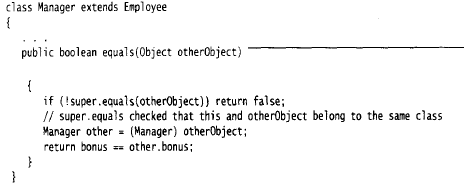
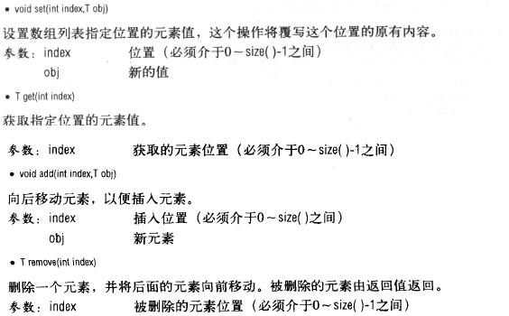
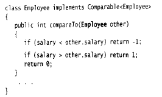
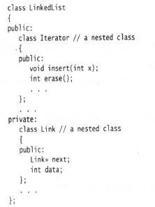
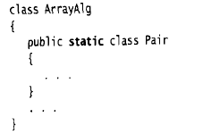
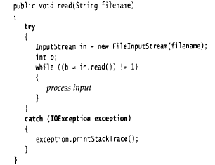
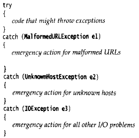
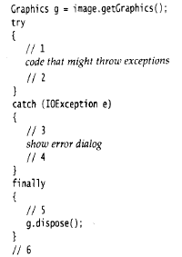
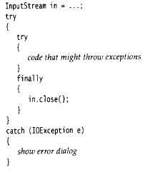
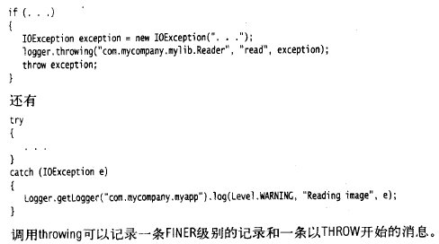

layout: "post"
title: "Java Core"
categories: Java
---

# Java 核心技术

## 命令行参数

如在控制台输入java Message –h cruel world

args的参数包含如下：

    args[0]=”-g”
    args[1]=”cruel”
    args[2]=”world”

## 面向对象

一个对象变量并没有实际包含一个对象，而仅仅引用一个对象。new操作符的返回值也是一个引用。相当于C++中的对象指针。Java中的null相当于C++中的NULL。

## 时钟类

GregorianGalendar类扩展了Calendar类。

默认构造函数构造一个表示对象被创建时的日历对象。可以创建特定年月日的对象，如

    new GregorianCalendar(1999,Calendar.December,32)或者
    new GregorianCalendar(1999,11,32)

月份从0开始计数。也可以构造具有年月日时分秒的日历对象。

访问日历中的年月日等，如

    int month=now.get(Calendar.MONTH);
    int weekday=now.get(Calendar.DAY_OF_WEEK);

设置对象的状态，如：

    deadline.set(Calendar.YEAR,2001);
    deadline.set(Calendar.MONTH,Calendar.APRIL);
    deadline.set(Calendar.DAY_OF_MONTH,15);

为给定的日历对象添加天数、星期数、月数等

    deadline.add(Calendar.MONTH,3);

Data与GregorianCalendar的变换(Date类无法操纵日历)

    Data time=calendar.getTime();
    calendar.setTime(time);

可以通过DateFormatSymbols类来获取别国语言的星期几的名称。

## java的编译

文件名必须和ppublic类的名字相匹配，在一个源文件中，只能有一个公有类，但可以有任意数目的非公有类。

编译方法：

1. 通配符调用java编译器，如java Employee.java,将编译所有以Employee开头的源文件。
2. javac EmployeeTest.java 由于EmployeeTest中使用了Employee，所以编译器将自动编译Employee类。
3. Employee number(“James Bond”,100,1950,1,1);
这条语句在C++中能够正常运行，但在java中不能运行。

## java程序员应该注意的几个问题

- 不要编写返回引用可变对象的访问器的方法，因为在类外可以改变这个引用的状态，起不到访问器的作用。

    一个方法可以访问所属类的所有对象的私有数据。例如：

    Class Employee{
        boolean equals(Employee other){
            return name.equals(**other.name**);
        }
    }

- final：在创建变量之后，指能够为之赋值一次，此后再也不能改变它的值了。final可以应用于局部变量两、实例变量和静态变量。不过，在定义final变量时，可以不必初始化。

    对于可变的类，使用final修饰符可能会对读者造成混乱，如  

        private final Date hiredate;

    仅仅意味着存储在hiredate变量中的对象引用在对象构造之后不能被改变，而并不意味着hiredate对象是一个常量，任何方法都可以对hiredate引用的对象调用setTime更改器。

    而对于不可变的类，用final修饰符修饰则以为着它作为一个常量，如

        private final String name;

    static(用法如：private static int nextId=1)

    类的所有实例共享同一个静态域，静态域属于类，而不属于任何对象。

    类常量，如 public static final double PI=2.1415926;

- 静态方法

    因为静态方法不能操作对象，所以不能在静态方法中访问实例域，但是，静态方法可以访问自身类中的静态域。如：

        public static int getNextID(){return nextID;}

    可以使用对象调用静态方法，但不建议这么用。

    每一个类(不管类的权限如何)都可以有一个main方法，用来对类进行测试。

- Java中方法参数的使用情况

    1. 一个方法不能修改一个基本数据类型的参数。
    2. 一个方法可以改变一个对象参数的状态。
    3. 一个方法不能让对象参数引用一个新的对象。

- 方法重载：

    返回类型不是方法签名的一部分，也就是说，不能有两个名字相同，参数类型也相同却返回不同类型值的方法。

- 构造函数

    如果类中提供了至少一个构造器，但是没有提供默认的构造器，那么在构造对象时若不提供构造参数就被视为不合法。默认构造函数中，数值型数据设置为0，布尔型数据设置为false，所有对象变量将设置为null。如果希望所有域拥有默认值，则可以提供下列格式的构造器：

        public ClassName(){}

    显示域初始化，如：

        class Employee{
            private String name=“”;
        }

    域也可以通过调用方法来进行初始化：

        class Employee{
            static int assignId(){
                int r=nextId;
                nextId++;
                return r;
            }
            private int id=assignId();
        }

    在C++中，不能直接初始化实例域，所有的域必须在构造器中设置。但是，有一种特殊的初始化器列表语法，如：

        Employee::Employee(String n, double s):name(n),salary(s){

        }

    一个构造器调用同一个类的另一个构造器，如：

    public Employee(double s){
        this(“Emploee \#”+nextId,s);
    }

    this构造函数只能写在第一行。

    Java中的this等价于C++的this指针，但是C++中，一个构造器不能调用另一个构造器。

    初始化块，如：

        {
        id=nextId;
        nextId++;
        }

    调用构造器的具体处理步骤：

    1. 所有数据域被初始化为默认值
    2. 按照在类声明中出现的次序依次执行所有域初始化语句和初始化块
    3. 如果一个构造器调用了另外一个构造器，则执行第二个构造器的主体。
    4. 继续执行这个构造器的主体。
    5. 静态域初始化：

    static int nextId=1；

    使用静态的初始化块：

        static{
            Rondom generator=new Random();
            nextId=generator.nextInt(1000);
        }

    6. 当参数名与实例域名相同时，实例域被屏蔽，此时可以通过隐式参数来初始化实例域，如：

        public Employee(String name,double salary){
            this.name=name;
            this.salary=salary;
        }

- 使用Java编写一个没有main方法的“Hello, World”程序：

    public class Hello{
        static{
           System.out.println(“Hello, World”);
        }
    }

    在静态初始化块的尾部调用System.exit(0)来避免main is not defined的错误。

- 类的导入(import)

    在所有的源代码的顶部，在package语句的后面。

    采用两种方式访问另一个包中的公有类

    1. 添加完整的包名，如 java.util.Date today=new java.util.Date();
    2. import语句导入一个特定的类或者整个包，如：import java.util.\*;

        或import java.util.Date

    当导入的包中包含相同名称的类名时，使用这个类将出现编译错误，如：

    import java.util.\*;
    import java.sql.\*;

    使用Date today=new Date()时出错。

    此时，可以增加一个特定的import语句来解决这个问题，如

        import java.util.\*;
        import java.sql.\*;
        import java.util.Date;

    当需要同时使用两个包中的类时，则在每个类名前面加上完整的包名。

    Java中的import和package相当于C++中的using和namespace指令。

- 静态导入

    添加一条指令，import static java.lang.System.\*;

    则可以可用System类的静态方法和静态域，而不必加类名前缀。

    还可以导入特定的方法或域，如：

        import static java.lang.System.out;

    导入静态方法和静态域有两个实际的应用：

    算数运算，如import java.Math

        sqrt(x,2)+pow(y,2);

    笨重的常量，如

    if(d.get(DAY_OF_WEEK)==MONDAY)…

- 将类放入包中(package)

    如果没有在源文件中放置package语句，那么源文件中的类奖被放置在一个默认包中。

    编译器对带有文件分隔符和扩展名.java的文件进行操作，而java解析器对带.分隔符的包进行操作。

    jre/lib目录下的rt.jar包含数千个运行时的类。

    在UNIX下，类路径的不同项目之间是采用：分割的，Windows下采用；分隔，“.”表示当前目录。

- 类路径包括：

    - 基目录，如/home/user/classdir或c:\\classes
    - 当前目录
    - jar文件，如/home/user/archives/archive.jar或c:\\archives\\archive.jar

        运行时库(在jre/lib和jre/lib/ext目录下的rt.jar和一些其它的jar文件)会被自动搜索，所以不必将它们显示地列在类路径中。

        类路径所列出的目录和归类文件是搜索类的起始点。

    设置类路径，两种方法：

    - 为编译器和字节码制定-classpath选项，如：

        javac –classpath /home/user/classdir:./:/home/user/archives.jar MyProg.java

        也可以用-cp代替-classpath。

    - 设置CLASSPAT环境变量。

    java5.0以后不必设置类路径就可以编译当前目录的类。

    编译技巧：javac –d . Hello.java 将编译后的字节码文件直接加到package目录下。


    javac编译器总是在当前目录中查找文件，而java解释器仅在类路径中有“.”目录的时候，才查看当前目录。如果没有设置类路径，并不会产生什么问题，默认的类路径包含“.”目录。然而如果设置了类路径但忘记了包含“.”目录，程序仍然可以通过编译，但不能运行。

- 包作用域

    对于方法和域，标记为public的部分可以被任意的类实用，标记为private的部分只能被定义在它们的类实用。如果没有指定public和private，那么这部分可以被同一个包中的所有类实用。

- 文档注释

    javadoc 应用程序(utility)从下面的一个特性抽取信息：

    包、公有类和接口、公有的和受保护的方法、公有的和受保护的域

    每个/\*\*…\*/文档注释在标记之后紧跟着自由格式文本，标记以\@开始，如\@author等。自由格式文本中，可以使用HTML修饰符，如用于强调的\<em\>…\</em\>,用于设置等宽打字机的\<code\>…\</code\>,用于着重强调的\<strong\>…\</strong\>以及包含图像的\等。但是，不要用\<h1\>或\<hr\>，因为他们与文档的格式产生冲突。


    如果文档中有到其它文件的链接，如图像文件，则应该把这些文件放到子目录doc-files中，javadoc将从源目录拷贝这些目录及其中的文件到文档目录中。

    - 类注释：必须放在import语句之后，类定义之前。
    - 方法注释：必须放在所描述的方法之前
    - 域注释：只需要对公有域建立文档(通常指静态常量)
    - 通用注释

        下列标记用在类文档的注释中

        - \@author name:产生一个“author”条目
        - \@version text 产生一个“version”条目

        下列标记用于所有的文档注释

        - \@since text:text可以使引入特性的版本描述，如\@since version
        - \@deprecated text 对类、方法或变量增加一个不再使用的注释，text给出了取代的建议，如: \@deprecated Use \<code\>setVisible(true)\</code\> instead 通过使用\@see和\@link标记，可以使用超级链接，链接到javadoc文档的相关部分或外部文档。

        - see reference:将在see also部分添加一个超级链接，可以用于类、方法中。

        - 包与概述注释

            要想产生包注释，就需要在每一个包目录中添加一个package.html的文件。在标记\<BODY\>…\</BODY\>之间的所有文本都会被抽取出来。还可以为所有的源文件提供一个概述性的注释，这个注释被放置在一个名为overview.html的文件中，该文件为于所有包含源文件的父目录中。

        - 注释的抽取

            在源文件目录，执行下列命令：

            javadoc –d docDirectory nameOfPackage,nameOfPackage,…

            如果在默认包中，就应该执行：

            javadoc –d docDirectory \*.java

            如果省略-d docDirecotry，则html文件提取到当前目录。

- 类的设计技巧

    - 将数据设计为私有
    - 一定要对数据初始化。Java不对局部变量进行初始化，但是会对对象的实例域进行初始化。
    - 不要在类中使用过多的基本数据类型，可以用其他的类代替多个相关的基本数据类型的使用。
    - 将职责过多的类进行分解。

## 继承

__继承格式__

    class Manager extends Employee{
    }

Java用关键字代替C++中的：，在Java中，所有的继承都是公有继承，而没有C++中的私有继承和保护继承。

子类不能直接访问超类的私有成员，调用超类的方法时，可以使用关键字super，如super.getSalary()。this和super不是类似的概念，因为super不是对象的引用，不能将super赋值给一个对象变量，它只是一个指示编译器调用超类方法的特有关键字。

C++中调用超类的方法为超类名加上：：操作符，如Employee::getSalary。

super可以用来调用超类的构造器，如super(n, s, month, day); 使用super调用构造器的语句必须是子类构造器的第一条语句。如果子类的构造器没有显示地挑用超类的构造器，则将自动地调用超类默认(没有参数)的构造器。如果此时超类没有默认的构造器，则Java编译器将报告错误。

在C++中，使用初始化列表语法调用超类的构造函数，而不调用super，如：

    Manager::Manager(String n, double s):Employ(n, s){
        bonus=0;
    }

一个对象变量可以引用多种实际类型(如Employee对象引用Employee和Manager对象)，在运行时它能够自动地选择调用的是适当的方法。Java不支持多继承。可以将一个子类对象的引用赋值给一个超类变量，但是不能用这个引用调用子类的方法，不能将一个超类的引用赋给子类变量。

```
Manager[] managers=new Manager[10];
staff[0]=new
Employee(…);
```

编译器能够接纳这个赋值操作，此时，staff[0]和managers[0]引用的是用一个对象，当调用managers[0].setBonus(1000)的时候，将会导致访问一个不W在的实例域，进而搅乱邻近存储空间的内容。W

过程在重载解析时，由于存在类型转化(如int可以转化为double型，Manager可以转化成Employee等)，所以，如果编译器没有找到与参数类型匹配的方法，或者发现经过类型转化后又多个方法与之匹配，就会报告错误。如果在子类中定义了一个与超类签名相同的方法，那么子类中的这个方法就覆盖了超类的这个同签名的方法，但是子类方法的返回类型必须是原返回类型的子类型。如：

父类：

```
public Employee getBuddy(){
    …
}
```

子类：

```
public Manager getBuddy(){
…
}
```

__动态绑定__

如果是private、static、final或者构造器，编译器可以准确地知道应该调用哪个方法即静态绑定。采用动态绑定时，虚拟机一定调用与x所引用对象的实际类型最合适的那个类方法。如果调用super.f(param)，编译器将对隐式参数超类的方法表进行搜索。

Employee e;

当e引用的是它的子类的一个实例时，如果子类覆盖了父类的方法，则用e调用这个方法时，调用的将是相应子类的方法。

__阻止继承__：final类和final方法

声明格式如：

```
final class Executive extends Manager{
    …
}
```

final类不允许扩展，其中的方法自动成为final方法，不包括域。对于final域，创建对象后酒不孕需改变它们的值。类中的方法可以被声明为final，子类就不能覆盖这个方法。

如果一个方法没有被覆盖并且很短，编译器就能够对它进行优化处理及内联，如e.getName()被替换为e.name。

将一个子类的引用赋值给一个超类变量编译器是允许的，但是将一个超类的引用赋值给一个子类变量，必须进行强制转换。在进行类型转换之前，先察看以下是否能够成功地转化，如：

```
if(staff[1] instanceof Manager){
    boss=(Manager) staff[1];
}
```

如果x为null，那么 x instanceof C不会产生异常，而是返回false。

其处理过程类似于C++中的dynamic_cast操作，如:

```
Manager boss=(Manager) staff[1];
```

=

```
Manager \* boss=(dynamic_cast)\<Manager \*\>(staff[1]);
```

当类型转化失败时，Java不会生成一个null对象，而是抛出一个异常。

__抽象类__

格式如：

```
abstract class Person{
    public abstract String getDescription();
}
```

抽象类除了抽象方法之外，还可以包含具体数据和具体方法。在抽象类的子类中，仍然可以不定义抽象方法，而仍保持抽象性。即使不含抽象方法，也可以将类声明为抽象类。抽象类不能被实例化，但可以定义一个抽象类的对象变量，但是它只能饮用非抽象子类的对象，如：

```
Person p=new Student(“Vince Vu”);
```

在C++中，只要有一个纯虚函数，这个类就是抽象类，没有提供用于表示抽象类的特殊关键字。纯虚函数的表示方法如：

```
class Person{
    public:
    public string getDescription()=0;
}
```

由于不能构造抽象类Person的对象，所有变量p永远不会指向Person对象，而是引用诸如Employ这样的具体子类对象。如果Person超类中不定义抽象函数getDescription，则p就不能调用该方法了。

Java用于控制可见性的4个访问修饰符

1.  仅对本类可见：private
2.  对所有类都可见：public
3.  对本包和所有子类都可见：protected
4.  对本报可见：默认。

Object类型的变量只能用于作为各种值得通用持有者，要想对他们进行特定操作，需要清楚对象的原始类型，并进行相应得类型转换：

    Employee e=(Employee) obj.

Java中，只有基本类型不是对象，而所有的数组类型都扩展于Object类的类型，如：

    Employee[] staff=new Employee[10];
    obj=staff;
    obj=new int[10];

在C++中，没有根类，但是每个指针都可以转化为void。

__Object__

equals：在Object类中，这个方法将判断两个对象是否具有相同的引用。


getClass方法返回一个对象所属的类。比较子类是否相等的方法：



__一个完美的equals方法的建议__

检测this和otherObject是否引用同一个对象

    if(this==otherObject) return true;

检测otherObject是否为null

    if(otherObject==null) return false;

比较this与otherObject是否属于同一个类,如果equals的语义在每个类种有所改变，则使用getClass检测，如:

    if(getClass()!=otherObject.getClass()) return false;

如果所有的子类都拥有同一的语义，就是用instanceof检测，如:

    if(!(otherObject instanceof ClassName)) return false;

此时，可以将这个equals方法设置为final，因为它有超类确定相等概念，子类不拥有自己的相等概念。

将otherObject转换位相应得类型变量，对所需要比较的域进行比较，如：

    ClassName other=(ClassName) otherObject;
    return filed=other.fild&&field.equals(other.field)…)

如果子类重新定义equals,就要在其中包含调用super.equals(other)。

使用\@Override对覆盖超类的方法进行标记，如：

    @Override public Boolean equals(Object other)

如果子类定义了一个新的方法，编译器就会给出错误报告。

__hashCode方法：__

散列码：由对象导出的一个整形数。

String类的散列码计算方法：

```
int hash=0;
for(int i=0;i\<length();i++){
    hash=31\*hash+charAt(i);
}
```


s和t拥有相同的散列码，缓冲sb和tb却有着不同的散列码，因为StringBuffer类中没有定义hashCode方法，它的散列码是由Object类的默认hashCode方法导出的对象存储地址。

equals与hashCode的定义必须一致，如果x.equals(y)返回true，那么x.hashCode就必须与y.hashCode具有相同的值。

__toString()__

绝大多数(但不是全部)的toString方法都遵循这样的格式：类的名字，随后是一对方括号括起来的域值，如Employee的toString的实现：


其中，getClass().getName()得到类名的字符串。

子类可以通过调用super.toString()来写自己的toString方法。随处可见toString方法的原因是：只要对象与一个字符串通过“+”链接起来，Java编译就会自动调用toString方法，以便获得这个对象的字符串描述。在调用x.toString()的地方可以用“”+x替代。System.out.println(x);println方法将直接调用x.toString()方法。

Object类定义的toString方法，用来打印数出对象所属的类名和散列码，如System.out.println(System.out);输出内容为：java.io.PrintStream\@6684

__Class getClass()__

返回包含对象信息的类对象，Java提供了类运行时的描述，它的内容被封装在Class类中。

Class类的两个方法为：getName()返回该类的名字，getSupperclass()返回该类的超类信息。

Object clone() 创建一个对象的副本。

__泛型数组列表：__

在Java中，允许在运行时确定数组的大小，如：

    int actualSize= …;
    Employee[] staff=new Employee[actualSize];

构造一个保存Employee对象的数组类表：ArrayList\<Employee\> staff=new
ArrayList\<Employee\>();

在5.0后，没有后缀\<…\>仍然可以使用，它将被认为是一个删去了类型参数的“原始”类型。

ArrayList比Vector更加有效。

数组列表的容量与数组的大小有一个非常重要的区别，数组具有实际的空间，而数组列表只是由相应空间的潜力，完成初始化构造之后，数组列表可能不含有任何元素。

C++中的赋值操作是值拷贝，而Java是引用拷贝。

常用方法：




__访问数组类表的元素__

    Employee e=staff.get(i);
    staff.set(i,harry)

将ArrayList转换成数组，如:

    X[]a =new X[list.size()];
    list.toArray(a);

类型化参数与原始列表的兼容性

如下类：

    public class EmployeeDB{
        public void update(ArrayList list){…}
        pubic ArrayList find(String query){…}
    }

可以将一个类型化的数组列表传递给update方法，而不需要任何类型转换，如：

    ArrayList\<Employee\> staff=…;
    employeeDB.update(staff); 此时编译器不会给出任何错误信息或警告。

将一个原始ArrayList赋值个一个类型化ArrayList会得到一个警告，如：

    ArrayList\<Empployee\> result=(ArrayList\<Employee\>)
    employeeDb.find(query);此时会得到一个警告。

编译器在对类型进行检查后，如果没有发现违反规则的现象，就将所有的类型化数组类编转换成原始ArrayList对象，在程序运行时，所有的数组列表都是一样的。

__对象包装器__

泛型变量要求传入的是对象类型，因此需要将基本类型转换成相应的对象类型，如：

    ArrayList<Integer> list=new ArrayList<Integer>();

list.add的参数可以传入基本类型int，编译器将自动打包成Integer对象。

将一个Integer对象赋给一个int值时，将会自动地拆包，如：

int n=list.get(i);将自动翻译成int n=list.get(i).intValue();

如果将经常出现的值包装到同一个对象中，那么这种比较就有可能相等。但是这种比较应该用equesl函数。Integer对象是不可变的，包含在包装器中的内容不会改变。

__基本方法：__

1.  以int的形式返回Interger对象的值，如int intValue();
2.  将int类型转化为String类型，如：

        static String toString(int i)；
        static String toString(int i, int radix);其中radix为进制数

1.  将String类型转化为int型，如：

        static int parseInt(String s);
        static int parseInt(String s);

1.  将String类型转化为Integer类型

        static Integer valueOf(String s);
        static Integer valueOf(String s, int radix);

1.  参数数量可变的方法，如：

        public class PrintStream{
            public PrintStream printf(String fmt, Object… args){
            return format(fmt, args);
            }
        }

    允许将一个数组传递给可变参数方法的最后一个参数，如：

        System.out.println(“%d%s”, new Object[]{new Integer(1),“widgets”});
        public static double max(double… values){

        }

    调用方法为：double m=max(3.1,6.2);

反射：能够分析类能力的程序

Class类：为对象维护一个被称为运行时的类型标识，保存着每个对象所属的类足迹。

获得Class实例的方法：

getClass()方法，如：

    Employee e;
    Class cl=e.getClass();

最常用Class方法是getName,它返回类的名字，如：

    System.out.println(e.getClass().getName()+“”+e.getName())，则会打印出：
    Employee Harray Hacker

用静态方法获得字符串对应得Class对象，如：

    String className=“java.util.Date”;
    Class cl=Class.forName(classname);//此方法抛出异常

只有在classname是类名或接口时才能够执行，否则将抛出异常处理器。

T.class将代表匹配的类对象，其中T为任意的类型，包括基本类型，如：

    Class cl3=Double[].class;
    Class cl2=int.class;

getName方法在应用于数组类型的时候会返回一个很奇怪的名字，如:


可以用==实现两个类对象比较的操作，如：if(e.getClass()==Employee.class)…

快速创建一个类的无参数实例，如：

e.getClass().newInstance();

如果没有默认的构造器，就会抛出一个异常，返回Object类型。如果需要构造含含有参数的实例，则需要使用Constructor类中的newInstance方法。

newInstance方法对应C++中虚拟构造器的习惯用法，Class类与C++中的type_info类相似，getClass方法与C++中的typeid运算符等价。

## 枚举类

定义格式如： public enum Size{SMALL, MEDIUM,LARGE };

在比较两个枚举的值时，不需要调用equals，直接使用==。

可以在枚举类型中添加一些构造器、方法和域，如：


枚举类型是Enum类的子类，继承的常用方法如：

1.  toString() Size.SMALL.toString()返回字符串SMALL
2.  value() 如：Size[] values=Size.values(); 包含一个全部枚举值得数组。
3.  static Enum valueOf(Class enumClass, String name) 如：Static
    size=Enum.valueOf(Size.class, input);

继承设计技巧

1. 将共有操作和域放置在超类中
2. 不要使用受保护的域，因为：子类关系是无穷的，保护域对同一包中的其他类是可见的。
3. 使用继承实现“is-a”关系
4. 除非所有继承的方法都有意义，否则不要使用继承
5. 在覆盖方法的石虎，不要改变预期的行为
6. 使用多态，而非类型信息
7. 不要过多地使用反射

## 接口

接口的定义，如：

    public interface Comparable{
        int compareTo(Object other);
    }

在Java5.0后，Comparable接口已经改进为泛型类型，如

    public interface Comparable\<T\>{
        int compareTo(T other);
    }//小于返回负数，大于正数，=为0。

在实现Comparable\<Employee\>接口时，必须提供下列方法int compareTo(Employee
other);
也可以使用没有类型参数的Comparable类型，但必须手工地将compareTo方法的参数转换成所希望的类型。

接口中的所有方法自动地属于public，因此，在接口中声明方法时，不必提供关键字public。(**能否声明包可见接口，对于这种情况是否也是如此**)

在接口中可以定义常量，接口中不能提供方法，不能含有实例域，也不能在接口中实现方法。在实现接口时，必须把方法声明为public，否则编译器将认为是访问属性为包可见，将给出试图提供更弱的访问权限的警告信息。如：



在用sort方法实现Array的排序算法时，不能直接在排序对象中直接提供compareTo方法，而应该实现Comparable接口的**原因**是：Java是一种强类型语言，在调用方法是，编译器会检查这个方法是否存在。

如果在Array类的sort方法定义为接收一个Comparable[]数组，那么在使用元素类型没有实现Comparable接口的数组作为参数调用sort方法时，编译器也不会给出错误报告，此时，sort方法可以接受一个Object[]数组，并对其进行笨拙的类型转换，如:


如果a[i]不属于实现了Comparable接口的类，虚拟机就会跑出一个异常。

在实现compareTo方法时，与equsal方法一样，如果子类直接的比较含义不相同，每个compareTo方法就应该在开始时进行下列检测:

if(getClass()!=other.getClass()) throw new ClassCastException();

__接口的特性：__

不能使用new实例化一个接口，但可以构造接口对象，可以使用instanceof检查一个对象是否属于某个特定的接口。接口中的域被自动地设为public
static final。

类只能拥有一个超类，但却不能实现多个接口，如：

    class Employee implements Cloneable, Comparable{
    }

接口为对象的多继承提供了解决办法，而如果仅用abstract实现不了多继承。

__对象克隆__

在Object中，clone方法被申明为protected，因此无法直接调用anObject.clone()。Clonable接口并没有指定clone方法，这个方式是从Object类继承而来的，接口在这里只是作为一个标记，表明类设计者知道要进行克隆处理。如果一个对象需要克隆，而没有实现Cloneable接口，就会产生一个以检查异常。

即使使用clone的默认实现(浅拷贝)能够满足需求，也需要实现Cloneable接口，将clone重定义为public，并调用super.clone(),这种接口称为标记接口，如：


JDK5.0之前，clone方法总是返回Object类型，而JDK5.0中，允许克隆方法制定返回类型。

只要Object类的clone中含有没有实现Cloneable接口的对象，Object类的clone方法就会抛出一个CloneNotSupportException异常，如：


__接口与回调__

Timer类(java.swing.Timer)

定时器需要知道调用哪一个方法，并要求传递的对象所属的类实现了java.awt.event包的ActionListener接口，如：

    public interface ActionListener(){
        void actionPerformed(ActionEvent event);
    }

当到达指定的时间间隔时，定时器就调用actionPerformed方法。

如下，实现10s打印一条信息，然后响一声的代码。其中，Timer第一个参数使发出通告的时间间隔，它的单位使毫秒，第二个参数是监听器对象，如Timer(int
interval, ActioinListner listener)。定时器启动代码，如void
start()，定时器中止void stop()。

其中，类javax.awt.Toolkit中的方法static Toolkit
getDefaultToolkit()获得默认的工具箱，工具箱包含有关GUI环境的信息。void
beep()发出一声响铃。


__内部类__

内部类的特点：

内部类方法可以访问该类定义所在的作用域中的数据，包括私有的数据，可以对同一包中的其他类隐藏起来。

C++中的内部类的书写格式，如：



只有内部类可以是私有类，而常规类只能具有包的可见性、或公有的可见性。

如果内部类没有构造器，则编译器为这个类生成一个构造器，代码如：

    public TimerPrinter(TalkingClock clock){
        outer=clock;
    }

如果内部类有构造器，编译器将会对它进行修改，并添加一个外围类引用的参数。

在外部类的方法中创建内部类的对象时，编译器将会将this引用传递给这个构造器。

OutClass.this表示外围类，如：

    if(TalkingClock.this.beep) Toolkit.getDefaultToolkit().beep();

可以采用下列语法格式更加明确地编写内部对象的构造器，如：

    OutObject.new InnerClass(…)，如ActionListener listener=this.new
    TimePrinter();

对于公有内部类，可以这么构造内部类对象，如：

    TalkingClock jabberer=new TalkingClock(1000, true);
    TalkingClock.TimePrinter listener=jabberer.new TimePrinter();

外部对象的this指针必须将外部类名作为其前缀，如:

    SwingUtilities.updateComponentTreeUI(PlafPanel.this);

内部类是一种编译器现象，与虚拟机无关，编译器会把内部类翻译成\$分隔外部类名与内部类名的常规类文件，虚拟机对此一无所知。如Talking类内部的TimePrinter类将被翻译成

    TalkingClock\$TimePrinter.class

__局部内部类__

可以在一个方法中定义局部类，如：


局部类不能用public或private访问说明符修饰，局部类不仅可以访问他们外围类的域，而且还可以访问局部变量，但是这些局部变量必须被声明为final，这样是为使得局部变量与局部类建立的拷贝保持一致。局部类能够能够访问局部变量的原因是，在创建对象时，[final局部变量]传给内部类的构造器，构造器将final局部变量以val&beep的形式存储在域中。

__匿名内部类__：只需要创建一个对象，而不需要为它命名的内部类，如：


对匿名内部类的理解是：创建一个实现ActioinLisntener接口类的对象，需要实现方法的actionPerformed定义在{}内。用于构造对象的任何参数都要被放在超类名后面的()内，如：

    new SuperType(construction parameters){

}其中，SuperType可以是ActionListener这样的接口，于是内部类就要实现这个接口；也可以是一个类，于是内部类就要扩展它。

因为构造器的名字必须与类名相同，而匿名类没有类名，所以匿名类不能构造器。取而代之的是，将构造器参数传递给超类构造器。内部类机制将自动生成一个构造器，其中存储着所有永在内部类方法中的final局部变量。在实现内部类接口的时候，不能有任何构造参数，如：

    new InterfaceType(){methods and data};

如果构造器的()后跟一个{}，那么正在定义的就是匿名内部类，如：

    Person queen = new Person(“Mary”){…};

静态内部类：内部类不需要引用外围类对象。

定义格式如：



声明在接口中的内部类自动成为static和public。如果内部类有public修饰，则可以这样定义内部类对象，如：ArrayList.Pair
p=ArrayList.minmax(d);

在静态方法中定义的内部类必须声明为static。

代理(proxy)：在运行时创建一个实现了一组给丁接口的新类，在编译时无法确定需要实现哪个接口时使用。

## 异常

所有的异常都是由Throwable继承而来，在下一层立即分解为两个分支Error和Exception。Exception下一层分为RuntimeException和IOException,

派生于RuntimeException的异常(不可预测)包括下面积中情况：

1. 错误的类型转化
1. 数组访问越界
1. 访问空指针。

应该通过检查数组下标是否越界来避免ArrayIndexOutOfBoundsException，通过在使用变量之前检测是否为空来杜绝NullPointerException异常的发生。

派生于IOExcepton的异常(可预测)包括：

1. 视图在文件尾部后面读取数据
1. 试图打开一个错误格式的URL
1. 试图根据给定的字符串查找Class对象，而这个字符串表示的类不存在

派生于RuntimeException类或Error类(描述了Java运行时系统的内部错误和资源消耗错误)的所有异常称为“未检查异常”，其他异常称为“已检查异常”。编译器敬爱能够核查是否为所有已检查异常提供异常处理器。

出现异常的情况：

1.  调用一个已检查异常的方法，如FileInputStream构造器。
2.  在程序运行过程中发现错误，并且利用throw语句抛出一个已检查异常
3.  出现未检查异常

如果在子类中覆盖了超类的一个方法，那么，子类方法中声明的已检查异常不能超过超类方法中声明的异常范围。如果超类方法没有抛出任何已检查异常，那么子类也不能抛出任何已检查异常。

在C++中，throw说明符在运行时执行，而不是在编译时执行。如果函数抛出的异常没有出现在throw列表中，就会调用unexpected函数，其默认的结果实终止程序的执行。C++中，没有throw说明的函数可以抛出任何异常，而在Java中，没有throw说明的函数不能抛出任何已检查异常。

__抛出异常__

作为可能被他人使用的Java方法，应该在方法的首部声明这个方法可能抛出的一场，如：

    public FileInputStream(String name) throws FileNotFoundException{…}

对于抛出多个异常的方法如：

    public Image loadImage(String s) throws EOFException, MalformedURLException{…}

不要声明Java的内部错误以及从RuntimeException继承而来的未检查异常。

抛出异常类的例子如：


也可以抛出带有一个字符串参数的构造器，如：

    String gride=”Content-length:”+len+”, Received:”+n;
    throw new EOFException(gride);//或者先申明一个对象，然后将对象抛出。

1.  创建异常类：定义一个派生于Exception的类或者派生于Exception子类的类，习惯上，定义的类应该包含两个构造器，一个是默认的构造器，另一个是带有详细信息描述的构造器(超类Throwable的toString方法将会打印出这些详细信息)，如：

    

1.  捕获异常：通常，应该捕获那些知道如何处理的异常，而将不知道如何处理的异常传递出去。

    

    可以通过Exception类的getMessage()得到详细的错误信息或者使用getClass().getName()得到异常对象的实际类型。

    在一个try语句块中捕获多个，如：

    

    在一个catch子句中，也可以抛出一个异常，并且将原始异常设置为新异常的“诱饵”，如：

    在捕获异常时，可以使用下面的语句获得原始异常，Throwable e=se.getCarse();

    

    在捕获异常时，可以使用下面的语句获得原始异常，Throwable e=se.getCause();

__finally 子句__

语法如：



如果代码没有抛出异常，程序先执行try语句块中的全部代码，然后执行finally子句中的代码，随后执行try语句块之后的第一条语句。

如果代码抛出一个在catch子句中捕获的异常，则跳过try语句块中剩余的代码，去执行与该异常匹配子句中的代码，最后执行finally子句中的代码。如果catch子句没有抛出异常，则执行finally和try语句块后的语句。如果catch子句抛出了一个异常，那么程序将异常抛回这个方法的调用者处并执行finally语句。

如果代码抛出了一个不能由catch子句捕获的异常，程序将跳过try语句中的剩余代码，然后执行finally子句中的代码，并将异常抛给这个方法的调用者。

try语句可以只有finally子句，而没有catch子句。此书强烈建议使用try/catch和try/finally语句块，如下的这段代码有比较好的清晰度而且还可以报告finally子句中出现的错误。



如果try子句和finally子句中都包含return语句，那么try子句中的返回值可能被finally子句块中的返回值覆盖，如：


当使用try/catch/finally语句块时，如果finally语句也抛出异常，可能将try子句中没有被捕获的异常覆盖。

浮点计算(如除0.0或计算-1的开平方)不会产生异常，而是得到一个“无穷大”和“非法数值”的特殊值。但是整数除0却会抛出一个ArithmetciException异常。检测一个数值是否是非数值时不能用语句if(x==Double.NaN)…因为所有“非数值”的值都被认为是不相同的，但是可以用函数Double.isNaN(double
x)方法，如if(Double.isNaN(x))…

__使用异常机制的建议__

异常处理不能代替简单的测试，因为异常机制相对比较慢。如退栈之前检查栈是否为空比捕获EmptyStackException异常要快。

不要过分细化异常，因为容易造成代码膨胀。

利用异常层次结构，不要之抛出RuntimeException，应该寻找更加适合的子类或创建自己的异常类。不要捕获Throwable异常，否则，会使程序代码更加难读、更难维护。将一种异常转换成另一种更加适合的异常时不要犹豫。如在解析一个文件中的一个整数时，捕获NumberFormatException异常，然后将它转换成IOException或MySubsystemException的子类。

不要羞于传递异常，其实，传递异常要比捕获这些异常更好。

## 记录日志

利用(java.util.logging.)Logger.global替代System.out输出信息，如：

    Logger.global.info(“FileOpen menu item selected”);//在输出结果中自动包含了时间、调用的类和方法名。如果再恰当的地方(如在main方法的开头)调用

    Logger.global.setLevel(Level.OFF)将会取消所有的日志。

创建记录器对象，如：

    Logger myLogger=Logger.getLogger(“com.mycompony.myapp”);

日记记录器具有层次结构，日记记录器的父与子之间将共享某些属性，如子记录器将记录父记录器的日志级别。日记记录器有七个记录器级别(由低到高)，如：SEVERE、WARNING、INFO、CONFIG、FINE、FINER、FINEST。

设置日志级别如：logger.setLevel(Level.FINE);//或logger.log(Level.FINE,message)，此时可以记录FINE和更高的记录。

对于全部级别，有下列记录方法，如：

    logger.warning(message);
    logger.fine(message);

默认的日志配置了INFO或更高级别的所有记录。如果将日记级别设置为INFO或更低，则需要修改日志处理器的配置。默认的日志处理器不会处理低于INFO级别的信息。

使用日志记录进行异常描述，如：



调用throwing可以记录一条FINER级别的记录和一条以THROW开始的消息。

## 流与文件


通则：存储在文件中的信息和从网络连接中接受的信息，从本质上来说，处理的方法是相同的。

`InputStream/OutputStream` 为可以读取和写入字节序列的抽象类，而Reader和Writer为处理双字节的Unicode字符的抽象类。

InputStream的抽象方法abstract int
read()的含义为读取一个字节并将其返回，如果已经读到了输入源的末尾，将返回-1。如FileInputStream覆盖此方法是先从文件中读取一个字节，System.in是一个预定义的InputStream的子类的对象，使用它可以从键盘读取信息。

    abstract void wrote(int b);

同理。

不论是read方法还是write方法都能阻塞一个线程直到字节被真正地读取或者写入。如果流不能立即被读取或者写入，Java就会挂起这个调用的线程。

available方法能够监测目前可以读取得字节数，如：

    int bytesAvailable=in.available();
    if(bytesAvailable\>0){
        byte[] data=new byte[bytesAvailable];
        in.read(data);
    }

当完成对一个流的读取或者写入后，就应该调用close方法将他们关闭，这样可以释放所占用的操作系统资源。对于输出来说，关闭流可以刷新缓冲区。

流还提供了一些其他的功能如ZipInputStream和ZipOutputStream能读写常见的ZIP压缩格式的文件。

reader与writer工作方式与InputStream和OutputStream工作方式类似。

建议使用\\\\作为文件的分隔符，在Windows系统下也可以用/作为文件的分隔符。对应的文件分隔符存放在常量字符串File.separator中。

字节流(以二进制的形式输入和输出，I/O速度快且效率高)
**(如何处理循环输入问题)**

创建FileInputStream的方法，如

    FileInputStream fin=new FileInputStream(“employee.dat”);
    File f=new File(“employee.dat”);
    FileInputStream fin=new FileInputStream(f);

FileOutputStream(string name,boolean
append);如果append为true，将数据追加到文件的结尾，存在的同名未见不会被删除，否则将删除同名文件。

只能从fin对象中读取字节和字节数组，如：byte b=(byte)fin.read();

可以用DataInputStream来读取数值类型，它实现了DataInput中的方法，如：

    DataInputStream din=...;
    double s=din.readDouble();

但是DataInputStream没有从文件中读取数值的方法。

为了能够从文件中读取数值，可以先创建一个FileInputStream，然后将它传递给一个DataInputStream的构造器，即创建过滤流，如：

    FileInputStream fin=new FileInputStream(“employee.dat”);
    DataInputStream din=new DataInputStream(fin);
    double s=din.readDouble();

默认情况下，流不能进行缓冲处理，如果要对一个文件进行缓冲和数据输入操作，则可以如下构造过滤器：

    DataInputStream din=new DataInputStream(
    new BufferedInputStream(
    new FileInputStream(“employee.dat”) ))

为了查看下一个是否为想要的值，可以用PushbackInputStream，如：

    PushbackInputStream pbin=new PushbackInputStream(
    new BufferedInputStream(
    new FileInputStream(“employee.dat”)));
    int b=pbin.read();如果b不是想要的，则可以将它扔回去，如：
    if(b!=’\<’) pbin.unread(b);

如果既想欲查看，又想读入数值，则需要使用一个pushback输入流和一个数据输入流，如：

    DataInputStream din=new DataInputStream(
    new PushbackInputStream(
    new BufferInputStream(new FileInputStream(“employee.dat”))));

从一个ZIP文件中读取数值，如：

    ZipInputStream zin=new ZipInputStream(new FileInputStream(“employee.zip”));
    DataInputStream din=new DataInputStream(zin);

可以为BufferedInputStream和PushbackInputStream创建制定大小的流，如：

    BufferedInputStream(InputStream in, int size);
    PushbackInputStream(InputStream in, int size)

### 数据流(接口类)

DataOutput提供写入数据的方法如：writeChars、writeByte、writeInt、WriteShort、WriteLong、writeShort、writeLong、writeFloat、writeDouble、writeChar、writeBoolean、writeUTF。

Java中，所有的值都采用高字节前存的方法存储，是它具有平台独立性。

除了UTF字符串意外，其他的都可以随机存取，主要的缺点是这些二进制文件不适合人们阅读。

### 随即存取文件流

打开一个随即存取文件，要么进行只读操作，要么进行读写操作，可以通过构造器的第二个参数指定，如：

    RandomAccessFile in = new HandomAccessFile(“employee.dat”,”r”);
    RandomAccessFile inOut=new RandomAccessFile(“employee.dat”,”rw”);

当打开一个现有文件作为RandomAccessFile时，原来的问及哪不会被删除。

`seek(long
point)` 指针设定在文件内部的任意字节位置，getFilePoint()返回文件指针当前的位置。RandomAccessFile对象可以使用与DataInputStream对象相同的方法，如readInt, readChar,因为RandomAccessFile和DataInputStream都实现了DataInput接口。RandomAccessFile与DataOutputStream实现了DataOutput接口，所以可以使用writeInt和writeChar方法。可以通过long length()返回文件的长度(以字节计算)。

### 文本流

Java使用的是Unicode字符，而操作系统都使用自己的编码，于是Java提供了一套流过滤器作为Unicode字符码和本地操作系统使用的字符码间的桥梁。所有这些类都从抽象类Reader和Writer类派生而来，如InputStreamReader可将那些字节采用的俄特殊字符编码方案的输入流转换成发布Unicode字符的reader，同理，OutputStreamWriter类能把Unicode字符流转换成采用字符编码方案的字节流，如InputStreamReader
in=new InputStream(System.in);能够接受从控制台输入，并将其转化成Unicode码。

可以指定读取器的编码方案，如InputStreamReader in=new InputStreamReader(new

    FileInputStream(“employee.dat”,“ISO8859_));

将读取器和写入器同文件联系在一起，如：

    FileWriter out=new FileWriter(“output.txt”);相当于
    FileWriter out=new FielWriter(new FileOutputStream(“out.txt”));

### 字符集

获取Charset：

    Charset cset=Charset.forName(“ISO-8859);

迭代处理集合元素：

```
Set<String> aliases=cset.aliases();//返回字符集的别名的集合
    for(String alias:aliases){
    System.out.println(alias);
}
```

找出所有可用的集合类的名称：

    Set<String, Charset> charsets=Charset.availableCharsets();
        for(String name: charsets.keySet()){
        System.out.println(name);
    }

对Unicode字符串进行编码：

    String str=…;
    ByteBuffer buffer=cset.encode(str);//对给定的字符串编码为一个字节序列
    byte[] bytes=buffer.array();//返回缓冲区维护的字符数组

对字节序列解码：

    byte[] bytes=…;
    ByteBuffer bbuf=ByteBuffer.wrap(byte, offset, length);//把字节数组转化成字节缓冲区
    CharBuffer cbuf=cset.decode(bbuf);//对所给的字符序列译码
    String str=cbuf.toStrig();//返回由缓冲区维护的代码单元组成的字符串

### 文本输出

进行文本输出时，应该使用PrintWriter，可以与一个目标wirter相结合，如：

    PrintWriter out=new PrintWriter(new FileWriter(“employee.txt”));

也可以和一个目的输出流合并在一起，如：

    PrintWriter out=new PrintWriter(new FileOutputStream(“employee.txt”));

PrintWriter(OutputStream)构造器自动增加一个OutputStreamWriter来将Unicode字符转换为流内字节。

PrintWriter对象可以使用System.out中的print和println方法来打印数值、字符、布尔值，字符串和对象等，如

    doublesalary=2566;
    out.println(salary);

将salary写入out中，随后字符将被转换为字节并且最终进入文件employee.txt中。

println()自动添加目标系统的正确行结束字符(在Windows中是“\\r\\n”，Unix上是“\\n”)，调用System.getProperty(“line.separator”)可获得该字符。

通过PrintWriter(Writer,boolean) 的第二个参数来开启或关闭自动刷新，在这种模式下，在任何时候调用println，缓冲区内的所有字符都会被送到目的地，默认为不自动刷新模式如：

    PrintWriter out = new PrintWriter(new FileWriter(“employee.txt”),true);

PrintWriter总是缓冲的。

### 文本输入

在使用BufferedReader处理文本输入时，需要同一个输入源结合起来，如：

    BufferedReader in=new BufferedReader(new FileReader(“employee.txt”));

如果没有输入数据，readLine()方法将返回null，如一个典型的输入循环：

    String line;
    while((line=in.readLine())!=null){…}

FileReader类已经把字节转化为Unicode字符，对于其他的输入源，需要使用

    InputStreamReader，它没有自动弥补字节和Unicode字符之间差别的方法，如：
    BufferedReader in2=new BufferedReader(new InputStreamReader(System.in));
    BufferedReader in2=new BufferedReader(new InputStreamReader(url.openStream()));

要从文本输入读取数字，首先需要读取一个字符串并转换它，如：

String s=in.readLine();
double x=Double.parseDouble(s);

如果每行不止一个数值，则需要对输入的字符串使用StringTokenizer类进行分解。

ZIP文件流(于java.util.zip包中，是java.io.FilterInputStream和java.io.FilterOutputStream的子类)

顺序读取ZIP文件：

```
ZipInputStream zin=new ZipInputStream(new FileInputStream(zipname));
//构造ZipInputStream的方法
ZipEntry entry;
while((entry=zip.getNextEntry())!=null){
    //getNextEntry方法返回一个描述每个独立条目的ZipEntry类型的对象
    ...
    zin.closeEntry();
    //必须调用closeEntry来读取下一条目
}
zip.close();
```

ZipInputStream的read方法进行了修改，当达到当前条目的末尾时，返回-1

读取Zop条目的内容(使用流过滤器的方法)：

    BufferedReader in=new BufferedReader(new InputStreamReader(zin));
    String s;
    while((s=in.readLine())!=null){
        ...
    }

从键盘输入(java.util.Scanner)

    Scanner in=new Scanner(System.in);
    int t=in.nextInt();
    System.out.println(t);

向ZIP文件内写入，如：

    FileOutputStream fout=new FileOutputStream(“test.zip”);
    ZipOutputStream zout=new ZipOutputStream(fout);

//对于一条希望置入ZIP文件的条目，都要创建一个ZipEntry对象，只要把文件名传给ZipEntry构造器，它将会自动设置其它参数，诸如文件日期和压缩方法。

```
for all files{
    ZipEntry ze=new ZipEntry(filename);
    zout.putNextEntry(ze);
    ...
    zout.closeEntry();
}
```

JAR文件时ZIP文件，它拥有另一个特殊的条目，被称为框架，可以用JarInputStream和JarOutputStream类来读写框架条目。

    java.util.zip.ZipEntry(java.util.zip.ZipEntry略)

获取条目为压缩时的大小：long
getSize();如果未经压缩时的大小未知，返回-1。通过方法bool
isDirectory()的返回布尔值表明是否是一个目录。获取条目的名称：String getName();

参考<http://www.javaworld.com/javaworld/jw-10-1000/jw-1027-toolbox.html>
修改一个ZIP文件

### 流的使用

java.io中的类都是将相对路径名解析为起始于用户的当前工作目录，获取当前目录的方法为System.getProperty(“user.dir”)来获取。
