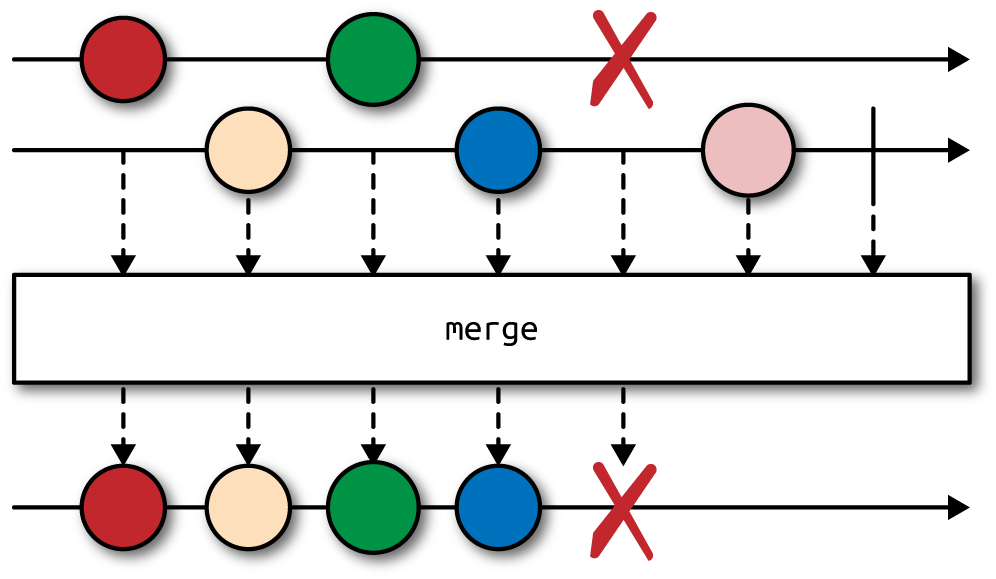

## Operators

One of the reasons why RxJava is so powerful is the rich universe of built-in operators it provides and the possibility of creating custom ones. An operator is a function that takes upstream `Observable<T>` and returns downstream `Observable<R>`, where types `T` and `R` might or might not be the same. Operators allow composing simple transformations into complex processing graphs.

Operators are typically instance methods on `Observable` that somehow alter the behavior of upstream `Observable` as seen by downstream `Observable`s or `Subscriber`s.

In RxJava, you must forget about mutating data structures internally: modifying variables outside of stream is considered very nonidiomatic and dangerous. Every single operator returns a _new_ `Observable`, leaving the original one untouched.

Every time you use any operator, including those that we did not explain yet, you basically create a wrapper around original `Observable`. This wrapper can intercept events flying through it but typically does not subscribe on its own.

## Marble Diagrams

A marble diagram illustrates how various operators work. Most of the time you will see two horizontal axes representing time flying by from left to right. Shapes on these diagrams (the aforementioned marbles) visualize events. Between the top and bottom axes there is an operator in question that somehow alters the sequence of events coming from the source `Observable` (upstream) to form the resulting `Observable` (downstream), as demonstrated in the following graphic:


## Core Operators: Filtering


It is also a common practice to `filter()` the same `Observable` multiple times, each time with a different predicate. We can apply several filters on original `Observable` and even chain them (`filter(p1).filter(p2).filter(p3)`), effectively implementing logical conjunction (`filter(p1 && p2 && p3)`).

```java
Observable<String> strings = someFileSource.lines();
Observable<String> comments = strings.filter(s -> s.startsWith("#"));
Observable<String> instructions = strings.filter(s -> s.startsWith(">"));
Observable<String> empty = strings.filter(String::isBlank);
```

## Core Operators: Mapping

Mappings are used to perform certain transformation on each event. This can be decoding from  JSON to Java object (or vice versa), enriching, wrapping, extracting from the event, and so on.


```java
import rx.functions.Func1;

Observable<Status> tweets = //...
Observable<Date> dates = tweets.map(new Func1<Status, Date>() {
    @Override
    public Date call(Status status) {
        return status.getCreatedAt();
    }
});

Observable<Date> dates =
        tweets.map((Status status) -> status.getCreatedAt());

Observable<Date> dates =
        tweets.map((status) -> status.getCreatedAt());

Observable<Date> dates =
        tweets.map(Status::getCreatedAt);
```

Whatever you return from a function in `map()` is wrapped again inside an `Observable`.

By the way having mutable events (like `java.util.Date`) is problematic because any operator or `Subscriber` can unintentionally mutate events consumed by other `Subscriber`s. We can quickly fix this by applying subsequent `map()`:

```java
Observable<Instant> instants = tweets
        .map(Status::getCreatedAt)
        .map((Date d) -> d.toInstant());
```

`doOnNext()` is like a probe that you can safely inject anywhere in your pipeline of `Observable`s to keep an eye on what is flowing through. `doOnNext()` allows looking at items going through without touching them. `doOnNext()` simply receives every event that flew from upstream `Observable` and passes it downstream, it cannot modify it in any way. 

Technically, `doOnNext()` can mutate the event. However, having mutable events controlled by `Observable` is a recipe for a disaster.

## Wrapping Up Using flatMap()

`flatMap()` first constructs `Observable<Observable<R>>` replacing all upstream values of type `T` with `Observable<R>` (just like `map()`). However, it does not stop there: it automatically subscribes to these inner `Observable<R>` streams to produce a single stream of type `R`, containing all values from all inner streams, as they come.


`flatMap()` is the most fundamental operator in RxJava, using it one can easily implement `map()` or `filter()`:

```java
import static rx.Observable.empty;
import static rx.Observable.just;

numbers.map(x -> x * 2);
numbers.filter(x -> x != 10);

//equivalent
numbers.flatMap(x -> just(x * 2));
numbers.flatMap(x -> (x != 10) ? just(x) : empty());
```

In practice, we do not replace `map()` and `filter()` with `flatMap()` due to the clarity of code and performance.

As a rule of thumb, you use `flatMap()` for the following situations:

* The result of transformation in `map()` must be an `Observable`. For example, performing long-running, asynchronous operation on each element of the stream without blocking.

* You need a one-to-many transformation, a single event is expanded into multiple sub-events. For example, a stream of customers is translated into streams of their orders, for which each customer can have an arbitrary number of orders.

Now imagine that you would like to use a method returning an `Iterable`  (like  `List` or  `Set`). For example, if `Customer` has a simple `List<Order> getOrders()`, you are forced to go through several operators to take advantage of it in `Observable` pipeline:

```java
Observable<Customer> customers = //...
Observable<Order> orders = customers
        .flatMap(customer -> Observable.from(customer.getOrders()));
```

Or, equivalent and equally verbose:

```java
Observable<Order> orders = customers
        .map(Customer::getOrders)
        .flatMap(Observable::from);
```

The need to map from a single item to `Iterable` is so popular that an operator, `flatMapIterable()`, was created to perform just such a transformation:

```java
Observable<Order> orders = customers
        .flatMapIterable(Customer::getOrders);
```

If `getOrders()` was not a simple getter but an expensive operation in terms of run time, it is better to implement `getOrders()` to explicitly return `Observable<Order>`.

Another interesting variant of `flatMap()` can react not only to events, but on any notification, namely events, errors, and completion. The simplified signature of this `flatMap()` overload follows. For an `Observable<T>` we must provide the following:

* A function mapping single `T` → `Observable<R>`
* A function mapping an error notification → `Observable<R>`
* A no-arg function reacting on upstream completion that can return `Observable<R>`

Here is what the code looks like:

```java
<R> Observable<R> flatMap(
        Func1<T, Observable<R>> onNext,
        Func1<Throwable, Observable<R>> onError,
        Func0<Observable<R>> onCompleted)
```

Imagine that you are creating a service that uploads videos. It takes a `UUID` and returns upload progress with `Observable<Long>`:

```java
void store(UUID id) {
    upload(id).subscribe(
            bytes -> {}, //ignore
            e -> log.error("Error", e),
            () -> rate(id)
    );
}

Observable<Long> upload(UUID id) {
    //...
}

Observable<Rating> rate(UUID id) {
    //...
}
```

```java
upload(id)
    .flatMap(
            bytes -> Observable.empty(),
            e -> Observable.error(e),
            () -> rate(id)
    );
```

the last lambda expression (`() -> rate(id)`) reacts upon stream completion. At this point, we replace completion notification with another `Observable<Rating>`.  So, even if the original `Observable` wanted to terminate, we ignore that and in a way append a different `Observable`. Keep in mind that all three callbacks must return `Observable<R>` of the same type `R`.

Just to make sure you understand the syntactic part of `flatMap()`, another abstract example translates from a sequence of characters to Morse code:

```java
import static rx.Observable.empty;
import static rx.Observable.just;

Observable<Sound> toMorseCode(char ch) {
    switch(ch) {
        case 'a': return just(DI, DAH);
        case 'b': return just(DAH, DI, DI, DI);
        case 'c': return just(DAH, DI, DAH, DI);
        //...
        case 'p': return just(DI, DAH, DAH, DI);
        case 'r': return just(DI, DAH, DI);
        case 's': return just(DI, DI, DI);
        case 't': return just(DAH);
        //...
        default:
            return empty();
    }
}

enum Sound { DI, DAH }

//...

just('S', 'p', 'a', 'r', 't', 'a')
    .map(Character::toLowerCase)
    .flatMap(this::toMorseCode)
```

As you can clearly see, every character is replaced by a sequence of `DI` and `DAH` sounds (_dots_ and _dashes_). When character is unrecognizable, an empty sequence is returned. `flatMap()` ensures that we get a steady, flat stream of sounds, as opposed to `Observable<Observable<Sound>>`, which we would get with plain `map()`. At this point, we touch an important aspect of `flatMap()`: order of events. This is best explained with an example, which will be much more enjoyable with _delay()_ operator.

For the time being, let’s study an example. We will need to produce a _Cartesian product_ of all values from two streams. For example we might have two `Observable`s, one with  chessboard’s rows (_ranks_, 1 to 8) and one with columns (_files_, a to h). We would like to find all possible 64 squares on a chessboard:

```java
Observable<Integer> oneToEight = Observable.range(1, 8);
Observable<String> ranks = oneToEight
    .map(Object::toString);
Observable<String> files = oneToEight
    .map(x -> 'a' + x - 1)
    .map(ascii -> (char)ascii.intValue())
    .map(ch -> Character.toString(ch));

Observable<String> squares = files
    .flatMap(file -> ranks.map(rank -> file + rank));
```

The `squares` `Observable` will emit exactly 64 events: for `1` it generates `a1`, `a2`,…`a8`, followed by `b1`, `b2`, and so on until it finally reaches `h7` and `h8`.

### Order of Events After flatMap()

`flatMap()` __cannot__ give _any_ guarantee about what order of those subevents will arrive at the downstream operator/subscriber. 

What `flatMap()` essentially does is take a _master_ sequence (`Observable`) of values appearing over time (events) and replaces each of the events with an independent subsequence. These subsequences are generally unrelated to one another and to the event that generated them from master sequence. To make it clear, you no longer have a single the master sequence but a set of `Observable`s, each working on its own, coming and going over time.

Take this simple code snippet as an example:

```java
just(10L, 1L)
    .flatMap(x ->
        just(x).delay(x, TimeUnit.SECONDS))
    .subscribe(System.out::println);
```

In this example, we delay event `10L` by 10 seconds and event `1L` (chronologically appearing later in upstream) by 1 second. As a result, we see `1` after a second and `10` nine seconds later—the order of events in upstream and downstream is different! Even worse, imagine a `flatMap()` transformation producing multiple events (even infinite number of them) over wide range of time:

```java
Observable
        .just(DayOfWeek.SUNDAY, DayOfWeek.MONDAY)
        .flatMap(this::loadRecordsFor);
```

The `loadRecordsFor()` method returns different streams depending on the day of the week:

```java
Observable<String> loadRecordsFor(DayOfWeek dow) {
    switch(dow) {
        case SUNDAY:
            return Observable
                .interval(90, MILLISECONDS)
                .take(5)
                .map(i -> "Sun-" + i);
        case MONDAY:
            return Observable
                .interval(65, MILLISECONDS)
                .take(5)
                .map(i -> "Mon-" + i);
        //...
    }
}
```

The result is like this:

```
Mon-0, Sun-0, Mon-1, Sun-1, Mon-2, Mon-3, Sun-2, Mon-4, Sun-3, Sun-4
```

But not:

```
Sun-0, Sun-1, Sun-2, Sun-3, Sun-4, Mon-0, Mon-1, Mon-2, Mon-3, Mon-4
```

If you carefully track all delays, you will notice that this order is in fact correct. For example, even though Sunday was the first event in the upstream `Observable`, `Mon-0` event appeared first because the substream produced by Monday begins emitting faster. This is also the reason why `Mon-4` appears before `Sun-3` and `Sun-4`.

You have two streams that work independently but their results must somehow _merge_ into a single `Observable`.

When `flatMap()` encounters Sunday in the upstream, it immediately invokes `loadRecordsFor(Sunday)` and redirects all events emitted by the result of that function (`Observable<String>`) downstream. However, almost exactly at the same time, Monday appears and `flatMap()` calls `loadRecordsFor(Monday)`. Events from the latter substream are also passed downstream, interleaving with events from first substream. `flatMap()` instead subscribes to all substreams immediately and merges them together, pushing events downstream whenever any of the inner streams emit anything. All subsequences returned from flatMap() are merged and treated equally. 

### Preserving Order Using concatMap()

There is a handy `concatMap()` operator that has the exact same syntax as `flatMap()` but works quite differently:

```java
Observable
        .just(DayOfWeek.SUNDAY, DayOfWeek.MONDAY)
        .concatMap(this::loadRecordsFor);
```

This time the output is exactly what we anticipated:

```
Sun-0, Sun-1, Sun-2, Sun-3, Sun-4, Mon-0, Mon-1, Mon-2, Mon-3, Mon-4
```

When the first event (Sunday) appears from upstream, `concatMap()` subscribes to an `Observable` returned from `loadRecordsFor()` and passes all events emitted from it downstream. When this inner stream completes, `concatMap()` waits for the next upstream event (Monday) and continues. `concatMap()` does not introduce any concurrency whatsoever but it preserves the order of upstream events, avoiding overlapping.

`flatMap()` uses the `merge()` operator internally that subscribes to all sub-`Observable`s at the same time and does not make any distinction between them. That is why downstream events interleave with one another. `concatMap()`, on the other hand, could technically use the `concat()` operator. `concat()` subscribes only to the first underlying `Observable` and continues with the second one when the first one completes.

### Controlling the concurrency of flatMap()

Suppose that you have a large list of users wrapped in an `Observable`. Each `User` has a `loadProfile()` method that returns an `Observable<Profile>` instance fetched using an HTTP request. Our aim is to load the profiles of all users as fast as possible. 

```java
class User {
    Observable<Profile> loadProfile() {
        //Make HTTP request...
    }
}

class Profile {/* ... */}

//...

List<User> veryLargeList = //...
Observable<Profile> profiles = Observable
        .from(veryLargeList)
        .flatMap(User::loadProfile);
```

If we have, say 10,000 `User`s, we suddenly triggered 10,000 concurrent HTTP connections.

`flatMap()` has a very simple overloaded version that limits the total number of concurrent subscriptions to inner streams:

```java
flatMap(User::loadProfile, 10);
```

he `maxConcurrent`  parameter limits the number of ongoing inner `Observable`s. In practice when `flatMap()` receives the first 10 `User`s it invokes `loadProfile()` for each of them. However, when the 11th `User` appears from upstream, `flatMap()` will not even call `loadProfile()`. Instead, it will wait for any ongoing inner streams to complete. Therefore, the `maxConcurrent` parameter limits the number of background tasks that are forked from `flatMap()`.

You can probably see that `concatMap(f)` is semantically equivalent to `flatMap(f, 1)`—`flatMap()` with `maxConcurrent` equal to one. We could spend a couple of extra pages discussing the nuances of `flatMap()`, but more exciting operators lie ahead of us.

## Postponing Events Using the delay() Operator

`delay()` basically takes an upstream `Observable` and shifts all events further in time. So, a construct as simple as:

```java
just(x, y, z).delay(1, TimeUnit.SECONDS);
```

will not emit `x`, `y` and `z` immediately upon subscription but after given delay.

We can replace `delay()` with `timer()` and (surprise!) `flatMap()` like this:

```
Observable
    .timer(1, TimeUnit.SECONDS)
    .flatMap(i -> Observable.just(x, y, z))
```

I hope this is clear: we generate an artificial event from `timer()` that we completely ignore. However, using `flatMap()` we replace that artificial event (zero, in `i` value) with three immediately emitted values: `x`, `y`, and `z`. This is somewhat equivalent to `just(x, y, z).delay(1, SECONDS)` in this particular case; however, it is not so in general.

## Treating Several Observables as One Using merge()

The `merge()` operator is used extensively when you want to treat multiple sources of events of the same type as a single source. Also, if you have just two `Observable`s you want to `merge()`, you can use `obs1.mergeWith(obs2)` instance method.



The order of `Observable`s passed to `merge()` is rather arbitrary. No matter which one emits a value first, it will be forwarded to the `Observer` of `all`.

Keep in mind that errors appearing in any of the underlying `Observable`s will be eagerly propagated to `Observer`s. You can use the `mergeDelayError()` variant of `merge()` to postpone any errors until all of the other streams have finished. `mergeDelayError()` will even make sure to collect all exceptions, not only the first one, and encapsulate them in `rx.exceptions.CompositeException`.

```java
Observable<LicensePlate> all = Observable.merge(
        preciseAlgo(photo),
        fastAlgo(photo),
        experimentalAlgo(photo)
);
```

## Pairwise Composing Using zip() and zipWith()

Zipping is the act of taking two (or more) streams and combining them with each other in such a way that each element from one stream is paired with corresponding event from the other. A downstream event is produced by composing the first event from each, second event from each stream, and so on.

However if one of the streams outperforms the other even slightly, events from the faster `Observable` will need to wait longer and longer for the lagging stream.


`zip()` completes early if any of the upstream `Observable`s complete, discarding other streams early.

The `zip()` and `zipWith()` operators are equivalent. We use the former when we want to fluently compose one stream with another, like so: `s1.zipWith(s2, ...)`. Static `zip()` on `Observable` can take up to nine streams:

```java
Observable.zip(s1, s2, s3...)
```

For example, think about the `WeatherStation` API that exposes temperature and wind measurements precisely every minute at the same time:

```java
interface WeatherStation {
    Observable<Temperature> temperature();
    Observable<Wind> wind();
}
```

We have to make an assumption that events from these two `Observable`s are emitted at the same time and thus with the same frequency. Under this restriction, we can safely join these two streams by combining every pair of events.

```java
class Weather {
    public Weather(Temperature temperature, Wind wind) {
        //...
    }
}

//...

Observable<Temperature> temperatureMeasurements = station.temperature();
Observable<Wind> windMeasurements = station.wind();

temperatureMeasurements
    .zipWith(windMeasurements,
        (temperature, wind) -> new Weather(temperature, wind));
```

When a new `Temperature` event occurs, `zipWith()` waits (obviously without blocking!) for `Wind`, and vice versa. Two events are passed to our custom lambda and combined into a `Weather` object.

```java
Observable<Long> red   = Observable.interval(10, TimeUnit.MILLISECONDS);
Observable<Long> green = Observable.interval(10, TimeUnit.MILLISECONDS);

Observable.zip(
    red.timestamp(),
    green.timestamp(),
    (r, g) -> r.getTimestampMillis() - g.getTimestampMillis()
).forEach(System.out::println);
```

When streams are synchronized, this value oscillates around zero. However, if we slightly slow down one `Observable`, say `green` becomes `Observable.interval(11, MILLISECONDS)`, the situation is much different. The time difference between `red` and `green` keeps going up: `red` is consumed in real time but it must wait, increasing the amount of time for the slower item. Over time this difference piles up and can lead to stale data or even memory leak.

## When Streams Are Not Synchronized with One Another

### combineLatest() 


Take the following artificial example. One stream produces `S0`, `S1`, `S2` values every 17 milliseconds whereas the other `F0`, `F1`, `F2` every 10 milliseconds (considerably faster):

```java
import static java.util.concurrent.TimeUnit.MILLISECONDS;
import static rx.Observable.interval;

Observable.combineLatest(
    interval(17, MILLISECONDS).map(x -> "S" + x),
    interval(10, MILLISECONDS).map(x -> "F" + x),
    (s, f) -> f + ":" + s
).forEach(System.out::println);
```

We combine these two streams and produce a new value every time any of the streams produces something. The output quickly becomes out-of-sync, but at least values are consumed in real time, and the faster stream does not need to wait for the slower one:

```
F0:S0
F1:S0
F2:S0
F2:S1
F3:S1
F4:S1
F4:S2
F5:S2
F5:S3
...
F998:S586
F998:S587
F999:S587
F1000:S587
F1000:S588
F1001:S588
```

RxJava notices the new event on the fast stream so takes whatever the latest value was of the slow stream (it still has two wait for at least one event!)—`S0` in this case—and produces a new pair. However, neither stream is distinguished: when the new slow `S1` appears, the latest known fast value (`F2`) is taken and combined, as well. After about 10 seconds we encounter the `F1000:S588` event. Everything adds up: during 10 seconds, fast stream produced about 1,000 events, whereas the slow stream only 588 (10 seconds divided by 17 milliseconds).

### withLatestFrom()


### amb()