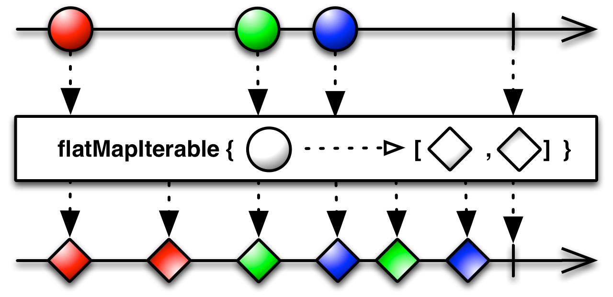
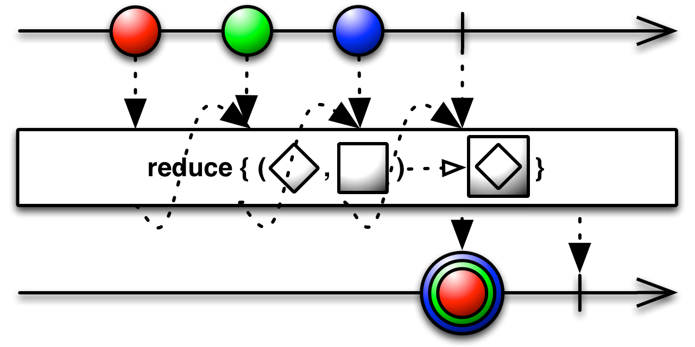
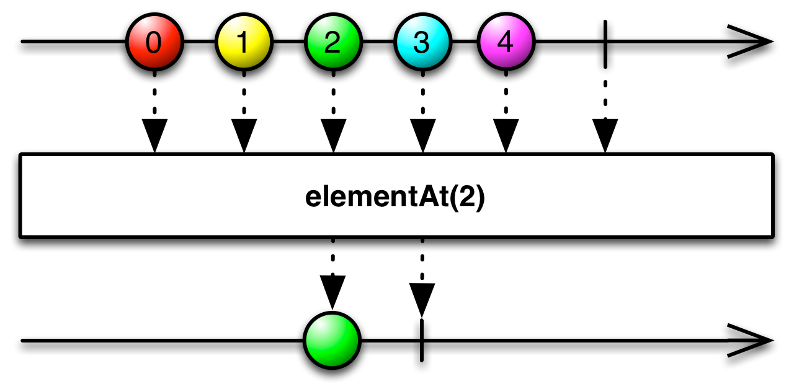
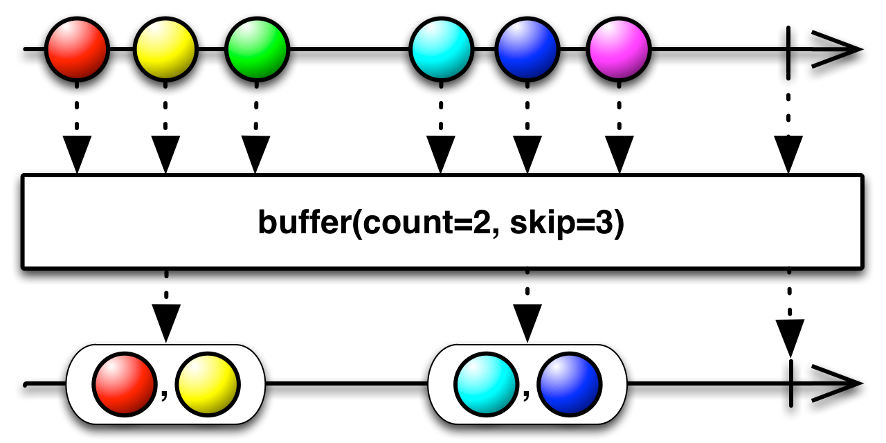

## Operators

One of the reasons why RxJava is so powerful is the rich universe of built-in operators it provides and the possibility of creating custom ones. An operator is a function that takes upstream `Observable<T>` and returns downstream `Observable<R>`, where types `T` and `R` might or might not be the same. Operators allow composing simple transformations into complex processing graphs.

Operators are typically instance methods on `Observable` that somehow alter the behavior of upstream `Observable` as seen by downstream `Observable`s or `Subscriber`s.

In RxJava, you must forget about mutating data structures internally: modifying variables outside of stream is considered very nonidiomatic and dangerous. Every single operator returns a _new_ `Observable`, leaving the original one untouched.

Every time you use any operator, including those that we did not explain yet, you basically create a wrapper around original `Observable`. This wrapper can intercept events flying through it but typically does not subscribe on its own.

This is an antipattern in RxJava, operators should be nonblocking, fast, and as pure as possible.

## Marble Diagrams

A marble diagram illustrates how various operators work. Most of the time you will see two horizontal axes representing time flying by from left to right. Shapes on these diagrams (the aforementioned marbles) visualize events. Between the top and bottom axes there is an operator in question that somehow alters the sequence of events coming from the source `Observable` (upstream) to form the resulting `Observable` (downstream), as demonstrated in the following graphic:


## Core Operators: Filtering


It is also a common practice to `filter()` the same `Observable` multiple times, each time with a different predicate. We can apply several filters on original `Observable` and even chain them (`filter(p1).filter(p2).filter(p3)`), effectively implementing logical conjunction (`filter(p1 && p2 && p3)`).

```java
Observable<String> strings = someFileSource.lines();
Observable<String> comments = strings.filter(s -> s.startsWith("#"));
Observable<String> instructions = strings.filter(s -> s.startsWith(">"));
Observable<String> empty = strings.filter(String::isBlank);
```

## Core Operators: Mapping

Mappings are used to perform certain transformation on each event. This can be decoding from  JSON to Java object (or vice versa), enriching, wrapping, extracting from the event, and so on.


```java
import rx.functions.Func1;

Observable<Status> tweets = //...
Observable<Date> dates = tweets.map(new Func1<Status, Date>() {
    @Override
    public Date call(Status status) {
        return status.getCreatedAt();
    }
});

Observable<Date> dates =
        tweets.map((Status status) -> status.getCreatedAt());

Observable<Date> dates =
        tweets.map((status) -> status.getCreatedAt());

Observable<Date> dates =
        tweets.map(Status::getCreatedAt);
```

Whatever you return from a function in `map()` is wrapped again inside an `Observable`.

By the way having mutable events (like `java.util.Date`) is problematic because any operator or `Subscriber` can unintentionally mutate events consumed by other `Subscriber`s. We can quickly fix this by applying subsequent `map()`:

```java
Observable<Instant> instants = tweets
        .map(Status::getCreatedAt)
        .map((Date d) -> d.toInstant());
```

`doOnNext()` is like a probe that you can safely inject anywhere in your pipeline of `Observable`s to keep an eye on what is flowing through. `doOnNext()` allows looking at items going through without touching them. `doOnNext()` simply receives every event that flew from upstream `Observable` and passes it downstream, it cannot modify it in any way. 

Technically, `doOnNext()` can mutate the event. However, having mutable events controlled by `Observable` is a recipe for a disaster.

## Wrapping Up Using flatMap()

`flatMap()` first constructs `Observable<Observable<R>>` replacing all upstream values of type `T` with `Observable<R>` (just like `map()`). However, it does not stop there: it automatically subscribes to these inner `Observable<R>` streams to produce a single stream of type `R`, containing all values from all inner streams, as they come.


`flatMap()` is the most fundamental operator in RxJava, using it one can easily implement `map()` or `filter()`:

```java
import static rx.Observable.empty;
import static rx.Observable.just;

numbers.map(x -> x * 2);
numbers.filter(x -> x != 10);

//equivalent
numbers.flatMap(x -> just(x * 2));
numbers.flatMap(x -> (x != 10) ? just(x) : empty());
```

In practice, we do not replace `map()` and `filter()` with `flatMap()` due to the clarity of code and performance.

As a rule of thumb, you use `flatMap()` for the following situations:

* The result of transformation in `map()` must be an `Observable`. For example, performing long-running, asynchronous operation on each element of the stream without blocking.

* You need a one-to-many transformation, a single event is expanded into multiple sub-events. For example, a stream of customers is translated into streams of their orders, for which each customer can have an arbitrary number of orders.

Now imagine that you would like to use a method returning an `Iterable`  (like  `List` or  `Set`). For example, if `Customer` has a simple `List<Order> getOrders()`, you are forced to go through several operators to take advantage of it in `Observable` pipeline:

```java
Observable<Customer> customers = //...
Observable<Order> orders = customers
        .flatMap(customer -> Observable.from(customer.getOrders()));
```

Or, equivalent and equally verbose:

```java
Observable<Order> orders = customers
        .map(Customer::getOrders)
        .flatMap(Observable::from);
```

The need to map from a single item to `Iterable` is so popular that an operator, `flatMapIterable()`, was created to perform just such a transformation:

```java
Observable<Order> orders = customers
        .flatMapIterable(Customer::getOrders);
```



If `getOrders()` was not a simple getter but an expensive operation in terms of run time, it is better to implement `getOrders()` to explicitly return `Observable<Order>`.

Another interesting variant of `flatMap()` can react not only to events, but on any notification, namely events, errors, and completion. The simplified signature of this `flatMap()` overload follows. For an `Observable<T>` we must provide the following:

* A function mapping single `T` → `Observable<R>`
* A function mapping an error notification → `Observable<R>`
* A no-arg function reacting on upstream completion that can return `Observable<R>`

Here is what the code looks like:

```java
<R> Observable<R> flatMap(
        Func1<T, Observable<R>> onNext,
        Func1<Throwable, Observable<R>> onError,
        Func0<Observable<R>> onCompleted)
```

Imagine that you are creating a service that uploads videos. It takes a `UUID` and returns upload progress with `Observable<Long>`:

```java
void store(UUID id) {
    upload(id).subscribe(
            bytes -> {}, //ignore
            e -> log.error("Error", e),
            () -> rate(id)
    );
}

Observable<Long> upload(UUID id) {
    //...
}

Observable<Rating> rate(UUID id) {
    //...
}
```

```java
upload(id)
    .flatMap(
            bytes -> Observable.empty(),
            e -> Observable.error(e),
            () -> rate(id)
    );
```

the last lambda expression (`() -> rate(id)`) reacts upon stream completion. At this point, we replace completion notification with another `Observable<Rating>`.  So, even if the original `Observable` wanted to terminate, we ignore that and in a way append a different `Observable`. Keep in mind that all three callbacks must return `Observable<R>` of the same type `R`.

Just to make sure you understand the syntactic part of `flatMap()`, another abstract example translates from a sequence of characters to Morse code:

```java
import static rx.Observable.empty;
import static rx.Observable.just;

Observable<Sound> toMorseCode(char ch) {
    switch(ch) {
        case 'a': return just(DI, DAH);
        case 'b': return just(DAH, DI, DI, DI);
        case 'c': return just(DAH, DI, DAH, DI);
        //...
        case 'p': return just(DI, DAH, DAH, DI);
        case 'r': return just(DI, DAH, DI);
        case 's': return just(DI, DI, DI);
        case 't': return just(DAH);
        //...
        default:
            return empty();
    }
}

enum Sound { DI, DAH }

//...

just('S', 'p', 'a', 'r', 't', 'a')
    .map(Character::toLowerCase)
    .flatMap(this::toMorseCode)
```

As you can clearly see, every character is replaced by a sequence of `DI` and `DAH` sounds (_dots_ and _dashes_). When character is unrecognizable, an empty sequence is returned. `flatMap()` ensures that we get a steady, flat stream of sounds, as opposed to `Observable<Observable<Sound>>`, which we would get with plain `map()`. At this point, we touch an important aspect of `flatMap()`: order of events. This is best explained with an example, which will be much more enjoyable with _delay()_ operator.

For the time being, let’s study an example. We will need to produce a _Cartesian product_ of all values from two streams. For example we might have two `Observable`s, one with  chessboard’s rows (_ranks_, 1 to 8) and one with columns (_files_, a to h). We would like to find all possible 64 squares on a chessboard:

```java
Observable<Integer> oneToEight = Observable.range(1, 8);
Observable<String> ranks = oneToEight
    .map(Object::toString);
Observable<String> files = oneToEight
    .map(x -> 'a' + x - 1)
    .map(ascii -> (char)ascii.intValue())
    .map(ch -> Character.toString(ch));

Observable<String> squares = files
    .flatMap(file -> ranks.map(rank -> file + rank));
```

The `squares` `Observable` will emit exactly 64 events: for `1` it generates `a1`, `a2`,…`a8`, followed by `b1`, `b2`, and so on until it finally reaches `h7` and `h8`.

### Order of Events After flatMap()

`flatMap()` __cannot__ give _any_ guarantee about what order of those subevents will arrive at the downstream operator/subscriber. 

What `flatMap()` essentially does is take a _master_ sequence (`Observable`) of values appearing over time (events) and replaces each of the events with an independent subsequence. These subsequences are generally unrelated to one another and to the event that generated them from master sequence. To make it clear, you no longer have a single the master sequence but a set of `Observable`s, each working on its own, coming and going over time.

Take this simple code snippet as an example:

```java
just(10L, 1L)
    .flatMap(x ->
        just(x).delay(x, TimeUnit.SECONDS))
    .subscribe(System.out::println);
```

In this example, we delay event `10L` by 10 seconds and event `1L` (chronologically appearing later in upstream) by 1 second. As a result, we see `1` after a second and `10` nine seconds later—the order of events in upstream and downstream is different! Even worse, imagine a `flatMap()` transformation producing multiple events (even infinite number of them) over wide range of time:

```java
Observable
        .just(DayOfWeek.SUNDAY, DayOfWeek.MONDAY)
        .flatMap(this::loadRecordsFor);
```

The `loadRecordsFor()` method returns different streams depending on the day of the week:

```java
Observable<String> loadRecordsFor(DayOfWeek dow) {
    switch(dow) {
        case SUNDAY:
            return Observable
                .interval(90, MILLISECONDS)
                .take(5)
                .map(i -> "Sun-" + i);
        case MONDAY:
            return Observable
                .interval(65, MILLISECONDS)
                .take(5)
                .map(i -> "Mon-" + i);
        //...
    }
}
```

The result is like this:

```
Mon-0, Sun-0, Mon-1, Sun-1, Mon-2, Mon-3, Sun-2, Mon-4, Sun-3, Sun-4
```

But not:

```
Sun-0, Sun-1, Sun-2, Sun-3, Sun-4, Mon-0, Mon-1, Mon-2, Mon-3, Mon-4
```

If you carefully track all delays, you will notice that this order is in fact correct. For example, even though Sunday was the first event in the upstream `Observable`, `Mon-0` event appeared first because the substream produced by Monday begins emitting faster. This is also the reason why `Mon-4` appears before `Sun-3` and `Sun-4`.

You have two streams that work independently but their results must somehow _merge_ into a single `Observable`.

When `flatMap()` encounters Sunday in the upstream, it immediately invokes `loadRecordsFor(Sunday)` and redirects all events emitted by the result of that function (`Observable<String>`) downstream. However, almost exactly at the same time, Monday appears and `flatMap()` calls `loadRecordsFor(Monday)`. Events from the latter substream are also passed downstream, interleaving with events from first substream. `flatMap()` instead subscribes to all substreams immediately and merges them together, pushing events downstream whenever any of the inner streams emit anything. All subsequences returned from flatMap() are merged and treated equally. 

### Preserving Order Using concatMap()


There is a handy `concatMap()` operator that has the exact same syntax as `flatMap()` but works quite differently:

```java
Observable
        .just(DayOfWeek.SUNDAY, DayOfWeek.MONDAY)
        .concatMap(this::loadRecordsFor);
```

This time the output is exactly what we anticipated:

```
Sun-0, Sun-1, Sun-2, Sun-3, Sun-4, Mon-0, Mon-1, Mon-2, Mon-3, Mon-4
```

When the first event (Sunday) appears from upstream, `concatMap()` subscribes to an `Observable` returned from `loadRecordsFor()` and passes all events emitted from it downstream. When this inner stream completes, `concatMap()` waits for the next upstream event (Monday) and continues. `concatMap()` does not introduce any concurrency whatsoever but it preserves the order of upstream events, avoiding overlapping.

`flatMap()` uses the `merge()` operator internally that subscribes to all sub-`Observable`s at the same time and does not make any distinction between them. That is why downstream events interleave with one another. `concatMap()`, on the other hand, could technically use the `concat()` operator. `concat()` subscribes only to the first underlying `Observable` and continues with the second one when the first one completes.

### Controlling the concurrency of flatMap()

Suppose that you have a large list of users wrapped in an `Observable`. Each `User` has a `loadProfile()` method that returns an `Observable<Profile>` instance fetched using an HTTP request. Our aim is to load the profiles of all users as fast as possible. 

```java
class User {
    Observable<Profile> loadProfile() {
        //Make HTTP request...
    }
}

class Profile {/* ... */}

//...

List<User> veryLargeList = //...
Observable<Profile> profiles = Observable
        .from(veryLargeList)
        .flatMap(User::loadProfile);
```

If we have, say 10,000 `User`s, we suddenly triggered 10,000 concurrent HTTP connections.

`flatMap()` has a very simple overloaded version that limits the total number of concurrent subscriptions to inner streams:

```java
flatMap(User::loadProfile, 10);
```

he `maxConcurrent`  parameter limits the number of ongoing inner `Observable`s. In practice when `flatMap()` receives the first 10 `User`s it invokes `loadProfile()` for each of them. However, when the 11th `User` appears from upstream, `flatMap()` will not even call `loadProfile()`. Instead, it will wait for any ongoing inner streams to complete. Therefore, the `maxConcurrent` parameter limits the number of background tasks that are forked from `flatMap()`.

You can probably see that `concatMap(f)` is semantically equivalent to `flatMap(f, 1)`—`flatMap()` with `maxConcurrent` equal to one. We could spend a couple of extra pages discussing the nuances of `flatMap()`, but more exciting operators lie ahead of us.

## Postponing Events Using the delay() Operator

`delay()` basically takes an upstream `Observable` and shifts all events further in time. So, a construct as simple as:

```java
just(x, y, z).delay(1, TimeUnit.SECONDS);
```

will not emit `x`, `y` and `z` immediately upon subscription but after given delay.

We can replace `delay()` with `timer()` and (surprise!) `flatMap()` like this:

```
Observable
    .timer(1, TimeUnit.SECONDS)
    .flatMap(i -> Observable.just(x, y, z))
```

I hope this is clear: we generate an artificial event from `timer()` that we completely ignore. However, using `flatMap()` we replace that artificial event (zero, in `i` value) with three immediately emitted values: `x`, `y`, and `z`. This is somewhat equivalent to `just(x, y, z).delay(1, SECONDS)` in this particular case; however, it is not so in general.

## Treating Several Observables as One Using merge()

The `merge()` operator is used extensively when you want to treat multiple sources of events of the same type as a single source. Also, if you have just two `Observable`s you want to `merge()`, you can use `obs1.mergeWith(obs2)` instance method.


The order of `Observable`s passed to `merge()` is rather arbitrary. No matter which one emits a value first, it will be forwarded to the `Observer` of `all`.

Keep in mind that errors appearing in any of the underlying `Observable`s will be eagerly propagated to `Observer`s. You can use the `mergeDelayError()` variant of `merge()` to postpone any errors until all of the other streams have finished. `mergeDelayError()` will even make sure to collect all exceptions, not only the first one, and encapsulate them in `rx.exceptions.CompositeException`.

```java
Observable<LicensePlate> all = Observable.merge(
        preciseAlgo(photo),
        fastAlgo(photo),
        experimentalAlgo(photo)
);
```

## Pairwise Composing Using zip() and zipWith()

Zipping is the act of taking two (or more) streams and combining them with each other in such a way that each element from one stream is paired with corresponding event from the other. A downstream event is produced by composing the first event from each, second event from each stream, and so on.

However if one of the streams outperforms the other even slightly, events from the faster `Observable` will need to wait longer and longer for the lagging stream.


`zip()` completes early if any of the upstream `Observable`s complete, discarding other streams early.

The `zip()` and `zipWith()` operators are equivalent. We use the former when we want to fluently compose one stream with another, like so: `s1.zipWith(s2, ...)`. Static `zip()` on `Observable` can take up to nine streams:

```java
Observable.zip(s1, s2, s3...)
```

For example, think about the `WeatherStation` API that exposes temperature and wind measurements precisely every minute at the same time:

```java
interface WeatherStation {
    Observable<Temperature> temperature();
    Observable<Wind> wind();
}
```

We have to make an assumption that events from these two `Observable`s are emitted at the same time and thus with the same frequency. Under this restriction, we can safely join these two streams by combining every pair of events.

```java
class Weather {
    public Weather(Temperature temperature, Wind wind) {
        //...
    }
}

//...

Observable<Temperature> temperatureMeasurements = station.temperature();
Observable<Wind> windMeasurements = station.wind();

temperatureMeasurements
    .zipWith(windMeasurements,
        (temperature, wind) -> new Weather(temperature, wind));
```

When a new `Temperature` event occurs, `zipWith()` waits (obviously without blocking!) for `Wind`, and vice versa. Two events are passed to our custom lambda and combined into a `Weather` object.

```java
Observable<Long> red   = Observable.interval(10, TimeUnit.MILLISECONDS);
Observable<Long> green = Observable.interval(10, TimeUnit.MILLISECONDS);

Observable.zip(
    red.timestamp(),
    green.timestamp(),
    (r, g) -> r.getTimestampMillis() - g.getTimestampMillis()
).forEach(System.out::println);
```

When streams are synchronized, this value oscillates around zero. However, if we slightly slow down one `Observable`, say `green` becomes `Observable.interval(11, MILLISECONDS)`, the situation is much different. The time difference between `red` and `green` keeps going up: `red` is consumed in real time but it must wait, increasing the amount of time for the slower item. Over time this difference piles up and can lead to stale data or even memory leak.

## When Streams Are Not Synchronized with One Another

### combineLatest() 


Take the following artificial example. One stream produces `S0`, `S1`, `S2` values every 17 milliseconds whereas the other `F0`, `F1`, `F2` every 10 milliseconds (considerably faster):

```java
import static java.util.concurrent.TimeUnit.MILLISECONDS;
import static rx.Observable.interval;

Observable.combineLatest(
    interval(17, MILLISECONDS).map(x -> "S" + x),
    interval(10, MILLISECONDS).map(x -> "F" + x),
    (s, f) -> f + ":" + s
).forEach(System.out::println);
```

We combine these two streams and produce a new value every time any of the streams produces something. The output quickly becomes out-of-sync, but at least values are consumed in real time, and the faster stream does not need to wait for the slower one:

```
F0:S0
F1:S0
F2:S0
F2:S1
F3:S1
F4:S1
F4:S2
F5:S2
F5:S3
...
F998:S586
F998:S587
F999:S587
F1000:S587
F1000:S588
F1001:S588
```

RxJava notices the new event on the fast stream so takes whatever the latest value was of the slow stream (it still has two wait for at least one event!)—`S0` in this case—and produces a new pair. However, neither stream is distinguished: when the new slow `S1` appears, the latest known fast value (`F2`) is taken and combined, as well. After about 10 seconds we encounter the `F1000:S588` event. Everything adds up: during 10 seconds, fast stream produced about 1,000 events, whereas the slow stream only 588 (10 seconds divided by 17 milliseconds).

### withLatestFrom()


It is similar to combineLatest, but only emits items when the single source Observable emits an item. Events from the second stream do not trigger a downstream event; they are used only when first stream emits.

```java
Observable<String> fast = interval(10, MILLISECONDS).map(x -> "F" + x);
Observable<String> slow = interval(17, MILLISECONDS).map(x -> "S" + x);
slow
    .withLatestFrom(fast, (s, f) -> s + ":" + f)
    .forEach(System.out::println);
```

The `slow` stream is primary, the resulting `Observable` will _always_ emit an event when `slow` emits. Conversely, `fast` stream is just a helper used only when `slow` emits something.

```
S0:F1
S1:F2
S2:F4
S3:F5
S4:F7
S5:F9
S6:F11
...
```

All `slow` events appearing before the first `fast` event are silently dropped because there is nothing with which to combine them. This is by design, but if you truly need to preserve all events from the primary stream, you must ensure that the other stream emits some dummy event as soon as possible.

```java
Observable<String> fast = interval(10, MILLISECONDS)
        .map(x -> "F" + x)
        .delay(100, MILLISECONDS)
        .startWith("FX");
Observable<String> slow = interval(17, MILLISECONDS).map(x -> "S" + x);
slow
        .withLatestFrom(fast, (s, f) -> s + ":" + f)
        .forEach(System.out::println);
```

The output reveals that no `slow` events are dropped. However, in the beginning we see dummy `"FX"` events a few times, until the first `"F0"` shows up after 100 milliseconds:

```
S0:FX
S1:FX
S2:FX
S3:FX
S4:FX
S5:FX
S6:F1
S7:F3
S8:F4
S9:F6
...
```

`startWith()` basically returns a new `Observable` that, upon subscription, first emits some constant values (like `"FX"`) followed by original `Observable`. For example, the following code block yields `0`, `1` and `2`, in that order:

```java
Observable
    .just(1, 2)
    .startWith(0)
    .subscribe(System.out::println);
```

### amb()


amb() (together with ambWith()) waits for the very first item emitted. When one of the `Observable`s emits the first event, `amb()` discards all other streams and just keep forwarding events from the first `Observable` that woke up.

```java
Observable<String> stream(int initialDelay, int interval, String name) {
    return Observable
        .interval(initialDelay, interval, MILLISECONDS)
        .map(x -> name + x)
        .doOnSubscribe(() ->
            log.info("Subscribe to " + name))
        .doOnUnsubscribe(() ->
            log.info("Unsubscribe from " + name));
}

//...

Observable.amb(
        stream(100, 17, "S"),
        stream(200, 10, "F")
).subscribe(log::info);
```

You can write an equivalent program using nonstatic `ambWith()`, but it is less readable because it hides the symmetry of `amb()`.

The `slow` stream produces events less frequently, but the first event appears after 100 milliseconds, whereas the `fast` stream begins after 200 milliseconds. What `amb()` does is first subscribe to both `Observable`s, and when it encounters the first event in the `slow` stream, it immediately unsubscribes from the fast one and forwards events from only the slow one:

```
14:46:13.334: Subscribe to S
14:46:13.341: Subscribe to F
14:46:13.439: Unsubscribe from F
14:46:13.442: S0
14:46:13.456: S1
14:46:13.473: S2
14:46:13.490: S3
14:46:13.507: S4
14:46:13.525: S5
```

`doOnSubscribe()` and `doOnUnsubscribe()` callbacks are useful for debugging purposes. Notice how unsubscription from `F` occurs roughly 100 millisecond after subscription to `S`; this is the moment when first event from `S` `Observable` appeared. At this point, listening for events from `F` no longer makes any sense.

## Scanning Through the Sequence with Scan and Reduce

`scan()` is like a bulldozer, going through the source (upstream) `Observable` and accumulating items. 


`scan()` takes two parameters: the last generated value (known as the _accumulator_) and current value from upstream `Observable`. In the first iteration, `total` is simply the first item from `progress`, whereas in the second iteration it becomes the result of `scan()` from the previous one.

```java
Observable<Long> totalProgress = progress // [10, 14, 12, 13, 14, 16]
    .scan((total, chunk) -> total + chunk); // [10, 24, 36, 49, 63, 79]
```

Overloaded version of `scan()` can provide an initial value (if it is different than simply the first element):

```java
Observable<BigInteger> factorials = Observable
    .range(2, 100)
    .scan(BigInteger.ONE, (big, cur) ->
        big.multiply(BigInteger.valueOf(cur)));
```

`factorials` will generate `1`, `2`, `6`, `24`, `120`, `720`…, and so forth. 

`scab`  care about intermediate results, but `reduce` just the final one.



`reduce()` is implemented using `scan().takeLast(1).single()`.

Imagine that you have a source of `CashTransfer` objects with `getAmount()` method returning `BigDecimal`. We would like to calculate the total amount on all transfers. 

The following two transformations are equivalent. They iterate over all transfers and add up amounts, beginning at `ZERO`:

```java
Observable<CashTransfer> transfers = //...;

Observable<BigDecimal> total1 = transfers
    .reduce(BigDecimal.ZERO,
        (totalSoFar, transfer) ->
            totalSoFar.add(transfer.getAmount()));

Observable<BigDecimal> total2 = transfers
    .map(CashTransfer::getAmount)
    .reduce(BigDecimal.ZERO, BigDecimal::add);
```

The second one seems simpler, despite using two steps. This is another reason to prefer smaller, more composable transformations over a single big one.

Also you can probably see that `reduce()` is basically `scan()` talking only to the last element. As a matter of fact, you can implement it as follows:

```java
public <R> Observable<R> reduce(
        R initialValue,
        Func2<R, T, R> accumulator) {
    return scan(initialValue, accumulator).takeLast(1);
}
```

## Reduction with Mutable Accumulator: collect()

The `collect` operator is similar to `reduce` but is specialized for the purpose of collecting the whole set of items emitted by the source Observable into a single mutable data structure to be emitted by the resulting Observable.


```java
Observable<List<Integer>> all = Observable
    .range(10, 20)
    .collect(ArrayList::new, List::add);
```

It's equivalent to:

```
Observable<List<Integer>> all = Observable
    .range(10, 20)
    .reduce(new ArrayList<>(), (list, item) -> {
        list.add(item);
        return list;
    });
```

Another useful use case for `collect()` is aggregating all events into a  `StringBuilder`. In that case, the accumulator is an empty `StringBuilder` and an operation appends one item to that builder:

```java
Observable<String> str = Observable
    .range(1, 10)
    .collect(
            StringBuilder::new,
            (sb, x) -> sb.append(x).append(", "))
    .map(StringBuilder::toString);
```

Transforming `Observable<T>` into `Observable<List<T>>` is so common that a built-in `toList()` operator exists. 

## Asserting Observable Has Exactly One Item Using single()

The `single` operator is similar to `first`, but throws a `NoSuchElementException` if the source Observable does not emit exactly one item before successfully completing.

## Dropping Duplicates Using distinct() and distinctUntilChanged()

Suppress duplicate items emitted by an Observable. The Distinct operator filters an Observable by only allowing items through that have not already been emitted. `distinct()` is useful when we want to process unique events only once. Be sure to remember that `distinct()` must keep in mind all events/keys seen so far for eternity.

The comparison happens by means of `equals()` and `hashCode()`, so ensure that you implement them according to Java guidelines (two equal objects _must_ have the same hash code). 


```java
Observable.just(1, 2, 1, 1, 2, 3)
          .distinct() // [1, 2, 3]
```

In practice, `distinctUntilChanged()` is often more reasonable. In the case of `distinctUntilChanged()`, any given event is discarded only if the previous event was the same (by default using `equals()` for comparison). `distinctUntilChanged()` works best when we receive a steady stream of some measurements and we want to be notified only when the measured value actually changed.


We experimented with `Observable<Weather>`, with `Weather` having two attributes: `Temperature` and `Wind`. A new `Weather` event can appear once every minute, but the weather does not change that often, so we would like to drop duplicated events and focus only on changes:

```java
Observable<Weather> measurements = //...

Observable<Weather> tempChanges = measurements
        .distinctUntilChanged(Weather::getTemperature);
```

Obviously, if we want to an emit event every time either `Temperature` or `Wind` changes, parameterless `distinctUntilChanged()` would work great, assuming that `Weather` implements  `equals()`.

The important difference between `distinct()` and `distinctUntilChanged()` is that the latter can produce duplicates but only if they were separated by a different value. 

Also `distinctUntilChanged()` must only remember the last seen value, as opposed to `distinct()`, which must keep track of all unique values since the beginning of the stream. This means that `distinctUntilChanged()` has a predictable, constant memory footprint, as opposed to `distinct()`.

You are building an API that will notify clients about every new item. Obviously, you can use `java.nio.file.WatchService` or database triggers, but take this as an educational example.

```java
Observable<Item> observeNewItems() {
    return Observable
            .interval(1, TimeUnit.SECONDS)
            .flatMapIterable(x -> query())
            .distinct();
}

List<Item> query() {
    //take snapshot of file system directory
    //or database table
}
```

This simple pattern allows us to replace a bunch of `Thread.sleep()` invocations and manual caching with periodic polling. It is applicable in many areas, like [File Transfer Protocol (FTP)](https://en.wikipedia.org/wiki/File_Transfer_Protocol)  polling, web scraping, and so on.

## Slicing and Dicing Using skip(), takeWhile(), and Others

As a matter of fact, it is a common practice to slice `Observable` and consume just a small subset. Most operators in this section have examples unless they follow the principle of least astonishment.

### `take(n)` and `skip(n)`

The `take(n)` operator will truncate the source `Observable` prematurely after emitting only the first `n` events from upstream, unsubscribing afterward (or complete earlier if upstream did not have `n` items). `skip(n)` is the exact opposite; it discards the first `n` elements and begins emitting events from the upstream `Observable` beginning with event `n+1`. Both operators are quite liberal: negative numbers are treated as zero, exceeding the `Observable` size is not treated as a bug:

```java
Observable.range(1, 5).take(3);  // [1, 2, 3]
Observable.range(1, 5).skip(3);  // [4, 5]
Observable.range(1, 5).skip(5);  // []
```

### `takeLast(n)` and `skipLast(n)`

`takeLast(n)` emits only the last `n` values from the stream before it completes. Internally, this operator must keep a buffer of the last `n` values and when it receives completion notification, it immediately emits the entire buffer. It makes no sense to call `takeLast()` on an infinite stream because it will never emit anything—the stream never ends, so there are no _last events_. `skipLast(n)`, on the other hand, emits all values from upstream `Observable` except the last `n`. Internally, `skipLast()` can emit the first value from upstream only when it received `n+1` elements, second when it received `n+2`, and so on.

```java
Observable.range(1, 5).takeLast(2);  // [4, 5]
Observable.range(1, 5).skipLast(2);  // [1, 2, 3]
```

### `first()` and `last()`

The parameterless `first()` and `last()` operators can be implement via `take(1).single()` and `takeLast(1).single()` accordingly, which should pretty much describe their behavior. The extra `single()` operator ensures that the downstream `Observable` emits precisely one value or exception. Additionally, both `first()` and `last()` have overloaded versions that take predicates. Rather than returning the very first/last value they emit first/last value, matching a given condition.

### `takeFirst(predicate)`

The `takeFirst(predicate)` operator can be expressed by `filter(predicate).take(1)`. The only difference between this one and `first(predicate)` is that it will not break with `NoSuchElementException` in case of missing matching values.

### `takeUntil(predicate)` and `takeWhile(predicate)`

`takeUntil()` emits values from the source `Observable` but completes and unsubscribes after emitting the very first value _matching_ `predicate`. 


`takeWhile()`, conversely, emits values as long as they match a given predicate. 


So the only difference is that `takeUntil()` will emit the first nonmatching value, whereas `takeWhile()` will not. These operators are quite important because they provide a means of conditionally unsubscribing from an `Observable` based on the events being emitted. Otherwise, the operator would need to somehow interact with the `Subscription` instance, which is not available when the operator is invoked.

```java
Observable.range(1, 5).takeUntil(x -> x == 3);  // [1, 2, 3]
Observable.range(1, 5).takeWhile(x -> x != 3);  // [1, 2]
```

### elementAt(n)

Extracting a specific item by index is rather uncommon, but you can use the built-in `elementAt(n)` operator for that. It is quite strict, and it can result in an `IndexOutOfBoundsException` being emitted when upstream `Observable` is not long enough or the index is negative. Of course, it returns `Observable<T>` of the same type `T` as upstream.



### `…OrDefault()` operators

Many operators in this section are strict and can result in exceptions being thrown—for example, `first()` when upstream `Observable` is empty. Under these circumstances many `...OrDefault` operators were introduced to replace exceptions with a default value. All of them are rather self-explanatory: `elementAtOrDefault()`, `firstOrDefault()`, `lastOrDefault()`, and `singleOrDefault()`.

### `count()`

`count()` is an interesting operator that calculates how many events were emitted by upstream `Observable`. By the way, if you need to know how many items matching a given predicate that the upstream `Observable` emitted, `filter(predicate).count()` can do that idiomatically. Do not worry, all operators are lazy so this will work even for quite large streams. Obviously, `count()` never emits any value in case of infinite stream. You can implement`count()` easily by using `reduce()` ):

```java
Observable<Integer> size = Observable
        .just('A', 'B', 'C', 'D')
        .reduce(0, (sizeSoFar, ch) -> sizeSoFar + 1);
```

### `all(predicate)`, `exists(predicate)`, and `contains(value)`

Sometimes, it is useful to ensure that all events from a given `Observable` match some predicate. The `all(predicate)` operator will emit `true` when upstream completes and all values matched the predicate. However, `false` will be emitted as soon as first nonconforming value is found. `exists(predicate)` is the exact opposite of `all()`; it emits `true` when the first matching value is found but `false` in case of upstream completing without any matching value found. Often, our predicate in `exists()` simply compares upstream values with some constants. In that case, you can use the `contains()` operator:

```java
Observable<Integer> numbers = Observable.range(1, 5);

numbers.all(x -> x != 4);    // [false]
numbers.exists(x -> x == 4); // [true]
numbers.contains(4);         // [true]
```

## Ways of Combining Streams: concat(), merge(), and switchOnNext()

Consider a group of people, each one having microphone. Every microphone is modeled as an `Observable<String>`, for which an event represents a single word. Obviously, events appear over time, as soon as they are spoken. To simulate this behavior we will construct a simple `Observable` for demonstration purposes, interesting on its own:

```java
Observable<String> speak(String quote, long millisPerChar) {
    String[] tokens = quote.replaceAll("[:,]", "").split(" ");
    Observable<String> words = Observable.from(tokens);
    Observable<Long> absoluteDelay = words
        .map(String::length)
        .map(len -> len * millisPerChar)
        .scan((total, current) -> total + current);
    return words
        .zipWith(absoluteDelay.startWith(0L), Pair::of)
        .flatMap(pair -> just(pair.getLeft())
            .delay(pair.getRight(), MILLISECONDS));
}
```

Suppose that three people were quoting _Hamlet_ by William Shakespeare:

```java
Observable<String> alice = speak(
        "To be, or not to be: that is the question", 110);
Observable<String> bob = speak(
        "Though this be madness, yet there is method in't", 90);
Observable<String> jane = speak(
        "There are more things in Heaven and Earth, " +
        "Horatio, than are dreamt of in your philosophy", 100);
```

We can finally see how `concat()`, `merge()`, and `switchOnNext()` differ.

### concat

`concat()` (and instance method  `concatWith()`) allow joining together two `Observable`s: when the first one completes, `concat()` subscribes to the second one. Importantly, `concat()` will subscribe to the second `Observable` if, and only if, the first one is completed.


`concat()` is providing fallback value when first stream did not emit anything:

```java
Observable<Car> fromCache = loadFromCache();
Observable<Car> fromDb = loadFromDb();

Observable<Car> found = Observable
        .concat(fromCache, fromDb)
        .first();
```

`Observable`s are lazy, so neither `loadFromCache()` nor `loadFromDb()` actually load any data yet. `loadFromCache()` can complete without emitting any events when cache is empty, but `loadFromDb()` always emits one `Car`. `concat()` followed by `first()` will initially subscribe to `fromCache` and if that emits one item, `concat()` will not subscribe to `fromDb`. However, if `fromCache` is empty, `concat()` will continue with `fromDb`, subscribe to it, and load data from database.

`concat()` is nonblocking, it emits events only when the underlying stream emits something.

### merge

`merge()` subscribes to words of each person immediately and forwards them downstream, no matter which person is speaking. If two streams emit an event at more or less the same time, they are both forwarded right away. There is no buffering or halting events within this operator.


```java
Observable
    .merge(
        alice.map(w -> "Alice: " + w),
        bob.map(w   -> "Bob:   " + w),
        jane.map(w  -> "Jane:  " + w)
    )
.subscribe(System.out::println);
```

The output is very chaotic:

```
Alice: To
Bob:   Though
Jane:  There
Alice: be
Alice: or
Jane:  are
Alice: not
Bob:   this
Jane:  more
Alice: to
Jane:  things
Alice: be
Bob:   be
Alice: that
Bob:   madness
Jane:  in
Alice: is
Jane:  Heaven
Alice: the
Bob:   yet
Alice: question
Jane:  and
Bob:   there
Jane:  Earth
Bob:   is
Jane:  Horatio
Bob:   method
Jane:  than
Bob:   in't
Jane:  are
Jane:  dreamt
Jane:  of
Jane:  in
Jane:  your
Jane:  philosophy
```

replace `merge` with `concat()` operator:

```
Alice: To
Alice: be
Alice: or
Alice: not
Alice: to
Alice: be
Alice: that
Alice: is
Alice: the
Alice: question
Bob:   Though
Bob:   this
Bob:   be
Bob:   madness
Bob:   yet
Bob:   there
Bob:   is
Bob:   method
Bob:   in't
Jane:  There
Jane:  are
Jane:  more
Jane:  things
Jane:  in
Jane:  Heaven
Jane:  and
Jane:  Earth
Jane:  Horatio
Jane:  than
Jane:  are
Jane:  dreamt
Jane:  of
Jane:  in
Jane:  your
Jane:  philosophy
```

### switchOnNext


`switchOnNext()` begins by subscribing to an outer `Observable<Observable<T>>`, which emits inner `Observable<T>`s. As soon as the first inner `Observable<T>` appears, this operator subscribes to it and begins pushing events of type `T` downstream. Now what happens if next inner `Observable<T>` appears? `switchOnNext()` discards the first `Observable<T>` by unsubscribing from it and switches to the next one (thus, the name). In other words, when we have a stream of streams, `switchOnNext()` always forwards downstream events from the last inner stream, even if older streams keep forwarding fresh events.

This is how it looks in our _Hamlet_ quoting example:

```java
Random rnd = new Random();
Observable<Observable<String>> quotes = just(
                alice.map(w -> "Alice: " + w),
                bob.map(w   -> "Bob:   " + w),
                jane.map(w  -> "Jane:  " + w))
        .flatMap(innerObs -> just(innerObs)
                .delay(rnd.nextInt(5), SECONDS));

Observable
        .switchOnNext(quotes)
        .subscribe(System.out::println);
```

One of the possible outcomes, due to the random nature of this example, could look like this:

```
Jane:  There
Jane:  are
Jane:  more
Alice: To
Alice: be
Alice: or
Alice: not
Alice: to
Bob:   Though
Bob:   this
Bob:   be
Bob:   madness
Bob:   yet
Bob:   there
Bob:   is
Bob:   method
Bob:   in't
```

To illustrate how `switchOnNext()` works, we shall delay the emission of inner `Observable`s. We are not delaying each word within that `Observable` (variant _A_) but the entire `Observable` (variant _B_ is subtly different):

```java
//A
map(innerObs ->
        innerObs.delay(rnd.nextInt(5), SECONDS))

//B
flatMap(innerObs -> just(innerObs)
        .delay(rnd.nextInt(5), SECONDS))
```

In variant _A_, the `Observable` appears immediately in the outer stream but begins emitting events with some delay. In variant _B_, on the other hand, we shift the entire `Observable` event forward in time so that it appears in the outer `Observable` much later.

Both static `concat()` and `merge()` operators can work with either a fixed list of `Observable`s or `Observable` of `Observable`s. In the case of `switchOnNext()`, the ladder makes sense.

In the case of delaying only events in every inner `Observable` (variant _A_) three inner `Observable`s would appear at the same time in outer `Observable`, and `switchOnNext()` would only subscribe to one of them.

## Buffer

Periodically gather items emitted by an Observable into bundles and emit these bundles rather than emitting the items one at a time.




## Criteria-Based Splitting of Stream Using groupBy()

Divide an Observable into a set of Observables that each emit a different subset of items from the original Observable.


```java
Observable<ReservationEvent> facts = factStore.observe();

Observable<GroupedObservable<UUID, ReservationEvent>> grouped =
        facts.groupBy(ReservationEvent::getReservationUuid);

grouped.subscribe(byUuid -> {
    byUuid.subscribe(this::updateProjection);
});

Observable<ReservationEvent> updateProjectionAsync(ReservationEvent event) {
    //possibly asynchronous
}
```

Whenever a new `UUID` is discovered, the new `GroupedObservable<UUID, ReservationEvent>` is emitted, pushing events related to that `UUID`. So it becomes clear that the outer data structure must be an `Observable`.

`GroupedObservable` is a simple subclass of `Observable` that apart from the standard `Observable` contract returns a key to which all events in that stream belong (`UUID`, in our case). The number of emitted `GroupedObservable`s can be anything from one (in case of all events having the same key) to the total number of events (if each upstream event has a unique key).

When we `subscribe` to the outer `Observable`, every emitted value is actually another `Observable` (`GroupedObservable`) to which you can subscribe. 

* `Observable` without any `Scheduler` works like a single-threaded program with blocking method calls passing data between one another.
* `Observable` with a single `subscribeOn()` is like starting a big task in the background `Thread`. The program within that `Thread` is still sequential, but at least it runs in the background.
* `Observable` using `flatMap()` where each internal `Observable` has `subscribeOn()` works like `ForkJoinPool` from `java.util.concurrent`, where each substream is a _fork_ of execution and `flatMap()` is a safe _join_ stage.

Of course, the preceding tips only apply to blocking `Observable`s, which are rarely seen in real applications. If your underlying `Observable`s are already asynchronous, achieving concurrency is a matter of understanding how they are combined and when subscription occurs. For example, `merge()` on two streams will subscribe to both of them concurrently, whereas the `concat()` operator waits until the first stream finishes before it subscribes to the second one.

## Taking Periodic Samples and Throttling

The `sample()` operator looks at the upstream `Observable` periodically (for example, every second) and emits the last encountered event. If there were no event at all in the last one-second period, no sample is forwarded downstream and the next sample will be taken after one second, as illustrated in this sample:

```java
long startTime = System.currentTimeMillis();
Observable
    .interval(7, TimeUnit.MILLISECONDS)
    .timestamp()
    .sample(1, TimeUnit.SECONDS)
    .map(ts -> ts.getTimestampMillis() - startTime + "ms: " + ts.getValue())
    .take(5)
    .subscribe(System.out::println);
```

The preceding code snippet will print something similar to the following:

```
1088ms: 141
2089ms: 284
3090ms: 427
4084ms: 569
5085ms: 712
```

Imagine that you have a list of names that appear with some absolute delays, like so:

```java
Observable<String> names = Observable
    .just("Mary", "Patricia", "Linda",
        "Barbara",
        "Elizabeth", "Jennifer", "Maria", "Susan",
        "Margaret", "Dorothy");

Observable<Long> absoluteDelayMillis = Observable
    .just(0.1, 0.6, 0.9,
        1.1,
        3.3, 3.4, 3.5, 3.6,
        4.4, 4.8)
    .map(d -> (long)(d * 1_000));

Observable<String> delayedNames = names
    .zipWith(absoluteDelayMillis,
        (n, d) -> Observable
                .just(n)
                .delay(d, MILLISECONDS))
    .flatMap(o -> o);

delayedNames
    .sample(1, SECONDS)
    .subscribe(System.out::println);
```

After the first second, we `println` _Linda_, followed by _Barbara_ a second later. Two seconds after _Barbara_ was emitted, we see _Susan_. `sample()` will forward completion (and errors, as well) discarding the last period.

If we want to see _Dorothy_ appearing as well, we can artificially postpone the completion notification, as is done here:

```java
static <T> Observable<T> delayedCompletion() {
    return Observable.<T>empty().delay(1, SECONDS);
}

//...

delayedNames
    .concatWith(delayedCompletion())
    .sample(1, SECONDS)
    .subscribe(System.out::println);
```

`sample()` has a more advanced variant taking `Observable` as an argument rather than a fixed period. This second `Observable` (known as sampler) basically dictates when to take a sample from the upstream source: every time sampler emits any value, a new sample is taken (if any new value appeared since the last sample). You can use this overloaded version of `sample()` to dynamically change the sampling rate or take samples only at very specific points in time. For example, taking a snapshot of some value when a new frame is redrawn or when a key is pressed. A trivial example can simply emulate the fixed period by using the `interval()` operator:

```java
//equivalent:
obs.sample(1, SECONDS);
obs.sample(Observable.interval(1, SECONDS));
```

`sample()` has an alias in RxJava called `throttleLast()`. Symmetrically, there is also the `throttleFirst()` ) operator that emits the very first event that appeared in each period. So, applying `throttleFirst()` instead of `sample()` in our name stream yields rather expected results:

```java
Observable<String> names = Observable
    .just("Mary", "Patricia", "Linda",
        "Barbara",
        "Elizabeth", "Jennifer", "Maria", "Susan",
        "Margaret", "Dorothy");

Observable<Long> absoluteDelayMillis = Observable
    .just(0.1, 0.6, 0.9,
        1.1,
        3.3, 3.4, 3.5, 3.6,
        4.4, 4.8)
    .map(d -> (long)(d * 1_000));

//...

delayedNames
    .throttleFirst(1, SECONDS)
    .subscribe(System.out::println);
```

The output looks like this:

```
Mary
Barbara
Elizabeth
Margaret
```

## Buffering Events to a List

The `buffer()` operator aggregates batches of events in real time into a `List`. However, unlike the `toList()` operator, `buffer()` emits several lists grouping some number of subsequent events as opposed to just one containing all events (like `toList()`). The simplest form of `buffer()` groups values from upstream `Observable` into a lists of equal size:

```java
Observable
    .range(1, 7)  //1, 2, 3, ... 7
    .buffer(3)
    .subscribe((List<Integer> list) -> {
            System.out.println(list);
        }
    );
```

The output shows three events emitted from the `buffer(3)` operator:

```
[1, 2, 3]
[4, 5, 6]
[7]
```

By using the `buffer(int)` operator you can replace several fine-grained events with less but bigger batches. For example, if you want to reduce database load, you might want to replace storing each event individually by storing them in batches:

```java
interface Repository {
    void store(Record record);
    void storeAll(List<Record> records);
}

//...

Observable<Record> events = //...

events
        .subscribe(repository::store);
//vs.
events
        .buffer(10)
        .subscribe(repository::storeAll);
```

You can use `flatMap()` or `flatMapIterable()` to get back a simple `Observable<Integer>`:

```java
Observable<Integer> odd = Observable
    .range(1, 7)
    .buffer(1, 2)
    .flatMapIterable(list -> list);
```

`flatMapIterable()` expects a function that transforms each value in the stream (one-element `List<Integer>`) into a `List`. Identity transformation (`list -> list`) is enough here.

### Buffering by time periods

An overloaded version of `buffer()` that accepts time period (one second in the preceding example) aggregates all upstream events within that period.
Therefore, `buffer()` collects all events that happened during first time period, second time period, and so on.

```java
Observable<String> names = just(
        "Mary",     "Patricia", "Linda", "Barbara", "Elizabeth",
        "Jennifer", "Maria",    "Susan", "Margaret", "Dorothy");
Observable<Long> absoluteDelays = just(
    0.1, 0.6, 0.9, 1.1, 3.3,
    3.4, 3.5, 3.6, 4.4, 4.8
).map(d -> (long) (d * 1_000));

Observable<String> delayedNames = Observable.zip(names,
        absoluteDelays,
        (n, d) -> just(n).delay(d, MILLISECONDS)
).flatMap(o -> o);

delayedNames
        .buffer(1, SECONDS)
        .subscribe(System.out::println);
```

Output:

```
[Mary, Patricia, Linda]
[Barbara]
[]
[Elizabeth, Jennifer, Maria, Susan]
[Margaret, Dorothy]
```

TODO ch06 for more.

## Moving window

Window is similar to [Buffer](http://reactivex.io/documentation/operators/buffer.html), but rather than emitting packets of items from the source Observable, it emits Observables, each one of which emits a subset of items from the source Observable and then terminates with an `onCompleted` notification.


```java
Observable<KeyEvent> keyEvents = //...

Observable<Integer> eventPerSecond = keyEvents
    .buffer(1, SECONDS)
    .map(List::size);
```

We batch all events from `Observable<KeyEvent>` that occurred in each second into `Observable<List<KeyEvent>>`. In the next step, we map `List` into its `size`. This is quite wasteful, especially if the number of events in each second is significant:

```java
Observable<Observable<KeyEvent>> windows = keyEvents.window(1, SECONDS);
Observable<Integer> eventPerSecond = windows
    .flatMap(eventsInSecond -> eventsInSecond.count());
```

`window()`, as opposed to `buffer()`, returns an `Observable<Observable<KeyEvent>>`. The `count()` operator transforms an `Observable<T>` into an `Observable<Integer>` that emits just one item representing the number of events in the original `Observable`.

## Skipping Stale Events by Using debounce()

`buffer()` and `window()` group several events together so that you can process them in batches. `sample()` picks one fairly arbitrary event once in a while. These operators do not take into account how much time elapsed between events.

`debounce()` (alias: `throttleWithTimeout()`) discards all of the events that are shortly followed by another event.

```java
Observable<BigDecimal> prices = tradingPlatform.pricesOf("NFLX");
Observable<BigDecimal> debounced = prices.debounce(100, MILLISECONDS);
```

If the price goes above $150, we would like to forward such an update downstream much faster without hesitation:

```java
prices
    .debounce(x -> {
        boolean goodPrice = x.compareTo(BigDecimal.valueOf(150)) > 0;
        return Observable
            .empty()
            .delay(goodPrice? 10 : 100, MILLISECONDS);
    })
```

If you still struggle to understand how `debounce()` works, here is a stock price simulator you can try:

```java
Observable<BigDecimal> pricesOf(String ticker) {
    return Observable
            .interval(50, MILLISECONDS)
            .flatMap(this::randomDelay)
            .map(this::randomStockPrice)
            .map(BigDecimal::valueOf);
}

Observable<Long> randomDelay(long x) {
    return Observable
            .just(x)
            .delay((long) (Math.random() * 100), MILLISECONDS);
}

double randomStockPrice(long x) {
    return 100 + Math.random() * 10 +
           (Math.sin(x / 100.0)) * 60.0;
}
```

