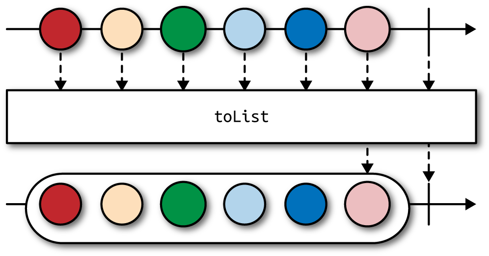

## From Collections to Observables

The following class represents a trivial repository abstracting us from a database:

```java
class PersonDao {

    List<Person> listPeople() {
        return query("SELECT * FROM PEOPLE");
    }

    private List<Person> query(String sql) {
        //...
    }

}
```

Change it to Observable:

```
Observable<Person> listPeople() {
    final List<Person> people = query("SELECT * FROM PEOPLE");
    return Observable.from(people);
}
```

## BlockingObservable: Exiting the Reactive World

We want to transform `Observable<Person>` back into `List<Person>` to limit the scope of refactoring:

```java
Observable<Person> peopleStream = personDao.listPeople();
Observable<List<Person>> peopleList = peopleStream.toList();
BlockingObservable<List<Person>> peopleBlocking = peopleList.toBlocking();
List<Person> people = peopleBlocking.single();
```

`peopleList.toList()` will buffer all `Person` events and keep them in memory until the `onCompleted()` event is received.



`toList()` is asynchronous; it doesn’t wait for all events to arrive but instead lazily buffers all values.

`BlockingObservable` is a good idea only when you must provide a blocking, static view of your otherwise asynchronous `Observable`. Whereas `Observable.from(List<T>)` converts normal pull-based collection into `Observable`, `toBlocking()` does something quite the opposite.

`single()` drops observables altogether and extracts one, and only one, item we expect to receive from `BlockingObservable<T>`. This means `single()` will block waiting for `onCompleted()` callback. 

This time with all operators chained:

```java
List<Person> people = personDao
    .listPeople()
    .toList()
    .toBlocking()
    .single();
```

## Composing Observables

We can actually simulate reading an entire database starting from given page:

```java
import static rx.Observable.defer;
import static rx.Observable.from;


Observable<Person> allPeople(int initialPage) {
    return defer(() -> from(listPeople(initialPage)))
            .concatWith(defer(() ->
                    allPeople(initialPage + 1)));
}

List<Person> listPeople(int page) {
    return query(
            "SELECT * FROM PEOPLE ORDER BY id LIMIT ? OFFSET ?",
            PAGE_SIZE,
            page * PAGE_SIZE
    );
}
```

This code snippet lazily loads the initial page of database records,
for example 10 items. If no one subscribes, even this first query is not
invoked. If there is a subscriber that only consumes a few initial elements (e.g., `allPeople(0).take(3)`), RxJava will unsubscribe automatically from our stream and no more queries are executed.

`allPeople(initialPage)` calls `allPeople(initialPage + 1)` without any stop condition. This is a recipe for `StackOverflowError` in most languages, but not here. Again, calling `allPeople()` is always lazy, therefore the moment you stop listening (unsubscribe), this recursion is over. 

__Lazy paging and concatenation__

There are more ways to implement lazy paging with RxJava. If you think about it, the simplest way of loading paged data is to load everything and then take whatever we need. It sounds silly, but thanks to laziness it is feasible. First we generate all possible page numbers and then we request loading each and every page individually:

```java
Observable<List<Person>> allPages = Observable
            .range(0, Integer.MAX_VALUE)
            .map(this::listPeople)
            .takeWhile(list -> !list.isEmpty());
```

if we find an empty page it means all further pages are empty, as well. Therefore, we use `takeWhile()` rather than `filter()`. To flatten `allPages` to `Observable<Person>` we can use `concatMap()`

```java
Observable<Person> people = allPages.concatMap(Observable::from);
```

`concatMap()` requires a transformation from `List<Person>` to `Observable<Person>`, executed for each page. Alternatively we can try `concatMapIterable()`, which does the same thing, but the transformation should return an `Iterable<Person>` for each upstream value (happening to be `Iterable<Person>` already):

```java
Observable<Person> people = allPages.concatMapIterable(page -> page);
```

No matter which approach you choose, all transformations on `Person` object are lazy. As long as you limit the number of records you want to process (for example with `people.take(15)`), the `Observable<Person>` will invoke `listPeople()` as late as possible.

__Observable.ignoreElements()__

```java
List<Ticket> failures = Observable.from(tickets)
    .flatMap(ticket ->
        rxSendEmail(ticket)
            .flatMap(response -> Observable.<Ticket>empty())
            .doOnError(e -> log.warn("Failed to send {}", ticket, e))
            .onErrorReturn(err -> ticket))
    .toList()
    .toBlocking()
    .single();
```

It is easy to see that inner `flatMap()` in our example ignores `response` and returns an empty stream. In such cases, `flatMap()` is an overkill; the `ignoreElements()` operator is far more efficient. `ignoreElements()` simply ignores all emitted values and forwards `onCompleted()` or `onError()` notifications. Because we are ignoring the actual response and just deal with errors, `ignoreElements()` works great here.

```java
Observable
        .from(tickets)
        .flatMap(ticket ->
                rxSendEmail(ticket)
                        .ignoreElements()
                        .doOnError(e -> log.warn("Failed to send {}", ticket, e))
                        .onErrorReturn(err -> ticket)
                        .subscribeOn(Schedulers.io()))
```

## Replacing Callbacks with Streams

