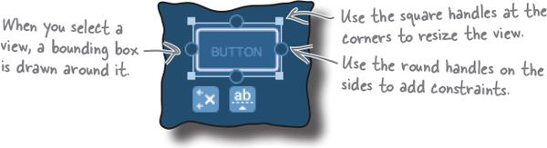
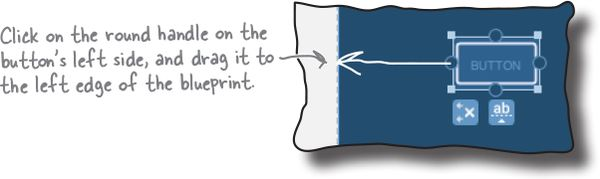
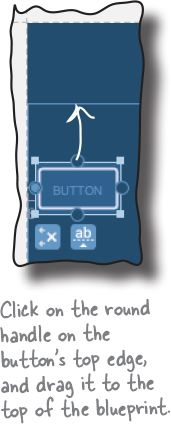
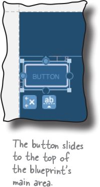
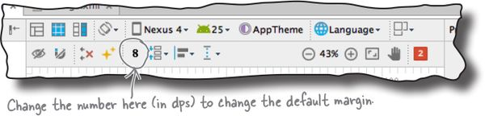
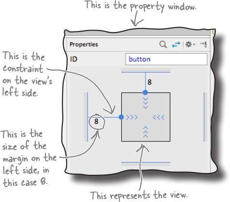
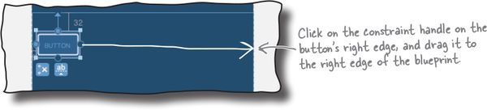
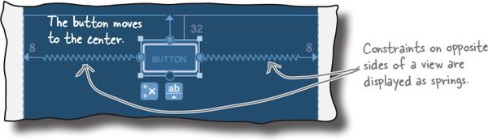
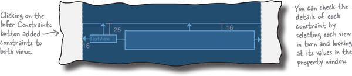
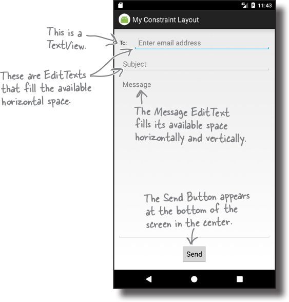

layout: post
title: Android Constraint Layout
tags: [android, ui, layout]
category: Android
---

[`ConstraintLayout`](https://developer.android.com/reference/android/support/constraint/ConstraintLayout.html) allows you to create large and complex layouts with a flat view hierarchy (no nested view groups). It's similar to [`RelativeLayout`](https://developer.android.com/reference/android/widget/RelativeLayout.html) in that all views are laid out according to relationships between sibling views and the parent layout, but it's more flexible than `RelativeLayout` and easier to use with Android Studio's Layout Editor.

- [Build a Responsive UI with ConstraintLayout](https://developer.android.com/training/constraint-layout/index.html)
- [ConstraintLayout](https://developer.android.com/reference/android/support/constraint/ConstraintLayout.html)

<iframe width="560" height="315" src="https://www.youtube.com/embed/z53Ed0ddxgM?rel=0" frameborder="0" allowfullscreen></iframe>

<iframe width="560" height="315" src="https://www.youtube.com/embed/CTYf1qwrXuw" frameborder="0" allowfullscreen></iframe>

<iframe width="560" height="315" src="https://www.youtube.com/embed/yT22cqCGjQQ" frameborder="0" allowfullscreen></iframe>

## Horizontal constraint

Make sure the button’s selected by clicking it. When you select a view, a bounding box is drawn around it, and handles are added to its corners and sides. The square handles in the corners let you resize the view, and the round handles on the sides let you add constraints:

To add a constraint, you click on one of the view’s constraint handles and drag it to whatever you want to attach it to. In our case, we’re going to attach the left edge of the button to the left edge of the layout, so click on the left constraint handle and drag it to the left edge of the blueprint:

## Vertical constraint

Each view in a constraint layout must have at least two constraints — a horizontal constraint and a vertical one — in order to specify where it should be positioned. 

If you omit the horizontal constraint, the view is displayed next to the start edge of the layout at runtime. If you omit the vertical constraint, the view is displayed at the top of the layout. **This is irrespective of where the view is positioned in the blueprint.**

## Changing the view’s margins

When you add a constraint to a view, the design editor automatically adds a margin on the same edge as the constraint. You can set the size of the default margin in the design editor’s toolbar by changing the number in the Default Margin box:

Changing the size of the default margin specifies the size of any _new_ margins that get added. The size of any existing margins remain unchanged, but you can change these using the property window.

The property window is displayed in a separate panel at the side of the design editor. When you select a view, it displays a diagram featuring the view’s constraints and the size of its margins. To change the size of a margin, you change the number next to the relevant side of the view.

## How to center views

To position views in the center of its layout, you add constraints to opposite sides of the view. Let’s see how this works by centering our button horizontally.

Make sure the button is selected, then click on the constraint handle on its right edge, and drag it to the right edge of the layout:

This adds a constraint to the view’s right edge. As the button now has two horizontal constraints, one on each side, the button is pulled to the center, and the two opposing constraints are displayed in the blueprint as springs:

## Adjust a view’s position by updating its bias

## Infer the constraints

When you click on the Infer Constraints button, the design editor tries to figure out what the constraints should be and adds them for you. It’s not completely foolproof, as it can’t read your mind (as far as we know) to determine how you want the layout to behave on a real device. It simply guesses based on each view’s position in the blueprint.

Here are the changes the design editor made for us when we clicked on the Infer Constraints button (yours may look different if you positioned your views differently):

If you don’t like what the Infer Constraints feature has done, you can undo the changes it’s made by choosing Undo Infer Constraints from the Edit menu, or adjust individual constraints.

## Excercise

