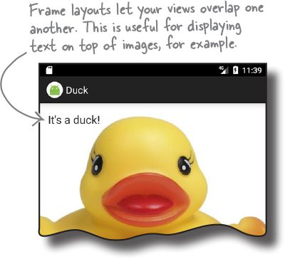
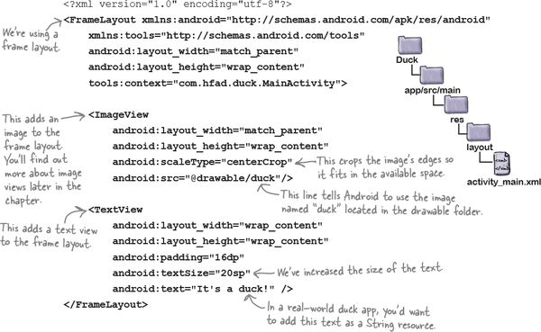
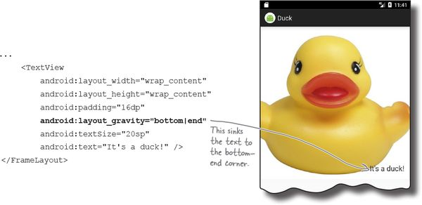

layout: post
title: Android Frame Layout
tags: [android, ui, layout]
category: Android
---

Linear layouts arrange their views in a single row or column. Each view is allocated its own space on the screen, and they don’t overlap one another.

Sometimes, however, you _want_ your views to overlap. As an example, suppose you want to display an image with some text overlaid on top of it. You wouldn’t be able to achieve this just using a linear layout.

If you want a layout whose views can overlap, a simple option is to use a **frame layout**. Instead of displaying its views in a single row or column, it stacks them on top of each other. This allows you to, for example, display text on top of an image.

## How you define a frame layout

You define a frame layout using the `<FrameLayout>` element like this:

Just like a linear layout, the `android:layout_width` and `android:layout_height` attributes are mandatory and specify the layout’s width and height.

## Add an image to your project

We’re going to change _activity_main.xml_ so that it uses a frame layout containing an image view (a view that displays an image) and a text view. To do this, replace the code in your version of _activity_main.xml_ with ours below:

When you define a frame layout, you add views to the layout in the order in which you want them to be stacked. The first view is displayed first, the second is stacked on top of it, and so on. In our case, we’ve added an image view followed by a text view, so the text view appears on top of the image view:

## Position views in the layout using layout_gravity

By default, any views you add to a frame layout appear in the top-left corner. You can change the position of these views using the `android:layout_gravity` attribute, just as you could with a linear layout.

As an example, here’s how you would move the text view to the bottom-end corner of the image:

## You can nest layouts

One of the disadvantages of using a frame layout is that it’s easy for views to overlap one another when you don’t want them to. As an example, you may want to display two text views in the bottom-end corner, one above the other:

