layout: post
title: Android Relative & Grid Layout
tags: [android, ui, layout]
category: Android
---

There are two more layouts we’d like you to know about: **relative layouts** and **grid layouts**. They’ve largely been superseded by the constraint layout, but we have a soft spot for them, and we think they’ll stay around for a few more years.

## Relative Layout

A relative layout allows you to position views relative to their parent layout, or relative to other views in the layout.

You define a relative layout using the `<RelativeLayout>` element like this:

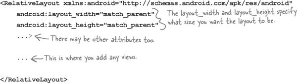

### Positioning views relative to the parent layout

If you want a view to always appear in a particular position on the screen, irrespective of the screen size or orientation, you need to position the view relative to its parent. As an example, here’s how you’d make sure a button always appears in the top-center of the layout:

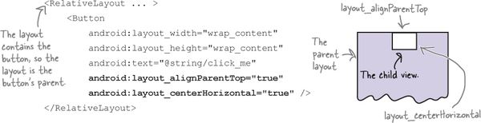


The lines of code:

<pre id="pro_id00156" data-type="programlisting" class="calibre34">
android:layout_alignParentTop="true"
android:layout_centerHorizontal="true"
</pre>

mean that the top edge of the button is aligned to the top edge of the layout, and the button is centered horizontally in the parent layout. 

### Positioning views to the left or right

You can also position a view to the left or right of the parent layout. There are two ways of doing this.

The first way is to explicitly position the view on the left or right using:

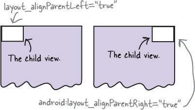


<pre id="pro_id00157" data-type="programlisting" class="calibre34">
**android:layout_alignParentLeft="true"**
</pre>

or

<pre id="pro_id00158" data-type="programlisting" class="calibre34">
**android:layout_alignParentRight="true"**
</pre>

These lines of code mean that the left (or right) edge of the view is aligned to the left (or right) edge of the parent layout, regardless of the screen size, orientation, or language being used on the device.

## Use start and end to take language direction into account

For apps where the minimum SDK is _at least_ API 17, you can position views on the left or right depending on the language setting on the device. As an example, you might want views to appear on the left for languages that are read from left to right such as English. For languages that are read from right to left, you might want them to appear on the right instead so that their position is mirrored.

To do this, you use:

<pre id="pro_id00159" data-type="programlisting" class="calibre34">
**android:layout_alignParentStart="true"**
</pre>

or:

<pre id="pro_id00160" data-type="programlisting" class="calibre34">
**android:layout_alignParentEnd="true"**
</pre>

`android:layout_alignParentStart="true"` aligns the start edge of the view with that of its parent. The start edge is on the left for languages that are read from left to right, and the right edge for languages that are read from right to left.

`android:layout_alignParentEnd="true"` aligns the end edge of the view with that of its parent. The end edge is on the right for languages that are read from left to right, and the left edge for languages that are read from right to left.

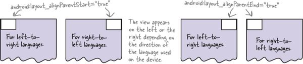

### Attributes for positioning views relative to the parent layout

Here are some of the most common attributes for positioning views relative to their parent layout. Add the attribute you want to the view you’re positioning, then set its value to "true":

```
android:attribute="true"
```

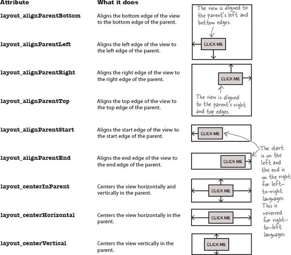

### Positioning views relative to other views

In addition to positioning views relative to the parent layout, you can also position views _relative to other views_. You do this when you want views to stay aligned in some way, irrespective of the screen size or orientation.

In order to position a view relative to another view, the view you’re using as an anchor must be given an ID using the `android:id` attribute:

```
**android:id="@+id/button_click_me"**
```

The syntax “`@+id`” tells Android to include the ID as a resource in its resource file _R.java_. You must include the “`+`” whenever you define a new view in the layout. If you don’t, Android won’t add the ID as a resource and you’ll get errors in your code. You can omit the “`+`” when the ID has already been added as a resource.

Here’s how you create a layout with two buttons, with one button centered in the middle of the layout, and the second button positioned underneath the first:

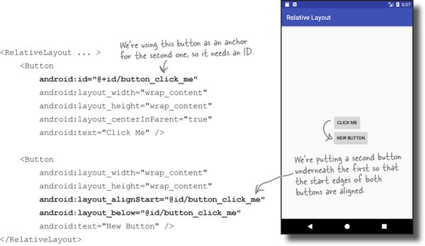

The lines:

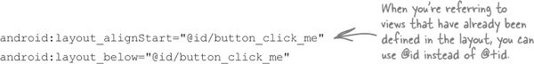

ensure that the second button has its start edge aligned to the start edge of the first button, and is always positioned beneath it.

**Attributes for positioning views relative to other views**

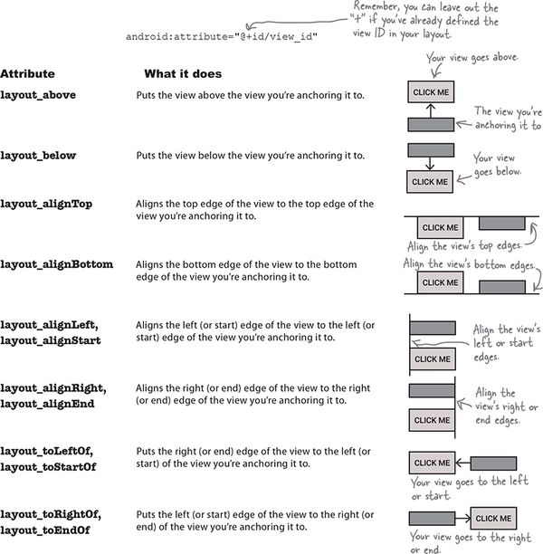

## A grid layout displays views in a grid

A grid layout splits the screen up into a grid of rows and columns, and allocates views to cells:

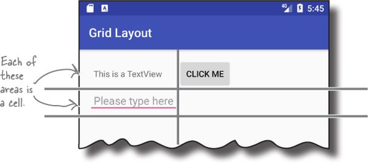

You define a grid layout in a similar way to how you define the other types of layout, this time using the **`<GridLayout>`** element:

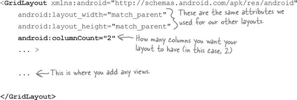

You specify how many columns you want the grid layout to have using:

<pre id="pro_id00163" data-type="programlisting" class="calibre34">
**android:columnCount="number"**
</pre>

where `number` is the number of columns. You can also specify a maximum number of rows using:

<pre id="pro_id00164" data-type="programlisting" class="calibre34">
**android:rowCount="number"**
</pre>

but in practice you can usually let Android figure this out based on the number of views in the layout. Android will include as many rows as is necessary to display the views.

### Adding views to the grid layout

You add views to a grid layout in a similar way to how you add views to a linear layout:

```
<GridLayout ... >

    <TextView
        android:layout_width="wrap_content"
        android:layout_height="wrap_content"
        android:text="@string/textview" />

    <Button
        android:layout_width="wrap_content"
        android:layout_height="wrap_content"
        android:text="@string/click_me" />

    <EditText
        android:layout_width="wrap_content"
        android:layout_height="wrap_content"
        android:hint="@string/edit" />

</GridLayout>
```

By default, the grid layout positions your views in the order in which they appear in the XML. So if you have a grid layout with two columns, the grid layout will put the first view in the first position, the second view in the second position, and so on.

The downside of this approach is that if you remove one of your views from the layout, it can drastically change the appearance of the layout. To get around this, you can specify where you want each view to appear, and how many columns you want it to span.

### Let’s create a new grid layout

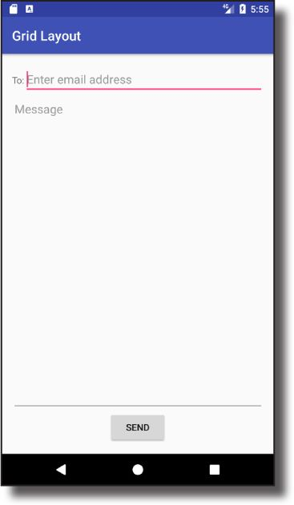

The first thing we’ll do to create our new layout is sketch it out. That way we can see how many rows and columns we need, where each view should be positioned, and how many columns each view should span.

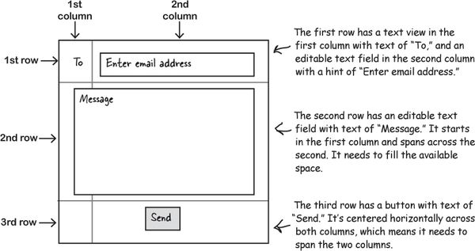

The grid layout needs two columns:

We can position our views how we want if we use a grid layout with two columns:

```
<GridLayout xmlns:android="http://schemas.android.com/apk/res/android"
    xmlns:tools="http://schemas.android.com/tools"
    android:layout_width="match_parent"
    android:layout_height="match_parent"
    android:padding="16dp"
    android:columnCount="2"
    tools:context="com.hfad.gridlayout.MainActivity" >
</GridLayout>
```

Now that we have the basic grid layout defined, we can start adding views.

### Row 0: add views to specific rows and columns

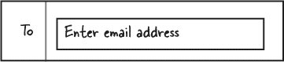


The first row of the grid layout is composed of a text view in the first column, and an editable text field in the second column. You start by adding the views to the layout:

> **You can use android:gravity and android:layout_gravity attributes with grid layouts.**

    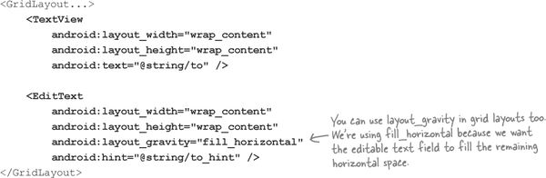


Then you use the `android:layout_row` and `android:layout_column` attributes to say which row and column you want each view to appear in. The row and column indices start from 0, so if you want a view to appear in the first column and first row, you use:

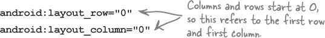

Let’s apply this to our layout code by putting the text view in column 0, and the editable text field in column 1.

> **Row and column indices start at 0. layout_column=“n” refers to column n+1 in the display.**

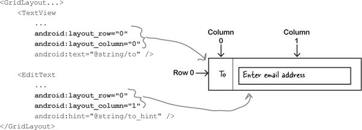

### Row 1: make a view span multiple columns

The second row of the grid layout is composed of an editable text field that starts in the first column and spans across the second. The view takes up all the available space.

To get a view to span multiple columns, you start by specifying which row and column you want the view to start in. We want the view to start in the first column of the second row, so we need to use:

<pre id="pro_id00167" data-type="programlisting" class="calibre34">
android:layout_row="1"
android:layout_column="0"
</pre>

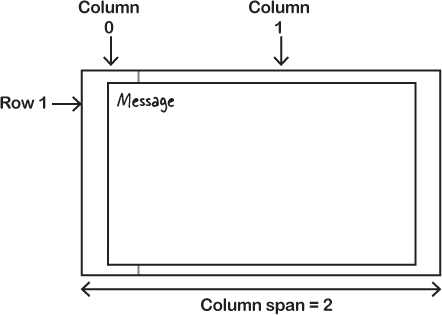


We want our view to go across two columns, and we can do this using the `android:layout_columnSpan` attribute like this:

<pre id="pro_id00168" data-type="programlisting" class="calibre34">
**android:layout_columnSpan="number"**
</pre>

where `number` is the number of columns we want the view to span across. In our case, this is:

<pre id="pro_id00169" data-type="programlisting" class="calibre34">
**android:layout_columnSpan="2"**
</pre>

Putting it all together, here’s the code for the message view:

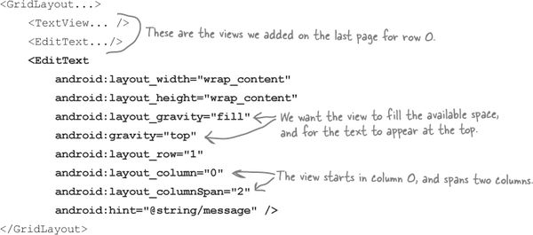

Now that we’ve added the views for the first two rows, all we need to do is add the button.

### Row 2: make a view span multiple columns

We need the button to be centered horizontally across the two columns like this:

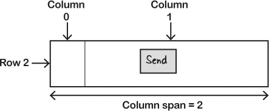

We wrote some code to center the Send button in the third row of the grid layout, but a sudden breeze blew some of it away. See if you can reconstruct the code using the magnets below.

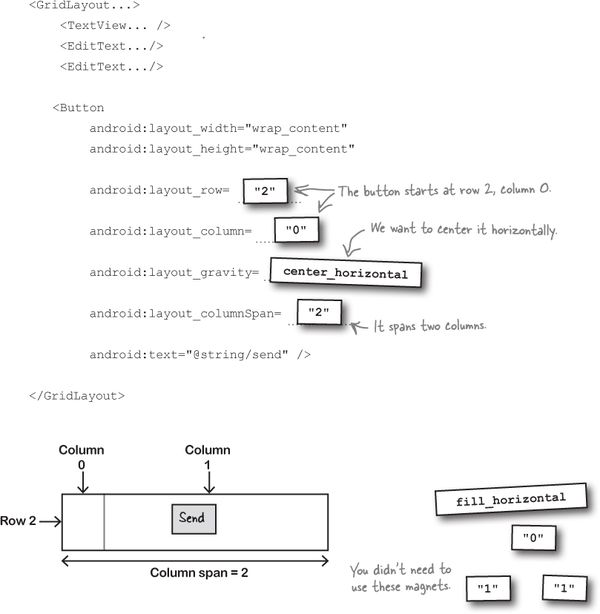

### The full code for the grid layout

Here’s the full code for the grid layout.

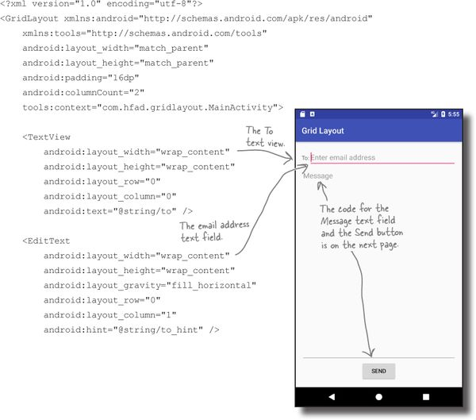

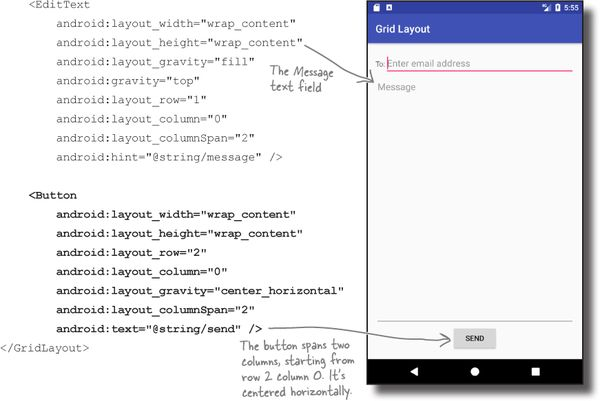
