layout: post
title: Android Linear Layout
tags: [android, ui, layout]
category: Android
---

See [线性布局](https://developer.android.com/guide/topics/ui/layout/linear.html?hl=zh-cn)

LinearLayout displays views in a single row or column

As you already know, a linear layout displays its views next to each other, either vertically or horizontally. If it’s vertically, the views are displayed in a single column. If it’s horizontally, the views are displayed in a single row.

You define a linear layout using the `<LinearLayout>` element like this:

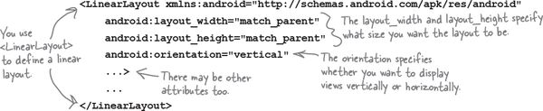

The `xmlns:android` attribute is used to specify the Android namespace, and you must always set it to `"http://schemas.android.com/apk/res/android"`.

A linear layout displays views in the order they appear in the layout XML

When you define a linear layout, you add views to the layout in the order in which you want them to appear. So, if you want a text view to appear above a button in a linear layout, you _must_ define the text view first:

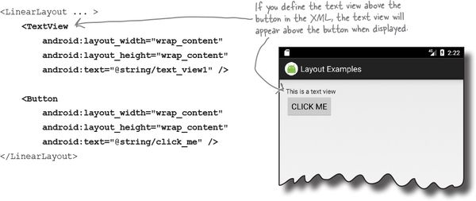

You specify the width and height of any views using `android:layout_width` and `android:layout_height`. The code:

```
android:layout_width="wrap_content"
```

means that you want the view to be just wide enough for its content to fit inside it — for example, the text displayed on a button or in a text view. The code:

```

android:layout_width="match_parent"
```

`android:layout_width` and android:layout_height are mandatory attributes for all views, no matter which layout you use.

They can take the values wrap_content, match_parent, or a specific dimension value such as 16dp.

means that you want the view to be as wide as the parent layout.

If you need to refer to a view elsewhere in your code, you need to give it an ID. As an example, you’d give the text view an ID of `"text_view"` using the code:

```
<TextView
 **android:id="@+id/text_view"**
 ... />
```

## layout’s width and height

You MUST set the layout’s width and height.

The `android:layout_width` and `android:layout_height` attributes specify how wide and high you want the layout to be. **These attributes are mandatory for all types of layout and view**.

You can set `android:layout_width` and `android:layout_height` to `"wrap_content"`, `"match_parent"` or a specific size such as 8dp — that’s 8 density-independent pixels. `"wrap_content"` means that you want the layout to be just big enough to hold all of the views inside it, and `"match_parent"` means that you want the layout to be as big as its parent — in this case, as big as the device screen minus any padding (there’s more about padding in a couple of pages). You will usually set the layout width and height to `"match_parent"`.

You may sometimes see `android:layout_width` and `android:layout_height` set to `"fill_parent"`. `"fill_parent"` was used in older versions of Android, and it’s now replaced by `"match_parent"`. `"fill_parent"` is deprecated.

**What are density-independent pixels?**

Some devices create very sharp images by using very tiny pixels. Other devices are cheaper to produce because they have fewer, larger pixels. You use density-independent pixels (dp) to avoid creating interfaces that are overly small on some devices, and overly large on others. A measurement in density-independent pixels is roughly the same size across all devices.

## Orientation is vertical or horizontal

You specify the direction in which you wish to arrange views using the `android:orientation` attribute.

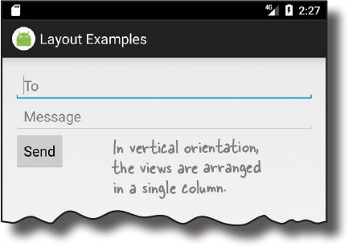

As you’ve seen in earlier chapters, you arrange views vertically using:

```
android:orientation="vertical"
```

This displays the views in a single column.

You arrange views horizontally in a single row using:

```
android:orientation="horizontal"
```

When the orientation is horizontal, views are displayed from left to right by default. This is great for languages that are read from left to right, but what if the user has set the language on their device to one that’s read from right to left?

For apps where the minimum SDK is _at least_ API 17, you can get views to rearrange themselves depending on the language setting on the device. If the user’s language is read from right to left, you can get the views to arrange themselves starting from the right.

To do this, you declare that your app supports languages that are read from right to left in your _AndroidManifest.xml_ file like this:

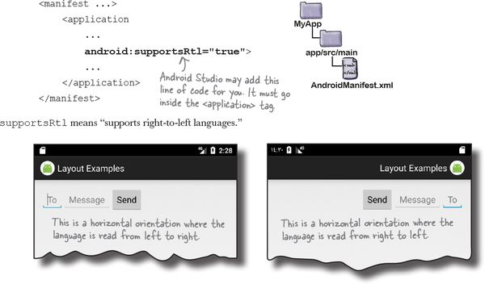

## Padding adds space

If you want there to be a bit of space around the edge of the layout, you can set **padding** attributes. These attributes tell Android how much padding you want between each of the layout’s sides and its parent. Here’s how you would tell Android you want to add padding of 16dp to all edges of the layout:

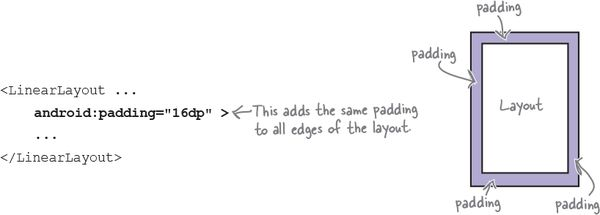

If you want to add different amounts of padding to different edges, you can specify the edges individually. Here’s how you would add padding of 32dp to the top of the layout, and 16dp to the other edges:

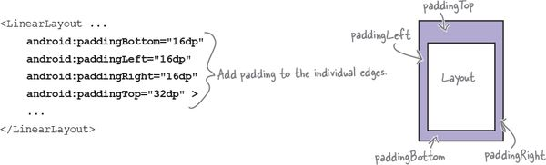

If your app supports right-to-left languages, you can use:

```
android:paddingStart="16dp"
```

and:

```
android:paddingEnd="16dp"
```

to add padding to the start and end edges of the layout instead of their left and right edges.

`android:PaddingStart` adds padding to the start edge of the layout. The start edge is on the left for languages that are read from left to right, and the right edge for languages that are read from right to left.

`android:PaddingEnd` adds padding to the end edge of the layout. The end edge is on the right for languages that are read from left to right, and the left edge for languages that are read from right to left.

**You can only use start and end properties with API 17 or above.**

_If you want your app to work on older versions of Android, you must use the left and right properties instead._

**Add a dimension resource file for consistent padding across layouts**

Once you’ve created the dimension resource file, you add dimensions to it using the `<dimen>` element. As an example, here’s how you would add dimensions for the horizontal and vertical margins to _dimens.xml_:

You use the dimensions you create by setting the padding attributes in your layout file to the name of a dimension resource like this:

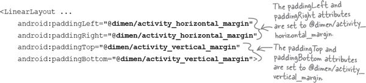


With that kind of setup, at runtime, Android looks up the values of the attributes in the dimension resource file and applies the values it finds there.

## Use margins to add distance between views

When you position a view using a linear layout, the layout doesn’t leave much of a gap between views. You can increase the size of the gap by adding one or more **margins** to the view.

As an example, suppose you wanted to put one view below another, but add 48dp of extra space between the two. To do that, you’d add a margin of 48dp to the top of the bottom view:

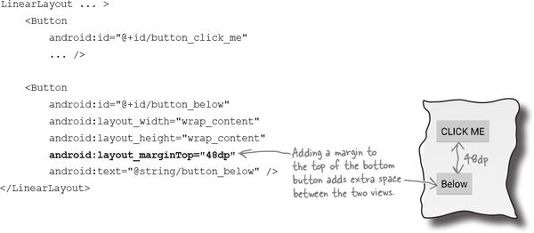

Here’s a list of the margins you can use to give your views extra space. Add the attribute to the view, and set its value to the size of margin you want:

```

android:attribute="8dp"
```

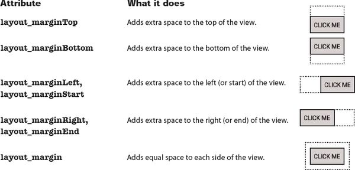

## Make a view streeeeetch by adding weight

All of the views in our basic layout take up just as much vertical space as they need for their content. But what we actually want is to make the Message text field stretch to take up any vertical space in the layout that’s not being used by the other views.

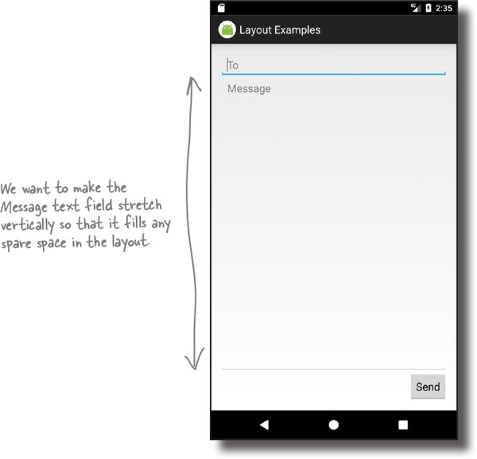


In order to do this, we need to allocate some **weight** to the Message text field. Allocating weight to a view is a way of telling it to stretch to take up extra space in the layout.

You assign weight to a view using:

<pre id="pro_id00063" data-type="programlisting" class="calibre34">
android:layout_weight="number"
</pre>

where `number` is some number greater than 0.

When you allocate weight to a view, the layout first makes sure that each view has enough space for its content: each button has space for its text, each editable text field has space for its hint, and so on. Once it’s done that, the layout takes any extra space, and divides it proportionally between the views with a weight of 1 or greater.

### Adding weight to one view

We need the Message editable text field to take up any extra space in the layout. To do this, we’ll set its `layout_weight` attribute to `1`. As this is the only view in the layout with a weight value, this will make the text field stretch vertically to fill the remainder of the screen. Here’s the code:

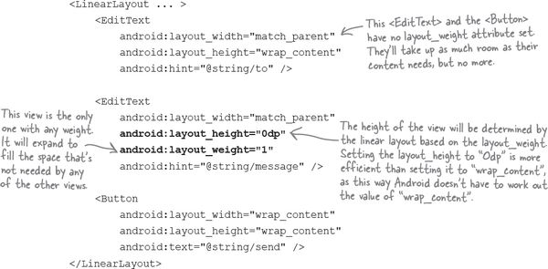

Giving the Message editable text field a weight of `1` means that it takes up all of the extra space that’s not used by the other views in the layout. This is because neither of the other two views has been allocated any weight in the layout XML.

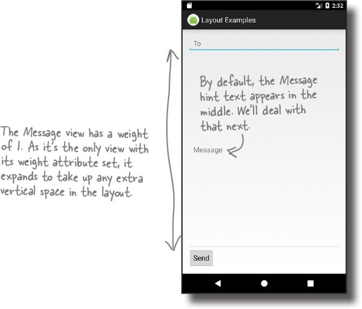

### Adding weight to multiple views

In this example, we only had one view with a weight attribute set. But what if we had _more_ than one?

Suppose we gave the To text field a weight of `1`, and the Message text field a weight of `2`, like this:

```xml
<LinearLayout ... >
    ...
    <EditText
        android:layout_width="match_parent"
        android:layout_height="0dp"
        android:layout_weight="1"
        android:hint="@string/to" />
    <EditText
        android:layout_width="match_parent"
        android:layout_height="0dp"
        android:layout_weight="2"
        android:hint="@string/message" />
    ...
</LinearLayout>
```

To figure out how much extra space each view takes up, start by adding together the `layout_weight` attributes for each view. In our case, this is 1+2=3. The amount of extra space taken up by each view will be the view’s weight divided by the total weight. The To view has a weight of `1`, so this means it will take up 1/3 of the remaining space in the layout. The Message view has a weight of `2`, so it will take up 2/3 of the remaining space.

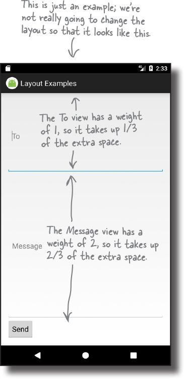

## Gravity controls the position of a view’s contents

The next thing we need to do is move the hint text inside the Message text field. At the moment, it’s centered vertically inside the view. We need to change it so that the text appears at the top of the text field. We can achieve this using the `android:gravity` attribute.

The `android:gravity` attribute lets you specify how you want to position the contents of a view inside the view — for example, how you want to position text inside a text field. If you want the text inside a view to appear at the top, the following code will do the trick:

```
android:gravity="top"
```

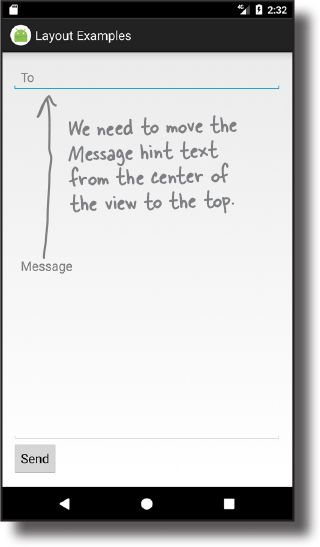

We’ll add an `android:gravity` attribute to the Message text field so that the hint text moves to the top of the view:

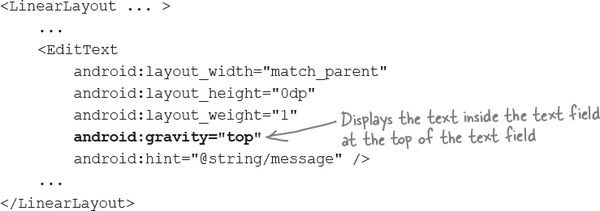

**Values you can use with the android:gravity attribute**


Here are some more of the values you can use with the `android:gravity` attribute. Add the attribute to your view, and set its value to one of the values below:

<pre id="pro_id00066" data-type="programlisting" class="calibre34">
android:gravity="value"
</pre>

> android:gravity lets you say where you want the view’s contents to appear inside the view.

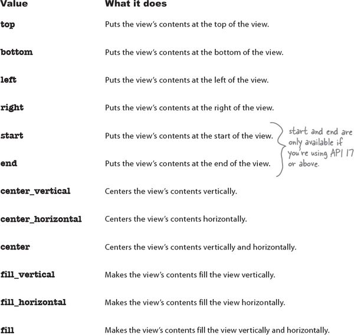


You can also apply multiple gravities to a view by separating each value with a “`|`”. To sink a view’s contents to the bottom-end corner, for example, use:

<pre id="pro_id00067" data-type="programlisting" class="calibre34">
android:gravity="bottom|end"
</pre>

## layout-gravity controls the position of a view within a layout

There’s one final change we need to make to our layout. The Send button currently appears in the bottom-left corner. We need to move it over to the end instead (the bottom-right corner for left-to-right languages). To do this, we’ll use the `android:layout_gravity` attribute.

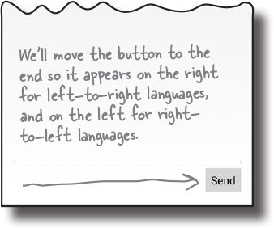

The `android:layout_gravity` attribute lets you specify where you want a view in a linear layout to appear in its enclosing space. You can use it to push a view to the right, for instance, or center the view horizontally. To move our button to the end, we’d need to add the following to the button’s code:

<pre id="pro_id00068" data-type="programlisting" class="calibre34">
**android:layout_gravity="end"**
</pre>

**Linear layouts have two attributes that sound similar to one another, gravity and layout_gravity.** A couple of pages ago, we used the `android:gravity` attribute to position the Message text inside a text view. This is because the `android:gravity` attribute lets you say where you want a view’s **contents** to appear.

`android:layout_gravity` deals with the **placement of the view itself**, and lets you control where views appear in their available space. In our case, we want the view to move to the end of its available space, so we’re using:

<pre id="pro_id00069" data-type="programlisting" class="calibre34">
android:layout_gravity="end"
</pre>

There’s a list of some of the other values you can use with the `android:layout_gravity` attribute on the next page.

**More values you can use with the android:layout-gravity attribute**

Here are some of the values you can use with the `android:layout_gravity` attribute. Add the attribute to your view, and set its value to one of the values below:

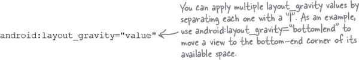


Value                                  | What it does                                                                    
-------------------------------------- | --------------------------------------
**top, bottom, left, right**           | Puts the view at the top, bottom, left, or right of its available space.        
**start, end**                         | Puts the view at the start or end of its available space.                       
**center_vertical, center_horizontal** | Centers the view vertically or horizontally in its available space.             
**center**                             | Centers the view vertically and horizontally in its available space.            
**fill_vertical, fill_horizontal**     | Grows the view so that it fills its available space vertically or horizontally. 
**fill**                               | Grows the view so that it fills its available space vertically and horizontally.

> android:layout_gravity lets you say where you want views to appear in their available space.

> android:layout_gravity deals with the placement of the view itself, whereas android:gravity controls how the view’s contents are displayed.

## The full linear layout code

Here’s the full code for the linear layout:

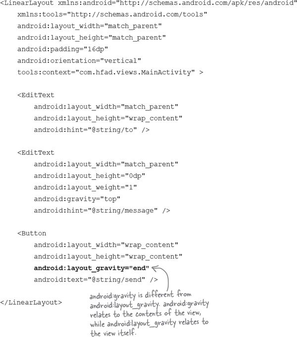
