---

layout: post
title: "URL"
description: ""
category: Java
tags: [java, pattern, patterns]
---

- [Design patterns implemented in Java](http://java-design-patterns.com/)
- [前言 · Design Pattern](https://alleniverson.gitbooks.io/design-pattern/content/)
- [Design patterns implemented in Java](https://java-design-patterns.com/)

# UML建模语言

UML 是统一建模语言（Unified Modeling Language）的缩写。UML 定义了多种图形化的符号来描述软件系统部分或全部的静态结构和动态结构，包括 10 中：

静态模型图:

- **类图**（class diagram）
- 对象图
- 包图
- 构件图（component diagram）
- 部署图（deployment diagram）

动态模型图: 

- **用例图**（use case diagram）
- **时序图**（sequence diagram）
- 协作图（collaboration diagram）
- 状态图（statechart diagram）
- 活动图（activity diagram）

## 用例图

用例图(Use Case Diagram): 也称为用户模型图, 是从软件需求分析到最终实现的第一步, 它是从客户的角度来描述系统功能. 用例图包含 3 个基本组件: 参与者(Actor), 用例(Use Case), 关系:

- 参与者(Actor): 与系统打交道的人或其他系统即使用该系统的人或事物. 在 UML 中参与者用人形图标表示
- 用例(Use Case): 代表系统的某项完整的功能. 在 UML 中使用一个椭圆来表示
- 关系: 定义用例之间的关系：泛化关系, 扩展关系, 包含关系

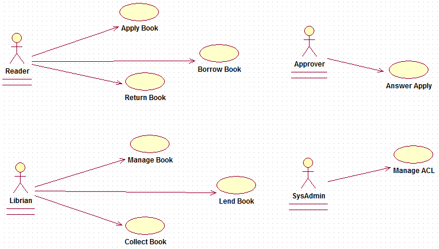

### 泛化关系

表示同一业务目的(父用例)的不同技术实现(各个子用例)。

以下是某购物网站为用户提供不同的支付方式

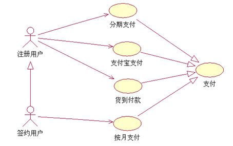

下面是关于一个公司的人事管理系统的需求的简单描述, 建立其相应的用例模型: 该人事管理系统的用户是公司的人事管理干部. 该系统具有人事档案库, 保存员工的人事信息, 包括姓名, 性别, 出生年月, 健康状况, 文化程度, 学位, 职称, 岗位, 聘任时间, 任期, 工资, 津贴, 奖罚记录, 业绩, 论著和家庭情况等, 系统提供的基本服务有人事信息的管理, 包括人事规定的权调动与聘任, 职称评定, 奖罚等, 并且可以按照限查询人事信息, 生成与输出统计报表等. 该人事系统每月向公司的财务系统提供员工的工资, 津贴等数据.

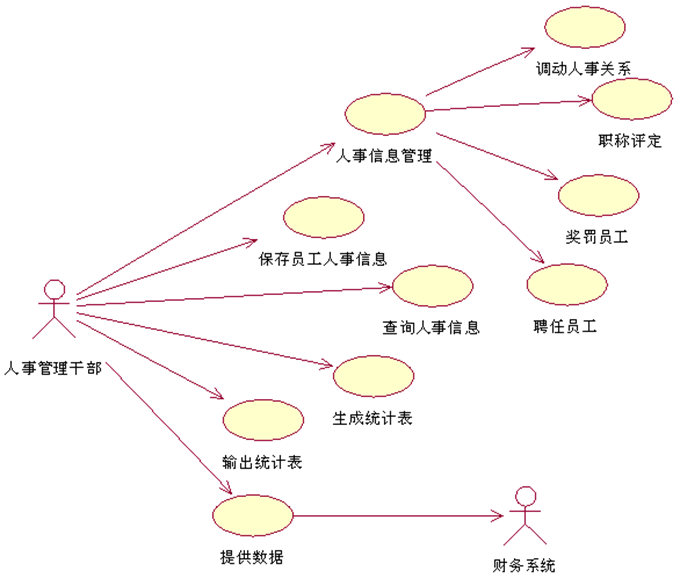

### 包含关系

一个用例可以包含其他用例具有的行为, 并把它包含的用例行为作为自身行为的一部分. 在 UML 中包含关系用虚线箭头加 “<>”, 箭头指向被包含的用例

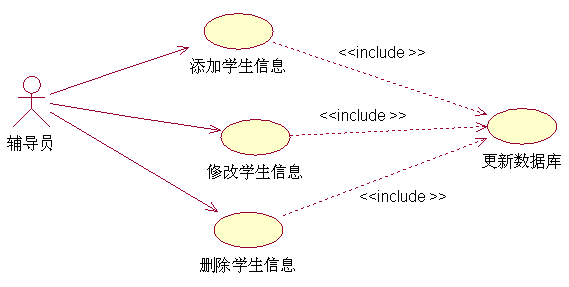

### 扩展关系

如果在完成某个功能的时候偶尔会执行另外一个功能, 则用扩展关系表示.在 UML 中扩展关系用虚线箭头加 “<>”, 箭头指向被扩展的用例

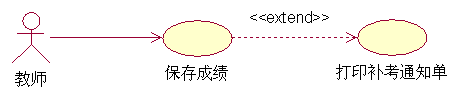

## 时序图

时序图用于描述对象之间的传递消息的时间顺序, 即用例中的行为顺序。

- 对象: 时序图中对象使用矩形表示, 并且对象名称下有下划线. 将对象置于时序图的顶部说明在交互开始时对象就已经存在了. 如果对象的位置不在顶部, 表示对象是在交互的过程中被创建的.

- 生命线: 生命线是一条垂直的虚线. 表示时序图中的对象在一段生命周期内的存在. 每个对象底部中心的位置都带有生命线.

- 消息: 两个对象之间的单路通信. 从发送方指向接收方. 在时序图中很少使用返回消息.

- 激活: 时序图可以描述对象的激活和钝化. 激活表示该对象被占用已完成某个任务. 钝化指对象处于空闲状态, 等待消息. 在 UML 中, 对象的激活时将对象的生命线拓宽为矩形来表示的. 矩形称为计划条或控制期. 对象就是在激活条的顶部被激活的. 对象在完成自己的工作后被钝化.

- 对象的创建和销毁: 在时序图中, 对象的默认位置是在图的顶部. 这说明对象在交互开始之前就已经存在了. 如果对象是在交互过程中创建的, 那么就应该将对象放到中间部分. 如果要撤销一个对象, 在其生命线终止点处放置 “ X” 符号.

ATM 用户成功登陆的时序图。

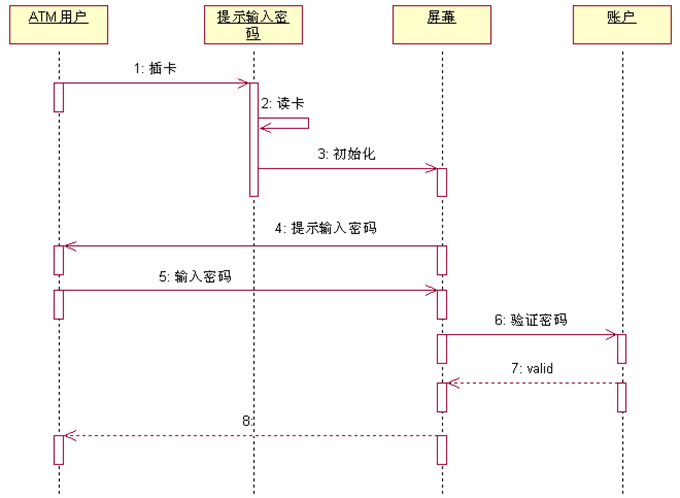


## 类图

类图是面向对象系统建模中最常用的图. 是定义其他图的基础. 类图主要是用来显示系统中的类, 接口以及它们之间的关系. 类图包含的主要元素有类, 接口和关系. 其中关系有泛化关系,关联关系, 依赖关系和实现关系. 在类图中也可以包含注释和约束。

类是类图的主要组件, 由 3 部分组成: 类名, 属性和方法。在 UML 中, 类用矩形来表示, 顶端部分存放类的名称, 中间部分存放类的属性, 属性的类型及值, 底部部分存放类的方法, 方法的参数和返回类型。

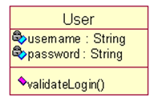 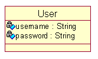 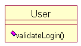 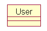

在 UML 中可以根据实际情况有选择的隐藏属性部分或方法部分或两者都隐藏

在 UML 中, 共有类型有 + 表示, 私有类型用 – 表示, 保护类型用 # 表示. UML 的工具开发商可以使用自己定义的符号表示不同的可见性。

- +表示public
- -表示private
- \#表示protected
- 什么都没有代表包可见
- 以<<开头和以>>结尾的为注释信息
- 带下划线的属性或方法代表是静态的

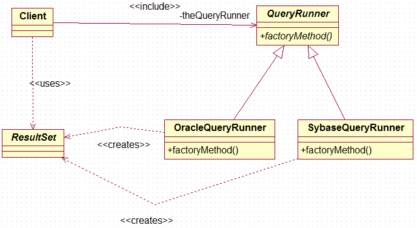

### 接口的表示法

接口中包含方法, 但不包含属性. 在 UML 中接口用一个带有名称的圆圈表示, 并且通过一条实线与它的模型元素相连

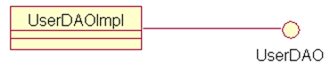

l有时候接口也使用普通类的举行符号表示

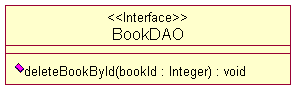

在[Java](http://lib.csdn.net/base/javase)以及其他的面向对象设计模式中，类与类之间主要有6种关系，他们分别是：依赖、关联、聚合、组合、继承、实现。他们的耦合度依次增强。

### 依赖（Dependence） 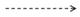

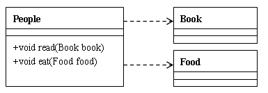

依赖关系的定义为：对于两个相对独立的对象，当一个对象负责构造另一个对象的实例，或者依赖另一个对象的服务时，这两个对象之间主要体现为依赖关系。定义比较晦涩难懂，但在java中的表现还是比较直观的：**类A当中使用了类B，其中类B是作为类A的方法参数、方法中的局部变量、或者静态方法调用。**类上面的图例中：People类依赖于Book类和Food类，Book类和Food类是作为类中方法的参数形式出现在People类中的。

**代码样例：**

```java
public class People{  
    //Book作为read方法的形参  
     public void read(Book book){  
        System.out.println(“读的书是”+book.getName());  
    }  
}
```

### 关联（Association）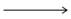、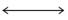、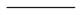

**单向关联：**

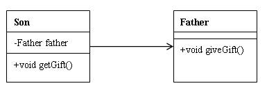

**双向关联：**

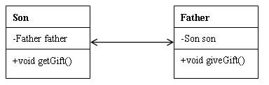

对于两个相对独立的对象，当一个对象的实例与另一个对象的一些特定实例存在固定的对应关系时，这两个对象之间为关联关系。关联关系分为单向关联和双向关联。在java中，**单向关联表现为：类A当中使用了类B，其中类B是作为类A的成员变量。双向关联表现为：类A当中使用了类B作为成员变量；同时类B中也使用了类A作为成员变量。**

**代码样例：**

```java
public class Son{  
   //关联关系中作为成员变量的类一般会在类中赋值  
    Father father = new Father();  
    public void getGift(){  
        System.out.println(“从”+father.getName()+”获得礼物”);  
    }  
}  

public class Father{  
     Son son = new Son();  
     public void giveGift(){  
         System.out.println(“送给”+son.getName()+“礼物”);  
     }  
 }
```

### 聚合（Aggregation）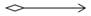

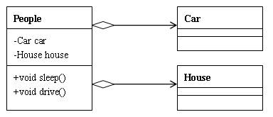

聚合关系是关联关系的一种，耦合度强于关联，他们的代码表现是相同的，仅仅是在语义上有所区别：**关联关系的对象间是相互独立的，而聚合关系的对象之间存在着包容关系，他们之间是“整体-个体”的相互关系。**

**代码样例：**

```java
public class People{  
    Car car;  
    House house;   
    //聚合关系中作为成员变量的类一般使用set方法赋值  
     public void setCar(Car car){  
        This.car = car;  
    }  
    public void setHouse(House house){  
        This.house = house;  
     }  

     public void driver(){  
         System.out.println(“车的型号：”+car.getType());  
     }  
     public void sleep(){  
         System.out.println(“我在房子里睡觉：”+house.getAddress());  
     }  
 }
```

### 组合（Composition）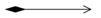

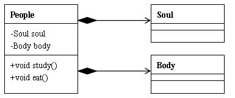

**相比于聚合，组合是一种耦合度更强的关联关系。**存在组合关系的类表示“整体-部分”的关联关系，“整体”负责“部分”的生命周期，他们之间是共生共死的；并且“部分”单独存在时没有任何意义。在下图的例子中，People与Soul、Body之间是组合关系，当人的生命周期开始时，必须同时有灵魂和肉体；当人的生命周期结束时，灵魂肉体随之消亡；无论是灵魂还是肉体，都不能单独存在，他们必须作为人的组成部分存在。

```java
Public class People{  
    Soul soul;  
    Body body;   
    //组合关系中的成员变量一般会在构造方法中赋值  
     Public People(Soul soul, Body body){   
        This.soul = soul;  
        This.body = body;  
    }  

     Public void study(){  
         System.out.println(“学习要用灵魂”+soul.getName());  
     }  
     Public void eat(){  
         System.out.println(“吃饭用身体：”+body.getName());  
     }  
 }
```

### 继承（Generalization）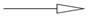

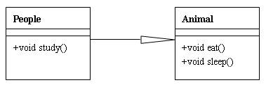

继承表示类与类（或者接口与接口）之间的父子关系。在java中，用关键字extends表示继承关系。UML图例中，继承关系用实线+空心箭头表示，箭头指向父类。

###  实现（Implementation）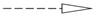

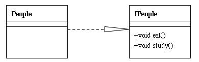

表示一个类实现一个或多个接口的方法。接口定义好操作的集合，由实现类去完成接口的具体操作。在java中使用implements表示。UML图例中，实现关系用虚线+空心箭头表示，箭头指向接口。

在java中继承使用extends关键字，实现使用implements关键字，很直观。就不代码演示了。

## 常用UML工具

| UML工具                                                      | 说明                                                         |
| ------------------------------------------------------------ | ------------------------------------------------------------ |
| MagicDraw UML                                                | UML工具                                                      |
| [jude](http://astah.net/editions/community)                  | 一个小巧实用的UML建模软件                                    |
| [Diagram Designer](http://meesoft.logicnet.dk/DiagramDesigner/) | 一款小巧易用的流程图工具，如果你对于流程图没有特殊的要求，那么这款小软件足够满足你的需求，最重要的是它完全免费。 |
| StarUML                                                      | UML工具                                                      |
| Visio                                                        | 用图形方式来表达各种商业图形用途的工具                       |
| Rational Rose                                                | 直接从UML发展而诞生的设计工具                                |
| PowerDesign                                                  | 对数据库建模而发展起来的一种数据库建模工具                   |