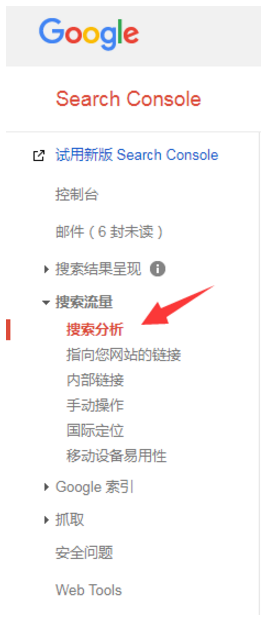

## COD 模式

COD模式很简单，一个产品展示页面+Facebook广告

它的流量源最直接，最粗暴的是通过广告的投放来获取的，还有一些人是靠网盟的方式来引进流量。

## Marketing 工具

- Google adwords（keywords planner）

- Google analysis

- Google webmaster

## SEO

从SEO的角度来说，流量的获取其实分为三部分：

1. **靠技术**

   网站的技术驱动 > 创建更多的网站页面 > 使用更多的关键词 > 获取更多的流量

2. **靠外链**

   制作更多的外链建设 > 使网站获取更好的权重 > 获取更多的流量

3. **针对内容进行更有针对性的优化**

   优化已经排名起来的内容 > 提高连接性和可搜索性> 获取更多的流量

   这个策略其实是非常好的方法，因为一个网站在开始的时候，获取流量和外链是非常难得，那么可以针对已经有的网站排名进行优化。

   打开你的Google analyse 如何点击 所有流量 > 渠道

   

   选择查看着陆页，如下图：

## Skyscraper Technique

Skyscraper Technique，中文可以理解为摩天轮策略。最早这个概念是由国外的的知名站长Brian Dean提出来的

Skyscraper Technique的精髓很简单，就是比好的更好。

怎么入手？也就是前面我们说过的，根据搜Ga分析的结果，重构我们已经有所排名的文章（着陆页），制作出更好的文章

好的内容如果没有经过很好的优化，那根本谈不上优化。优化内容对于搜索引擎而言更具竞争力，也更容易获取排名。**内容优化**它是一个提高网站或网页的美观度和性能的一个过程，通过页面搜索引擎优化、转化优化、提升用户体验、改善设计、编辑内容等，为用户提供独特的价值。

使用 Google webmaster，点开 搜索分析，如下图：

然后你可以点击查看用户的查询词 （Quries）

这些查询语句，对我们做排名意义重大！

## From

- [最全跨境电商内容营销全指导 顾小北的B2C博客](http://www.guxiaobei.com/cross-border-electronic-business-content-marketing.html)