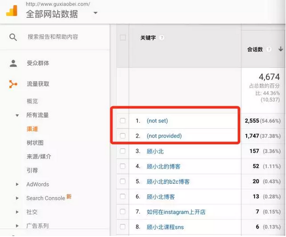
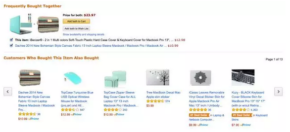
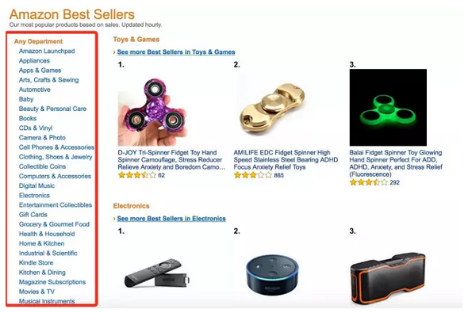
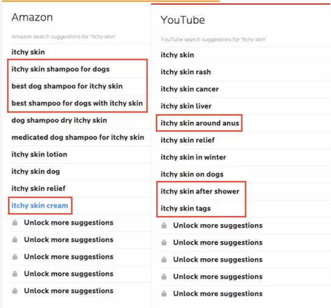

From 

- [关键字挖掘：什么样的关键字是好关键字？](http://www.guxiaobei.com/what-are-good-keywords.html)

- [史上最全的关键字工具，手把手教你如何挖掘！ 顾小北的B2C博客](http://www.guxiaobei.com/keyword-tool-introduction.html)

## How to find keywords

### Google

#### 谷歌自动关键字建议

要在Google的搜索框上输入关键字  ，谷歌会自动给出提示，比如我输入 iphone case charger 就会出现关键字自动提示，如下图：

*那么这个关键字的自动提示，他的原理是什么？*这里面的原理一些人可能不了解，我这边给大家解释一下，主要有一下两点：

- 谷歌可以根据用户平常最常搜索的关键字，来给你做关键字建议，这个是根据谷歌的大数据库。
- 再一个一些关键字的自动提示，是Google从Google adwords里面调出来的。

谷歌的关键字自动挖掘，可以不断循环的往下挖，比如挖掘到一个关键字，那么把这个关键字又重新放入搜索框，Google 也会再次给你关键字建议，这一块你就可以源源不断的获取了。

#### 谷歌相关关键字搜索建议

各位在Google上输入关键字之后，把网页往下拉，就可以看到Google会给出相关词的搜索建议，那么利用这个功能也可以提升你关键字的词库量，如下图所示：

同样的道理，你可以点击其中相关的关键字，然后网页在往下拉，又可以重新挖掘新的关键字。

#### Google分析工具

我们知道Google在Google分析工具里面，对于用户使用何种关键字来到你的网站，是有限制的，如下图所示：

大家看到没有，Google对最大的关键字来源做了限制，一个是not set、一个是not provided 这个主要是因为*Google不想让网站的管理员知道用户的搜索行为和意图*，这是Google保护用户隐私的一个行为。

但是用户在我们网站上搜索什么样的关键字，查看什么样的内容我们却可以通过Google分析工具来得出

在哪里查看呢？ 如下图：

那么这个时候你点击Search Terms就可以查看平常用户在你网站上是如何使用关键词的。

**特别注意**

这个Search Terms是要在Google 分析中设置才能看到的，如果事先没有设置，你去点这个功能，那什么也看不到。

如何设置？

在Google分析中点开账号，选择全部网站数据中的视图设置

然后就可以在Query parameter中设置查询的参数，这样子Google就会追踪用户的在你网站的搜索关键字，如下图：

#### Google Correlate

**地址：**https://www.google.com/trends/correlate/

Google Correlate这个工具相信很少人会用到，这个工具会给出相关的关键字，如下图搜索lose weight

得出来的是：

to lose weight
how many calories
lose 20 pounds
eat to lose
to walk out
是这样的一个关键字建议，是和你给出的关键字相关的拓展和建议。

#### 利用Google广告

各位可以想想竞争对手，是花了多少钱来做广告，每一个广告的关键字必然是有研究的，有针对性的。那么竞争对手的所使用的关键字竞价，其实是非常值得搜集的。

研究竞争对手在广告上所打的关键字，绝对是一个明智的选择

#### 谷歌趋势 

**地址：**https://trends.google.com/trends/

利用谷歌趋势来调研关键字，这个我之前也写过。这里我选取关键字7天的变化情况，如下图：

我们鼠标往下拉，可以查看两个比较重要的功能，一个是：Related topics，一个是Related queries 利用这两个功能都可以挖掘更深层的关键字。如下图所示：

而且各位看到没有，这里面有些是长尾词，你可以把他搜集起来方便今后写文章。

这里还告诉一个好玩的，之前在优联荟里面，有一个读者分享了一个我觉得很牛逼的事。这个读者利用Google trends去买shopify的股票，如下图：

shopify在Google trends的上涨情况：

shopify的股票变化：

这个朋友一买一个准，你看人才到处都有！今天在这里也分享给大家这个有用的思路。

### 专业知识

#### 分析热门的帖子

在第三个步骤中，我们分析了竞争对手的网页，然后分析他的关键字，那么其实我们也可以直接在Google上搜索最热门的帖子，来分析这个帖子的关键字

比如我搜索affiliate marketing，那么我要针对一些热门的帖子，然后按照步骤三的方法来分析

如上图所示我们可以输入**关键字+空格+““most popular posts/sites/articles**这样的语句来查询

找到热门的的文章，分析为什么这些文章会成为热门，他们使用了哪些关键字？你可以按照步骤三的方法来分析。

#### 分析竞争对手的关键字 

这种方法大家都清楚，可惜很多人用不好，我告诉大家我的方法！

- 打开竞争对手的网站
- 无论是网站的首页，还是内页，执行“command + option + u” （window 的执行“control + alt + u” 命令）或者鼠标右击，点击查看源代码。
- 这时候执行“command + f”（control+f）的命令
- 输入keyword，这样就可以查看竞争对手所所使用的关键词

利用这种方法能快速查到竞争对手在网站上所使用的关键字，非常直接有效。**顺便说一下，利用这种方法，可以查看竞争对手的网站，哪些使用了H1，title，description是怎么写的。**

#### Yahoo问答 

**地址：**https://answers.yahoo.com/

大家都喜欢用工具来挖掘关键字，但是各位可知道类似Yahoo问答，国内的百度贴吧，百度知道，很多用户都直接在上面提问问题。

用户对于问题都描述，其实是最直接了解用户需求的地方。你天天说要了解用户的需求，用户最经常去的地方，最常问的问题不就是用户关切点么？

因此通过用户的问题，你不仅可以查看用户的需求，另外一方面你的文案可以针对用户的需求来撰写，这个非常的有针对性，而不是文案一如既往的自嗨。

#### 通过邮件 

用户和你是在邮件沟通的过程中，是怎么描述产品的？我之所以写到这一点，就是要让大家明白，一定要保持好奇， 用户在和你聊天的过程中所使用的语句，字词都是你了解关键字的重要入口。

#### 利用行业里面的论坛来查找关键字

我不知道各位有没有注意到，如果你足够敏锐的其实行业性的论坛可以查找很多的关键字，一个是论坛的引导标题，一个是用户的询问的问题

如下图所示：

这个是关于金融类的论坛，我们可以找出相关的关键字，比如：Roth IRA, pension contributions, mutual funds, health savings account, mortgage, investing, and life insurance

你看这些关键字，或者长尾词你可以利用他们来创建内容，或者相关的文章。

#### 利用Twitter的Hashtags 

Twitter的Hashtags顾名思义相当于国内微博上的热词，利用这些hashtags实际上你也可以发现一些关键字，或者关键字相关的词。

如图在twitter上搜索 #yoga 其中的hashtag可以出现 #fitness #meditation

上述我只是举一个例子，实际上在twitter每分钟可以产生很多的hashtag，这些热词都是有用户自动发起，然后系统把最火的词排名起来，这不仅可以拓展你的seo关键字，而且还可以为你写文章注入新的思路。

#### Tagblender

**地址：**[http://www.tagblender.net/](http://www.tagblender.net/)

这个工具类似Twitter上的hashtag，不过此工具是针对Instagram的。很多人不知道做Instagram要用什么样的hashtag，这个工具可以很好的帮到你。

在左侧大家可以看到各种选项，比如有最流行（popular）的hashtag，有like和comment最多的hashtag，如下图：

我们假设你是做假发的，你可以选择Hair style，然后出现假发的各种hashtag，点击左边蓝色的10（也可以点击30，表示30个hashtag），就可以跑到右边，你可以copy这些hashtag到自己的Instagram 图片下做标签。如下图：

利用上面这个功能，你想都不用想要用哪些hashtag。

### 亚马逊

#### 亚马逊的评论功能

这个方法我是经常使用，我做关键字时都会跑去亚马逊上的竞争对手，看客户的评论，他们对于产品是怎么描述的，从中可以挖掘很多用户的需求，也可以知道用户对于产品的反馈，另外也可以看到用户对于产品是怎么描述的。

亚马逊既然是一个购物的平台，大多数情况下（排除刷单）他可以真实的反映客户的真实需求，这其实是一个非常好的功能。

关键字可以在下面两方面查看，一个是产品的标题，如下图：

另外一个就是用户的评论，如下图：

利用产品的标题，以及用户的评论，一方面你可以知道如何拓展**购物型**的关键字，也可以了解用户是怎么形容一个产品的关键字。

#### 亚马逊关键字自动提示

和Google关键字自动提示一样，亚马逊的关键字自动提示功能也很强大，比如我输入headphone，亚马逊会出现相关的关键字建议，如下图：

#### Amasuite 

**地址：**[http://amasuite.com/](http://amasuite.com/)

这是一款亚马逊工具！他能帮助你分析亚马逊上的产品，以及做关键字的调研。这些关键字的产生都是一些“buyer keywords”，显然这样的关键字上比较有价值的

此工具可分析Amazon 美国站, Amazon 英国站, 以及eBay US, eBay UK, Walmart。工具可以分析用户使用何种关键字来购买产品。如下图所示：

## best seller

地址：https://www.amazon.com/Best-Sellers/zgbs

然后进一步展开类目，查找和你产品相关的最好的best sellers产品，如下图所示：

这个时候，你可以点开具体的一个品类，挖掘关键字。具体方法参考上面第四步。

今天为大家列出30个挖掘关键字的有用工具，很多都是第一次在这边公布。关键字的挖掘是最为重要的步骤，我自己挖掘关键字，一半是靠工具，一半是人工看大量的数据，比如亚马逊的评论，大量的论坛，Yahoo问答，Quora上用户对于相关问题的讨论。

### 同义词

#### Wikipedia

通过Wiki来查找关键字，这个一般人是不会用到的，但这个功能太强大了。本公众号至少有3处提到Wiki但使用方法。

我们还是以headphone为例子：

地址：https://en.wikipedia.org/wiki/Headphones

 

我们可以看到关于headphone的介绍，我特地用红色框框标识出来

红色部分为：

> Headphones are also known as earspeakers, earphones[1] or, colloquially, cans.

> The other type, known as earbuds or earphones

 

这些所列出来的都是关于headphone这个关键字的另外表达，这一点非常的重要。我们知道headphone这个词已经非常白热化了，那么关于这个词的其他表达都是可以被替换的，这部分也是有相当大的人群搜索。

 

是所要表达的意思是通过维基百科这个平台，你可以挖掘出很多老外原汁原味的表达，他这个词平常是和哪些词组结合在一起，他的其他叫法是什么，所以通过Wiki可以了解到关于这个产品的很多有用信息，不仅对我们做网站，还对我们的站外推广都非常的有用。

#### Metaglossary

**地址：**[http://metaglossary.com/](http://metaglossary.com/)

这个工具和wiki是类似的，也是给你一些关键字的拓展和衍生。这个工具也是在本公众号第一次开放，如下图当我工具中输入，headphones，可以看到如下关键字建议：earphones，transducer，listener，elector，ear，intercome

如下图所示：

### 

#### Thesaurus

地址：[http://www.thesaurus.com/](http://www.thesaurus.com/)

我们知道字典可以对一个关键字给出具体的定义，也可以给出相关的关键字建议。

利用Thesaurus或者Dictionary可以查询关键字的具体定义（Definition）以及同义词（Synonyms），如下图所示：

利用definition可以查看相关关键字的定义

### 关键词工具

#### soovle 

**地址：**[http://www.soovle.com/](http://www.soovle.com/)

利用Soovle可以一次性为你拓展不同渠道的关键字，比如wikipedia，Google，Amazon，Bing，Answers.com. 如下图，我输入关键字headphone，系统给出上述各渠道的关键字建议。

#### semrush 

**地址：**https://www.semrush.com/

Semrush这个工具大家都应该知道了

记住利用这个工具的时候，我是*输入竞争对手的网址，而不是主要关键字来朝着的*（划重点！）

#### keywordtooldominator 

**地址：**[http://www.keywordtooldominator.com/](http://www.keywordtooldominator.com/)

这个关键字一天可以免费查三次。可以查询关于Google，亚马逊，YouTube的关键字

输入关键字，然后系统会在右边给出关键字建议，你可以勾选需要的关键字，这样可以导入右侧的关键字词库，非常方便。

#### Zippy 

**地址：**[http://www.zippy.co.uk/keyworddensity/index.php](http://www.zippy.co.uk/keyworddensity/index.php)

这个工具可以迅速的分析你的竞争对手使用单个关键字和两个关键字的频率和密度，如下图：

#### wordtracker 工具 

地址：[http://wordtracker.com/](http://wordtracker.com/)

这个工具为付费工具，但是一天可以查询四次，每次产生10个关键字建议

虽然只有10个免费的关键字查询，但是这10个关键字非常的有针对性，而且质量很好，如下图所示：

而且这个工具，能给出亚马逊和YouTube的关键字建议，如下图：

## keywordtool.io 

**地址：**[http://keywordtool.io/](http://keywordtool.io/)

牛逼啊我的keywordtool.io，这个公众号已经是第三次提到了，这个工具谁用谁喜欢

而且这个工具可以让你查询Google，Youtube，Bing，Amazon，APP Store的关键字

输入关键字，比如headphone，系统会给出一系列的关键字建议，如下图：

你可以刷选需要的关键字，然后可以做表格的导出。使用一段时间之后，如果你觉得还不错，想要查看关键字的搜索量，CPC，以及adwords的竞争程度，你可以付费查看。

但无论如何这都是一个很好的关键字查找工具。

#### 利用Answer the Public工具 

**地址：**[http://answerthepublic.com/](http://answerthepublic.com/)

我绝对不会告诉你这个工具是我最喜欢的，而且你们知道么上面的这个老头超逗。。。我保证你会喜欢的

（这里假装笑声很大的样子…）

这个工具很强大，可以给你关键字的内容建议，如下图所示：

## Commercial Keywords

我们知道用户在Google上搜索关键字，然后到一个网站，再到最终的去购买，这是要有一个过程。不是所有的用户搜索的，就代表用户的购买意图。

**比如：**

- 有些用户只是单纯的想看看一个产品／领域的信息，还没有购买的欲望
- 有些用户已经有购买的欲望，但是想更深入的了解这个产品的具体规格，价格
- 有些用户的购买意图很强，直接上来就使用，buy，where to buy等购买的词汇

你看用户搜索行为的不同，直接反映了不同的用户意图。我们可以把用户是否具有购买的行为称之为：*Commercial Intent*或者是 *Buy Intent*。

我们常见的 Commercial Intent 的关键字，可以分为Buy now和Product这两大部分的关键字。

### Buy now 关键字

Buy now是最直接的能反映出用户的购买意愿，用户输入这样的关键字离购买就差付款了，这些关键字包括：

- Buy
- Discount(s)
- Deal(s)
- Coupon(s)
- Free shipping

比如用户直接在网上搜索，“buy headphones”，“buy T-shirt online”，“T-shirt online free shipping”。这样的关键字，可能不会有很高的搜索量，但却可以直接产生购买和转化。

### Product 类的关键字

Product类的关键字，一般是用户想要了解某一个具体的产品或者服务的时候，会输入这样的关键字。输入这样的关键字，用户的购买意图会稍微弱一点，也就是比buy now的意图弱一点。

**这些关键字包括：**

- 品牌搜索 (anker goods)
- 具体产品搜索 (“iPhone 5c” )
- 产品品类搜索 (summer dresses”, “insect repellant”, “beach accessories”
- Affordable
- Best
- Cheapes
- Comparison
- Review
- Top

### Informational Keyword

还有一些关键字，并没有直接的搜索购买动机，只是这个这些词离购买的最终行为还有一定的距离，我们可以把这样的词称之为：Informational Keyword，用户一般会用疑问句来搜索，比如：how，where 他们用这些词来看review，来比较价格

**这些词包括：**

How to

Best way to

Ways to

I need to

好来，到了这一步，大家已经知道了什么是Commercial Intent，哪些关键字具备购买意图。

那么问题来了，如何挖掘Commercial Intent的关键字，**如何判断他的搜索量？**

### Commercial Intent 关键字挖掘

以iPhone这个关键字来进行说明。

首先打开Google关键字分析工具，
地址：https://adwords.google.com/home/tools/keyword-planner/ 如下图：

在搜索框里面输入“iPhone”这个关键字，如下图：

我们看到这些词**平均的每月搜索量**以及**竞争程度**的分析，如下图所示：

就是你看竞争程度，Google关键字就给了你，高中低，这其实是很泛的，那怎么办呢？

方法其实很简单，就是你可以在Google的搜索框里面，在输入这个关键字，看有没有对这个词做广告（Google PPC）。

我们以 best iPhone deal 为例，他在Google工具中的竞争程度为“高”，如下图：

发现针对ppc的广告的竞争度很强。

下面再给出一些常用的Commercial intent，这些词是我在浏览Warriorforum上看到的，今天在这里一并给大家，**地址如下**：http://suo.im/19TqWN

<li> Achieve
<li> Alleviate
<li> Auction
<li> Avoid
<li> Bargain
<li> Bargain [product name]
<li> Benefit
<li> Best
<li> Best [product name] (online)
<li> Best [product name] site
<li> Best [product name] website
<li> Best + product type + in year.
<li> Best of [product name]
<li> Best price for [product name]
<li> Best savings for [product name]
<li> Big [product name]
<li> Biggest [product name]
<li> Bonus
<li> Brand name [product name]
<li> Brand names
<li> Brand new [product name]
<li> Budget
<li> Budget [product name]
<li> Build
<li> Buy
<li> Buy [product name] (online)
<li> Buy [product name] with credit card
<li> Buy [product name] with paypal
<li> Buy one get one for 1 cent
<li> Buy one get one free
<li> Buy one get one half-off
<li> Buying
<li> Cash back for [product name]
<li> Cheap
<li> Cheap [product name] (online)
<li> Cheapest
<li> Cheapest [product name] (online)
<li> Cheapest price for [product name]
<li> Clearance
<li> Clearance [product name]
<li> Closeout
<li> Closeout [product name]
<li> Code with
<li> Compare
<li> Compare [product name]
<li> Comparison
<li> Computer tutorial
<li> Coupon
<li> Coupon code for [product name]
<li> Coupon for [product name]
<li> Cure
<li> Deal with
<li> Deals
<li> Dependable
<li> Direct
<li> Directions
<li> Discontinued [product name]
<li> Discount
<li> Discount [product name]
<li> Discount code
<li> Easily
<li> Easy
<li> Economical
<li> Eliminate
<li> End
<li> Expensive [product name]
<li> Explain
<li> Explaining
<li> Fast
<li> Faster
<li> Find a [product name]
<li> Fix
<li> For children
<li> For couples
<li> For girls
<li> For guys
<li> For kids
<li> For men
<li> For newbies
<li> For sale
<li> For seniors
<li> For students
<li> For women
<li> Free
<li> Free shipping
<li> Free tutorial
<li> Free tutorials
<li> Frugal
<li> Gain
<li> Get [product name] (online)
<li> Get a [product name]
<li> Get rid of
<li> Good price for [product name]
<li> Great buy
<li> Guide
<li> Guide (s)
<li> Guide to
<li> Heal
<li> Healthy
<li> High price [product name]
<li> High priced [product name]
<li> How
<li> How can
<li> How do
<li> How do i
<li> How do you
<li> How to
<li> How to ... with [product name]
<li> How to build
<li> How to get rid of
<li> How to make
<li> Immediately
<li> Improve
<li> Improving
<li> Increase
<li> Inexpensive
<li> Inexpensive [product name]
<li> Install
<li> Instruction
<li> Instructions
<li> Internet tutorial
<li> Learn
<li> Learning
<li> Lease
<li> Low cost
<li> Low cost [product name]
<li> Low priced
<li> Low priced [product name]
<li> Lowest price for [product name]
<li> Luxury
<li> Luxury [product name]
<li> Method (s)
<li> Model numbers
<li> Need
<li> New
<li> New [product name]
<li> Now
<li> Offer
<li> On sale
<li> Online
<li> Online tutorial
<li> Order
<li> Overcome
<li> Password
<li> Personalized
<li> Plan (s)
<li> Prevent
<li> Program(s)
<li> Protect
<li> Purchase
<li> Quick
<li> Quicker
<li> Quickly
<li> Rebuild
<li> Recover
<li> Reduce
<li> Reduced
<li> Reduced [product name]
<li> Refurbished [product name]
<li> Relieve
<li> Remedy
<li> Rent
<li> Repair
<li> Resonable priced
<li> Restore
<li> Review
<li> Reviews (s)
<li> Sales-priced
<li> Sales-priced [product name]
<li> Save
<li> Savings
<li> Scam
<li> Second hand [product name]
<li> Secret
<li> Secret code
<li> Secret codes
<li> Secrets
<li> Simple
<li> Software
<li> Solution
<li> Solution
<li> Solve
<li> Step by step
<li> Study
<li> Technique
<li> That works
<li> Tips
<li> Top
<li> Top 10 + product type + in year
<li> Top of the line [product name]
<li> Training
<li> Treat
<li> Tutorial
<li> Tutorials
<li> Unique
<li> Unlock
<li> Used
<li> Used [product name]
<li> Value
<li> Video
<li> Videos
<li> Where can
<li> Where can i
<li> Where can i buy [product name]
<li> Where to buy [product name] (online)
<li> Where to find [product name] (online)
<li> Where to shop for [product name] (online)
<li> Wholesale
<li> [product name] coupon
<li> [product name] coupon code
<li> [product name] discount
<li> [product name] for cheap
<li> [product name] in stock
<li> [product name] on sale
<li> [product name] overstock
<li> [product name] pre-owned
<li> [product name] promo
<li> [product name] promo code
<li> [product name] review
<li> [product name] special

