## Skyscraper Technique

原文：[SEO Case Study: How I Increased My Organic Traffic 652% in 7 Days](https://backlinko.com/skyscraper-technique-2-0)

Skyscraper Technique，中文可以理解为摩天轮策略。最早这个概念是由国外的的知名站长Brian Dean提出来的

Skyscraper Technique的精髓很简单，就是比好的更好。

怎么入手？也就是前面我们说过的，根据搜Ga分析的结果，重构我们已经有所排名的文章（着陆页），制作出更好的文章

好的内容如果没有经过很好的优化，那根本谈不上优化。优化内容对于搜索引擎而言更具竞争力，也更容易获取排名。**内容优化**它是一个提高网站或网页的美观度和性能的一个过程，通过页面搜索引擎优化、转化优化、提升用户体验、改善设计、编辑内容等，为用户提供独特的价值。

使用 Google webmaster，点开 搜索分析，然后你可以点击查看用户的查询词 （Quries）

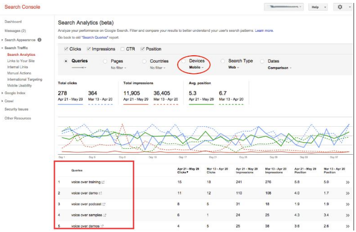

这些查询语句，对我们做排名意义重大！

**怎么做呢？**

- 把每一个查询语句（只做前20个），变成一篇文章！

- 可以用查询语句来做标题

- 文章内容，可以只针对这个关键词进行优化，当你可以对这个关键词进行变体，语义相关的优化优化多少个呢？两千个的字符中，5个就行！

- 前面这三点很重要，如果要加上第四点的话，可以在这篇文章中自然的添加相关性文章的*内链*。也就是相关页面之间的相互链接（最好能高权重的页面，带动低权重的页面，可以相互提升）

所以讲到这里，你要明白

- 针对查询语句，进行前20名的优化
- 分析竞争对手的内容策略是怎么样的？你有没有机会打败他们？
- 重新优化，并推广你的内容策略，使之更有竞争性

这一点也是一个大的话题，比如内容写好之后如何推广呢？这里我列出一些，希望可以帮助到你：

**那么文章写好之后，你可以发布在：**

- [linkedin](https://www.linkedin.com/)
- [medium](https://medium.com/)
- [steemit](https://steemit.com/)
- [crunchbase]([https://www.crunchbase.com)
- [about.me](https://about.me/)
- [Reddit]([https://www.reddit.com/)
- [producthunt]([https://www.producthunt.com)
- [Facebook](https://www.facebook.com/)
- [Youtube](https://www.youtube.com/)
- [Twitter]([https://twitter.com](https://twitter.com/))
- [slideshare]([https://www.slideshare.net)
- [quora]([https://www.quora.com)
- [Google+/Google my business](https://www.google.com/business/)
- **从高权重的网站上去获取流量**
  - Buzzfeed,
  - Life Hack,
  - Entrepreneur.com,
  - Huffington,
  - New York Times

## 优化内容

### 优化标题和描述 

标题仍然是Google算法排名中的关键性要素

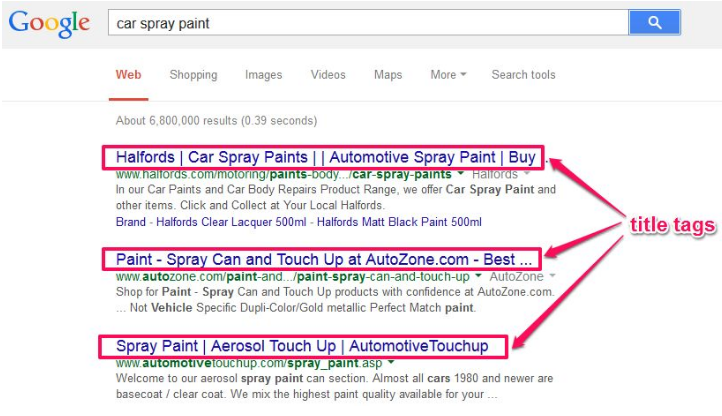

我们优化的原则是什么呢？

- 优化的标题，使之能有更好的点击率（论标题党的重要性）
- 标题之中包含关键词
- 标题和内容保持一致
- 把竞争对手的标题罗列出来，比较标题的优劣

### LSI相关的关键词和二级关键词 

这里要注意，我们说的关键词优化不仅包含是对我们要推广的关键词进行优化，还是可以针对这个关键词进行语义相关，同义词的优化。

用在哪里呢？

- 标题
- 描述
- H1标签
- alt
- 文字内容

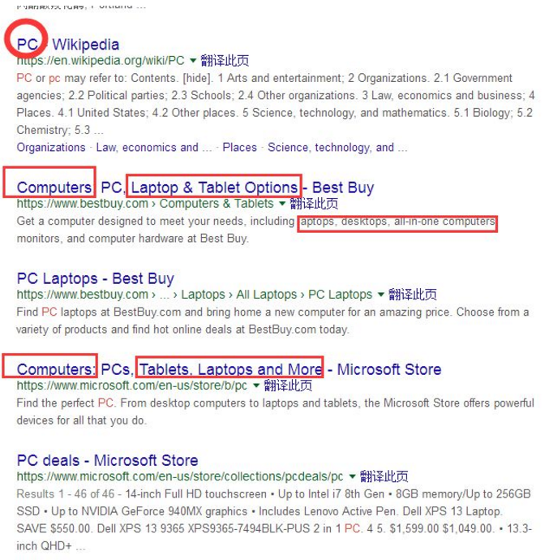

### 可读性 

很多文章的内容其实是非常好的，但是不具有可读性。

为什么？

你去看很多人写的文章，整个段落密密麻麻的，那么即使你这篇文章写的很好，跳出率也会很高

如果你足够认真的话，你去看很多好的写手，他的文章段落绝不会是挤在一起。

所以

- 尽可能的把段落分开，尽量简洁，方便阅读

- 使文章之间更有层次和逻辑（H1 标签，子目录，黑体）

### 实用性 

你的文章不仅要满足可读性，更要满足实用性。也就是说用户在看你的文章的时候，是对他有所受用的，能有启发性的

你可以在你的文章中多增加一些，有互动性，或者能引起用户感兴趣的内容，比如

- did you know
- 用户购买快速浏览指南
- 这个产品是如何工作的
- 提供详细信息，可选择/可扫描

### 内容的深度 

内容为王这句话可不止是口头上说说而已。这就是为什么内容在seo上的重要性，以及Google对于深度有质量内容的喜爱。

我觉得维基百科，这个网站其实挺值得我们去学习的，不仅因为其内容的长度，而且还因为它们为每个内容提供的信息的深度。

文章非常的有框架性和条理性，也具备很好的链接性（相互链接）

深度的文章有字数的一个区间吗？

我认为要2000字左右

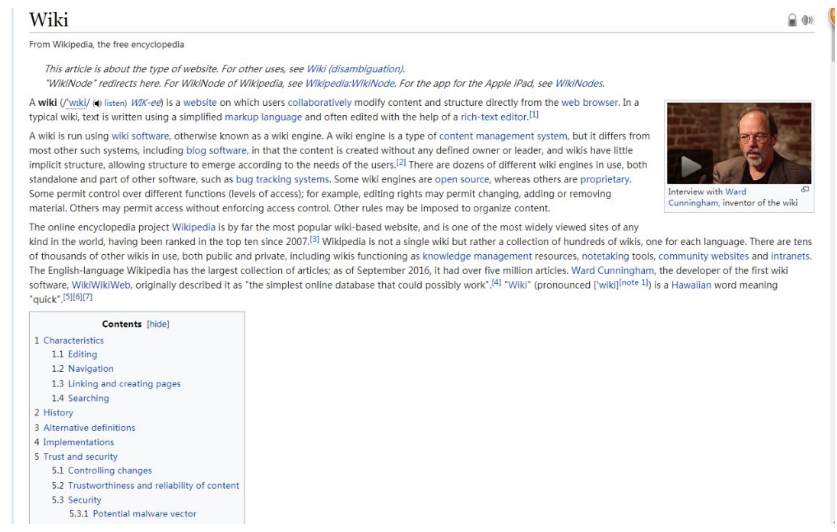

另外对过去的文章进行重新优化，你可以在你的博客后台，选择最新的时间来发布，如下图：

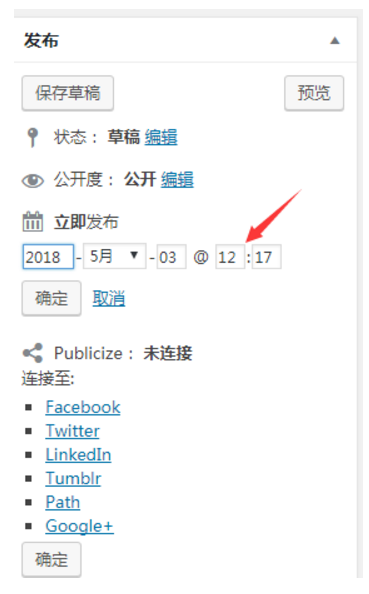

### Google精选答案 

Google精选答案，在外文中被称为 GOOGLE ANSWER BOX / FEATURED SNIPPETS

他的展现形式如下图：

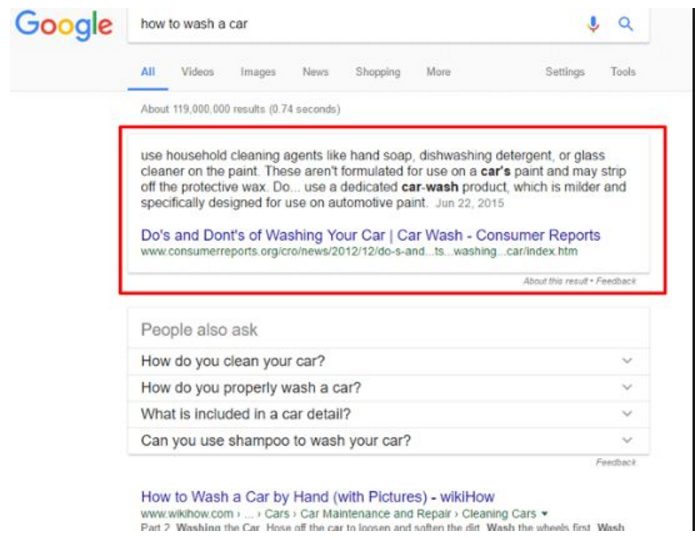

也就是你在做Google搜索的时候，你会越来越发现，Google在使用精选答案。很多人也把这个排名叫做0排名

显然如果你的答案，被Google精选答案，那么点击率将会非常的高。目前在google精选答案中，发现最多的是：

- 段落式，占据63%
- 列表式，占据19%
- 表格类，占据16%

那么要如何做呢？

打开Google Search Console ，并分别点击以下按钮：

Search Analytics > Click on Pages’ Filter > Click a Page > Choose on Queries’ filter，如下图

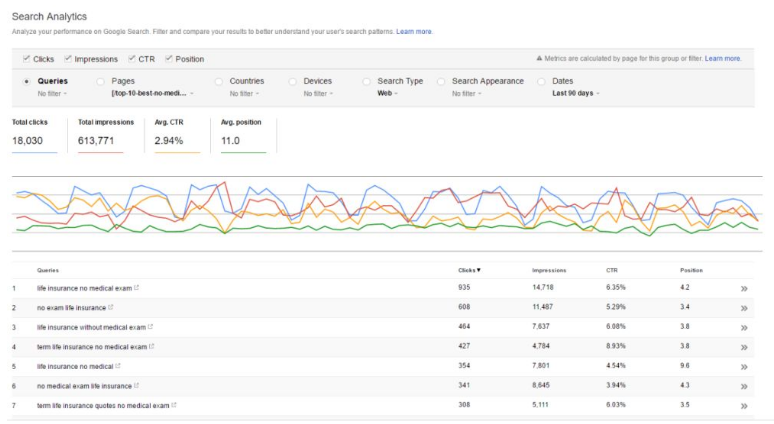

找到这些查询语句之后，那么你可以针对这些查询语句来做，重构内容的关键部分，并匹配每个目标查询显示的答案框结果的类型：

  ◎ 试着为这些查询和答案框类型提供合理且准确的答案

  ◎ 以“what is”来做开头并定义

  ◎ 更多的以list这种形态来展示

  ◎ 从“people also ask”中获取更多内容/关键字想法

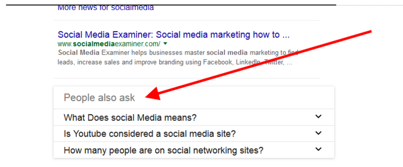

### 数据化结构展示

数据化结构展示，即Schema/structured data markups，他能让你的搜索内容，在google上更具有辨识度

举一个例子，如下图：

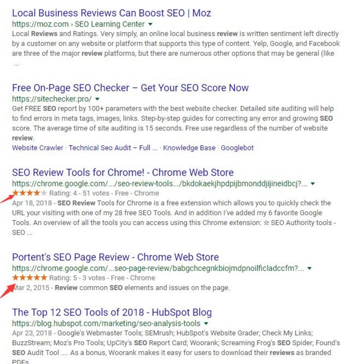

这些带有星号的评论，显然更具直观性，也更具有点击性，能提高用户的点击率

所以如果可以的话，把你在你的网站中加入数据化结构标识，就好了

Google有提供实现结构化数据标记的免费工具，他们分别是：结构化数据标记助手和富媒体代码段测试工具。

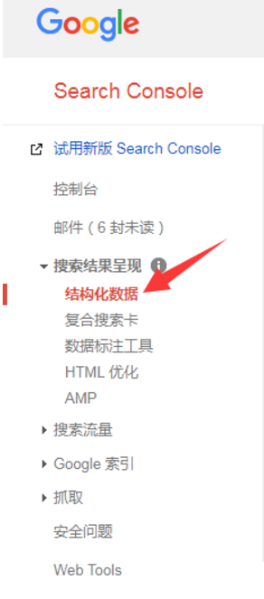

那么你可以借助工具来进行测试

数据化结构可以分为十种，如下图：

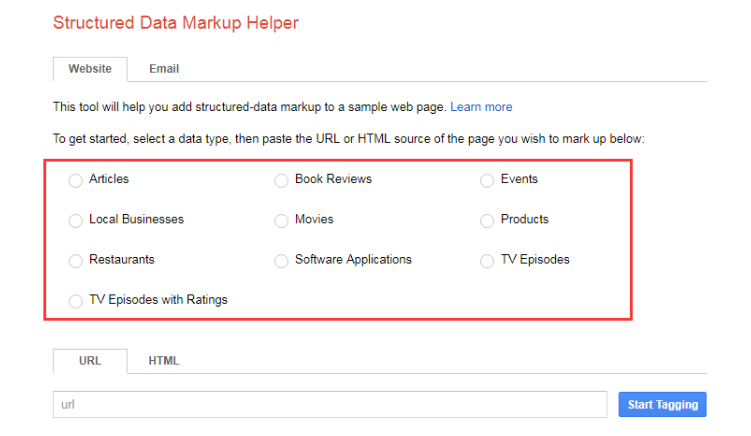

地址：https://www.google.com/webmasters/markup-helper/u/0/

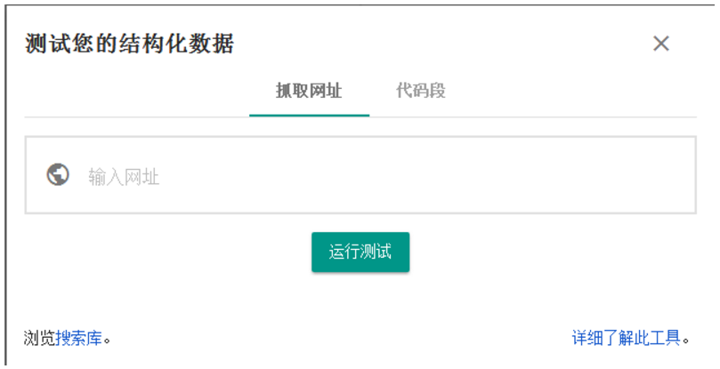

地址：https://search.google.com/structured-data/testing-tool/

那么你可以在线测试，并对你的网站进行标记。

数据化结构是一种非常重要的标识，可以在你的搜索引擎中实现“富” 展示，非常的有用。

对了，如果你使用的是WordPress，有几个插件可以帮助你实现此目标（例如Raven的Schema Creator和All in One Schema.org Rich Snippets）。

### 加入视觉信息 

貌似这个也在我的公众号中多次强调过，就是在一篇文章中，文字的深度性当然很重要，但是如果能加入富有吸引力的媒体信息，那就更好了

这里的视觉信息包括：

- 图片
- 视频
- 信息图
- 列表对比
- H5 （landing page）

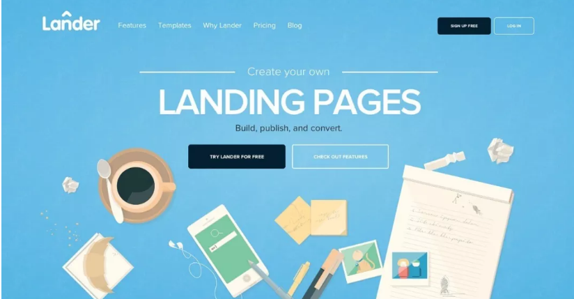

人确实是视觉动物，所以这就是为什么我们说landing page，主图很重要，说白了，还是如何快速的抓住用户的眼球

### 内链 

前面也讲过，页面之前的相关性内容，是可以相互传递的，这样更有利于Google的抓取。

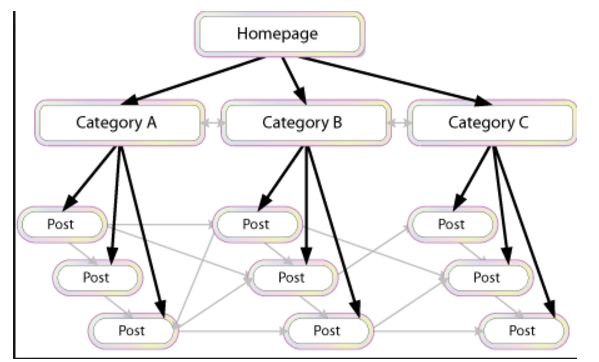

通过内容链接到你网站，使的其他更深人的网页链接到另外一个网页，以此传递更多链接价值并提高你关键内容的排名

### 停留时间和转化 

网站的停留时间，它是衡量用户在你的网站上所花费的时间长度

停留时间越长（或搜索驱动的访客在网站内逗留的时间越长），它越可能影响搜索排名。这意味着搜索者对Google从查询中显示的列表中点击的结果感到满意。

或许，你可以通过以下几种方式来优化你的内容，以获得更好的停留时间

- 使用明确的号召性用语（即CTA）
- 确保号召性用语与你的内容相关
- 不断测试和改进号召性用语
- 想方设法让用户参与
- 鼓励用户分享

## From

- [最全跨境电商内容营销全指导 顾小北的B2C博客](http://www.guxiaobei.com/cross-border-electronic-business-content-marketing.html)