From [所有市场营销人员应该使用的6款免费Google工具 顾小北的B2C博客](http://www.guxiaobei.com/all-marketers-should-to-know-the-6-of-google-tools-for-free.html)

## Google

### Google Adwords – 关键字规划师

比如我输入Content marketing 在搜索框中，如下图所示：

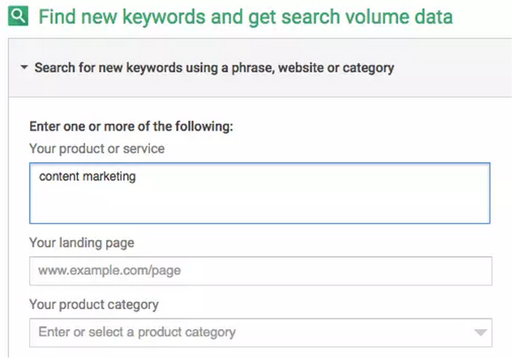

在上面我们可以看到Google除了给我们列出关键字提示，也给我们大致的罗列了每个关键字，每个月的搜索量，以及这个关键字的竞争激烈程度。

### Google Analytics— 谷歌分析工具

Google 分析工具是我每天早上来公司，必须要打开的一个动作，和登陆QQ差不多。

通过google分析的后台你可以了解到，前一天用户的总访问率，哪些页面的访问时间是最长的，哪些帖子用户一打开，就跳出去的。

以及用户是通过什么渠道了解到你的网站，从哪个渠道进来的人最多，以及用户是通过哪些关键字进来的。甚至你可以了解到就在这一分钟的时候，用多少用户现在正在访问你的网站，这些都是可以查询的到的。

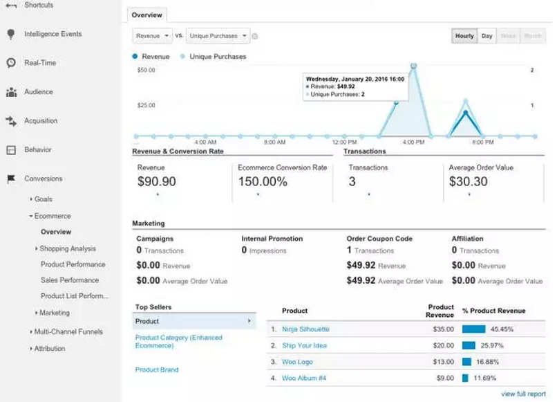

### Google Search Console

一般是用来看 用户的搜索习惯，使用哪些关键字进入我的网站，以及google的索引数量变化，甚至可以看到网上有哪些问题和漏洞，这个Google Search Console都会给信息的提升。

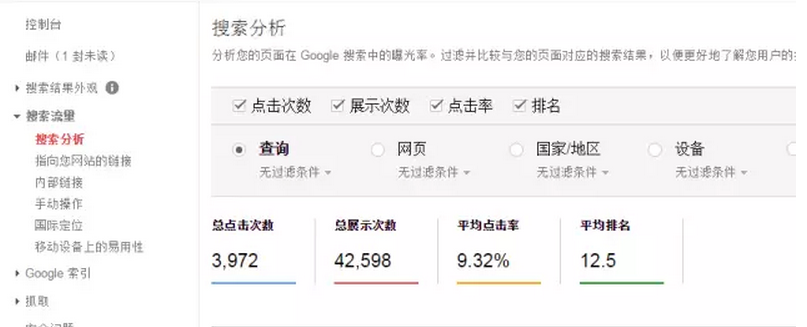

### Google Trends—谷歌趋势

谷歌趋势类似国内的百度指数，主要功能分为两块，一是查看关键词在Google的搜索次数及变化趋势，一个是查看网站流量。

Google趋势他很直观的显示关键词搜索量大小及随时间的变化趋势，你可以看到一个关键字搜索的变化趋势，这点非常重要。

我们这里以headphone为例：我们可以看到在过去的30天中，搜索headphone这个关键字最多的国家依次是：

1 印度
2 澳大利亚
3 加拿大
4 英国
5 美国

如下图所示：

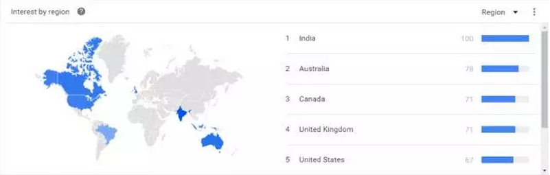

同时google 趋势也给了一个关键字相关的提示，这个也很重要，可以给我们的文章做长尾词来使用，如下图：

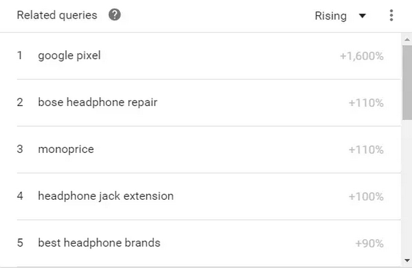

### Google Business

这个功能呢就是当用户在搜索你的网站（品牌名）的时候，自动的把你网站的信息标注到右边类目中，上面会显示你这个公司的几个信息：

1 营业时间
2 用户对你网站的评论（国内的百度口碑）
3 公司具体地址
4 公司电话

以 “百度”为例子，我在google上面搜索百度，就会自动的在google的右侧栏出现百度公司的相关信息，这个给用户是一个什么样的感觉呢？

对，是权威和信任！

权威和信任对于一个独立站来说是非常重要和关键的，因为用户不知道你是不是假的或者诈骗网站，所以在google上面展示公司的详细地址，这个是非常有必要的。

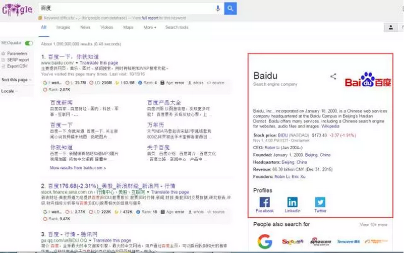

## 网站分析

我们以买加密U盘，网络安全书籍，防黑路由器的店铺 [Top Pentest Devices](https://shop.hak5.org/) 为例。

### 网站价值

From [不打广告，这家Shopify店铺为什么做的这么牛？ 顾小北的B2C博客](http://www.guxiaobei.com/why-is-shopify-doing-so-well.html)

用 [worthofweb](https://www.worthofweb.com/) 来分析一下网站大概的价值：

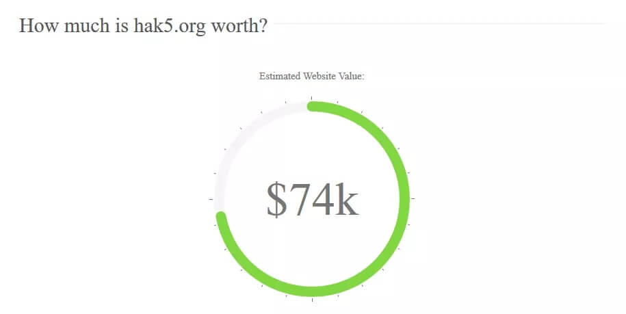

7.4万美元，折算成人民币也就是51万多。这个价值还是很不错的，没做广告，所以成本也就是产品成本，其他全都是利润。

### 分析流量

用 [similarweb](https://similarweb.com) 分析流量。

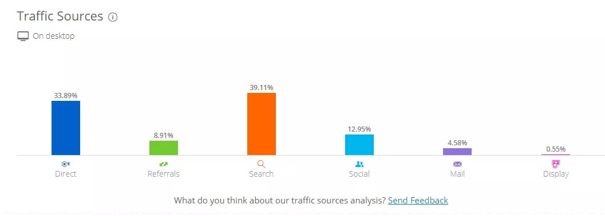

从流量的分布来看，我们可以看出，这家店铺的绝大部分流量都是来自直接访问（收藏）以及搜索引擎带来的流量。来自广告社交的流量不到13%。

所以这个网站应该是主要在做内容营销，SEO。

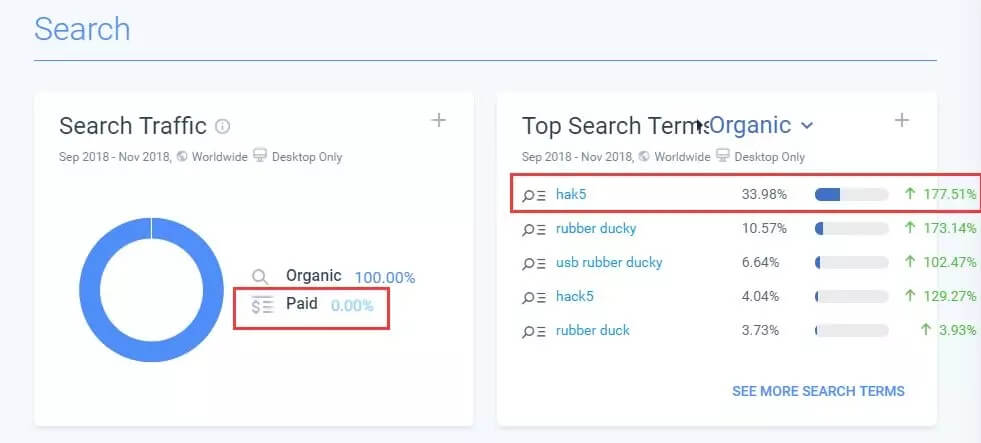

再看这里，付费搜索直接是0，牛！而且搜索关键词绝大部分是他们品牌名字，下面都是他们自己产品名字。

人家是完全没做广告啊。

既然有社交流量，那这些社交流量怎么来的？是红人营销还是giveaway之类的活动？

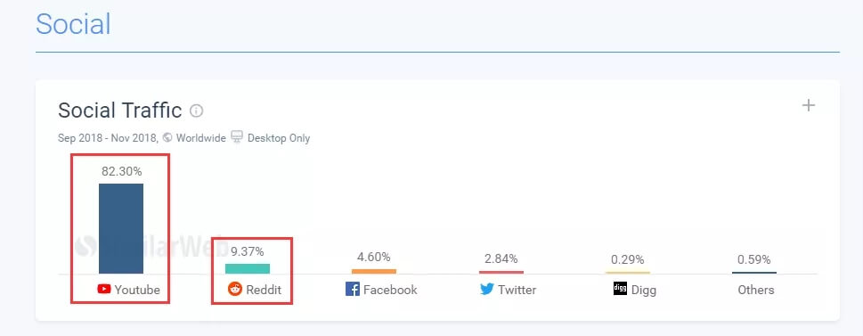

绝大部分社交流量是来自youtube，reddit有一点点，Facebook也有一点点。

### 分析流量来源

他们的YouTube很厉害啊，引流这么多，那我肯定也要来偷窥一下他们的YouTube。

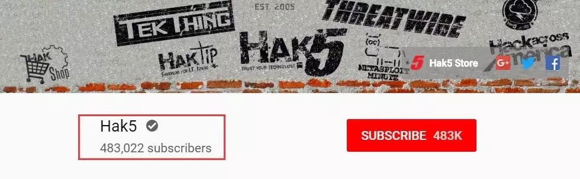

48万订阅，难怪可以引流这么多。

YouTube上的内容这么多，他们做的什么内容可以吸引到这么多订阅？

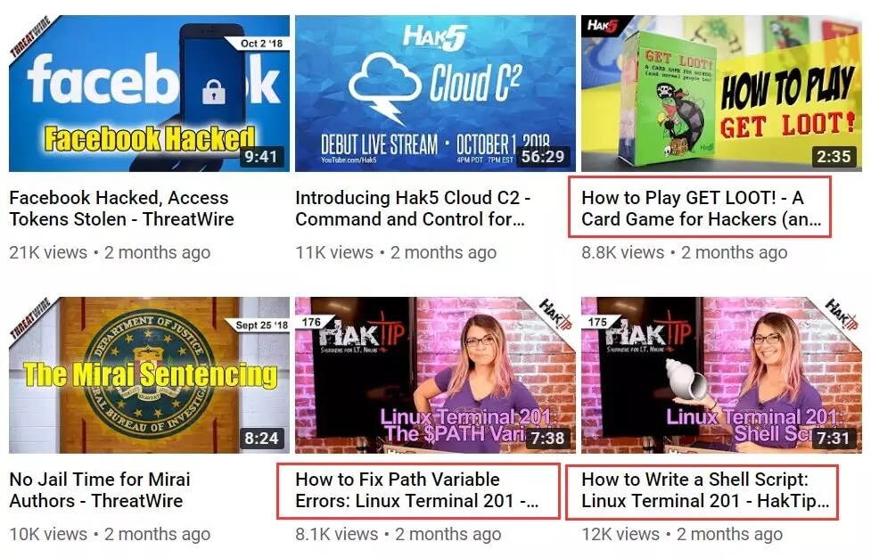

一眼看上去，基本上可以看出来是一些实操性比较强的干货内容。而且总共有一千多个这样的视频，有的视频时长还会达到50多分钟，将近一个小时。确实是很用心在做内容，而且是一直在持续输出。

诶，又出现了，内容！

虽然他们做的内容标题看起来比较实用，时长也比较长，订阅也比较多，但是不代表他们就一定很权威啊。

用 [moz](https://moz.com/link-explorer) 来分析一下

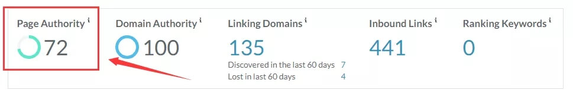

72，这个数字是页面权重，代表这个页面很受信任，会给这个网站带来很多的流量。这数值真的很高了！

前面我也说了，这个店铺没有做什么广告，甚至是社交宣传，所以基本是在靠内容和SEO打天下。

### 关键词分析

我们现在来看一下他们的SEO做得怎么样

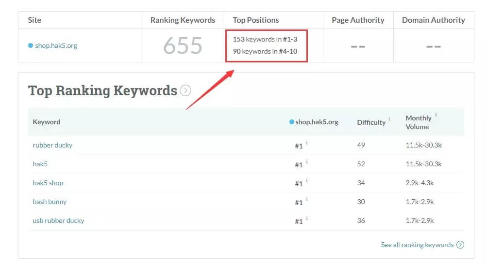

他们总共是有655个关键词在做排名，而且有153个关键词都是排前三的，这个很厉害啊，加上后面90个排4-10名的，基本上占据Google搜索结果页面第一页的就有243个关键词。

所以他们的自然流量那么高，不是没理由的。

### 外链分析

SEO，基本上除了内容营销，就是外链建设。

所以我们来看一下他们的外链情况，这里我用 **Moz工具**，如下图

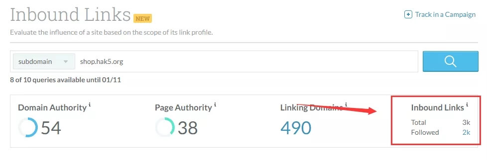

总共是3k个外链，也是比较可观了。所以这么多的外链，带来的流量自然也比较多。

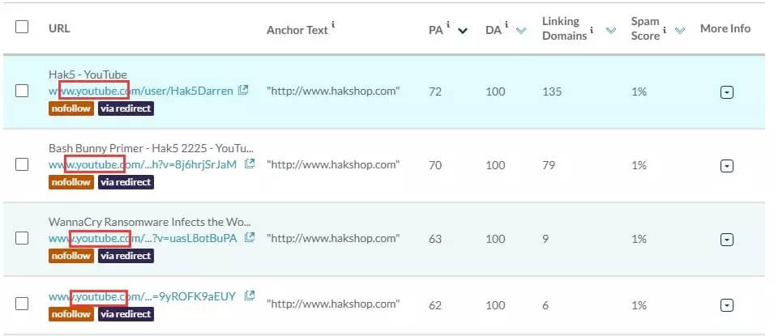

而且这些外链比较多的都是来自YouTube，所以有个自己的干货输出的地方是很有好处的。

分析完他们的流量以及营销策略之后，再回到他们的店铺本身来看一下。

### 网站结构

网站的布局主要包括以下6个板块组成：

- **整体配色**。整个网站的配色只有三种：黑白红。这种配色看起来很高级，不至于沉闷，也绝对不会花哨。因为毕竟是做高科技产品，不是做美妆或服装的。

	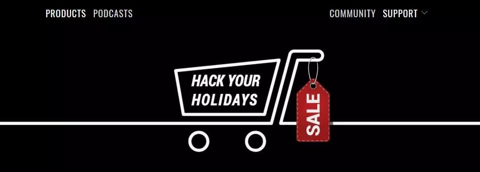

  

- **折扣广告**。包括产品，新闻社区，以及技术支持这四个区域，然后是一个节日折扣的标示。

- **店铺活动**。这个是他们店铺现在在做的一些活动，还是黑白红，连图片都没有别的颜色。

	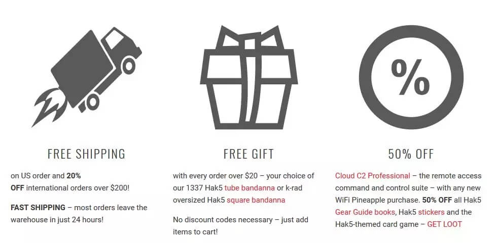

- 热销产品。

  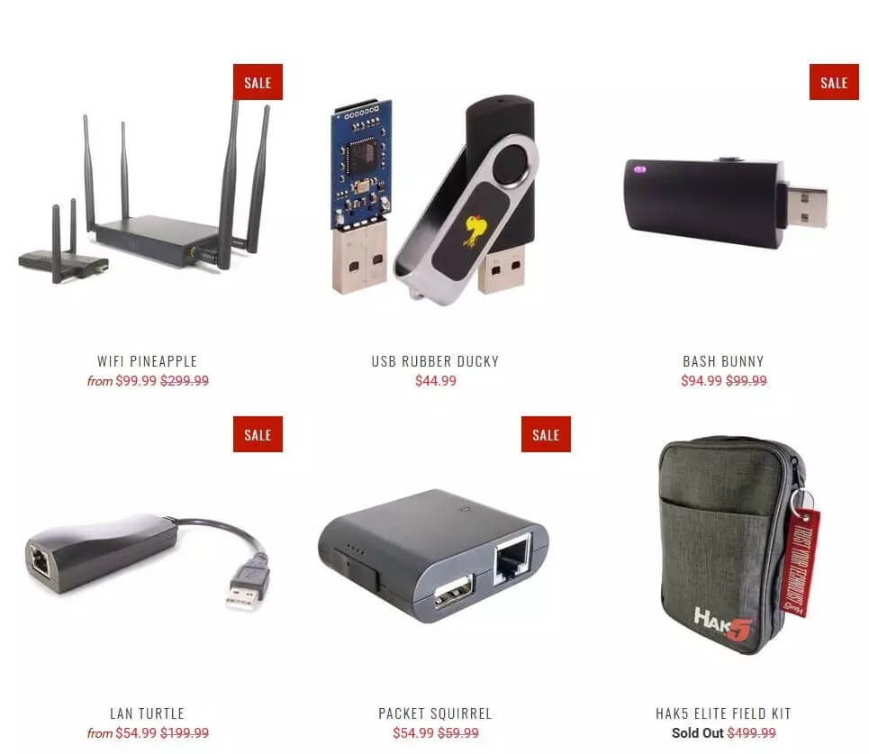

- 节日促销

  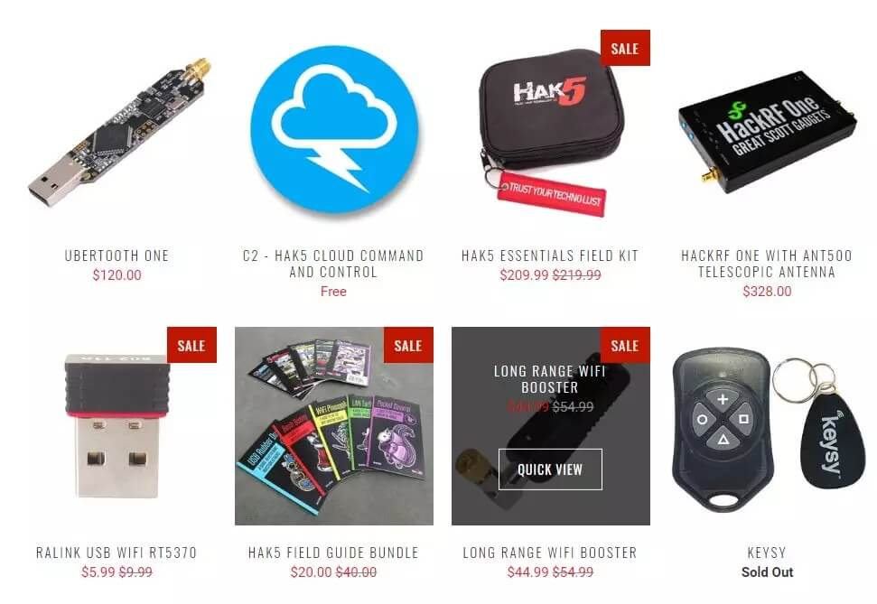

- 产品类别

  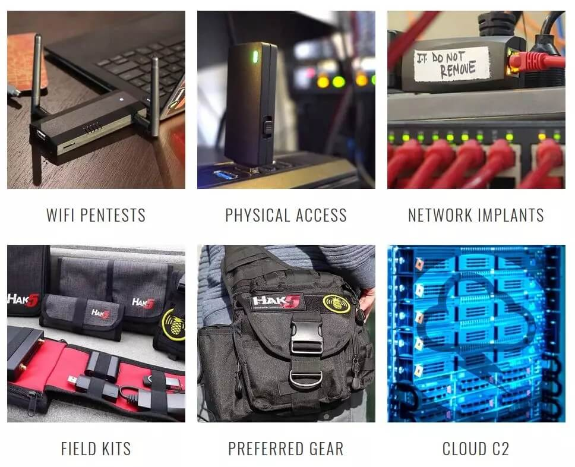

看到没有，这个网站的布局非常简单，清晰，没有很多花里胡哨的板块。

### 产品页面

一张图片，一段详细描述，一个call to action按钮，一列社交分享按钮，没了。

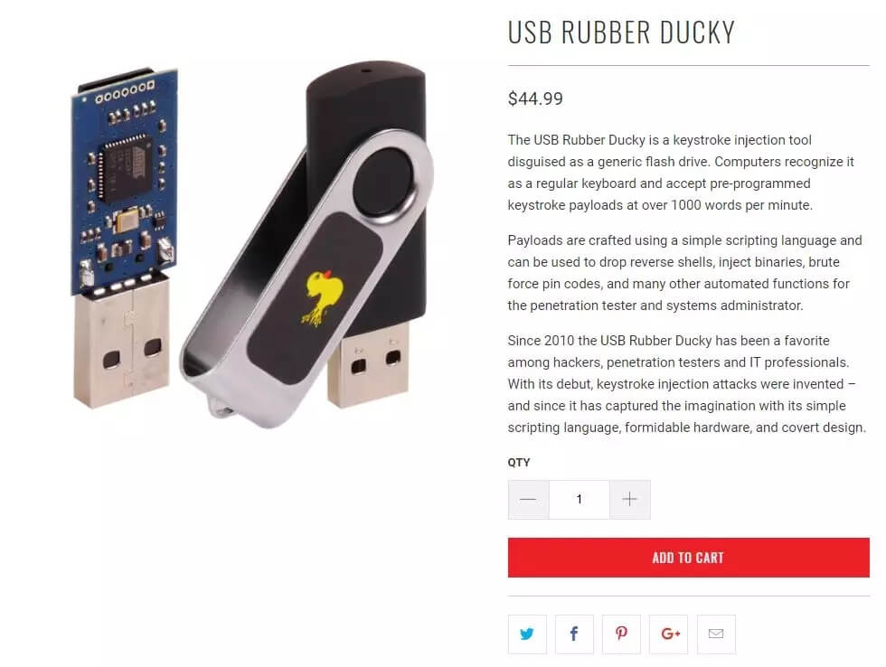

好了，行了，网站看了这么多，然后呢？欣赏一下就行了？不是的，接下来，我们来看一下他们建网站用了哪些辅助工具。

### 网站技术分析

我们用 [Commerce Inspector](https://chrome.google.com/webstore/detail/commerce-inspector/kefmekfmfacbdefimlancoccpocmgmpb) 这个工具来查看这个网站（只能查看shopify类型的网站）的主题是什么，插件用什么安装，流量如何。

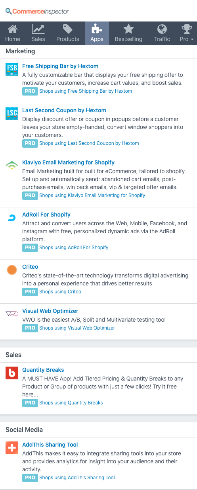
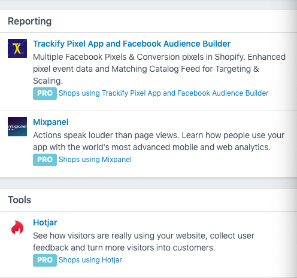

这些就是他们现在在用的工具，有个这个工具呢，竞争对手在用什么模板，插件，流量，订单预估，都是可以挖掘出来的，非常非常的实用。

- [Free shipping bar by hextom](https://apps.shopify.com/free-shipping-bar)。这个app可以在客户离开我们的网站之前，自动弹出一个折扣券，减少客户弃购，以及还可以跟我们之前说的一些工具一样可以高级定位客户，而且也还有节假日或是什么重大事件的专门主题。

  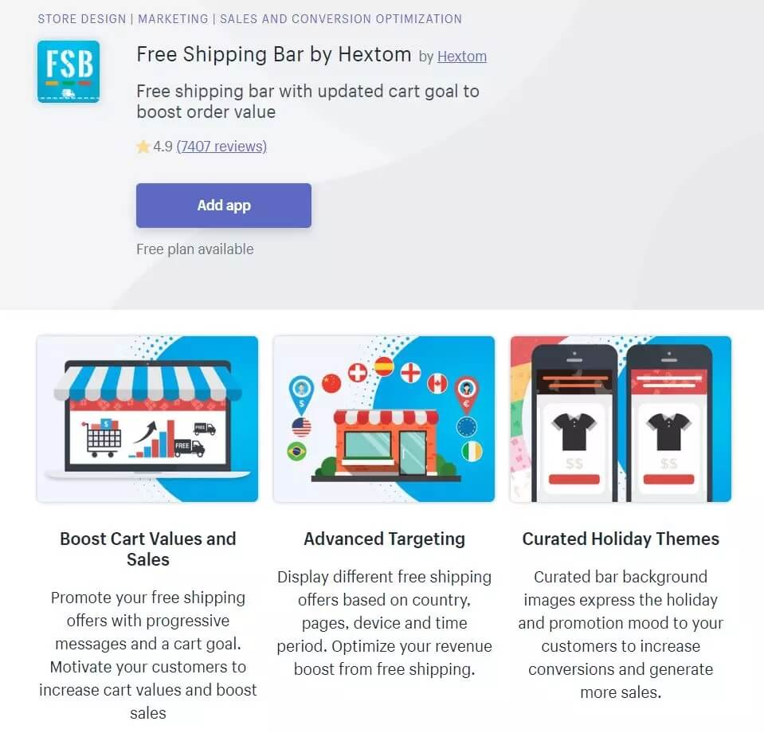

- [Klaviya email marketing for shopify](https://apps.shopify.com/klaviyo-email-marketing)。这个app是可以首先收集注册了我们网站客户的邮箱地址，帮助我们继续追踪之前加入了购物车，或是进入了结算页面，但是最后还是放弃购买的客户。直接通过邮件联系他们。

	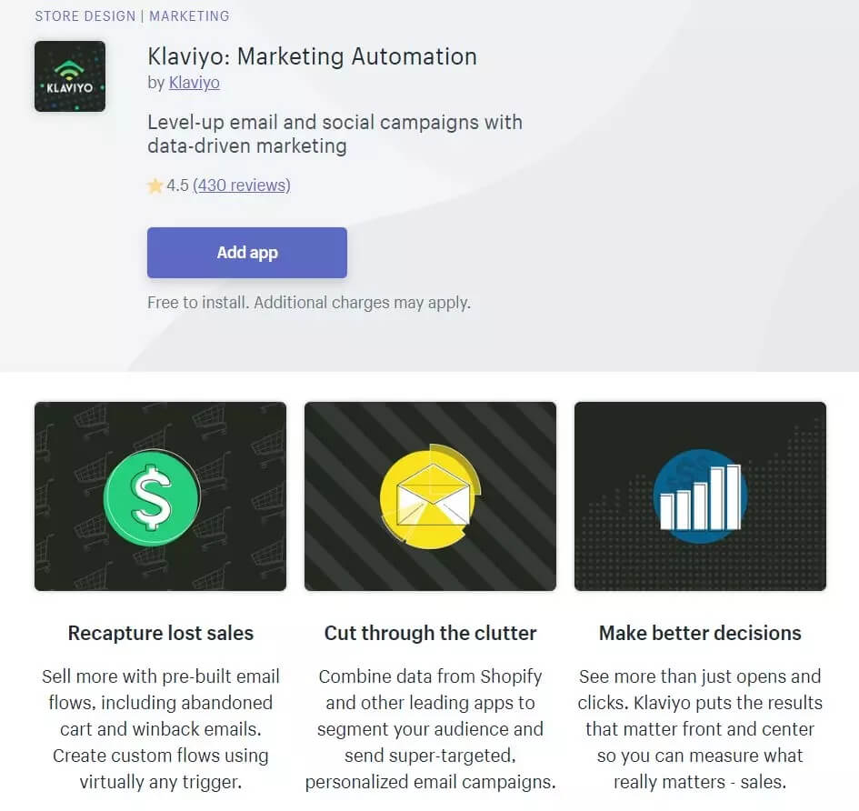

- [Visual web optimizer](https://vwo.com/)。这个工具是可以帮助我们调研受众，以及优化，测试等。还是很厉害的。从追踪受众，分析受众，制定策略，测试策略，定位受众一系列的功能，都是为了增加用户的转化率。

	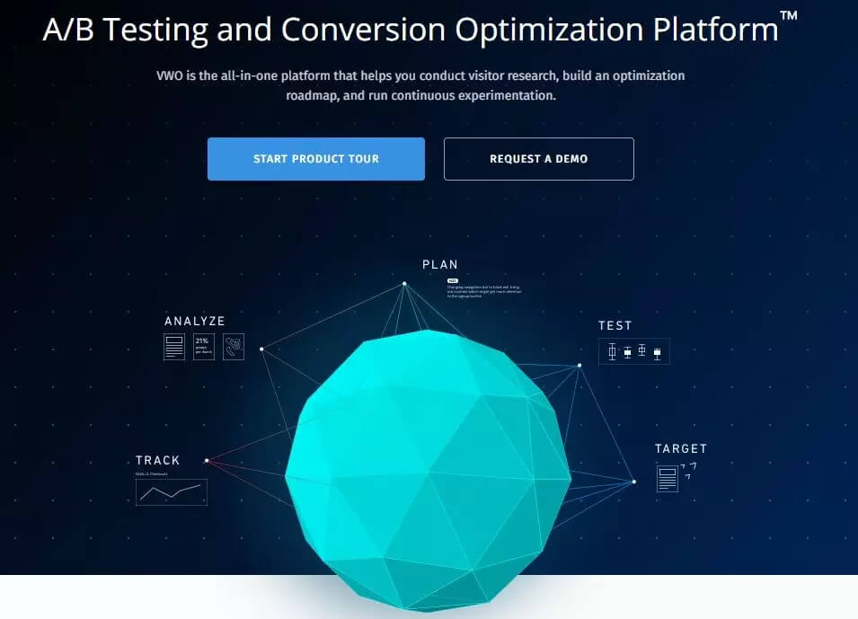

## 工具

### Form

[Paperform: Online Form Builder And Form Creator](https://paperform.co/)