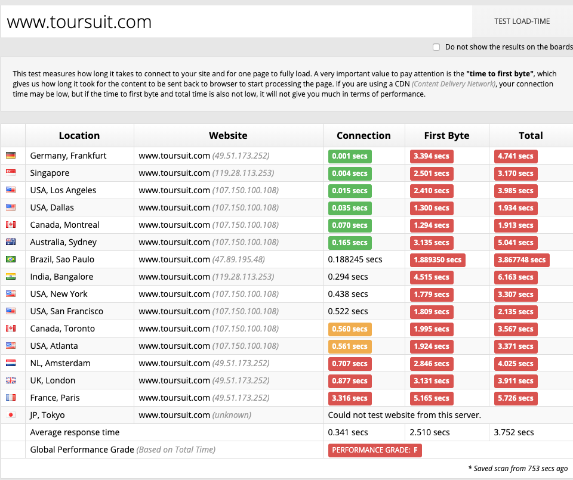
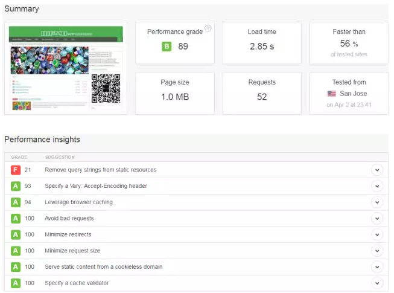
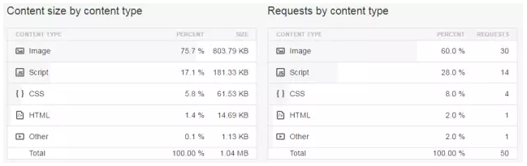
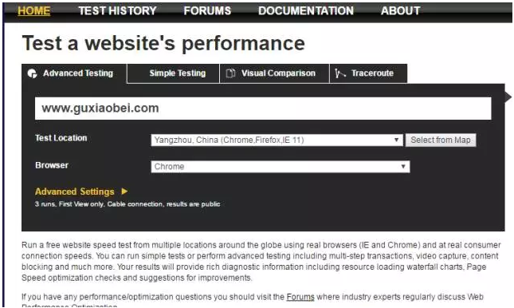
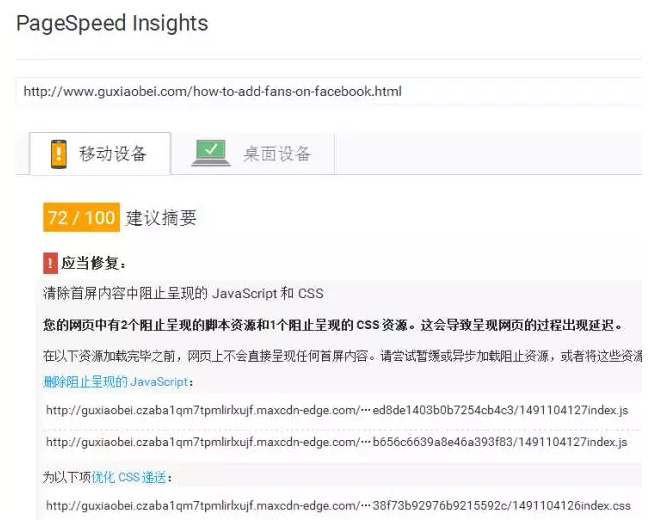
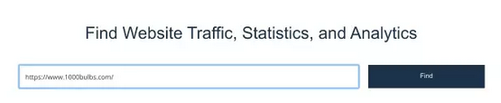
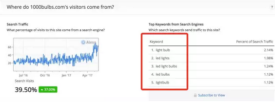
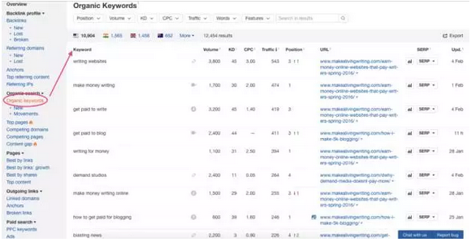
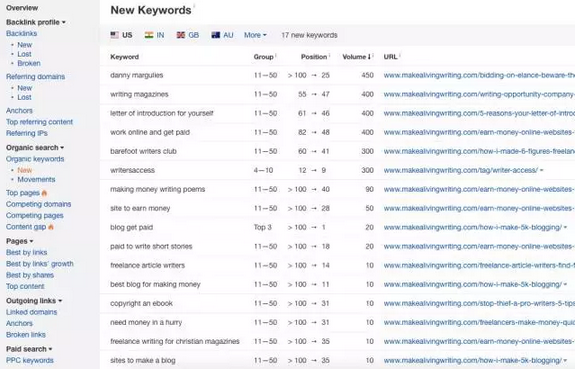

From [5款快速测试网站速度的有效工具 顾小北的B2C博客](http://www.guxiaobei.com/tools-for-testing-website-speed.html)

## CDN

[如何配置MaxCDN的使用教程](http://www.guxiaobei.com/how-to-use-maxcdn.html)。

## 提高网站速度

- [7种让你网站加速的有效秘诀！ 顾小北的B2C博客](http://www.guxiaobei.com/7-ways-of-speed-up-website.html)
- [6种最好的图片无损压缩工具 顾小北的B2C博客](http://www.guxiaobei.com/lossless-compression-on-image-tools.html)

## 网站速度测试工具

一个网站，打开速度应该在2~3秒以下是比较理想的，同时大家在优化好web端的打开速度时，也要注重对于移动端的优化。 这个我们今后会在具体讲到！

### Sucuri Load Time Tester

**工具地址：**https://performance.sucuri.net/

其中First Byte 这个意思指，内容传输到浏览器并开始处理页面需要的时间长度。

### Gtmetrix

**工具地址：**https://gtmetrix.com/

 YSlow是一款检测你页面加载速度的工具。

### Pingdom

**工具地址：**https://tools.pingdom.com/

这个工具同样会告诉你网站的加载时间，以及网站的各个要素的表现情况，如下图所示：

各个要素对网站的占用时间，Pingdom都做出了一个比较细致的分析，如下图：

### WebpageTest

**工具地址：**[http://www.webpagetest.org/](http://www.webpagetest.org/)

这款工具很有意思，他不仅可以测试各个国家访问你网站的加载时间，还可以测试用不同的浏览器，不同的移动端的设备（IOS,Android）所花费的时间。

### PageSpeed Insights 

**工具地址：**https://developers.google.com/speed/pagespeed/

哈哈，把Google的产品放在最后一个，其实没有什么别的意思~~

PageSpeed Insights这个工具也是我常用的，它可以建议你应该优化页面的哪些指标，如图所示：

## 网站排名

### Alexa工具 

**地址：**http://www.alexa.com

**Alexa是一个比较老的工具，上面的功能有很多，绝大多数是需要付费。**

**但是这个工具可以很容易的查出网站的浏览，全球排名，以及主要的关键字分析，如下图：**

**地址：**http://www.alexa.com/siteinfo/

你可以从上面的关键字中很容易找到竞争对手的关键字，如果你要挖掘更多的，你可以选择付费查看更多。

特别要说明的是，alexa很多数据只可以当作大致的参考，具体的流量还需要具体结合其他工具来判断。

## 外链分析

### 利用Ahrefs.com 

**地址：**[http://www.ahrefs.com/](http://www.ahrefs.com/)

Ahrefs的主要功能是查找外链，关键字的挖掘，以及监测竞争对手的行为。这个工具有免费试用，你可以查看竞争对手主要用的是什么样的关键字，哪些又是主要关键字。

你可以输入竞争对手的网址，以便查看他们的所使用的关键字

另外你可以在original search中的new来查看竞争对手主要使用了哪些关键字，如下图所示：

这个功能非常的强大！而且你也可直观的查看这些关键字在Google上的排名。