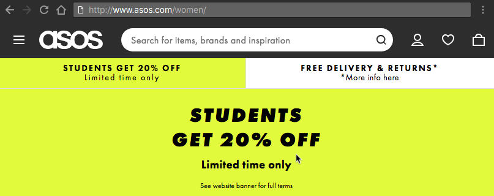
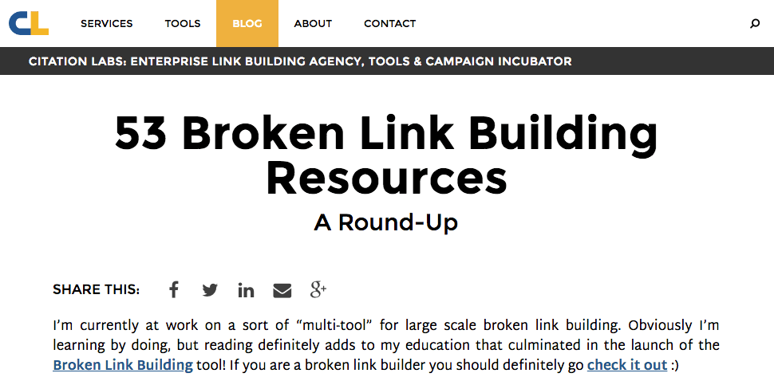

## Operators

### 使用引号 ""

当你搜索特定内容时，尝试使用`引号`来降低谷歌搜索的猜测。当你将搜索内容放在引号中时，这会告诉搜索引擎去搜索整个短语。

比如，如果你想搜索 Puppy Dog Sweaters，引擎将按照包含这三个词任意顺序去搜索内容。

但是，如果你搜索 **"**Puppy Dog Sweaters**"**，引擎将完全按照你输入的（顺序）那样搜索该短语。这可以帮助你查找可能隐藏在其他内容下的特定信息，如果（信息）没能正常排序。

### 使用连字符排除单词 -

有时，你会发觉自己正在搜索含义模糊的单词。比如，野马(Mustang)。当你使用谷歌搜索`Mustang`时，你可能得到福特公司生产的汽车和马匹这两种结果。如果你想排除某一个，使用**连字符**告诉搜索引擎忽略它。可以看下面的列子。

>  Mustang -car

这就告诉搜索引擎去搜索野马，但是要排除任何包含`"car"`字样的结果。在查找有关内容的时，它很有用，因为无需获取包含某些内容的信息。

### 使用冒号搜索特定网站 site:

你可能碰到这种情况：你需要在特定的站点去谷歌搜索相关的内容或文章。（实现）这种情况的语法非常简单，请看下面。

> Sidney Crosby site:nhl.com

这是搜索关于著名的曲棍球运动员`Sidney Crosby`的内容，但是仅限于[NHL.com](https://link.juejin.im?target=https%3A%2F%2Fwww.nhl.com%2F)网站，所有其他的结果将被移除。如果你需要在特定的网站上查找特定的内容，则可以使用此快捷方式。

### 找到链接到其他页面的页面 link:

这个谷歌搜索技巧有点晦涩难懂。你正在搜索链接到特定页面的页面，而不是搜索特定页面。

换种思考方式来理解（这个技巧）。如果你想知道谁在他们的网站上引用了**纽约时报**的文章，你可是使用这个技巧找到链接到它的所有网站。它的语法如下：

> link:nytimes.com -site:nytimes.com

这将返回链接到**纽约时报**官方网站的所有页面。（语法中）URL上的右侧几乎可以是任何内容。

但请注意，URL越具体，你获得的结果越少。我们知道很多人都不会使用这个谷歌搜索技巧，但是对某些人来说可能很有用。

### 使用星号通配符 *

**星号通配符**是列出的技巧中很有用的技巧之一。下面是它的原理。

当你在谷歌搜索的搜索字词中使用星号时，会留下一个占位符，之后可能被搜索引擎自动填充。如果你忘了完整的歌词，这个一个找到歌词的很明智方式。我们看下语法：

> “Come * right now * me”

对你我而言，这可能看起来就像胡说八道。但是，谷歌搜索将搜索该短语，因为它知道星号表示任意单词【任意指0或多个】。

通常，你会发现它们是披头士（The Beatles）“Come Together”歌曲的歌词，这就是搜索会告诉你的内容。

### 查找和其他站点类似的网站 related:

这是一个很独特的技巧，如果大家知道它的存在，那么大部分人都会使用它。

假如你有一个很喜欢的网站。它可以是（关于）任何内容。但是，该网站（让人觉得）有点无聊，你想找其他类似的网站。你会使用到这个技巧。下面是语法：

> related:amazon.com 

如果搜索上面的内容，你无法找到指向亚马逊的链接。相反的，你会找到类似亚马逊的在线商城链接。比如`Barnes & Noble, Best Buy`等网站以及其他在线销售实体商品的网站。它是一个功能很强大的谷歌搜索技巧，可以帮助你找到想要浏览的新网站。

### 使用谷歌搜索做数学运算

是的，谷歌搜索可以为你做数学运算。这是个难以描述的相当复杂（的技巧），因为它可以在很多方面使用。你可以问谷歌搜索基本的（数学）问题或者一些更难的问题。

需要注意的是，谷歌搜索不会解决所有的数学问题，但它会解决很多。以下是一些语法示例：

> 8 * 5 + 5

> Planck’s Consant

如果你是搜索第一个，搜索引擎会返回45。当然，它还会展示一个计算器，方便你查找其他的（计算）问题。

如果你需要做一些快速的数学运算，但是又不想在头脑中去做这件事，这种方法就很方便。如果你搜索第二项，它将会返回[普朗克常数](https://link.juejin.im?target=https%3A%2F%2Fzh.wikipedia.org%2Fzh-hans%2F%E6%99%AE%E6%9C%97%E5%85%8B%E5%B8%B8%E6%95%B0)的数值。

所以它可以做数学运算，也可以通过展示已知的数学术语的值来帮助你解决数学问题。

### 一次性搜索多个单词 OR

谷歌搜索是很灵活的。它知道你可能无法仅仅通过搜索单个单词或短语就找到你想要的内容。因此，它允许你多个搜索。

通过使用这个技巧，你可以搜索一个单词或短语以及第二个单词或短语。这有助于缩小搜索范围，以帮助你找到所需内容。下面是它的语法：

> “Best ways to prepare for a job interview” OR “How to prepare for a job interview”

通过搜索上面（内容），你将搜索两个短语。你还记得上面提到的**引号**嘛？它也在这里使用。在这个例子中，这两个确切的短语将被搜索。也可以通过单词搜索，比如下面的例子：

> chocolate OR white chocolate

将会搜索包含巧克力或者白巧克力的页面！

### 搜索一系列数字

搜索一个范围的数字又是一个技巧，估计很多人不会使用。但是，使用它的人可能使用了一段时间了。

对金钱或者统计数据感兴趣的人会发现这个提示特别有用。基本上，你使用两个点和一个数字就可以让谷歌搜索知道你正在寻找特定范围的数字。语法如下：

- What teams have won the Stanley Cup ..2004
- 41..43

在第一个例子中，搜索引擎将会返回`2004年赢得Stanley杯的球队`（的信息）。两个点后跟一个数字将告诉搜索引擎，你不是查找2004年之前或之后的内容。这可以帮你缩小范围到一个特定的数字，以提高搜索的结果。

在第二个例子中，谷歌将搜索数字41、42和43。这是模糊的，但是如果你需要搜索像这种情况的数字，那会很有用。

### 查找特定文件 filetype:

谷歌搜索中经常被遗忘的功能是搜索特定文件或文件类型的能力。如果你需要先前查看过或需要用于其他项目的特定PDF或PowerPoint文件，这将是莫大的帮助。语法相当简单：

> Search term here filetype:pdf

在上面的示例中，你只需要将搜索词组【Search term】替换成你想要的搜索内容。然后使用filetype的命令，（filetype）后加你想要的任何文件类型的扩展名。

这对于学术目的来说非常有用，但是商演和其他各种演示也能从中受益的。

### 货币和单位转换

谷歌搜索可以快速且准确地转换度量单位和货币单位。这有很多用途，比如检查两种货币之间的转换率。

如果你恰好是数学系学生，你可用它将英尺转换为米或从盎司转换为升。下面演示如何做到：

- miles to km - 这会将英里转换为公里。你可以将数字放在（mile）前面以转换成特定的数字。比如 “10 miles to km” 将显示10英里转换成多少公里。
- USD to British Pound Sterling - 这将把美元兑换成英镑。与上面的度量单位一样，你可以（在USD前面）添加数字以查找特定金额确切转换。

这个技巧确实适合数学系学生和国际商务人士。但是，你会惊讶的发现，这个技巧也被普通大众使用。

### 跟踪你的包裹

我们（要讲）的最后一个技巧就是使用谷歌搜索来找出你包裹的位置。你可以直接在谷歌搜索栏中输入任何的`UPS`,`UPSPS`或`Fedex`跟踪号码，它会显示有关你包裹的跟踪信息。

这比去特定的网站（查找）更方便，你不用等待网站加载完，然后在那里搜索你的包裹。

这就不需要一个实例说明了。尝试输入你的（包裹）跟踪号码，然后查找你包裹的位置。

### ( )

Group multiple terms or search operators to control how the search is executed.

> (ipad OR iphone) apple

### $

Search for prices. Also works for Euro (€), but not GBP (£) 🙁

> ipad $329

### define:

A dictionary built into Google, basically. This will display the meaning of a word in a card‐like result in the SERPs.

> define:entrepreneur

### cache:

Returns the most recent cached version of a web page (providing the page is indexed, of course).

> cache:apple.com

### intitle:

Find pages with a certain word (or words) in the title. In our example, any results containing the word “apple” in the title tag will be returned.

> intitle:apple

### allintitle:

Similar to “intitle,” but only results containing *all* of the specified words in the title tag will be returned.

> allintitle:apple iphone

### inurl:

Find pages with a certain word (or words) in the URL. For this example, any results containing the word “apple” in the URL will be returned.

> inurl:apple

### allinurl:

Similar to “inurl,” but only results containing *all* of the specified words in the URL will be returned.

> allinurl:apple iphone

### AROUND(X)

Proximity search. Find pages containing two words or phrases within X words of each other. For this example, the words “apple” and “iphone” must be present in the content and no further than four words apart.

**Example:** **apple AROUND(4) iphone**

### weather:

Find the weather for a specific location. This is displayed in a weather snippet, but it also returns results from other “weather” websites.

**Example:** **weather:san francisco**

### stocks:

See stock information (i.e., price, etc.) for a specific ticker.

**Example:** **stocks:aapl**

### map:

Force Google to show map results for a locational search.

**Example:** **map:silicon valley**

### movie:

Find information about a specific movie. Also finds movie showtimes if the movie is currently showing near you.

**Example:** **movie:steve jobs**

### in

Convert one unit to another. Works with currencies, weights, temperatures, etc.

**Example:** **$329 in GBP**

### source:

Find news results from a certain source in Google News.

**Example:** **apple source:the_verge**

### _

Not exactly a search operator, but acts as a wildcard for Google Autocomplete.

**Example: apple CEO _ jobs**

### # ..#

Search for a range of numbers. In the example below, searches related to “WWDCvideos” are returned for the years 2010–2014, but not for 2015 and beyond.

**Example:** **wwdc video 2010 ..2014**

### inanchor:

Find pages that are being linked to with specific anchor text. For this example, any results with inbound links containing either “apple” or “iphone” in the anchor text will be returned.

**Example:** **inanchor:apple iphone**

### allinanchor:

Similar to “inanchor,” but only results containing *all* of the specified words in the inbound anchor text will be returned.

**Example:** **allinanchor:apple iphone**

### inposttitle:

Find blog posts with specific words in the title. No longer works, as this operator was unique to the discontinued Google blog search.

**Example: intitle:apple iphone**

### #

Searches #hashtags. Introduced for Google+; now deprecated.

**Example:** **#apple**

## Actionable Ways to Use Operators

BORED OF READING?

Check out 9 actionable Google search operator tips in Sam Oh’s [video](https://www.youtube.com/watch?v=yWLD9139Ipc).

<iframe width="560" height="315" src="https://www.youtube.com/embed/yWLD9139Ipc" frameborder="0" allow="accelerometer; autoplay; encrypted-media; gyroscope; picture-in-picture" allowfullscreen></iframe>

### Find indexation errors

Google indexation errors exist for most sites.

It could be that a page that should be indexed, isn’t. Or vice‐versa.

Let’s use the `site:` operator to see how many pages Google has indexed for *ahrefs.com*.


~1,040.

> SIDENOTE. Google only gives a rough approximation when using this operator. For the full picture, chec Google Search Console.

But how many of these pages are blog posts?

Let’s find out.


~249. That’s roughly ¼.

I know Ahrefs blog inside out, so I know this is higher than the number of posts we have.

Let’s investigate further.


OK, so it seems that a few odd pages are being indexed.

*(This page isn’t even live—it’s a 404)*

Such pages should be removed from the SERPs by [noindexing them](https://support.google.com/webmasters/answer/93710?hl=en).

Let’s also narrow the search to subdomains and see what we find.


> SIDENOTE. Here, we’re using the wildcard (*) operator to find all subdomains belonging to the domain, combined with the exclusion operator (-) to exclude regular www results. 
>
> ~731 results.

Here’s a page residing on a subdomain that *definitely* shouldn’t be indexed. It gives a 404 error for a start.


Here are a few other ways to uncover indexation errors with Google operators:

- `site:yourblog.com/category` — find WordPress blog category pages;
- `site:yourblog.com inurl:tag` — find WordPress “tag” pages.

### Find non‐secure pages (non‐https)

HTTPs is a *must* these days, especially for [ecommerce sites](https://ahrefs.com/blog/ecommerce-seo/).

But did you know that you can find unsecure pages with the `site:` operator?

Let’s try it for *asos.com*.


Oh my, ~2.47M unsecure pages.

It looks like ASAS don’t currently use SSL—unbelievable for such a large site.


> SIDENOTE. Don’t worry, Asos customers—their checkout pages are secure 🙂

But here’s another crazy thing:

ASOS is accessible at both the *https* and *http* versions.



And we learned all that from a simple `site:` search!

> SIDENOTE. I’ve noticed that sometimes, when using this tactic, pages will be indexed without the https. But when you click‐through, you will be directed to the https version. So don’t assume that your pages are unsecure just because they appear as such in Google’s index. Always click a few of them to double‐check.

FURTHER READING

- [We Analyzed the HTTPS Settings of 10,000 Domains and How It Affects Their SEO — Here’s What We Learned](https://ahrefs.com/blog/ssl/)
- [HTTP vs. HTTPS for SEO: What You Need to Know to Stay in Google’s Good Graces](https://ahrefs.com/blog/http-vs-https-for-seo/)

### 3. Find duplicate content issues

Duplicate content = bad.

Here’s [a pair of Abercrombie and Fitch jeans from ASOS](http://www.asos.com/abercrombie-fitch/abercrombie-fitch-slim-fit-jeans-in-destroyed-black-wash/prd/8459420?clr=black&SearchQuery=&cid=4208&gridcolumn=1&gridrow=1&gridsize=4&pge=1&pgesize=72&totalstyles=1) with this brand description:


With third‐party brand descriptions like this, they’re often duplicated on other sites.

But first, I’m wondering how many times this copy appears on *asos.com*.


~4.2K.

Now I’m wondering if this copy is even unique to ASOS.

Let’s check.


No, it isn’t.

That’s 15 other sites with this exact same copy—i.e., duplicate content.

Sometimes duplicate content issues can arise from similar product pages, too.

For example, similar or identical products with different quantity counts.

Here’s an example from ASOS:


You can see that—quantities aside—all of these product pages are the same.

But duplicate content isn’t only a problem for ecommerce sites.

If you have a blog, then people could be stealing and republishing your content without attribution.

Let’s see if anyone has stolen and republished [our list of SEO tips](https://ahrefs.com/blog/seo-tips/).


~17 results.

SIDENOTE.

 

You’ll notice that I excluded

 

ahrefs.com

 from the results using the exclusion (-) operator—this ensures that the original doesn’t appear in the search results. I also excluded the word “pinterest.” This was because I saw a lot of Pinterest results for this search, which aren’t really relevant to what we’re looking for. I could have excluded just pinterest.com (-pinterest.com), but as Pinterest has many ccTLDs, this didn’t really help things. Excluding the word “pinterest” was the best way to clean up the results.

Most of these are *probably* syndicated content.

Still, it’s worth checking these out to make sure that they do link back to you.

**FIND STOLEN CONTENT IN SECONDS**

*Content Explorer > In title > enter the title of your page/post > exclude your own site*


You will then see any pages (from our database of 900M+ pieces of content) with the same title as your page/post.

In this instance, there are 5 results.


Next, enter your domain under “Highlight unlinked domains.”

This will highlight any sites that don’t link back to you.


You can then reach out to those sites and request the addition of a source link.

FYI, this filter actually looks for links on a domain‐level rather than a page‐level. It is, therefore, possible that the site could be linking to you from another page, rather than the page in question.

### Find odd files on your domain (that you may have forgotten about)

Keeping track of everything on your website can be difficult.

*(This is especially true for big sites.)*

For this reason, it’s easy to forget about old files you may have uploaded.

PDF files; Word documents; Powerpoint presentations; text files; etc.

Let’s use the `filetype:` operator to check for these on *ahrefs.com*.


SIDENOTE.

 

Remember, you can also use the

 

```
ext:
```

 operator—it does the same thing.

Here’s one of those files:


I’ve never seen that piece of content before. Have you?

But we can extend this further than just PDF files.

By combining a few operators, it’s possible to return results for all supported file types at once.


> SIDENOTE. The filetype operator does also support things like .asp, .php, .html, etc.

It’s important to delete or noindex these if you’d prefer people didn’t come across them.

### Find guest post opportunities

Guest post opportunities… there are TONS of ways to find them, such as:


But you already knew about that method, right!? 😉

> SIDENOTE. For those who haven’t seen this one before, it uncovers so‐called “write for us” pages in your niche—the pages many sites create when they’re actively seeking guest contributions.

So let’s get more creative.

First off: don’t limit yourself to “write for us.”

You can also use:

- `“become a contributor"`
- `“contribute to”`
- `“write for me”` (yep—there are solo bloggers seeking guest posts, too!)
- `“guest post guidelines”`
- `inurl:guest-post`
- `inurl:guest-contributor-guidelines`
- etc.

But here’s a cool tip most people miss:

You can search for many of these at once.


> SIDENOTE. Did you notice I’m using the pipe (“|”) operator instead of “ OR” this time? Remember, it does the same thing. 🙂

You can even search for multiple footprints AND multiple keywords.


Looking for opportunities in a specific country?

Just add a `site:.tld` operator.


Here’s another method:

If you know of a serial guest blogger in your niche, try this:


This will find every site that person has written for.

> SIDENOTE. Don’t forget to exclude their site to keep the results clean!

**HOW TO FIND EVEN MORE AUTHOR GUEST POSTS**

*Content Explorer > author search > exclude their site(s)*

For this example, let’s use our very own [Tim Soulo](https://ahrefs.com/tim).


BOOM. 17 results. All of which are *probably* guest posts.

For reference, here’s the exact search I entered into Content Explorer:

```
author:”tim soulo” -site:ahrefs.com -site:bloggerjet.com
```

Basically, this searches for posts by Tim Soulo. But it also excludes posts from ahrefs.com and bloggerjet.com (Tim’s personal blog).

**Note.** Sometimes you will find a few false positives in there. It depends on how common the persons name happens to be.

But don’t stop there:

You can also use Content Explorer to find sites in your niche that have never linked to you.

*Content Explorer > enter a topic > one article per domain > highlight unlinked domains*

Here’s one of the unlinked domains I found for ahrefs.com:


This means *marketingprofs.com* has never linked to us.

Now, this search doesn’t tell us whether or not they have a “write for us” page. But it doesn’t really matter. The truth is that most sites are usually happy to accept guest posts if you can offer them “quality” content. It would, therefore, definitely be worth reaching out and “pitching” such sites.

Another benefit of using [Content Explorer](https://ahrefs.com/content-explorer) is that you can see stats for each page, including:

- \# of RDs;
- DR;
- Organic traffic estimation;
- Social shares;
- Etc.

You can also export the results easily. 🙂

Finally, if you’re wondering whether a specific site accepts guest posts or not, try this:


> SIDENOTE. You could add even more searches—e.g., “this is a guest article”—to the list of searches included within the parentheses. I kept this simple for demonstration purposes.

### Find resource page opportunities

“Resource” pages round‐up the best resources on a topic.

Here’s what a so‐called “resource” page looks like:



All of those links you see = links to resources on other sites.

*(Ironically—given the subject nature of that particular page—a lot of those links are broken)*

FURTHER READING

- [A Simple (But Complete) Guide to Broken Link Building](https://ahrefs.com/blog/broken-link-building/)
- [How to Find and Fix Broken Links (to Reclaim Valuable “Link Juice”)](https://ahrefs.com/blog/fix-broken-links/)

So if you have a cool resource on your site, you can:

1. find relevant “resource” pages;
2. pitch your resource for inclusion

Here’s one way to find them:


But that can return a lot of junk.

Here’s a cool way to narrow it down:


Or narrow it down even further with:


SIDENOTE.

 

Using

 

```
allintitle:
```

 

here ensures that the title tag contains the words “fitness”

 

AND

 

“resources,” and also a number between 5–15.

A NOTE ABOUT THE #..# OPERATOR

I know what you’re thinking:

Why not use the `#..#` operator instead of that long sequence of numbers.

Good point!

Let’s try it:


Confused? Here’s the deal:

This operator doesn’t play nicely with most other operators.

Nor does it seem to work a lot of the time anyway—it’s definitely hit and miss.

So I recommend using a sequence of numbers separated by “OR” or the pipe (“|”) operator.

It’s a bit of a hassle, but it works.

### 7. Find sites that feature infographics… so you can pitch YOURS

Infographics get a bad rap.

Most likely, this is because a lot of people create low‐quality, cheap infographics that serve no real purpose… other than to “attract links.”

But infographics aren’t always bad.

Here’s the general strategy for infographics:

1. create infographic
2. **pitch infographic**
3. get featured, get link (and PR!)

But who should you pitch your infographic to?

Just any old sites in your niche?

**NO.**

You should pitch to sites that are *actually* likely to want to feature your infographic.

The best way to do this is to find sites that have featured infographics before.

Here’s how:


SIDENOTE.

 

It can also be worth searching within a recent date range—e.g., the past 3 months. If a site featured an infographic two years ago, that doesn’t necessarily mean they still care about infographics. Whereas if a site featured an infographic in the past few months, chances are they still regularly feature them. But as the “daterange:” operator no longer seems to work, you’ll have to do this using the in‐built filter in Google search.

But again, this can kick back some serious junk.

So here’s a quick trick:

1. use the above search to find a good, relevant infographic (i.e., well‐designed, etc.)
2. search for that specific infographic

Here’s an example:


This found ~2 results from the last 3 months. And 450+ all‐time results.

Do this for a handful of infographics and you’ll have a good list of prospects.

NOT GETTING GREAT RESULTS FROM GOOGLE? TRY THIS.

Have you ever noticed that when an infographic is embedded on a site, the site owner will usually include the word “infographic” in square brackets in the title tag?

**Example:**


Unfortunately, Google search ignores square brackets (even if they’re in quotes).

But Content Explorer doesn’t.

*Content Explorer > search query > “AND [infographic]”*


As you can see, you can also use advanced operators in CE to search for multiple terms at once. The search above finds results containing “SEO,” “keyword research,” or “link building” in the title tag, plus “[infographic].”

You can export these easily (with all associated metrics), too.

FURTHER READING

- [The Visual Format You Should be Using for Link Building (No, It’s NOT Infographics)](https://ahrefs.com/blog/visual-link-building/)
- [6 Linkable Asset Types (And EXACTLY How to Earn Links With Them)](https://ahrefs.com/blog/linkable-assets/)
- [Deconstructing Linkbait: How to Create Content That Attracts Backlinks](https://ahrefs.com/blog/link-bait/)

### 8. Find more link prospects… AND check how relevant they *really* are

Let’s assume you’ve found a site that you want a link from.

It’s been manually vetted for relevance… and all looks good.

Here’s how to find a list of similar sites or pages:


This returned ~49 results—all of which were similar sites.

SIDENOTE.

 

In the example above, we’re looking for similar sites to Ahrefs’ blog—not Ahrefs as a whole.

WANT TO DO THE SAME FOR SPECIFIC PAGES? NO PROBLEM

Let’s try our [link building guide](https://ahrefs.com/blog/link-building/).


That’s ~45 results, all of which are *very* similar. 🙂

Here’s one of the results: *yoast.com/seo-blog*

I’m quite familiar with Yoast, so I know it’s a relevant site/prospect.

But let’s assume that I know nothing about this site, how could I quickly vet this prospect?

Here’s how:

1. do a `site:domain.com` search, and note down the number of results;
2. do a `site:domain.com [niche]` search, then also note down the number of results;
3. divide the second number by the first—if it’s above 0.5, it’s a good, relevant prospect; if it’s above 0.75, it’s a super‐relevant prospect.

Let’s try this with *yoast.com*.

Here’s the number of results for a simple `site:` search:


And `site: [niche]`:


So that’s **3,950 / 3,330 = ~0.84**.

*(Remember, >0.75 translates to a very relevant prospect, usually)*

Now let’s try the same for a site that I know to be irrelevant: *greatist.com*.

**Number of results for site:greatist.com** **search: ~**18,000

**Number of results for site:greatist.com SEO search: ~**7

*(18,000 / 7 = ~0.0004 = a totally irrelevant site)*

**IMPORTANT!** This is a great way to quick eliminate highly‐irrelevant tactics, but it’s not foolproof—you will sometimes get strange or unenlightening results. I also want to stress that it’s certainly no replacement for manually checking a potential prospect’s website. You should ALWAYS thoroughly check a prospects site before reaching out to them. Failure to do that = [SPAMMING](https://ahrefs.com/blog/outreach/).

HERE’S ANOTHER WAY TO FIND SIMILAR DOMAINS/PROSPECTS…

*Site Explorer > relevant domain > Competing Domains*

For example, let’s assume I was looking for more SEO‐related link prospects.

I could enter *ahrefs.com/blog* into Site Explorer.

Then check the Competing Domains.


This will reveal domains competing for the same keywords.

### 9. Find social profiles for outreach prospects

Got someone in mind that you want to reach out to?

Try this trick to find their contact details:


SIDENOTE.

 

You

 

NEED

 

to know their name for this one. This is usually quite easy to find on most websites—it’s just the contact details that can be somewhat elusive.

Here are the top 4 results:


BINGO.

You can then contact them directly via social media.

Or use some of the tips from steps #4 and #6 in [this article](https://ahrefs.com/blog/find-email-address/) to hunt down an email address.

FURTHER READING

- [9 Actionable Ways To Find Anyone’s Email Address [Updated for 2018\]](https://ahrefs.com/blog/find-email-address/)
- [11 Ways to Find ANY Personal Email Address](https://www.youtube.com/watch?v=TZFMRl3Yqwc)

### 10. Find internal linking opportunities

Internal links are important.

They help visitors to find their way around your site.

And they also bring SEO benefits (when [used wisely](https://ahrefs.com/blog/technical-seo/)).

But you need to make sure that you’re ONLY adding internal links where relevant.

Let’s say that you just published a big list of [SEO tips](https://ahrefs.com/blog/seo-tips/).

Wouldn’t it be cool to add an internal link to that post from any other posts where you talk about SEO tips?

**Definitely.**

It’s just that finding relevant places to add such links can be difficult—especially with big sites.

So here’s a quick trick:


For those of you who still haven’t gotten the hang of search operators, here’s what this does:

1. Restricts the search to a specific site;
2. Excludes the page/post that you want to build internal links to;
3. Looks for a certain word or phrase in the text.

Here’s one opportunity I found with this operator:


It took me all of ~3 seconds to find this. 🙂

### 11. Find PR opportunities by finding competitor mentions

Here’s a page that mentions a competitor of ours—Moz.


Found using this advanced search:


But why no mention of Ahrefs? 🙁

Using `site:` and `intext:`, I can see that this site has mentioned us a couple of times before.


But they haven’t written any posts dedicated to our toolset, as they have with Moz.

This presents an opportunity.

Reach out, build a relationship, then perhaps they *may* write about Ahrefs.

Here’s another cool search that can be used to find competitor reviews:


SIDENOTE.

 

Because we’re using “allintitle” rather than “intitle,” this will match only results with both the word “review” and one of our competitors in the title tag.

You can build relationships with these people and get them to review your product/service too.

GO EVEN FURTHER WITH CONTENT EXPLORER

You can also use the “In title” search in Content Explorer to find competitor reviews.

I tried this for Ahrefs and found 795 results.


For clarity, here’s the exact search I used:

```
review AND (moz OR semrush OR majestic) -site:moz.com -site:semrush.com -site:majestic.com
```

But you can go even further by highlighting unlinked mentions.

This highlights the sites that have never linked to you before, so you can then prioritise them.

Here’s one site that has never linked to Ahrefs, yet has reviewed our competitor:


You can see that it’s a Domain Rating (DR) 79 website, so it would be well worth getting a mention on this site.

Here’s another cool tip:

Google’s `daterange:` operator is now deprecated. But you can still add a time period filter to find recent competitor mentions.

Just use the inbuilt filter.

*Tools > Any time > select time period*


Looks like ~34 reviews of our competitors were published in the past month.

WANT ALERTS FOR COMPETITOR MENTIONS IN REAL‐TIME? DO THIS.

*Alerts > Mentions > Add alert*

Enter the name of your competitor… or any search query you like.

Choose a mode (either “in title” or “everywhere”), add your blocked domains, then add a recipient.


Set your internal to real‐time (or whatever interval you prefer).

Hit “Save.”

You will now receive an email whenever your competitors are mentioned online.

### 12. Find sponsored post opportunities

Sponsored posts are paid‐for posts promoting your brand, product or service.

These are NOT link building opportunities.

[Google’s guidelines](https://support.google.com/webmasters/answer/66356?hl=en) states the following;

> *Buying or selling links that pass PageRank. This includes exchanging money for links, or posts that contain links; exchanging goods or services for links; or sending someone a “free” product in exchange for them writing about it and including a link*

This is why you should ALWAYS nofollow links in sponsored posts.

But the true value of a sponsored post doesn’t come down to links anyway.

It comes down to PR—i.e., getting your brand in front of the right people.

Here’s one way to find sponsored post opportunities using Google search operators:


~151 results. Not bad.

Here are a few other operator combinations to use:

- `[niche] intext:”this is a sponsored post by”`
- `[niche] intext:”this post was sponsored by”`
- `[niche] intitle:”sponsored post”`
- `[niche] intitle:”sponsored post archives” inurl:”category/sponsored-post”`
- `“sponsored” AROUND(3) “post”`

SIDENOTE.

 

The examples above are exactly that—

examples

. There are almost certainly other footprints you can use to find such posts. Don’t be afraid to try other ideas.

WANT TO KNOW HOW MUCH TRAFFIC EACH OF THESE SITES GET? DO THIS.

Use [this Chrome bookmarklet](https://www.chrisains.com/seo-tools/extract-urls-from-web-serps/) to extract the Google search results.

*Batch Analysis > paste the URLs > select “domain/\*” mode > sort by organic search traffic*


Now you have a list of the sites with the most traffic, which are usually the best opportunities.

### 13. Find Q+A threads related to your content

Forums and Q+A sites are great for promoting content.

SIDENOTE.

 

Promoting != spamming. Don’t join such sites just to add your links. Provide value and drop the occasional relevant link in there in the process.

One site that comes to mind is Quora.

Quora allow you to drop relevant links throughout your answers.


an answer on Quora with a link to an SEO blog.

It’s true that these links are nofollowed.

But we’re not trying to build links here—this is about PR!

Here’s one way to find relevant threads:


Don’t limit yourself to Quora, though.

This can be done with any forum or Q+A site.

Here’s the same search for Warrior Forum:


I also know that Warrior Forum has a search engine optimization category.

Every thread in this category has “.com/search‐engine‐optimization/” in the URL.

So I could refine my search even further with the inurl: operator.


I’ve found that using search operators like this allows you to search forum threads with more granularity than most on‐site searches.

HERE’S ANOTHER COOL TRICK…

*Site Explorer > quora.com > Organic Keywords > search for a niche‐relevant keyword*

You should now see relevant Quora threads sorted by estimated monthly organic traffic.


Answering such threads can lead to a nice trickle of referral traffic.

### 14. Find how often your competitors are publishing new content

Most blogs reside in a subfolder or on a subdomain.

**Examples:**

- [ahrefs.com/blog](https://ahrefs.com/blog/)
- blog.hubspot.com
- blog.kissmetrics.com

This makes it easy to check how regularly competitors are publishing new content.

Let’s try this for one of our competitors—SEMrush.


Looks like they have ~4.5K blog posts.

But this isn’t accurate. It includes multi‐language versions of the blog, which reside on subdomains.


Let’s filter these out.


That’s more like it. ~2.2K blog posts.

Now we know our competitor (SEMrush) has ~2.2K blog posts in total.

Let’s see how many they published in the last month.

Because the `daterange:` operator no longer works, we’ll instead use Google’s inbuilt filter.

*Tools > Any time > select time period*


SIDENOTE.

 

Any date range is possible here. Just select “custom.”

~29 blog posts. Interesting.

FYI, that’s ~4x faster than we publish new posts. And they have ~15X more posts than us in total.

But we still get more traffic… with ~2x the value, might I add 😉


[Quality over quantity](https://ahrefs.com/blog/increase-blog-traffic/), right!?

You can also use the `site:` operator combined with a search query to see how much content a competitor has published on a certain topic.


### 15. Find sites linking to competitors

Competitors getting links?

What if you could also have them?

Google’s `link:` operator was officially deprecated in 2017.

But I’ve found that it does still return some results.


SIDENOTE.

 

When doing this, always make sure to exclude your competitors site using the “site” operator. If you don’t, you’ll also see their internal links.

~900K links.

WANT TO SEE EVEN MORE LINKS?

Google’s data is heavily sampled.

It likely isn’t too accurate either.

[Site Explorer](https://ahrefs.com/site-explorer) can provide a much fuller picture of your competitor’s backlink profile.


~1.5 million backlinks.

That’s a lot more than Google showed us.

This is yet another instance where the time period filter can be useful.

Filtering by the last month, I can see that Moz has gained 18K+ new backlinks.


Pretty useful. But this also illustrates how inaccurate this data can be.

Site Explorer picked up 35K+ links for this same period.


That’s almost DOUBLE!

FURTHER READING

- [7 Actionable Ways to Loot Your Competitors’ Backlinks](https://ahrefs.com/blog/get-competitors-backlinks/)
- [The Ultimate Guide to Reverse Engineering Your Competitor’s Backlinks](https://ahrefs.com/blog/the-ultimate-guide-to-reverse-engineering-your-competitors-backlinks/)

## Final Thoughts

Google advanced search operators are *insanely* powerful.

You just have to know how to use them.

But I have to admit that some are more useful than others, especially when it comes to SEO. I find myself using `site:`, `intitle:`, `intext:`, and `inurl:` on an almost daily basis. Yet I rarely use `AROUND(X)`, `allintitle:`, and many of the other more obscure operators.

I’d also add that many operators are borderline useless unless paired with another operator… or two, or three.

So do play around with them and let me know what you come up with.

I’d be more than happy to add any useful combinations you discover to the post. 🙂

### Tutorial

- [【译】20个更有效地使用谷歌搜索的技巧 - 掘金](https://juejin.im/post/5c7a535bf265da2ddb297ec9)
- [Google Search Operators: The Complete List (42 Advanced Operators)](https://ahrefs.com/blog/google-advanced-search-operators/)

