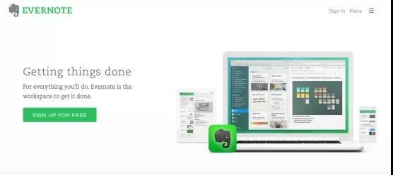
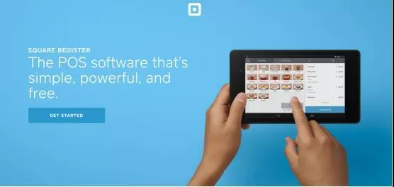
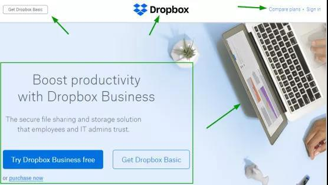
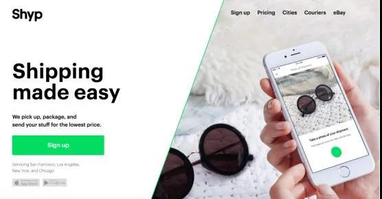
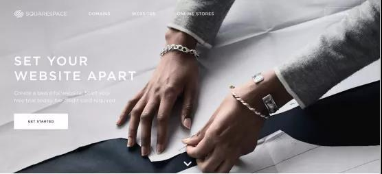
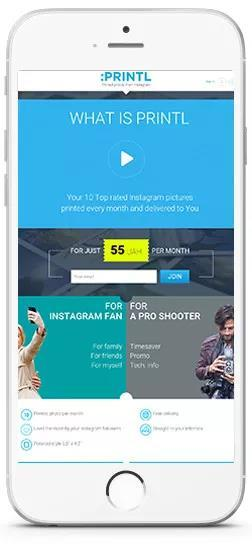
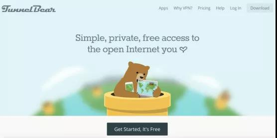

## Landing Page

Landing page，用中文名来说，就是叫着陆页，在国外，Landing page起到的作用是来吸引流量用的，简单来说，就是靠Landing page来吸引用户的，可以是让用户留下邮箱，也可以是让用户购买下单的。

所以Landing Page，一般也叫Money page。

三要素：

- 设计。有没有很好的设计、框架、图像或者是能吸引客户的地方。
- 优惠。你提供的优惠是不是能引起用户的共鸣，是不是对他们有足够的诱惑？
- 产品。你销售的产品客户愿意去买吗？

## 优化

### 站在用户的角度上思考

这是在设计landing page时我们首先要做的事情：站在用户的角度上思考问题。

- landing page的目标受众是哪些人？
- 你要给他们传达什么样的信息？怎么传达更有效果？
- 产品对用户有哪些作用?  什么作用最能够吸引他们？
- 用户会在网站注册吗？ 为什么会注册？
- 怎么提高转化率？

思考这些问题，有助于了解你的目标受众，知道他们的需求是什么，怎么才能更好地满足他们的需求，并实现你的目的。

### 保持页面清晰、简洁

 landing page要在形式上和内容上保持清晰、简洁。一个吸引人的简单设计，会比一个设计繁杂的页面，给人留下更深刻的印象。

如果这个设计能满足用户的目的，那基本上会有很高的转化率。比如说我们经常会使用的印象笔记，它的landing page就非常的简洁、高效。

除了设计外，landing page的内容也应该保持简洁。网络设计中，视觉效果可能会是抓人眼球的最重要一点，但文字内容也很重要。

一个高大上的视觉设计，还要有与之匹配的文字内容，才能共同发挥良好的效果，不能说文字竟然还有语病，或使用很复杂的术语，生僻的术语会拉开和用户的距离。

内容要明确、简洁。站在客户的角度上去思考，用最简单的方式解释你的概念。

上面这个landing page很清晰简洁，上方导航栏有3个元素，右边是一个图片，有不错的视觉效果，左边就是一个简单的介绍和CTA（号召性用语），非常的简洁美观、一目了然。

### 精简用户注册信息

大家是不是经常会有这样的情况，注册一个网站时，如果不是完全必要去注册，就会很容易离开这个页面。

如果要填写的内容很多，就会没有耐心完成注册。另外，用户也会对填写个人信息保持警惕，毕竟现在泄露私人信息的事情太多。

所以，无论landing page是要求用户注册登录还是订阅内容，注册信息保持精简很重要，对用户友好的landing page才会有更多人注册。

注册信息只要求用户填写必要的内容，越简单越好。你可以设置优惠、或者让你的landing page富有吸引力，突出用户可以信任你的理由，说服用户注册。

然后通过一个简单快速的注册流程，让客户保持信任。这一点很容易做到，但对于转化率来说很重要，所以千万不要因为这样一个小小的问题。

### 强大的CTA

CTA是用来号召用户采取行动的按钮，是转化的重要步骤，所以一定要有一个很强大的号召性用语按钮，设计美观、显示的信息能够吸引用户去注册，这样的CTA是最有效果的。

一开始就创建出这样强大的CTA是有点困难的，还需要通过A/B测试，对CTA的颜色、形状、大小、字体进行试验，才会找出一个最好用的。

另外，CTA的文字要直截了当，这样才不会引起用户的混淆和犹豫。

### 视觉效果

使用合适的视觉效果，对增强landing page的吸引力很有帮助。当然，也不用在landing page上面填满所有的图片，而应该在简洁的基础上，使用独特的视觉效果。

怎么使用视觉效果提高转化率呢?

**可以从这几个方面去做：**

- 视觉效果可以给用户更加清晰的感觉，作为背景展示landing page的文字信息。
- 视频、信息图可以快速地解释产品、服务。
- 可以通过实例展示产品和服务，很直观。
- 提高用户的互动、参与。

### 移动端进行优化

这个也说过很多次了，现在使用手机浏览产品和广告的人越来越多，对移动设备的浏览体验提出了更高的要求，所以landing page在移动端的优化很重要。

**移动端的网页设计要注意的地方:**

移动端的CTA效果如何，landing page浏览顺畅吗，移动端设计和移动设备相适应吗？

可以使用谷歌工具think with Google,测试网站在移动端的速度和客户体验友好度。

### 解决用户的问题

用户访问landing page的目的是要了解更多有关产品和服务的信息。你要把握这个机会去说服他们。

如果landing page不能给他们提供足够多的信息，他们很快就会离开这个页面。所以你需要让用户相信你的价值，你的产品是能够解决他们的问题的。

详细介绍你的产品是怎样解决用户问题的，你可以使用项目符号、视频或是图形的简短说明。通过向用户展示你的价值，会让他们更加愿意注册。

### 不要分散用户的注意力

信息时代，干扰我们注意力的事情越来越多，如果你设计的网页没有一个很明确的主题，设计上又有很多的跳转，会造成用户更容易分心，这样用户怎么会集中在你的产品和服务上面呢？

我们要注意landing page的横幅、弹出窗口、菜单栏和外链的设计要合理，让用户易于集中注意力，这样用户才更容易转换，减少转化的阻力。

### 

### 创设一个退出弹窗

如果用户想要关掉页面，可以显示一个退出弹窗。退出弹窗是最后用来转化用户的机会。

退出弹窗可以使用显眼的图片、标题和CTA，设置折扣或优惠让用户点击。

因为用户已经在Landing page上面浏览过了，了解了产品和服务的大致内容，所以这时用一个退出弹窗能提醒用户采取行动。

在用户刚开始进入Landing page时采用弹窗，会让用户觉得推销意图太强，甚至有点排斥。

当用户逛完差不多要离开的时候，出现退出弹窗，给用户提供一个惊喜，会有很好的激励效果。

## 工具

- [Create Your Landing or Squeeze Page with our Landing Page Builder Landingi](https://landingi.com/)
- [Crazy Egg](https://www.crazyegg.com/) 显示你的landing page的网页热图，用以查看网页的哪些位置更有热度，哪些位置没有热度。

## From

- [9种最好用的着陆页-Landing page优化方法（内含实用插件） 顾小北的B2C博客](http://www.guxiaobei.com/9-landing-page-optimization-methods.html)