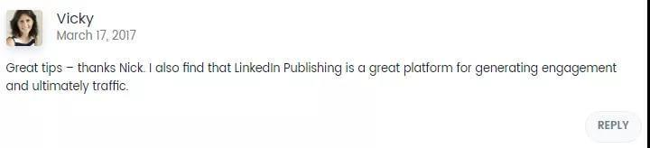

From: [手把手教—我是如何做一个英文网站优化？ 顾小北的B2C博客](http://www.guxiaobei.com/english-website-optimization.html)

## 选品

[Top Ten Reviews - Product Comparisons to Help You Buy Better](https://www.toptenreviews.com/) 找一个竞争不大的软件分类。

比如 ：DVD Copy Software，上面的前五名（DVD Cloner、DVDFab、 123 Copy DVD Gold、 Xilisoft DVD Copy、 Tipard DVD Cloner）都是能赚钱的产品，而且这些商家对 Affiliate 非常友好。

## 确认网站类型和关键字

假设我们要推广的产品是排名第一的 DVD Cloner，我们应该建设什么类型网站来推广它呢？根据我的经验，我认为这两种类型的网站相对容易获得 Google 的青睐：

1. Review 站：建设一个 DVD Cloner 的评测网站。写一篇内容丰富的 DVD Cloner Review，把它固定在网站首页。

   然后再写一些关于 DVD Cloner 的 How To / FAQs / News / Tips 文章。优化关键字为：DVD Cloner、DVD Cloner Review、DVD Cloner Coupon 等。

2. Top 10 站：建设一个 Top 10 DVD Copy Software 排名网站。针对排名前 10 名的每一个 DVD Copy 软件写一篇丰富的评测。

然后在首页或者其他页面写一篇它们排名的文章，排在第一的产品当然是我们想要推广的 DVD Cloner。再写一些 How To / FAQs / News / Tips 用来充实网站内容。 

优化关键字为：各个软件名字，软件名字 + Review, DVD Copy Software, Best DVD Copy Software，DVD Copy Software Review 等。

案例参考：

- [http://www.dvdcopysoftware-reviews.com](http://www.dvdcopysoftware-reviews.com/)
- [http://www.backupreview.com](http://www.backupreview.com/)
- [http://www.bestiphonedatarecovery.com](http://www.bestiphonedatarecovery.com/)
- [websitesetup.org/website-builders](https://websitesetup.org/website-builders/)

第一种网站相对简单，投资也比较少适合新手；但网站不利于扩展，比如推荐的产品不行了，网站也跟着衰败。如果长远考虑，还是第二种网站更好。

好了，看完上述案例，接下来我在补充跨境电商行业内的几个做的比较好的网站，他们分别是：

- [ www.anker.com](https://www.anker.com/)
- [http://www.inateck.com](http://www.inateck.com/)
- [http://www.easyacc.com](http://www.easyacc.com/)

okay，结合本文，这里小北给你留一个作业来思考，你去分析下，这些网站他们有什么共同点，有什么相同的策略？

我相信这些点，会对你做网站，以及流量会有所启发！

## 外包文章

外包是一门技术活，不要以为花钱了就是大爷。举个例子，你现在花 100 元请我用中文写一篇文章，丢给我一个关键字叫“演员的自我修养”，字数 1000 左右，质量必须保证。

你叫我怎么写？我是写《演员自我修养》这本书的作者斯坦尼斯拉夫斯基的故事？还是周星驰的电影《喜剧之王》？

还是作为演员的表演技巧？这些我都毫无经验，就算文章写出来，也是一坨屎。同理，英文文章外包你不能只给你的写手一个关键字，就期待他写出一篇质量好的文章。

你必须比写手更了解产品，知道自己想要的文章是什么样子，分辨得出收到的文章是否在瞎扯。

我的外包技巧是这样的，比如我现在想要一篇 1500 字 DVD Cloner 的评测文章，我会发给写手以下信息：

Article Title: DVD Cloner Review (1500 words)This is a good example of what I am looking for:
[http://www.dvdcopysoftware-reviews.com/dvd-cloner](http://www.dvdcopysoftware-reviews.com/dvd-cloner)

**Table of Contents:**

- DVD Cloner Overview
- DVD Cloner Features
- How DVD Cloner Works
- Compatibility
- DVD Cloner Pricing
- Pros
- Cons
- Conclusion

 

当写手看到 Article Title 就知道我要的文章类型是 Review，读完我提供的 Example 就大概了解产品了，看了 Table of Contents 他就知道要写什么了。

只要写手不是小学毕业，最后我收到的文章一般不会差到哪去。我的文章全部外包给美国写手。

外包的文章分为两种

- 一种写给用户看的，挂广告。
- 一种写给 Google 收录的，不挂广告，这种文章用来充实网站内容，但质量也马虎不得。第一种文章，我会做大量改写和排版，保证 100% 质量。这种文章，在检查和确认没有拼写和语法错误之后，我一般直接复制粘贴到网站，当然也会做点排版和加几个图片。

**我建议不要发太多要求给写手，什么保证 100% 原创、零语法/拼写错误、深入研究产品再进行写作等等，在对方眼里全是 Bullshit！**

对，是Bullshit！

因为你付的钱不够，真做到这些至少每 100 字 5 美元起步。科普一下，美国最低时薪是 7.25 美元，美国砌砖工人和流水线工人这类工人的最低时薪是 15 美元。

## 做外链

说到做外链，就涉及到私人博客群（Private Blog Networks 简称 PBN），我想写却无从下笔，因为这明显违反了 Google 的“网站站长指南”和我的网站底线“不误人子弟”。

这是 Google 的警告：任何想要操纵网站在 Google搜索结果中的排名的链接都可能被视为属于链接方案，而且有违 Google 的网站站长指南。

其中包括对指向您网站的链接或从您的网站转出的链接进行操纵的任何行为。这些行为可能会导致相应网站被从 Google 索引中彻底移除，或者导致系统算法或我们手动将其标识为垃圾网站。

如果某个网站被标识为垃圾网站，那么它可能不会再出现在 Google.com 或任何 Google 合作伙伴网站的搜索结果中。各位可能认为我的英文网站排名好，靠的是 PBN？老铁们，你们真的想错了，我一个小站长有什么资格和 Google 对抗？

我摸着良心说，写给用户看的文章，我细致到连标点符号都不放过的程度。比如最近几天我写的这篇中文文章 ，编辑次数都达到 100 多次了，投入多少心血和时间，不用我多说了吧。

如果我再给这篇文章做点外链，Google 好意思不给我排名吗？只有当我的网站内容本身具备真正价值时, 比竞争对手的内容更加优秀时，我才会使用 PBN。

作为一个被 Google 虐哭过两次的人表示，SEO 要的是稳定、长久与细水长流。因此，为了对自己和读者负责，这篇文章我只能推荐符合 Google 网站站长指南的外链方式。

**这些年我一直在用的一个外链方式 ： 博客留言。**

效果不错做起来非常简单，只需要 Google 一些关键字，打开排在第一和第二页的网址进行手动评论。几个技巧：

一个好的留言案例Google 的关键字和网站的 Niche 相关最好，不相关也没事。

推荐做 **15-20** 条留言外链，不追求数量，一天手动评论 **1-3** 条即可。请正常留言，不要 Spam。留言的名字框填写一个英文名字，不要用关键字。

为了提高评论通过率，建议留言的邮箱申请 Gravatar 帐号上传一张头像。
