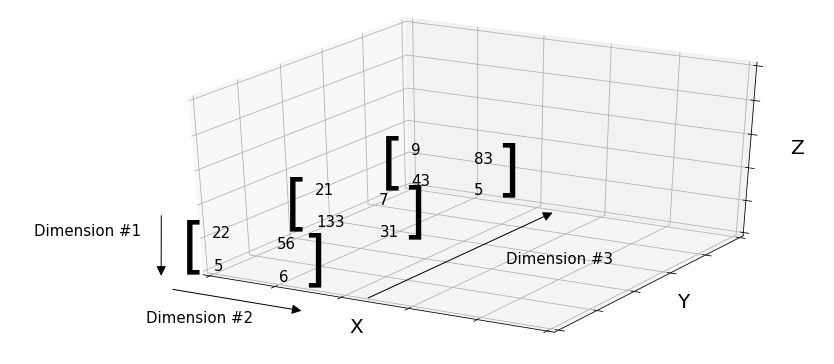

课程：[麻省理工公开课：线性代数_全35集_网易公开课](http://open.163.com/special/opencourse/daishu.html)

教程：[Linear Algebra – Medium](https://medium.com/linear-algebra)

## 线性方程

[Part 1 : Linear equation of two variables and Matrices](https://medium.com/linear-algebra/part-1-linear-equation-of-two-variables-and-matrices-d8de21eb8d51)

*线性代数* 的作用是求解 *线性方程组(system of linear equations)*。

比如以下线性方程组：


$$
x-2y = 6 →(1) \\
x-y = 4 →(2) \\
x+y = 0 →(3)
$$
*矩阵（Metrices）* 是元素在行和列中的排列。元素可以是任何东西（常量，数字，变量等）。

可以用举证来表示线性方程。

比如系数端（coefficient side ）用矩阵表示为：
$$
\begin{bmatrix}
	1 & -2\\
	1 & -1\\
	1 & 1
\end{bmatrix}
$$
常数端（constant side）用矩阵表示为：
$$
\begin{bmatrix}
	6 \\
	4 \\
	0
\end{bmatrix}
$$
可以将两个矩阵一起写成一个增广矩阵( [augmented matrix](https://en.wikipedia.org/wiki/Augmented_matrix))，用“ |”或虚线分隔。
$$
\left[\begin{array}{crr|r}
1 & -2 && 6\\
1 & -1 && 4 \\
1 &  1 && 0
\end{array}\right]
$$


## 矩阵运算

### 加法和减法

[Part 2 : Operations on Matrices - Linear Algebra - Medium](https://medium.com/linear-algebra/part-2-operations-on-matrices-3caab542aebd)

矩阵的加法和减法的运算方法是将相同位置的元素相加减。

行列数相同的矩阵才允许做加减法。


=


减法同理。

### 与标量的乘法和除法

标量与矩阵相乘，结果为标量与矩阵中的每个元素相乘。


标量与矩阵的除法与乘法类似，如：

```
 J/3 = (1/3) × J = K
```

### 乘法

两矩阵相乘 A · B 必须满足 A 的列数和 B 的行数相同，否则不可乘。

如：
$$
A_{mn}·B_{np}=C_{mp}
$$


如计算 C~3,4~，为 A 的 3 行 与 B 的第 3 列的点积：
$$
\begin{align*}
C_{3,4} &= (Row3 of A)·(Column 4 of B)\\
&= a_{3,1}b_{1,4}+a_{3,2}b_{2,4}~+…\\
&= \sum_{k=1}^{n} a_{3k}b_{k4}
\end{align*}
$$
计算 Ax：
$$
\begin{bmatrix}
	2 & 5\\
	1 & 3
\end{bmatrix}
\begin{bmatrix}
	1\\
	2
\end{bmatrix}
=
\begin{bmatrix}
	2*1 + 5*2 \\
	1*1 + 3* 2
\end{bmatrix}
=
\begin{bmatrix}
	12 \\
	7
\end{bmatrix}
$$

#### 列线性组合

矩阵乘以向量 Ax：
$$
\begin{bmatrix}
	2 & 5\\
	1 & 3
\end{bmatrix}
\begin{bmatrix}
	1\\
	2
\end{bmatrix}
=
1
\begin{bmatrix}
	2 \\
	1
\end{bmatrix}
+
2
\begin{bmatrix}
	5 \\
	3
\end{bmatrix}
=
\begin{bmatrix}
	12 \\
	7
\end{bmatrix}
$$
Ax is a cominations of columns of A. 对于维数较少的向量可以使用这种方法，但以后对于较多维数的向量，推荐使用列向量的线性组合的方法。

对于矩阵相乘，我们把 B 考虑为 p 个单独的列向量，用 A 乘以每个列向量，得到 p 列的答案。
$$
\begin{bmatrix}
	a_{1,1} & a_{1,2} & ...\\
	a_{2,1} & a_{2,2} & ...\\
	a_{3,1} & a_{3,2} & ...
\end{bmatrix}
\begin{bmatrix}
	b_{1,1} & b_{1,2} & ...\\
	b_{2,1} & b_{2,2} & ...\\
	b_{3,1} & b_{3,2} & ...
\end{bmatrix}
=
\begin{bmatrix}
	b_{1,1} * a_{:1} + 	b_{2,1} * a_{:2} + ...,  & b_{:2} 与 A 的列线性组合, ...\\
\end{bmatrix}\\
=
\begin{bmatrix}
	Ab_{:1}, Ab_{:2}, ...
\end{bmatrix}
$$
Columns of C are combinations of columns A. C 中的每一列相当于 A 中每个列向量的线性组合，即可简化为 Ab=c, b 即为线性组合的解。

#### 行线性组合

$$
\begin{bmatrix}
	1 & 2 & 7
\end{bmatrix}
\begin{bmatrix}
	- & - & - \\
	- & - & - \\
	- & - & -
\end{bmatrix}
= 1 * Row1 + 2 * Row2 + 7 * Row3
$$


$$
\begin{bmatrix}
	a_{1,1} & a_{1,2} & ...\\
	a_{2,1} & a_{2,2} & ...\\
	a_{3,1} & a_{3,2} & ...
\end{bmatrix}
\begin{bmatrix}
	b_{1,1} & b_{1,2} & ...\\
	b_{2,1} & b_{2,2} & ...\\
	b_{3,1} & b_{3,2} & ...
\end{bmatrix}
=
\begin{bmatrix}
	b_{1,1}*a_{1:} + 	b_{1,2}*a_{2:} + ... \\
	B 的第二行与 A 的行线性组合\\
	...
\end{bmatrix}\\
=
\begin{bmatrix}
	a_{1:}B \\
	a_{2:}B \\
    ...
\end{bmatrix}
$$

Rows of C are combinatitons of rows of B. C 中各行是 B 中各行的线性组合。

#### 列乘行

(Columns of A)~mx1~ * (Rows of B)~1xp~
$$
\begin{bmatrix}
	2 \\
	3 \\
	4
\end{bmatrix}
\begin{bmatrix}
	1 & 6
\end{bmatrix}
=
\begin{bmatrix}
	2 & 12 \\
	3 & 18 \\
	4 & 24
\end{bmatrix}
$$
这是个特殊的矩阵，结果矩阵的每行是 B 的倍数，每列是 A 的倍数，即线性组合关系。结果矩阵的行向量与 [1, 6] 方向相同 ，列向量与

AB = Sum of (Columns of A)~mx1~ * (Rows of B)~1xp~
$$
\begin{bmatrix}
	2 & 7\\
	3 & 8\\
	4 & 9
\end{bmatrix}
\begin{bmatrix}
	1 & 6 \\
	0 & 0
\end{bmatrix}
=
\begin{bmatrix}
	2 \\
	3 \\
	4
\end{bmatrix}
\begin{bmatrix}
	1 & 6
\end{bmatrix}
+
\begin{bmatrix}
	7 \\
	8 \\
	9
\end{bmatrix}
\begin{bmatrix}
	0 & 0
\end{bmatrix}
$$

#### 分块乘法 Block

$$
\begin{array}{c|c}
A_1 & A_2 \\ 
\hline
A_3 & A_4
\end{array}
\begin{array}{c|c}
B_1 & B_2 \\ 
\hline
B_3 & B_4
\end{array}
=
\begin{array}{c|c}
A_1B_1+A_2B_3 & ... \\ 
\hline
... & ...
\end{array}
$$

### 矩阵的除法

矩阵除法与标量除法不同。矩阵 B 除以矩阵 A（B / A），也可以写成 B×A^⁻1^。其中，A^-1^是A的逆矩阵。

Taking an example


This is equivalent to multiplication of matrix B with inverse of A.

As


## 矩阵的类型

如果一个矩阵的行数和列数相同，我们称该矩阵为 *正方形矩阵（Square matrices， 方阵）*，否则我们称之为 *长方形矩阵（Rectangular matrices）*。

### 对角线

行和列相同的所有元素，形成矩阵的 *对角线（Diagonal of  a matrix）*。如以下矩阵：


a11, a22, a33 形成上述矩阵的对角线。

矩形矩阵的对角线的查找方法类似：


### 单位矩阵

对角元素是 1 ，其他元素均为 0 的**方阵**称为 *单位矩阵（Identity matrix）*。用 **I** 表示。如：


任何方阵乘以相应的单位矩阵结果是该矩阵本身。就像任何数乘以 1，结果不变一样。

```
Matrix A × I = matrix A
```

### 零矩阵

所有元素均为  0  的矩阵称为 *零矩阵（Zero or Null Matrices）*。零矩阵可以是矩形矩阵。

### 三角矩阵

对角线以下均为 0，对角线或对角线以上(in and above)具有非零元素的矩阵称为 *上三角矩阵（Upper Triangualr Matrices）*，记为  **U**。

对角线以上均为 0，对角线或对角线以下(in and below)具有非零元素的矩阵称为 *下三角矩阵（Lower Triangualr Matrices）*，记为  **L**。

### 转置 Transpose

矩阵的 *转置（Transpose）* 是将矩阵所有行改成列（列改成行）。For example, element at position **a12** (row 1 and column 2) will now be shifted to position **a21** (row 2 and column 1), **a13** to **a31**, **a21** to **a12** and so on.

转置时，只有对角线的元素保持不变。

A的转置矩阵记为$A^T$。


例如：
$$
\begin{bmatrix}
	1 & 3 \\
	2 & 3\\
	4 & 1
\end{bmatrix}^T
=
\begin{bmatrix}
	1 & 2 & 4 \\
	3 & 3 & 1
\end{bmatrix}^T
$$
转置公式：
$$
(A^T)_{ij}=A_{ji}
$$

#### 对称矩阵 Symmetic Matrics

$A^T=A $的矩阵称为对称矩阵，即矩阵转置之后保持不变的矩阵称为对称矩阵。

如：
$$
\begin{bmatrix}
	3 & 1 & 7 \\
	1 & 2 & 9\\
	7 & 9 & 4
\end{bmatrix}
$$
$R^TR$ is always symmetric, R 为长方形矩阵，如：
$$
\begin{bmatrix}
	1 & 3 \\
	2 & 3\\
	4 & 1
\end{bmatrix}
\begin{bmatrix}
	1 & 2 & 4 \\
	3 & 3 & 1
\end{bmatrix}
=
\begin{bmatrix}
	10 & 11 & 7 \\
	11 &  &   \\
	7 &  & 
\end{bmatrix}
$$
证明如下：
$$
(R^TR)^T=R^T(R^T)^T=R^TR
$$


#### 反对称矩阵

一个矩阵转置之后的结果为 -1 x 该矩阵，则称为该矩阵为 *反对称矩阵（Skew-symmetric Matrices， 斜对称矩阵）*。

```
matrix Aᵀ = (-1) × matrix A
// 即 
Aᵀ = -A
```

如：


反对称矩阵的对角线元素一定是 0，只有 0 x (-1) 才不会变。

## 张量、标量、向量

[Part 4B : Tensors, Scalars, Vectors, and Matrices - Linear Algebra - Medium](https://medium.com/linear-algebra/part-4b-tensors-scalars-and-vectors-68cf6c1f2be)

**Additional Resource :** [An Introduction to Tensors for Students of Physics and Engineering by Joseph C. Kolecki](https://www.grc.nasa.gov/www/k-12/Numbers/Math/documents/Tensors_TM2002211716.pdf)

### 张量

*张量（tensor）*是一个可以扩张为任意维数的数据（数字，函数等）的数组。数据的维数称为张量的 *阶* 或 *秩*（rank of tensor）。

*0 阶张量（Rank 0 tensor）*：0 维张量。如 数字：


*1 阶张量（Rank 1 tensor）*：仅可以扩展为 1 维的张量。如：


*2 级张量（Rank 2 tensor）*：


*3 级张量（Rank 3 tensor）*：



3 阶张量具有立体空间。

超过 3 阶的张量很难可视化。

### 标量

0阶张量称为 *标量（Scalar）*。在物理学中，各种量都用标量表示，例如：距离（500 km），温度（10ºC），速度（34 km / h）等。

### 向量

1 阶张量称为 *矢量（Vector）*。例如速度（10 m / s），位移（向东54 m），电磁场（1 V / m）。

标量和向量的区别：标量不需要额外的信息（如方向）表示；向量除了大小还需要方向（如点场）来表示。

向量由粗体字母(**A**)或 $\vec A$ 表示。

向量只是具有一行（称为列向量）或一列（称为行向量）的矩阵。

向量 (0.5, 0.5) 用来来表示为:


### 矩阵

2 阶张量称为 *矩阵（Matrix）*。

超过 2 阶的张量没有特别的名字。


## 行图和列图

[Part 5 : Row Picture and Column Picture - Linear Algebra - Medium](https://medium.com/linear-algebra/part-5-row-picture-and-column-picture-899e6d834564)

用于表示线性方程组的方法：

- Row Picture
- Column Picture

给定以下方程


$$
\begin{cases}
3x-5y = 6 →(1) \\
x+y = 4 →(2)\\
3x+y = 0 →(3)
  \end{cases}\begin{cases}
3x-5y = 6 →(1) \\
x+y = 4 →(2)\\
3x+y = 0 →(3)
  \end{cases}
$$

### Row Picture

In row picture representation we make a coefficient matrix, a variable matrix and a constant matrix. 

以上线性方式使用 Row Picture 来表示：


即
$$
Ax=b
$$

### 

The row picture of (1), (2) and (3) could be plotted on graph as （**Row picture on graph**）:


To find solution of system of linear equations from Row picture, we look at graph and see if there is any one point of intersection for all the lines, that point is called solution for the system of equations.

If there is no common point, then there is no solution for the system of equations (as seen in the case above).

### Cololum Picure

A column picture is where coefficient matrix if formed separately for each variable. After that variables are multiplied with their coefficient matrices ([scalar multiplication](https://cdn-images-1.medium.com/max/800/1*e87O1tDfgJ8PXivwIBtFnA.png)) and added together. Then, it is equated to constant matrix.

Taking the system of linear equations (1), (2) and (3), the column picture would be as follows :


>  “x” and “y” are scalars being multiplied with their corresponding coefficient matrices

Column Picture 的表示方式就是找到正确的系数 x 和  y，来组合向量[3 1 3]^T^ 和 [-5, 1, 1]^T^，从而得到目标向量[6, 4, 0]^T^，即要找到正确的 *线性组合（Linear Combination of Columns）*。


几何形式(**Column picture on graph**)：

To show column picture on graph, we treat individual coefficient matrices as [vectors](https://medium.com/linear-algebra/part-4b-tensors-scalars-and-vectors-68cf6c1f2be) and plot those vectors on graph.


> Blue vector is coefficient matrix of X ,Red vector is coefficient matrix of Y and Green Vector is Constant matrix.

为了从 Coloumn Pictire 中找到方程组的解，我们将系数矩阵与变量（x和y）的不同值相乘并将它们相加。 如果结果等于常数矩阵，则x和y的值称为线性方程组的解。

## 工具

- [LaTeX/Mathematics - Wikibooks, open books for an open world](https://en.wikibooks.org/wiki/LaTeX/Mathematics)