课程：[麻省理工公开课：线性代数_全35集_网易公开课](http://open.163.com/special/opencourse/daishu.html)

教程：[Linear Algebra – Medium](https://medium.com/linear-algebra)

## 求解方程组

[Part 6 : Gaussian Elimination - Linear Algebra - Medium](https://medium.com/linear-algebra/part-6-gaussian-elimination-b1ad4a279a74)

*高斯消元 Gaussian Elimilation* 用于求解任意元的方程组。所有计算机程序使用的都是该方法求解。

求解方程组：

```
x +2y + z = 2
3x+8y + z = 12
   4y + z = 2
```

使用矩阵表示：

$$
\begin{bmatrix}
	1 & 2 & 1 \\
	3 & 8 & 1 \\
	0 & 4 & 1
\end{bmatrix}
\begin{bmatrix}
	x \\
	y \\
	z 
\end{bmatrix}
=
\begin{bmatrix}
	2 \\
	12 \\
	2
\end{bmatrix}
$$

只要矩阵是可逆的，则用消元法总是可以求解。

首先将目标向量和矩阵 A 合并为一个增广矩阵 Augmented matrix：

$$
\begin{bmatrix}
	1 & 2 & 1 & | & 2\\
	3 & 8 & 1 & | & 12\\
	0 & 4 & 1 & | & 2
\end{bmatrix}
$$

取主元 A~1,1~

1. 消除 A~2,1~ 的元素： 第 2 行 - 3 * 第 1 行
2. 消除 A~3,1~ 的元 素，已经是 0，不用做。

$$
\begin{bmatrix}
	1 & 2 & 1 & 2\\
	3 & 8 & 1 & 16\\
	0 & 4 & 1 & 2
\end{bmatrix}
→
\begin{bmatrix}
	1 & 2 & 1 & 2 \\
	0 & 2 & -2 & 6\\
	0 & 4 & 1 & 2
\end{bmatrix}
$$


取主元 A~2,2~

1. 消除 A~3,2~，A~3:~ - A~2~ * 2。

$$
\begin{bmatrix}
	1 & 2 & 1 & 2\\
	3 & 8 & 1 & 16\\
	0 & 4 & 1 & 2
\end{bmatrix}
→
\begin{bmatrix}
	1 & 2 & 1 & 2 \\
	0 & 2 & -2 & 6\\
	0 & 4 & 1 & 2
\end{bmatrix}
→
Do Nothing
→
\begin{bmatrix}
	1 & 2 & 1 & 2\\
	0 & 2 & -2 & 6\\
	0 & 0 & 5 & -10
\end{bmatrix}
$$

我们把上述过程记为：A → U，U 为上三角矩阵。

消元之后，还需要**回代**，最后的方程变为：

```
x + 2y + z  = -2
    2y - 2z = 6
         5z = -10
```

$$
b=
\begin{bmatrix}
	2 \\
	1 \\
	-2
\end{bmatrix}
$$

使用消元法时，主元不能为 0。如果主元为 0，可以通过行交换使主元不为 0。如果通过行交换都无法得到非 0 的主元，则无法得到唯一解，此矩阵不可逆。

如：

$$
\begin{bmatrix}
	1 & 2 & 1 \\
	3 & 8 & 1 \\
	0 & 4 & -4
\end{bmatrix}
$$

在选定 A~2,2~ 为主元时，第三行都变成了 0。

当出现主元为 0 ，无法消元时，可以先进行行交换，然后再进行消元。如：

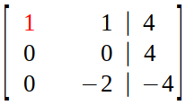

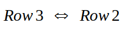

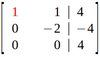


在校园过程中，我们会用到行变换和行交换的操作做，但如何用矩阵来表示这两种操作呢？

### 矩阵变换 Exchange

在消元法中，矩阵之间的变换使用的是简记法。我们用矩阵变换表示上面的消元过程。

消元本质上就是行变换，可以用行线性组合找到对应的矩阵。

**取主元 A~1,1~，消除 A~2,1~ 的元素： 第 2 行 - 3 * 第 1 行**
$$
\begin{bmatrix}
	1 & 0 & 0\\
	-3 & 1 & 0\\
	0 & 0 & 1
\end{bmatrix}_{E_{2,1}}
\begin{bmatrix}
	1 & 2 & 1\\
	3 & 8 & 1\\
	0 & 4 & 1
\end{bmatrix}_A
=
\begin{bmatrix}
	1 & 2 & 1 \\
	0 & 2 & -2\\
	0 & 4 & 1
\end{bmatrix}
$$

1. 由于第一行不变，所以转换矩阵的第一行为 [1, 0, 0]
2. 同理，由于第三行不变，转换矩阵的第三行为 [0, 0, 1]
3. 根据 Row Picture，由于现在需要 Substract 3 * row1 from row2，所以第二行为 [-3, 1, 0]
4. 消除 A~3,1~ 的元素，已经是 0，不用做。

变换矩阵用 E~2,1~ 来表示，E~2,1~ 称为 *初等矩阵*。

**取主元 A~2,2~，消除 A~3,2~ 的元素： 第 3 行 - 2 * 第  2 行**

$$
\begin{bmatrix}
	1 & 0 & 0 \\
	0 & 1 & 0\\
	0 & -2 & 1
\end{bmatrix}_{E_{3,2}}
\begin{bmatrix}
	1 & 2 & 1 \\
	0 & 2 & -2\\
	0 & 4 & 1
\end{bmatrix}
=
\begin{bmatrix}
	1 & 2 & 1\\
	0 & 2 & -2\\
	0 & 0 & 5
\end{bmatrix}
$$

变换矩阵用 E~3,2~ 来表示。

整个变化过程表示为：

E~3,2~( E~2,1~A)=U

根据乘法矩阵结合律（associative law, moving the parentheses）可以变换为：

(E~3,2~E~2,1~)A=U

→EA=U

矩阵相乘的顺序不能改变，也就是说矩阵不具有交换律。

### 矩阵置换 Permutation

Permutation  用于执行行交换。

在消元过程中，当主元为 0 时，可以需要交换行来使主元非零，继续消元。

用来交换一个矩阵的行或列的矩阵称为交换矩阵。
$$
\begin{bmatrix}
	0 & 1\\
	1 & 0           
\end{bmatrix}
\begin{bmatrix}
	a & b\\
	c & d           
\end{bmatrix}
=
\begin{bmatrix}
	c & d\\
	a & b           
\end{bmatrix}
$$
以上说的都是行变换，假如要进行如下的列变换：
$$
\begin{bmatrix}
	a & b\\
	c & d           
\end{bmatrix}
\begin{bmatrix}
	0 & 1\\
	1 & 0           
\end{bmatrix}
=
\begin{bmatrix}
	b & a\\
	d & c           
\end{bmatrix}
$$
对于 3*3 的矩阵，有 6 中变换，每种变换相乘或者取逆的结果仍然是在这个 6 个变换矩阵中。
$$
\begin{bmatrix}
	1 & 0 & 0 \\
	0 & 1 & 0\\
	0 & 0 & 1
\end{bmatrix}
\begin{bmatrix}
	1 & 0 & 0 \\
	0 & 0 & 1\\
	0 & 1 & 0
\end{bmatrix}
\begin{bmatrix}
	0 & 1 & 0 \\
	1 & 0 & 0\\
	0 & 0 & 1
\end{bmatrix}
\begin{bmatrix}
	0 & 1 & 0 \\
	0 & 0 & 1\\
	1 & 0 & 0
\end{bmatrix}
\begin{bmatrix}
	0 & 0 & 1 \\
	1 & 0 & 0\\
	0 & 1 & 0
\end{bmatrix}
\begin{bmatrix}
	0 & 0 & 1 \\
	0 & 1 & 0\\
	1 & 0 & 0
\end{bmatrix}
$$

对于 4 阶矩阵，有 24 个变换举证。n 阶矩阵有 n! 种置换方法。

置换矩阵的个数为：$n!=n(n-1)···3·2·1$。

**性质：置换矩阵的逆等于其转置。**

$P^{-1}=P^T$

所以
$$
P^TP=I
$$

$$
\begin{bmatrix}
	1 & 0 & 0 \\
	0 & 0 & 1\\
	0 & 1 & 0
\end{bmatrix}
$$


在 A = LU 分解中，有个前提是 A 不需要进行行置换，如果 A 需要进行行置换，对于消元过程记为：
$$
PA=LU
$$
P 为置换矩阵，是单位矩阵的重新排列。

对于任意可逆矩阵 A，均有这种形式。

## 逆 Inverses

[Part 7 : Inverses and Gauss-Jordan Elimination - Linear Algebra - Medium](https://medium.com/linear-algebra/part-7-inverses-and-gauss-jordan-elimination-39c5162428e0)

如果一个矩阵 **A** 和 另一个矩阵 **B** 的乘积是单位矩阵 **I**，则 **B** 为 **I** 的逆矩阵，**B** 记为 **A**^-1^。

> Can I solve Ax=b for every b?
>
> Do the linear combinations of the columns fill N dimension Space?

符合这两个条件的矩阵 A 称为可逆矩阵或非奇异矩阵。

**If you can find a vector x with Ax=0, x≠0, then the matrix is no inversable(Singular).**

如：
$$
Ax=
\begin{bmatrix}
	1 & 3 \\
	2 & 6
\end{bmatrix}
\begin{bmatrix}
	3 \\
	-1
\end{bmatrix}
=
\begin{bmatrix}
	0 \\
	0
\end{bmatrix}
$$
矩阵 A，存在向量 x，使 Ax=0，所以 A 是奇异的或者不可逆的。

对于一些方程组，以 3 维为例，每个方程表示一个平面，如何其中两个平面平行，则列向量的任意组合无法充满整个三维空间，该矩阵即为不可逆的或者是奇异的。

矩阵乘法是不可交换的，但矩阵和逆的乘法是可以交换的。

对于正矩阵，左逆与右逆相等。只要 A 有逆，逆矩阵放在哪边都行，结果都为 **I**。
$$
A^{-1}A=I=AA^{-1}
$$

### 逆的求解

求以下矩阵的逆：
$$
\begin{bmatrix}

​	1 & 0 & 0 \\

​	-3 & 1 & 0\\

​	0 & 0 & 1

\end{bmatrix}
$$


求解过程:

$$
\begin{bmatrix}
1 & 0 & 0 \\
-3 & 1 & 0\\
0 & 0 & 1
\end{bmatrix}

\begin{bmatrix}

​	1 & 0 & 0 \\

​	3 & 1 & 0\\

​	0 & 0 & 1

\end{bmatrix}

=

\begin{bmatrix}

​	1 & 0 & 0 \\

​	0 & 1 & 0\\

​	0 & 0 & 1

\end{bmatrix}
$$


我们使用行变换的思路，第一行和第三行没变，第二行的意思的 -3 * Row1 + Row2，它的逆其实就是 3* Row1 + Row2。


求以下矩阵的逆：
$$
\begin{bmatrix}
	1 & 3 & 6 \\
	1 & 2 & 5\\
	2 & 9 & 4
\end{bmatrix}
$$


1. 将矩阵及其单位矩阵构成增强矩阵。
   $$
   \begin{bmatrix}
   	1 & 3 & 6 & | & 1 & 0 & 0\\
   	1 & 2 & 5 & | & 0 & 1 & 0\\
   	2 & 9 & 4 & | & 0 & 0 & 1
   \end{bmatrix}
   $$

2. 执行高斯消除，得到下三角形式。

   消除第一列：

   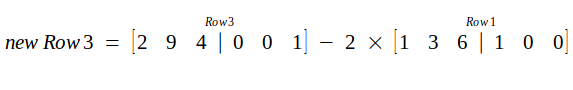

   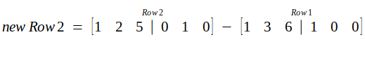

   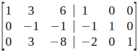

   Now, we apply similar operations for column 2.

   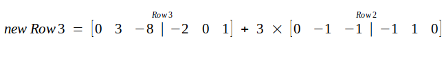

   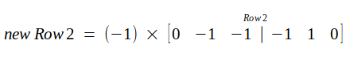

   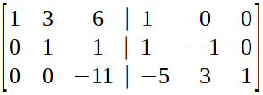

   If we were doing Gaussian Elimination, we would’ve finished by now and started back substitution but to find inverse we have to take it one step further. We have to find Reduced Row Echelon Form.

3. 进一步消元得到 行梯形形式 *Reduced Row Echelon Form*，并且主元为 1 。

   从下往上，把主元变成 1。把第 3 行主元变成 1：

   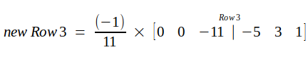

   
   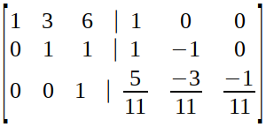
   
   至此，所有主元都变成了 1。
   
   继续消除第 2 行。
   
   
      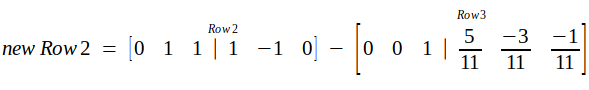
   
      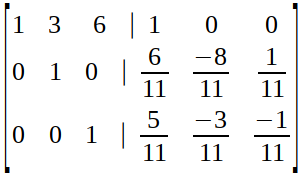
   
   
   
   消除第一行：
   
      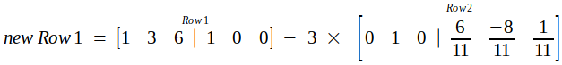
   
      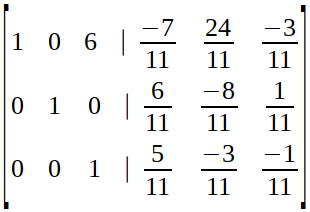
   
      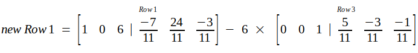
   
      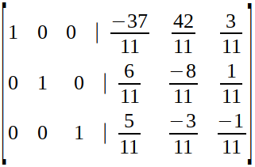
   
   
   
4. 左边是单位矩阵，右边便是矩阵的逆。

      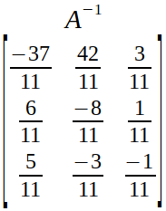

   

### 算法证明

为什么按照以上的算法可以计算出 $A^{-1}$ ？

我们将上述过程变为
$$
E\begin{bmatrix}
A & I
\end{bmatrix}
=
\begin{bmatrix}
E·A & E
\end{bmatrix}
=
\begin{bmatrix}
I & E
\end{bmatrix}
$$
其中 E 是消元矩阵。
$$
EA = I
$$
所以 E = A^-1^

### 是否有逆

判断以下矩阵 A 是否可逆？
$$
A = \begin{bmatrix}
1 & 3\\
2 & 6
\end{bmatrix}
$$

1. 假设有一个矩阵 B 是 A 的逆，则 A·B=I。 I 的每列是 A 的每列的线性组合，而 A的两列共线，不可能组合出 [1, 0]^T^ 向量。

2. 根据行列式的值可以判断矩阵是否有逆。 

3. 如果可以找到一个非零向量 $\vec x$，使得 $A \vec x=0$，则矩阵不可逆。

   上例中， 
   $$
   A = \begin{bmatrix}
   1 & 3\\
   2 & 6
   \end{bmatrix}
   \begin{bmatrix}
   3\\
   -1
   \end{bmatrix}
   = \begin{bmatrix}
   0\\
   0
   \end{bmatrix}
   $$
   可以找到非零向量$\begin{bmatrix}3 \\ -1 \end{bmatrix}$ 使等式成立。

   为什么以上结论是正确的，我么可以用反证法来证明。假设存在逆矩阵A^-1^ ，则 $A^{-1}·A \vec x=0$，则 $\vec x=0$，矛盾。

   如果矩阵的某一列对线性组合毫无贡献，则矩阵是不可逆的。

## A 的 LU 分解

先了解 2 个性质：

1. AB 的逆为 B^-1^A^-1^：

$$
AB(B^{-1}A^{-1})=I
$$


2. A^T^的逆为 $(A^{-1})^T。

$$
AA^{-1}=I \\

(A^{-1})^TA^T=I
$$


下面求解矩阵 A = $\begin{bmatrix}
2 & 1 \\ 
8 & 7
\end{bmatrix}$的 LU 形式。

矩阵变换 E~2,1~ A=U
$$
\begin{bmatrix}
1 & 0 \\ 
-4 & 1
\end{bmatrix}_E
\begin{bmatrix}
2 & 1 \\ 
8 & 7
\end{bmatrix}_A
=
\begin{bmatrix}
2 & 1 \\ 
0 & 3
\end{bmatrix}_U
$$

A=LU 形式

$$
\begin{bmatrix}
2 & 1 \\ 
8 & 7
\end{bmatrix}_A
=
\begin{bmatrix}
1 & 0 \\ 
4 & 1
\end{bmatrix}_L
\begin{bmatrix}
2 & 1 \\ 
0 & 3
\end{bmatrix}_U
$$

L 为 E 的逆。

U 表示 Upper，上三角；L 表示 Lower，下三角。L 的对角线均为 1，U 的对角线为主元。

如果将主元单独出来，则变成 A = LDU

$$
\begin{bmatrix}
2 & 1 \\ 
8 & 7
\end{bmatrix}_A
=
\begin{bmatrix}
1 & 0 \\ 
4 & 1
\end{bmatrix}_L
\begin{bmatrix}
2 & 0 \\ 
0 & 3
\end{bmatrix}_D
\begin{bmatrix}
1 & 1/2 \\ 
0 & 1
\end{bmatrix}_{U'}
$$

DU'=U，可以根据列变换来计算出 U'。

假设 A 是三维矩阵，则：
$$
E_{32}E_{31}E_{21}A=U
$$
**假设没有行交换。**
$$
\begin{align*}
A &= E_{21}^{-1}E_{32}E_{31}^{-1}E_{32}^{-1}U \\
&= LU
\end{align*}
$$
假设E~31~ 是单位矩阵，则左边
$$
E=E_{32}E_{21}=
\begin{bmatrix}
1 & 0 & 0 \\ 
0 & 1 & 0 \\
0 & -5 & 1
\end{bmatrix}_{E_{32}}
\begin{bmatrix}
1 & 0 & 0 \\ 
-2 & 1 & 0 \\
0 & 0 & 1
\end{bmatrix}_{E_{21}}
=
\begin{bmatrix}
1 & 0 & 0 \\ 
-2 & 1 & 0 \\
10 & -5 & 1
\end{bmatrix}_{E}\\
$$


使用 LU 的形式：
$$
L=E_{21}^{-1}E_{32}^{-1}=
\begin{bmatrix}
1 & 0 & 0 \\ 
2 & 1 & 0 \\
0 & 0 & 1
\end{bmatrix}_{E_{21}^{-1}}
\begin{bmatrix}
1 & 0 & 0 \\ 
0 & 1 & 0 \\
0 & 5 & 1
\end{bmatrix}_{E_{32}^{-1}}
=
\begin{bmatrix}
1 & 0 & 0 \\ 
2 & 1 & 0 \\
0 & 5 & 1
\end{bmatrix}_L
$$
两种形式可以表示为：
$$
EA=U\\
A=LU
$$
如果不存在行互换，则消元乘数可以直接写入 L 中，如上例中的 L，而 E 则不具备这样的特性，所以用 LU  来表示消元步骤更先进。

How many operations on n*n martrix A? 解某方程组n为一百万，需要1秒、1小时还是 1周？

对于 100*100 的矩阵，消元的步骤为 99+98+97+...

第一次消元，需要变动的元素个数接近 $100^2$；第二次接近 ；$99^2$...

总的计算次数为：
$$
n^2+(n-1)^2+...+1^2=\frac{1}{3}n^3
$$
对于 Ax=b，除了A的变换，常量 b 的计算次数为 $n^2$。

## 工具

- [LaTeX/Mathematics - Wikibooks, open books for an open world](https://en.wikibooks.org/wiki/LaTeX/Mathematics)