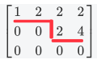
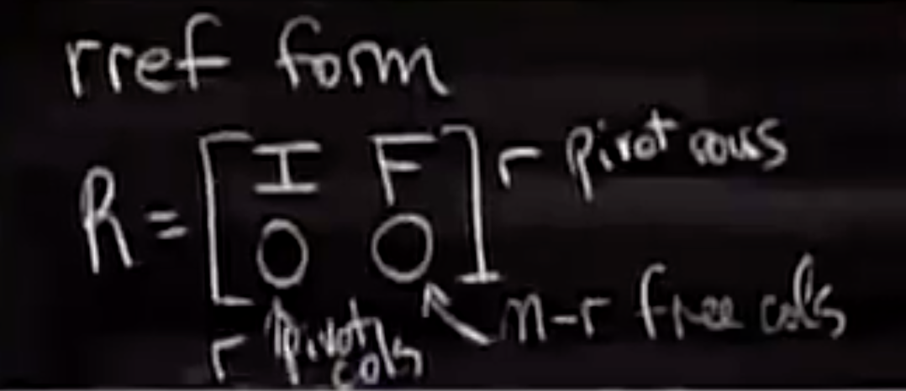

课程：[麻省理工公开课：线性代数_全35集_网易公开课](http://open.163.com/special/opencourse/daishu.html)

## 向量子空间 Subspaces

向量空间必须满足加法、数乘封闭，或者说对线性组合封闭。v + w and cv are in the space, then all combinations cv + dw are in the space. **向量空间必须穿过原点。**

$R^2$ = all 2-dimension real vectors.

​      = x, y 平面

如：
$$
\begin{bmatrix}
3\\ 
2
\end{bmatrix},
\begin{bmatrix}
0\\ 
0
\end{bmatrix},
\begin{bmatrix}
π\\ 
e
\end{bmatrix}
$$

同理：

$R^3$= all vectors with 3 components.

$R^n$=all column vectors with n real components.

一个向量空间中的向量经过加法和数乘后仍然在向量空间中，也就是对线性组合封闭。

向量子空间：$R^n$向量空间的子空间。

比如一条$R^2$内经过原点的直线，就是向量空间$R^2$的子空间，因为直线上的向量满足加法和数乘的封闭性。

并不是所有的直线都能构成子空间，比如不经过原点的直线：

Subspaces of $R^2$:

1. all of $R^2$. 最大子空间
2. Any line through $[0,0]^T$
3. zero vector only. 最小子空间

Subspances of $R^3$:

1. $R^3$
2. 过原点的平面 P
3. 过原点的直线 L
4. 原点 Z

在 R^3^ 空间内，任意两个不同的子空间的并集 $P \cup L$ 不是子空间, 交集 $P \cap L$ 是子空间。

任意子空间 S 和 T 的交集 $S \cap T$ 仍然是子空间。

通过矩阵来构造子空间有2中重要方法：

- 列空间
- 零空间

## 四个基本子空间

| $A_{m, n}$ 的子空间，秩为 r | 父空间 | 秩=维数                                                      | 基                                   |
| --------------------------- | ------ | ------------------------------------------------------------ | ------------------------------------ |
| Column space $C(A)$         | $R^m$  | r = 主变量的个数。                                           | A 的主列                             |
| Null space $N(A)$           | $R^n$  | n-r = 自由变量的个数。special solution, 特征解为零空间的一组基。 | $Ax=0$ 的解空间                      |
| Row space $C(A^T) $         | $R^n$  | r                                                            | 最简形 R 的前 r 行。这也是最佳的基。 |
| Null space of $N(A^T) $     | $R^m$  | m-r                                                          | 参考下面的求解过程。                 |

行空间和列空间具备相同的秩。

举例：
$$
A = \begin{bmatrix}
1 & 2 & 3 & 1 \\
1 & 1 & 2 & 1 \\
1 & 2 & 3 & 1
\end{bmatrix}\\

R(A)=
\begin{bmatrix}
1 & 0 & 1 & 1 \\
0 & 1 & 1 & 0 \\
0 & 0 & 0 & 0
\end{bmatrix}\\
\\
$$
$C(R) \neq C(A)$ 经过行变换的矩阵具有不同的列空间，但具有相同的行空间。

求 $N(A^T)$ 的基：$A^Ty=0$

$（A^Ty)^T=0$ -> $y^TA=0$ ，在 A 的左边乘以变量，这也是把 $N(A^T)$ 称为左零空间的原因。
$$
E
\begin{bmatrix}
A_{m,n} & I_{n,m}
\end{bmatrix}
=
\begin{bmatrix}
R_{m,n} & E_{n,m}
\end{bmatrix}\rightarrow \\
EA = R
$$
求逆矩阵时，R 为 I，则 E 为 $A^{-1}$。

在 A 变成 R 时，利用增广矩阵求得：
$$
E = \begin{bmatrix}
-1 & 2 & 0 \\
1 & -1 & 0 \\
-1 & 0 & 1
\end{bmatrix}
$$

$$
EA = R \rightarrow \\
\begin{bmatrix}
-1 & 2 & 0 \\
1 & -1 & 0 \\
-1 & 0 & 1
\end{bmatrix}
\begin{bmatrix}
1 & 2 & 3 & 1 \\
1 & 1 & 2 & 1 \\
1 & 2 & 3 & 1
\end{bmatrix}
=
\begin{bmatrix}
1 & 0 & 1 & 1 \\
0 & 1 & 1 & 0 \\
0 & 0 & 0 & 0
\end{bmatrix}
$$

左零空间的秩为 m-r = 3-2 =1，所以左零空间是 1 维的。

求左零空间就是求 $A^Ty=0$ 的解空间，即求使这三行的结果为零行的线性组合。

$R$ 的最后一行为 0，则 E 的最后一行即为符合条件的线性组合，即所以左零空间的基的 T。

### 列空间

可以根据矩阵 A 来构造子空间，其中一种方法是通过列向量构造。使用下列矩阵构造$R^3$的子空间：
$$
A=
\begin{bmatrix}
	1 & 3 \\
    2 & 3\\
    4 & 1
\end{bmatrix}
$$
A 的所有列向量的线性组合构成一个子空间：
$$
x\begin{bmatrix}
	1 \\
    2\\
    4
\end{bmatrix}
+
y\begin{bmatrix}
	1 \\
    2\\
    4
\end{bmatrix}
$$
在几何上，这个子空间是由这两个列向量决定的面。

通过这种方法得到的子空间称为列空间，C(A)。

考虑下面这个矩阵的子空间：
$$
\begin{bmatrix}
	1 & 1 & 2 \\
    2 & 1 & 3\\
    3 & 1 & 4\\
    4 & 1 & 5
\end{bmatrix}
$$
Does Ax  = b have a solution for every b?   No. 因为有4个方程，但只有三个未知数，所有并不总是有解。
$$
\begin{bmatrix}
	1 & 1 & 2 \\
    2 & 1 & 3\\
    3 & 1 & 4\\
    4 & 1 & 5
\end{bmatrix}
\begin{bmatrix}
x_1 \\
x_2 \\
x_3
\end{bmatrix}
=
\begin{bmatrix}
b_1 \\
b_2 \\
b_3 \\
b_4
\end{bmatrix}
$$
那什么 b 能让方程组有解呢？Ax=b有解，当且仅当b属于A的列向量空间(b in C(A))，除了零向量。

由于这个矩阵的第 3 列是第 1 列和第 2 列的和，所以第3列可以去除，所以由该矩阵构成的子空间为$R^4$中的二维子空间。

### 零空间 Null Space

零空间是除列空间外，构建子空间的另外一种方法。

Null space of A is All x solutions to Ax=0.

对于以下矩阵
$$
\begin{bmatrix}
	1 & 1 & 2 \\
    2 & 1 & 3\\
    3 & 1 & 4\\
    4 & 1 & 5
\end{bmatrix}
\begin{bmatrix}
x_1 \\
x_2 \\
x_3
\end{bmatrix}
=
\begin{bmatrix}
0 \\
0 \\
0 \\
0
\end{bmatrix}
$$
A 的零空间，N(A) 为：
$$
\begin{bmatrix}
0 \\
0 \\
0
\end{bmatrix},
\begin{bmatrix}
1 \\
1 \\
-1
\end{bmatrix}
...
$$
所有的解可以表示为：
$$
\begin{bmatrix}
c \\
c \\
-c
\end{bmatrix}
$$
A 的零空间属于$R^3$，为三维空间中的一条直线。

**Check that solutions to Ax=0 always give a subspace.**

证明过程：

> Av=0, Aw=0 => A(v+w) = Av+Aw=0
> Av =0, A(cv)=cAv=0

假如 b 不再是 0 向量，比如：
$$
\begin{bmatrix}
	1 & 1 & 2 \\
    2 & 1 & 3\\
    3 & 1 & 4\\
    4 & 1 & 5
\end{bmatrix}
\begin{bmatrix}
x_1 \\
x_2 \\
x_3
\end{bmatrix}
=
\begin{bmatrix}
1 \\
2 \\
3 \\
4
\end{bmatrix}
$$
那么 x 的解不构成子空间，因为 0 不是 x 的解，所以不构成任何子空间。

### 行空间 Row Space

矩阵行的所有线性组合扩展为行空间。

我们通常将行空间转化为列空间来处理：

Row space = all coms of rows = all combs of columns of $A^T$=$C(A^T)$

### 左零空间

A 转置的零空间称为左零空间。

Null space of $A^T$ = $N(A^T)$ = left null space of A

## 零空间的求解 Ax=0

求一下矩阵的零空间：
$$
\begin{bmatrix}
1 & 2 & 2 & 2\\
2 & 4 & 6 & 8\\
3 & 6 & 8 & 10
\end{bmatrix}
$$

### 1. 取主元 $A_{1, 1}$ 消元

$$
\begin{bmatrix}
1 & 2 & 2 & 2\\
0 & 0 & 2 & 4\\
0 & 0 & 2 & 4
\end{bmatrix}
$$

### 2. 取主元 $A_{2, 3}$，消元

$$
\begin{bmatrix}
1 & 2 & 2 & 2\\
0 & 0 & 2 & 4\\
0 & 0 & 0 & 0
\end{bmatrix}
=U
$$
主元以下都是0的矩阵形式也称为 *行阶梯形式（row echelon Form）*，每个主元为一个台阶。

这里只有2个主元（pivots），所有有 2 个台阶。

包含主元的列称为*主列（ pivot columns ）*，对应的变量为*主变量（pivot variables）*；非主元列称为*自由列（free columns）*，对应的变量为*自由变量（free variables）*。*自由列*表示可以给对应位置的未知数赋任意值，这些未知数称为*自由变量*。

注意：阶梯矩阵和下三角矩阵不同。具体参考 [linear algebra - Is there no difference between upper triangular matrix and echelon matrix(row echelon matrix)? - Mathematics Stack Exchange](https://math.stackexchange.com/questions/1720647/is-there-no-difference-between-upper-triangular-matrix-and-echelon-matrixrow-ec)。

### 3. 回代

我们取自由变量 $x_2, x_4$ 为 1, 0。
$$
\begin{cases}
	x_1 + 2x_2 +& 2x_3 + 2x_4 = 0 \\
	            & 2x_3 + 4x_4 = 0
\end{cases}
$$
得到 x 的解为：
$$
\begin{bmatrix}
-2 \\
1 \\
0 \\
0
\end{bmatrix}
$$
得到 N(A)  的一个解。

任何 $c\begin{bmatrix}
-2 \\
1 \\
0 \\
0
\end{bmatrix}$ 均是解，这个解对应的是4维空间中的一条直线。

同样我们取 $x_3 = 0, x_4 =1$ 得到另一组解：
$$
\begin{bmatrix}
2 \\
0 \\
-2 \\
1
\end{bmatrix}
$$
同样，任何 $d\begin{bmatrix}
2 \\
0 \\
-2 \\
1
\end{bmatrix}$ 均是解。

以上求得的 2 个解称为*特解（Special solutions）*。

**特征解的个数=自由变量的个数。**

那么，整个零空间N(A)=
$$
c\begin{bmatrix}
-2 \\
1 \\
0 \\
0
\end{bmatrix}
+
d\begin{bmatrix}
2 \\
0 \\
-2 \\
1
\end{bmatrix}
$$

**A 的  *秩* = A 的主元个数**。

对于秩为 r 的矩阵 $A_{m,n}$，自由变量的个数为 n-r，那么 N(A) 为 r 个特质值的线性组合。

下面进一步用简单的方法求出特征解，而不需要使用回代。

### 4. 简化行阶梯矩阵

将行阶梯矩阵继续向上消元，得到 *简化的行阶梯矩阵 reduced row echoeln form*.

向上消元得到的矩阵为：
$$
\begin{bmatrix}
1 & 2 & 0 & -2\\
0 & 0 & 2 & 4\\
0 & 0 & 0 & 0
\end{bmatrix}
$$
进一步将主元变成 1，对第 2 行进行变换：
$$
\begin{bmatrix}
1 & 2 & 0 & -2\\
0 & 0 & 1 & 2\\
0 & 0 & 0 & 0
\end{bmatrix}
=R=rref(A)
$$
rref 以最简形式包含所有的信息：

- 可以一眼看出主行和主列

- 主行和主列交汇组成单位矩阵。

  

将 R 中的主元放在一起，构成单位矩阵 I：
$$
\begin{bmatrix}
1 & 0 && 2 & -2\\
0 & 1 && 0 & 2\\
I&（主列)&&F&（自由列)\\
0 &0 &&0 &0
\end{bmatrix}
\begin{bmatrix}
x_1 \\
x_3 \\
x_2 \\
x_4
\end{bmatrix}
=
\begin{bmatrix}
I & F\\
0 & 0 \\
\end{bmatrix}
\begin{bmatrix}
x_{pivot} \\
x_{free}
\end{bmatrix}
$$

自由变量 F =

$$
\begin{bmatrix}
2 & -2 \\
0 & 2
\end{bmatrix}
$$

最终特征向量为
$$
\begin{bmatrix}
x_{pivot} \\
x_{free}
\end{bmatrix}
=
\begin{bmatrix}
-F \\ I 
\end{bmatrix}
=
\begin{bmatrix}
-2 & 2 \\
0  & -2 \\
1 & 0 \\
0 & 1
\end{bmatrix}
$$
其中 I 的维数为自有变量的个数，也即 m - r，其中 m 为 $A_{m,n}$ 的行数，r 为 秩。

与第3步中求出的两个特征解相同。

### 5. 证明

已知 rref
$$
R=\begin{bmatrix}
I & F \\
0 & 0
\end{bmatrix}
$$
求解 $Rx=0$ 的所有特征解。

Nullspace matrix's columns (N)= special solutions. 即 RN = 0 
$$
N = \begin{bmatrix}
-F \\
I
\end{bmatrix}
$$
这其实就是特征解的矩阵形式，可以通过Matlab 的null计算。
$$
Rx = 0 \\
\begin{bmatrix}
I & F
\end{bmatrix}
\begin{bmatrix}
x_{pivot} \\
x_{free}
\end{bmatrix}
=0 \\
x_{pivot}I + x_{free}F=0 \\
x_{pivot} = -Fx_{free}
$$
如果给 $x_{free_variable}$ 分配单位矩阵，则 $x_{pivot_variable}$=-F

## 求解 Ax=b

求解下列方程：
$$
\begin{bmatrix}
1 & 2 & 2 & 2\\
2 & 4 & 6 & 8\\
3 & 6 & 8 & 10
\end{bmatrix}
\vec x
=
\begin{bmatrix}
b_1 \\
b_2 \\
b_3
\end{bmatrix}
$$
$\begin{bmatrix}A & b \end{bmatrix}$ 组成增广矩阵 Augmented matrix：
$$
\begin{bmatrix}
1 & 2 & 2 & 2 & b_1\\
2 & 4 & 6 & 8 & b_2\\
3 & 6 & 8 & 10 & b_3
\end{bmatrix}
$$
消元：
$$
\begin{bmatrix}
1 & 2 & 2 & 2 & b_1\\
0 & 0 & 2 & 4 & b_2-2b_1\\
0 & 0 & 0 & 0 & b_3-b_2-b_1
\end{bmatrix}
$$

方程 3 左侧全是 0，右侧必然是 0，才能保证方程组有解，即 $b_3 - b_2 - b_1 =0$。

如 $b=\begin{bmatrix} 1 \\ 5 \\ 6\end{bmatrix}$ 时，是有解的。

### 可解条件

如果要保证方程组有解，b 要满足什么条件？ Solvability condition on b.

仅当 b is C(A) 时，Ax=b 有解。C(A) 表示 A 的列线性组合。换句话说，如果 A 的行线性组合得到零行（如上例），那么 b 中元素的同样组合也必然为 0。

### 求解所有解

假设 $b=\begin{bmatrix} 1 \\ 5 \\ 6\end{bmatrix}$，求一下方程组的所有解：
$$
\begin{bmatrix}
1 & 2 & 2 & 2\\
2 & 4 & 6 & 8\\
3 & 6 & 8 & 10
\end{bmatrix}
\vec x
=
\begin{bmatrix}
1 \\
5 \\
6
\end{bmatrix}
$$
方程的行阶梯矩阵为：
$$
\begin{bmatrix}
1 & 2 & 2 & 2 & 1\\
0 & 0 & 2 & 4 & 3\\
0 & 0 & 0 & 0 & 0
\end{bmatrix}
$$
局变量为 $x_1, x_3$，自由变量为 $x_2, x_4$。

1. 求特征解 $x_{particular}$: 将所有自由变量设为 0，然后求出 Ax=b 中的主变量。

   $x_2 =0, x_4 =0$，得到方程组：
   $$
   \begin{cases}
   x_1 + &2x_3 = 1 \\
   &2x_3=3
   \end{cases}
   $$
   得到方程的特征解：
   $$
   x_p =
   \begin{bmatrix}
   -2 \\
   0 \\
   3/2 \\
   0
   \end{bmatrix}
   $$

2. 求零空间 $x_{null_space}$

3. 所有解 $x = x_p + x_n$，$x_n$ 为零空间中的任意向量。
   $$
   x_{complete} = 
   \begin{bmatrix}
   -2 \\
   0 \\
   3/2 \\
   0
   \end{bmatrix}
   + 
   c_1\begin{bmatrix}
   -2 \\
   1 \\
   0 \\
   0
   \end{bmatrix}
   +
   c_2\begin{bmatrix}
   2 \\
   0 \\
   -2 \\
   1
   \end{bmatrix}
   $$
   如果用图来表示，它是思维空间中经过 $x_p$ 的一个平面。

### 证明

证明为什么 $x = x_p + x_n$是方程组的解。
$$
\begin{cases}
Ax_p =b \\
Ax_n =0
\end{cases}
\implies
A(x_p + x_n) =  b
$$

## 一般结论

假设 $A{m,n}$ 的秩为 r（Know $ r \leq m, r \leq n$），那么在下面的条件下，Ax = b 的解分别是什么？

1. 列满秩，$r=n$。在这种情况下，有 n 个未知数，n 个主元，没有自由变量。

   $N{A}=\vec 0$，如果方程有解，则只能是 $x_p$。

   此时只有 0 或  1 个解。

   如：
   $$
   \begin{bmatrix}
   1 & 3 \\
   2 & 1 \\
   6 & 1\\
   5 & 1
   \end{bmatrix}
   $$
   行最简形式为：
   $$
   R=\begin{bmatrix}
   1 & 0 \\
   0 & 1 \\
   0 & 0\\
   0 & 0
   \end{bmatrix}\\
   即\\
   \begin{bmatrix}
   I \\
   0
   \end{bmatrix}\\
   $$
   零空间只有 $\vec 0$。

   方程组有 4 个方程， 2 个未知数，不一定有解。只有当 b 是 C(A) 时有解。比如两列相加的结果，$\begin{bmatrix}4 \\ 3 \\ 7 \\6\end{bmatrix}$。

2. 行满秩，$r =m$。每一行都有主元，此时 b 满足什么条件时，Ax=b 有解。消元时，不会出现零行，因此 b 没有要求（不需要满足等式2边为 0 的条件）。

   所有对于任意 b，Ax=b 都有解。

   秩为 r，有 n-r（n-m） 个自由变量。

   举例：
   $$
   \begin{bmatrix}
   1 & 2 & 6 & 5 \\
   3 & 1 & 1 & 1
   \end{bmatrix}
   $$

   $$
   R=\begin{bmatrix}
   1 & 0 & - & - \\
   0 & 1 & - & -
   \end{bmatrix}
   =
   R=\begin{bmatrix}
   I& F
   \end{bmatrix}
   $$

3. 满秩方阵，r=m=n。

   如
   $$
   \begin{bmatrix}
   1 & 2 \\
   3 & 1
   \end{bmatrix}
   $$
   这样的矩阵为逆矩阵，所以 $R=I$，N(A) 只有 $\vec 0$。Ax=b，b 不需要满足什么特殊条件，所以方程组肯定有唯一解。

| r=m=n      | r=n<m                                     | r=m<n                                  | r<m, r<n                                       |
| ---------- | ----------------------------------------- | -------------------------------------- | ---------------------------------------------- |
| R=I        | R = $\begin{bmatrix} I \\0 \end{bmatrix}$ | R=$\begin{bmatrix}I & F \end{bmatrix}$ | R=$\begin{bmatrix}I & F \\ 0 &0 \end{bmatrix}$ |
| 1 solution | 0 or 1 solution                           | 1 or $\infty$ solutions                | 0 or $\infin$                                  |

结论：矩阵的秩决定了方程组解的数目。

## New vector space M

把矩阵看做"向量"，比如把一个 3 * 3 的矩阵看成一个向量，矩阵可以做加法和数乘运算，也就是说能够进行线性组合。相当于把 $R^n$ 延伸到了 $R^{n*n}$。

我们只考虑 $A+B, cA$，不考虑 $AB$ 运算，因为向量空间不关心矩阵乘法。

M 的子空间有：

- 所有上三角矩阵
- 所有对称矩阵
- 所有对角矩阵。即以上两种矩阵的交集。

**基:**

所有 3*3 矩阵的基为：
$$
\begin{bmatrix}
1 & 0 & 0 \\
0 & 0 & 0\\
0 & 0 & 0
\end{bmatrix},
\begin{bmatrix}
0 & 1 & 0 \\
0 & 0 & 0\\
0 & 0 & 0
\end{bmatrix},
...
\begin{bmatrix}
1 & 0 & 0 \\
0 & 0 & 0\\
0 & 0 & 1
\end{bmatrix}
$$
维数为 9。

对称矩阵的基 S，如：
$$
\begin{bmatrix}
1 & 0 & 0 \\
0 & 0 & 0\\
0 & 0 & 0
\end{bmatrix},
\begin{bmatrix}
1 & 0 & 0 \\
0 & 3 & 0\\
0 & 0 & 0
\end{bmatrix},
\begin{bmatrix}
0 & 0 & 0 \\
0 & 0 & 0\\
0 & 0 & 7
\end{bmatrix}
$$
维数为 3 。

## 秩 1 矩阵

给定以下秩为 1 的矩阵：
$$
\begin{bmatrix}
1 & 4 & 5 \\
2 & 8 & 10
\end{bmatrix}
$$
$dim C(A) = rank = dim C(A^T) = 1$

A 可以用以下形式表示：
$$
\begin{bmatrix}
1 \\
2
\end{bmatrix}
\begin{bmatrix}
1 & 4 & 5
\end{bmatrix}
$$
所有秩为 1 的矩阵都可以表示为 $A=uv^T$

秩 1 矩阵就像搭建其他矩阵的基本，任何矩阵都可以由秩 1 矩阵构建。

比如秩为 4 的 5*17 矩阵，则需要 4 个秩 1 矩阵即可搭建。

问题：所有 5* 17 中的秩 4 矩阵构成子空间吗？不一定，因为 2 个秩 4 矩阵相加的秩不一定是 4。

**例：**在 $R^4$ 中，$v = \begin{bmatrix} v_1 \\ v_2 \\ v_3 \\ v_4\end{bmatrix}$ ，S = all v in $R^4$ with $v_1 + v_2 + v_3 + v_4 = 0$ ，S是够构成子空间。

$v_1 + v_2 + v_3 + v_4 = 0$ 换成矩阵形式：$Av=0$，$A = \begin{bmatrix}1 & 1 & 1 & 1 \end{bmatrix}$。S 即为 N(A)

S 的维数为 3，因为有 3 个自由变量。rank = 1，dim S = 4-1 = 3。

S 的基为：
$$
\begin{bmatrix}
-1 \\ 1 \\ 0 \\0
\end{bmatrix},
\begin{bmatrix}
-1 \\ 0 \\ 1 \\0
\end{bmatrix},
\begin{bmatrix}
-1 \\ 0 \\ 0 \\1
\end{bmatrix}
$$

- $C(A) = R^1$, dim = 1
- $N(A^T)=\{0\}$, dim = 3
- $C(A^T)=c \begin{bmatrix}1 & 1 & 1 & 1 \end{bmatrix}$, dim = 1
- $N(A^T)$ = 空集, dim = 0

## 工具

- [LaTeX/Mathematics - Wikibooks, open books for an open world](https://en.wikibooks.org/wiki/LaTeX/Mathematics)