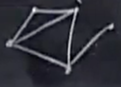
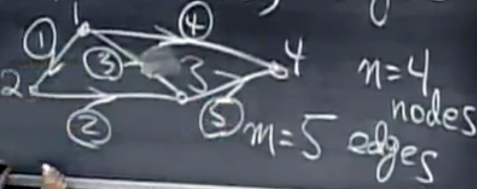
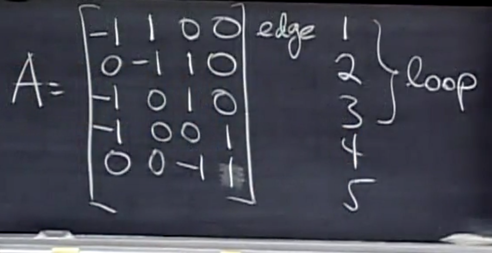

## 图

`Graph = {nodes, edges}`

图是节点和边的集合，边连接各个节点。

 5 个节点，6 条边的图，可以用 5 * 6 的剧本表示所有的信息。

我们可以用矩阵表示下面的图：

 

## 工具

- [LaTeX/Mathematics - Wikibooks, open books for an open world](https://en.wikibooks.org/wiki/LaTeX/Mathematics)