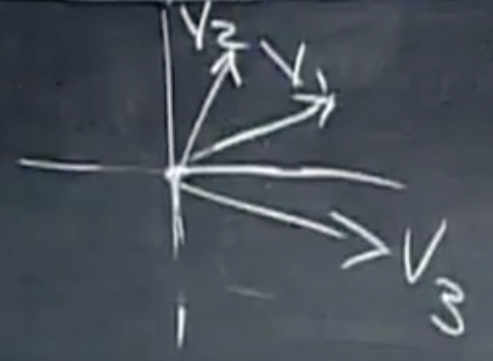

课程：[麻省理工公开课：线性代数_全35集_网易公开课](http://open.163.com/special/opencourse/daishu.html)

## 线性无关 Independent

假设矩阵 $A_{m,n}$，其中 m<n，那么 Ax=0 的非零解存在。

因为这种情况下未知数的个数 > 方程的个数，存在 n 个变量而主元醉倒只有 m 个，所以一定存在至少 n-m 个自由变量。

对于向量组 $x_1, x_2, …, x_n$，如果不存在结果为 0 的向量组合（零组合除外），则*向量组线性无关*。

即 $c_1x_1 + c_2x_2 + … + c_nx_n \neq 0$ ，除了系数 c 全部为 0，否则所有的线性组合不可能为 0，则向量组线性无关。

换一种说法，当 $v_1, v_2, …, v_n$ 是 A 的列向量时：

- 如果这些向量时线性无关的，那么 N(A) ={ $\vec 0$ }，此时 rank = n，没有自由变量。

- 如果是线性相关的，那么存在非 $\vec 0$ 使 Ax=0，此时 rank < n，有自由变量。

举例：坐标系中的任意三个不再同一直线上的向量是否线性相关？

假设三个向量分别为 $v_1=\begin{bmatrix}2 \\1 \end{bmatrix}$,$v_2=\begin{bmatrix}1 \\2 \end{bmatrix}$,$v_3=\begin{bmatrix}2.5 \\-1 \end{bmatrix}$，$v_1, v_2, v_3$组成矩阵 A
$$
Ax=\begin{bmatrix}
2 & 1 & 2.5 \\
1 & 2 & -1
\end{bmatrix}
\begin{bmatrix}
c_1 \\
c_2 \\
c_3
\end{bmatrix}=0
$$
矩阵 A 的秩一定<3，所以一定存在自由变量，所有有多个非零线性组合使 Ax=0。

## 生成空间 Span a space

如果向量组 $v_1, v_2, …, v_n$ 生成一个空间，那么这个空间包含这些向量的所有线性组合。简而言之，矩阵的各列生成列空间。可以直接把这个空间称为 Span。

向量组的生成空间 S 为包含这些向量的空间中最小的一个，因为包含这些向量的空间，必须包含向量组的所有线性组合。

基 Basis for a space 是指，满足以下 2 个性质的向量组 $v_1, v_2, …, v_d$ （向量的个数足够但又不会多）：

1. 它们是线性无关的
2. 它们能生成整个空间

举例，三维空间 $R^3$的一组基是：
$$
\begin{bmatrix}
1 \\
0 \\
0
\end{bmatrix},
\begin{bmatrix}
0 \\
1 \\
0
\end{bmatrix},
\begin{bmatrix}
0 \\
0 \\
1
\end{bmatrix}
$$

2 个线性无关的向量构成不了三维空间的基，因为他们不能生成整个空间，只能生成三维空间中的一个面。

**如果 n 个向量能组成一组基，那么由这 n 个向量组成的 n*n 矩阵是可逆的。**

任何线性无关的列向量，生成矩阵列空间，这些列向量是列空间的基。

对于给定空间（如列空间，$R^3$, $R^n$,零空间等 ），空间的每组基的向量个数均相同，称向量个数为 *空间的维数（Demention of the space）*。

回顾几个概念：

- 线性无关：着眼于线性组合不为 0。
- 生成：着眼于所有的线性组合。
- 基：是一组无关的向量，并生成空间。
- 维数：基向量的个数。

举例：Space is C(A)
$$
\begin{bmatrix}
1 & 2 & 3 & 1 \\
1 & 1 & 2 & 1 \\
1 & 2 & 3 & 1
\end{bmatrix}
$$
这 4 个列向量可以生成列空间，但他们不是列空间的基，因为他们线性相关。

rank of A = # of pivot columns = dimensionof C(A) = 2

同上是上面的矩阵：dim N(A) = # of free variables = n-r

## 工具

- [LaTeX/Mathematics - Wikibooks, open books for an open world](https://en.wikibooks.org/wiki/LaTeX/Mathematics)