## 机器学习

- [机器学习导航](https://www.mlhub123.com/)
- [Python3入门机器学习_经典算法与应用](https://coding.imooc.com/class/169.html#Anchor) 慕课网课程。
- [机器学习入门 - Udacity](https://classroom.udacity.com/courses/ud120) Udacity 免费课程。
- [机器学习-斯坦福吴恩达](https://www.coursera.org/learn/machine-learning/home/welcome) 讲述了机器学习和统计模式识别技术，包括有监督和无监督学习，线性和逻辑回归，正则化和朴素贝叶斯。
- [Hinton：机器学习神经网络](https://www.youtube.com/watch?list=PLoRl3Ht4JOcdU872GhiYWf6jwrk_SNhz9&v=cbeTc-Urqak) 讲述了神经网络在图像分割、人体运动、建模语言、语音和物体识别等方面的应用。
- [Google：深度学习](https://classroom.udacity.com/courses/ud187) 深度学习的动机，深度神经网络，卷积网络以及文本和序列的深层模型。比较难。
- [卡内基梅隆：统计机器学习](https://www.youtube.com/watch?list=PLTB9VQq8WiaCBK2XrtYn5t9uuPdsNm7YE&v=zcMnu-3wkWo) 高级机器学习视频系列讲座，比较难。
- [微软：机器学习原理](https://www.edx.org/course/principles-of-machine-learning)
- [亚马逊：机器学习专业化](https://www.coursera.org/specializations/machine-learning)
- [更多](https://zhuanlan.zhihu.com/p/32081971)
- [一些书籍](https://github.com/KeKe-Li/book/tree/master/AI)
- [金天的个人博客](http://ai.loliloli.pro/)

最早的机器学习应用在垃圾邮件分辨。

传统的计算机解决问题思路：编写规则，定义垃圾邮件，但问题是这种规则，很难定义，并且在不断变化。

机器学习的应用：

- 人脸识别
- 数字识别，MNIST 数据集

数学基础：

- 高等数学
- 线性代数
- 概率论

什么是机器学习：

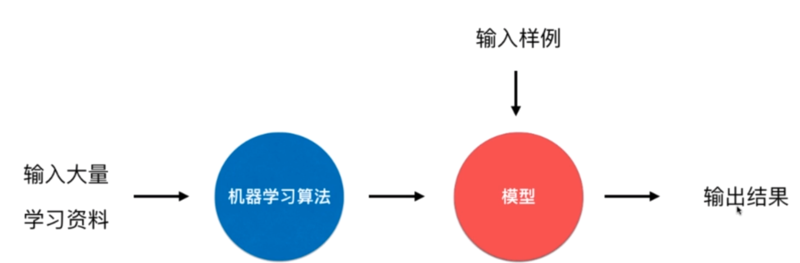

## 数据集 Data Set

[鸢尾花数据集](https://en.wikipedia.org/wiki/Iris_flower_data_set)

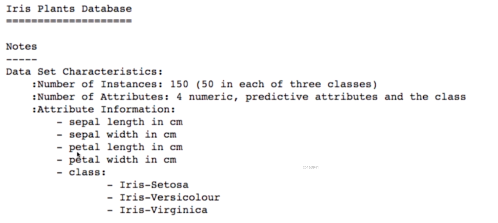

一个数据集包含以下信息：

- 样本数量 150
- 属性个数 4
- 属性信息

数据集通过表格表示：

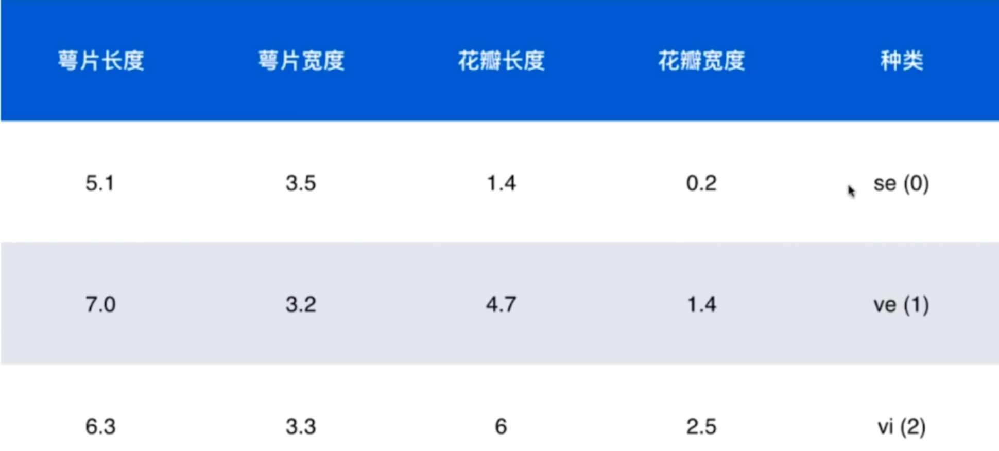

- 行代表样本，列代表特征（除了最后一行）
- 整个样本矩阵即为 $X$ ，第 i 个样本即为 $X^{(i)}$，第 i 个样本的第 j 个特征值即为 $X^{(i)}_j$
- 最后一列称为标记（label），用 $y$ 表示，第 i 个标记表示为 $y^{(i)}$
- 通常用列向量来表示一个样本，如$X^{(1)}$ $\begin{bmatrix}5.1 \\ 3.5 \\ 1.4 \\ 0.2\end{bmatrix}$，那么整个样本空间可以表示为 $\begin{bmatrix}(X^{(1)})^T \\ (X^{(2)})^T \\ (X^{(3)})^T \\...\end{bmatrix}$

该数据集有 4 个特征，应该在 4  维空间中来表示每个样本，由这些特征点组成的空间称为*特征空间*（feature space）。

为了在坐标轴上可以表示，我们取萼片长度和萼片宽度 2 个特征信息，在二维坐标平面中表示为：

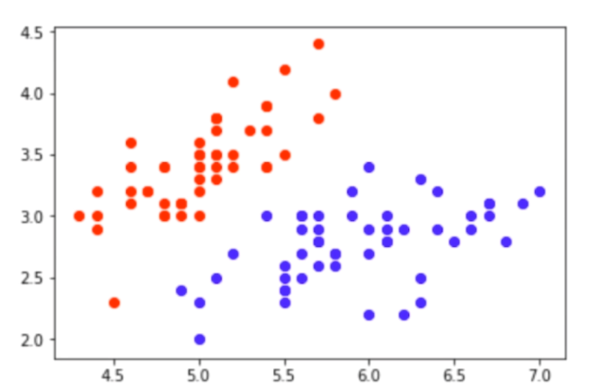

红色表示一类鸢尾花，蓝色表示另一类鸢尾花，分类任务的本质就是在特征空间切分。

对于图像来说，每个像素点都是特征，如对于数字手写字体数据集，每个数字图片由 28 * 28 个像素组成，总共有  784 个特征，每个特征为像素点的灰度值。这种特征相对鸢尾花的特征更抽象。

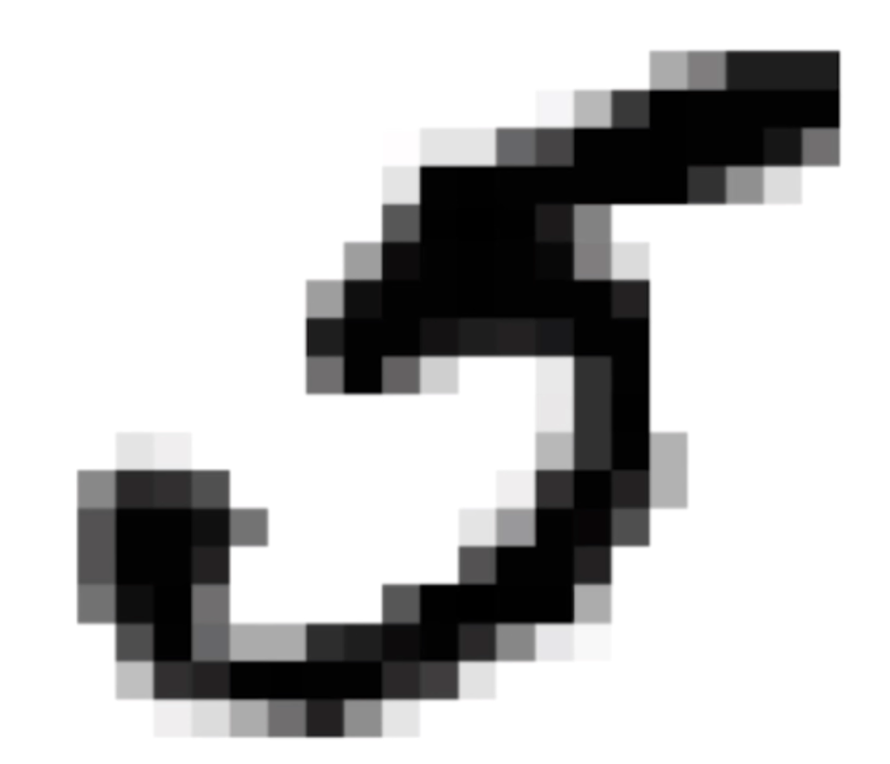

挖掘样本特征的学科为特征工程。深度学习可以理解为让机器自动识别样本特征。

## 机器学习的分类

机器学习方法分为监督学习、非监督学习、半监督学习、增强学习。

除了按以上方法分类，机器学习还可以按一下维度进行分类：

- 批量学习（离线，Batch Learning）。将准备好的数据集经过机器学习，训练得到模型，新的样例不会影响模型的改变。优点是简单，但无法适应环境的变化。批量学习可以定期更新数据集来重新训练模型，但训练数据量巨大或者环境变化太快（如股市分析）导致时，离线学习可能并不试用。

  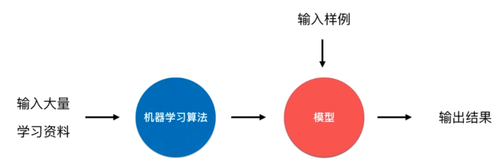

- 在线学习（Online Learning)

  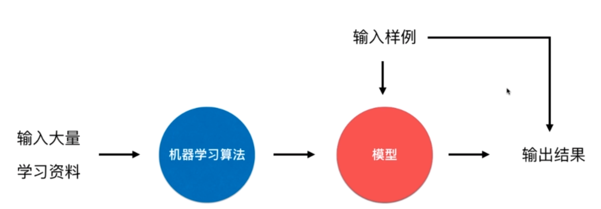

  优点是可以及时反映新的环境变化；缺点是新的数据不一定准确行可能带来不好的变化，通常需要加强对数据正确性的监控。适用于数据量巨大，无法完成批量学习的环境。

机器学习的另外一种分类方法：

- 参数学习。比如下图中，横坐标是房屋的价格，纵坐标为价格。我们假设房屋的面积和价格是线性关系：$f(x)=ax+b$。基于这个假设，机器学习的过程就是找到正确的参数 a 和 b。一旦学习到了参数，则不再使用原有的数据集。

  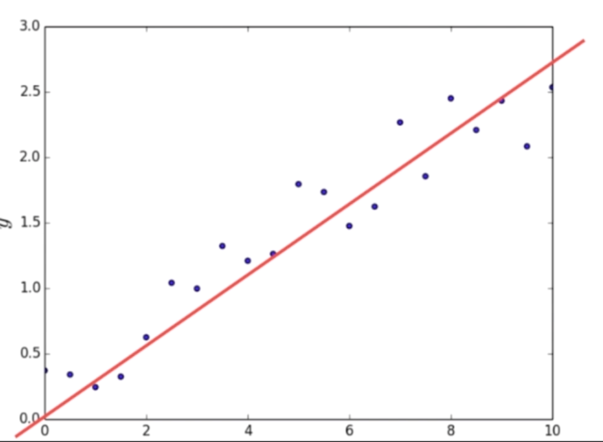

- 非参数学。不对模型进行统计模型假设，原数据集需要参与到预测。非参数不等于没参数。

### 监督学习

给机器的训练数据拥**有**“标记”或者“答案”。监督学习通常用于分类任务和回归任务。

#### 分类任务

- 二分类。比如判断是猫还是狗；判断是否是垃圾邮件；判定客户办理信用卡是否有风险；潘全病患是否是恶性肿瘤；判断股票的涨跌。

- 多分类任务。比如数字识别；图像识别；发给客户信用卡的风险评级；围棋。

  - 一些算法只支持二分类任务。
  - 多分类任务可以转化为二分类任务。

  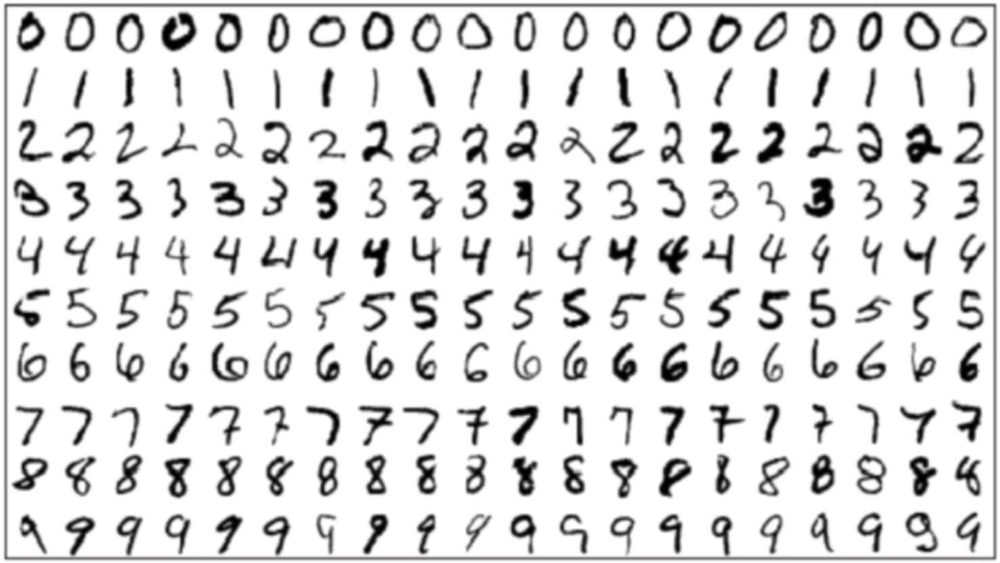

- 多标签分类。

#### 回归任务

计算结果是一个连续数字的值，而非一个类别，比如预测房屋价格，市场分析，学生成绩，股票价格。

有些回归任务可以简化为分类任务。

### 无监督学习

给机器的训练数据**没有**“标记”或者“答案”。

意义：

- 对没有标记的数据进行聚类分析（分类）。

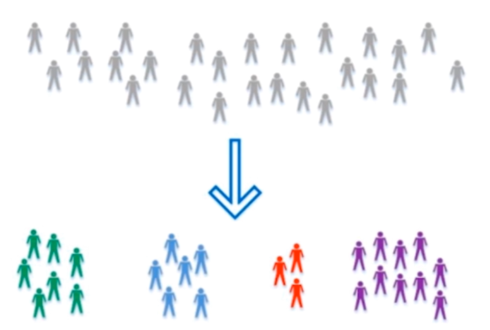

​	比如电商网站对消费者进行分类，如理智型消费者、冲动型消费者等。

- 对数据进行降维处理。

  - 特征提取。比如信用卡的信用评级和人的胖瘦无关？

  - 特征压缩。通常用 PCA 算法。在尽量少损失信息的情况下，将高位的特征向量压缩成地位的特征向量，而不影响预测的准确率。

    比如下图将二维特征降到一维：

    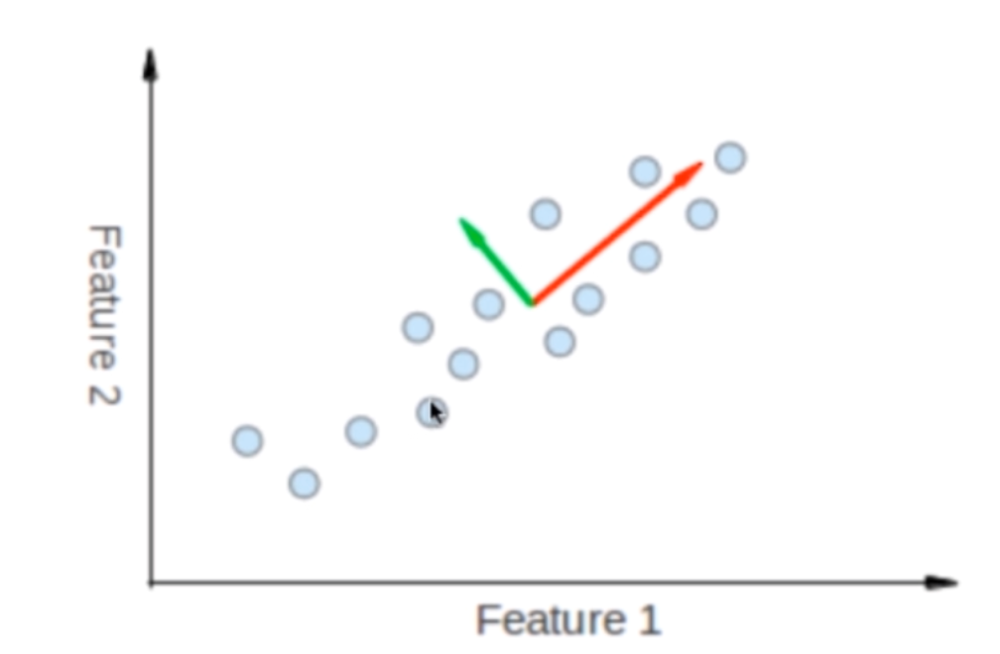

  - 方便可视化。将高位数据降到人类可以理解的维度。

    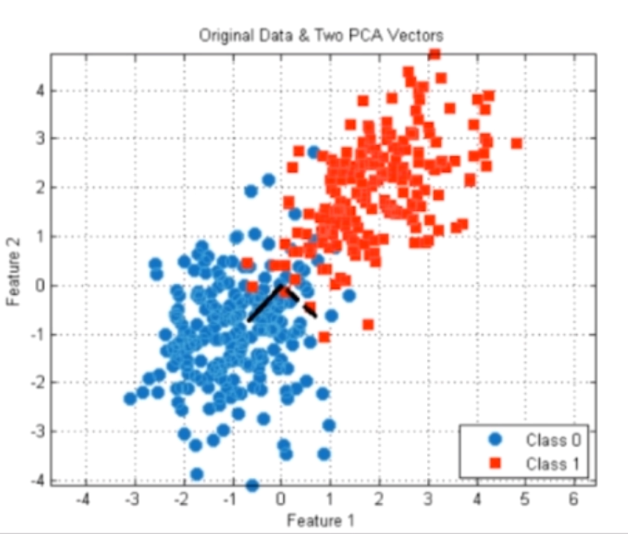

  - 异常检测。检测特征空间中不符合一般化规律的样本。

    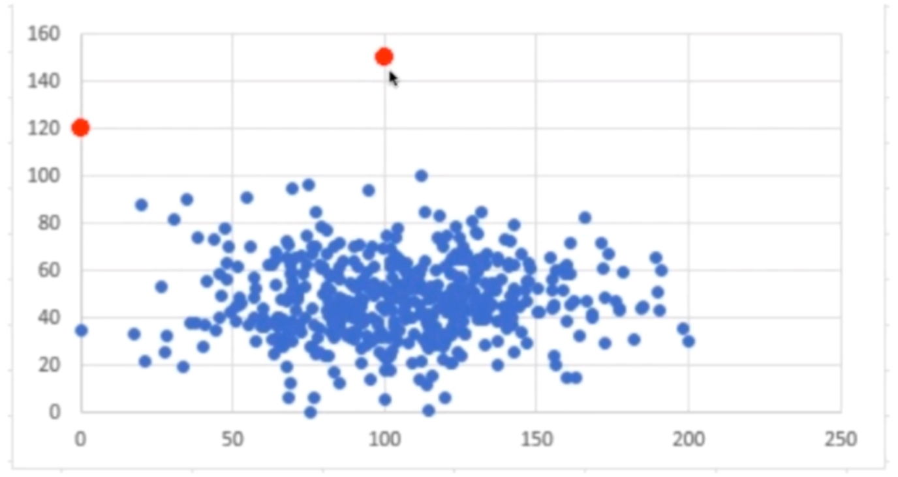

### 半监督学习

一部分数据有标记或答案，另一部分没有。

通常先使用无监督学习手段对数据做处理，之后使用监督学习手段做模型的训练和预测。

### 增强学习

根据周围的环境，采取行动，根据采取行动的结果，学习行动方式。

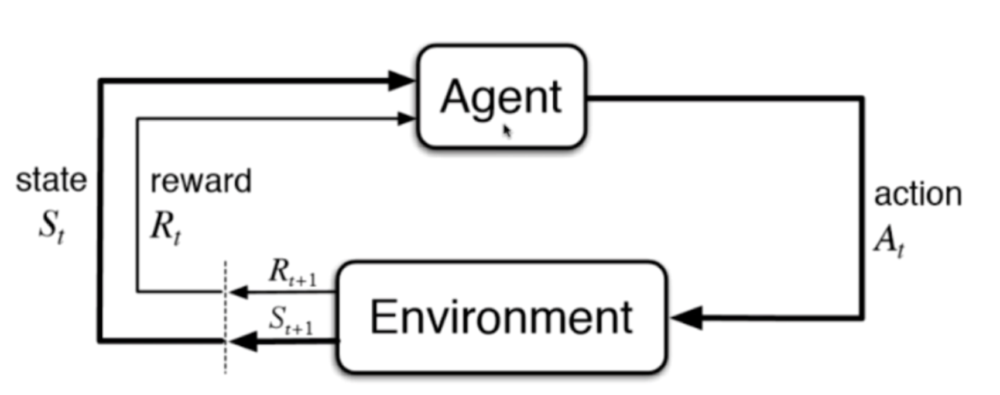

多应用于：

- 无人驾驶
- 机器人。Alph-Go。