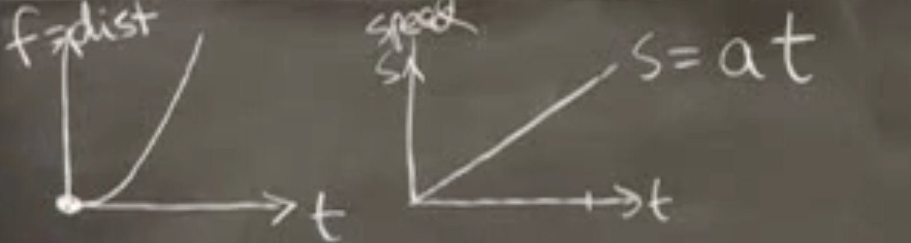
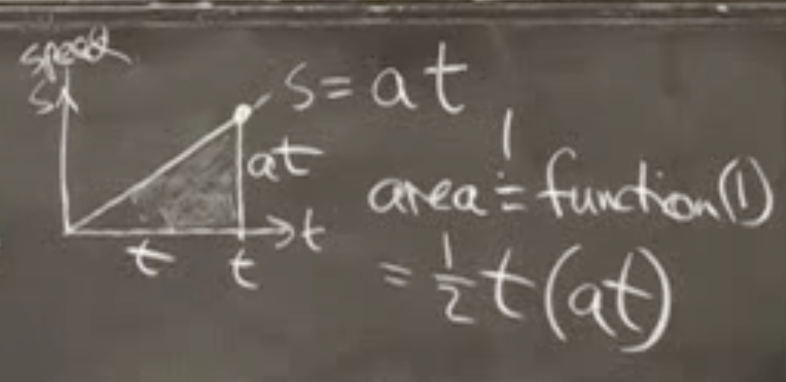
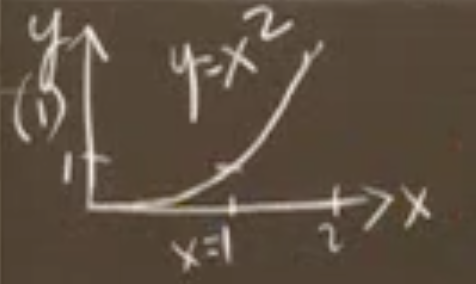
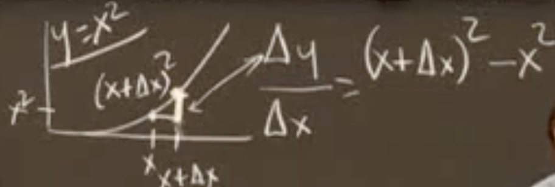
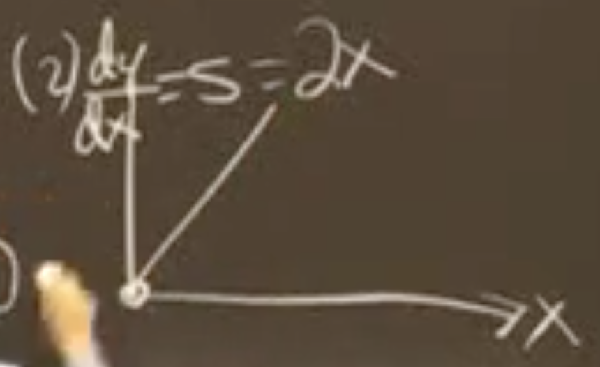
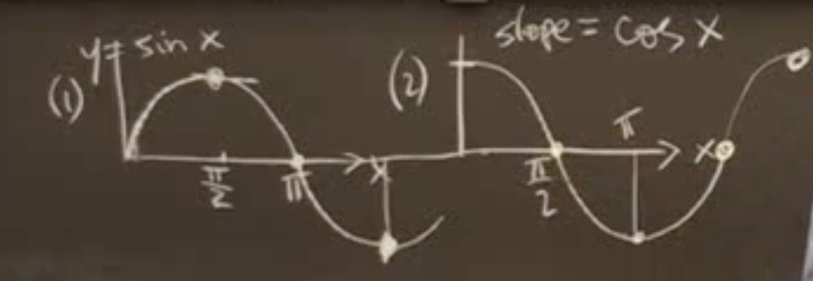

[麻省理工学院公开课：微积分重点](http://open.163.com/newview/movie/courseintro?newurl=%2Fspecial%2Fopencourse%2Fweijifen.html)

## 什么是微积分

- 第 1 个方程表示距离方程。

- 第 2 个方程为速度速度。a 为恒定加速度，速度线性增加。

  $$
  Function(2) = S = at
  $$

每一个时刻的速度只是一个瞬间，速度图像表示距离是如何**积累**起来的。所以方程 1 表示方程 2 下的面积：

$$
Function(1) = Area = \frac1 2 t(at) = \frac 1 2at^2
$$
速度是距离图像某一点的斜率 Slope（垂直距离/水平距离）。速度是距离与时间的导数（斜率）：
$$
S = \frac {\Delta f} {\Delta t} = \frac {df} {dt} = at
$$
微积分是以上两个函数之间关联的学科。

- 微分：根据方程 1（距离方程） 求得方程 2（速度方程）。微分解决的是瞬时速度问题，平均问题不需要使用微分。
- 积分：根据方程 2（速度方程） 求得方程 1（距离方程）。

## 导数

几个常用函数的导数：
$$
\begin{array}{}
y=x^n & \frac {dy}{dx} = nx^{n-1} \\ 
y=sinx & \frac {dy}{dx} = cosx \\ 
y=cos & \frac {dy}{dx} = -sinx \\ 
y=e^x & \frac {dy}{dx} = e^x \\ 
 \end{array}
$$

$y=x^n$ 的图像：

求原点的瞬时速度：

取原点右侧的一段距离 $\Delta x$，对应的距离为 $x^2 = (\Delta x)^2$，则 $\Delta x$ 内的斜率为：
$$
\frac {\Delta y} {\Delta x}  = \frac {(\Delta x)^2} {\Delta x} = \Delta x
$$
$\Delta x$ 取极限为 0。

求任意一点的瞬时速度：

取任意一点，x 增加 $\Delta x$，即 $x = x+\Delta x$ ，则对应的 $y=(x+\Delta x)^2$，则斜率为：
$$
\frac {\Delta y} {\Delta x} = \frac {(x+\Delta x)^2} {\Delta x}
= \frac {x^2 + 2x\Delta x + (\Delta x)^2 - (\Delta x)^2 } {\Delta x}
= 2x + \Delta x
$$
则导数 $\frac {dy} {dx}$ 为：
$$
\frac {dy} {dx} = \lim_{\Delta x \to 0} 2x + \Delta x = 2x
$$
对应的图像为：

$y=sinx$ 极其导数对应的图像为：

增长、下降、快、慢、极大值、极小值体现了导数的重要性和实用性。

## 工具

- [LaTeX/Mathematics - Wikibooks, open books for an open world](https://en.wikibooks.org/wiki/LaTeX/Mathematics)
- [GeoGebra](https://www.geogebra.org/)

