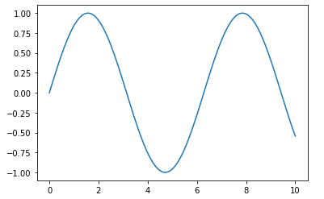
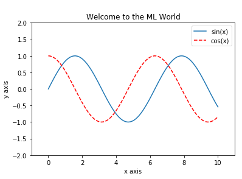
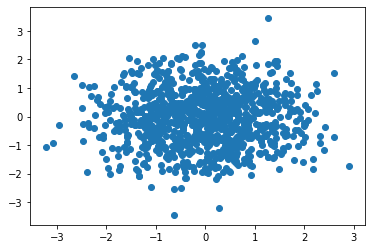
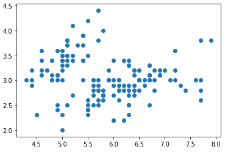
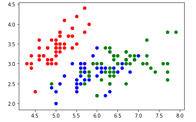

## 开发环境

-  [Anaconda](https://www.anaconda.com/distribution/)
- [PyCharm](https://www.jetbrains.com/pycharm/)

常用的库：

- [numpy](https://numpy.org/devdocs/user/quickstart.html) 矩阵处理
- matplotlib 数据可视化
- sklearn 机器学习函数
- pandas 高级数据表格管理和数学方法

### Jupyter Notebook

以下是 Notebook 中的一些魔法命令。

`%run` 运行外部脚本：

```
%run myscript/hello.py
```

导入模块：

```python
import mymodule.FirstML
from mymodule import FirstML
```

`%timeit` 测量代码行时间：

```
%timeit L = [i**2 for i in range(1000)]
```

`%%timeit` 测量代码块时间：

```
%%timeit
L = []
for n in range(1000):
    L.append(n ** 2)
```

`%time` 与 `%timeit` 用法相同，运行单词测量时间。

查看魔法命令：

```
%lsmagic
```

查看魔法命令帮助：

```
$run?
```

## Numpy

```python
import numpy as np

# 查看版本号
np.__version__
```

### 填充数据

```python
# 定义数组
nparr = np.array([i for i in range(10)])
nparr[5] # 获取元素
np.dtype # 获取数据类型

# 创建零数组，元素类型默认为 float
np.zeros(10)
np.zeros(10, dtype=int)
# 创建 3*5 的零矩阵
np.zeros((3, 5))
# 创建 3*5 的零矩阵，类型为 int 的矩阵
np.zeros(shape=(3, 5), type=int)

# 创建全 1 矩阵的用法类似
np.ones((3,5))

# 创建指定数值的矩阵
np.full(shape=(3, 5), fill_value=666);

# 类似 range 用法
np.arrange(0, 20, 0.2)

# 生成等差数列，前两个参数分别是起点和终点，第 3 个参数为元素个数。
np.linspace(0, 20, 10)
```

### 生成随机数

```python
# 随机数 - 平均分布
# 生成 [0, 10) 之间的随机数
np.random.randint(0, 10)
# 随车生成向量
np.random.randint(0, 10, size=10)
# 随车生成矩阵
np.random.randint(0, 10, size=(3, 5))
# 指定随机种子
np.random.seed(666)

# 生成 [0, 1) 之间的随机数，参数传递和 randint 类似
np.random.random()

# 生成正态分布的浮点数，均值为 0，方差为 1
np.random.normal();
# 指定均值和方差
np.random.normal(10, 100)
# 生成矩阵
np.random.normal(0, 1, (3, 5))

```

### 基本属性

```python
x=np.arange(10) # 一位数组
X=np.arange(15).reshape(3, 5) # 3*5 矩阵
x.ndim # 数组的维数
X.shape # 返回元组，返回所有的维度
x.size # 元素的个数
```

### 数据访问

```python
# 对于一维数据，切片方法和 List 类似

# 对于二维数组
X[0, 0] # 或者 X[(0, 0)] 通常省略圆括号
# 前两行，前三列
X[:2, :3] 
# 前两行，列按照步长 2 来取
X[:2, ::2] 
# 行列同时倒着取
X[::-1, ::-1] 
# 取第一行
X[0, :]
# 取第一列
X[:, 0]
```

在 Numpy 中，子矩阵默认是原矩阵的引用，修改子矩阵的元素会影响原矩阵。如果要获取独立的子矩阵，则需要调用 `copy` 函数。

```python
subX = X[:2, :3],copy()
```

### 维度转变

将一维数组转变为二维矩阵

```python
x.reshape(2, 5)

# 可以省略其中一个维度，自动计算
x.reshape(-1, 2)
```

### 合并

```python
# 一维数组的合并
x = np.array([1, 2, 3])
y = np.array([3, 2, 1])
z = np.array([4, 5, 6])

np.concatenate([x, y]) # 将三个数组合并成一个

# 二维数组的合并
A = np.array([1, 2, 3], [4, 5, 6])
np.concatenate([A, A]) # 合并为 4*3 的矩阵，默认轴为行
np.concatenate([A, A], axis=1) # 合并为 2*6 的矩阵，轴为列

# 合并向量和矩阵
A2 = np.concatenate([A, z.reshape(1, -1)])
# 在垂直方向合并
np.vstatck([A, z]) 

B = np.full((2, 2), 100)
# 在水平方向合并
np.hstatck([A, B]) #  获得 2*5 矩阵

# 堆叠向量，在行向量上堆叠 2 次，列向量堆叠 1 次
np.tile(v, (2, 1))
```

### 分割

```python
x = np.arange(10)

# 将数组切割为 3 断
x1, x2, x3 = np.split(x, [3, 7])

A = np.arange(16).reshape((4, 4))
# 基于行来切割，A1 和 A2 分别对应矩阵的上 2 行和下 2 行
A1, A2 = np.split(A, [2])

# 基于列来切割，A1 和 A2 分别对应前 2 列和后 2 列
A1, A2 = np.split(A, [2], axis=1)

# 垂直分割
upper, lower = np.split(A, [2])

# 水平分割
left, right = np.hsplit(A, [2])

# 将最后一列与前面的列分开
X, y = np.hsplit(A, [-1])
# 将 4 * 1 的矩阵变成 1 * 4 的向量
y[:, 0] # 
```

###  矩阵运算

#### Universal Functions

```python
X = np.arange(1, 16).reshape(3, 5)

# 加法
X + 1
# 加法
X - 1
# 数乘
X * 2
# 数除
X / 2
1 / X
# 整除
X // 2
# 幂运算
X ** 2
# 求余
X % 2

# 绝对值
np.abs(X)
# 正弦
np.sin(X)
# 余弦
np.cos(X)
# 正切
np.tan(X)

np.exp(X)
np.power(3, X) # 3 ** X
np.log(X)
np.log2(X)
np.log10(X)
```

#### 矩阵运算

```python
A = np.arange(4).reshape(2, 2)
B = np.full((2,2). 10)

# 加法
A + B
# 减法
A - B
# 乘法
A * B
# 矩阵标准点乘
A.dot(B)
# 除法
A / B
# 转置
A.T
```

#### 向量和矩阵运算

向量与矩阵的运算方法为向量与矩阵中的每个行向量做运算。

```python
v = np.array([1, 2])
A = np.arange(4).reshape(2, 2)

v + A # 相当于 np.vstatck([v] * A.shape[0]) + A 或者 np.tile(v, (2, 1)) + A
v * A
v.dot(A)
```

#### 矩阵的逆

```python
# 逆，A 必须为方阵
np.linalg.inv(A)

# 伪逆，A 不一定为方阵
np.linalg.pinv(A)
```

#### 聚合运算

```python
import numpy as np
l = np.random.random(100)
X = np.random.random(100).shape(20, -1)

# 一维向量的聚合运算
# 求和
np.sum(l)
# 最小值
np.min(l)
# 最大值
np.max(l)

# 矩阵的聚合运算
# 求和，axis = 0 表示维度为行，沿着行进行运算，即得到每一列数字的和；axis 表示按列压缩。
# 如果没有 axis 参数，则对整个矩阵中的数据求和
np.sum(X, axis=0)

# 所有元素的乘机
np.prod(X)
# 平均值
mp.mean(l)
# 中位数
mp.median(l)
# 百分位
# 最重要的百分位点为 [0, 25, 50, 75, 100]
mp.percentile(l, q=50) # 表示 50% 的数都小于求出的值，相当于中位数
# 方差
np.var(l)
# 标准差
np.std(l)
```

### 索引与排序

```python
x = np.random.normal(0, 1, size=100000)

# 向量操作

# 最小值索引
np.argmin(x)
# 最大值索引
np.argmax(x)

x = np.range(16)

# 打乱顺序
np.random.shuffle(x)
# 排序
# 调用 np.sort 不会改变原向量，而调用 x.sort 会修改 x 向量
np.sort(x)
# 排序的分区，3 为标定点，3 左边的所有元素小于 3，右侧数据全部大于 3
np.partition(x, 3)
# 标定分区索引
np.argpartition(x, 3)

# 矩阵操作

X = np.random.randint(10, size(4,4))
# 默认按行排序，与 axis=1 的效果相同，axis=0 表示每列排序
# 其他方法同理
np.sort(X, axis=1)
# 排序后的索引
np.argsort(x)
np.argpartition(X, 2, axis=1)
```

### Fancy Indexing

```python
x = np.arange(16)
X = x.reshape(4, -1)

# 向量
# 得到指定索引的元素
ind = [3, 5, 8]
x[ind]

# 按照指定索引得到二维矩阵
ind = np.array([[0, 2], [1, 3]])
x[ind]

# 矩阵
row = np.array([0, 1, 2])
col = np.array([0, 2, 3])
# 获得指定行和指定列对应的元素。(0,0), (1, 2), (2, 3)
X(row, col)
# 第一行，指定列对应的元素
X[0, col]
# 前 2 行，指定列对应的元素
X[:2, col]
# 通过 bool 值来指定是否需要列
col = [True, False, True, True]
X[1:3, col]

```

### 比较与过滤

```python
# 向量
# 获得 bool 数组
x < 3
2 * x = 24 - 4 * x
# 获取非 0 个数
np.sum(x <= 3)
np.count_nonzero(x<=3)
# 任意条件判断
np.any(x == 0)
# 所有条件判断
np.all(x >= 0)

# 矩阵
X < 6
np.sum(X % 2 == 0)
# 每一行有多少偶数
np.sum(X % 2 ==0, axis = 1)
np.all(X > 0, axis = 1)
# 条件组合，需要使用位运算符
np.sum((x > 3) & (x < 10))
np.sum((x % 3) | (x > 10))
np.sum(~(x==0))
# 得到 <5 的子集
x[x < 5]
# 最后一列可以被 3 整除的所有行
X[X[:, 3] % 3 == 0, :]
```

## Matplotlib

### 折线图

```python
import matplotlib as mpl
import matplotlib.pyplot as plt
import numpy as np

x = np.linspace(0, 10, 100)
y = np.sin(x)

# 绘制正弦曲线
plt.plot(x, y)
plt.show()
```



```python
cosy = np.cos(x)
siny = y.copy()

# 同时绘制 2 条线
plt.plot(x, siny, label="sin(x)")
# color 指定颜色，linestyle 指定线的样式
plt.plot(x, cosy, color="red", linestyle="--", label="cos(x)")
# 指定 x 的范围
plt.xlim(-5, 15)
plt.ylim(0, 1.5)
# 同时指定 x 和 y 轴的范围
plt.axis([-1, 11, -2, 2])
plt.xlabel("x axis")
plt.ylabel("y axis")
# 添加图示
plt.legend()
plt.title("Welcome to the ML World")
plt.show()
```



### 散点图

通常用语显示二维特征。

```python
plt.scatter(x, siny)
plt.scatter(x, cosy, color="red")

x = np.random.normal(0, 1, 1000)
y = np.random.normal(0, 1, 100)
# alpha 设置透明度
plt.scatter(x, y, alpha=0.5)
plt.show()
```



## Sklearn

```python
from sklearn import datasets

# 加载数据集
iris = datasets.load_iris()
# 数据集的关键数据
iris.keys()

X = iris.data[:, :2]
# 绘制第 0 列和第 1 列
plt.scatter(X[:, 0], X[:, 1])
```



```python
y = iris.target
# color 指定颜色，marker 指定点的样式
plt.scatter(X[y==0, 0], X[y==0, 1], color="red", marker="0")
plt.scatter(X[y==1, 0], X[y==1, 1], color="blue", marker="+")
plt.scatter(X[y==2, 0], X[2==1, 1], color="green", marker="x")

plt.show()
```




## 工具

- [LaTeX/Mathematics - Wikibooks, open books for an open world](https://en.wikibooks.org/wiki/LaTeX/Mathematics)

