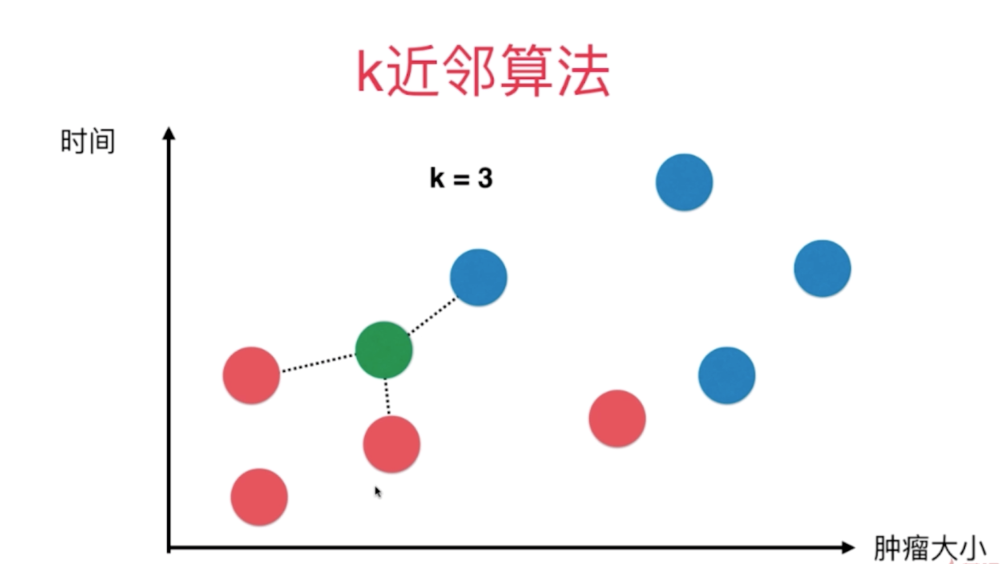
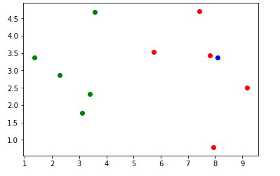
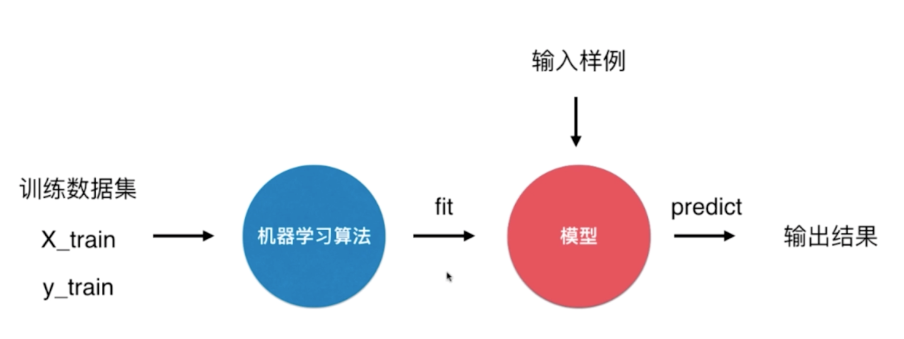
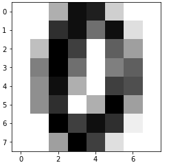
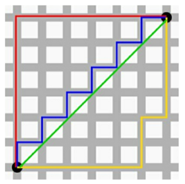
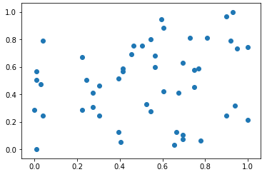
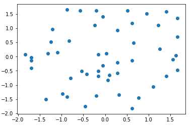
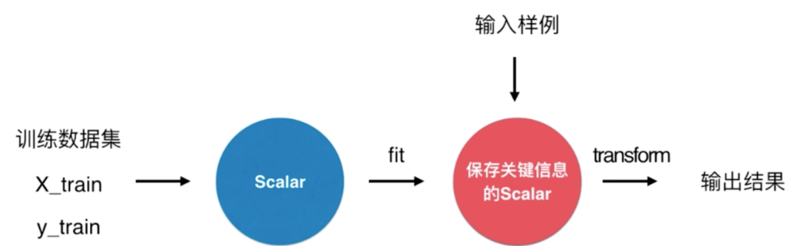

[Python3入门机器学习_经典算法与应用](https://coding.imooc.com/class/169.html#Anchor)

# kNN k-近邻算法

kNN 是 k-Nearest Neighbors 的简称。

给定一个待分类的数据，通过计算接近自己最近的K个样本来判断这个待分类数据属于哪个分类。

**特点：**

- 思想极其简单。
- 应用数学知识少，算法不需要训练模型或者认为训练数据本身就是训练模型。
- 效果好。
- 解决多分类问题。
- 解决回归问题。比如去最近的点的平均值或者加权平均值。参考 [KNeighborsRegressor](https://scikit-learn.org/stable/modules/generated/sklearn.neighbors.KNeighborsRegressor.html)。

**缺点：**

- 效率低。对于 m(样本数)*n(特征)，预测每一个新的数据的时间复杂度为 O(m\*n) 。可以通过树结构来更快求出 k 近邻，比如 KD-Tree，Ball-Tree。
- 高度数据相关。对 Outlier 比较敏感，比如对于 k=3 近邻中，如果有两个错误样本，则结果可能有很大的问题。
- 预测结果不具有可解释性。
- 维数灾难。“看似近邻”的两个点之间的距离越来越大。比如 0 - 1 的距离，对于一维来说为 1， 二维为 1.414，... 64 维为 8，10000 维的数据为 100。可能通过一些降为方法来解决这个缺点。

比如有以下数据集，根据时间和肿瘤大小两个特征来预测样本肿瘤是恶性还是良性。其中红色为良性，蓝色为恶性，绿色为样本。



K = 3 表示取离样本数据最近的三个点。

## 实现 kNN 算法

我们假设数据集为：

```python
# 样本数据，时间和肿瘤大小
raw_data_X = [[3.393533211, 2.331273381],
              [3.110073483, 1.781539638],
              [1.343808831, 3.368360954],
              [3.582294042, 4.679179110],
              [2.280362439, 2.866990263],
              [7.423436942, 4.696522875],
              [5.745051997, 3.533989803],
              [9.172168622, 2.511101045],
              [7.792783481, 3.424088941],
              [7.939820817, 0.791637231]
             ]
# 样本类别，0 良性，1 恶性
raw_data_y = [0, 0, 0, 0, 0, 1, 1, 1, 1, 1]

X_train = np.array(raw_data_X)
y_train = np.array(raw_data_y)
```

```python
# 样本
x = np.array([8.093607318, 3.365731514])

# 散点图绘制
plt.scatter(X_train[y_train==0,0], X_train[y_train==0,1], color='g')
plt.scatter(X_train[y_train==1,0], X_train[y_train==1,1], color='r')
plt.scatter(x[0], x[1], color='b')
plt.show()

```



**欧式距离：**

对于平面内的两个点 a $(x^{(a)}, y^{(a)})$ 和 b $(x^{(b)}, y^{(b)})$ 之间的距离

$$
\sqrt{(x^{(a)}-x^{(b)})^2+(y^{(a)}-y^{(b)})^2}
$$

对于三维空间的2个点  a $(x^{(a)}, y^{(a)}, z^{(a)})$ 和 b $(x^{(b)}, y^{(b)}, z^{(b)})$ 之间的距离为：
$$
\sqrt{(x^{(a)}-x^{(b)})^2+(y^{(a)}-y^{(b)})^2+(z^{(a)}-z^{(b)})^2}
$$
那么对于 N 维空间的中的 2 个点 a $(X_1^{(a)}, X_2^{(a)},\dots, X_n^{(a))})$ 和 a $(X_1^{(b)}, X_2^{(b)},\dots, X_n^{(b))})$ 之间的距离为：
$$
\sqrt{(X_1^{(a)}-X_1^{(b)})^2+(X_2^{(a)}-X_3^{(b)})^2+\dots+(X_n^{(a)}-X_n^{(b)})^2}
$$
换种简洁的表示方式：
$$
\sqrt{\sum_{i=1}^{n}(X_i^{(a)}-X_i^{(b)})^2}
$$


```python
from collections import Counter

# 计算样本与样本空间中的每个点的距离
distances = [sqrt(np.sum((x_train - x)**2)) for x_train in X_train]
# 排序
nearest = np.argsort(distances)
# K 值
k=6
# 距离最近的 K 个点的目标值
topK_y = [y_train[neighbor] for neighbor in nearest[:k]]
# 统计 K 个目标值的个数
votes = Counter(topK_y)
# 取出票数最多的元素
most_vote = votes.most_common(1)
# 取出类别
predict_y = most_vote[0][0]
```

封装为函数：

```python
import numpy as np
from math import sqrt
from collections import Counter


def kNN_classify(k, X_train, y_train, x):

    assert 1 <= k <= X_train.shape[0], "k must be valid"
    assert X_train.shape[0] == y_train.shape[0], \
        "the size of X_train must equal to the size of y_train"
    assert X_train.shape[1] == x.shape[0], \
        "the feature number of x must be equal to X_train"

    distances = [sqrt(np.sum((x_train - x)**2)) for x_train in X_train]
    nearest = np.argsort(distances)

    topK_y = [y_train[i] for i in nearest[:k]]
    votes = Counter(topK_y)

    return votes.most_common(1)[0][0]
```

## 机器学习过程



## sklearn 的 kNN 算法

使用 Scikit-learn 封装的 kNN 算法：

```python
from sklearn.neighbors import KNeighborsClassifier

# 初始化 k
kNN_classifier = KNeighborsClassifier(n_neighbors=6)
# 训练 fit，拟合训练数据集
kNN_classifier.fit(X_train, y_train)
# 预测 predict
kNN_classifier.predict(x.reshape(1, -1))
```

将我们自己实现的方法封装成 sklearn 的算法形式：[KNNClassifier](https://github.com/liuyubobobo/Play-with-Machine-Learning-Algorithms/blob/97f7742fd1f8f19059eaedf5be01f4d31fce3942/04-kNN/02-kNN-in-scikit-learn/kNN/kNN.py)

## 算法性能

如果训练模型直接在真实环境中使用可能带来的问题：

- 模型如果很差，可能造成真实损失。
- 真实环境中难以拿到真实的 label。

我们可以把整个数据集分为训练数据和测试数据，用测试数据来测试模型。通过测试数据以及预测结果来判断模型的好坏，在投入真实环境之前进行调优。这种方法称为 train test split。

算法性能的一个重要标志是预测准确度。下面是通过鸢尾花的例子来实现训练数据和测试数据分离，并且测试预测准确率。

```python
import numpy as np
import matplotlib.pyplot as plt
from sklearn import datasets

# 加载数据集
iris = datasets.load_iris()
X = iris.data
y = iris.target

# 分离出一部分数据做训练，另外一部分数据做测试。

# 随机排列索引
shuffled_indexes = np.random.permutation(len(X))
# 测试比例
test_ratio = 0.2
test_size = int(len(X) * test_ratio)
# 前面 test_size 个作为测试数据集
test_indexes = shuffled_indexes[:test_size]
# 剩下的是训练数据集
train_indexes = shuffled_indexes[test_size:]

# 使用 fancy indexing 获取训练数据集
X_train = X[train_indexes]
y_train = y[train_indexes]
# 获取测试数据集
X_test = X[test_indexes]
y_test = y[test_indexes]
```

封装成函数 [train_test_split](https://github.com/liuyubobobo/Play-with-Machine-Learning-Algorithms/blob/97f7742fd1f8f19059eaedf5be01f4d31fce3942/04-kNN/03-Test-Our-Algorithm/playML/model_selection.py)

使用测试数据集进行测试：

```python
from sklearn.neighbors import KNeighborsClassifier

# n_neighbors 默认为 5
kNN_classifier = KNeighborsClassifier(n_neighbors=6)
# 使用训练数据训练
kNN_classifier.fit(X_train, y_train)
# 预测测试数据
y_predict = kNN_classifier.predict(x_test)
# 预测准确率
sum(y_predict == y_test)/len(y_test)
```

Sklearn 为我们提供了分离训练数据和测试数据以及计算准确度的方法：

```python
from sklearn.model_selection import train_test_split

# test_size 为测试数据的比例，默认为 0.2
# random_state 随机种子
X_train, X_test, y_train, y_test = train_test_split(X, y, test_size=0.2, random_state=666)

# 计算准确率
y_predict = kNN_classifier.predict(x_test)
accuracy = accuracy_score(y_test, y_predict)
# 或者
accuracy = kNN_classifier.score(X_test, y_test)
```

## 超参数 Hyper Parameter

超参数：在算法运行前需要决定的参数。

模型参数：算法过程中学习的参数。

kNN 算法没有模型参数，k 是超参数。


如何寻找好的超参数：

- 领域知识。根据领域专业知识来决定超参数。
- 经验数值。sklearn 的 kNN 算法的 k 默认为 5。
- 实验搜索。通过实验来选择超参数。


下面通过手写字体数据集为例来计算最佳的 k 值。

```python
import numpy as np
import matplotlib.pyplot as plt
from sklearn import datasets

import matplotlib
import matplotlib.pyplot as plt

# 加载手写数字数据集
digits = datasets.load_digits()

X = digits.data
y = digits.target
```

```python
# 绘制一个数据样本
some_digit = X[666]
# 转换成 8*8 矩阵
some_digit_image = some_digit.reshape(8, 8)
plt.imshow(some_digit_image, cmap = matplotlib.cm.binary)
plt.show()
```



```python
# 分离训练数据和测试数据
from sklearn.model_selection import train_test_split

X_train, X_test, y_train, y_test = train_test_split(X, y, test_size=0.2, random_state=666)
```

```python
from sklearn.neighbors import KNeighborsClassifier

# 搜索最好的 k 值
best_score = 0.0
best_k = -1
# 比较 [1, 11] 范围内的 k 值
# 如果 k 的最佳值接近 11，则需要扩展搜索范围，比如再次搜索 [8, 20]。因为最佳值通常有一个连续的变化过程。
for k in range(1, 11):
    knn_clf = KNeighborsClassifier(n_neighbors=k)
    knn_clf.fit(X_train, y_train)
    score = knn_clf.score(X_test, y_test)
    if score > best_score:
        best_k = k
        best_score = score
        
print("best_k =", best_k)
print("best_score =", best_score)
```

kNN 算法中的超参数除了 k，还有一个超参数：距离的权重 `weights`。我们上面的例子中使用了 weights 的默认参数 `uniform`，weights 还有一个常量值 `distance`，即用距离作为权重。我们可以遍历这两种方法来确定是否使用距离权重。

```python
best_score = 0.0
best_k = -1
best_method = ""
for method in ["uniform", "distance"]:
    for k in range(1, 11):
        knn_clf = KNeighborsClassifier(n_neighbors=k, weights=method)
        knn_clf.fit(X_train, y_train)
        score = knn_clf.score(X_test, y_test)
        if score > best_score:
            best_k = k
            best_score = score
            best_method = method
        
print("best_method =", best_method)
print("best_k =", best_k)
print("best_score =", best_score)
```

输出结果：

```python
best_method = uniform
best_k = 4
best_score = 0.991666666667
```

说明不适用距离权重的准确率更高。

## 明科夫斯基距离

假设我们上面的结果是当 `weight = distance` 的时候的准确率更高，那么我们还有一个超参数 `p`，即如何度量样本之间的距离。`p` 的默认值为 2，即欧式距离。
$$
\sqrt{\sum_{i=1}^{n}(X_i^{(a)}-X_i^{(b)})^2}
$$
当  `p=1` 时，表示曼哈顿距离：两点在南北方向上的距离加上在东西方向上的距离，即d(i,j)=|xi-xj|+|yi-yj|。对于一个具有正南正北、正东正西方向规则布局的城镇街道，从一点到达另一点的距离正是在南北方向上旅行的距离加上在东西方向上旅行的距离，因此，曼哈顿距离又称为出租车距离。



途中红色、蓝色、黄色均为哈曼顿距离 Manhattan Distance，绿色为欧式距离 Euclidean Distance。

曼哈顿距离用公式表示：
$$
{\sum_{i=1}^{n}|X_i^{(a)}-X_i^{(b)}|}
$$
把哈曼顿距离和欧式距离公式统一格式：
$$
{\sum_{i=1}^{n}(|X_i^{(a)}-X_i^{(b)}|}^{\frac 11})^{\frac 11}\\
({\sum_{i=1}^{n}|X_i^{(a)}-X_i^{(b)}|^2})^{\frac 12}
$$
由此，明科夫斯基提出更一般的距离描述公式：
$$
({\sum_{i=1}^{n}|X_i^{(a)}-X_i^{(b)}|^p})^{\frac 1p}
$$
即明科夫斯基距离 Minkowski Distance。具体查看 [KNeighborsClassifier](https://scikit-learn.org/stable/modules/generated/sklearn.neighbors.KNeighborsClassifier.html) 。

除了明科夫斯基距离，还有以下距离度量方法：

- 向量空间余弦相似度 Cosine Similarity
- 调整余弦相似度 Ajusted Cosine Similarity
- 皮尔森相关系数 Pearson Correlation Coefficient
- Jaccard 相似系数 Jaccard Coefficient

由 [KNeighborsClassifier](https://scikit-learn.org/stable/modules/generated/sklearn.neighbors.KNeighborsClassifier.html) 的 `matrix`定义，默认值为 `minkowski`，可以参考 [DistanceMetric ](https://scikit-learn.org/stable/modules/generated/sklearn.neighbors.DistanceMetric.html)。

我们遍历 `p = 1...6` 来确定 p 的最佳值：

```python
best_score = 0.0
best_k = -1
best_p = -1

for k in range(1, 11):
    for p in range(1, 6):
        knn_clf = KNeighborsClassifier(n_neighbors=k, weights="distance", p=p)
        knn_clf.fit(X_train, y_train)
        score = knn_clf.score(X_test, y_test)
        if score > best_score:
            best_k = k
            best_p = p
            best_score = score
        
print("best_k =", best_k)
print("best_p =", best_p)
print("best_score =", best_score)
```

结果：

```python
est_k = 3
best_p = 2
best_score = 0.988888888889
```

对于 k 和 p 的循环搜索，属于网格搜索。在 sklearn 中提供了更专业的实现，并且能够处理 k, p, weights 之间的依赖关系，即当 weights = 'distance' 的时候才需要搜索 p。

## 网格搜索

```python
# 定义网格搜索范围
param_grid = [
    {
        'weights': ['uniform'], # weight=uniform 时，只搜索 n_neighbors
        'n_neighbors': [i for i in range(1, 11)]
    },
    {
        'weights': ['distance'], # weight=uniform 时，搜索 n_neighbors 和 p
        'n_neighbors': [i for i in range(1, 11)], 
        'p': [i for i in range(1, 6)]
    }
]
```

```python
from sklearn.model_selection import GridSearchCV

# 执行网格搜索

knn_clf = KNeighborsClassifier()
# 使用 CV 方式进行网格搜索
# CV = Cross Validation，相对比 train_test_validata 的方式更佳准确
rid_search = GridSearchCV(knn_clf, param_grid)

%%time
grid_search.fit(X_train, y_train)

# 最佳分类器
rid_search.best_estimator_
# 最佳准确度
grid_search.best_score_
# 最佳参数
grid_search.best_params_
```

对于非用户传入的参数，而是由类计算出的结果后缀 `_` 来表示。

定义 `GridSearchCV` 时，还可以定义以下参数：

```python
%%time
# n_jobs 内核数据，-1 表示使用所有的核；verbose 输出信息等级
grid_search = GridSearchCV(knn_clf, param_grid, n_jobs=-1, verbose=2)
grid_search.fit(X_train, y_train)
```

## 数据归一化

以下肿瘤大小和发现天数为特征的样本数据：

|        | 肿瘤大小（cm） | 发现天数（天） |
| ------ | -------------- | -------------- |
| 样本 1 | 1              | 200            |
| 样本 2 | 5              | 100            |

在计算样本距离（比如欧式距离）的时候，发现天数的值远大于肿瘤大小，肿瘤大小的值几乎可以被忽略；而如果发现天数的时间如果改为年，则发现时间又几乎可以汇率不计。

为了同时反映样本中每一个特征的重要程度，我们需要将数据进行归一化处理，即将所有的数据映射到同一尺度。

我们有以下几种常用的归一方法：

- 最值归一化
- 均值方差归一化

### 最值归一化 Normalization

最简单的归一化方法为最值归一化，即把所有的数据映射到 0-1 之间：

$$
x_{scale} = \frac {x - x_{min}}{x_{max}-x_{min}}
$$

最值归一化适用于分布有明显边界的情况，比如考试分数（0-100），图像像素点（0-255）；受 outlier 影响较大，比如收入，一旦有极端值，则容易形成有偏的数据。

```python
import numpy as np
import matplotlib.pyplot as plt

# 随机生成 50*2 的矩阵
X = np.random.randint(0, 100, (50, 2))

# 将 X 的元素类型转化为 float
X = np.array(X, dtype=float)

# 最值归一化
# 将第 1 列和第 2 列进行最值归一化
X[:,0] = (X[:,0] - np.min(X[:,0])) / (np.max(X[:,0]) - np.min(X[:,0]))
X[:,1] = (X[:,1] - np.min(X[:,1])) / (np.max(X[:,1]) - np.min(X[:,1]))
```



### 均值方差归一化 Standardization

把所有数据归一到均值为 0 ，方差为 1 的分布中。适用性比最值归一化更好，可以规避最值归一化的缺点。
$$
x_{scale}=\frac {x-x_{mean}} {x_{std}}
$$

```python
X2 = np.random.randint(0, 100, (50, 2))
X2 = np.array(X2, dtype=float)

# 第 1 列和第 2 列的均值方差归一化
X2[:,0] = (X2[:,0] - np.mean(X2[:,0])) / np.std(X2[:,0])
X2[:,1] = (X2[:,1] - np.mean(X2[:,1])) / np.std(X2[:,1])
```



### 测试数据归一化

训练数据和测试数据分离后，我们通过计算训练数据集的均值 `mean_train` 和方差 `std_train`来归一化训练数据，但对于测试数据的归一化方法不能简单通过训练数据集的均值和方差来归一。正确的方式是：
$$
x_{test\_scale} = \frac {x_{test} - x_{mean\_train}} {x_{std\_train}}
$$
即训练数据的归一化结果需要通过训练的均值和方差来求解。

这样做的原因为：

- 真实环境很有可能无法得到所有测试数据的均值和方差。比如我只需要预测一个样本数据，单个样本数据的均值和方差没有意义。
- 对数据的归一化也是算法的一部分。即应该把测试数据和训练数据按照统一的均值和方差来归一化。

所以我们在算法中，应该保存训练数据的均值和方差。我们可以通过 sklearn 中的 Scalar 来实现：



```python
import numpy as np
from sklearn import datasets
from sklearn.model_selection import train_test_split
from sklearn.preprocessing import StandardScaler
from sklearn.neighbors import KNeighborsClassifier

# 加载鸢尾花数据集
iris = datasets.load_iris()
X = iris.data
y = iris.target

# 分离训练数据和测试数据
X_train, X_test, y_train, y_test = train_test_split(iris.data, iris.target, test_size=0.2, random_state=666)

# 初始化 Scaler
standardScalar = StandardScaler()
# fit 数据
standardScalar.fit(X_train)
# 均值
standardScalar.mean_
# 描述数据的分布范围，在这里是方差
standardScalar.scale_

# 归一化训练数据
X_train_standard = standardScalar.transform(X_train)
# 归一化测试数据
X_test_standard = standardScalar.transform(X_test)

# kNN 算法
knn_clf = KNeighborsClassifier(n_neighbors=3)
knn_clf.fit(X_train, y_train)
# 分类准确度
knn_clf.score(X_test_standard, y_test)
```

StandardScaler 的手动实现可以参考 [StandardScaler](https://github.com/liuyubobobo/Play-with-Machine-Learning-Algorithms/blob/97f7742fd1f8f19059eaedf5be01f4d31fce3942/04-kNN/08-Scaler-in-Scikit-Learn/playML/preprocessing.py)。

## 工具

- [LaTeX/Mathematics - Wikibooks, open books for an open world](https://en.wikibooks.org/wiki/LaTeX/Mathematics)
- https://github.com/liuyubobobo/Play-with-Machine-Learning-Algorithms

