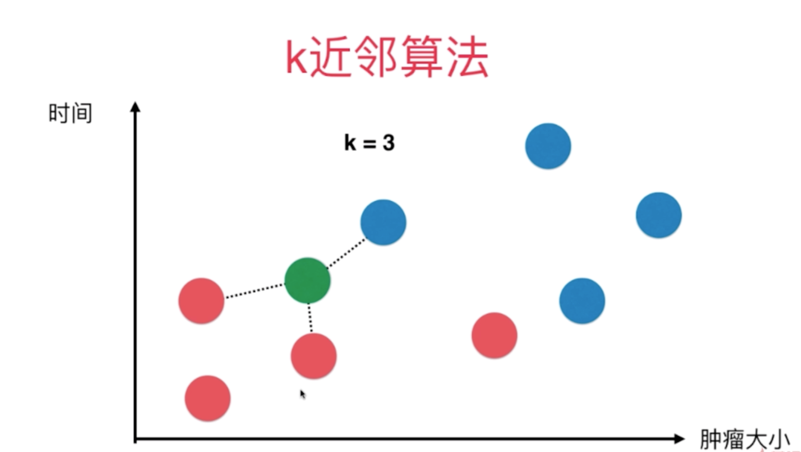
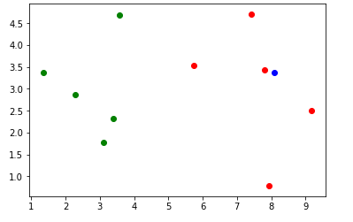

# kNN k-近邻算法

kNN 是 k-Nearest Neighbors 的简称。

给定一个待分类的数据，通过计算接近自己最近的K个样本来判断这个待分类数据属于哪个分类。

**特点：**

- 思想极其简单
- 应用数学知识少
- 效果好

距离计算通常使用欧拉距离：
$$

$$
比如有以下数据集，根据时间和肿瘤大小两个特征来预测样本肿瘤是恶性还是良性。其中红色为良性，蓝色为恶性，绿色为样本。



K = 3 表示取离样本数据最近的三个点。

我们假设数据集为：

```python
# 样本数据，时间和肿瘤大小
raw_data_X = [[3.393533211, 2.331273381],
              [3.110073483, 1.781539638],
              [1.343808831, 3.368360954],
              [3.582294042, 4.679179110],
              [2.280362439, 2.866990263],
              [7.423436942, 4.696522875],
              [5.745051997, 3.533989803],
              [9.172168622, 2.511101045],
              [7.792783481, 3.424088941],
              [7.939820817, 0.791637231]
             ]
# 样本类别，0 良性，1 恶性
raw_data_y = [0, 0, 0, 0, 0, 1, 1, 1, 1, 1]

X_train = np.array(raw_data_X)
y_train = np.array(raw_data_y)
```

```python
# 样本
x = np.array([8.093607318, 3.365731514])

# 散点图绘制
plt.scatter(X_train[y_train==0,0], X_train[y_train==0,1], color='g')
plt.scatter(X_train[y_train==1,0], X_train[y_train==1,1], color='r')
plt.scatter(x[0], x[1], color='b')
plt.show()

```



**欧拉距离：**

对于平面内的两个点 a $(x^{(a)}, y^{(a)})$ 和 b $(x^{(b)}, y^{(b)})$ 之间的距离

$$
\sqrt{(x^{(a)}-x^{(b)})^2+(y^{(a)}-y^{(b)})^2}
$$

对于三维空间的2个点  a $(x^{(a)}, y^{(a)}, z^{(a)})$ 和 b $(x^{(b)}, y^{(b)}, z^{(b)})$ 之间的距离为：
$$
\sqrt{(x^{(a)}-x^{(b)})^2+(y^{(a)}-y^{(b)})^2+(z^{(a)}-z^{(b)})^2}
$$
那么对于 N 维空间的中的 2 个点 a $(X_1^{(a)}, X_2^{(a)},\dots, X_n^{(a))})$ 和 a $(X_1^{(b)}, X_2^{(b)},\dots, X_n^{(b))})$ 之间的距离为：
$$
\sqrt{(X_1^{(a)}-X_1^{(b)})^2+(X_2^{(a)}-X_3^{(b)})^2+\dots+(X_n^{(a)}-X_n^{(b)})^2}
$$
换种简洁的表示方式：
$$
\sqrt{\sum_{i=1}^{n}(X_i^{(a)}-X_i^{(b)})^2}
$$


```python
from collections import Counter

# 计算样本与样本空间中的每个点的距离
distances = [sqrt(np.sum((x_train - x)**2)) for x_train in X_train]
# 排序
nearest = np.argsort(distances)
# K 值
k=6
# 距离最近的 K 个点的目标值
topK_y = [y_train[neighbor] for neighbor in nearest[:k]]
# 统计 K 个目标值的个数
votes = Counter(topK_y)
# 取出票数最多的元素
most_vote = votes.most_common(1)
# 取出类别
predict_y = most_vote[0][0]
```

## 线性回归

## 多项式回归

## 逻辑回归

## 模型正则化

## PCA

## SVM

## 决策树

## 随机森林

## 集成学习

## 模型选择

## 模型调整

## 工具

- [LaTeX/Mathematics - Wikibooks, open books for an open world](https://en.wikibooks.org/wiki/LaTeX/Mathematics)
- https://github.com/liuyubobobo/Play-with-Machine-Learning-Algorithms

