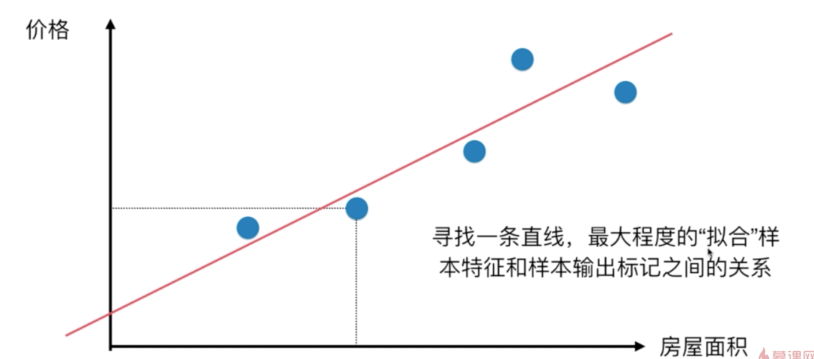
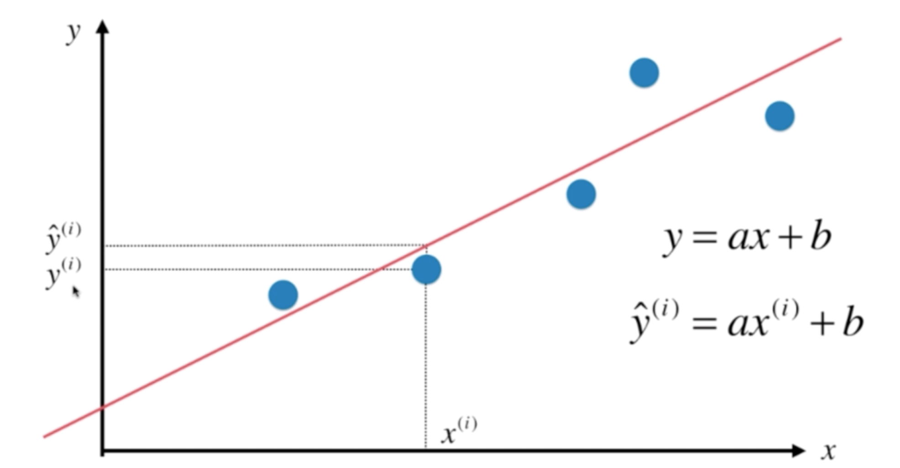

[Python3入门机器学习_经典算法与应用](https://coding.imooc.com/class/169.html#Anchor)

## 概述

以下坐标系中，横轴为样本特征房屋面积，纵轴为样本标记房屋价格，房屋面积与房屋价格之间呈一定的线性关系。线性回归就是寻找一条直接，最大程度的“拟合”样本特征与样本输出标记之间的关系。

线性回归坐标系与 kNN 算法不同的是， 纵轴为样本标记，而kNN中横纵坐标均为样本特征。

当样本特诊只有一个时，我们称为*简单线性回归*。

**优点：**

- 解决回归问题
- 思想简单，实现容易
- 许多强大的非线性模型的基础
- 结果具有很好的可解释性
- 蕴含机器学习中很多重要思想

**缺点：**

## 简单线性回归

假设找到的最佳拟合方程为：$y=ax + b$

对于每一个样本点 $x^{(i)}$，根据直接方程，计算预测值为：$\hat y^{(i)}=ax^{(i)}+b$，对应的真值为 $y^{(i)}$。

$y^{(i)}$ 与 $\dot y^{(i)}$ 的差距为：$(y^{(i)}-\hat y^{(i)})^2$，其实可以用绝对值来表示差距，但因为绝对值并非处处可导，所以优先使用平方来表示距离。所有样本的距离为：
$$
\sum_{i=1}^m(y^{(i)}-\hat y^{(i)})^2
$$
我们的目标是让差距  $(y^{(i)}-ax^{(i)}+b)^2$ 尽可能小，我们成该函数为损失函数（loss function， 度量模型没有拟合样本的损失部分）或者效用函数（utility function，度量拟合的程度），统称为目标函数。

机器学习算法 思路：通过分析问题，确定目标函数，通过最优化目标函数来获取机器学习的模型。

## 工具

- [LaTeX/Mathematics - Wikibooks, open books for an open world](https://en.wikibooks.org/wiki/LaTeX/Mathematics)
- https://github.com/liuyubobobo/Play-with-Machine-Learning-Algorithms

