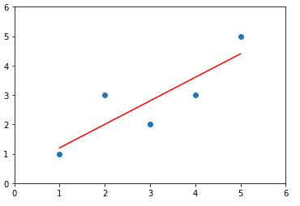
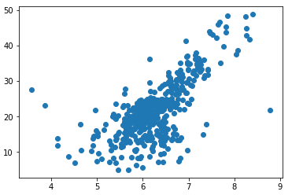
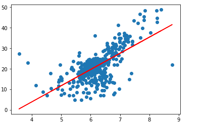
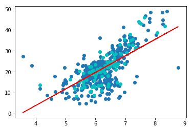

[Python3入门机器学习_经典算法与应用](https://coding.imooc.com/class/169.html#Anchor)

## 概述

以下坐标系中，横轴为样本特征房屋面积，纵轴为样本标记房屋价格，房屋面积与房屋价格之间呈一定的线性关系。线性回归就是寻找一条直接，最大程度的“拟合”样本特征与样本输出标记之间的关系。


线性回归坐标系与 kNN 算法不同的是， 纵轴为样本标记，而kNN中横纵坐标均为样本特征。

当样本特诊只有一个时，我们称为*简单线性回归*。

**优点：**

- 解决回归问题
- 思想简单，实现容易
- 许多强大的非线性模型的基础
- 结果具有很好的可解释性
- 蕴含机器学习中很多重要思想

**缺点：**

## 简单线性回归

机器学习算法 思路：通过分析问题，确定目标函数，通过最优化目标函数来获取机器学习的模型。


假设找到的最佳拟合方程为：$y=ax + b$

对于每一个样本点 $x^{(i)}$，根据直接方程，计算预测值为：$\hat y^{(i)}=ax^{(i)}+b$，对应的真值为 $y^{(i)}$。

$y^{(i)}$ 与 $\dot y^{(i)}$ 的差距为：$(y^{(i)}-\hat y^{(i)})^2$，其实可以用绝对值来表示差距，但因为绝对值并非处处可导，所以优先使用平方来表示距离。所有样本的距离为：
$$
\sum_{i=1}^m(y^{(i)}-\hat y^{(i)})^2
$$
我们的目标是让差距  $\sum_{i=1}^m(y^{(i)}-ax^{(i)}-b)^2$ 尽可能小，我们成该函数为损失函数（loss function， 度量模型没有拟合样本的损失部分）或者效用函数（utility function，度量拟合的程度），统称为目标函数。

求解 $\sum_{i=1}^m(y^{(i)}-ax^{(i)}-b)^2$ 的最小值问题是典型的最小二乘法问题（最小误差的平方）。求得的结果为：
$$
\begin{matrix}
a=\frac {\sum_{i=1}^m(x^{(i)}-\bar x)(y^{(i)}-\bar y)} {\sum_{i=1}^m(x^{(i)}-\bar x)} \quad\quad b=\bar y - a\bar x
\end{matrix}
$$
其中 $\bar x, \bar y$ 代表 x 和 y 的均值。

下面我们来推导 a 和 b 的值。
$$
J(a, b) = \sum_{i=1}^m(y^{(i)}-ax^{(i)}-b)^2
$$
我们要求 J(a, b) 的最小值，则是求 J(a, b) 的极值，即对各位置分量的导数为 0 。

对 b 求导：
$$
\begin{align*}
\frac {\partial J(a, b)} {\partial b} = &\sum_{i=1}^m2(y^{(i)}-ax^{(i)}-b)(-1)=0 \\
& \sum_{i=1}^m(y^{(i)}-ax^{(i)}-b)=0 \\
& \sum_{i=1}^my^{(i)}-\sum_{i=1}^max^{(i)}-\sum_{i=1}^mb=0 \\
& \sum_{i=1}^my^{(i)}-\sum_{i=1}^max^{(i)} = mb \\
b = \bar y - a\bar x
\end{align*}
$$

对 a 求导：
$$
\begin{align*}
\frac {\partial J(a, b)} {\partial a} = & \sum_{i=1}^m2(y^{(i)}-ax^{(i)}-b)(-x^{(i)})=0 \\
&\sum_{i=1}^m(y^{(i)}-ax^{(i)}-b)(x^{(i)})=0 \\
&\sum_{i=1}^m(y^{(i)}-ax^{(i)}- \bar y+a\bar x)(x^{(i)})=0 \\
&\sum_{i=1}^m(x^{(i)}y^{(i)}-a(x^{(i)})^2- x^{(i)}\bar y+a\bar xx^{(i)})=0 \\
&\sum_{i=1}^m(x^{(i)}y^{(i)}- x^{(i)}\bar y)-\sum_{i=1}^m(a(x^{(i)})^2-a\bar xx^{(i)})=0 \\
a = \frac {\sum_{i=1}^m(x^{(i)}y^{(i)}- x^{(i)}\bar y)} {\sum_{i=1}^m((x^{(i)})^2-\bar xx^{(i)})}
\end{align*}
$$

$\sum_{i=1}^m(x^{(i)}\bar y)$ 有如下性质：
$$
\begin{align*}
\sum_{i=1}^m(x^{(i)}\bar y) & = \bar y\sum_{i=1}^mx^{(i)} \\
& = m\bar y \bar x = \sum_{i=1}^m \bar x \bar y \\
& = \bar x\sum_{i=1}^my^{(i)}  \\
&=\sum_{i=1}^m\bar xy^{(i)}
\end{align*}
$$
为了提高 a 的计算效率，便于实现向量运算，我们优化下 a 的形式：
$$
\begin{align*}
a & = \frac {\sum_{i=1}^m(x^{(i)}y^{(i)}- x^{(i)}\bar y - \bar xy^{(i)} + \bar x \bar y)} {\sum_{i=1}^m((x^{(i)})^2-\bar xx^{(i)}-\bar xx^{(i)}+(\bar x)^2)} \\
& =\frac {\sum_{i=1}^m(x^{(i)}-\bar x)(y^{(i)}-\bar y)} {\sum_{i=1}^m(x^{(i)}-\bar x)}
\end{align*}
$$


## 简单线性回归实现

下面我们用代码来实现求加 a 和 b。

```python
import numpy as np
import matplotlib.pyplot as plt

# 特征向量
x = np.array([1., 2., 3., 4., 5.])
# 标定向量
y = np.array([1., 3., 2., 3., 5.])
```

```python
# x 的平均值
x_mean = np.mean(x)
# y 的平均值
y_mean = np.mean(y)

# 分子
num = 0.0
# 分母
d = 0.0
for x_i, y_i in zip(x, y):
    num += (x_i - x_mean) * (y_i - y_mean)
    d += (x_i - x_mean) ** 2
    
a = num/d
b = y_mean - a * x_mean

# 预测 y 向量
y_hat = a * x + b
```

```python
# 绘制散点向量
plt.scatter(x, y)
# 绘制预测直线
plt.plot(x, y_hat, color='r')
plt.axis([0, 6, 0, 6])
plt.show()
```



```python
# 预测
x_predict = 6
y_predict = a * x_predict + b
y_predict
```

封装 [SimpleLinearRegression](https://github.com/liuyubobobo/Play-with-Machine-Learning-Algorithms/blob/97f7742fd1f8f19059eaedf5be01f4d31fce3942/05-Linear-Regression/03-Simple-Linear-Regression-Implementation/playML/SimpleLinearRegression.py)

## 向量化运算

对于累加运算 $\sum_{i=1}^mw^{(i)}v^{(i)}$ 可以转化为向量运算 $w\cdot v$，其中
$$
w=(w^{(1)}, w^{(2)}, \dots, w^{m}) \\
v=(v^{(1)}, v^{(2)}, \dots, v^{m})
$$

```python
a = (x - x_mean).dot(y - y_mean) / (x - x_mean).dot(x - x_mean)
b = y_mean - a_ * x_mean
```

使用向量运算替代 for 循环，可大大提高效率。

## 回归算法评价

模型训练：找到 a 和 b，使得 $\sum_{i=1}^m(y_{train}^{(i)}-\hat y_{train}^{(i)})^2$ 尽可能小，其中 $\hat y_{train}^{(i)}=ax_{test}^{(i)}+b$

衡量标准有以下两种：

- 均方误差 MSE (Mean Squared Error) ：$\frac 1 m\sum_{i=1}^m(y_{test}^{(i)}-\hat y_{test}^{(i)})^2$
- 均方根误差 RMSE (Root Mean Squared Error) ：$\sqrt{\frac 1 m\sum_{i=1}^m(y_{test}^{(i)}-\hat y_{test}^{(i)})^2}$
- 平均绝对误差 MAE（Mean Absolute Error）：$\frac 1 m\sum_{i=1}^m|y_{test}^{(i)}-\hat y_{test}^{(i)}|$

下面以波士顿房价数据集来实现三种平均方法：

 [SimpleLinearRegression](https://github.com/liuyubobobo/Play-with-Machine-Learning-Algorithms/blob/master/05-Linear-Regression/05-Regression-Metrics-MSE-vs-MAE/playML/SimpleLinearRegression.py)

```python
import numpy as np
import matplotlib.pyplot as plt
from sklearn import datasets

# 加载波士顿数据集
boston = datasets.load_boston()

# x 和 y
x = boston.data[:,5] # 只使用房间数量这个特征
y = boston.target

# 去除最大值点
x = x[y < 50.0]
y = y[y < 50.0]

plt.scatter(x, y)
plt.show()
```



```python
from playML.model_selection import train_test_split
from playML.SimpleLinearRegression import SimpleLinearRegression

# 分离数据
x_train, x_test, y_train, y_test = train_test_split(x, y, seed=666)

# Fit 数据
reg = SimpleLinearRegression()
reg.fit(x_train, y_train)

# 绘制目标直线
plt.scatter(x_train, y_train)
plt.plot(x_train, reg.predict(x_train), color='r')
plt.show()
```



```python
# 绘制预测结果
plt.scatter(x_train, y_train)
plt.scatter(x_test, y_test, color="c")
plt.plot(x_train, reg.predict(x_train), color='r')
plt.show()
```



```python
y_predict = reg.predict(x_test)

# MSE
mse_test = np.sum((y_predict - y_test)**2) / len(y_test)
mse_test

# RMSE
from math import sqrt
rmse_test = sqrt(mse_test)

# MAE
mae_test = np.sum(np.absolute(y_predict - y_test))/len(y_test)
```

sklearn 中实现了 MSE 和 MAE：

```python
from sklearn.metrics import mean_squared_error
from sklearn.metrics import mean_absolute_error

mean_squared_error(y_test, y_predict)
mean_absolute_error(y_test, y_predict)
```


## 工具

- [LaTeX/Mathematics - Wikibooks, open books for an open world](https://en.wikibooks.org/wiki/LaTeX/Mathematics)
- https://github.com/liuyubobobo/Play-with-Machine-Learning-Algorithms

