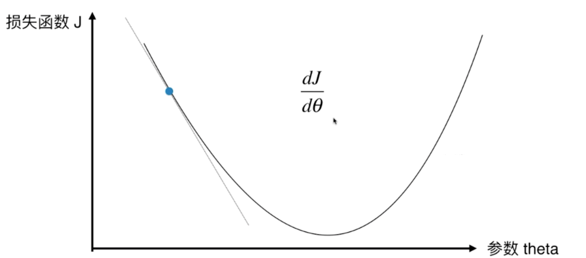
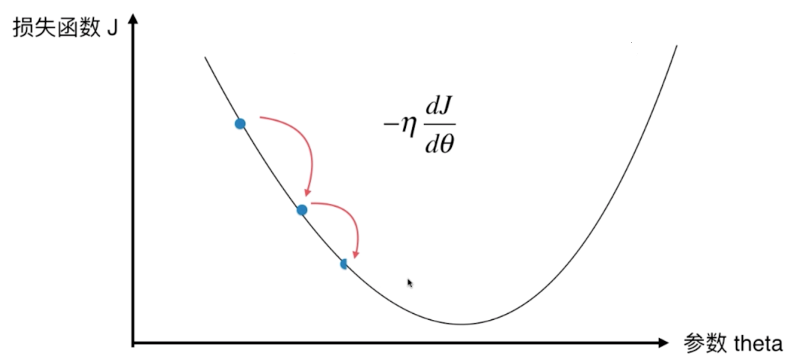
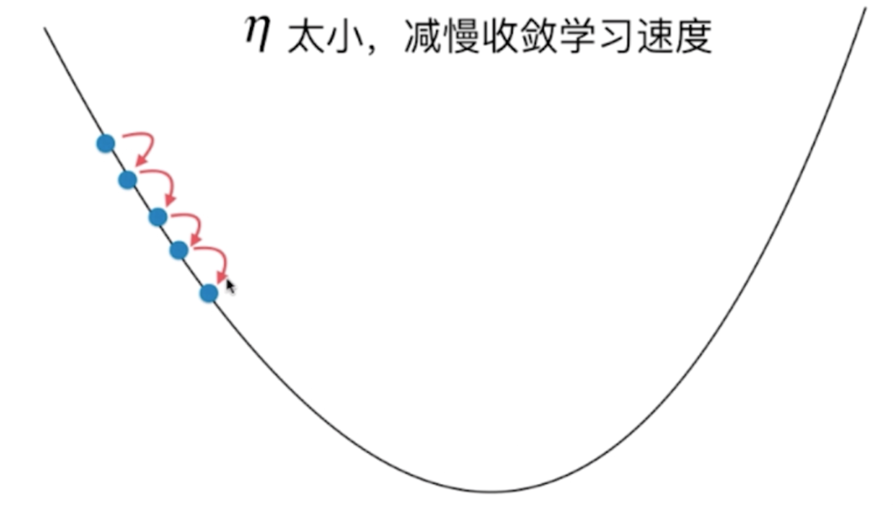
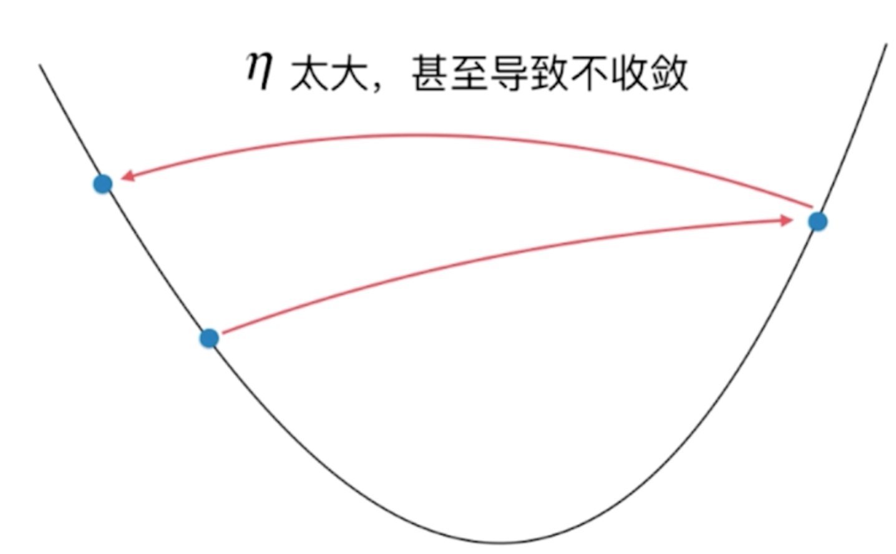
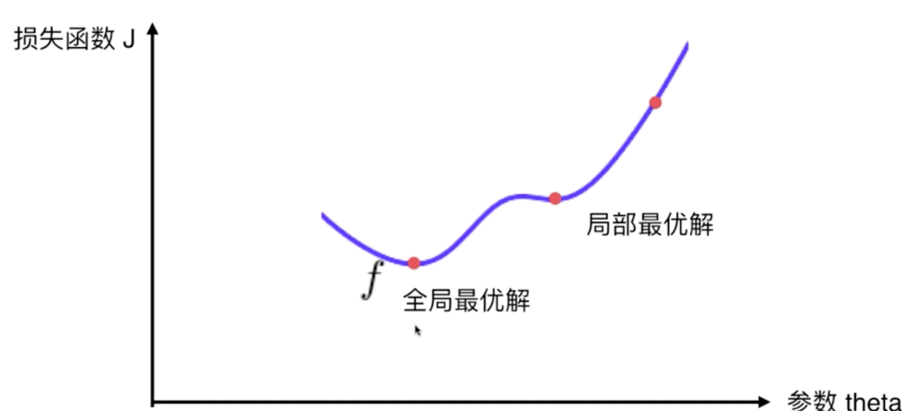
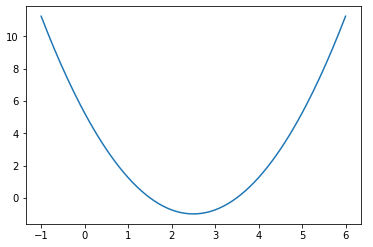
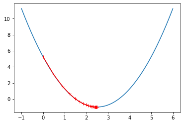
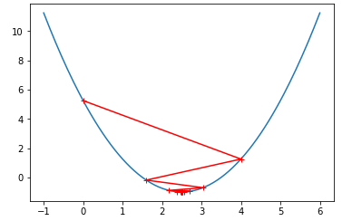
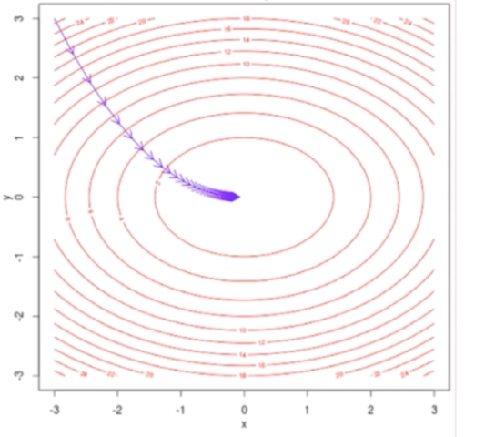

[Python3入门机器学习_经典算法与应用](https://coding.imooc.com/class/169.html#Anchor)

## 概述



上图中，横坐标为参数 $\theta$，中左侧为损失函数 J。梯度下降法就是找到 $\theta$，使损失函数 J 取得最小值。以上只有只体现一个参数 $\theta$，实际上可以扩展到多个参数。

在曲线方程中，导数 $\frac {dJ} {d\theta}$ 代表切线的斜率。导数可以代表方向，对应 J 增大最快的方向，为了表示 J 减小的方向以及减小的步长，我们将导数变成：$-\eta \frac {dJ} {d\theta}$。



如上图 $\theta$ 的增大，$-\eta \frac {dJ} {d\theta}$ 减小。

$\eta$ 称为学习率（learning rate），特点如下：

- $\eta$ 的取值影响获得最优解的速度。如果太小，减慢收敛速度，如果太大，可能导致不收敛。

  

- $\eta$ 如果取值不合适，可能得不到最优解。

- $\eta$ 是梯度下降法的一个超参。

并不是所有函数都有唯一的极值点，如：



对于有多个极值点的情况，除法点不同，找到的解可能只是局部最优解，而非全局最优解。对于这个问题的解决方案是多次运行，随机化初始点。所以初始点也是梯度下降法的一个超参数。

对于多个特 征值的情况，梯度代表方向，对应 J 增大最快的方向，对应的变化值为 $-\eta \Delta J$。其中：
$$
\Delta J = (\frac {\delta J} {\delta \theta_0}, \frac {\delta J} {\delta \theta_1}, \dots, \frac {\delta J} {\delta \theta_n})
$$


**梯度下降法的特点：**

- 不是机器学习算法。不能直接解决分类问题和回归问题。
- 是一种基于搜索的最优化的方法。对于线性回归我们求出了最小化损失函数对应的数学解，但是对于其他一些模型，我们找不多对应的数学界，则需要基于搜索策略来找到最优解。
- 梯度下降法的作用是最小化一个损失函数；而如果想最大化效用函数，则应该使用相应的梯度上升法。

在线性回归中使用梯度下降法的目标是使 $\sum_{i=1} ^m(y^{(i)}-\hat y^{(i)})^2$ 尽可能小，该损失函数具有唯一的最优解。

## 模拟梯度下降法

```python
import numpy as np
import matplotlib.pyplot as plt

# 生成二次曲线数据
plot_x = np.linspace(-1., 6., 141)
plot_y = (plot_x-2.5)**2 - 1.
plt.plot(plot_x, plot_y)
```



```python
# 函数定义
def J(theta):
  try:
    return (theta-2.5)**2 - 1.
  except:
    return float('inf')

# 导数
def dJ(theta):
    return 2*(theta-2.5)

# 对比精度
epsilon = 1e-8
# 学习率
eta = 0.1

def gradient_descent(initial_theta, eta, n_iters = 1e4, epsilon=1e-8):
  # 起始点
  theta = initial_theta
  theta_history = [theta]
  # 梯度下降法
  while True:
    gradient = dJ(theta)
    last_theta = theta
    theta = theta - eta * gradient
    heta_history.append(theta)

    # 比较本次值与上次值的变化是否小于精度值
    if(abs(J(theta) - J(last_theta)) < epsilon):
      break

# 绘制二次曲线与梯度点 theta
def plot_theta_history():
  plt.plot(plot_x, J(plot_x))
  plt.plot(np.array(theta_history), J(np.array(theta_history)), color="r", marker='+')
  plt.show()
```

```python
# 可以通过修改学习率来调节梯度下降率
eta = 0.1
theta_history = []
gradient_descent(0, eta)
plot_theta_history()
```




```python
eta = 0.8
theta_history = []
gradient_descent(0, eta)
plot_theta_history()
```



## 多元线性回归中使用梯度下降法

对于二元函数 $z=x^2 + 2y^2$，使用梯度下降法的过程如下：



线性回归中的的损失函数 $J=\sum_{i=1} ^m(y^{(i)}-\hat y^{(i)})^2$ ，目标是使改函数尽可能小。

预测值 $\hat y^{(i)}=\theta_0 + \theta_1X_1^{(i)} + \theta_2X_2^{(i)} + \dots + \theta_nX_n^{(i)}$，也即使 $\sum_{i=1}^m(y^{(i)}-\theta_0 + \theta_1X_1^{(i)} - \theta_2X_2^{(i)} - \dots - \theta_nX_n^{(i)})$ 尽可能小。
$$
\Delta J(\theta)=
\begin{bmatrix}
\frac {\delta J} {\delta \theta_0} \\
\frac {\delta J} {\delta \theta_1} \\
\frac {\delta J} {\delta \theta_2} \\
\dots 
\frac {\delta J} {\delta \theta_n} \\
\end{bmatrix} =
\begin{bmatrix}
\sum _{i=1}^m2(y^{(i)}-X_b^{(i)}\theta)(-1) \\
\sum _{i=1}^m2(y^{(i)}-X_b^{(i)}\theta)(-X_1^{(i)}) \\
\sum _{i=1}^m2(y^{(i)}-X_b^{(i)}\theta)(-X_2^{(i)}) \\
\dots \\
\sum _{i=1}^m2(y^{(i)}-X_b^{(i)}\theta)(-X_n^{(i)}) \\
\end{bmatrix}=
2\begin{bmatrix}
\sum _{i=1}^m(X_b^{(i)-y^{(i)}}\theta) \\
\sum _{i=1}^m(X_b^{(i)}\theta-y^{(i)})X_1^{(i)} \\
\sum _{i=1}^m(X_b^{(i)}\theta-y^{(i)})X_2^{(i)} \\
\dots \\
\sum _{i=1}^m(X_b^{(i)}\theta-y^{(i)})X_n^{(i)} \\
\end{bmatrix}
$$
为了使梯度 $\Delta J$ 与特征数量无关，我们将损失函数变为 $J=\frac 1 m \sum_{i=1} ^m(y^{(i)}-\hat y^{(i)})^2=MSE(y, \hat y)$，则对应的
$$
\Delta J(\theta)=
\frac 2 m\begin{bmatrix}
\sum _{i=1}^m(X_b^{(i)}-y^{(i)})\theta \\
\sum _{i=1}^m(X_b^{(i)}\theta-y^{(i)})X_1^{(i)} \\
\sum _{i=1}^m(X_b^{(i)}\theta-y^{(i)})X_2^{(i)} \\
\dots \\
\sum _{i=1}^m(X_b^{(i)}\theta-y^{(i)})X_n^{(i)} \\
\end{bmatrix}
$$
有时取 $J(\theta)=\frac 1 {2m}\sum_{i=1} ^m(y^{(i)}-\hat y^{(i)})^2$，则 
$$
\Delta J(\theta)=
\frac 1 m\begin{bmatrix}
\sum _{i=1}^m(X_b^{(i)-y^{(i)}})\theta) \\
\sum _{i=1}^m(X_b^{(i)}\theta-y^{(i)})X_1^{(i)} \\
\sum _{i=1}^m(X_b^{(i)}\theta-y^{(i)})X_2^{(i)} \\
\dots \\
\sum _{i=1}^m(X_b^{(i)}\theta-y^{(i)})X_n^{(i)} \\
\end{bmatrix}
$$
2 倍的差距对实际结果的影响不大。

## 工具

- [LaTeX/Mathematics - Wikibooks, open books for an open world](https://en.wikibooks.org/wiki/LaTeX/Mathematics)
- https://github.com/liuyubobobo/Play-with-Machine-Learning-Algorithms