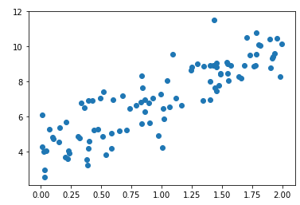
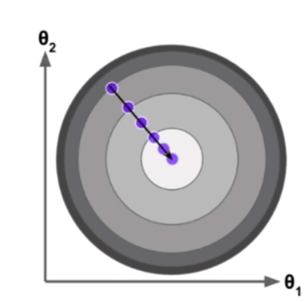
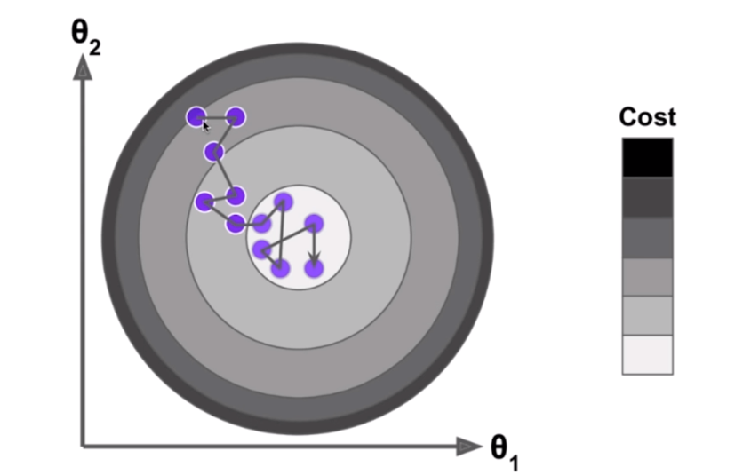
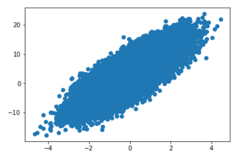

[Python3入门机器学习_经典算法与应用](https://coding.imooc.com/class/169.html#Anchor)

## 概述


上图中，横坐标为参数 $\theta$，中左侧为损失函数 J。梯度下降法就是找到 $\theta$，使损失函数 J 取得最小值。以上只有只体现一个参数 $\theta$，实际上可以扩展到多个参数。

在曲线方程中，导数 $\frac {dJ} {d\theta}$ 代表切线的斜率。导数可以代表方向，对应 J 增大最快的方向，为了表示 J 减小的方向以及减小的步长，我们将导数变成：$-\eta \frac {dJ} {d\theta}$。


如上图 $\theta$ 的增大，$-\eta \frac {dJ} {d\theta}$ 减小。

$\eta$ 称为学习率（learning rate），特点如下：

- $\eta$ 的取值影响获得最优解的速度。如果太小，减慢收敛速度，如果太大，可能导致不收敛。

  

- $\eta$ 如果取值不合适，可能得不到最优解。

- $\eta$ 是梯度下降法的一个超参。

并不是所有函数都有唯一的极值点，如：


对于有多个极值点的情况，除法点不同，找到的解可能只是局部最优解，而非全局最优解。对于这个问题的解决方案是多次运行，随机化初始点。所以初始点也是梯度下降法的一个超参数。

对于多个特 征值的情况，梯度代表方向，对应 J 增大最快的方向，对应的变化值为 $-\eta \Delta J$。其中：
$$
\Delta J = (\frac {\delta J} {\delta \theta_0}, \frac {\delta J} {\delta \theta_1}, \dots, \frac {\delta J} {\delta \theta_n})
$$


**梯度下降法的特点：**

- 不是机器学习算法。不能直接解决分类问题和回归问题。
- 是一种基于搜索的最优化的方法。对于线性回归我们求出了最小化损失函数对应的数学解，但是对于其他一些模型，我们找不多对应的数学界，则需要基于搜索策略来找到最优解。
- 梯度下降法的作用是最小化一个损失函数；而如果想最大化效用函数，则应该使用相应的梯度上升法。

在线性回归中使用梯度下降法的目标是使 $\sum_{i=1} ^m(y^{(i)}-\hat y^{(i)})^2$ 尽可能小，该损失函数具有唯一的最优解。

## 模拟梯度下降法

```python
import numpy as np
import matplotlib.pyplot as plt

# 生成二次曲线数据
plot_x = np.linspace(-1., 6., 141)
plot_y = (plot_x-2.5)**2 - 1.
plt.plot(plot_x, plot_y)
```


```python
# 函数定义
def J(theta):
  try:
    return (theta-2.5)**2 - 1.
  except:
    return float('inf')

# 导数
def dJ(theta):
    return 2*(theta-2.5)

# 对比精度
epsilon = 1e-8
# 学习率
eta = 0.1

def gradient_descent(initial_theta, eta, n_iters = 1e4, epsilon=1e-8):
  # 起始点
  theta = initial_theta
  theta_history = [theta]
  # 梯度下降法
  while True:
    gradient = dJ(theta)
    last_theta = theta
    theta = theta - eta * gradient
    heta_history.append(theta)

    # 比较本次值与上次值的变化是否小于精度值
    if(abs(J(theta) - J(last_theta)) < epsilon):
      break

# 绘制二次曲线与梯度点 theta
def plot_theta_history():
  plt.plot(plot_x, J(plot_x))
  plt.plot(np.array(theta_history), J(np.array(theta_history)), color="r", marker='+')
  plt.show()
```

```python
# 可以通过修改学习率来调节梯度下降率
eta = 0.1
theta_history = []
gradient_descent(0, eta)
plot_theta_history()
```


```python
eta = 0.8
theta_history = []
gradient_descent(0, eta)
plot_theta_history()
```


有可能因为 $\eta$ 取值太大，导致结果不收敛；因为 $\eta$ 太小导致计算速度太慢。

## 线性回归中使用梯度下降法

对于二元函数 $z=x^2 + 2y^2$，使用梯度下降法的过程如下：


线性回归中的的损失函数 $J=\sum_{i=1} ^m(y^{(i)}-\hat y^{(i)})^2$ ，目标是使该函数尽可能小。

预测值 $\hat y^{(i)}=\theta_0 + \theta_1X_1^{(i)} + \theta_2X_2^{(i)} + \dots + \theta_nX_n^{(i)}$，即使 $\sum_{i=1}^m(y^{(i)}-\theta_0 + \theta_1X_1^{(i)} - \theta_2X_2^{(i)} - \dots - \theta_nX_n^{(i)})^2$ 尽可能小。
$$
\Delta J(\theta)=
\begin{bmatrix}
\frac {\delta J} {\delta \theta_0} \\
\frac {\delta J} {\delta \theta_1} \\
\frac {\delta J} {\delta \theta_2} \\
\dots 
\frac {\delta J} {\delta \theta_n} \\
\end{bmatrix} =
\begin{bmatrix}
\sum _{i=1}^m2(y^{(i)}-X_b^{(i)}\theta)(-1) \\
\sum _{i=1}^m2(y^{(i)}-X_b^{(i)}\theta)(-X_1^{(i)}) \\
\sum _{i=1}^m2(y^{(i)}-X_b^{(i)}\theta)(-X_2^{(i)}) \\
\dots \\
\sum _{i=1}^m2(y^{(i)}-X_b^{(i)}\theta)(-X_n^{(i)}) \\
\end{bmatrix}=
2\begin{bmatrix}
\sum _{i=1}^m(X_b^{(i)}\theta-y^{(i)}) \\
\sum _{i=1}^m(X_b^{(i)}\theta-y^{(i)})X_1^{(i)} \\
\sum _{i=1}^m(X_b^{(i)}\theta-y^{(i)})X_2^{(i)} \\
\dots \\
\sum _{i=1}^m(X_b^{(i)}\theta-y^{(i)})X_n^{(i)} \\
\end{bmatrix}
$$
为了使梯度 $\Delta J$ 与特征数量无关，我们将损失函数变为 $J=\frac 1 m \sum_{i=1} ^m(y^{(i)}-\hat y^{(i)})^2=MSE(y, \hat y)$，则对应的
$$
\Delta J(\theta)=
\frac 2 m\begin{bmatrix}
\sum _{i=1}^m(X_b^{(i)}\theta-y^{(i)}) \\
\sum _{i=1}^m(X_b^{(i)}\theta-y^{(i)})X_1^{(i)} \\
\sum _{i=1}^m(X_b^{(i)}\theta-y^{(i)})X_2^{(i)} \\
\dots \\
\sum _{i=1}^m(X_b^{(i)}\theta-y^{(i)})X_n^{(i)} \\
\end{bmatrix}
$$
有时取 $J(\theta)=\frac 1 {2m}\sum_{i=1} ^m(y^{(i)}-\hat y^{(i)})^2$，则 
$$
\Delta J(\theta)=
\frac 1 m\begin{bmatrix}
\sum _{i=1}^m(X_b^{(i)}\theta-y^{(i)})) \\
\sum _{i=1}^m(X_b^{(i)}\theta-y^{(i)})X_1^{(i)} \\
\sum _{i=1}^m(X_b^{(i)}\theta-y^{(i)})X_2^{(i)} \\
\dots \\
\sum _{i=1}^m(X_b^{(i)}\theta-y^{(i)})X_n^{(i)} \\
\end{bmatrix}
$$
2 倍的差距对实际结果的影响不大。


下面我们以 $y=3x+4$ 为原型，利用梯度下降法来推导出 a 和 b。

```python
import numpy as np
import matplotlib.pyplot as plt

# 生成只有一个特征向量的 x，以及对应的 y
np.random.seed(666)
x = 2 * np.random.random(size=100)
y = x * 3. + 4. + np.random.normal(size=100)

# 散点绘制
plt.scatter(x, y)
plt.show()
```



```python
# 定义 J = MSE
def J(theta, X_b, y):
    try:
        return np.sum((y - X_b.dot(theta))**2) / len(X_b)
    except:
        return float('inf')

# 定义 Delta(J)，参考上面的公式
def dJ(theta, X_b, y):
    res = np.empty(len(theta))
    res[0] = np.sum(X_b.dot(theta) - y)
    for i in range(1, len(theta)):
        res[i] = (X_b.dot(theta) - y).dot(X_b[:,i])
    return res * 2 / len(X_b)

# 梯度下降法实现
def gradient_descent(X_b, y, initial_theta, eta, n_iters = 1e4, epsilon=1e-8):
    theta = initial_theta
    cur_iter = 0

    while cur_iter < n_iters:
        gradient = dJ(theta, X_b, y)
        last_theta = theta
        theta = theta - eta * gradient
        if(abs(J(theta, X_b, y) - J(last_theta, X_b, y)) < epsilon):
            break
            
        cur_iter += 1

    return theta
```

```python
# 梯度下降求 theta 值
X_b = np.hstack([np.ones((len(x), 1)), x.reshape(-1,1)])
initial_theta = np.zeros(X_b.shape[1])
eta = 0.01

theta = gradient_descent(X_b, y, initial_theta, eta)
```

可以将上述过程封装为 [fit_gd](https://github.com/liuyubobobo/Play-with-Machine-Learning-Algorithms/blob/master/06-Gradient-Descent/04-Implement-Gradient-Descent-in-Linear-Regression/playML/LinearRegression.py#L25)。


我们可以将上述 $\Delta J$ 的求法向量化：
$$
\begin{align*}
\Delta J(\theta) & =
\frac 2 m\begin{bmatrix}
\sum _{i=1}^m(X_b^{(i)}\theta-y^{(i)})) \\
\sum _{i=1}^m(X_b^{(i)}\theta-y^{(i)})X_1^{(i)} \\
\sum _{i=1}^m(X_b^{(i)}\theta-y^{(i)})X_2^{(i)} \\
\dots \\
\sum _{i=1}^m(X_b^{(i)}\theta-y^{(i)})X_n^{(i)} \\
\end{bmatrix} \\
& = \frac 2 m \cdot ((X_b\theta - y)^T\cdot X_b)^T \\
& = \frac 2 m \cdot X_b^T \cdot (X_b\theta - y)
\end{align*}
$$
修改 $\Delta J$ 的实现：

```python
def dJ(theta, X_b, y):
	return X_b.T.dot(X_b.dot(theta) - y) * 2. / len(y)
```

更新后的 [fit_gd](https://github.com/liuyubobobo/Play-with-Machine-Learning-Algorithms/blob/master/06-Gradient-Descent/05-Vectorize-Gradient-Descent/playML/LinearRegression.py#L25)。

## 数据归一化

我们基于波士顿房价数据，使用梯度下降法来预测。

```python
import numpy as np
from sklearn import datasets
from sklearn.model_selection import train_test_split
from playML.LinearRegression import LinearRegression

# 数据准备
boston = datasets.load_boston()
X = boston.data
y = boston.target
X = X[y < 50.0]
y = y[y < 50.0]
X_train, X_test, y_train, y_test = train_test_split(X, y, seed=666)

# 使用线性回归发计算
lin_reg1 = LinearRegression()
%time lin_reg1.fit_normal(X_train, y_train)
lin_reg1.score(X_test, y_test)
```

其中 [LinearRegression](https://github.com/liuyubobobo/Play-with-Machine-Learning-Algorithms/blob/master/06-Gradient-Descent/05-Vectorize-Gradient-Descent/playML/LinearRegression.py)。

得到时间和得分：

```
CPU times: user 45.6 ms, sys: 5.74 ms, total: 51.3 ms
Wall time: 56.4 ms

0.81298026026584658
```

```python
# 使用梯度下降法
lin_reg2 = LinearRegression()
lin_reg2.fit_gd(X_train, y_train)
```

引发异常警告：

```
RuntimeWarning: overflow encountered in square
RuntimeWarning: invalid value encountered in double_scalars
  if (abs(J(theta, X_b, y) - J(last_theta, X_b, y)) < epsilon):
```

并输出得到的系数全部为 `nan`。这是由于特征向量的数据分布起伏太大，导致结果不收敛。

通过缩小 $\eta$ 来可以避免这个异常：

```
lin_reg2.fit_gd(X_train, y_train, eta=0.000001)
```

响应的评分 0.27556634853389195：

```
lin_reg2.score(X_test, y_test)
```

循环次数有可能影响到比较的精度，将比较次数增加到百万次：

```python
%time lin_reg2.fit_gd(X_train, y_train, eta=0.000001, n_iters=1e6)
```

计算时间：

```
CPU times: user 48.4 s, sys: 265 ms, total: 48.6 s
Wall time: 49.9 s
```

评分为 0.75418523539807636：

```
lin_reg2.score(X_test, y_test)
```

大大降低效率，而且评分也不如线性回归。


解决该问题的方法为将数据归一化：

```python
from sklearn.preprocessing import StandardScaler

# 标准化训练数据
standardScaler = StandardScaler()
standardScaler.fit(X_train)
X_train_standard = standardScaler.transform(X_train)

lin_reg3 = LinearRegression()
%time lin_reg3.fit_gd(X_train_standard, y_train)
```

计算时间为：

```
CPU times: user 237 ms, sys: 4.37 ms, total: 242 ms
Wall time: 258 ms
```

评分为 0.81298806201222351 ：

```
X_test_standard = standardScaler.transform(X_test)
lin_reg3.score(X_test_standard, y_test)
```


在线性回归中不需要数据归一化是因为我们将线性回归的求解模型变成了数学公式， 数据公式涉及的中间搜索过程比较少。而梯度下降法中，如果特征数据不再同一个维度会影响梯度的结果，与 $\eta$ 相乘的结果为移动的步长，可能太大，也可能太小，从而影响结果收敛或者影响效率。


## 梯度下降法的优势

构造一个 1000 个样本数量，5000 个特征的数据集，来比较线性回归与梯度下降的性能。

```python
# 构建数据集
m = 1000
n = 5000
big_X = np.random.normal(size=(m, n))
true_theta = np.random.uniform(0.0, 100.0, size=n+1)
big_y = big_X.dot(true_theta[1:]) + true_theta[0] + np.random.normal(0., 10., size=m)
```

通过正规方程的计算时间为 10.9s：

```python
big_reg1 = LinearRegression()
%time big_reg1.fit_normal(big_X, big_y)
```

而通过梯度下降的时间为 5.76s：

```python
big_reg2 = LinearRegression()
%time big_reg2.fit_gd(big_X, big_y)
```

对于比较大的矩阵，正规方程的耗时比梯度下降法要高；但要注意，对于样本数量较多的时候，梯度下降法的耗时也不低，我们可以通过随机梯度下降法来解决这个问题。 

## 随机梯度下降法

在上面的梯度下降法中，我们用的梯度公式为：
$$
\begin{align*}
\Delta J(\theta) & =
\frac 2 m\begin{bmatrix}
\sum _{i=1}^m(X_b^{(i)}\theta-y^{(i)}))X_0^{(i)} \\
\sum _{i=1}^m(X_b^{(i)}\theta-y^{(i)})X_1^{(i)} \\
\sum _{i=1}^m(X_b^{(i)}\theta-y^{(i)})X_2^{(i)} \\
\dots \\
\sum _{i=1}^m(X_b^{(i)}\theta-y^{(i)})X_n^{(i)} \\
\end{bmatrix} \\
& = \frac 2 m \cdot X_b^T \cdot (X_b\theta - y)
\end{align*}
$$
每次都是对整个样本空间进行计算，我们称之为批量梯度下降法 Batch Gradient Descent。

如果我们不是每次都对整个样本空间进行梯度计算，而是只对一行进行计算，相应的公式为：
$$
2\begin{bmatrix}
(X_b^{(i)}\theta-y^{(i)}))X_0^{(i)} \\
(X_b^{(i)}\theta-y^{(i)})X_1^{(i)} \\
(X_b^{(i)}\theta-y^{(i)})X_2^{(i)} \\
\dots \\
(X_b^{(i)}\theta-y^{(i)})X_n^{(i)} \\
\end{bmatrix}
= 2\cdot (X_b^{(i)})^T \cdot ((X_b)^{(i)}\theta - y^{(i)})
$$
该算式并非是梯度函数的公式，所以不能当做梯度的方向，但是可以作为搜索的方向。我们随机取一行 i，以该行的计算结果作为搜索方向，我们称这种方法为随机梯度下降法 Stochastic Gradient Descent。

批量梯度下降法与随机梯度下降法的搜索过程如下：

 

随机梯度下降法不能保证每次都是沿着梯度下降的方向移动，所以损失函数的结果不一定一直沿着减小的方向移动，中间过程存在增大的现象。但实验结果表明，最终能够得到损失函数最小的 $\theta$ 值。

由于随机过程可能不稳定，我们让 $\eta$ 值随着循环的次数增大而减小，而非固定值，这样可能保证在损失函数越接近最小值，$\eta$ 值越小。
$$
\eta = \frac a {i\_iters + b}
$$
其中，b 可以防止循环次数 `i_iters`$ 较小时，$$\eta$ 变换太大，而 `i_iters​` 较大时，$\eta$ 变化太小。b 通常取值为 50。a 也是为了让 $\eta$ 的变化更加稳定，通常可以取值为 5。

结合模拟退火的思想，冷却函数和时间 t 相关，则 $eta$ 的值可以变为：
$$
\eta = \frac {t_0} {i\_iters + t_1}
$$

## 简单随机下降法的实现

```python
import numpy as np
import matplotlib.pyplot as plt

# 样本数量
m = 100000

# 构建样本空间
x = np.random.normal(size=m)
X = x.reshape(-1,1)
y = 4.*x + 3. + np.random.normal(0, 3, size=m)
```

```python
# 散点图显示
plt.scatter(x, y)
plt.show()
```



```python
# 搜索梯度（方向）
def dJ_sgd(theta, X_b_i, y_i):
    return 2 * X_b_i.T.dot(X_b_i.dot(theta) - y_i)

# 随机梯度下降法
def sgd(X_b, y, initial_theta, n_iters):
	# eta 变化函数
    t0, t1 = 5, 50
    def learning_rate(t):
        return t0 / (t + t1)

    theta = initial_theta
    # 相对批量梯度下降，for 循环中不需要损失函数的最小变化判断。
    # 因为随机梯度的变化是随机的，不能保证损失函数变化最小，得到的就是最小损失函数
    for cur_iter in range(n_iters):
        # 随机取样本行
        rand_i = np.random.randint(len(X_b))
        # 梯度值
        gradient = dJ_sgd(theta, X_b[rand_i], y[rand_i])
        # theta 变化
        theta = theta - learning_rate(cur_iter) * gradient

    return theta
```

```python
# 取样本空间 1/3 的数据，仍然可以搜索到相对最佳的 theta 值。
%%time
X_b = np.hstack([np.ones((len(X), 1)), X])
initial_theta = np.zeros(X_b.shape[1])
# array([ 3.04732375,  4.03214249])
theta = sgd(X_b, y, initial_theta, n_iters=m//3)
# CPU times: user 559 ms, sys: 22.6 ms, total: 582 ms
#   Wall time: 647 ms
```

封装方法参考 [fit_sgd](https://github.com/liuyubobobo/Play-with-Machine-Learning-Algorithms/blob/master/06-Gradient-Descent/07-SGD-in-scikit-learn/playML/LinearRegression.py#L64)，代码内容为：

```python
# n_iters 指的是遍历样本空间的次数，而非循环次数。
# 在之前的实现中，我们并没有将所有的样本空间至少浏览一遍，所以并没有考虑所有样本的信息。
# 所以我们将 n_iters 定义为将样本空间浏览几遍。
def fit_sgd(self, X_train, y_train, n_iters=50, t0=5, t1=50):
        """根据训练数据集X_train, y_train, 使用梯度下降法训练Linear Regression模型"""
        assert X_train.shape[0] == y_train.shape[0], \
            "the size of X_train must be equal to the size of y_train"
        assert n_iters >= 1

        # 梯度方向，无变化
        def dJ_sgd(theta, X_b_i, y_i):
            return X_b_i * (X_b_i.dot(theta) - y_i) * 2.
		
        # 随机梯度下降
        def sgd(X_b, y, initial_theta, n_iters=5, t0=5, t1=50):

            def learning_rate(t):
                return t0 / (t + t1)

            theta = initial_theta
            m = len(X_b)
            for i_iter in range(n_iters):
                indexes = np.random.permutation(m)
                X_b_new = X_b[indexes,:]
                y_new = y[indexes]
                for i in range(m):
                    gradient = dJ_sgd(theta, X_b_new[i], y_new[i])
                    theta = theta - learning_rate(i_iter * m + i) * gradient

            return theta

        X_b = np.hstack([np.ones((len(X_train), 1)), X_train])
        initial_theta = np.random.randn(X_b.shape[1])
        self._theta = sgd(X_b, y_train, initial_theta, n_iters, t0, t1)

        self.intercept_ = self._theta[0]
        self.coef_ = self._theta[1:]

        return self
```


## 工具

- [LaTeX/Mathematics - Wikibooks, open books for an open world](https://en.wikibooks.org/wiki/LaTeX/Mathematics)
- [Play-with-Machine-Learning-Algorithms: Code of my MOOC Course](https://github.com/liuyubobobo/Play-with-Machine-Learning-Algorithms)