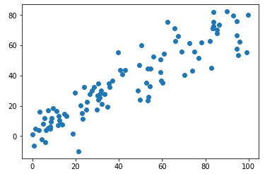

[Python3入门机器学习_经典算法与应用](https://coding.imooc.com/class/169.html#Anchor)

## PCA

PCA 是主成分分析法，为 Principal Component Analysis 的缩写，是数理统计中的知识。

**特点：**

- 是一个非监督的机器学习算法
- 主要用于数据的降维
- 通过降维，可以发现更便于人类理解的特征
- 其他应用：可视化，去噪。 

 以下是一个二维特征集：


假如我们对其降维，降成一维特征集。如果我们简单处理，只保留其中一个。只保留特征 2 和特征 1 后的映射：


相对而言，图 2 的方案是比较好的降维方案。因为点和点之间的间隔比较大，拥有更高的可区分度，更好地保持了原来的点和点之间的距离。我们再来看一另一种映射方案：


上述方案将所有点映射到一条斜线上，这比方案2的点间距更大，也更能体现原点之间的原理。  

如何找到样本间间距最大的轴是 PCA 的关键。样本间的间距通过方差 Variance 来定义。在概率论与数理统计中，方差可以用来描述样本整体的疏密程度。方差越大，样本越稀疏；方差越小，样本越紧密。

方差的表示方式：$Var(x)=\frac 1 m \sum_{i=1}^m(x_i-\bar x)^2$

问题转化为找到一个轴，使得样本空间的所有点映射到这个轴的方差最大。  


为了求解最大方差值，我们首先将样本的均值归零，该过程称为 demean。即所有的样本减去样本的均值。相当于将坐标轴的原点移动到特向量的均值位置：


问题转化为将所有样本映射到 w 后，使得方差最大，即：
$$
Var(X_{project}) = \frac 1 m \sum_{i=1}^m(X_{project}^{(i)}-\bar X_{project})^2
$$

其中 $X_{prject}$ 为映射到新的坐标轴后得到的新样本，$\bar X_{project}=0$。

公式简化为 $Var(X_{project}) = \frac 1 m \sum_{i=1}^m(X_{project}^{(i)})^2$。X 的每一个行均是特征向量，我们要求的是特征向量的模长，公式更准确的形式是 $Var(X_{project}) = \frac 1 m \sum_{i=1}^m\|X_{project}^{(i)}\|^2$。

下面我们根据原来的坐标点，来求 $\|X_{project}^i\|$：


其中目标轴的方向记为 $w=(w_1, w_2)$，$\vec w$ 用单位向量表示，模长为 1。
$$
\begin{align*}
X^{(i)}\cdot w&=\|X^{(i)}\|\cdot\|w\|\cdot\cos\theta \\
&=\|X^{(i)}\|\cdot\cos\theta \\
&=\|X_{project}^{(i)}\|
\end{align*}
$$
目标公式演变为：求 w，使得 $Var(X_{project}) = \frac 1 m \sum_{i=1}^m(X^{(i)}\cdot w)^2$ 最大。
$$
\begin{align*}
Var(X_{project}) &= \frac 1 m \sum_{i=1}^m(X^{(i)}\cdot w)^2 \\
&= \frac 1 m \sum_{i=1}^m(X_1^{(i)}w_1+X_2^{(i)}w_2+\dots+X_n^{(i)}w_n)^2 \\
&=\frac 1 m \sum_{i=1}^m(\sum_{j=1}^nX^{(i)}_jw_j)
\end{align*}
$$
以上公式的最大值可以通过数理统计的公式求出，我们这里通过梯度上升法来求得最优解。

在前面的线性回归算法中求解 MSE 时，也有类似样本点与目标直线的问题，但在线性回归中，求解的是样本点到直线的垂直距离，而 PCA 中是投射距离。


## 梯度上升法解决 PCA 问题

我们要j解决的问题是：求 w，使得 $f(X)= \frac 1 m \sum_{i=1}^m(X_1^{(i)}w_1+X_2^{(i)}w_2+\dots+X_n^{(i)}w_n)^2$ 最大。
$$
\begin{align*}
\Delta f = 
\begin{bmatrix}
\frac {\delta f} {\delta w_1} \\
\frac {\delta f} {\delta w_2} \\
\dots \\
\frac {\delta f} {\delta w_n} \\
\end{bmatrix} 
& =\frac 2 m
\begin{bmatrix}
\sum_{i=1}^m(X_1^{(i)}w_1+X_2^{(i)}w_2+\dots+X_n^{(i)}w_n)X_1^{(i)} \\
\sum_{i=1}^m(X_1^{(i)}w_1+X_2^{(i)}w_2+\dots+X_n^{(i)}w_n)X_2^{(i)} \\
\dots \\
\sum_{i=1}^m(X_1^{(i)}w_1+X_2^{(i)}w_2+\dots+X_n^{(i)}w_n)X_n^{(i)} \\
\end{bmatrix} \\
& = \frac 2 m
\begin{bmatrix}
\sum_{i=1}^m(X^{(i)}w)X_1^{(i)} \\
\sum_{i=1}^m(X^{(i)}w)X_2^{(i)} \\
\dots \\
\sum_{i=1}^m(X^{(i)}w)X_n^{(i)}
\end{bmatrix} \\
& = \frac 2 m \cdot
\Bigg(\begin{bmatrix}
X^{(1)}w, X^{(2)}w, X^{(3)}w, \dots, X^{(m)}w, 
\end{bmatrix}
\cdot
\begin{bmatrix}
X^{(1)}_{1} X^{(1)}_2 X^{(1)}_3 \dots X^{(1)}_n \\
X^{(2)}_{1} X^{(2)}_2 X^{(2)}_3 \dots X^{(2)}_n \\
X^{(3)}_{1} X^{(3)}_2 X^{(3)}_3 \dots X^{(3)}_n \\
\dots \\
X^{(m)}_{1} X^{(m)}_2 X^{(m)}_3 \dots X^{(m)}_n
\end{bmatrix}\Bigg)^T \\
&= \frac 2 m \cdot \big((Xw)^T \cdot X\big)^T \\
&= \frac 2 m \cdot X^T\cdot (Xw)
\end{align*}
$$

## 使用 BGA 来解决 PCA

下面用代码来用 BGA 求解 $w$, 使 $f(x)$ 最大。

```python
import numpy as np
import matplotlib.pyplot as plt

# 生成 2 个特征向量，其中第二个特征向量与第 1 个特征向量具有一定的线性关系
X = np.empty((100, 2))
X[:,0] = np.random.uniform(0., 100., size=100)
X[:,1] = 0.75 * X[:,0] + 3. + np.random.normal(0, 10., size=100)
```

```python
plt.scatter(X[:,0], X[:,1])
plt.show()
```



```python
# demean
def demean(X):
    return X - np.mean(X, axis=0)

X_demean = demean(X)
```

```python
# 三点绘制 demean 后的结果
plt.scatter(X_demean[:,0], X_demean[:,1])
plt.show()
```


```python
# 目标函数
def f(w, X):
    return np.sum((X.dot(w)**2)) / len(X)
# delta f 数学公式
def df_math(w, X):
    return X.T.dot(X.dot(w)) * 2. / len(X)
# delta f debug
def df_debug(w, X, epsilon=0.0001):
    res = np.empty(len(w))
    for i in range(len(w)):
        w_1 = w.copy()
        w_1[i] += epsilon
        w_2 = w.copy()
        w_2[i] -= epsilon
        res[i] = (f(w_1, X) - f(w_2, X)) / (2 * epsilon)
    return res

# 单位化向量
def direction(w):
    # w/w向量的模
    return w / np.linalg.norm(w)
```

```python
# 梯度上升法求解第一主成分
def first_component(df, X, initial_w, eta, n_iters = 1e4, epsilon=1e-8):
	# 单位化向量
    w = direction(initial_w) 
    cur_iter = 0

    while cur_iter < n_iters:
        # 梯度
        gradient = df(w, X)
        last_w = w
        # 梯度上升
        w = w + eta * gradient
        # 上述推导公式是基于 w 是单位向量，在 w 按梯度方向增加之后，可能变为非单位向量。
        # 所以在代入目标函数之前，需要将 w 单位化。
        w = direction(w)
        # 是否还能上升
        if(abs(f(w, X) - f(last_w, X)) < epsilon):
            break
            
        cur_iter += 1

    return w
```

```python
# 初始化参数
# 随机初始化 w 向量。不能用 0 向量开始，0 向量是目函数的一个极致小值点，而非极大值点。
initial_w = np.random.random(X.shape[1]) 
initial_w # array([ 0.37061708,  0.28515471])
eta = 0.001

# array([ 0.78121351,  0.62426392])
first_component(df_debug, X_demean, initial_w, eta)
first_component(df_math, X_demean, initial_w, eta)
```

PCA 过程不能使用数据归一化，因为归一化的过程是将样本的方差变为 1，而我们的目标是求最大方差。我们只将数据的均值变为 0。

```python
# 绘制 w 
plt.scatter(X_demean[:,0], X_demean[:,1])
plt.plot([0, w[0]*30], [0, w[1]*30], color='r')
plt.show()
```


如果我们使用极端数据来测试：

```python
X[:,0] = np.random.uniform(0., 100., size=100)
X[:,1] = 0.75 * X[:,0] + 3.
```

则 w 应该与直线重合：


以上，我们找到了二维特征集的一个主成分 w，对于二维特征集来说已经足够了，但对于多维，可能还需要继续查找多个主要成分。这些主成分的房差之逐渐减小。

主成分分析法本质上是将数组从一组坐标系转移到另外一组坐标系。以上过程我们求出了新坐标系的第一个轴的方向，后续继续求下一轴的方向，即求下一个主成分。  

为了求下一个主成分，我们需要改变数据，即去除数据在第一个主成分上的分量。
$$
X^{'(i)}=X^{(i)}-X^{(i)}_{project}
$$
其中，$X^{i}_{project}=\|X_{project}^{(i)}\|\cdot w=(X^{(i)} \cdot w)*w$。
$$
X' = (X \cdot w) *w
$$


对应的几何意义为：


在新的数据上求第一主成分即为原数据集的第二主成分。


下面我们用代码来实现：

```python
def first_n_components(n, X, eta=0.01, n_iters = 1e4, epsilon=1e-8):
    X_pca = X.copy()
    X_pca = demean(X_pca)
    res = []
    for i in range(n):
        initial_w = np.random.random(X_pca.shape[1])
        w = first_component(X_pca, initial_w, eta)
        res.append(w)
        
        X_pca = X_pca - X_pca.dot(w).reshape(-1, 1) * w
    return res
```

```python
components = first_n_components(2, X)
# 得到的 2 个主成分是互相取值的，2 个主成分点乘结果趋近于 0
components[0].dot(components[1])
```

第二个主成分数据的的散点图为：


## 高位数据向低位数据映射

数据集经过主成分映射后，主成分和映射值组成新的坐标系。主成分的个数 $k$ 小于原数据的特征维度 $n$。
$$
X =
\begin{bmatrix}
X_1^{(1)} X_2^{(1)} \dots X_n^{(1)} \\
X_1^{(2)} X_2^{(2)} \dots X_n^{(2)} \\
\dots \\
X_1^{(m)} X_2^{(m)} \dots X_n^{(m)}
\end{bmatrix}

W_k =
\begin{bmatrix}
W_1^{(1)} W_2^{(1)} \dots W_n^{(1)} \\
W_1^{(2)} W_2^{(2)} \dots W_n^{(2)} \\
\dots \\
W_1^{(k)} W_2^{(k)} \dots W_n^{(k)} \\
\end{bmatrix}
$$
X 为原数据集；W 为主成分组成的组成，每一行表示一个主成分向量。

X 的第 i 行 * W 的第 j 行 = X 的第 i 个样本在第  j 个主成分上的映射。

$X_k = X \cdot W_k^T$ 对应的是 $X$ 映射到 $W$ 的 k 个主成分后的数据集。$X$ 和 $X_k$ 的行数均为 m，对应 m 个样本数据；X 的维数是 n，$X_k$ 为  k，从而达到降维的效果。其中：
$$
X_k =
\begin{bmatrix}
X_1^{(1)} X_2^{(1)} \dots X_k^{(1)} \\
X_1^{(2)} X_2^{(2)} \dots X_w^{(2)} \\
\dots \\
X_1^{(m)} X_2^{(m)} \dots X_k^{(m)}
\end{bmatrix}
$$


我们可以让 $X_k \cdot W_k$ ，从而还原为一个 m*n 的矩阵 $X_m^{'}$。从而将低位数据还原为高维数据。

下面我们来求解 $X_k$，以及从 $X_k$ 还原为 $X_m^{'}$。完整代码参见 [PCA.py](https://github.com/liuyubobobo/Play-with-Machine-Learning-Algorithms/blob/master/07-PCA-and-Gradient-Ascent/05-Data-Projection/playML/PCA.py)

```python
def transform(self, X):
    """将给定的X，映射到各个主成分分量中"""
    assert X.shape[1] == self.components_.shape[1]

    return X.dot(self.components_.T)

def inverse_transform(self, X):
    """将给定的X，反向映射回原来的特征空间"""
    assert X.shape[1] == self.components_.shape[0]

    return X.dot(self.components_)
```

```python
import numpy as np
import matplotlib.pyplot as plt
from playML.PCA import PCA

# 生成特征集
X = np.empty((100, 2))
X[:,0] = np.random.uniform(0., 100., size=100)
X[:,1] = 0.75 * X[:,0] + 3. + np.random.normal(0, 10., size=100)

# 计算 1 个主成分
pca = PCA(n_components=1)
pca.fit(X)

# 生成映射数据集 Xk
X_reduction = pca.transform(X)

# 还原数据集
X_restore = pca.inverse_transform(X_reduction)
```

```python
# 绘制原数据集和还原的数据集
plt.scatter(X[:,0], X[:,1], color='b', alpha=0.5)
plt.scatter(X_restore[:,0], X_restore[:,1], color='r', alpha=0.5)
plt.show()
```


## sklearn 中的 PCA

```python
from sklearn.decomposition import PCA

pca = PCA(n_components=1)
pca.fit(X)
# array([[-0.76676934, -0.64192272]])
# 方向与通过 BGA 方法求得的方向相反，单不影响最终结果
# 因为 sklearn 是通过数学方法求得的
pca.components_
```

```python
X_reduction = pca.transform(X)
X_restore = pca.inverse_transform(X_reduction)
```


下面通过 PCA 来降维手写字体数据集。

首先我们用 kNN 算法完整训练并求得准确度：

```python
import numpy as np
import matplotlib.pyplot as plt
from sklearn import datasets
from sklearn.model_selection import train_test_split、
from sklearn.neighbors import KNeighborsClassifier

# 数据集
digits = datasets.load_digits()
X = digits.data
y = digits.target

X_train, X_test, y_train, y_test = train_test_split(X, y, random_state=666)

# kNN 训练
%%time
knn_clf = KNeighborsClassifier()
knn_clf.fit(X_train, y_train)
knn_clf.score(X_test, y_test)

# CPU times: user 19.9 ms, sys: 7.47 ms, total: 27.4 ms
# Wall time: 64.5 ms
# 0.98666666666666669
```

### 手写字体降维

下面我们通过 PCA 将数据降维，然后再通过 kNN 训练降维后的数据：

```python
from sklearn.decomposition import PCA

# 保留 2 个主成分
pca = PCA(n_components=2)
pca.fit(X_train)
X_train_reduction = pca.transform(X_train)
X_test_reduction = pca.transform(X_test)
knn_clf.score(X_test_reduction, y_test)

# CPU times: user 2.13 ms, sys: 767 µs, total: 2.9 ms
# Wall time: 2.93 ms
# 0.60666666666666669    
```

如果保留 2 个主成分，虽然训练性能提高很多，但是准确率下降太厉害。

我们可以通过主成分所解释的方差比例 `explained_variance_ratio_` 来决定主成分的个数，这个值表示主成分维持了原数据集的最大方差的百分比。比如，我们可以查看上例中的方差比：

```python
pca.explained_variance_ratio_
# array([ 0.14566817,  0.13735469])
# 表示 2 个主成分分别体现原数据总方差的 14.56%，13.7%，其余的方差信息均丢失。
```

我们可以通过找到所有主分量的方差占比：

```python
from sklearn.decomposition import PCA

pca = PCA(n_components=X_train.shape[1])
pca.fit(X_train)
pca.explained_variance_ratio_
```

可以通过折线图的方式来体现这些数据：

```python
plt.plot([i for i in range(X_train.shape[1])], 
         [np.sum(pca.explained_variance_ratio_[:i+1]) for i in range(X_train.shape[1])])
plt.show()
```


### 主成分方差比例

在初始化 PCA 时，我们可以传入总方差的占比，而不是主成分的个数。

```python
pca = PCA(0.95)
pca.fit(X_train)
pca.n_components_ #28
```

```python
X_train_reduction = pca.transform(X_train)
X_test_reduction = pca.transform(X_test)

%%time 
knn_clf = KNeighborsClassifier()
knn_clf.fit(X_train_reduction, y_train)
knn_clf.score(X_test_reduction, y_test)

#CPU times: user 4.21 ms, sys: 1.28 ms, total: 5.49 ms
#Wall time: 19.7 ms
#0.97999999999999998
```

通过适当降维，可以通过降低有限的精度来获取时间性能上的大幅提升。

### 降维可视化

我们可以将训练数据降维到 2 维以实现可视化的目的。

```python
pca = PCA(n_components=2)
pca.fit(X)
X_reduction = pca.transform(X)

for i in range(10):
    plt.scatter(X_reduction[y==i,0], X_reduction[y==i,1], alpha=0.8)
plt.show()
```


## MNIST 数据集

我们通过 kNN 来训练真实的 MNIST 数据，并通过 PCA 来提高性能 。

```python
import numpy as np 
from sklearn.datasets import fetch_mldata

# 从 mldata.org 获取 MINST original 数据集
mnist = fetch_mldata('MNIST original')

# 准备数据
# 数据集的前 6 万个是训练数据，后 1 万个是测试数据。
X, y = mnist['data'], mnist['target']
X_train = np.array(X[:60000], dtype=float)
y_train = np.array(y[:60000], dtype=float)
X_test = np.array(X[60000:], dtype=float)
y_test = np.array(y[60000:], dtype=float)
```

```python
from sklearn.neighbors import KNeighborsClassifier

# 使用 kNN 算法训练数据
knn_clf = KNeighborsClassifier()
%time knn_clf.fit(X_train, y_train)

#CPU times: user 57.6 s, sys: 681 ms, total: 58.3 s
#Wall time: 59.4 s

# 预测数据的准确度
%time knn_clf.score(X_test, y_test)
# CPU times: user 14min 20s, sys: 4.3 s, total: 14min 24s
# Wall time: 14min 29s
# 0.96879999999999999
```

```python
from sklearn.decomposition import PCA

# PCA 降维，保留 90% 的方差信息
pca = PCA(0.90)
pca.fit(X_train)
X_train_reduction = pca.transform(X_train)
X_test_reduction = pca.transform(X_test)

# 从 784 维降到 87 维
X_train_reduction.shape
# (60000, 87)

# kNN 训练
# 降维之后性能大幅提升，而准确度还有所上升，这是因为通过降维降低了数据噪音。
knn_clf = KNeighborsClassifier()
%time knn_clf.fit(X_train_reduction, y_train)
# CPU times: user 57.6 s, sys: 681 ms, total: 58.3 s
# Wall time: 59.4 s

%time knn_clf.score(X_test_reduction, y_test)
# CPU times: user 14min 20s, sys: 4.3 s, total: 14min 24s
# Wall time: 14min 29s
# 0.9728
```

## PCA 降噪

我们通过wz  di

## 工具

- [LaTeX/Mathematics - Wikibooks, open books for an open world](https://en.wikibooks.org/wiki/LaTeX/Mathematics)
- [Play-with-Machine-Learning-Algorithms: Code of my MOOC Course](https://github.com/liuyubobobo/Play-with-Machine-Learning-Algorithms)

