## 多项式回归

线性回归算法的前提是数据基本呈线性关系，并不能准确地预测非线性关系的数据。比如如下数据集：

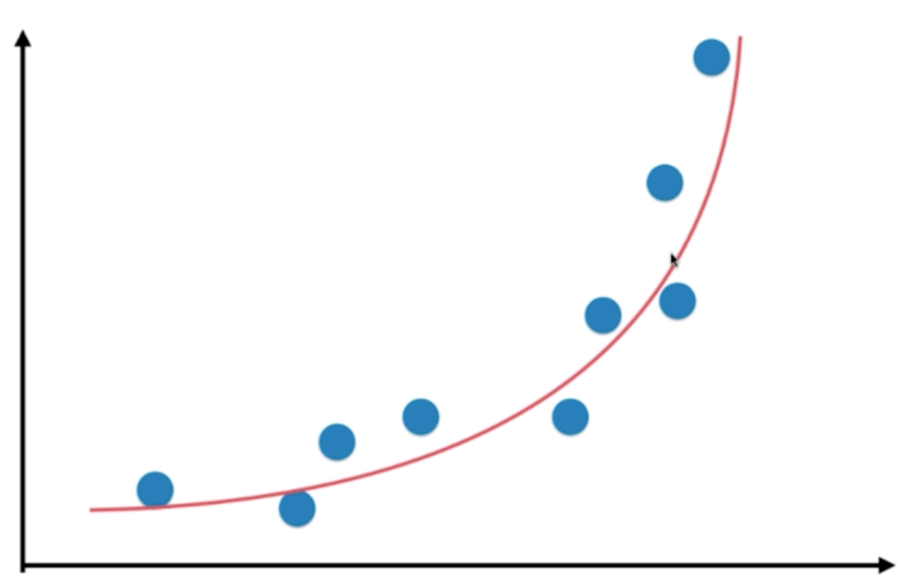

通过二次曲线来模拟会更加准确，对应的方程为 $y=ax^2 + bx + c$。解决这种多项式问题的算法称为多项式回归。

对于一次线性方程的数据集 $y=ax + b$，特征为 $x$，对于以上二次方程来说，我们可以理解为有 2 个特征 $x$ 和 $x^2$，要求 $a, b, c$ 三个常数，从而转化为多元线性回归问题。

下面我们通过编程用线性回归的方法来拟合二次方程 $y=0.5x^2+2$：

```python
import numpy as np 
import matplotlib.pyplot as plt

# 生成 X 和对应的 y
x = np.random.uniform(-3, 3, size=100)
X = x.reshape(-1, 1)
y = 0.5 * x**2 + x + 2 + np.random.normal(0, 1, 100)
```

```python
plt.scatter(x, y)
plt.show()
```

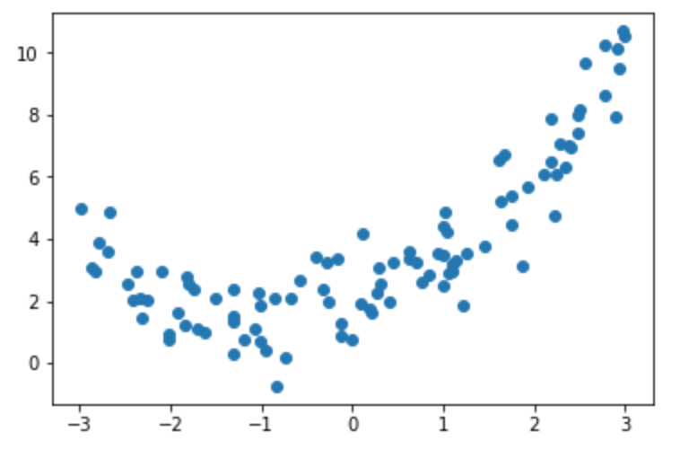

我们先用普通的线性回归算法来拟合这些数据：

```python
# 线性回归
from sklearn.linear_model import LinearRegression

lin_reg = LinearRegression()
lin_reg.fit(X, y)
y_predict = lin_reg.predict(X)

plt.scatter(x, y)
plt.plot(x, y_predict, color='r')
plt.show()
```

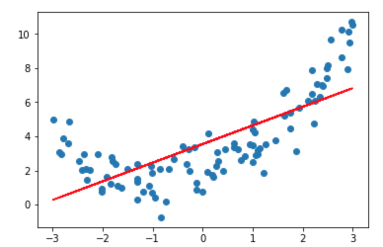

下面我们先添加一个特征数据 $x^2$，然后再用线性回归求解这个多项式：

```python
# 添加特征 x^2
X2 = np.hstack([X, X**2])

lin_reg2 = LinearRegression()
lin_reg2.fit(X2, y)
y_predict2 = lin_reg2.predict(X2)
```

```python
# 绘制二次曲线
plt.scatter(x, y)
plt.plot(np.sort(x), y_predict2[np.argsort(x)], color='r')
plt.show()

lin_reg2.coef_ # array([ 0.99870163,  0.54939125])
lin_reg2.intercept_ # 1.8855236786516001
```

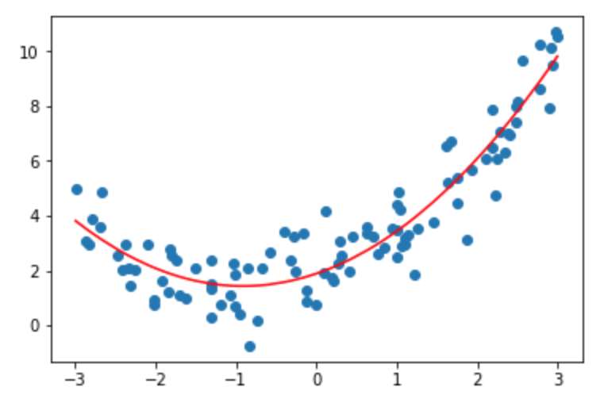

与 PCA 的思路想法，PCA 的目标是降维，而多项式回归是通过添加特征来升维。

## sklearn 的多项式回归

sklearn 提供了为原数据集添加特征的类 `PolynomialFeatures` 来生成新的数据集。

```python
import numpy as np 
import matplotlib.pyplot as plt
from sklearn.preprocessing import PolynomialFeatures

# 生成数据集
x = np.random.uniform(-3, 3, size=100)
X = x.reshape(-1, 1)
y = 0.5 * x**2 + x + 2 + np.random.normal(0, 1, 100)

# 添加特征生成新的数据集，degree 表示为原数据集添加最多几次幂。
# degree = 2 将生成 0, 1, 2 次幂的数据，最终新的数据集为 3 维。
poly = PolynomialFeatures(degree=2)
poly.fit(X)
X2 = poly.transform(X)
```

```python
from sklearn.linear_model import LinearRegression

# 线性回归
lin_reg2 = LinearRegression()
lin_reg2.fit(X2, y)
y_predict2 = lin_reg2.predict(X2)
```

```
plt.scatter(x, y)
plt.plot(np.sort(x), y_predict2[np.argsort(x)], color='r')
plt.show()
```

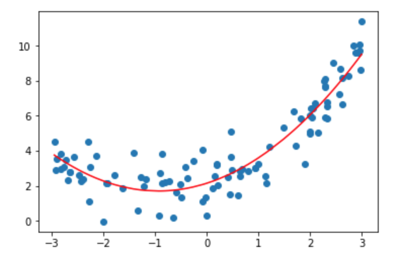

### PolynomialFeatures

上例中我们展示了给一维数据集添加特征，如果给一个二维数据添加最多 2 次幂的特征，则最终生成 6 维的数据集。这 6 维分别为 $X^0, X_1, X_2,X_1 * X_2, X_1^2, X_2^2$。

```python
X = np.arange(1, 11).reshape(-1, 2)

poly = PolynomialFeatures(degree=2)
poly.fit(X)
X2 = poly.transform(X)

X2.shape # (5, 6)
```

如果 `degree = 3`，则最终生成 10 个特征。

### Pipeline

我们可以使用管道将各过程衔接起来，比如以下过程将添加特征，归一化，线性回归三个过程通过管道衔接在一起。

 ```python
x = np.random.uniform(-3, 3, size=100)
X = x.reshape(-1, 1)
y = 0.5 * x**2 + x + 2 + np.random.normal(0, 1, 100)

from sklearn.pipeline import Pipeline
from sklearn.preprocessing import StandardScaler

poly_reg = Pipeline([
    ("poly", PolynomialFeatures(degree=2)),
    ("std_scaler", StandardScaler()),
    ("lin_reg", LinearRegression())
])
poly_reg.fit(X, y)
y_predict = poly_reg.predict(X)
 ```

## 过拟合和欠拟合

我们通过均方差来评估不同 `degree` 值得多项式回归。

```python
from sklearn.pipeline import Pipeline
from sklearn.preprocessing import PolynomialFeatures
from sklearn.preprocessing import StandardScaler

def PolynomialRegression(degree):
    return Pipeline([
        ("poly", PolynomialFeatures(degree=degree)),
        ("std_scaler", StandardScaler()),
        ("lin_reg", LinearRegression())
    ])
```


一次方程的均方差为 3.0750025765636577：

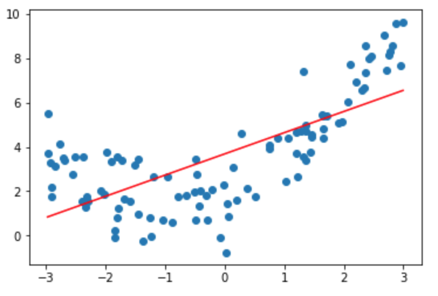


二次方程的均方差为 1.0987392142417856：

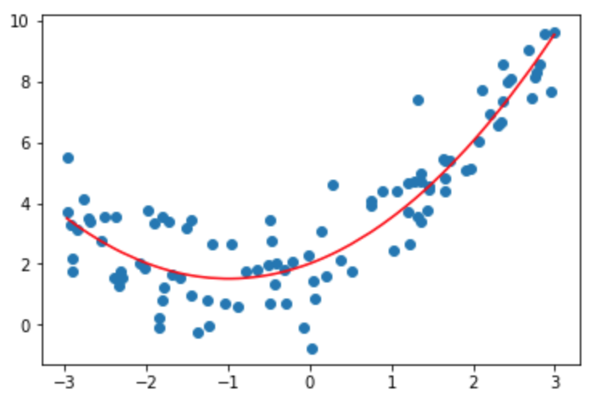

十次方程的均方差为 1.0508466763764164：

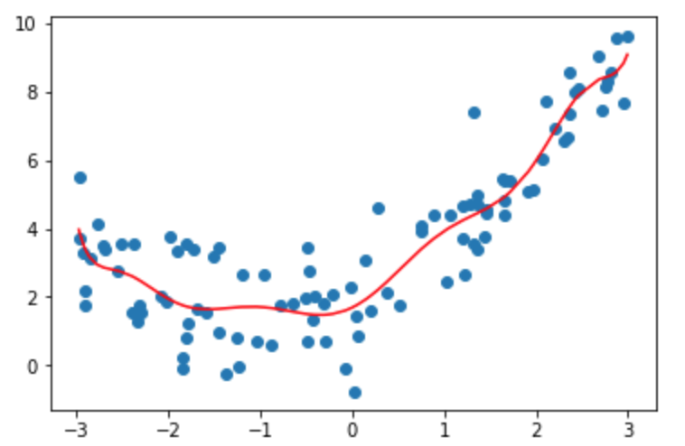

100 次方程的均方差为 0.68743577834336944：

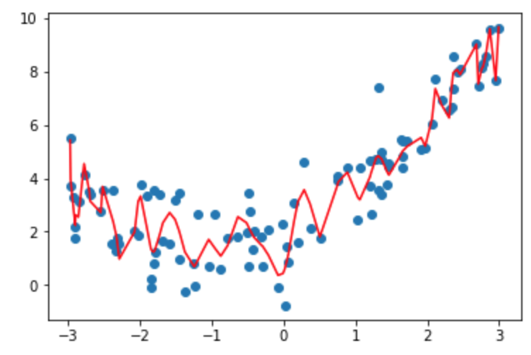

我们基于100次方的回归模型来预测 (-3, 3) 之间的一组线性数据：

```python
X_plot = np.linspace(-3, 3, 100).reshape(100, 1)
y_plot = poly100_reg.predict(X_plot)

plt.scatter(x, y)
plt.plot(X_plot[:,0], y_plot, color='r')
plt.axis([-3, 3, 0, 10])
plt.show()
```

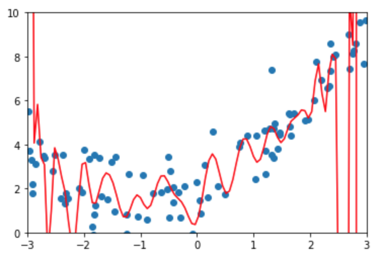

`degree` 值越高，均方误差越小，拟合结果更好。但过高的幂次使预测结果与实际曲线形态相差甚远，这种情况称为过拟合。相反，如果幂次为 1，则不足以体现实际的曲线形态，这种情况称为欠拟合。

欠拟合（underfitting）：算法所训练的模型不能完整表述数据关系。

过拟合（overfitting）：算法所训练的模型过多表述数据间的噪音关系。

## 模型的泛化能力

泛化能力指的是预测能力，即训练得到的模型曲线对新数据的预测能力。我们的目标不是得到一个极好的拟合曲线，而是要得到泛化能力较高的曲线。在训练数据和测试数据的分离，就是通过对测试数据的预测结果来评价训练模型的泛化能力。

在上例中，我们用均方差评估来评估原数据集的拟合程度，实际上我们应该通过测试数据来评估测试数据的拟合程度，从而来评估模型的泛化能力。

```python
from sklearn.model_selection import train_test_split
X_train, X_test, y_train, y_test = train_test_split(X, y, random_state=666)

# 一次方程 2.2199965269396573
lin_reg = LinearRegression()
lin_reg.fit(X_train, y_train)
y_predict = lin_reg.predict(X_test)
mean_squared_error(y_test, y_predict)

# 2 次方程 0.80356410562978997
poly2_reg = PolynomialRegression(degree=2)
poly2_reg.fit(X_train, y_train)
y2_predict = poly2_reg.predict(X_test)
mean_squared_error(y_test, y2_predict)

# 10次方程 0.92129307221507939

# 100 次方程 14075796419.234262
```

模型越复杂，原数据的拟合效果更好，但预测结果不一定越准确。模型复杂度与准确率之间的关系如下：

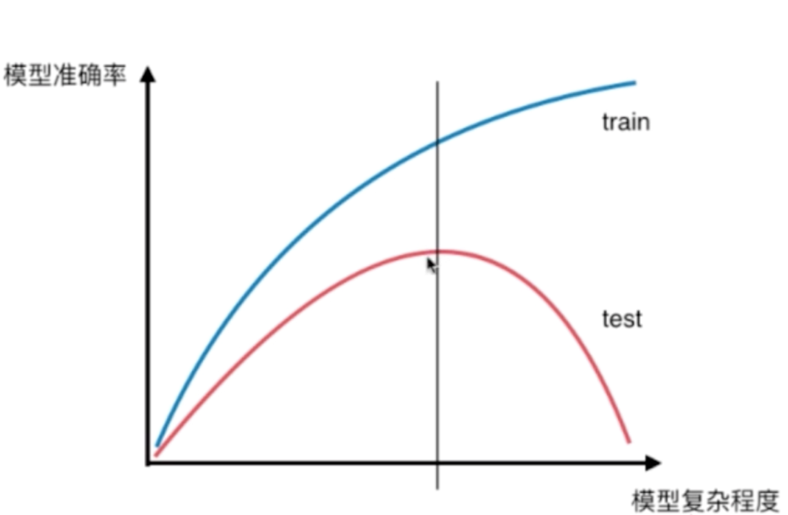

我们的目标是找到泛化能力最好的模型复杂度。在前面的算法中，网格搜索方法就是实现该目标的方法，后面还有更好的方法。

## 学习曲线

通过学习曲线可以绘制出 随着训练样本的逐渐增多，算法训练出的模型的表现能力。

```python
import numpy as np
import matplotlib.pyplot as plt

# 2 次曲线
np.random.seed(666)
x = np.random.uniform(-3.0, 3.0, size=100)
X = x.reshape(-1, 1)
y = 0.5 * x**2 + x + 2 + np.random.normal(0, 1, size=100)

plt.scatter(x, y)
plt.show()
```

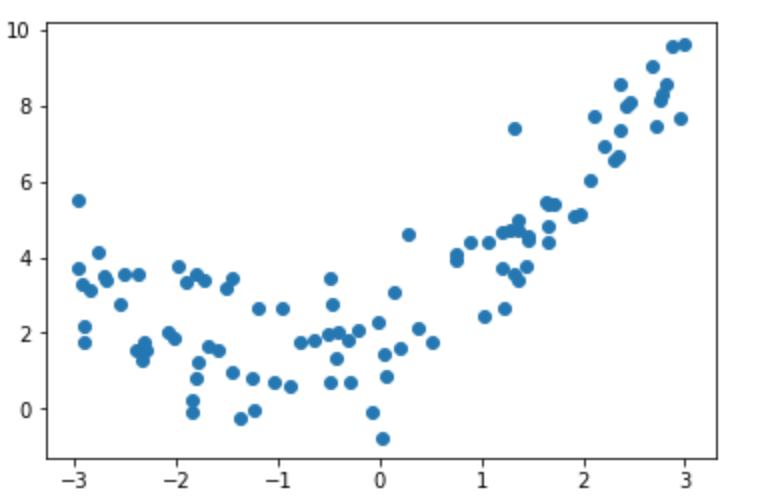

```python
from sklearn.model_selection import train_test_split
from sklearn.linear_model import LinearRegression
from sklearn.metrics import mean_squared_error

# 分离
X_train, X_test, y_train, y_test = train_test_split(X, y, random_state=10)
```

```python
# 绘制学习曲线
def plot_learning_curve(algo, X_train, X_test, y_train, y_test):
    train_score = []
    test_score = []
    for i in range(1, len(X_train)+1):
        algo.fit(X_train[:i], y_train[:i])
    
    		# 训练数据的拟合能力
        y_train_predict = algo.predict(X_train[:i])
        train_score.append(mean_squared_error(y_train[:i], y_train_predict))
    
    		# 测试数据的拟合能力
        y_test_predict = algo.predict(X_test)
        test_score.append(mean_squared_error(y_test, y_test_predict))
    
    # 绘制训练数据和测试数据的拟合能力曲线
    plt.plot([i for i in range(1, len(X_train)+1)], 
                               np.sqrt(train_score), label="train")
    plt.plot([i for i in range(1, len(X_train)+1)], 
                               np.sqrt(test_score), label="test")
    plt.legend()
    plt.axis([0, len(X_train)+1, 0, 4])
    plt.show()
```

```python
# 线性回归法的学习曲线
plot_learning_curve(LinearRegression(), X_train, X_test, y_train, y_test)
```

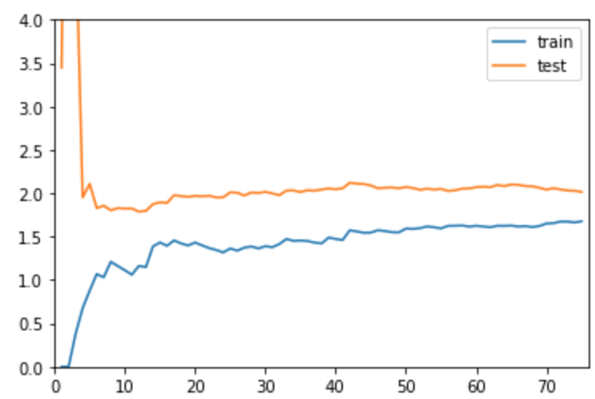

```python
# PCA 方法的学习曲线
from sklearn.preprocessing import PolynomialFeatures
from sklearn.preprocessing import StandardScaler
from sklearn.pipeline import Pipeline

def PolynomialRegression(degree):
    return Pipeline([
        ("poly", PolynomialFeatures(degree=degree)),
        ("std_scaler", StandardScaler()),
        ("lin_reg", LinearRegression())
    ])

# degree = 2
poly2_reg = PolynomialRegression(degree=2)
plot_learning_curve(poly2_reg, X_train, X_test, y_train, y_test)

# degree = 20
poly20_reg = PolynomialRegression(degree=20)
plot_learning_curve(poly20_reg, X_train, X_test, y_train, y_test)
```

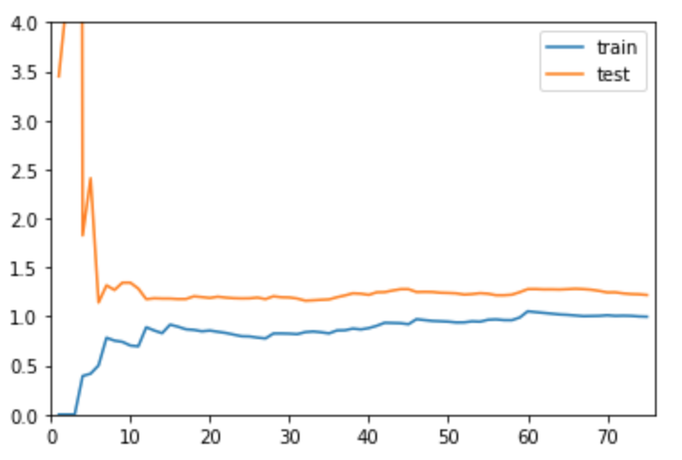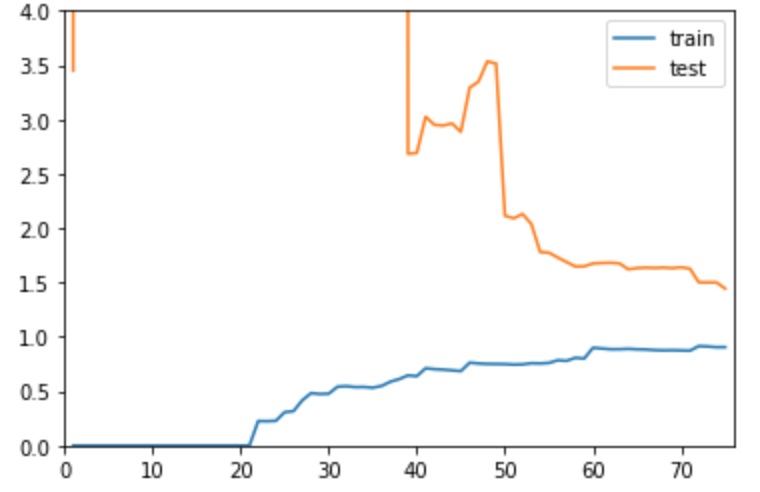

以上三种曲线分别对应欠拟合，最佳，过拟合的情况。

欠拟合，训练数据和测试数据的拟合误差均比较大；过拟合，训练数据的误差比较小，但测试数据的误差比较大，两条曲线相隔比较开。

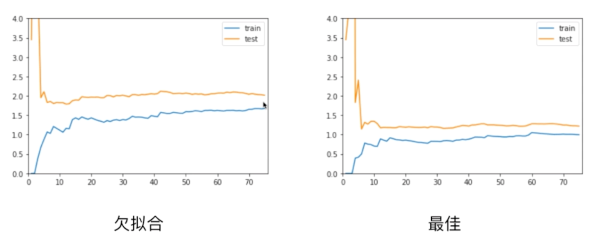

## 交叉验证

在之前的例子中，我们通过训练数据集来判断模型的好坏，但获取到的模型可能对特定测试数据过拟合，不一定是最佳模型。为了尽可能避免过拟合，我们将训练数据集随机分成训练数据集和验证数据集，用来训练模型和调整参数；模型训练之后，用测试数据来评判模型的最终性能；

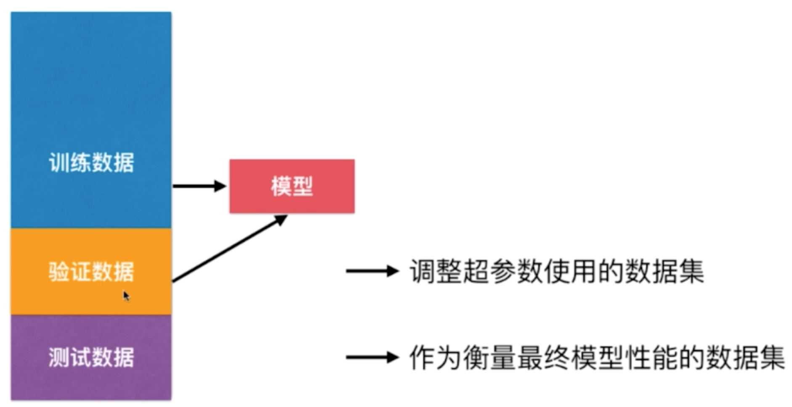


上面的方法中，训练山水和验证数据集是固定的，如果验证数据集的数据比较极端，可能影响模型的准确性。因此，我们可以通过交叉验证（Cross Validation）来增加验证数据的随机性。

交叉验证的具体方法是，将训练数据随机分成 k 份，任选其中一份作为验证数据，其他数据作为训练数据。这样会产生 k 个验证结果，这 k 个验证结果的结果均值作为最终的训练结果。

对于每个模型，交叉验证验证 k 次，相当于整体性能满了 k 倍，但最终的验证结果会更佳准确。

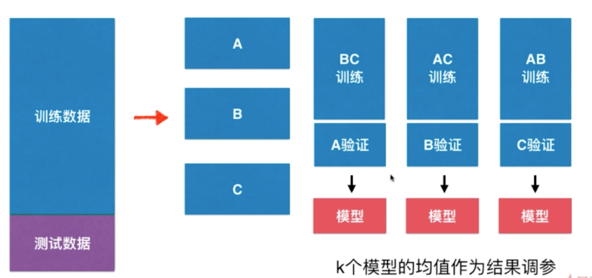

下面我们在用 kNN 算法

```python
import numpy as np
from sklearn import datasets
from sklearn.model_selection import train_test_split
from sklearn.model_selection import cross_val_score

digits = datasets.load_digits()
X = digits.data
y = digits.target

X_train, X_test, y_train, y_test = train_test_split(X, y, test_size=0.4, random_state=666)

knn_clf = KNeighborsClassifier()
# 使用交叉验证来计算 score，可以通过 cv 来指定分组 k 的值，默认为 3。
scores = cross_val_score(knn_clf, X_train, y_train)
score = np.mean(scores)
```

在网格搜索中，使用 `GridSearchCV` 对象中 CV 指的就是交叉验证。在调用 `fit` 后有条输出日志：

```
Fitting 3 folds for each of 45 candidates, totalling 135 fits
```

其中 3 folds 指定就是 cv 分组个数。 

交叉验证方法中，对于 k 的取值存在随机性，所以验证数据也存在随机性。k 越大，随机性越小，能够覆盖的验证数据越多。解决随机性的一种极端做法是将训练数据分成 m 份，其中 m-1 份数据作为训练数据，剩下的 1 份用于验证，这中方法称为留一法（Leave One Out Cross Validation，简称 LOO-CV）。这种方法完全不受随机的影响，最接近模型真正的性能指标。但是会带来巨大的计算量。

## 偏差方差平衡

偏差（Bias) 描述的是预测值（估计值）的期望与真实值之间的差距。偏差越大，越偏离真实数据。

方差（Variance）描述的是预测值的变化范围，离散程度，也就是离其期望值的距离。方差越大，数据的分布越分散。

下面打把的例子很好地解释了均差和方差的区别：

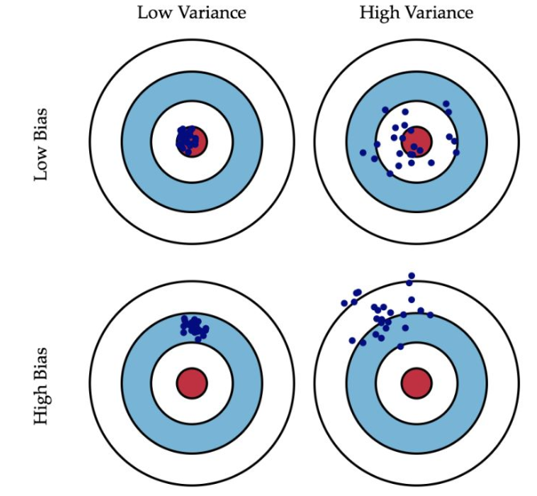

模型的误差 = 偏差 + 方差 + 不可避免的误差。不可避免的误差如数据本身的噪音。 

导致偏差的主要原因是对问题本身的假设不正确，包括算法层面上的欠拟合（比如非线性问题使用线性回归求出的欠拟合模型），也包括数据特征选取不正确（比如用学生名字来预测考试成绩）。

高方差导致的后果是数据的一点点扰动都会较大地影响模型，原因通常是因为使用的模型太复杂（过拟合），如高阶多项式回归。

非参数学习通常是高方差算法，比如 kNN 算法。因为非参数学习不对数据进行假设模型，高度依赖原数据，预测结果比较分散。

参数学习通常是高偏差算法，比如线性回归。因为对数据进行了极强的假设模型。数据模型准确，则偏差就小；数据模型不好，则偏差较大。

大多数算法具有相应的参数，可以调整偏差和方差。比如 kNN 中的 k，k 越小，模型越复杂，方差越大，偏差越小；k 越大，模型越简单（比如去对比整个样本空间的数据），偏差越大，方差越小。 再比如多项式回归中的 `degree`，`degree` 值越小，模型越简单，偏差越大，方差越小；`degree` 越大，模型越复杂，曲线越弯曲，方差越大，偏差越小。

偏差和方差通常是矛盾的，降低偏差，会提高方差；降低方差，会提高偏差。

从算法角度看，机器学习的主要挑战是方差，即过拟合导致的泛化能力差的问题。从特征选取的角度不一定如此，比如对疾病的理解和经融的理解。

通常解决高方差的手段：

- 降低模型复杂度
- 减少模型维度，降噪
- 增加样本数，有些问题的模型比较复杂，而有限的样本数无法计算出这么多的参数。比如神经网络和深度学习算法需要具有大量的样本数据。
- 使用验证集，避免过拟合特定的测试数据集
- 模型正则化。

## 模型正则化 Regularization

模型正规化是为了限制参数的大小，防止过拟合。比如在之前的多项式回归中，当 `degree` 取值为 100 时，曲线非常陡峭，对应的 $\theta$ 值非常大。


### 岭回归

在之前的线性回归中，我们对应的使目标函数$J(\theta)=\sum_{i=1}^m(y^{(i)}-\theta_0 + \theta_1X_1^{(i)} - \theta_2X_2^{(i)} - \dots - \theta_nX_n^{(i)})^2 = MSE(y, \hat y;\theta)$尽可能小，为了避免 $\theta$ 过大，我们加入模型正规化，将目标函数转变为：
$$
J(\theta)= MSE(y, \hat y;\theta)+ \alpha \frac 1 2 \sum_{i=1}^n\theta^2
$$
其中，不需要加上截距 $\theta_0$， 因为 $\theta_0$ 只决定了曲线的高地，跟曲线的陡峭程度没有影响；$\frac 1 2$ 视为了方便求导计算，其实可以省略；$\alpha$ 是为了调整 $\sum_{i=1}^n\theta^2$的重要程度。以上这种模型正则化的方式成为岭回归 Redge Regression。

下面我们用岭回归来重新训练之前的数据模型：

```python
from sklearn.linear_model import Ridge

def RidgeRegression(degree, alpha):
    return Pipeline([
        ("poly", PolynomialFeatures(degree=degree)),
        ("std_scaler", StandardScaler()),
        ("ridge_reg", Ridge(alpha=alpha))
    ])
```

```python
ridge1_reg = RidgeRegression(20, 0.0001)
ridge1_reg.fit(X_train, y_train)

y1_predict = ridge1_reg.predict(X_test)
mean_squared_error(y_test, y1_predict) #1.3233492754051845

plot_model(ridge1_reg)
```

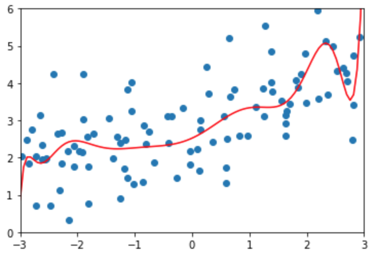

如果将 `alpha=1`：mse = 1.1888759304218448，曲线相对更平滑。

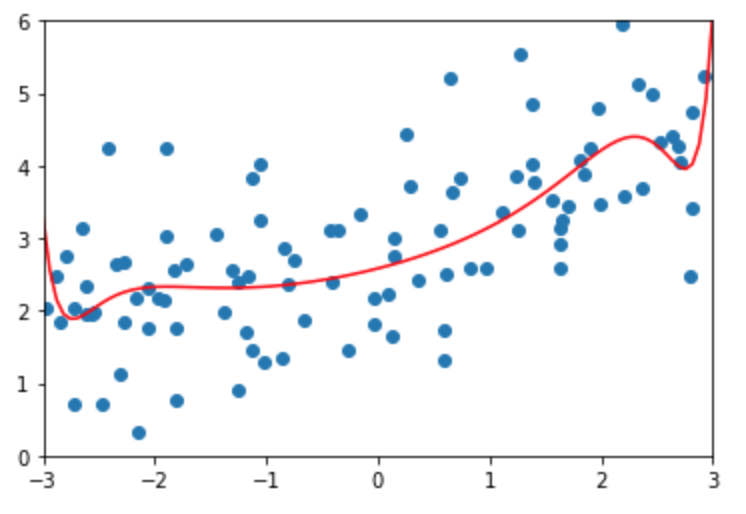

如果将 `alpha=100`：mse = 1.3196456113086197，曲线相对更平滑。

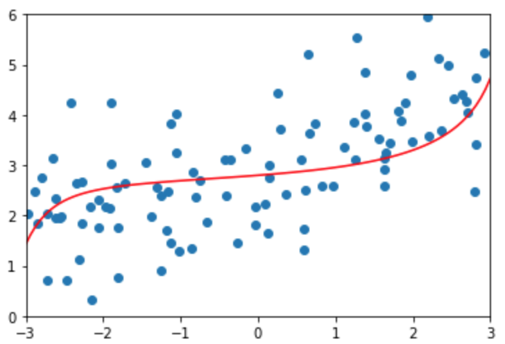

如果将 `alpha=10000`：mse = 1.8408455590998372，曲线将变成一条直线，此时所有的 $\theta$ 均为 0，MSE 本身的重要程度可以忽略不计。

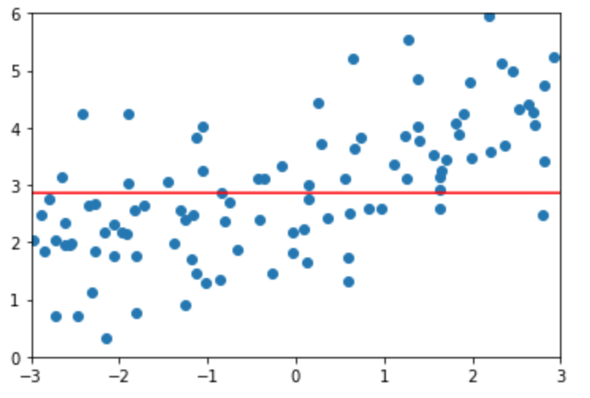

### LASSO 回归

LASSO 回归与岭回归类似，区别是描述 $\theta$ 的大小的方法不同。LASSO 回归中使用绝对值的和来描述 $\theta$ 的大小。LASSO 是 Least Absolute Shrinkage and Selection Operator Regression 的缩写。
$$
J(\theta)= MSE(y, \hat y;\theta)+ \alpha \sum_{i=1}^n|\theta_i|
$$

```python
from sklearn.linear_model import Lasso

def LassoRegression(degree, alpha):
    return Pipeline([
        ("poly", PolynomialFeatures(degree=degree)),
        ("std_scaler", StandardScaler()),
        ("lasso_reg", Lasso(alpha=alpha))
    ])
```

```python
lasso1_reg = LassoRegression(20, 0.01)
lasso1_reg.fit(X_train, y_train)

y1_predict = lasso1_reg.predict(X_test)
mean_squared_error(y_test, y1_predict) #1.1496080843259966

plot_model(lasso1_reg)
```

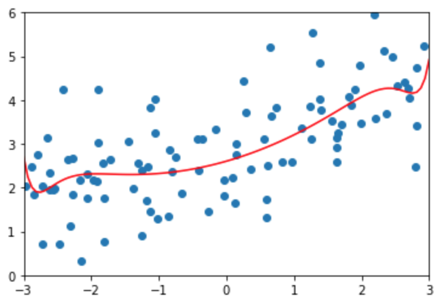

当 `alpha =0.1` 时，mse = 1.1213911351818648，均线几乎接近直线：

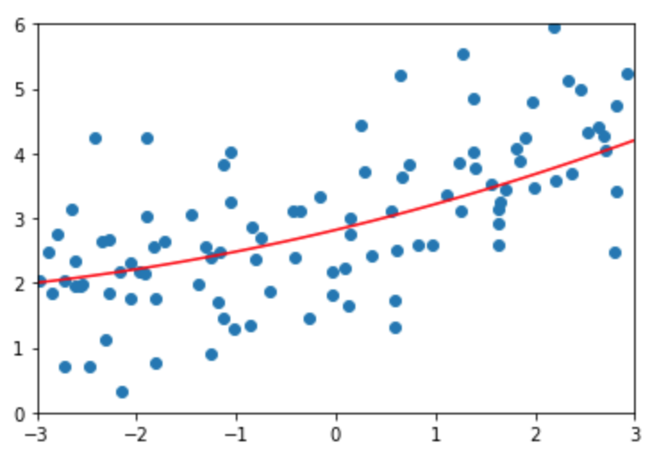

当 `alpha =1` 时，mse = 1.8408939659515595，均线为接近直线：

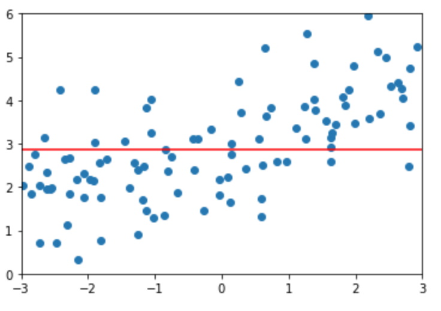

## Ridge 和 LASSO

LASSO 趋向于是的一部分 $\theta$ 值变为0，可以作为特征选择用。所以 LASSO 最终可以辩证一条斜线或者很平滑的曲线；而 Ridge 始终是曲线。

我们可以用下面的方法来理解两种方法的 $\theta$ 变化趋势：

当 $\alpha$ 趋近于无穷时，$J(\theta_{Ridge})$ 的导数（梯度）为：
$$
\Delta(\theta_{Ridge}) = \alpha
\begin{bmatrix}
\theta_1 \\
\theta_2 \\
\dots \\
\theta_n
\end{bmatrix}
$$
$\theta$ 的变化是一个平缓的过程，$\theta$ 始终是有值的。

而 $J(\theta_{LASSO})$ 的导数（梯度）为：
$$
\Delta(\theta_{Ridge}) = \alpha
\begin{bmatrix}
sign(\theta_1) \\
sign(\theta_2) \\
\dots \\
sign(\theta_n)
\end{bmatrix}
sign(x)=
\begin{cases}
1, x>0 \\
0, x=0 \\
-1, x<0
\end{cases}
$$
$\theta$ 的变化并不是一个线性的过程，所有有些 $\theta$ 可能先变成 0。

某个向量的范数 $L_p$公式为：
$$
\|X\|_p=(\sum_{i=1}^n|X_i|^p)^{\frac 1 p}
$$
当 $p=1$ 时，称为 $L_1$ 范数，即 0 点到 $X_i$ 的曼哈顿距离；当 $p=2$ 时，称为 $L_2$ 范数，即 0 点到  $X_i$ 的欧氏距离。

岭回归正则项 $\sum_{i=1}^n\theta^2$，称为 $L_2$ 正则项，有时也叫 $L_2$ 范数，省略了根号。

LASSO 添加的正则项 $\sum_{i=1}^n|\theta_i|$，称为 $L_1$ 正则项或者 $L_1$ 范数。

一次类推，理论上有 $L_n$ 正则项，但实际不常用。

$L_0$ 正则项添加的是 $\theta$ 不为 0 的个数，即让 $\theta$ 的个数尽可能少：
$$
J(\theta)=MSE(y, \bar y;\theta) + min(number\ of \ none\ zero\ \theta)
$$
实际  $L_0$ 很少使用，因为 $L_0$ 正则的优化是一个 NP 难的问题。通常使用 $L_0$ 来取代。

### 弹性网 Elastic Net

弹性网结合岭回归和 LASSO 回归的优势，对应用的正则项为岭回归和 LASSO 回归的的比例和。
$$
J(\theta)= MSE(y, \hat y;\theta)+ \gamma\alpha\sum_{i=1}^n|\theta_i|  + (1-\gamma)\frac 1 2\sum_{i=1}^n|\theta_i|
$$
岭回归的计算结果相对准确，但是如果特征量太大，无法降维；而 LASSO 可以降维，但也可能错误降维。在进行模型正则化的过程中，通常先尝试岭回归，如果特征数比较多，则选择弹性网。因为 LASSO 回归太急于将某些 $\theta$ 化为 0。

## 工具

- [LaTeX/Mathematics - Wikibooks, open books for an open world](https://en.wikibooks.org/wiki/LaTeX/Mathematics)
- [Play-with-Machine-Learning-Algorithms: Code of my MOOC Course](https://github.com/liuyubobobo/Play-with-Machine-Learning-Algorithms)

