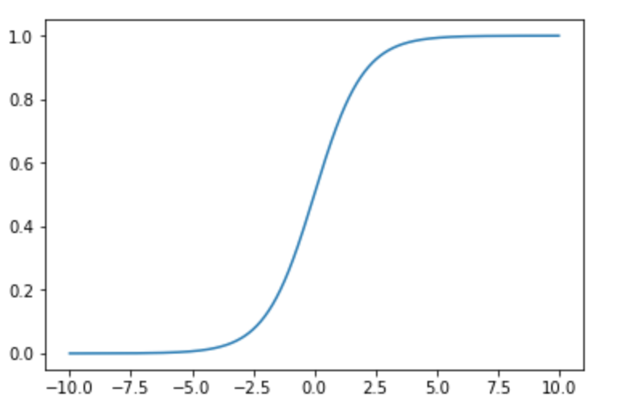
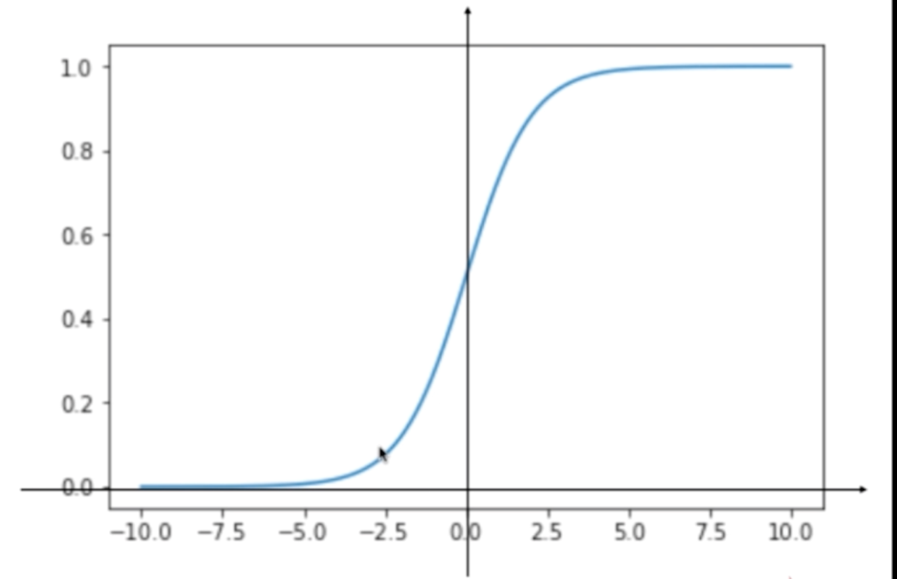

## 逻辑回归

逻辑回归是诸多机器学习算法中使用最多的算法。逻辑回归用于解决分类问题，方法是降样本的特征与样本发生的概率联系起来，逻辑是一个数，所以该方程称为逻辑回归。
$$
\hat p = f(x) \quad \hat y = 
\begin{cases}
1, \hat p\geq0.5  \\
0, \hat p\leq0.5 
\end{cases}
$$
其中，$\hat p$ 为计算得到的概率，$\hat y$ 根据概率来实现二分类。

在线性回归中，$\hat y = f(x) = \theta^T \cdot x_b$。$\hat y$ 的值域为 $(-\infin, +\infin)$，我们可以通过一个函数 $\hat p = \sigma(\theta^T \cdot x_b)$ 将值域限定在 [0, 1] 之间。其中，该 $\sigma$ 函数称为 Sigmoid 函数：
$$
\sigma(t)=\frac 1 {1+e^{-t}}
$$
整个模型可以定义为：
$$
\begin{align*}
& \hat p = \sigma(\theta^T \cdot x_b)=\frac 1 {1+e^{-\theta^T\cdot x_b}} \\
&y = 
\begin{cases}
1, \hat p\geq0.5  \\
0, \hat p\leq0.5 
\end{cases}
\end{align*}
$$


我们用代码来实现 Sigmoid 函数的曲线绘制：

```python
import numpy as np
import matplotlib.pyplot as plt

def sigmoid(t):
    return 1. / (1. + np.exp(-t))
```

```python
x = np.linspace(-10, 10, 500)

plt.plot(x, sigmoid(x))
plt.show()
```



Sigmoid 曲线有如下几个性质：

- 值域为 (0, 1)
- t>0 时，p >0.5
- t<0 时，p < 0.5
- t=0 时，p = 0.5



## 工具

- [LaTeX/Mathematics - Wikibooks, open books for an open world](https://en.wikibooks.org/wiki/LaTeX/Mathematics)
- [Play-with-Machine-Learning-Algorithms: Code of my MOOC Course](https://github.com/liuyubobobo/Play-with-Machine-Learning-Algorithms)

