## 逻辑回归

逻辑回归是诸多机器学习算法中使用最多的算法。逻辑回归用于解决分类问题，方法是降样本的特征与样本发生的概率联系起来，逻辑是一个数，所以该方程称为逻辑回归。
$$
\hat p = f(x) \quad \hat y = 
\begin{cases}
1, \hat p\geq0.5  \\
0, \hat p\lt0.5 
\end{cases}
$$
其中，$\hat p$ 为计算得到的概率，$\hat y$ 根据概率来实现二分类。

在线性回归中，$\hat y = f(x) = \theta^T \cdot x_b$。$\hat y$ 的值域为 $(-\infin, +\infin)$，我们可以通过一个函数 $\hat p = \sigma(\theta^T \cdot x_b)$ 将值域限定在 [0, 1] 之间。其中，该 $\sigma$ 函数称为 Sigmoid 函数：
$$
\sigma(t)=\frac 1 {1+e^{-t}}
$$
整个模型可以定义为：
$$
\begin{align*}
& \hat p = \sigma(\theta^T \cdot x_b)=\frac 1 {1+e^{-\theta^T\cdot x_b}} \\
& \hat y = 
\begin{cases}
1, \hat p\geq0.5  \\
0, \hat p\lt0.5 
\end{cases}
\end{align*}
$$


我们用代码来实现 Sigmoid 函数的曲线绘制：

```python
import numpy as np
import matplotlib.pyplot as plt

def sigmoid(t):
    return 1. / (1. + np.exp(-t))
```

```python
x = np.linspace(-10, 10, 500)

plt.plot(x, sigmoid(x))
plt.show()
```


Sigmoid 曲线有如下几个性质：

- 值域为 (0, 1)
- t>0 时，p >0.5
- t<0 时，p < 0.5
- t=0 时，p = 0.5


## 损失函数

逻辑回归模型的一个样本的损失函数的定义如下：
$$
\begin{align*}
cost &= 
\begin{cases}
如果 y = 1, p 越小, cost 越大 \\
如果 y = 0, p 越大，cost 越大
\end{cases} \\
&=
\begin{cases}
-log(\hat p) \quad\quad if\ y=1\\
-log(1-\hat p)\ if\ y=0
\end{cases}\\
&= -ylog(\hat p) - (1-y)log(1-\hat p)
\end{align*}
$$
log 函数的曲线为：

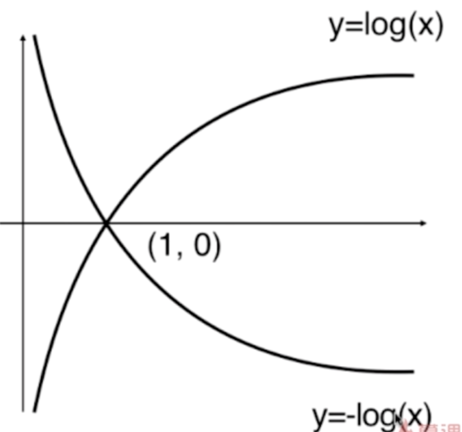

$\hat p$ 的值域范围为 [0, 1]，cost 函数的曲线为：

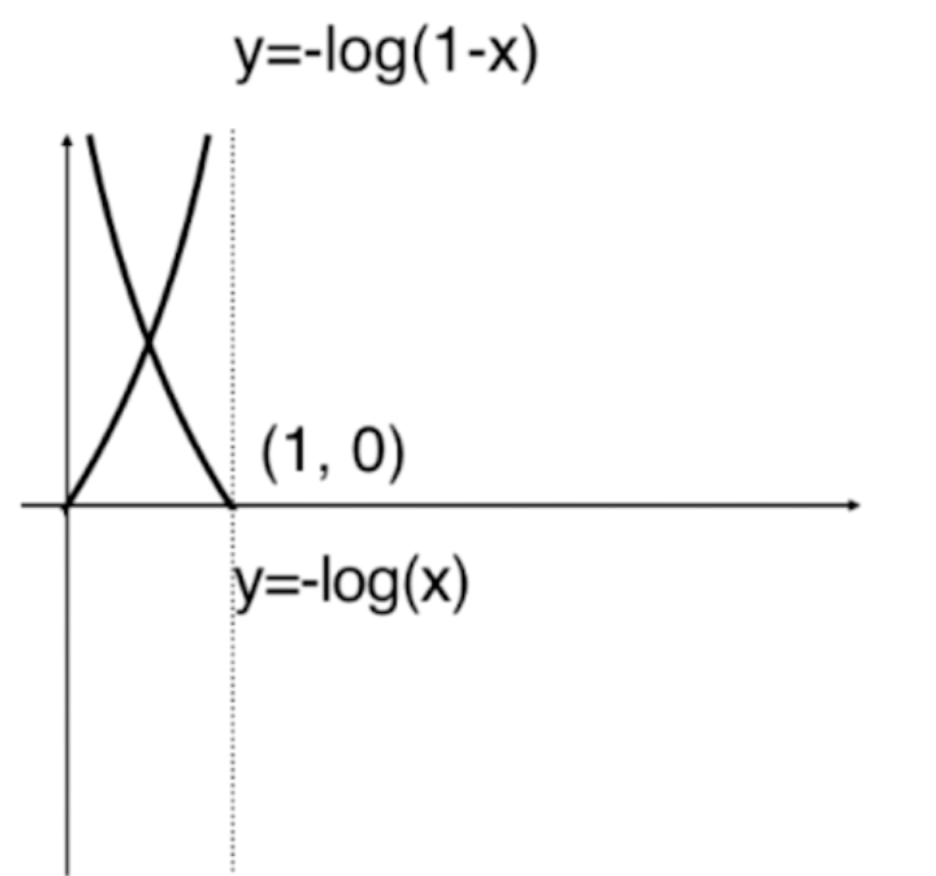

整个样本空间的损失函数：
$$
\begin{align*}
J(\theta)&=-\frac 1 m \sum_{i=1}^m\Big(y^{(i)}log(\hat p ^{(i)})+(1-y^{(i)})log(1-\hat p^{(i)})\Big) \\
&=-\frac 1 m \sum_{i=1}^m\Big(y^{(i)}log\big(\sigma (X_b^{(i)}\theta)\big)+(1-y^{(i)})log\big(1-\sigma(X_b^{(i)}\theta)\big)\Big)
\end{align*}
$$
这个损失函数的梯度没有类似线性回归中的正规方程公式解（数学解析解），但是可以用梯度下降法来求解。

## 梯度

下面来求 $J(\theta)$ 的导数
$$
\Delta J(\theta)=
\begin{bmatrix}
\frac {\delta J} {\delta \theta_0} \\
\frac {\delta J} {\delta \theta_1} \\
\frac {\delta J} {\delta \theta_2} \\
\dots \\
\frac {\delta J} {\delta \theta_n} \\
\end{bmatrix}
$$


我们先求 $\sigma(t)$ 的导数：
$$
\begin{align*}
& \sigma(t)=\frac 1 {1 + e^{-t}}=(1+e^{-t})^{-1} \\
&\sigma(t)'=-(1 + e^{-t})^{-2}\cdot e^{-t}\cdot(-1)=(1 + e^{-t})^{-2}\cdot e^{-t}
\end{align*}
$$
$log\sigma(t)$ 的导数：
$$
\begin{align*}
(log\sigma(t))'&=\frac 1 {\sigma(t)}\cdot\sigma(t)'=\frac 1 {\sigma(t)}\cdot (1 + e^{-t})^{-2}\cdot e^{-t}\\
&=\frac 1 {(1+e^{-t})^{-1}}\cdot (1 + e^{-t})^{-2}\cdot e^{-t}=(1 + e^{-t})^{-1}\cdot e^{-t}\\
&=\frac {e^{-t}} {(1 + e^{-t})} = \frac {1+e^{-t}-1} {(1 + e^{-t})}=1-\frac {1} {(1 + e^{-t})}\\
&=1-\sigma(t)
\end{align*}
$$
同理，$log(1-\sigma(t))$ 的导数：
$$
\begin{align*}
log(1-\sigma(t))'
&=\frac 1 {1-\sigma(t)}\cdot(-1)\cdot\sigma(t)'=-\frac 1 {1-\sigma(t)}\cdot (1 + e^{-t})^{-2}\cdot e^{-t}\\
&=-\frac 1 {1-\frac 1 {1+e^{-t}}}\cdot(1 + e^{-t})^{-2}\cdot e^{-t}\\
&=-\frac {1+e^{-t}} {e^{-t}}\cdot(1 + e^{-t})^{-2}\cdot e^{-t} \\
&=-(1 + e^{-t})^{-1}=-\sigma(t)
\end{align*}
$$
$J(\theta)$ 对 $\theta_j$ 求导：
$$
\begin{align*}
J(\theta)’&=-\frac 1 m \sum_{i=1}^m\Big(y^{(i)}log\big(\sigma (X_b^{(i)}\theta)\big)+(1-y^{(i)})log\big(1-\sigma(X_b^{(i)}\theta)\big)\Big)'\\
&=-\frac 1 m \sum_{i=1}^m\Bigg(\Big(y^{(i)}log\big(\sigma (X_b^{(i)}\theta)\big)\Big)'+\Big((1-y^{(i)})log\big(1-\sigma(X_b^{(i)}\theta)\big)\Big)'\Bigg)\\
&=-\frac 1 m \sum_{i=1}^m\Bigg(y^{(i)}(1-\sigma(X_b^{(i)}\theta))\cdot X_j^{(i)}+(1-y^{(i)})\big(-\sigma(X_b^{(i)}\theta)\big)\cdot X_j^{(i)}\Bigg) \\
&=-\frac 1 m \sum_{i=1}^m \Bigg(y^{(i)}X_j^{(i)}-\sigma(X_b^{(i)}\theta)X_j^{(i)}\Bigg)\\
&=\frac 1 m \sum_{i=1}^m \Big(\sigma(X_b^{(i)}\theta)-y^{(i)}\Big)X_j^{(i)}\\
&=\frac 1 m \sum_{i=1}^m \Big(\hat p^{(i)}-y^{(i)}\Big)X_j^{(i)}
\end{align*}
$$
向量化后：
$$
J(\theta)’=\frac 1 m  \cdot X_b^T \cdot (\sigma(X_b\theta)-y)
$$
对比线性回归的导数：$J(\theta)'=\frac 2 m \cdot X_b^T \cdot (X_b\theta - y)$，区别仅在于 $X_b\theta$ 加了 $\sigma$ 函数。

## 实现

可以基于线性回归的梯度下降法来实现逻辑回归算法。需要改变的是 `J`, `dJ`，`predict`，`score`函数的实现。代码参考 [LogisticRegression.py](https://github.com/liuyubobobo/Play-with-Machine-Learning-Algorithms/blob/master/09-Logistic-Regression/04-Implement-Logistic-Regression/playML/LogisticRegression.py)。

我们用鸢尾花数据集来测试算法：

```python
import numpy as np
import matplotlib.pyplot as plt
from sklearn import datasets

iris = datasets.load_iris()
X = iris.data
y = iris.target

# 只取类型为 0, 1 两种花，并且只取前 2 个特征
X = X[y<2,:2]
y = y[y<2]
```

```python
# 分别绘制两种鸢尾花的特征坐标
plt.scatter(X[y==0,0], X[y==0,1], color="red")
plt.scatter(X[y==1,0], X[y==1,1], color="blue")
plt.show()
```

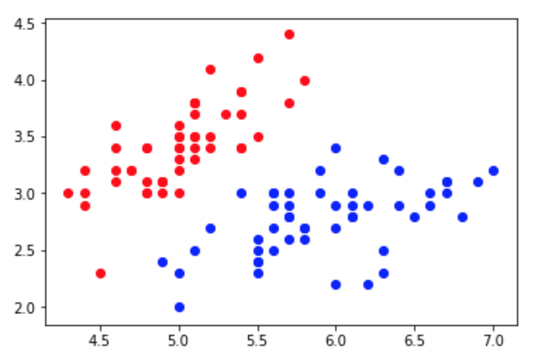

```python
from sklearn.model_selection import train_test_split
from playML.LogisticRegression import LogisticRegression

X_train, X_test, y_train, y_test = train_test_split(X, y, seed=666)

log_reg = LogisticRegression()
log_reg.fit(X_train, y_train)
log_reg.score(X_test, y_test) # 1.0
log_reg.predict_proba(X_test) # 概率
log_reg.predict(X_test) # 预测

log_reg.coef_ # array([ 3.01796521, -5.04447145])
log_reg.intercept_ # -0.6937719272911228
```

## 决策边界

我们上面提到判断分类的条件为：
$$
\begin{align*}
& \hat p = \sigma(\theta^T \cdot x_b)=\frac 1 {1+e^{-\theta^T\cdot x_b}} \\
& \hat y = 
\begin{cases}
1,\quad \hat p\geq0.5,\quad \theta^T \cdot x_b \geq 0   \\
0,\quad\hat p\lt0.5,\quad  \theta^T \cdot x_b \lt 0
\end{cases}
\end{align*}
$$
边界为 $\theta^T \cdot x_b = 0$，我们称之为决策边界。

如果 X 有两个特征，则边界条件为 $\theta_0 + \theta_1 x_1 + \theta_2 x_2=0$，$x_2=\frac {-\theta_0 - \theta_1 x_1} {\theta_2}$。

将关系直线绘制到样本空间：

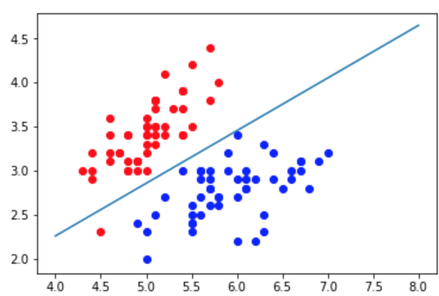

 如果在直接上方，则 $\theta^T \cdot x_b < 0$，对应的 $\hat y=0$； 如果在直接下，则 $\theta^T \cdot x_b > 0$，对应的 $\hat y=$1；如果在直线上方，理论上属于那边都可以，实际很少发生。

决策边界的绘制方法，是在平面内去足够多的点，使用不同的颜色表示不同的分类，不同颜色区域之间的边界，即为决策边界。如：


代码实现为：

```python
def plot_decision_boundary(model, axis):
    
    x0, x1 = np.meshgrid(
        np.linspace(axis[0], axis[1], int((axis[1]-axis[0])*100)).reshape(-1, 1),
        np.linspace(axis[2], axis[3], int((axis[3]-axis[2])*100)).reshape(-1, 1),
    )
    X_new = np.c_[x0.ravel(), x1.ravel()]

    y_predict = model.predict(X_new)
    zz = y_predict.reshape(x0.shape)

    from matplotlib.colors import ListedColormap
    custom_cmap = ListedColormap(['#EF9A9A','#FFF59D','#90CAF9'])
    
    plt.contourf(x0, x1, zz, linewidth=5, cmap=custom_cmap)
```

```python
# 绘制鸢尾花逻辑回归的决策边界
plot_decision_boundary(log_reg, axis=[4, 7.5, 1.5, 4.5])
plt.scatter(X[y==0,0], X[y==0,1])
plt.scatter(X[y==1,0], X[y==1,1])
plt.show()
```

同上，可以可以绘制 kNN 算法的决策边界

```python
from sklearn.neighbors import KNeighborsClassifier

# kNN 算法
knn_clf = KNeighborsClassifier()
knn_clf.fit(X_train, y_train)
knn_clf.score(X_test, y_test)

# 绘制
plot_decision_boundary(knn_clf, axis=[4, 7.5, 1.5, 4.5])
plt.scatter(X[y==0,0], X[y==0,1])
plt.scatter(X[y==1,0], X[y==1,1])
plt.show()
```

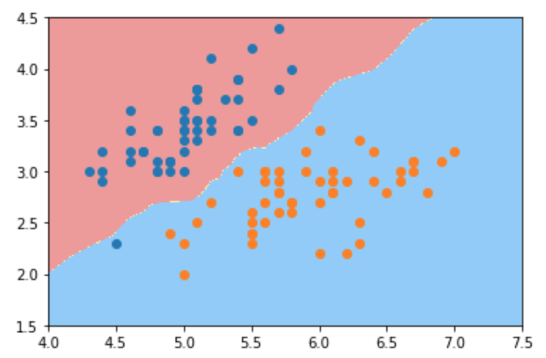

以上我们取得只是鸢尾花的 2 个特征，以及 2 中类型，下面的例子在平面上绘制 2 中特征对应的 4 中类型：

```python
knn_clf_all = KNeighborsClassifier()
knn_clf_all.fit(iris.data[:,:2], iris.target)

plot_decision_boundary(knn_clf_all, axis=[4, 8, 1.5, 4.5])
plt.scatter(iris.data[iris.target==0,0], iris.data[iris.target==0,1])
plt.scatter(iris.data[iris.target==1,0], iris.data[iris.target==1,1])
plt.scatter(iris.data[iris.target==2,0], iris.data[iris.target==2,1])
plt.show()
```

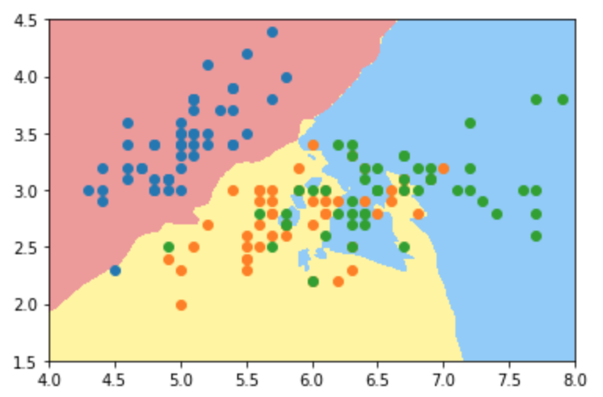

以上曲线比较复杂，甚至有嵌套的关系，这是过拟合的表现，可以通过增加 k 的值来改善过拟合的现象。默认的 k 值为  5，我们将 k 改成 50 后对应的决策边界为：

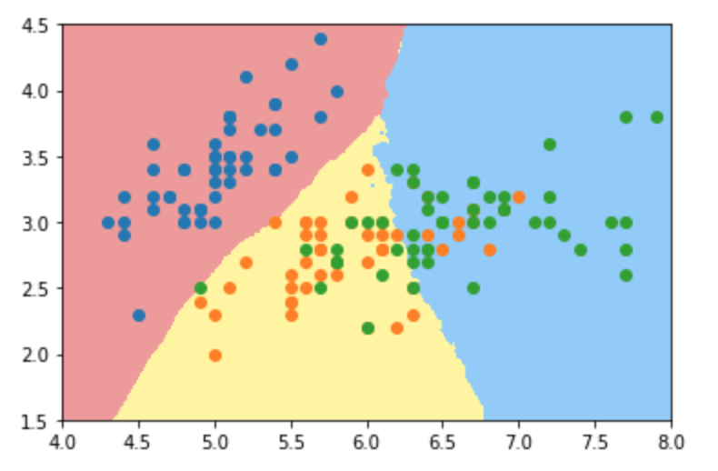

模型的复杂与简单意味着决策边界的清晰与否。

## 多项式特征

在前面的例子中，逻辑回归本质使用的是线性回归的思想，对应的决策边界是直线（或者平面等），无法解决更复杂的决策边界问题，如多边形，圆形，椭圆形，曲线。为此，我们可以引入多项式回归的特征来解决该问题。

比如，要解决如下样本空间的分类问题：

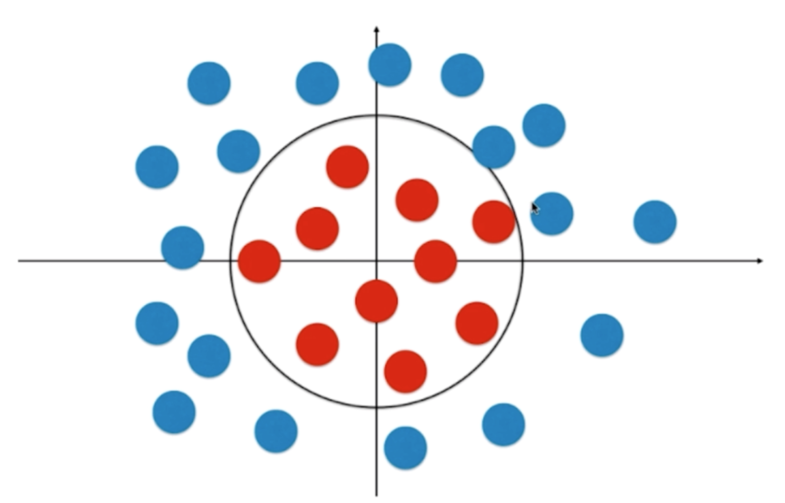


以上这个样本空间的决策边界接近于一个圆形，对应的边界方程为 $x_1^2 + x_2^2 - r^2=0$。我们可以在样本空间中添加二次特征值，再使用线性回归方法求系数和截距。

```python
import matplotlib.pyplot as plt

# 模拟 x1^2 + x^2 < 1.5 的圆
np.random.seed(666)
X = np.random.normal(0, 1, size=(200, 2))
y = np.array((X[:,0]**2+X[:,1]**2)<1.5, dtype='int')

plt.scatter(X[y==0,0], X[y==0,1])
plt.scatter(X[y==1,0], X[y==1,1])
plt.show()
```

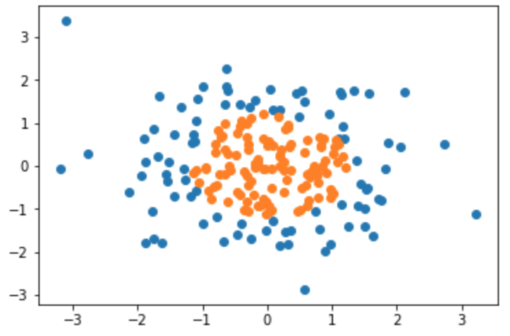

```python
from playML.LogisticRegression import LogisticRegression

# 使用逻辑回归来训练模型
log_reg = LogisticRegression()
log_reg.fit(X, y)
log_reg.score(X, y) # 0.60499999999999998
```

准确率仅为 60.5%，绘制决策边界：

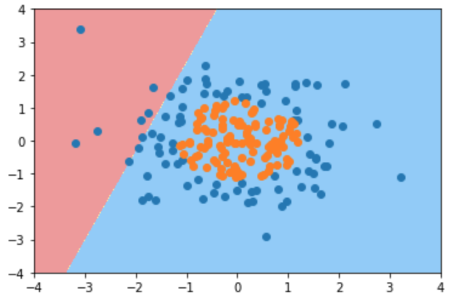

下面我们添加  `degree=2` 的多项式：

```python
from sklearn.preprocessing import PolynomialFeatures
from sklearn.pipeline import Pipeline
from sklearn.preprocessing import StandardScaler

def PolynomialLogisticRegression(degree):
    return Pipeline([
        ('poly', PolynomialFeatures(degree=degree)),
        ('std_scaler', StandardScaler()),
        ('log_reg', LogisticRegression())
    ])
```

```python
poly_log_reg = PolynomialLogisticRegression(degree=2)
poly_log_reg.fit(X, y)

poly_log_reg.score(X, y) # 0.94999999999999996
```

对应的决策边界为：

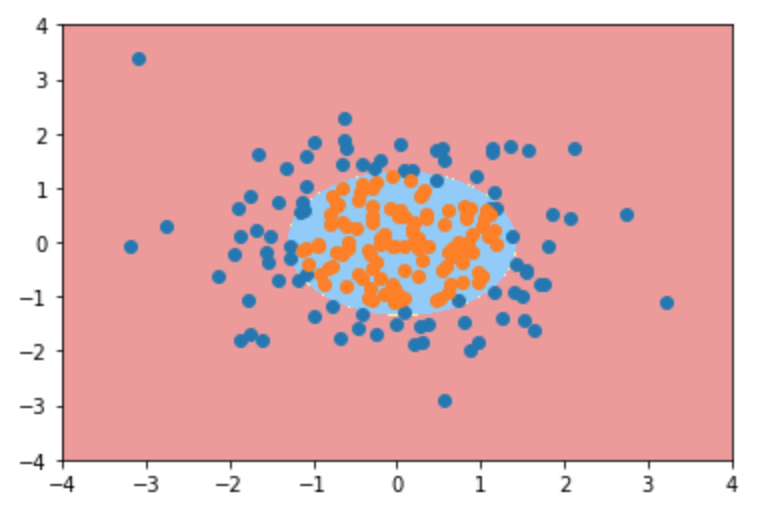

如果 `degree=20`，则对应的决策边界为：

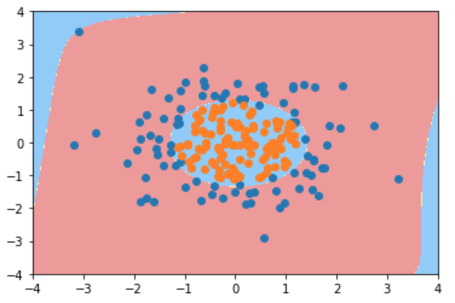

显然，改模型过拟合了，可以通过降低 degree 值或正则化来优化。

## 正则化

在多项式回归中，正则化方法岭回归和 RASSO 回归可以简单描述为：
$$
\begin{align*}
& J(\theta) + \alpha L_2 \\
& J(\theta) + \alpha L_1
\end{align*}
$$
在 sklearn 中，超参数加在损失函数上：
$$
\begin{align*}
& C\cdot J(\theta) + L_2 \\
& C\cdot J(\theta) + L_1
\end{align*}
$$
这样限制了 $L_1$ 和 $L_2$ 不能为 0。

下面我们用 sklearn 中风中的逻辑回归算法来实现多项式回归的正则化：

```python
import numpy as np
import matplotlib.pyplot as plt
from sklearn.model_selection import train_test_split

np.random.seed(666)
X = np.random.normal(0, 1, size=(200, 2))
# z=x^2+y
y = np.array((X[:,0]**2+X[:,1])<1.5, dtype='int')
# 添加 20 个噪音
for _ in range(20):
    y[np.random.randint(200)] = 1
    
X_train, X_test, y_train, y_test = train_test_split(X, y, random_state=666)
```

对应的样本空间为：

```python
plt.scatter(X[y==0,0], X[y==0,1])
plt.scatter(X[y==1,0], X[y==1,1])
plt.show()
```

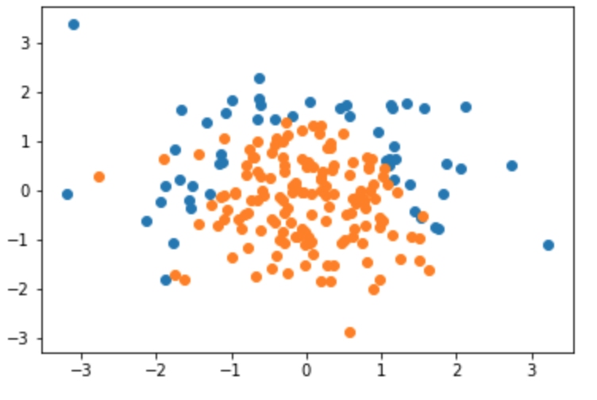

```python
from sklearn.linear_model import LogisticRegression

# 逻辑回归。使用线性回归思想，默认的正则项 penalty='l2', C =1.0
log_reg = LogisticRegression()
log_reg.fit(X_train, y_train)

log_reg.score(X_train, y_train) # 0.79333333333333333
log_reg.score(X_test, y_test) # 0.85999999999999999
```

决策边界为：

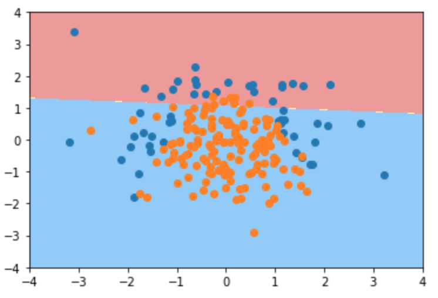

```python
from sklearn.preprocessing import PolynomialFeatures
from sklearn.pipeline import Pipeline
from sklearn.preprocessing import StandardScaler

# 多项式回归
def PolynomialLogisticRegression(degree, C=1.0, penalty='l2'):
    return Pipeline([
        ('poly', PolynomialFeatures(degree=degree)),
        ('std_scaler', StandardScaler()),
        ('log_reg', LogisticRegression(C=C, penalty=penalty))
    ])
```

```python
# degree = 2
poly_log_reg = PolynomialLogisticRegression(degree=2)
poly_log_reg.fit(X_train, y_train)

poly_log_reg.score(X_train, y_train) # 0.9133333333333333
poly_log_reg.score(X_test, y_test) # 0.93999999999999995
```

对应的决策边界：

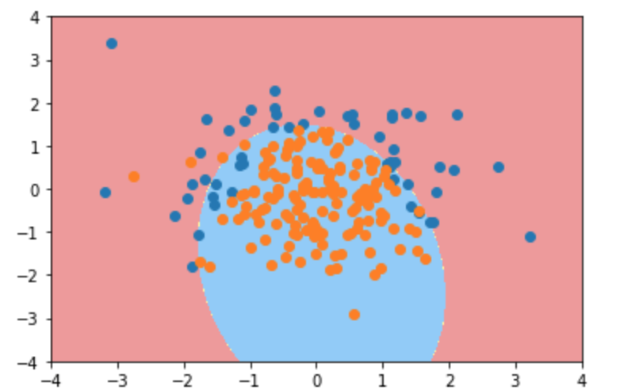

`degree=20`对应的训练数据的准确度 0.93999999999999995，测试数据的准确度 0.92000000000000004，决策边界为：

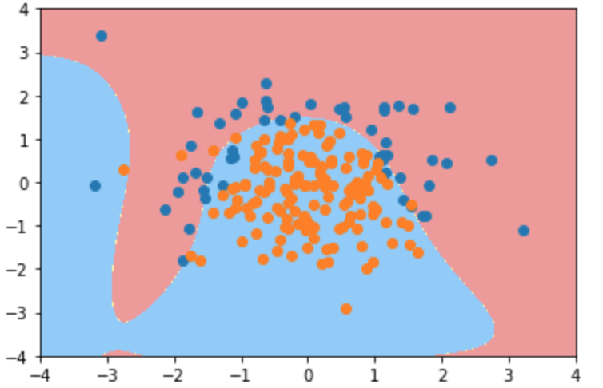

`degree=20, C=0.1` 对应的决策边界：

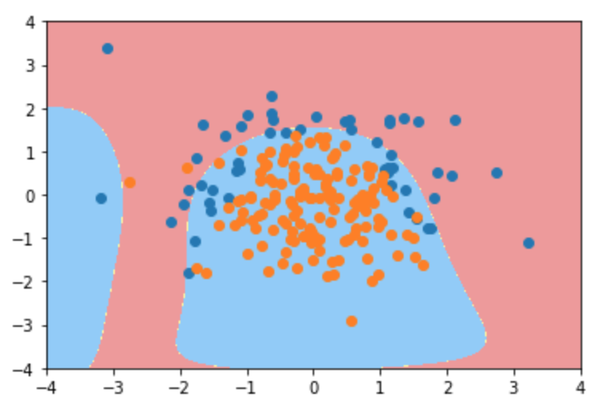

`degree=20, C=0.1, penalty='l1'`的决策边界：

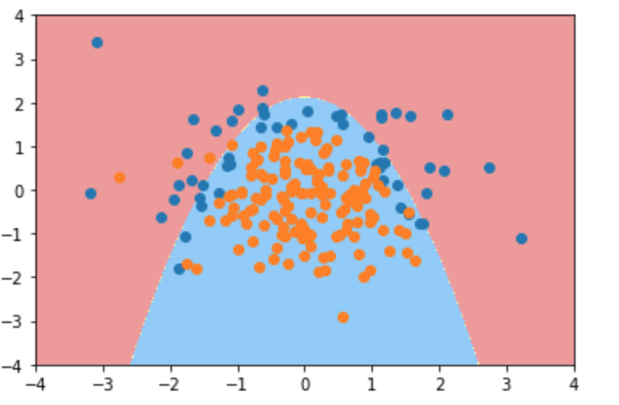

## 多分类

逻辑回归理论上只能解决二分类问题，但可以引入 OvR 和 OvO 两种方法来解决多分类问题。OvO 用时较多，但其分类结果更准确，因为每一次二分类时都用真实的类型进行比较，没有混淆其它的类别。

### OvR（One vs Rest）

n 种类型的样本进行分类时，**分别**取一种样本作为一类，将剩余的所有类型的样本看做另一类，这样就形成了 **n 个**二分类问题，使用逻辑回归算法对 n 个数据集训练出 n 个模型，将待预测的样本传入这 n 个模型中，所得概率最高的那个模型对应的样本类型即认为是该预测样本的类型。

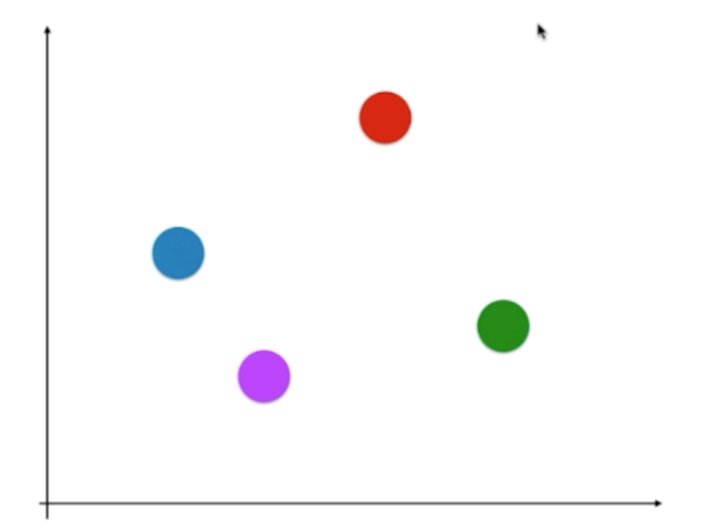

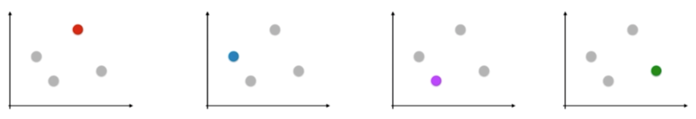

预测新的样本点是，分别计算 n 类别就进行 n 次分类。如果处理一个二分类问题用时 T，此方法需要用时 nT。

### OvO （One vs One）

n 类样本中，每次挑出 2 种类型，两两结合，一共有 $C_n^2$ 种二分类情况，训练得到 $C_n^2$  种模型。预测样本类型，有 $C_n^2$ 个预测结果，挑选概率最高的分类作为预测类型。

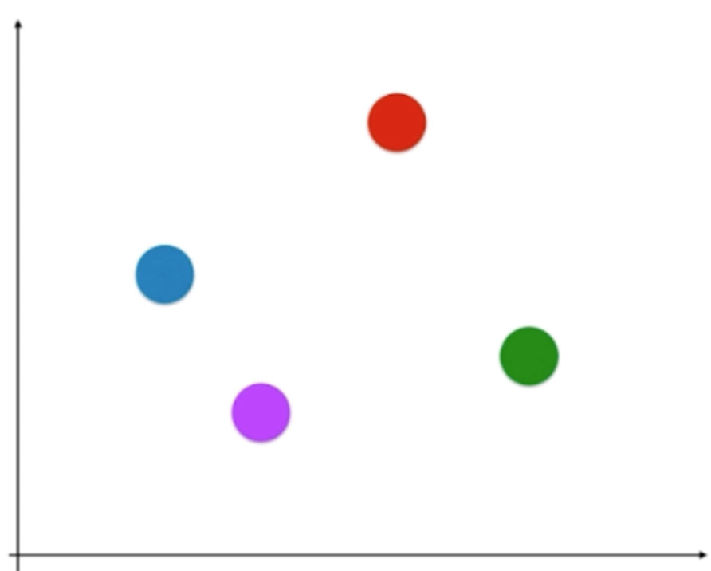

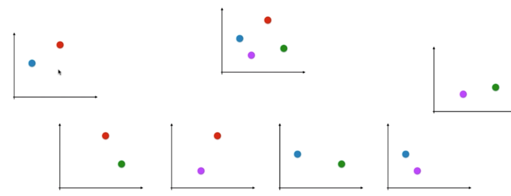

如果处理一个二分类问题用时 T，此方法需要用时 $C_n^2 \cdot T = \frac {n*(n - 1)}2 \cdot T$。

### 实现

sklearn 的逻辑回归算法集成了多分类参数，下面我们用鸢尾花的例子来实现多分类：

```python
import numpy as np
import matplotlib.pyplot as plt
from sklearn import datasets
from sklearn.model_selection import train_test_split
from sklearn.linear_model import LogisticRegression

iris = datasets.load_iris()
# 为了数据的可视化，我们只是用其中的 2 个特征
X = iris.data[:,:2]
y = iris.target
X_train, X_test, y_train, y_test = train_test_split(X, y, random_state=666)

# 逻辑回归提供默认的多分类参数 multi_class='ovr', solver='liblinear'
log_reg = LogisticRegression()
log_reg.fit(X_train, y_train)

log_reg.score(X_test, y_test) # 0.65789473684210531
```

对应的决策边界为：

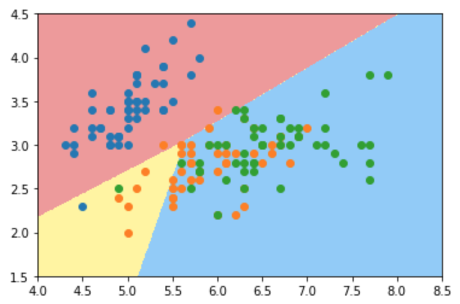

```python
# 改成 ovo
log_reg2 = LogisticRegression(multi_class="multinomial", solver="newton-cg")
log_reg2.fit(X_train, y_train)
log_reg2.score(X_test, y_test) # 0.78947368421052633
```

对应的决策边界为：

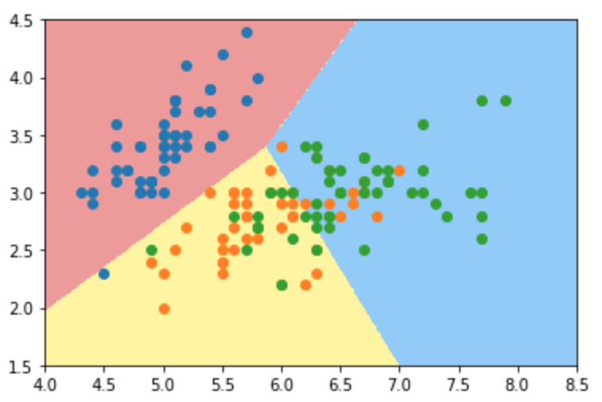

使用完整数据集会答复提高训练的准确度和测试准确度。

除了逻辑回归中集成的 OvO 和 OvR，sklearn 也单独提供了两种分类算法。

```python
from sklearn.multiclass import OneVsRestClassifier

# OvR 分类
ovr = OneVsRestClassifier(log_reg)
ovr.fit(X_train, y_train)
ovr.score(X_test, y_test) # 0.94736842105263153
```

```python
from sklearn.multiclass import OneVsOneClassifier

# OvO 分类
ovo = OneVsOneClassifier(log_reg)
ovo.fit(X_train, y_train)
ovo.score(X_test, y_test) #1.0
```

## 工具

- [LaTeX/Mathematics - Wikibooks, open books for an open world](https://en.wikibooks.org/wiki/LaTeX/Mathematics)
- [Play-with-Machine-Learning-Algorithms: Code of my MOOC Course](https://github.com/liuyubobobo/Play-with-Machine-Learning-Algorithms)

