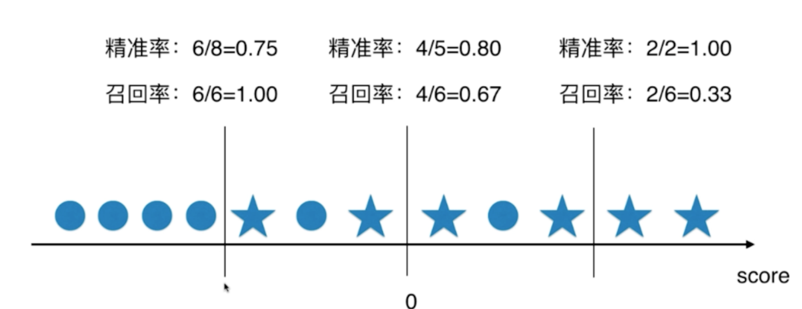
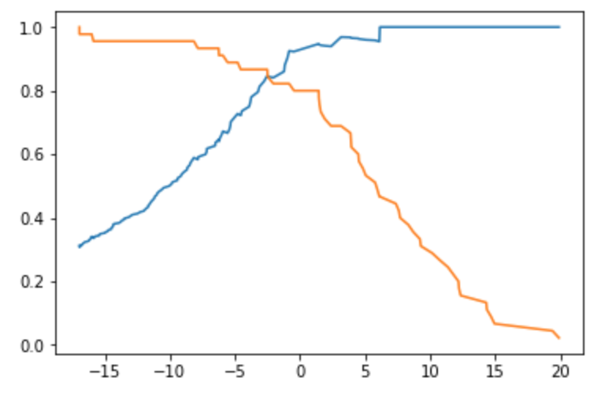
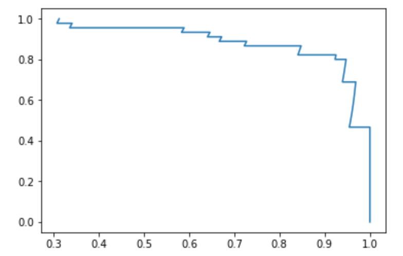
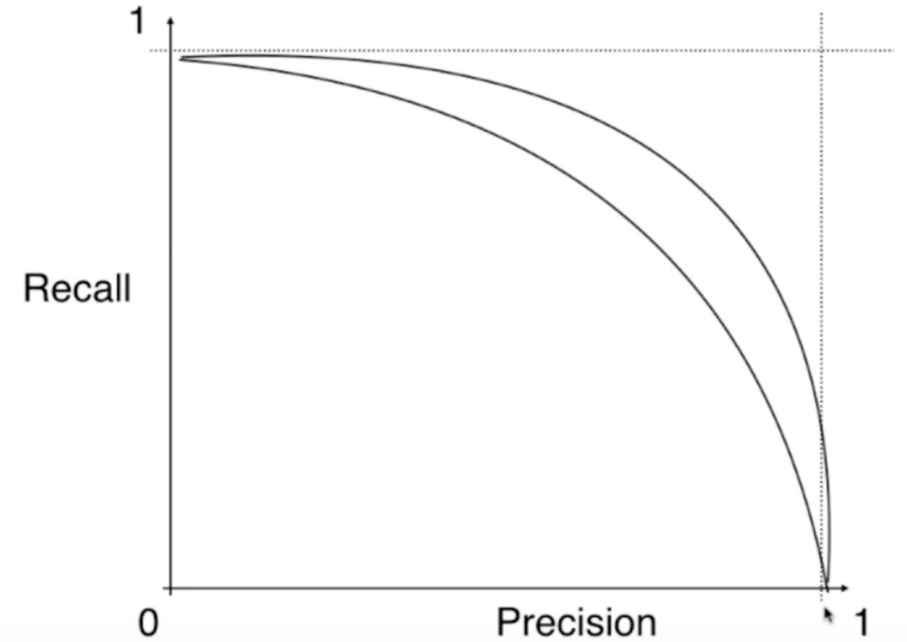
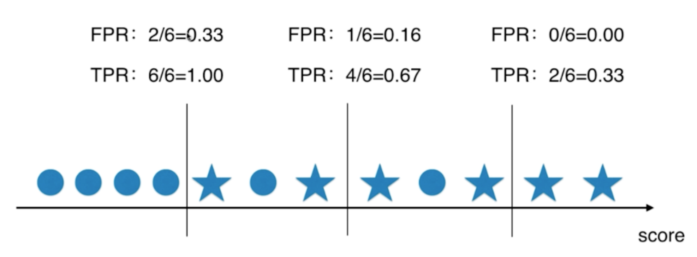
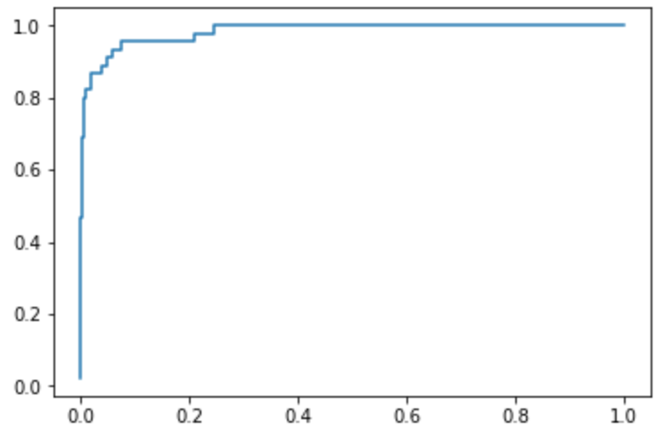
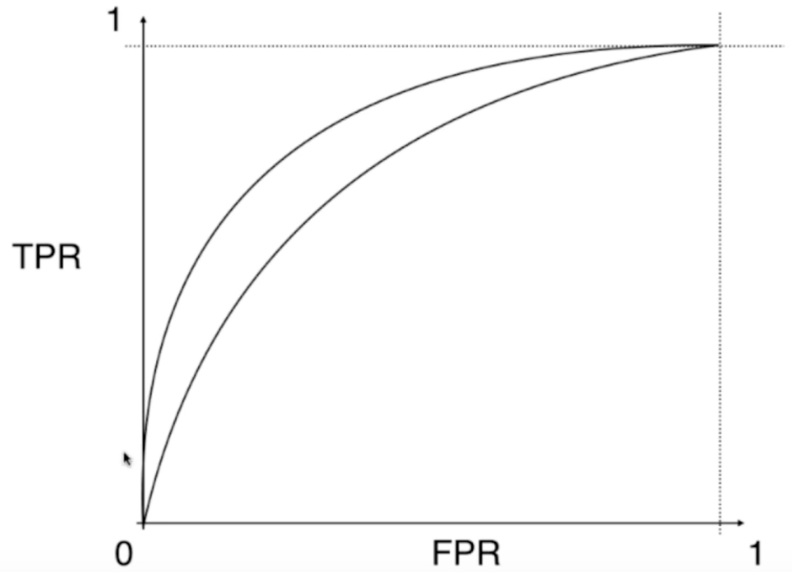
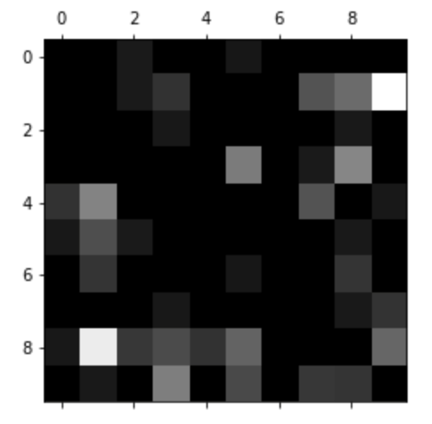

## 混淆矩阵

在线性回归算法中提到，回归模型的评价方法有MSE，RMSE，MAE，$R^2$，而目前为止，分类问题的算法我们只用分类准确度来评价。 但分类准确度在某些场景下是有问题的，比如在一个癌症预测系统中，根据体检信息来判断是否有癌症。假如癌症产生的概率只有 0.1%，预测所有人都健康的，准确率已经达到了 99.9%，如果预测系统预测的准确率为 99.9%，则预测系统毫无意义；如果癌症产生的概率为 0.01%，预测所有人都健康，准确率已经达到 99.99%，99.9% 的准确率毫无意义。

因此，对于极度偏斜的数据（Skewed Data，数据极度偏斜到某一个类别），只使用分类准确度是不够的，我们可以使用混淆矩阵（Confusion Matrix）来评价这种极度偏斜数据。

二分类问题对应的混淆矩阵为：

- 0 - Negative，通常指大概率事情；1 - Positive，指的是我们关注的事情。
- 行代表真实值，列代表预测值

| 真实/预测 | 0                              | 1                             |
| --------- | ------------------------------ | ----------------------------- |
| 0         | TN。预测 Negative 正确的数量。 | FP。预测 Postive 错误的数量。 |
| 1         | FN。                           | TP。                          |

## 精准率和召回率

下面是 10000 个人群的癌症预测样本：

| 真实/预测 |      0      |     1     |
| :-------: | :---------: | :-------: |
|     0     | 9978 <BR>TN | 12 <BR>FP |
|     1     |   2<BR>FN   |  8<BR>TP  |

$$
精准率 = \frac {TP} {TP+FP}= \frac 8 {8+2}=40\%
$$

*精准率（precision）*指的是在预测值为 `1` 的数据中，预测正确的概率。对于癌症样本来说，在模型预测有20 个人患癌，但只有 8 人真正患癌，则精准率为 40%。$精准率 = \frac {TP} {TP+FP}$。

*召回率（recall）*指的是在真实值为 `1` 的数据中，成功预测的概率。对于癌症样本来说，有 10 个真正患癌的人中，模型预测了 8 个，则召回率为 80%。 $召回率=\frac {TP} {TP+FN}$。

评价模型时，要根据实际应用场景决定使用精准率和召回率。比如股票预测应该使用精准率来评价，更注重预测股涨的股票命中精准度，而不是尽可能预测所有涨股；而在医疗领域，更注重召回率而非精准率，目的是尽可能预测出所有真正患病的人；还有一些情况下需要同时注重精准率和召回率，对于这种情况我们使用 F1 Score 方法。


在 10000 个癌症样本中，患癌的概率为 0.1%，假如模型预测所有人都是健康的，则对应的混淆矩阵为：

| 真实/预测 |      0      |    1     |
| :-------: | :---------: | :------: |
|     0     | 9990 <BR>TN | 0 <BR>FP |
|     1     |  10<BR>FN   | 0<BR>TP  |

准确率=99.9%，精准率=0/(0+0)=0，召回率=0/(10+0)=0。这样的预测模型是无意义的。


使用 sklearn 计算精准率和准确率：

```python
from sklearn.metrics import confusion_matrix
from sklearn.metrics import precision_score
from sklearn.metrics import recall_score

# 混淆矩阵
confusion_matrix(y_test, y_log_predict)
# 准确率
precision_score(y_test, y_log_predict)
# 召回率
recall_score(y_test, y_log_predict)
```

## F1 Score

F1 Score 同时兼顾精准率和召回率，是精准率和召回率的调和平均值。
$$
F1 = \frac {2\cdot precision \cdot recall} {precision + recall}
$$
调和平均值指的是倒数的平均值，定义如下：
$$
\frac 1 {F1} = \frac 1 2(\frac 1 {precision} + \frac 1 {recall})
$$
调和平均值可以保证两个值均比较高的时候取得值才比较高；如果一个值特别高，另一个值特别低，取得值也是比较低。

sklearn 计算 F1 Score：

```python
from sklearn.metrics import f1_score

f1_score(y_test, y_predict)
```

## Threshold

在逻辑回归中，定义逻辑边界为 $\theta^T \cdot x_b = 0$，我们可以引入超参数 threshold 来平移决策边界 $\theta^T \cdot x_b = threshoud$。
$$
\hat y = 
\begin{cases}
1,\quad \theta^T \cdot x_b \geq threshould   \\
0,\quad  \theta^T \cdot x_b \lt threshould
\end{cases}
$$
在其他算法中，通常可以调整这个阈值来调整边界。通过调整边界，精准率和召回率也会相应的调整。下面的例子中，我们在 0 两侧调整阈值，分别计算相应的精准率和召回率：



精准率和召回率是此消彼长的关系。为了提高精准率，需要提高阈值，有些 `y=1`的样本被排除，从而降低召回率；为了提高召回率，需要降低阈值，有些 `y=0` 的样本也能被预测为 `y=1`，从而降低精准率。

```python
import numpy as np
import matplotlib.pyplot as plt
from sklearn import datasets
from sklearn.model_selection import train_test_split
from sklearn.linear_model import LogisticRegression
from sklearn.metrics import confusion_matrix
from sklearn.metrics import precision_score
from sklearn.metrics import recall_score

digits = datasets.load_digits()
X = digits.data
y = digits.target.copy()

# 让数据偏斜
y[digits.target==9] = 1
y[digits.target!=9] = 0
X_train, X_test, y_train, y_test = train_test_split(X, y, random_state=666)

# 逻辑回归预测
log_reg = LogisticRegression()
log_reg.fit(X_train, y_train)
y_predict = log_reg.predict(X_test)

# score = 0
precision_score(y_test, y_predict) # 0.94736842105263153
recall_score(y_test, y_predict) # 0.80000000000000004

# 获取 score = \theta · x 的值
decision_scores = log_reg.decision_function(X_test)
# 调整阈值为 5，提高精准率
y_predict_2 = np.array(decision_scores >= 5, dtype='int')
precision_score(y_test, y_predict_2) # 0.95999999999999996
recall_score(y_test, y_predict_2) # 0.53333333333333333

# 调整阈值为 -5，提高召回率
y_predict_3 = np.array(decision_scores >= -5, dtype='int')
precision_score(y_test, y_predict_2) # 0.72727272727272729
recall_score(y_test, y_predict_2) # 0.88888888888888884
```

## 精确率召回率曲线

为了直观体现精确率和召回率，我们可以绘制精确率曲线、召回率曲线和精确率召回率曲线。其中精确率召回率曲线（Precision-Recall Curve）是以精确率作为横轴，召回率作为纵轴的曲线。

```python
import numpy as np
import matplotlib.pyplot as plt
from sklearn.metrics import precision_recall_curve

precisions, recalls, thresholds = precision_recall_curve(y_test, decision_scores)
```

```python
# 精确率曲线和召回率曲线
# precisions 和 recalls 的最后一个值是 1 和 0，并且没有相应的阈值，这样是为了让图形从 y 轴开始。
plt.plot(thresholds, precisions[:-1])
plt.plot(thresholds, recalls[:-1])
plt.show()
```




通过这个图，我们可以找精确率在 95% 或者召回率在 95% 的阈值。

```
plt.plot(precisions, recalls)
plt.show()
```



通过这个图体现精确率和召回率的变化关系，最好的阈值在召回率出现拐点，即开始急剧下降的那个点。

如果两种模型对应的 PR 曲线如下图，外面的那条曲线对应的模型更优，因为同一个阈值，对应的精确度和召回率都更大。因此，PR 曲线也可以作为评价算法模型的一种方法。通常，我们可以用曲线的面积来量化曲线对应模型的优劣，但通常用 ROC 曲线的面积来衡量。



## ROC 曲线

ROC 曲线对应的英文为 Receiver Operation Characteristic Curve，是统计学上的一个术语，描述 TPR 和 FPR 之间的关系。

| 真实/预测 |      0      |    1     |
| :-------: | :---------: | :------: |
|     0     | 9990 <BR>TN | 0 <BR>FP |
|     1     |  10<BR>FN   | 0<BR>TP  |

$$
\begin {align*}
& TPR = 召回率 = \frac {TP} {TP + FN} \\
& FPR = \frac {FP} {TN + FP}
\end {align*}
$$

TPR 与 FPR 的关系：



TPR 与 FPR 成正相关。TPR 越大，则需要尽量增加 TP 的值，要提高阈值，而相应的 FP 和 FPR 也会提高。

```python
from sklearn.metrics import roc_curve

fprs, tprs, thresholds = roc_curve(y_test, decision_scores)

plt.plot(fprs, tprs)
plt.show()
```



计算  ROC 的面积 AUC：

```
from sklearn.metrics import roc_auc_score

roc_auc_score(y_test, decision_scores)
```

ROC 和 AUC 对有偏的数据并不敏感，可用于比较模型的优劣。



## 多分类

以上均是二分类问题在讨论，下面我们讨论多分类问题中，混淆矩阵，准确率召回率的求法。

```python
import numpy as np
import matplotlib.pyplot as plt
from sklearn import datasets
from sklearn.model_selection import train_test_split
from sklearn.linear_model import LogisticRegression

digits = datasets.load_digits()
X = digits.data
y = digits.target
X_train, X_test, y_train, y_test = train_test_split(X, y, test_size=0.8, random_state=666)

# 线性回归计算准确率
log_reg = LogisticRegression()
log_reg.fit(X_train, y_train)
log_reg.score(X_test, y_test)
```


```python
from sklearn.metrics import precision_score
from sklearn.metrics import confusion_matrix

# 准确率
precision_score(y_test, y_predict, average="micro")
# 混淆矩阵
cfm = confusion_matrix(y_test, y_predict)
```

```
array([[147,   0,   1,   0,   0,   1,   0,   0,   0,   0],
       [  0, 123,   1,   2,   0,   0,   0,   3,   4,  10],
       [  0,   0, 134,   1,   0,   0,   0,   0,   1,   0],
       [  0,   0,   0, 138,   0,   5,   0,   1,   5,   0],
       [  2,   5,   0,   0, 139,   0,   0,   3,   0,   1],
       [  1,   3,   1,   0,   0, 146,   0,   0,   1,   0],
       [  0,   2,   0,   0,   0,   1, 131,   0,   2,   0],
       [  0,   0,   0,   1,   0,   0,   0, 132,   1,   2],
       [  1,   9,   2,   3,   2,   4,   0,   0, 115,   4],
       [  0,   1,   0,   5,   0,   3,   0,   2,   2, 134]])
```

```python
# 直观汇出错误数据
row_sums = np.sum(cfm, axis=1)
err_matrix = cfm / row_sums
np.fill_diagonal(err_matrix, 0)

plt.matshow(err_matrix, cmap=plt.cm.gray)
plt.show()
```



## 工具

- [LaTeX/Mathematics - Wikibooks, open books for an open world](https://en.wikibooks.org/wiki/LaTeX/Mathematics)
- [Play-with-Machine-Learning-Algorithms: Code of my MOOC Course](https://github.com/liuyubobobo/Play-with-Machine-Learning-Algorithms)

