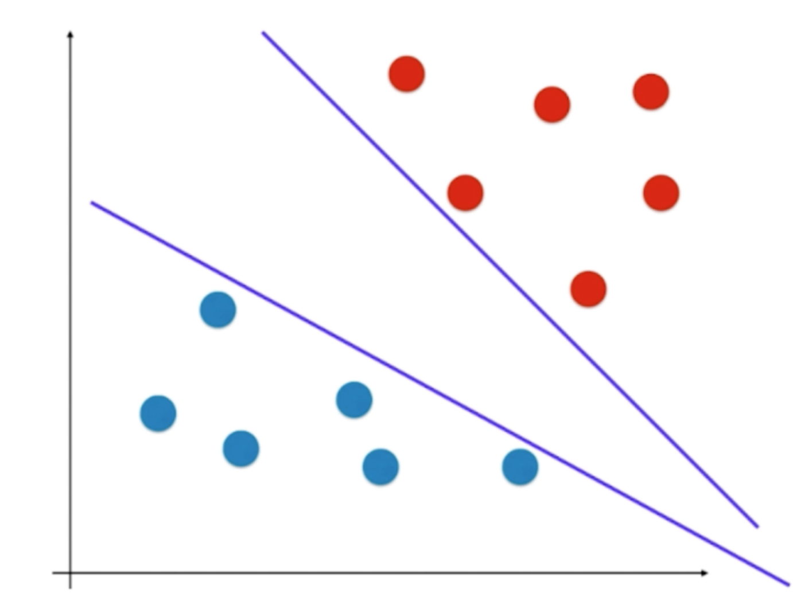

## SVM 几何模型

SVM（支撑向量机） 是 Supported Vector Machine 的缩写。可同时解决分类和回归问题。SVM 尝试寻找一个最优的决策边界，这个边界距离两个类别最近的样本最远。

对于以下分类样本，决策边界不止一个，这称为不适定问题。这两条边界直线对应的模型可能都没有较好的泛化能力，因为两条直线离样本数据太近，离红色比较近的直接可能造成本应该数据红色的点判断为蓝色的点，离蓝色近的直线也有类似的问题。



在逻辑回归中，是通过概率函数（sigmoid）建模的损失函数的最小值来唯一确定决策边界。支撑向量解决这个问题的方法与此不同。SVM 的目的是找到离红色和蓝色的样本点均尽可能较远的边界，从而带来比较好的泛化能力。（背后的统计理论请参考相应资料）


样本中离 SVM 所求的决策边界最近的点均尽可能远，如上图中两个红色和蓝色到边界的具体一样。


与 SVM 决策边界平行，并且经过离边界最近的点称为支撑向量。SVM最优决策边界由这些支撑向量组成一个区域所定义。


支撑向量到决策边界的距离成为 d，支撑向量之间的距离成为 margin，SVM 的目标是最大化 margin, margin = 2d。

SVM 算法的基础是找到支撑向量，我们称可以找到支撑向量的问题为线性可分问题，对应的 SVM 方法称为 Hard Margin SVM。对于一些线性不可分问题，我们可以转化为线性可分问题，这种 SVM 方法称为 Soft Margin SVM。

## Hard Margin 最优化模型

在解析几何中，点 (x, y) 到直接 $Ax + By + C = 0$ 的距离可以表示为：$\frac {|Ax + By + C|} {\sqrt {A^2 + B^2}}$，参考 [推导过程](https://zhuanlan.zhihu.com/p/26307123)。

拓展到 n 维空间，表达直接的方程为 $\theta ^T \cdot x_b=0$，不扩展向量的表达方式为 $w^Tx + b = 0$。其中 w 为向量权值，b 为截距，$\theta$ 是 w 和 b 的向量组合。点 (x, y) 到这条直接的距离为 $\frac {|w^Tx + b|} {\|w\|}, \|w\|=\sqrt {w_1^2+w_1^2+\dots +w_1^n}$。

对应到 SVM 的几何模型：


所有点到目标直线的距离均 $\ge d$，我们把红色点的 y 值即为 1，蓝色点即为 -1。则目标直线上的所有点的 $y\ge 0$，直线下方 $y\le0$。对韵的数学模型为：
$$
\begin{cases}
\frac {w^Tx^{(i)} + b} {\|w\|}\ge d \quad \forall y^{(i)} =1 \\
\frac {w^Tx^{(i)} + b} {\|w\|}\le -d \quad \forall y^{(i)} =-1
\end{cases} 
$$
等式两边除以 d：
$$
\begin{cases}
\frac {w^Tx^{(i)} + b} {\|w\|d}\ge 1 \quad \forall y^{(i)} =1 \\
\frac {w^Tx^{(i)} + b} {\|w\|d}\le -1 \quad \forall y^{(i)} =-1
\end{cases}
$$
把公式简化为：
$$
\begin{cases}
w_d^Tx^{(i)} + b_d \ge 1 \quad \forall y^{(i)} =1 \\
w_b^Tx^{(i)} + b_d \le -1 \quad \forall y^{(i)} =-1
\end{cases}
$$
把角标去掉，公式最终简化为：
$$
\begin{cases}
w^Tx^{(i)} + b \ge 1 \quad \forall y^{(i)} =1 \\
w^Tx^{(i)} + b \le -1 \quad \forall y^{(i)} =-1
\end{cases}
$$


SVM 的几何模型对应的数学模型为：


结合 y 的取值 1 和 -1，我们继续简化数学模型为：
$$
y^{(i)}w^Tx^{(i)} + b \ge 1
$$
我们要求支撑向量 x 到目标直线的距离最大值，也即 $max \frac {|w^Tx^{(i)} + b|} {\\w\\} = max \frac 1 {\|w\|}$，也即求 $min \|w\|$，为了求导方便，我们把目标变为 $min \frac 1 2 {\|w\|^2}$。

SVM 数学模型的最优化问题：
$$
min \frac 1 2 {\|w\|^2}\\
s.t. \quad y^{(i)}w^Tx^{(i)} + b \ge 1
$$
这类问题与线性回归与逻辑回归的最优化问题不一样，线性回归与逻辑回归中求解的是全局最优化问题，而 SVM 求解的是有条件的最优化问题。求解过程需要借助拉布拉斯算子进行推导，此处略去。

## Soft Margin 最优化模型

以下两种情况，第一种训练数据虽然线性可分，但训练出来的模型的泛化很能很弱；第二种数据集线性不可分。


对于这两种情况，我们可以适当宽松 Hard Margin 最优化模型条件，宽松量为 $\zeta$，从而将这种 Soft Margin 问题转化为 Hard Margin 问题。Soft Margin 的数据模型：
$$
min \frac 1 2 {\|w\|^2} + C \cdot \sum_{i=1}^m \zeta_i \\
s.t. \quad y^{(i)}w^Tx^{(i)} + b \ge 1-\zeta_i,\quad \zeta_i > 0
$$
每一个样本对应一个容错空间 $\zeta_i$，对于二维空间来说，允许支撑向量往目标直线偏移 $C\cdot\zeta$。$\sum_{i=1}^m \zeta_i$ 为正则项，$C$ 作为超参数用于平衡正则项与目标值的比例，C 越大，容错空间越小，模型会越偏向于 Hard Margin；C 越小，容错空间越大。

对应的几何模型为：


$\sum_{i=1}^m \zeta_i=\sum_{i=1}^m |\zeta_i|$ 为 $L_1$ 正则项，同理也可以应用 $L_2$ 正则项来增加模型的泛化能力：
$$
min \frac 1 2 {\|w\|^2} + C \cdot \sum_{i=1}^m \zeta_i^2 \\
s.t. \quad y^{(i)}w^Tx^{(i)} + b \ge 1-\zeta_i,\quad \zeta_i > 0
$$

## Sklearn SVM

 SVM 和 kNN 算法一样，因为涉及到距离计算，所以要做数据的标准化处理。

下面我们用 sklearn 中的 svm 算法来处理鸢尾花数据集：

```python
import numpy as np
import matplotlib.pyplot as plt
from sklearn import datasets

iris = datasets.load_iris()
X = iris.data
y = iris.target
# 只保留种类为 0 和 1 的样本，以及前两个特征，简化为二分类问题。
X = X[y<2,:2]
y = y[y<2]
```

```python
plt.scatter(X[y==0,0], X[y==0,1], color='red')
plt.scatter(X[y==1,0], X[y==1,1], color='blue')
plt.show()
```


```python
from sklearn.preprocessing import StandardScaler

# 标准化
standardScaler = StandardScaler()
standardScaler.fit(X)
X_standard = standardScaler.transform(X)
```

```python
from sklearn.svm import LinearSVC

# SVC = Supported Machine Classifier 即 SVM 用于解决分类问题。
# 线性回归的 SVM，C 值取很大的值，当做 Hard Margin 问题。
# 默认用 multi_class='ovr' 实现多分类
# 默认的正则项为 penalty='l2'
svc = LinearSVC(C=1e9)
svc.fit(X_standard, y)
```

修改决策边界的绘制函数，添加绘制支撑向量功能：

```python
def plot_svc_decision_boundary(model, axis):    
    x0, x1 = np.meshgrid(
        np.linspace(axis[0], axis[1], int((axis[1]-axis[0])*100)).reshape(-1, 1),
        np.linspace(axis[2], axis[3], int((axis[3]-axis[2])*100)).reshape(-1, 1),
    )
    X_new = np.c_[x0.ravel(), x1.ravel()]

    y_predict = model.predict(X_new)
    zz = y_predict.reshape(x0.shape)

    from matplotlib.colors import ListedColormap
    custom_cmap = ListedColormap(['#EF9A9A','#FFF59D','#90CAF9'])
    
    plt.contourf(x0, x1, zz, linewidth=5, cmap=custom_cmap)
    
    # 添加支撑向量
    w = model.coef_[0]
    b = model.intercept_[0]
    
    # w0*x0 + w1*x1 + b = 0
    # => x1 = -w0/w1 * x0 - b/w1
    plot_x = np.linspace(axis[0], axis[1], 200)
    up_y = -w[0]/w[1] * plot_x - b/w[1] + 1/w[1]
    down_y = -w[0]/w[1] * plot_x - b/w[1] - 1/w[1]

    # 过滤值域
    up_index = (up_y >= axis[2]) & (up_y <= axis[3])
    down_index = (down_y >= axis[2]) & (down_y <= axis[3])
    plt.plot(plot_x[up_index], up_y[up_index], color='black')
    plt.plot(plot_x[down_index], down_y[down_index], color='black')
```

对应的决策边界：


如果 C 值取 0.01，则对应的决策边界为：


## 多项式特征

跟逻辑回归类似，我们可以通过添加多项式让 SVM 可以处理多分类问题。下面以 `make_moons` 绘制的两条曲线为模型，通过添加多项式来解决多分类问题。

```python
import numpy as np
import matplotlib.pyplot as plt
from sklearn import datasets

X, y = datasets.make_moons()

plt.scatter(X[y==0,0], X[y==0,1])
plt.scatter(X[y==1,0], X[y==1,1])
plt.show()
```


给数据添加噪音：

```python
X, y = datasets.make_moons(noise=0.15, random_state=666)
```


```python
from sklearn.preprocessing import PolynomialFeatures, StandardScaler
from sklearn.svm import LinearSVC
from sklearn.pipeline import Pipeline

def PolynomialSVC(degree, C=1.0):
    return Pipeline([
        ("poly", PolynomialFeatures(degree=degree)), # 添加多项式
        ("std_scaler", StandardScaler()), # 正规化
        ("linearSVC", LinearSVC(C=C)) # 线性回归的 SVM
    ])
```

```python
poly_svc = PolynomialSVC(degree=3)
poly_svc.fit(X, y)
```

对应的决策边界为：


## 多项式核函数 SVM

SVM 算法提供直接使用多项式特征的算法，称为多项式核。

```python
from sklearn.svm import SVC

def PolynomialKernelSVC(degree, C=1.0):
    return Pipeline([
        ("std_scaler", StandardScaler()),
	      # 基于多项式核的 SVC
      	# kernel="poly" 表示使用多项式核函数，degree 为多项式项的次数，
      	# coef0 表示核函数数据公式中的 c
        ("kernelSVC", SVC(kernel="poly", degree=degree, C=C)) 
    ])
```

```python
poly_kernel_svc = PolynomialKernelSVC(degree=3)
poly_kernel_svc.fit(X, y)
```


下面解释什么是多项式核。

为了更好的求解，需要转变目标函数：
$$
min \frac 1 2 {\|w\|^2} + C \cdot \sum_{i=1}^m \zeta_i^2 \\
s.t. \quad y^{(i)}w^Tx^{(i)} + b \ge 1-\zeta_i,\quad \zeta_i > 0
$$
将目标函数转变为：
$$
max\sum_{i=1}^m\alpha_i - \frac 1 2\sum_{i=1}^m\sum_{j=1}^m\alpha_i\alpha_j y_iy_jx_ix_j \\
s.t. 0\le\alpha_i\le C, \quad \sum_{i=1}^m\alpha_iy_i=0
$$
对于 $x_i\cdot x_j$，为了添加多项式特征，我们需要将  $x^{(i)}\rightarrow x_i'^{(i)}, x^{(j)}\rightarrow x'^{(j)}$ ，然后再计算 $x'^{(i)} \cdot x'^{(j)}$。核函数是为了让简化运算，直接应用于 $x^{(i)}, x^{(j)}$，计算得到 $x'^{(i)}x'^{(j)}$，即 $K(x^{(i)}, x^{(j)})=x'^{(i)}x'^{(j)}$。则目标函数转化为：
$$
max\sum_{i=1}^m\alpha_i - \frac 1 2\sum_{i=1}^m\sum_{j=1}^m\alpha_i\alpha_j y_iy_j K(x_i, x_j) \\
s.t. 0\le\alpha_i\le C, \quad \sum_{i=1}^m\alpha_iy_i=0
$$
核函数可以减少计算量和存储空间。核函数并不是 SVM 特有的思想，只要最优化函数中存在类似 $x_i \cdot x_j$ 就去可以是所有和概述的概念。

在多项式核函数中，我们以二次多项式为例：
$$
\begin{align*}
K(x, y)&=(x\cdot y + 1)^2 \\
&=(\sum_{i=1}^nx_iy_i + 1)^2 \\
&= \sum_{i=1}^n(x_i^2)(y_i^2) + 2\sum_{i=2}^n\sum_{j=1}^{i-1}(x_ix_j)(y_iy_j)+2\sum_{i=1}^n x_i y_i + 1 \\
&= \sum_{i=1}^n(x_i^2)(y_i^2) + \sum_{i=2}^n\sum_{j=1}^{i-1}(\sqrt 2 x_ix_j)(\sqrt 2 y_iy_j)+\sum_{i=1}^n (\sqrt 2 x_i) (\sqrt 2 y_i) + 1 \\
&= x'\cdot y'
\end{align*}
$$
其中 $x'=(x_n^2, \dots, x_1^2, \sqrt 2 x_nx_{n-1}, \dots, \sqrt 2x_n, \dots, \sqrt 2 x_1, 1)$，$y'$ 同理。

多项式核函数完整的数学表达式为：
$$
K(x, y)=(x\cdot y + c)^d
$$


当 $d=1, c=0$ 时，退化为线性核函数，即  $K(x, y)=x \cdot y$。

## 高斯核函数

核函数的本质是重新定义 x 和 y 的点乘。高斯核函数的定义为：
$$
K(x, y)=e^{-\gamma\|x-y\|^2}
$$
高斯核函数也称为 RBF(Radial Basis Function) 核，有时也翻译成径向基函数，在 sklearn 中称为 BRF。

多项式核函数的本质是将所有数据点添加多项式项，然后将扩展后的向量进行点乘；高斯核函数也是将原来的特征向量映射为新的特征向量，再进行点乘。高斯核函数的本质是将一个样本点映射到一个无穷维的特征空间。

多项式依靠升维是的原本线性不可分的数据线性可分。比如下面的一维 数据：


通过添加 2 次方的多项式，对应的图像将变成抛物线后变得线性可分：


下面我们看直观地看高斯核函数的变化。高斯核函数的公式为：
$$
K(x, y)=e^{-\gamma\|x-y\|^2}
$$
为了简单，y 的值域我们固定为 $l_1, l_2$，称为 landmark，地标：


如果有两个地标，则将数据升为二维的样本空间，即  $x \rightarrow (e^{-\gamma\|x-l_1\|^2}, e^{-\gamma\|x-l_2\|^2})$。

下面我们用程序来直观绘制这一变换过程：

```python
import numpy as np
import matplotlib.pyplot as plt

x = np.arange(-4, 5, 1)
y = np.array((x >= -2) & (x <= 2), dtype='int')

plt.scatter(x[y==0], [0]*len(x[y==0]))
plt.scatter(x[y==1], [0]*len(x[y==1]))
plt.show()
```


```python
# 定义高斯核函数
def gaussian(x, l):
		# gammar 取固定值
    gamma = 1.0
    return np.exp(-gamma * (x-l)**2)
```

```python
# 变化样本空间，一维升二维
l1, l2 = -1, 1
X_new = np.empty((len(x), 2))
for i, data in enumerate(x):
    X_new[i, 0] = gaussian(data, l1)
    X_new[i, 1] = gaussian(data, l2)
    
plt.scatter(X_new[y==0,0], X_new[y==0,1])
plt.scatter(X_new[y==1,0], X_new[y==1,1])
plt.show()
```


将一维数据映射到二维平面上，并且线性可分。

这个例子中，我们将 y 固定为 $l_1, l_2$，实际上在高斯核中，每一个数据点都是 landmark。高斯核将 m\*n 的数据映射成为 m\*m 的数据空间。

高斯核函数有比较大的计算开销，但对于  m<n 的数据空间表现还是不错的，常用语自然语言中。

## sklearn 中的高斯核函数

概率论中的高斯正态分布对应一个高斯核函数，这个高斯函数与高斯核函数有类型的形式：
$$
g(x)=\frac 1 {\sigma\sqrt{2\pi}} e^{-\frac 1 2 (\frac {x-\mu} \sigma)^2}
$$
其中 $\mu$ 为均值数，为中心轴的位置；$\sigma$ 为标准差，表示样本数据的分布情况，$\sigma$ 越小，数据越集中，钟形图像越窄，$\sigma$ 越大，数据分布越松散，钟形图像越宽。

高斯函数的几何图形为：


与高斯核函数中 $K(x, y)=e^{-\gamma\|x-y\|^2}$对比，$\gamma = \frac 1 {2\sigma^2} $，$\sigma$ 与 $\gamma$ 成反比。所以在高斯函数中，$\gamma$ 越大，高斯分布越窄；$\gamma$ 越小，高斯函数越宽。

下面我们使用 sklearn 中的 RBF 核半月图形进行分析。

```python
import numpy as np
import matplotlib.pyplot as plt

X, y = datasets.make_moons(noise=0.15, random_state=666)

plt.scatter(X[y==0,0], X[y==0,1])
plt.scatter(X[y==1,0], X[y==1,1])
plt.show()
```


```python
from sklearn.preprocessing import StandardScaler
from sklearn.pipeline import Pipeline
from sklearn.svm import SVC

# 定义 RBF 核的 SVC
def RBFKernelSVC(gamma):
    return Pipeline([
        ("std_scaler", StandardScaler()),
        ("svc", SVC(kernel="rbf", gamma=gamma))
    ])
```

```python
svc = RBFKernelSVC(gamma=1)
svc.fit(X, y)
```

当 $\gamma=1$ 时，对应的决策边界为：


$\gamma = 100$ 时，对应的决策边界：


看上去像在每个蓝色点周围形成一个钟行图像，只有在这个钟形图像范围内的点才认为是蓝色的。显示是过拟合的。

$\gamma = 0.1$ 时，对应的决策边界：


这种情况欠拟合。

## 解决回归问题

利用 SVM 解决回归问题和解决分类问题不同，在分类问题中，我们期望 margin 中的点尽可能少，而在回归问题中，我们期望 margin 尽可能多。在回归问题中，我们通过超参数 $\epsilon$ 来指定支撑向量到目标直线的距离。

 

对应的数学最优化问题省略。

```python
import numpy as np
import matplotlib.pyplot as plt
from sklearn import datasets
from sklearn.model_selection import train_test_split

boston = datasets.load_boston()
X = boston.data
y = boston.target

X_train, X_test, y_train, y_test = train_test_split(X, y, random_state=666)
```

```python
from sklearn.svm import LinearSVR
from sklearn.svm import SVR
from sklearn.preprocessing import StandardScaler
from sklearn.pipeline import Pipeline

def StandardLinearSVR(epsilon=0.1):
    return Pipeline([
        ('std_scaler', StandardScaler()),
        ('linearSVR', LinearSVR(epsilon=epsilon))
    ])
  
svr = StandardLinearSVR()
svr.fit(X_train, y_train)
svr.score(X_test, y_test) # 0.63618523213237332
```


## 工具

- [LaTeX/Mathematics - Wikibooks, open books for an open world](https://en.wikibooks.org/wiki/LaTeX/Mathematics)
- [Play-with-Machine-Learning-Algorithms Source](https://github.com/liuyubobobo/Play-with-Machine-Learning-Algorithms)
- [Python3入门机器学习经典算法与应用视频](https://coding.imooc.com/class/chapter/169.html#Anchor)
