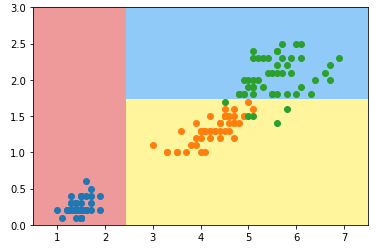
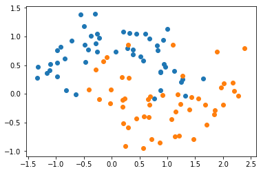
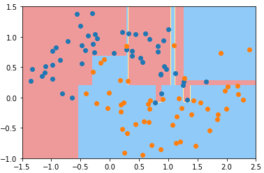
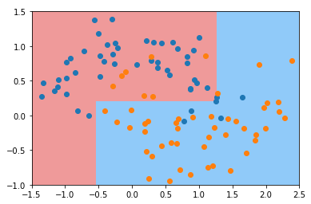
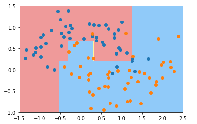
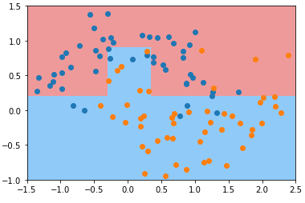
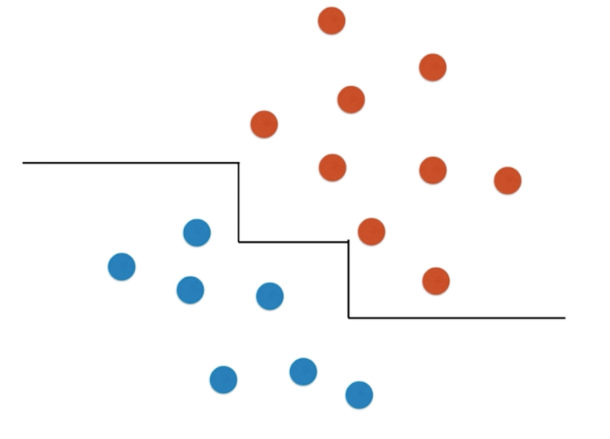

## 决策树

决策树是用树形结构来表达决策的过程，可以解决分类问题和回归问题。在树结构中， 叶子节为决策结果，内部节点代表某个属性条件。

决策树的特点：

- 是非参数学习算法。
- 可以解决分类问题（包括多分类问题）和回归问题（利用所在叶子节点的平均值）。
- 非常好的可解释性。

如下是公司招聘机器学习算法工程师的决策过程：


上面这棵树的深度为 3，最多通过 3 次判断可以判定决策结果。

在决策树算法中，决策标准有两个，一个是信息熵，一个是基尼系数。信息熵的计算比基尼系数稍慢，因为信息熵公式中存在一个非线性函数 log，而基尼系数中只有一个多项式计算。sklearn 中默认为基尼系数。大多数时候，两者的效果没有特别的优劣之分。

## 信息熵

信息熵是信息论的一个概念，用来度量随机变量的不确定度。熵越大，数据的不确定越高；熵越小，数据的不确定性越低。熵的概念来源于物理热力学，熵越大，例子的无规则运动越剧烈，不确定性越高；熵越小，例子越趋于静止。

信息熵的计算公式如下：
$$
H = -\sum_{i=1}^kp_ilog(p_i)
$$
其中，$p_i$ 是指一个数据集中，第 i 个种类所占的比例。

比如，一个 3 等分的数据集 $\{\frac 1 3, \frac 1 3, \frac 1 3\}$，对应的信息熵为 $H=-\frac 1 3 log(\frac 1 3)\cdot3=1.0986$；另一个数据集 $\{\frac 1 {10}, \frac 2 {10}\, \frac 7 {10}\}$ 的信息熵 $H=-\frac 1 {10}log(\frac 1 {10})-\frac 2 {10}log\frac 2 {10}-\frac 7 {10}log\frac 7 {10}=0.8018$。第二组数据集的数据上较小，直观上是因为第二组数据中有个大比例数据 $\frac 7 {10}$ ，数据更趋于相同。一个极端的数据集 $\{1, 0, 0}\$ 的信息熵为 0，数据是完全确定的，即都属于同一类。

在二分类算法中，数据类别只有两类，公式可以简化为：
$$
H = -xlog(x)-(1-x)log(1-x)
$$
我们可以用代码中来绘制 x 在 (0-1) 范围内的数据上变化：

```python
import numpy as np
import matplotlib.pyplot as plt

def entropy(p):
    return -p * np.log(p) - (1-p) * np.log(1-p)
  
x = np.linspace(0.01, 0.99, 200)

plt.plot(x, entropy(x))
plt.show()
```


当  x = 0.5 是，取得最大值，数据是最不确定的；而在曲线的两侧，数据越偏向于每一类，信息熵越低。在多分类问题同理。

决策树的问题演变为要找到划分维度以及在这个维度上的阈值，使得信息熵最低，即利用信息上寻找最优划分。

## 基于信息熵的最优划分

我们通过 sklearn 来分类鸢尾花数据集：

```python
import numpy as np
import matplotlib.pyplot as plt
from sklearn import datasets

iris = datasets.load_iris()
X = iris.data[:,2:]
y = iris.target
```


利用基于信息熵的决策树来分类：

```python
from sklearn.tree import DecisionTreeClassifier

# criterion="entropy" 表示评判标准为信息熵。
dt_clf = DecisionTreeClassifier(max_depth=2, criterion="entropy", random_state=42)
dt_clf.fit(X, y)
```

决策树要解决的关键问题是节点应该在哪个维度划分以及如何决定这个维度的阈值。

每个非叶子节点对应一个特征和特征的边界值。

对应的决策树类似为：


决策边界为：


下面我们实现代码来实现这一过程

```python
import numpy as np

# 根据特征条件 d <= value 来分离样本
def split(X, y, d, value):
    index_a = (X[:,d] <= value)
    index_b = (X[:,d] > value)
    return X[index_a], X[index_b], y[index_a], y[index_b]
```

```python
from collections import Counter
from math import log

# 计算向量 y 的信息熵
def entropy(y):
    counter = Counter(y)
    res = 0.0
    for num in counter.values():
        p = num / len(y)
        res += -p * log(p)
    return res

# 找到一组最佳信息熵以及对应的向量和值
def try_split(X, y):  
    best_entropy = float('inf')
    best_d, best_v = -1, -1
    # 遍历所有特征向量
    for d in range(X.shape[1]):
      	# 排序第 d 个特征向量
        sorted_index = np.argsort(X[:,d])
        # 按行遍历
        for i in range(1, len(X)):
          	# 和前一个样本的特征值比较，如果数值不同，则取两个特征的平均值
            if X[sorted_index[i], d] != X[sorted_index[i-1], d]:
                v = (X[sorted_index[i], d] + X[sorted_index[i-1], d])/2
                # 按照平均值分离
                X_l, X_r, y_l, y_r = split(X, y, d, v)
                # 计算左右 2 个数据集的占比
                p_l, p_r = len(X_l) / len(X), len(X_r) / len(X)
                # 计算此时的信息熵
                e = p_l * entropy(y_l) + p_r * entropy(y_r)
                if e < best_entropy:
                    best_entropy, best_d, best_v = e, d, v
                
    return best_entropy, best_d, best_v
```

```python
# 查找第一个最优信息熵，以及对应的向量和值
# 对应样本空间的第 1 特征，条件值为 2.45
best_entropy, best_d, best_v = try_split(X, y)
# best_entropy = 0.46209812037329684
# best_d = 0
# best_v = 2.45

# 分离结果
X1_l, X1_r, y1_l, y1_r = split(X, y, best_d, best_v)
entropy(y1_l) # 左边的信息熵值为 0
entropy(y1_r) # 右边的信息熵为 0.6931471805599453

# 继续分离右边的数据集
X2_l, X2_r, y2_l, y2_r = split(X1_r, y1_r, best_d2, best_v2)
entropy(y2_l) # 0.30849545083110386
entropy(y2_r) # 0.10473243910508653
```

我们可以用二叉树构建这颗决策树。

## 基于基尼系数的最优划分

与信息熵类似，基尼系统是另一种决策指标，公式为：
$$
G = 1 - \sum_{i=1}^k{p_i^2}
$$
基尼系数与信息熵的公式具有相同的性质。基尼系数越高，不确定性越高；否则同理。

比例为${\frac 1 3, \frac 1 3, \frac 1 3 }$ 的基尼系数 $G=1-(\frac 1 3)^2=0.6666$；比例为 ${\frac 1 {10}, \frac 2 {10}, \frac 7 {10}}$ 的基尼系数 $G=1-(\frac 1 {10}) - (\frac 2 {10}) - (\frac 7 {10})=0.46$；比例为 ${1, 0, 0}$ 的基尼系数为 $G = 0$。

对于二分类，基尼系数公式简化为：
$$
\begin{align*}
G & = 1-x^2-(1-x)^2 \\
&= 1- x^2-1+2x-x^2 \\
&=-2x^2+2x
\end{align*}
$$
变化曲线与信息熵类似，是一个开口向下的抛物线，在 x = 0.5 时，达到最大值。

我们针对鸢尾花数据，使用基尼系数重新训练：

```python

from sklearn.tree import DecisionTreeClassifier

dt_clf = DecisionTreeClassifier(max_depth=2, criterion="gini", random_state=42)
dt_clf.fit(X, y)
```

对应的决策边界与信息熵一样：



## CART

CART 是 Classification and Regression Tree 的缩写，特点是根据某个维度 d 和这个维度上的阈值 v 进行二分，最终得到一个二叉树。sklearn 使用 CART 实现决策树，其他实现方式有 ID3，C4.5，C5.0。

CART 决策树的高度为 $logm$，所以预测的时间复杂度为 $O(logm)$；训练复杂度为 $O(n*m*logm)$，因为具有 $logm$ 层，每一层均要做  $m*n$ 次遍历。

决策树属于非参数学习算法，比较容易产生过拟合，可以通过剪枝来较低复杂度，从而解决过拟合。

剪枝的参数即为 CART 决策树的超参数，超参数包括：

- `min_samples_spli`
- `min_samples_leaf`
- `min_weight_fraction_leaf`
- `max_depth`
- `max_leaf_nodes`
- `min_features`

下面基于 make_moons 数据集，利用决策树的超参数来解决过拟合问题。

```python
import numpy as np
import matplotlib.pyplot as plt
from sklearn import datasets

X, y = datasets.make_moons(noise=0.25, random_state=666)
```



```python
from sklearn.tree import DecisionTreeClassifier

dt_clf = DecisionTreeClassifier()
dt_clf.fit(X, y)
```

什么超参数都不传，对应的决策边界为：



可以通过数的深度 `max_depth` 来控制树的深度：

```python
dt_clf2 = DecisionTreeClassifier(max_depth=2)
dt_clf2.fit(X, y)
```



可以通过 `min_samples_split` 控制一个节点继续拆分的最少样本数据：



可以通过 `min_samples_leaf` 控制叶子节点至少应该具有的样本数量：

```python
dt_clf4 = DecisionTreeClassifier(min_samples_leaf=6)
dt_clf4.fit(X, y)
```



可以通过 `max_leaf_nodes` 叶子节点数的最大值。

```python
dt_clf5 = DecisionTreeClassifier(max_leaf_nodes=4)
dt_clf5.fit(X, y)
```

## 回归问题

利用决策树来解决问题问题的原理与解决分类问题类似，区别在于分类问题是将叶子节点中占比比较多的样本作为该叶子节点的类别，而在回归问题中，将样本数据的平均值作为该叶子节点的值。


```python
import numpy as np
import matplotlib.pyplot as plt
from sklearn import datasets
from sklearn.model_selection import train_test_split

boston = datasets.load_boston()
X = boston.data
y = boston.target

X_train, X_test, y_train, y_test = train_test_split(X, y, random_state=666)
```

```python
from sklearn.tree import DecisionTreeRegressor

# 参数与 DecisionTreeClassifier 完全一直
dt_reg = DecisionTreeRegressor()
dt_reg.fit(X_train, y_train)
```

```
dt_reg.score(X_test, y_test) # 0.58605479243964098
dt_reg.score(X_train, y_train) # 1.0
```

在不加任何参数的情况下，预测评分比较低，而样本数据的评分很高，出现过拟合。

## 局限性

决策树得到的决策边界为横平竖直的，如果决策边界本应该是一条斜线，则决策树的得不到理解的结果。


比如对于以下样本，可能得到的决策边界为：



另外一个局限性是多数非参数学习的局限性，即对个别数据敏感。具体可参考这个[示例](https://github.com/liuyubobobo/Play-with-Machine-Learning-Algorithms/blob/master/12-Decision-Tree/07-Problems-of-Decision-Tree/07-Problems-of-Decision-Tree.ipynb)。

## 工具

- [LaTeX/Mathematics - Wikibooks, open books for an open world](https://en.wikibooks.org/wiki/LaTeX/Mathematics)
- [Play-with-Machine-Learning-Algorithms Source](https://github.com/liuyubobobo/Play-with-Machine-Learning-Algorithms)
- [Python3入门机器学习经典算法与应用视频](https://coding.imooc.com/class/chapter/169.html#Anchor)
