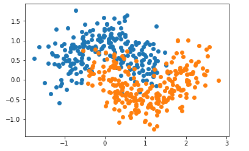
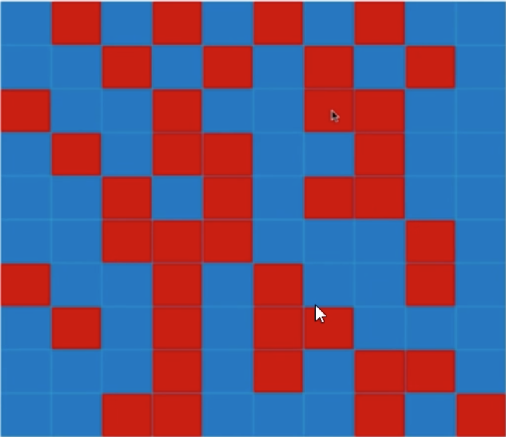
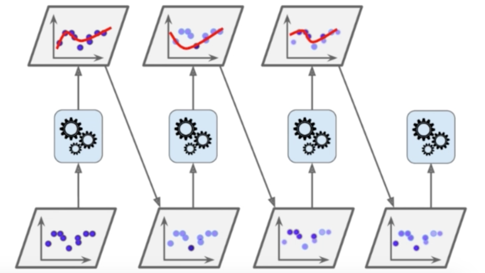
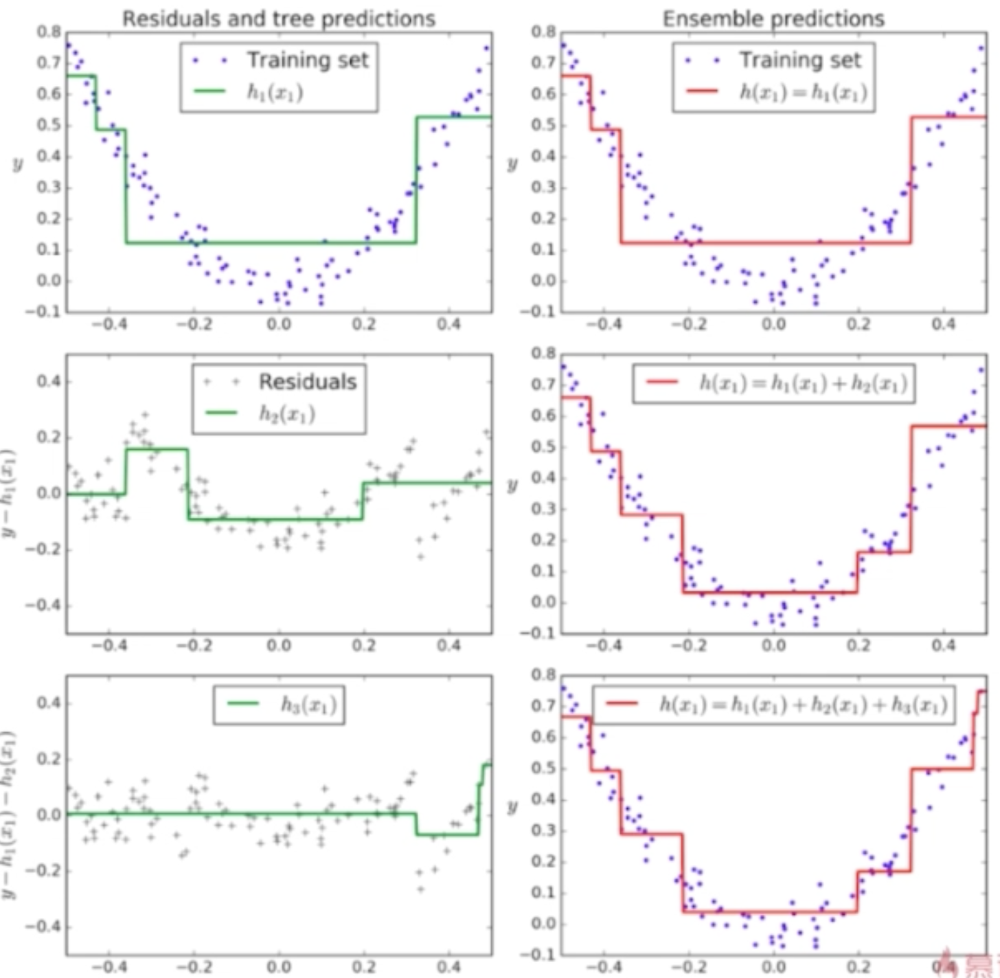
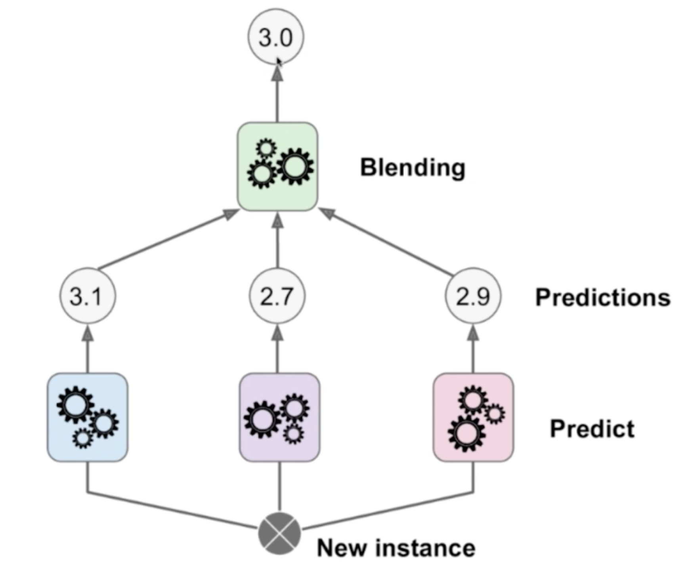
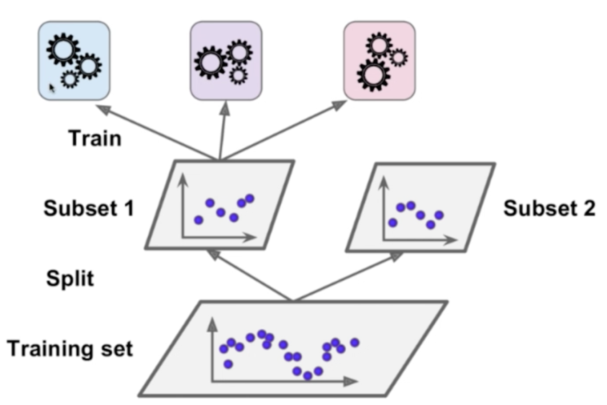
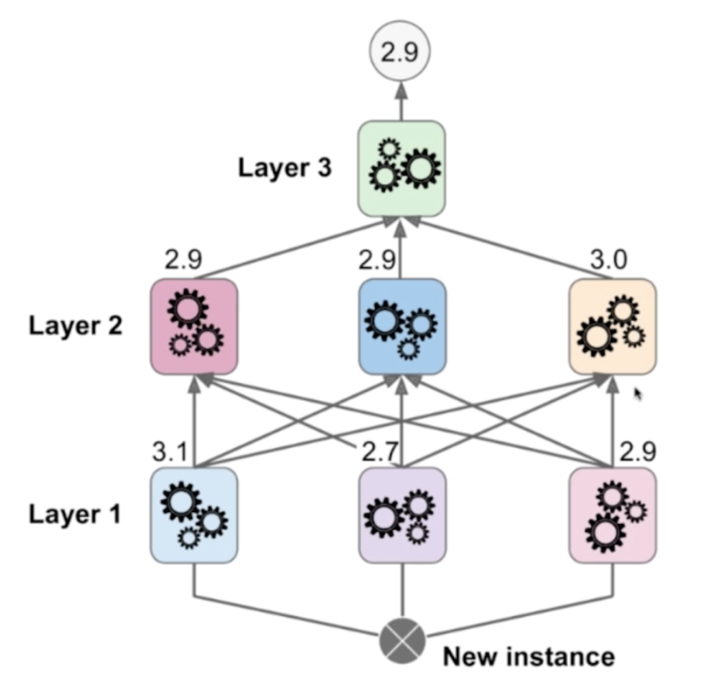

## 集成学习

在机器学习的有监督学习算法中，我们的目标是学习出一个稳定的且在各个方面表现都较好的模型，但实际情况往往不这么理想，有时我们只能得到多个有偏好的模型（弱监督模型，在某些方面表现的比较好）。集成学习就是组合这里的多个弱监督模型以期得到一个更好更全面的强监督模型，集成学习潜在的思想是即便某一个弱分类器得到了错误的预测，其他的弱分类器也可以将错误纠正回来。

简单说，就是通过不同的分类算法创建模型，进行训练，对所有模型的预测结果进行预测，投票多的为最终的预测结果。

下面我们通过逻辑回归，SVM，决策树对 make_moons 数据集进行训练和预测，并通过集成学习来提高最终的准确度。

```python
import numpy as np
import matplotlib.pyplot as plt
from sklearn import datasets
from sklearn.model_selection import train_test_split

X, y = datasets.make_moons(n_samples=500, noise=0.3, random_state=42)
X_train, X_test, y_train, y_test = train_test_split(X, y, random_state=42)
```



```python
# 逻辑回归算法
from sklearn.linear_model import LogisticRegression

log_clf = LogisticRegression()
log_clf.fit(X_train, y_train)
log_clf.score(X_test, y_test) # 0.86399999999999999
```

```python
# SVM 算法
from sklearn.svm import SVC

svm_clf = SVC()
svm_clf.fit(X_train, y_train)
svm_clf.score(X_test, y_test) # 0.88800000000000001
```

```python
# 决策树算法
from sklearn.tree import DecisionTreeClassifier

dt_clf = DecisionTreeClassifier(random_state=666)
dt_clf.fit(X_train, y_train)
dt_clf.score(X_test, y_test) # 0.86399999999999999
```

```python
# 将预测结果投票
from sklearn.metrics import accuracy_score

y_predict1 = log_clf.predict(X_test)
y_predict2 = svm_clf.predict(X_test)
y_predict3 = dt_clf.predict(X_test)

_predict = np.array((y_predict1 + y_predict2 + y_predict3) >= 2, dtype='int')
accuracy_score(y_test, y_predict) # 0.89600000000000002
```


sklearn 提供了投票分类算法实现上述算法过程：

```python
from sklearn.ensemble import VotingClassifier

voting_clf = VotingClassifier(estimators=[
    ('log_clf', LogisticRegression()), 
    ('svm_clf', SVC()),
    ('dt_clf', DecisionTreeClassifier(random_state=666))], voting='hard')

voting_clf.fit(X_train, y_train)
voting_clf.score(X_test, y_test) # 0.89600000000000002
```


这种一人一票，少数服从多数的投票方式，称为 Hard Voting。还有一种  Soft Voting，使用预测的概率作为权值，使用概率的均值作为最终的预测依据。

比如有以下 5 中模型预测结果：

- 模型 1：A 90%, B 1%

- 模型 2：A 49%, B 51%
- 模型 3：A 40%, B 60%
- 模型 4：A 90%, B 10%
- 模型 5：A 30%, B 70%

如果使用 Hard Voting，则最终的预测结果为 B；使用 Soft Voting，将分类的概率作为权值，则 A 的最终概率是各预测结果概率的平均值 $\bar A = \frac 1 5 (0.9 + 0.49 = 0.4 + 0.9 + 0.3)=0.616$，而 $\bar B = 0.384$，最终结果为 A。

Soft Voting 要求集合的每一个模型都能估计概率。

- 逻辑回归算法是基于概率模型的，使用 `predict_proba` 获取预测概率。
- kNN 算法计算出的概率为预测结果在 k 个临近点中所占的比例。
- 决策树算法计算出的概率为叶子节点占比最多的类别（叶子的类别）的比例，这个 kNN 的计算方法类似。
- SVM 算法默认是不计算概率的，但可以通过 `probability=True` 来估计类的概率。

下面将前面的例子改用 Soft Voting 来实现：

```python
voting_clf2 = VotingClassifier(estimators=[
    ('log_clf', LogisticRegression()), 
    ('svm_clf', SVC(probability=True)),
    ('dt_clf', DecisionTreeClassifier(random_state=666))],
                             voting='soft')

voting_clf2.fit(X_train, y_train)
voting_clf2.score(X_test, y_test) # 91200000000000003
```

## Bagging and Pasting

虽然有很多机器学习方法，但从投票的角度看，仍然不够多。根据概率论的大数定理，需要创建更多的子模型，以获取更多子模型的意见，而且子模型之间不能一致，需要有差异。

另一种使用集成学习的思路是使用同一种算法模型，只给模型看样本数据的一部分来创建差异性。比如，一个有 500 个样本数据，每个子模型只看其中的100个样本数据。每个子模型不需要太高的准确率，整体准确率会比较高。

假如每个子模型只有 51% 的准确率。如果我们只有 1 个子模型，整准确率为 51%；如果我们只有 3 个子模型，整体准确率为  $0.51^3 + C_3^2\cdot 0.51^2\cdot0.49=51.5\%$；如果我们有 500 个子模型，整体准确率为 $\sum_{i=251}^{500}C_{500}^i\cdot0.51^i\cdot0.49^{500-i}=65.6\%$。

如果每个模型的准确率是 60%，则整理的准确率为 $\sum_{i=251}^{500}C_{500}^i\cdot0.6^i\cdot0.4^{500-i}=99.999\%$。

模型所使用的样本数据的取法分为放回取样（Bagging）和不放回取样（Pasting）。

Bagging 更常用。Bagging 可以分为无数个样本，而 Pasting  只能平均分为有限个样本；Bagging 不是很依赖于随机，Pasting 依赖于如何将样本随机划分。

在统计学中，放回取样称为 Bootstrap。

下面我们使用 Bagging 和决策树来应用集成学习，使用决策树算法是因为决策树算法有很多超参数，使得生成的子模型有差异。

```python
from sklearn.tree import DecisionTreeClassifier
from sklearn.ensemble import BaggingClassifier

# n_estimators 随机数据集的个数构成的子模块
# max_samples 子模型所需要看的样本数据个数
# bootstrap True 表示放回取样，False 表示不放回取样
bagging_clf = BaggingClassifier(DecisionTreeClassifier(),
                           n_estimators=500, max_samples=100,
                           bootstrap=True)
bagging_clf.fit(X_train, y_train)
bagging_clf.score(X_test, y_test) #0.91200000000000003
```

如果把 n_estimators 改为 5000，预测准确率为 0.92000000000000004。理论上子模型越多，准确率越高。

## OOB

放回取样会导致一部分样品很有可能没有渠道，平均大约有 37% 的样本没有取到。这样，我们就可以不用 split_test 方法来分类数据，而使用这 37% 的数据作为测试数据。

 OOB 是 Out of Bag 的缩写，指的是使用这部分没有取到的样本作为测试数据。在 sklearn 中，通过 `oob_score_` 来查看使用 Bagging 的集成学习，使用 OOB 作为测试数据集得到的准确度。

```python
from sklearn import datasets
from sklearn.tree import DecisionTreeClassifier
from sklearn.ensemble import BaggingClassifier

X, y = datasets.make_moons(n_samples=500, noise=0.3, random_state=42)
# oob_score 标志使用 oob 作为测试数据，记录样本数据是否取回
bagging_clf = BaggingClassifier(DecisionTreeClassifier(),
                               n_estimators=500, max_samples=100,
                               bootstrap=True, oob_score=True)
bagging_clf.fit(X, y)
bagging_clf.oob_score_ # 0.91800000000000004
```

Bagging 的思路极易进行并行化处理，可以通过 `n_jobs` 来控制使用的核数，`n_jobs=-1`表示使用所有的核。

## Random Patches

在 Bagging 中，我们通过样本的随机取样来创造差异性，除此之外我们还有两种创造差异的方法：

- Random Subspaces 针对特征进行随机采样。在 sklearn 的实现中，相当于 `max_samples` 与样本总个数相等。

- Random Patches 即针对样本，又针对特征进行随机采样。在 sklearn 的实现中，相当于 `max_samples`小于样本总个数，`max_features` 小于总特征数。

  

```python
# bootstrap_features 表示特征是否放回采样
# max_features 表示特征最大采样个数
random_patches_clf = BaggingClassifier(DecisionTreeClassifier(),
                               n_estimators=500, max_samples=100,
                               bootstrap=True, oob_score=True,
                               max_features=1, bootstrap_features=True)
random_patches_clf.fit(X, y)
random_patches_clf.oob_score_
```

## 随机森林

通过 Bagging 的方式随机取样（包括特征）和决策树算法形成 N 个决策树的算法称为随机森林。

决策树是找到最优的特征维度和最佳的阈值进行划分，随机森林则是在随机的子集上寻找最优划分特征。

下面我们用 sklearn 中的随机森林基于 `make_moons` 数据集进行训练：

```python
from sklearn.ensemble import RandomForestClassifier

# 随机森林分类器的超参数包括了决策树的超参数和 BaggingClassifier 的超参数。
rf_clf = RandomForestClassifier(n_estimators=500, oob_score=True, random_state=666, n_jobs=-1)
rf_clf.fit(X, y)

et_clf.oob_score_ # 0.89200000000000002
```

## Extra Trees

Extra Trees 是 Extreamly Random Trees 的简称，称为极其随机森林。与随机森林的区别是，决策树在节点划分上，使用随机的特征和随机的阈值进行划分，进一步增加了子模型的随机性，从而抑制了过拟合，但增大了 Bias（偏差）。由于划分方法简单，所以比随机森林的效率更高。

```python
from sklearn.ensemble import ExtraTreesClassifier

et_clf = ExtraTreesClassifier(n_estimators=500, bootstrap=True, oob_score=True, random_state=666, n_jobs=-1)
et_clf.fit(X, y)

et_clf.oob_score_ # 0.89200000000000002 
```

## 回归问题

回归的使用方法与分类类似，对应的类为：

```python
from sklearn.ensemble import BaggingRegressor
from sklearn.ensemble import RandomForestRegressor
from sklearn.ensemble import ExtraTreesRegressor
```

## Boosting

Bagging 和随机森林中，每个模型都是独立的，综合这些有差异化的训练结果，进而获得最终的结果。另外一类集成学习的方式是 Boosting，Boosting 同样也是集成多个模型，但每个模型都在尝试增强（Boosting）整体的效果，而不是独立的。

### Ada Boosting

Ada Boosting 的回归模型的思路如下：



第一次训练时，所有样本的权重一样，结果有部分样本数据没有被学习到；在下一个训练模型中，可以提高在前一个模型中没有学习的样本的权重，而降低在前一个模型中已经被准确学习的样本权重。每一次生成的子模型都是在弥补上一次子模型没有被成功预测的样本点，即在推动（Boost）上一个子模型所犯的错误。Ada Boosting 通过权重来创造每个子模型之间的差异，最终综合所有子模型的投票结果作为 Ada Boosting 的最终结果。

Ada Boosting 中如何给样本点赋权值，可以转为求极值的问题。

下面我们通过 sklearn 的 `AdaBoostClassifier` 对 `make_moos` 数据集进行分类：

```python
from sklearn.tree import DecisionTreeClassifier
from sklearn.ensemble import AdaBoostClassifier
from sklearn import datasets
from sklearn.model_selection import train_test_split

X, y = datasets.make_moons(n_samples=500, noise=0.3, random_state=666)
X_train, X_test, y_train, y_test = train_test_split(X, y, random_state=666)

ada_clf = AdaBoostClassifier(
    DecisionTreeClassifier(max_depth=2), n_estimators=500)
ada_clf.fit(X_train, y_train)
ada_clf.score(X_test, y_test) # 0.85599999999999998
```

### Gradient Boosting

Gradient Boosting 模型的思路为：

训练一个模型 m1, 会产生错误 e1；针对 e1 训练第二个模型 m2，产生错误 e2；针对 e2 训练第三个模型 m3，产生错误 e3；... 最终预测结果是：m1 + m2 + m3 + ...

过程如下确实所示，绿色的位训练样本数据，红色的是模型训练结果：



下面我们通过

```python
from sklearn.ensemble import GradientBoostingClassifier

# GradientBoostingClassifier 的 base_estimator 为 DecisionTreeClassifier
gb_clf = GradientBoostingClassifier(max_depth=2, n_estimators=30)
gb_clf.fit(X_train, y_train)
gb_clf.score(X_test, y_test) # 0.90400000000000003
```

### 回归问题

```python
from sklearn.ensemble import AdaBoostRegressor
from sklearn.ensemble import GradientBoostingRegressor
```

## Stacking

Stacking 算法的思路是使用多个子模型训练，得到多个训练结果，然后利用这些训练结果作为输入，再训练一个新的数据模型，以这个新的数据模型的结果为最终的预测结果。



以上的过程是一个回归过程，如果把训练结果改成预测为某一类的概率，则可解决分类问题。

为了实现上述模型，我们可以将数据集分成 2 份，一份 Subset 1 用于训练第一层的子模型；另一份 Subset 2 用于训练第二层的数据子模型。



以上是 2 层训练模型，可以利用同样的思路扩展到 三层训练模型：



为了训练这样的数据模型，需要将原始的训练数据分成 3 分。

由于 Stacking 算法模型比较复杂，有点类似于神经网络，所以比较容易出现过拟合。sklearn 中没有提供 Stacking 算法的实现。

## 工具

- [LaTeX/Mathematics - Wikibooks, open books for an open world](https://en.wikibooks.org/wiki/LaTeX/Mathematics)
- [Play-with-Machine-Learning-Algorithms Source](https://github.com/liuyubobobo/Play-with-Machine-Learning-Algorithms)
- [Python3入门机器学习经典算法与应用视频](https://coding.imooc.com/class/chapter/169.html#Anchor)
