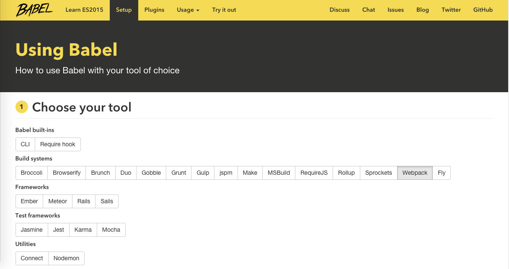

ECMAScript 6（以下简称ES6）是JavaScript语言的下一代标准。因为当前版本的ES6是在2015年发布的，所以又称ECMAScript 2015。

也就是说，ES6就是ES2015。

虽然目前并不是所有浏览器都能兼容ES6全部特性，但越来越多的程序员在实际项目当中已经开始使用ES6了。所以就算你现在不打算使用ES6，但为了看懂别人的你也该懂点ES6的语法了...

在我们正式讲解ES6语法之前，我们得先了解下Babel。
[Babel](https://babeljs.io/)

Babel是一个广泛使用的ES6转码器，可以将ES6代码转为ES5代码，从而在现有环境执行。大家可以选择自己习惯的工具来使用使用Babel，具体过程可直接在Babel官网查看：


## 最常用的ES6特性

`let, const, class, extends, super, arrow functions, template string, destructuring, default, rest arguments`
这些是ES6最常用的几个语法，基本上学会它们，我们就可以走遍天下都不怕啦！我会用最通俗易懂的语言和例子来讲解它们，保证一看就懂，一学就会。

## let, const

这两个的用途与`var`类似，都是用来声明变量的，但在实际运用中他俩都有各自的特殊用途。
首先来看下面这个例子：

```js
var name = 'zach'

while (true) {
    var name = 'obama'
    console.log(name)  //obama
    break
}

console.log(name)  //obama
```

使用`var `两次输出都是obama，这是因为ES5只有全局作用域和函数作用域，没有块级作用域，这带来很多不合理的场景。第一种场景就是你现在看到的内层变量覆盖外层变量。而`let`则实际上为JavaScript新增了块级作用域。用它所声明的变量，只在`let`命令所在的代码块内有效。

```
let name = 'zach'

while (true) {
    let name = 'obama'
    console.log(name)  //obama
    break
}

console.log(name)  //zach
```

另外一个`var`带来的不合理场景就是用来计数的循环变量泄露为全局变量，看下面的例子：

```
var a = [];
for (var i = 0; i < 10; i++) {
  a[i] = function () {
    console.log(i);
  };
}
a[6](); // 10
```

上面代码中，变量i是var声明的，在全局范围内都有效。所以每一次循环，新的i值都会覆盖旧值，导致最后输出的是最后一轮的i的值。而使用let则不会出现这个问题。

```
var a = [];
for (let i = 0; i < 10; i++) {
  a[i] = function () {
    console.log(i);
  };
}
a[6](); // 6
```

再来看一个更常见的例子，了解下如果不用ES6，而用闭包如何解决这个问题。

```
var clickBoxs = document.querySelectorAll('.clickBox')
for (var i = 0; i < clickBoxs.length; i++){
    clickBoxs[i].onclick = function(){
        console.log(i)
    }
}
```

我们本来希望的是点击不同的clickBox，显示不同的i，但事实是无论我们点击哪个clickBox，输出的都是5。下面我们来看下，如何用闭包搞定它。

```
function iteratorFactory(i){
    var onclick = function(e){
        console.log(i)
    }
    return onclick;
}
var clickBoxs = document.querySelectorAll('.clickBox')
for (var i = 0; i < clickBoxs.length; i++){
    clickBoxs[i].onclick = iteratorFactory(i)
}
```

`const`也用来声明变量，但是声明的是常量。一旦声明，常量的值就不能改变。

```
const PI = Math.PI

PI = 23 //Module build failed: SyntaxError: /es6/app.js: "PI" is read-only
```

当我们尝试去改变用const声明的常量时，浏览器就会报错。
const有一个很好的应用场景，就是当我们引用第三方库的时声明的变量，用const来声明可以避免未来不小心重命名而导致出现bug：

```
const monent = require('moment')
```

## class, extends, super

这三个特性涉及了ES5中最令人头疼的的几个部分：原型、构造函数，继承...你还在为它们复杂难懂的语法而烦恼吗？你还在为指针到底指向哪里而纠结万分吗？

有了ES6我们不再烦恼！

ES6提供了更接近传统语言的写法，引入了Class（类）这个概念。新的class写法让对象原型的写法更加清晰、更像面向对象编程的语法，也更加通俗易懂。

```
class Animal {
    constructor(){
        this.type = 'animal'
    }
    says(say){
        console.log(this.type + ' says ' + say)
    }
}

let animal = new Animal()
animal.says('hello') //animal says hello

class Cat extends Animal {
    constructor(){
        super()
        this.type = 'cat'
    }
}

let cat = new Cat()
cat.says('hello') //cat says hello
```

上面代码首先用`class`定义了一个“类”，可以看到里面有一个`constructor`方法，这就是构造方法，而`this`关键字则代表实例对象。简单地说，`constructor`内定义的方法和属性是实例对象自己的，而`constructor`外定义的方法和属性则是所有实例对象可以共享的。

Class之间可以通过`extends`关键字实现继承，这比ES5的通过修改原型链实现继承，要清晰和方便很多。上面定义了一个Cat类，该类通过`extends`关键字，继承了Animal类的所有属性和方法。

`super`关键字，它指代父类的实例（即父类的this对象）。子类必须在`constructor`方法中调用`super`方法，否则新建实例时会报错。这是因为子类没有自己的`this`对象，而是继承父类的`this`对象，然后对其进行加工。如果不调用`super`方法，子类就得不到`this`对象。

ES6的继承机制，实质是先创造父类的实例对象this（所以必须先调用super方法），然后再用子类的构造函数修改this。

P.S 如果你写react的话，就会发现以上三个东西在最新版React中出现得很多。创建的每个component都是一个继承`React.Component`的类。[详见react文档](https://facebook.github.io/react/docs/reusable-components.html)

## arrow function

这个恐怕是ES6最最常用的一个新特性了，用它来写function比原来的写法要简洁清晰很多:

```
function(i){ return i + 1; } //ES5
(i) => i + 1 //ES6
```

简直是简单的不像话对吧...
如果方程比较复杂，则需要用`{}`把代码包起来：

```
function(x, y) { 
    x++;
    y--;
    return x + y;
}
(x, y) => {x++; y--; return x+y}
```

除了看上去更简洁以外，arrow function还有一项超级无敌的功能！
长期以来，JavaScript语言的`this`对象一直是一个令人头痛的问题，在对象方法中使用this，必须非常小心。例如：

```
class Animal {
    constructor(){
        this.type = 'animal'
    }
    says(say){
        setTimeout(function(){
            console.log(this.type + ' says ' + say)
        }, 1000)
    }
}

 var animal = new Animal()
 animal.says('hi')  //undefined says hi
```

运行上面的代码会报错，这是因为`setTimeout`中的`this`指向的是全局对象。所以为了让它能够正确的运行，传统的解决方法有两种：

1. 第一种是将this传给self,再用self来指代this

   ```
      says(say){
          var self = this;
          setTimeout(function(){
              console.log(self.type + ' says ' + say)
          }, 1000)
   ```

   2.第二种方法是用`bind(this)`,即

   ```
      says(say){
          setTimeout(function(){
              console.log(this.type + ' says ' + say)
          }.bind(this), 1000)
   ```

   但现在我们有了箭头函数，就不需要这么麻烦了：

```
class Animal {
    constructor(){
        this.type = 'animal'
    }
    says(say){
        setTimeout( () => {
            console.log(this.type + ' says ' + say)
        }, 1000)
    }
}
 var animal = new Animal()
 animal.says('hi')  //animal says hi
```

当我们使用箭头函数时，函数体内的this对象，就是定义时所在的对象，而不是使用时所在的对象。
并不是因为箭头函数内部有绑定this的机制，实际原因是箭头函数根本没有自己的this，它的this是继承外面的，因此内部的this就是外层代码块的this。

## template string

这个东西也是非常有用，当我们要插入大段的html内容到文档中时，传统的写法非常麻烦，所以之前我们通常会引用一些模板工具库，比如mustache等等。

大家可以先看下面一段代码：

```
$("#result").append(
  "There are <b>" + basket.count + "</b> " +
  "items in your basket, " +
  "<em>" + basket.onSale +
  "</em> are on sale!"
);
```

我们要用一堆的'+'号来连接文本与变量，而使用ES6的新特性模板字符串``后，我们可以直接这么来写：

```
$("#result").append(`
  There are <b>${basket.count}</b> items
   in your basket, <em>${basket.onSale}</em>
  are on sale!
`);
```

用反引号`（\`）`来标识起始，用`${}`来引用变量，而且所有的空格和缩进都会被保留在输出之中，是不是非常爽？！

React Router从第1.0.3版开始也使用ES6语法了，比如这个例子：

```
<Link to={`/taco/${taco.name}`}>{taco.name}</Link>
```

[React Router](https://github.com/rackt/react-router/blob/latest/examples/passing-props-to-children/app.js)

## destructuring

ES6允许按照一定模式，从数组和对象中提取值，对变量进行赋值，这被称为解构（Destructuring）。

看下面的例子：

```
let cat = 'ken'
let dog = 'lili'
let zoo = {cat: cat, dog: dog}
console.log(zoo)  //Object {cat: "ken", dog: "lili"}
```

用ES6完全可以像下面这么写：

```
let cat = 'ken'
let dog = 'lili'
let zoo = {cat, dog}
console.log(zoo)  //Object {cat: "ken", dog: "lili"}
```

反过来可以这么写：

```
let dog = {type: 'animal', many: 2}
let { type, many} = dog
console.log(type, many)   //animal 2
```

## default, rest

default很简单，意思就是默认值。大家可以看下面的例子，调用`animal()`方法时忘了传参数，传统的做法就是加上这一句`type = type || 'cat' `来指定默认值。

```
function animal(type){
    type = type || 'cat'  
    console.log(type)
}
animal()
```

如果用ES6我们而已直接这么写：

```
function animal(type = 'cat'){
    console.log(type)
}
animal()
```

最后一个rest语法也很简单，直接看例子：

```
function animals(...types){
    console.log(types)
}
animals('cat', 'dog', 'fish') //["cat", "dog", "fish"]
```

而如果不用ES6的话，我们则得使用ES5的`arguments`。

## import export

这两个家伙对应的就是es6自己的`module`功能。

我们之前写的Javascript一直都没有模块化的体系，无法将一个庞大的js工程拆分成一个个功能相对独立但相互依赖的小工程，再用一种简单的方法把这些小工程连接在一起。

这有可能导致两个问题：

1. 一方面js代码变得很臃肿，难以维护
2. 另一方面我们常常得很注意每个script标签在html中的位置，因为它们通常有依赖关系，顺序错了可能就会出bug

在es6之前为解决上面提到的问题，我们得利用第三方提供的一些方案，主要有两种CommonJS(服务器端)和AMD（浏览器端，如require.js）。

如果想了解更多AMD，尤其是require.js，可以参看这个教程：[why modules on the web are useful and the mechanisms that can be used on the web today to enable them](http://requirejs.org/docs/why.html)

而现在我们有了es6的module功能，它实现非常简单，可以成为服务器和浏览器通用的模块解决方案。

> ES6模块的设计思想，是尽量的静态化，使得编译时就能确定模块的依赖关系，以及输入和输出的变量。CommonJS和AMD模块，都只能在运行时确定这些东西。

上面的设计思想看不懂也没关系，咱先学会怎么用，等以后用多了、熟练了再去研究它背后的设计思想也不迟！好，那我们就上代码...

### 传统的写法

首先我们回顾下require.js的写法。假设我们有两个js文件: `index.js`和`content.js`,现在我们想要在`index.js`中使用`content.js`返回的结果，我们要怎么做呢？

首先定义：

```
//content.js
define('content.js', function(){
    return 'A cat';
})
```

然后require：

```
//index.js
require(['./content.js'], function(animal){
    console.log(animal);   //A cat
})
```

那CommonJS是怎么写的呢？

```
//index.js
var animal = require('./content.js')

//content.js
module.exports = 'A cat'
```

### ES6的写法

```
//index.js
import animal from './content'

//content.js
export default 'A cat'
```

以上我把三者都列出来了，妈妈再也不用担心我写混淆了...

```js
//content.js

export default 'A cat'    
export function say(){
    return 'Hello!'
}    
export const type = 'dog' 
```

上面可以看出，export命令除了输出变量，还可以输出函数，甚至是类（react的模块基本都是输出类）

```
//index.js

import { say, type } from './content'  
let says = say()
console.log(`The ${type} says ${says}`)  //The dog says Hello
```

这里输入的时候要注意：大括号里面的变量名，必须与被导入模块（content.js）对外接口的名称相同。

如果还希望输入content.js中输出的默认值(default), 可以写在大括号外面。

```
//index.js

import animal, { say, type } from './content'  
let says = say()
console.log(`The ${type} says ${says} to ${animal}`)  
//The dog says Hello to A cat
```

### 修改变量名

此时我们不喜欢type这个变量名，因为它有可能重名，所以我们需要修改一下它的变量名。在es6中可以用`as`实现一键换名。

```
//index.js

import animal, { say, type as animalType } from './content'  
let says = say()
console.log(`The ${animalType} says ${says} to ${animal}`)  
//The dog says Hello to A cat
```

### 模块的整体加载

除了指定加载某个输出值，还可以使用整体加载，即用星号（`*`）指定一个对象，所有输出值都加载在这个对象上面。

```
//index.js

import animal, * as content from './content'  
let says = content.say()
console.log(`The ${content.type} says ${says} to ${animal}`)  
//The dog says Hello to A cat
```

通常星号`*`结合`as`一起使用比较合适。

### 终极秘籍

考虑下面的场景：上面的`content.js`一共输出了三个变量（`default, say, type`）,假如我们的实际项目当中只需要用到`type`这一个变量，其余两个我们暂时不需要。我们可以只输入一个变量：

```
import { type } from './content' 
```

由于其他两个变量没有被使用，我们希望代码打包的时候也忽略它们，抛弃它们，这样在大项目中可以显著减少文件的体积。

ES6帮我们实现了！

不过，目前无论是webpack还是browserify都还不支持这一功能...

如果你现在就想实现这一功能的话，可以尝试使用[rollup.js](http://rollupjs.org/)

他们把这个功能叫做Tree-shaking，哈哈哈，意思就是打包前让整个文档树抖一抖，把那些并未被依赖或使用的东西统统抖落下去。。。

看看他们官方的解释吧：

> Normally if you require a module, you import the whole thing. ES2015 lets you just import the bits you need, without mucking around with custom builds. It's a revolution in how we use libraries in JavaScript, and it's happening right now.
>
> 

## async

[async 函数 - ECMAScript 6入门](https://es6.ruanyifeng.com/#docs/async)

## 引用

- [ES6 入门教程 - ECMAScript 6入门](https://es6.ruanyifeng.com/)
- [30分钟掌握ES6/ES2015核心内容（上）](https://segmentfault.com/a/1190000004365693)，[30分钟掌握ES6/ES2015核心内容（下）](https://segmentfault.com/a/1190000004368132)