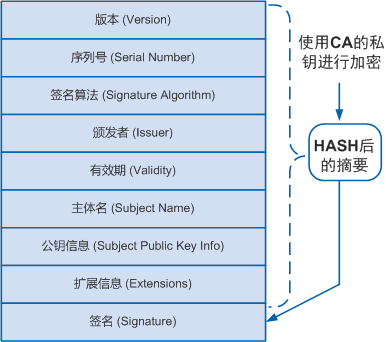

From [数字证书PKI原理](https://cshihong.github.io/2019/04/15/%E6%95%B0%E5%AD%97%E8%AF%81%E4%B9%A6PKI%E5%8E%9F%E7%90%86/)

# PKI基础架构

## 密钥管理面临的挑战：

在使用任何基于RSA服务之前 ，一个实体需要真实可靠的获取其他实体的公钥。

1. 通过非信任的通道，公钥交换必须是安全的。
2. 在密钥交换过程中，公钥必须不能够被截获和更改。
3. 交换呈现Full Mesh的复杂度。
4. 由最终用户来确认密钥有效性，非常不靠谱。

## PIK介绍：

公钥基础设施PKI（Public Key Infrastructure），是通过使用公钥技术和数字证书来提供系统信息安全服务，并负责验证数字证书持有者身份的一种体系。PKI技术是信息安全技术的核心，也是电子商务的关键和基础技术。

PIK保证了通信数据的私密性、完整性、不可否认性和 源认证性 。

## 为什么要用PKI：

**IPSec身份认证（预共享密钥方式）：**

- 配置简单。只需要在总部和二分部的网关上配相同的密钥即可。
- 维护复杂。随着分部数量越俩越多，总部和每个分部之间形成的对等体都要配置预共享秘钥。
- 安全风险高。如果所有对等体都使用同一个密钥，存在安全风险。

**IPSec身份认证（PIK中的证书认证方式）：**

- 维护简单。随着分部数量越来越多，只需要向CA申请证书即可。
- 安全风险低。不同的分部使用不同的证书，对应的密钥也不同。

# 数字证书介绍

## 数字证书

数字证书简称证书，它是一个经证书授权中心CA数字签名的文件，包含拥有者的公钥及相关身份信息。

数字证书技术解决了数字签名技术中无法确定公钥是指定拥有者的问题。

> **注意：数字证书仅仅是解决了“这个公钥的持有者到底是谁“的问题。**

## 证书结构

最简单的证书包含一个**公钥、名称以及证书授权中心的数字签名**。一般情况下证书中还包括密钥的有效期，颁发者（证书授权中心）的名称，该证书的序列号等信息，证书的结构遵循X.509 v3版本的规范。

图：证书组成结构

证书的各字段解释：

- 版本：即使用X.509的版本，目前普遍使用的是v3版本（0x2）。
- 序列号：颁发者分配给证书的一个正整数，同一颁发者颁发的证书序列号各不相同，可用与颁发者名称一起作为证书唯一标识。
- 签名算法：颁发者颁发证书使用的签名算法。
- 颁发者：颁发该证书的设备名称，必须与颁发者证书中的主体名一致。通常为CA服务器的名称。
- 有效期：包含有效的起、止日期，不在有效期范围的证书为无效证书。
- 主体名：证书拥有者的名称，如果与颁发者相同则说明该证书是一个自签名证书。
- 公钥信息：用户对外公开的公钥以及公钥算法信息。
- 扩展信息：通常包含了证书的用法、CRL的发布地址等可选字段。
- 签名：颁发者用私钥对证书信息的签名。

## 证书类型

- 自签名证书：自签名证书又称为根证书，是自己颁发给自己的证书，即证书中的颁发者和主体名相同。
- CA证书：CA自身的证书。如果PKI系统中没有多层级CA，CA证书就是自签名证书；如果有多层级CA，则会形成一个CA层次结构，最上层的CA是根CA，它拥有一个CA“自签名”的证书。
- 本地证书：CA颁发给申请者的证书。
- 设备本地证书：设备根据CA证书给自己颁发的证书，证书中的颁发者名称是CA服务器的名称。

## 证书格式

1. PKCS#12：以二进制格式保存证书，可以包含私钥，也可以不包含私钥。常用的后缀有：.P12和.PFX。
2. DER：以二进制格式保存证书，不包含私钥。常用的后缀有：.DER、.CER和.CRT。
3. PEM：以ASCII码格式保存证书，可以包含私钥，也可以不包含私钥。常用的后缀有：.PEM、.CER和.CRT。

> 对于证书后缀为.CER或.CRT，可以用记事本打开证书，查看证书内容来区分证书格式。
>
> - 如果有类似＂—–BEGIN CERTIFICATE—–＂和＂—–END CERTIFICATE—–＂的头尾标记，则证书格式为PEM。
> - 如果是乱码，则证书格式为DER

# PKI的核心部分CA

## CA介绍

证书认证机构CA（Certificate Authority）。CA是PKI的信任基础，是一个用于颁发并管理数字证书的可信实体。它是一种权威性、可信任性和公正性的第三方机构，通常由服务器充当，例如Windows Server 2008。

CA通常采用多层次的分级结构，根据证书颁发机构的层次，可以划分为根CA和从属CA。

CA的核心功能就是发放和管理数字证书，包括：证书的颁发、证书的更新、证书的撤销、证书的查询、证书的归档、证书废除列表CRL（Certificate Revocation List）的发布等。

有关CA的特性：

- 仅仅只有一个受信任的介绍者(证书颁发机构)
- CA签署每一个人的公钥
- 每个人都有CA的公钥

**CA颁发证书流程：**

- 每个实体都要获取CA的公钥（认证CA的过程）
- 每个实体都要提交自己的公钥给CA（注册到PKI）
- 这个初始步骤，必须手动认证或者通过一个可信任的传输网络来执行。
- CA使用自己的私钥为提交的公钥做数字签名。
- 被数字签了名的公钥（身份证书）再返回给实体。
- 实体现在亏可以通过非信任的网络来彼此交换被CA签了名的公钥了。
- 收到的公钥都是被CA的公钥所确认的，CA的公钥在每个实体本地必须是有效的。

## PKI的组成

一个PKI体系由终端实体、证书认证机构、证书注册机构和证书/CRL存储库四部分共同组成。

- 证书颁发机构（CA）
- 证书注册机构（RA)
- 证书库
- 密钥备份及恢复系统
- 证书废除处理系统
- 应用系统接口
- 数字证书

## PKI框架的三个重要角色

1. 终端实体（EE, End Entity）: 证书的最终使用者，例如总部和分支的网关。
2. 证书颁发机构（CA， Certificate Authority）：是一个权威的、可信的第三方机构，负载证书颁发、查询以及更新等工作。
3. 证书注册机构（RA）

## 数字证书的验证过程

**第一步：验证前的主备：**

- 实体A：需要有A的公钥、A的私钥、A证书、CA证书
- 实体B：需要有B的公钥、B的私钥、B证书、CA证书

> A证书内容：【A公钥 + CA私钥签名[Hash（A的公钥 + 个人信息）]】
>
> B证书内容：【B公钥 + CA私钥签名[Hash（B的公钥 + 个人信息）]】
>
> CA证书内容：【CA公钥 + CA私钥签名[Hash（CA的公钥 + 个人信息）]】

交换证书：实体A有了B证书，实体B有了A证书。

**第二步：验证证书是否合法**

举例：A验证B证书是否合法：

B证书：B公【CA私HASH（B公】
CA证书：CA公【CA私HASH(CA公】

1. 用CA公解密B证书——得到HASH值12345。
2. 使用B证书提供的个人信息，公钥，签名算法也做HASH值得到12345 。
3. 如果两次hash值相同，即验证了B证书的合法。

**第三步：验证证书的持有者**

A举例：用A的私钥加密HASH值得到签名。用B的公钥解密，得到HASH值。

**第四步：使用公钥加密实现私密性**

# 证书申请步骤

## 证书申请过程

前提条件：正确部署CA服务器

1. **同步时间**：时间是PIK系统的重中之重，必须先确保参加PKI系统的设备和主机的时间同步。才能开始PKI的部署。

   当设备的时间慢与证书有效期的开始时间或者设备时间大于证书有效期的结束时间那么证书都是无效的。

   **忌讳：设备时间比证书服务器的时间慢。**

2. **部署证书服务器**。证书服务器是整个PKI系统的核心。可以选择微软的证书服务器。

3. **客户端产生密钥对**。每一个实体在申请证书之前，需要预先产生RSA的秘钥对。

4. **验证证书服务器的合法性。**每一个实体需要获取证书服务器的根证书，里面包含证书服务器的公钥。获取了根证书后，可以通过fingerprint离先验证证书服务器。

5. **申请个人证书**。每一个实体发送自己的个人信息和公钥到证书服务器。（在线和离线方式）

6. **CA审核并签名证书**。管理员对每一个证书请求进行审核，并对个人信息和公钥内容进行数字签名，签名后的文件即为数字证书。

7. **CA颁发数字证书给设备。**证书服务器把签名的证书颁发给实体。

8. **设备相互交换证书。**

# 证书申请方式

证书主要有以下申请方式：

- SCEP（Simple Certificate Enrollment Protocol）for VPN devices。
- File-based（PKCS#10）
- Web-based(browser-to-CA)

## **SECP介绍：**

1. 主要用于**在线申请。**
2. 主要由Cisco设计的技术。
3. VPN设备PKI证书申请的工业标准。
4. **HTTP传输协议。**
5. 被绝大多数VPN和CA厂商支持。
6. 为VPN设备（VPN最终用户）提供了简单而功能强大的证书申请方式。

## RKCS#10介绍

1. 主要用于**离线证书**申请。
2. 定义了证书请求的数据格式。
3. 证书请求包括：
   - DN（Distinguished name）个人信息
   - Public key公钥
   - Opentional set of attributes其他属性。

## Web-based证书申请

主要用于MS证书服务器的申请。

## 证书吊销方式

1. CRL（证书吊销列表）：周期性查询，有CRL吊销

   类似于通缉布告

   time-stamped（有效期）

   CA-signed（服务器签名）

   客户周期性轮询CRL存储位（http、ldap、ftp）获取当前CRL。

   管理员一旦吊销证书，新的CRL就会被颁布，但是新的CRL并不会立即被客户获取，必须等老的CRL超期，才能获取新的CRL

2. OCSP（Online Cerificate Status Protocol）：在线吊销

   在线式证书吊销状态查询协议，IOS CA暂不支持。

## 证书的应用

- 通过HTTPS登录web界面的应用

  管理员可以通过HTTPS方式安全地登录HTTPS服务器的Web界面，并通过Web界面对设备进行管理。为了提高双方建立SSL连接时的安全性，在设备上为HTTPS客户端指定由Web浏览器信任的CA颁发的本地证书。这样，Web浏览器可以验证本地证书的合法性，避免了可能存在的主动攻击，保证了管理员的安全登录。

  在SSL连接建立的过程中，HTTPS客户端和HTTPS服务器之间的主要交互流程如下：

  1. HTTPS服务器向PKI认证中心申请本地证书。
  2. PKI认证中心向HTTPS服务器颁发本地证书。
  3. HTTPS服务器将携带自己公钥信息的数字证书发送给HTTPS客户端。
  4. HTTPS客户端验证HTTPS服务器的本地证书合法后，利用证书中的公钥加密HTTPS客户端随机生成的密钥，并发送给HTTPS服务器。
  5. HTTPS客户端和HTTPS服务器通过协商，最终确定所使用的密钥和加密套件。后续传输的数据，双方都会使用该密钥和加密套件进行加密处理。

- 在IPSec VPN中应用

  采用基于PKI的证书进行身份认证后，IPSec在进行IKE协商过程中交换密钥时，会对通信双方进行身份认证，保证了密钥交换的安全。而且，证书可以为IPSec提供集中的密钥管理机制，并增强整个IPSec网络的可扩展性。同时，在采用证书认证的IPSec网络中，每台设备都拥有PKI认证中心颁发的本地证书。有新设备加入时，只需要为新增加的设备申请一个证书，新设备就可以与其它设备进行安全通讯，而不需要对其他设备的配置进行修改，这大大减少了配置工作量。

- 在SSL VPN中应用

  在SSL VPN应用中，SSL VPN客户端可以通过证书验证SSL VPN网关的身份；SSL VPN网关也可以通过证书来验证客户端的身份。

- 在IPv6 Send中应用：在IPv6 Send场景中，为了防止设备被攻击者冒充，可以在设备上配置SEND（Secure Neighbor Discovery）路由器授权功能，路由器授权功能可以用于对设备的身份进行认证。