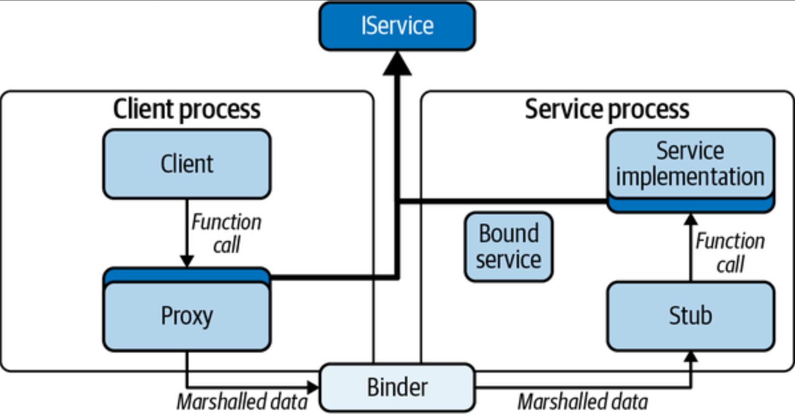

# Kotlin Essentials

Kotlin was created by the JetBrains team from St. Petersburg, Russia. 

Like Java, Kotlin is a statically typed language. 

| Feature                                   | Java                                                         | Kotlin                                                       |
| :---------------------------------------- | :----------------------------------------------------------- | :----------------------------------------------------------- |
| File contents                             | A single file contains a single top-level class.             | A single file can hold any number of classes, variables, or functions. |
| Variables                                 | Use `final` to make a variable immutable; variables are mutable by default. Defined at the class level. | Use `val` to make a variable read-only, or `var` for read/write values. Defined at the class level, or may exist independently outside of a class. |
| Type inferencing                          | Data types are required. `Date date = new Date();`           | Data types can be inferred, like `val date = Date()`, or explicitly defined, like `val date: Date = Date()`. |
| Boxing and unboxing types                 | In Java, data primitives like `int` are recommended for more expensive operations, since they are less expensive than boxed types like `Integer`. However, boxed types have lots of useful methods in Java’s wrapper classes. | Kotlin doesn’t have primitive types out of the box. Everything is an object. When compiled for the JVM, the generated bytecode performs automatic unboxing, when possible. |
| Access modifiers                          | Public and protected classes, functions, and variables can be extended and overridden. | As a functional language, Kotlin encourages immutability whenever possible. Classes and functions are final by default. |
| Access modifiers in multi-module projects | Default access is package-private.                           | There is no package-private, and default access is public. New `internal` access provides visibility in the same module. |
| Functions                                 | All functions are methods.                                   | Kotlin has function types. Function data types look like, for example, `(param: String) -> Boolean`. |
| Nullability                               | Any non-primitive object can be null.                        | Only explicitly nullable references, declared with the `?` suffix on the type, can be set to null: `val date: Date? = new Date()`. |
| Statics versus constants                  | The `static` keyword attaches a variable to a class definition, rather than an instance. | There is no `static` keyword. Use a private `const` or a `companion` object. |

## Kotlin Type System

### Primitive Types

The most obvious difference between Java’s and Kotlin’s type systems is that Kotlin has no notion of a *primitive type*.

### Null Safety

*Nullability* is part of Kotlin’s type system.

```kotlin
  val name: String? = null
```

`Any` is the root of the Kotlin type system, just like `Object` in Java. 

 all nonnullable types are subtypes of `Any` and all nullable types are subtypes of `Any?`.

Variables must be initialized. There is no default value for a variable. 

```kotlin
val name: String // error! Nonnullable types must be initialized!
```

### The Unit Type

In Kotlin, all functions, expressions and statement(like `if`) return a value and have a type. 

```kotlin
  val n = if (maybe) doThis() else doThat()
```

If the code for a function does not return a value explicitly, the function has the value `Unit`.

### Function Types

Kotlin’s type system supports *function types*. 

```kotlin
val func: (Double) -> Double = { x -> x.pow(2.0) }
```

The type of the function  type is `(Double) -> Double`.  If we supply that, though, we can omit the type specifier for the variable:

```kotlin
val func = { x: Double -> x.pow(2.0)}
```

Functions can receive other functions as parameters or return them as values. This kind of functions are higher-order functions.

```kotlin
fun getCurve(
    surface: (Double, Double) -> Int,
    x: Double
): (Double) -> Int {
    return { y -> surface(x, y) }
}
```

### Generics

A function (or a class) that uses a type variable is said to be *generic*. Like Java, Kotlin’s type system supports type variables. For instance:

```kotlin
fun <T> simplePair(x: T, y: T) = Pair(x, y)
```

## Variables and Functions

In Java the top-level syntactic entity is the class. All variables and methods are members of some class or other, and the class is the main element in a homonymous file.

Kotlin has no such limitations.

### Variables

There are two ways to declare a variable: with the keywords `val` and `var`.

The keyword `val` creates a variable that is read-only: it cannot be reassigned. 

```kotlin
val ronDeeLay = "the night time"
```

A `val` variable in Kotlin is more like a Java class’s field, which has a getter but no setter, as shown in the following code:

```kotlin
val surprising: Double
    get() = Math.random()
```

`var`, creates a familiar mutable variable: like a little box that holds the last thing that was put into it.

### Lambdas

Kotlin supports function literals: lambdas. 

```kotlin
{ x: Int, y: Int -> x * y; "down on the corner" }
```

By convention, the returned value is the value of the last expression in the body of the lambda. 

Kotlin has a very interesting feature that allows actually extending the language.

When the **last** argument to a function is another function (the function is higher-order), you can move the lambda expression passed as a parameter out of the parentheses that normally delimit the actual parameter list, as shown in the following code:

```kotlin
fun apiCall(param: Int, callback: () -> Unit)
```
  it can also be used like this:

```kotlin
apiCall(1) {
   println("I'm called back!")
}
```

### Extension Functions

In Kotlin, you have the ability to define a new method on a class, even though it isn’t a real member-function of that class. 

```kotlin
// declared inside FileUtils.kt
fun File.getWordAtIndex(index: Int): String {
    val context = this.readText()  // 'this' corresponds to the file
    return context.split(' ').getOrElse(index) { "" }
}
```

From inside the declaration of the extension function, `this` refers to the receiving type instance (here, a `File`). You only have access to `public` and `internal` attributes and methods, so `private` and `protected` fields are inaccessible.

We used `val` (instead of `fun`) to declare the extension property. 

```kotlin
// The Rectangle class has width and height properties
val Rectangle.area: Double
    get() = width * height
```

### Classes

One of Kotlin’s killer features, though, is the syntax for the constructor and the ability to declare properties within it. 

#### Class Initialization

```kotlin
class Point(val x: Int, var y: Int? = 3)

fun demo() {
    val pt1 = Point(4)
    assertEquals(3, pt1.y)
}
```

Note that the `var` and `val` keywords are very significant! The declaration `class Point(x: Int, y: Int)` is *very* different from the preceding declaration because it does not declare any member properties. Without the keywords, identifiers `x` and `y` are simply arguments to the constructor. 

You can also define both secondary constructors and initialization blocks:

```kotlin
class Segment(val start: Point, val end: Point) {
    val length: Double = sqrt(
            (end.x - start.x).toDouble().pow(2.0)
                    + (end.y - start.y).toDouble().pow(2.0))

    init {
        println("Point starting at $start with length $length")
    }

    constructor(x1: Int, y1: Int, x2: Int, y2: Int) :
            this(Point(x1, y1), Point(x2, y2)) {
        println("Secondary constructor")
    }
}
```

The output will be:

> ```kotlin
> >>> val s = Segment(1, 2, 3, 4)
> 
> Point starting at Point(x=1, y=2) with length 2.8284271247461903
> Secondary constructor
> ```
>

Kotlin guarantees this ordering: 

1. the primary constructor (if there is one) is run first. 
2. After it finishes, `init` blocks are run in declaration order (top to bottom). 
3. If the new instance is being created using a secondary constructor, the code block associated with that constructor is the last thing to run.

#### Properties

Kotlin variables, declared using `val` or `var` in a constructor, or at the top level of a class, actually define a *property*. 

Kotlin supports customizing the accessor and mutator for a property：

```kotlin
class Rectangle(val l: Int, val w: Int) {
    val area: Int
        get() = l * w
}
```

The identifier `field` has a special meaning only within the custom getter and setter, where it refers to the *backing field* that contains the property’s state.

```kotlin
class ExpensiveToHash(_summary: String) {

    var summary: String = _summary
        set(value) {
            field = value
            hashCode = computeHash()
        }

    //  other declarations here...
    var hashCode: Long = computeHash()

    private fun computeHash(): Long = ...
}
```

#### `lateinit` Properties

For Android developers, a UI widget used in an `Activity` or `Fragment`  is not initialized until the `onCreate` or `onCreateView` method. You can use nullable variable like this:

```kotlin
class MyFragment: Fragment() {
    private var button: Button? = null // will provide actual value later
}
```

You have to check for nullability when use it: `button?.setOnClickListener { .. }`

You can declare variables use `lateinit`,  Kotlin will let you declare it without assigning it a value. 

```kotlin
class MyFragment: Fragment() {
    private lateinit var button: Button // will initialize later
}
```

 By using the `lateinit` modifier, you disable Kotlin’s null safety for your variable. In our experience, using `lateinit` always resulted in runtime crashes. How did we fix that? By using a nullable type.

#### Lazy Properties

A Kotlin lazy value will not be initialized until a call is made at runtime. 

```kotlin
class Lightweight {
    val heavy by lazy { // Initialization block
        Heavyweight()
    }
}
```

The first time the property `heavy` is referenced, the initialization block will be run.

The code is thread-safe. Calls to `Lightweight::getHeavy()` will be synchronized so that only one thread at a time is in the initialization block.

#### Delegates

Lazy delegation is just one of many varieties of *property delegation*. A declaration uses the keyword `by` to define a delegate that is responsible for getting and setting the value of the property. 

The keyword `by` says that the next identifier in the declaration is an expression that will evaluate to the object that will be responsible for the value of `heavy`.

#### Companion Objects

In  Kotlin, there is no static variables, we use companion object instead.

A companion object is a *singleton object* always related to a Kotlin class. Most often the definition of a companion object is placed at the bottom of the related class.

A companion object is initialized when Kotlin loads the related class.

```kotlin
interface Formatter {
    val yearMonthDate: String
}

class TimeExtensions {
    //  other code

    companion object StdTimeExtension : Formatter {
        const val TAG = "TIME_EXTENSIONS"
        override val yearMonthDate = "yyyy-MM-d"
    }
}
```

#### Data Classes

In java, we often use *POJOs* (plain old Java objects) to represente simple structured data. They are a collection of data members (fields), most of which have getters and setters, and just a few other methods: `equals`, `hashCode`, and `toString`. 

In Kotlin, these kinds of classes are so common that Kotlin has made them part of the language. They are called *data classes*.

```kotlin
data class Point(var x: Int, var y: Int? = 3)
```

 A data class automatically includes overrides for the methods `equals`, `hashCode`, and `toString`. Each of these automatically generated methods depends on all of a class’s properties.

 A `data class` also provides the `copy` method. Here’s an example of its use:

```kotlin
data class Point(var x: Int, var y: Int? = 3)
val p = Point(1)          // x = 1, y = 3
val copy = p.copy(y = 2)  // x = 1, y = 2
```

#### Enum Classes

Remember when developers were being advised that enums were too expensive for Android? Fortunately, no one is even suggesting that anymore: use enum classes to your heart’s desire!

```kotlin
enum class GymActivity {
    BARRE, PILATES, YOGA, FLOOR, SPIN, WEIGHTS
}

enum class LENGTH(val value: Int) {
    TEN(10), TWENTY(20), THIRTY(30), SIXTY(60);
}
```

Enums work very well with Kotlin’s `when` expression. For example:

```kotlin
fun requiresEquipment(activity: GymActivity) = when (activity) {
    GymActivity.BARRE -> true
    GymActivity.PILATES -> true
    GymActivity.YOGA -> false
    GymActivity.FLOOR -> false
    GymActivity.SPIN -> true
    GymActivity.WEIGHTS -> true
}
```

Omitting the `else` clause like this has a really nice advantage: if we add a new value to the `GymActivity` enum, our code suddenly won’t compile. 

Omitting the `else` clause like this has a really nice advantage: if we add a new value to the `GymActivity` enum, our code suddenly won’t compile. 

#### Sealed Classes

Consider the following code. It defines a single type, `Result`, with exactly two subtypes. `Success` contains a value; `Failure` contains an `Exception`:

```kotlin
sealed class Result
data class Success(val data: List<Int>) : Result()
data class Failure(val error: Throwable?) : Result()
```

Notice that there is no way to do this with an `enum`. All of the values of an enum must be instances of the same type. 

Sealed classes do for types what enums do for instances. They allow you to announce to the compiler that there is a fixed, known set of subtypes

#### Visibility Modifiers

The default visibility is different in Kotlin—it’s *public*. There is no package-private in Kotlin.

*internal* is the fourth visibility modifier supported by Kotlin, which makes the reference visible anywhere within the containing *module*.

# Kotlin Collections Framework

## Collection Basics

### Java Interoperability


For the most part, Kotlin extends, but does not alter the Java framework. It just adds the new, functional methods.

### Mutability

*Mutable* is the opposite of *immutable*. A mutable object can be changed and an immutable one cannot. The distinction is critical when trying to optimize code. Since they cannot change, immutable objects can be shared safely among multiple threads. A mutable object, however, must be made explicitly thread-safe if it is to be shared. Thread safety requires locking or copying, which may be expensive.

`kotlinx.collections.immutable` library is intended to be a set of truly immutable collections. To use them in your own Android/Kotlin project, add the following dependency to your `build.gradle` file:

```groovy
implementation \
'org.jetbrains.kotlinx:kotlinx-collections-immutable:$IC_VERSION'
```

While the *Kotlinx Immutable Collections Library* uses state-of-the-art algorithms and optimizes them so that they are very fast compared to other JVM implementations of immutable collections, these true immutable collections are still an order of magnitude slower than their mutable analogs.

```kotlin
val mutableList = mutableListOf(1, 2, 4, 5)
val immutableList = listOf(1, 2, 4, 5)
mutableList.add(4)    // compiles

// doesn't compile: ImmutableList has no `add` method.
immutableList.add(2)
```

### Overloaded Operators

The `+` and `-` operators preserve order when the underlying container is ordered. For instance:

```kotlin
(listOf(1, 2) + 3)
    .equals(listOf(1, 2, 3))    // true
(listOf(1, 2) + listOf(3, 4))
    .equals(listOf(1, 2, 3, 4)) // true
```

Adding a noncontainer object to a container creates a new container that has all of the elements from the left-hand operand (the container) with the new element (the right-hand operand) added. Adding two containers together creates a new container that has all of the elements from both.

### Creating Containers

Build a `Map` like this:

```kotlin
// Type is Map<Int, Int>
val map = mapOf(1 to 2, 4 to 5)

// Type is MutableMap<String, Int>
val map = mutableMapOf("Earth" to 3, "Venus" to 4)
```

Kotlin will choose the nearest type in the type hierarchy tree that is an ancestor of all of the elements of the container (this type is called the *upper bound type*). In this case it will choose `Number`, the nearest ancestor of both `Long` and `Double`. The variable `list` has the inferred type `List<Number>`:

```kotlin
val list = listOf(1L, 3.14)
```

In order to allow the list to contain `null`, we’d have to specify its type explicitly:

```kotlin
val list: MutableList<Any?> = mutablelistOf(1L, 3.14, "e")
```

## Functional Programming

*Object-oriented programming* (OOP) and *functional programming* (FP) are both paradigms for software design.

```kotlin
fun forAll() = collection.forEach(::doSomething)
```

That argument, `doSomething` in this case, is a function that takes a single parameter of the type contained in `collection`. 

## Transformation Functions

Kotlin brings functional capabilities to collections to provide elegant and safe ways of manipulating them.

### Boolean Functions

A convenient set of collection functions return a `Boolean` to indicate whether the collection has—or does not have—a given attribute. 

```kotlin
val nums = listOf(10, 20, 100, 5)

// return true if the predicate evaluates true for any element in the collection
val isAnyOdd = nums.any { it % 1 > 0 } // true

// returns true only if every element in the list matches the predicate
val isAll = nums.all { it % 1 > 0 } // false

// returns true only if the predicate evaluates to true for none of the elements in the collection
val isAny4 = nums.none { it == 4 }   // true
```

When a lambda takes only a single argument and the Kotlin compiler can figure that out using type inferencing (it usually can), you can omit the parameter declaration and use the implicit parameter named `it`. 

### Filter Functions

The basic `filter` function will return a new collection containing only the elements of the original collection that match the given predicate. 

```kotlin
val nums = listOf(10, 20, 100, 5)
val numbers = nums.filter { it > 20 }

// returns elements that do not match the predicate
val numbers = nums.filterNot { it > 20 }

val nums = listOf(null, 20, null, 5)
//  removes all of the nulls from a collection
val numbers = nums.filterNotNull() // { 20, 5 }
```

### Map

The *map* function applies its argument to each element in a collection and returns a collection of the resulting values.

```kotlin
val doubles: List<Double?> = listOf(1.0, 2.0, 3.0, null, 5.0)

// the variable squares will be the list [1.0, 4.0, 9.0, null, 25.0]
val squares: List<Double?> = doubles.map { it?.pow(2) }

// The value of the variable squares in this example is [1.0, 4.0, 9.0, 25.0].
val squares: List<Double?> = doubles.mapNotNull { it?.pow(2) }
```

Another variant of `map` is `mapIndexed`. `mapIndexed`’s functional argument takes the position in the collection as 1st parameter(0 for the first element, 1 for the second), an element of the collection as its second parameter.

There are mapping functions for most collection-like objects. There are even similar functions for `Map`s (though they are not subtypes of `Collection`): the functions `Map::mapKeys` and `Map::mapValues`.

### flatMap

See the definition and explaination in RxJava.

```kotlin
val list: List<List<Int>> = listOf(listOf(1, 2, 3, 4), listOf(5, 6))
val flatList: List<Int> = list.flatMap { it }
```

The variable `flatList` will have the value [1, 2, 3, 4, 5, 6].

### Grouping

```kotlin
val numbers = listOf(1, 20, 18, 37, 2)
val groupedNumbers = numbers.groupBy {
    when {
        it < 20 -> "less than 20"
        else -> "greater than or equal to 20"
    }
}
```

The variable `groupedNumbers` now contains a `Map<String, List<Int>>`. The map has two keys, “less than 20” and “greater than or equal to 20.” The value for the first key is the list [1, 18, 2]. The value for the second is [20, 37].

### Iterators Versus Sequences

A sequence differs from an iterator in a similar way. An iterator is a way of getting each element from an existing collection exactly once.

Sequences are backed by *generators*. A generator is a function that will provide the next item in the sequence. Sequences are appropriate when getting the next element is very expensive, or even on collections of unbounded size.

Because sequences are lazy—only generating the next element when it is needed—they can be very, very useful in optimizing operations, even on collections with fixed content.

```kotlin
val catPage = listOf(
    "http://ragdollies.com",
    "http://dogs.com",
    "http://moredogs.com")
    .map { fetchPage(it) }
    .first { hasCat(it) }
```

That algorithm will download all of the pages. If you do the same thing using a sequence:

```kotlin
val catPage = sequenceOf(
    "http://ragdollies.com",
    "http://dogs.com",
    "http://moredogs.com")
    .map { fetchPage(it) }
    .first { hasCat(it) }
```

only the first page will be downloaded. The sequence will provide the first URL, the `map` function will fetch it, and the `first` function will be satisfied. None of the other pages will be downloaded.

# Android Fundamentals

Android applications are programs translated from a source language (Java or Kotlin) into a transportable intermediate language, DEX. The DEX code is installed on a device and interpreted by the ART VM, when the application is run.

Android supports four types of components:

- Activity
- Service
- Broadcast receiver
- Content provider

The application components (not some overarching application) are the basic units of the Android app. 

The lifecycles of Android application components are managed by the Android framework, which creates and destroys them according to its needs. Application code must *never* create a new instance of a component.

## Intents and Intent Filters

In Android, components are started with `Intent`s. An `Intent` is a small packet that names the component that it targets. It has some extra room in which it can indicate a specific action that it would like the receiving component to take and a few parameters to the request.

```kotlin
context.startActivity(
  Intent(context, MembersListActivity::class.java)))
```

The `Intent` fired by this line of code is called an *explicit intent* because it names a specific, unique class, in a unique application (identified by a `Context`, discussed in a moment), to which the `Intent` is to be delivered.

The `Intent`’s constructor uses the `context` passed as its first argument to get a unique name for the application to which the `context` belongs: this call starts an `Activity` that belongs to this application.

The `Intent`’s constructor uses the `context` passed as its first argument to get a unique name for the application to which the `context` belongs: this call starts an `Activity` that belongs to this application.

Let's take an implicit example:

```kotlin
val intent = Intent(Intent.ACTION_EDIT))
intent.setDataAndType(textToEditUri, textMimeType);
startActivityForResult(intent, reqId);
```

The target specified in this intention is *not* explicit. The `Intent` specifies neither a `Context` nor the fully qualified name of a component within a context. The intent is *implicit* and Android will allow any component at all to register to handle it.

Components register for implicit intents using an `IntentFilter`:

```xml
<manifest ...>
  <application
    android:label="@string/awesome_code_editor">
    ...>
    <activity
      android:name=".EditorActivity"
      android:label="@string/editor">
      <intent-filter>
        <action
          android:name="android.intent.action.EDIT" />
        <category
          android:name="android.intent.category.TEXT" />
      </intent-filter>
    </activity>
  </application>
</manifest>
```

the `EditorActivity` claims to be able to handle an `EDIT` action for the category `android.intent.category.TEXT`.

## Context

The `Context` is an abstract class that provides access to various resources, including:

- Starting other components
- Accessing system services
- Accessing `SharedPreferences`, resources, and files

 In addition to being `Context`s, they are also components that the Android container expects to manage. This can lead to problems, all of which are variations.

```kotlin
class MainActivity : AppCompatActivity() {
  companion object {
    var context: Context? = null;
  }

  override fun onCreate() {
    if (context == null) {
      context = this  // NO!
    }
  }
  // ...
}
```

There are two things that could go wrong, one bad and the other horrible. Bad is when the Android framework knows that the `Activity` is no longer needed, and would like to free it up for garbage collection, but it cannot do so. The reference in that companion object will prevent the `Activity` from being released, for the entire lifetime of the application. The `Activity` has been leaked. `Activity`s are large objects and leaking their memory is no small matter.

The second (far worse) thing, that could go wrong is that a call to a method on the cached `Activity` could fail catastrophically. As we will explain shortly, once the framework decides that an `Activity` is no longer being used, it discards it. It is done with it and will never use it again. As a result, the object may be put into an inconsistent state. Calling methods on it may lead to failures that are both difficult to diagnose and reproduce.

**Application context** instance is a `Context` and, though it has a lifecycle, that lifecycle is essentially congruent with the lifecycle of the application. 

Because it is long-lived, it is quite safe to hold references to it in other long-lived places:

```kotlin
class SafeApp : Application() {
  companion object {
    var context: Context? = null;
  }

  override fun onCreate() {
    if (context == null) {
      context = this
    }
  }
  // ...
}
```

You cannot launch `Activity` from an `ApplicationContext`. There is a `startActivity` method on `ApplicationContext`, but it simply generates an error message in all but a very limited set of circumstances.

## Activity

An `Activity` component manages a single page of an application’s UI. The lifecycle of Activity is shown as the following state machine:


The methods are called strictly in order. After a call to `onStart`, for instance, Android will make only one of two possible calls: `onResume`, to enter the next state, or `onStop`, to revert to the previous state.

The `onCreate` method is the ideal place to do any initialization that an `Activity` needs to do only once. This almost always includes setting up the view hierarchy (usually by inflating an XML layout), installing view controllers or presenters, and wiring up text and touch listeners.

the `onDestroy` method is not necessarily the best place to perform essential finalization! Android calls `onDestroy` only on a best-effort basis. It is entirely possible that an application will be terminated before all of an `Activity`s’. `onDestroy` methods have completed.

An `Activity` can be destroyed from within its own program by calling its `finish()` method.

The next pair of methods are `onStart` and `onStop`. The former, `onStart`, will only ever be called on an `Activity` that is in the created state. It moves the `Activity` to its on-deck state, called *started*. A started `Activity` may be partially visible behind a dialog or another app that only incompletely fills the screen. In started state, an `Activity` should be completely painted but should not expect user input. A well-written `Activity` will not run animations or other resource-hogging tasks while it is in the started state.

The `onStop` method will only be called on a started `Activity`. It returns it to the created state.

The final pair of methods are `onResume` and `onPause`. Between them, an `Activity`’s page is in focus on the device and the target of user input. It is said to be *running*. Again, these methods will only be called on an `Activity` that is in the started or running state, respectively.

It is a good practice to respect the pairing of these methods: a beginning method and an end method. If you start something running in the beginning method of the pair, stop it in the end method of the same pair. Trying to start, say, network polling in `onResume` and stop it in `onStop` is a recipe for hard-to-find bugs.

**Fragments**

`Fragment`s are not `Context`s. Though they hold a reference to an underlying `Activity` for most of their lifecycle, `Fragment`s are not registered in the manifest. They are instantiated in application code and cannot be started with `Intent`s. 

`Fragment`s have lifecycles that are similar to (though more complex than) those of an `Activity`. However, a `Fragment` is only useful when it is attached to an `Activity`.


**The back stack**

Android supports a navigation paradigm sometimes called *card-deck* navigation. Navigating to a new page stacks that page on top of the previous page. When a user presses a back button the current page is popped from the stack to reveal the one that previously held the screen. 


`Fragment`s can also go on the back stack as part of a fragment transaction, as shown:


Adding a fragment to the back stack can be particularly useful when combined with tagging, as shown in the following code:

```kotlin
// Add the new tab fragment
supportFragmentManager.beginTransaction()
    .replace(
        R.id.fragment_container,
        SomeFragment.newInstance())
    .addToBackStack(FRAGMENT_TAG)
    .commit()
```

This code creates a new instance of `SomeFragment` and adds it to the back stack, tagged with the identifier `FRAGMENT_TAG` (a string constant). As shown in the following code, you can use `supportFragmentManager` to pop *everything* off the back stack, all the way to the tag:

```kotlin
manager.popBackStack(
    FRAGMENT_TAG,
    FragmentManager.POP_BACK_STACK_INCLUSIVE)
```

When the back stack is empty, pushing the back button returns the user to the Launcher.

## Service

A `Service` is an Android component that is, almost exactly, an `Activity` with no UI. 

There are, actually, two different kinds of `Service`: *bound* and *started*. Despite the fact that the `Service` base class is, confusingly, the template for both, the two types are completely orthogonal. A single `Service` can be either or both.

### Started Services

A *started* `Service` is initiated by sending it an `Intent`. 

The service receives the intent as the argument to a call from the Android framework, to the method `Service.onStart`. Note that this is not done in the “background”! The `onStart` method runs on the main/UI thread. 

### Bound Services

A *bound* `Service` is Android’s IPC mechanism.




An instance of the class `ServiceConnection` represents a connection to a bound service. The following code demonstrates its use:

```kotlin
abstract class BoundService<T : Service> : ServiceConnection {
    abstract class LocalBinder<out T : Service> : Binder() {
        abstract val service: T?
    }

    private var service: T? = null

    protected abstract val intent: Intent?

    fun bind(ctxt: Context) {
        ctxt.bindService(intent, this, Context.BIND_AUTO_CREATE)
    }

    fun unbind(ctxt: Context) {
        service = null
        ctxt.unbindService(this)
    }

    override fun onServiceConnected(name: ComponentName, binder: IBinder) {
        service = (binder as? LocalBinder<T>)?.service
        Log.d("BS", "bound: ${service}")
    }

    override fun onServiceDisconnected(name: ComponentName) {
        service = null
    }
}
```

A subclass of `BoundService` provides the type of the service that will be bound, and an `Intent` that targets it.

The client side initiates a connection using the `bind` call. In response, the framework initiates a connection to the remote bound service object. The remote framework calls the bound service’s `onBind` method with the intent. The bound service creates and returns an implementation of `IBinder` that is also an implementation of the interface the client requested. Note that this is often a reference to the bound service itself. In other words, the `Service` is often not only the factory but also the implementation.

The service side uses the implementation provided by the bound service to create the remote-side stub. It then notifies the client side that it’s ready. The client-side framework creates the proxy and then finally calls the `ServiceConnection`’s `onServiceConnected` method. The client now holds a live connection to the remote service. Profit!

As one might guess from the presence of an `onServiceDisconnected` method, a client can lose the connection to a bound service at any time. Though the notification is usually immediate, it is definitely possible for a client call to a service to fail even before it receives a disconnect notification.

Like a started service, bound service code does not run in the background. Unless explicitly made to do otherwise, bound service code runs on the application’s main thread. This can be confusing, though, because a bound service might run on the main thread of a *different* application.

If the code in a service implementation must run on a background thread, it is the service implementation that is responsible for arranging that. 

Services, like every other component, must be registered in the application manifest:

```kotlin
<manifest xmlns:android="http://schemas.android.com/apk/res/android">
  <application...>
    <service android:name=".PollService"/>
  </application>
</manifest>
```

# Concurrency in Android

## Memory Leaks

Consider offloading a task to a worker thread like this:

```kotlin
override fun onViewCreated(
    view: View,
    savedInstanceState: Bundle?
) {
    // DO NOT DO THIS EITHER!
    myButton.setOnClickListener {
        Thread {
            val status = doTimeConsumingThing()
            view.post {
                view.findViewById<TextView>(R.id.textview_second)
                    .setText(status)
            }
        }
            .start()
    }
}
```

`doTimeConsumingThing` is a method on an `Activity` (or `Fragment`), the thread, newly created in the click listener, holds an *implicit* reference to that `Activity`.


Now the `Activity` instance cannot be garbage-collected as long as the `Runnable` running on the worker thread holds a reference to it. If the thread runs for any significant amount of time, `Activity` memory has leaked.

## Tools for Managing Threads

A best practice for applications is a thread policy: an application-wide strategy based on the number of threads that is actually useful, that controls how many threads are running at any given time. A smart application maintains one or more pools of threads, each with a particular purpose, and each fronted by a queue. Client code, with work to be done, enqueues tasks to be executed by the pool threads and, if necessary, recovers the task results.

Java and Android provide several language-level threading primitives:

- A `Looper`/`Handler` is a queue of tasks serviced by a single, dedicated thread.
- `Executor`s and `ExecutionService`s are Java constructs for implementing an application-wide thread-management policy.

### Looper/Handler

The `Looper`/`Handler` is a framework of cooperating classes: a `Looper`, a `MessageQueue` and the `Message`s enqueued on it, and one or more `Handler`s.

A `Looper` is simply a Java `Thread` that is initialized by calling the methods `Looper.prepare()` and `Looper.start()` from its `run` method, like this:

```
var looper = Thread {
    Looper.prepare()
    Looper.loop()
}
looper.start()
```

The second method, `Looper.loop()`, causes the thread to enter a tight loop in which it checks its `MessageQueue` for tasks, removes them one by one, and executes them. If there are no tasks to be executed, the thread sleeps until a new task is enqueued.

A `HandlerThread` is a thread to which a “message loop” is attached. Be really careful about remembering to stop a `HandlerThread`. For example, imagine you start a `HandlerThread` within the lifecycle of an activity (say, in an `onCreate` method of a fragment). If you rotate the device, the activity is destroyed and then re-created. A new`HandlerThread` instance is then created and started while the old one is still running, leading to a serious memory leak.


Android’s UI thread is simply a `Looper` created from the application process’s main thread.

A `Handler` is the mechanism used to enqueue tasks on a `Looper`’s queue, for processing. You create a `Handler` like this:

```
var handler = new Handler(someLooper);
```

The main thread’s `Looper` is always accessible using the method `Looper.getMainLooper`. Creating a `Handler` that posts tasks to the UI thread, then, is as simple as this:

```
var handler = new Handler(Looper.getMainLooper);
```

In fact, this is exactly how the `post()` method, shown in the preceding example, works.

`Handler`s are interesting because they handle both ends of the `Looper`’s queue. In order to see how this works, let’s follow a single task through the `Looper`/`Handler` framework.

There are several `Handler` methods for enqueuing a task. Here are two of them:

- `post(task: Runnable)`
- `send(task: Message)`

These two methods define two slightly different ways of enqueuing a task: sending messages and posting `Runnable`s. Actually, the `Handler` always enqueues a `Message`. For convenience, though, the `post...()` group of methods attach a `Runnable` to the `Message` for special handling.


The `MessageQueue` is, actually, a sorted queue. 

Two other methods, though, allow tasks to be enqueued to be run at some time in the future:

- `postDelayed(runnable, delayMillis)`
- `sendMessageDelayed(message, delayMillis)`

Because a `Looper` is single-threaded, a task that is only run on one particular `Looper` need not be thread-safe.

### Executors and ExecutorServices

An `Executor` is, as its name suggests, a utility that executes tasks submitted to it. Its contract is the single method `execute(Runnable)`.

Java provides several implementations of the interface, each with a different execution strategy and purpose. The simplest of these is available using the method `Executors.newSingleThreadExecutor`.

A single-threaded executor is very similar to the `Looper`/`Handler` examined in the previous section: it is an unbounded queue in front of a single thread. 

A generalization of the single-threaded `Executor` is the `FixedThreadPoolExecutor`: instead of a single thread, its unbounded queue is serviced by a fixed number of threads. A `FixedThreadPoolExecutor` does not guarantee task order, though, and will execute tasks simultaneously, hardware permitting.

The `ForkJoinPool`. Fork-join pools exist because of the observation that sometimes a single problem can be broken down into multiple subproblems which can be executed concurrently.

## Tools for Managing Jobs

Android 8.0 (API 26+) introduced limits on application resource consumption. Included in these limitations are the following:

- An application is in the foreground only when it has a visible activity or is running a foreground service. Bound and started `Service`s no longer prevent an application from being killed.
- Applications cannot use their manifest to register for implicit broadcasts. There are also limitations on sending broadcasts.

These constraints can make it difficult for an application to perform “background” tasks: synching with a remote, recording location, and so on. In most cases, the constraints can be mitigated using the `JobScheduler` or Jetpack’s `WorkManager`.

Android offers the architectural components `JobScheduler` and `WorkManager` to schedule tasks efficiently.

### JobScheduler

The `JobScheduler` is Android’s tool for scheduling tasks—possibly repeating tasks—in the future. It is quite adaptable and, in addition to optimizing battery life, provides access to details of system state that applications used to have to infer from heuristics.

A `JobScheduler` job is, actually, a bound service. An application declares a special service in its manifest to make it visible to the Android system. It then schedules tasks for the service using `JobInfo`.

The first step in creating a `JobScheduler` task is registering it in the application manifest. That is done as shown here:

```
<service
    android:name=".RecurringTask"
    android:permission="android.permission.BIND_JOB_SERVICE"/>
```

The important thing in this declaration is the permission. Unless the service is declared with *exactly* the `android.permission.BIND_JOB_SERVICE` permission, the `JobScheduler` will not be able to find it.

Note that the task service is not visible to other applications. 

The next step in setting up a `JobScheduler` task is scheduling it, as shown here, in the method `schedulePeriodically`:

```kotlin
const val TASK_ID = 8954
const val SYNC_INTERVAL = 30L
const val PARAM_TASK_TYPE = "task"
const val SAMPLE_TASK = 22158

class RecurringTask() : JobService() {
    companion object {
        fun schedulePeriodically(context: Context) {
            val extras = PersistableBundle()
            extras.putInt(PARAM_TASK_TYPE, SAMPLE_TASK)

            (context.getSystemService(Context.JOB_SCHEDULER_SERVICE)
                as JobScheduler)
                .schedule(
                    JobInfo.Builder(
                        TASK_ID,
                        ComponentName(
                            context,
                            RecurringTask::class.java
                        )
                    )
                        .setPeriodic(SYNC_INTERVAL)
                        .setRequiresStorageNotLow(true)
                        .setRequiresCharging(true)
                        .setExtras(extras)
                        .build()
                )
        }
    }

    override fun onStartJob(params: JobParameters?): Boolean {
        // do stuff
        return true;
    }

    override fun onStopJob(params: JobParameters?): Boolean {
        // stop doing stuff
        return true;
    }
}
```

The `onStartJob` method is run on the main (UI) thread. 

If `onStartJob` returns `true`, the system will allow the application to run until either it calls `jobFinished` or the conditions described in the `JobInfo` are no longer satisfied. 

If `onStopJob()` returns `false`, the task will not be scheduled again, even if the criteria in its `JobInfo` are met: the job has been cancelled. A recurring task should always return `true`.

### WorkManager

The `WorkManager` is an Android Jetpack library that wraps the `JobScheduler`. It allows a single codebase to make optimal use of modern versions of Android—those that support the `JobScheduler`—and still work on legacy versions of Android that do not.

Where the `JobScheduler` encodes the difference between a task that repeats periodically and one that runs once in the `Boolean` return from the `onStopJob` method, the `WorkManager` makes it explicit; there are two types of tasks: a `OneTimeWorkRequest` and a `PeriodicWorkRequest`.

Enqueuing a work request always returns a token, a `WorkRequest` that can be used to cancel the task, when it is no longer necessary.

# Coroutine

## Coroutine Concepts

The official Kotlin documentation qualifies coroutines as “lightweight threads”. Coroutines are indeed *lightweight*, but it is important to note that *coroutines aren’t threads*themselves. You may conceptualize coroutines as *blocks of code that can be dispatched to threads that are nonblocking*.

The following example uses semantics declared in the `kotlinx.coroutines` package:

```kotlin
fun main() = runBlocking {
    val job: Job = launch {
        var i = 0
        while (true) {
            println("$i I'm working")
            i++
            delay(10)
        }
    }

    delay(30)
    job.cancel()
}
```

The result is as follows:

> ```
> 0 I'm working 
> 1 I'm working 
> 2 I'm working
> ```

- The method `runBlocking` runs a new coroutine and blocks the current thread until the coroutine work has completed.

- We create a coroutine with the `launch` function. `launch` is a *coroutine builder* which is “fire-and-forget” work—in other words, there is no result to return.

  Once called, it immediately returns a `Job` instance, and starts a new coroutine. A `Job` represents the coroutine itself, like a handle on its lifecycle. The coroutine can be cancelled by calling the `cancel` method on its `Job` instance.

- The `delay` function looks suspiciously like `Thread.sleep` in its usage. The major difference is that `delay` is *nonblocking* while`Thread.sleep(...)` is *blocking*. 

The code continues to execute in the main thread, giving us a total of three printed lines within a 30 ms window given to us by the `delay` call:


If you need to get a result from an asynchronous computation, then you should use the `async`coroutine builder.

The `async` coroutine builder can be compared to Java’s `Future`/`Promise` model to support asynchronous programming.  The `async` coroutine builder *returns a wrapper around a result*; and the type of this wrapper is `Deferred<T>` as shown in the following code:

```kotlin
fun main() = runBlocking {
    val slow: Deferred<Int> = async {
        var result = 0
        delay(1000)   // simulate some slow background work
        for (i in 1..10) {
            result += i
        }
        println("Call complete for slow: $result")
        result
    }

    val quick: Deferred<Int> = async {
        delay(100)   // simulate some quick background work
        println("Call complete for quick: 5")
        5
    }

    val result: Int = quick.await() + slow.await()
    println(result)
}
```

The result is:

> ```
> Call complete for quick: 5 
> Call complete for slow: 55 
> 60
> ```

- The `async` coroutine builder is intended for *parallel decomposition of work*—that is, you *explicitly* specify that some tasks will run concurrently.

  Once called, an `async` immediately returns a `Deferred`instance. `Deferred` is a specialized `Job`, with a few extra methods like `await`. It’s a `Job` with a return value.

- By calling the method `await` on each `Deferred<Int>` instance, the program waits for the result of each coroutine.

## CoroutineScope and CoroutineContext

A `CoroutineScope` controls the lifecycle of a coroutine within a well-defined scope or lifecycle. It’s an object that plays the role of the parent in structured concurrency—its purpose is to manage and monitor the coroutines you create inside it. 

In the previous example,  `CoroutineScope` was provided by the `runBlocking`block to launch a new coroutine. 

```kotlin
fun main() = runBlocking {
    val slow: Deferred<Int> = async {
        // ...
    }
}
```

Coroutine builders(`launch`, `async`) are extension functions of`CoroutineScope`:

```kotlin
fun <T> runBlocking(
    // function arguments removed for brevity
    block: suspend CoroutineScope.() -> T): T { // impl
}
```

The last argument is a function with a receiver of type `CoroutineScope`. Consequently, when you supply a function for the block argument, there is a `CoroutineScope` at your disposal which can invoke extension functions of `CoroutineScope`.

So, the following code will not compile:

```kotlin
fun main() {
   launch {
       println("I'm working")       // will not compile
   }
}
```

Since regular code doesn’t provide a `CoroutineScope` instance, you cannot directly invoke coroutine builders from there.

Scopes and coroutines form a tree-like architecture with a scope at its root(*coroutines are represented as rectangles*):


a `CoroutineScope` is an interface:

```kotlin
interface CoroutineScope {
    val coroutineContext: CoroutineContext
}
```

 a `CoroutineScope` is a container for a`CoroutineContext`.

```kotlin
fun CoroutineScope.launch(
    context: CoroutineContext = EmptyCoroutineContext,
    // other params removed for brevity,
    block: suspend CoroutineScope.() -> Unit
): Job { /* implementation */ }
```

You’ll most often use a special context element to control which thread, or which thread pool, will execute your coroutine(s):

```kotlin
fun main() = runBlocking<Unit> {
    launch(Dispatchers.Default) {
        println("I'm executing in ${Thread.currentThread().name}")
    }
}
```

The output is now:

```
I'm executing in DefaultDispatcher-worker-2 @coroutine#2
```

`Dispatchers.Main` is a context element.

As its name suggests, the purpose of a `Dispatcher` is to dispatch coroutines on a specific thread or thread pool. By default, there are four `Dispatcher`s available out of the box—`Main`, `Default`, `IO`, and`Unconfined`:

| Dispatcher         | Description |
| ------------------------ | ------------------------------------------------------------ |
| `Dispatchers.Main`       | This uses the main thread, or the UI thread, of the platform you’re using. |
| `Dispatchers.Default`    | This is meant for CPU-bound tasks, and is backed by a thread pool of four threads by default. |
| `Dispatchers.IO`         | This is meant for IO-bound tasks, and is backed by a thread pool of 64 threads by default. |
| `Dispatchers.Unconfined` | This isn’t something you should use or even need as you’re learning coroutines. It’s primarily used in the internals of the coroutines library. |

A `Job` instance is a handle on the lifecycle of the coroutine—it’s part of the coroutine context too. 

In coroutine framework parlance, a coroutine always runs inside a context. *This* context is provided by a coroutine scope and is different from the context you supply. To avoid confusion, we’ll call the context of the coroutine the *coroutine context*, and we’ll call the context you supply to the coroutine builder the *supplied context*.

```kotlin
fun main() = runBlocking<Unit>(Dispatchers.Main) {
    launch(Dispatchers.Default) {
        val threadName = Thread.currentThread().name
        println("I'm executing in $threadName")
    }
}
```

This block of code creates two coroutines with their own respective`Job` instance: `runBlocking` starts the first coroutine, and the other one is started by `launch`.

The coroutine created by `runBlocking` has its own context. Since this is the root coroutine started inside the scope, we call this context the *scope context*. The scope context encompasses the coroutine context.


In the previous example, there are two context in `launch` coroutine, one from the receiver type (the scope context), and the other one from the context parameter (the supplied context). It merges the two contexts so that the elements from the context parameter take precedence over the other elements from the scope.


## Structured Concurrency

Coroutine has parent-child relationship:


Cancellation always propagates downward, not upward.

If the parent fails or is cancelled, then all its children are also cancelled. In the case of cancellation of one of the children, the parent will not be cancelled. The parent always waits for all its children to complete.

Both  `CoroutineScope`s  and  `CoroutineContext`s  play  the  role  of  the parent, while Coroutines, on play the role of the children.

## Suspending Functions

A task, or more precisely, a coroutine, can suspend if it makes use of at least one *suspending function*. 

A suspending function is a function which may not return immediately. If it doesn’t return right away, it suspends the coroutine that called this suspending function while computation occurs. This inner computation *should not block* the calling thread. Later, the coroutine is resumed when the inner computation completes.

A suspending function can only be called from inside a coroutine or from another suspending function.

When the Kotlin compiler encounters a suspending function, it compiles to a regular function with an additional parameter of type `Continuation<T>`, which is just an interface:

```kotlin
ublic interface Continuation<in T> {
    /**
     * The context of the coroutine that corresponds to this continuation.
     */
    public val context: CoroutineContext

    /**
     * Resumes the execution of the corresponding coroutine passing a successful
     * or failed [result] as the return value of the last suspension point.
     */
    public fun resumeWith(result: Result<T>)
}
```

Let's look at a practical example:

```kotlin
suspend fun fetchProfile(id: String) = withContext(Dispatchers.Default) {
   //  returns a Profile instance
}

fun fetchAndLoadProfile(id: String) {
    scope.launch {
        val profile = fetchProfile(id)   // suspends
        loadProfile(profile)
    }
}
```

The coroutine started by `launch` is suspended when invoking `fetchProfile`. It will remain suspended until the profile is retrieved, at which point the coroutine started by `launch` resumes. The next line (`loadProfile`) is then executed.

There are several ways to create a suspending function. Using`withContext` is only one of them, although probably the most common.

Notice how this reads like procedural code.

The thread that will execute the body of `withContext` is determined by the provided `Dispatcher`. For example, using `Dispatchers.Default`, it would be one of the threads of the thread pool dedicated for CPU-bound tasks. In the case of `Dispatchers.Main`, it would be the main thread.

Using suspending functions in the view-model:

```kotlin
class HikesViewModel : ViewModel() {
    private val hikeDataList = mutableListOf<HikeData>()
    private val hikeLiveData = MutableLiveData<List<HikeData>>()

    fun update() {
        viewModelScope.launch {                                 1
            /* Step 1: get the list of hikes */
            val hikes = hikesForUser("userId")                  2

            /* Step 2: for each hike, get the weather, wrap into a
             * container, update hikeDataList, then notify view
             * listeners by updating the corresponding LiveData */
            hikes.forEach { hike ->                             
                launch {
                    val weather = weatherForHike(hike)          
                    val hikeData = HikeData(hike, weather)
                    hikeDataList.add(hikeData)
                    hikeLiveData.value = hikeDataList
                }
            }
        }
    }
}

suspend fun hikesForUser(userId: String): List<Hike> {
    return withContext(Dispatchers.IO) {
        fetchHikesForUser(userId)
    }
}

suspend fun weatherForHike(hike: Hike): Weather {
    return withContext(Dispatchers.IO) {
        fetchWeather(hike)
    }
}
```

1. `viewModelScope` is from *lifecycle-viewmodel-ktx* as the parent scope defaults to the main thread. you should add the following to your dependencies listed in your `build.gradle`(use a newer version if available): .

   ```groovy
   implementation "androidx.lifecycle:lifecycle-viewmodel-ktx:2.2.0"
   ```

   `viewModelScope` is declared as an extension property on the `ViewModel` class.

2. We can use a loop and start a new coroutine for each hike using `launch`. 

Imagine that a suspending function has to run multiple tasks in parallel before returning its result. Assuming you have suspending functions `fetchWind` and `fetchTemperatures`, you could implement `weatherForHike` as follows:

```kotlin
private suspend fun weatherForHike(hike: Hike): Weather =
        withContext(Dispatchers.IO) {
   val deferredWind = async { fetchWind(hike) }
   val deferredTemp = async { fetchTemperatures(hike) }
   val wind = deferredWind.await()
   val temperatures = deferredTemp.await()
   Weather(wind, temperatures) // assuming Weather can be built that way
}
```

`async` can also be used in this example because `withContext` provides a `CoroutineScope`.

`withContext` is particularly useful when you need to change the dispatcher inside your suspending function. What if you don’t need to change your dispatcher? You could use `` instead of or in conjunction with `withContext`. It’s a `CoroutineScope` builder, which you use as in the following:

```kotlin
private suspend fun weatherForHike(hike: Hike): Weather = coroutineScope {
    // Wind and temperature fetch are performed concurrently
    val deferredWind = async(Dispatchers.IO) {
        fetchWind(hike)
    }
    val deferredTemp = async(Dispatchers.IO) {
        fetchTemperatures(hike)
    }
   val wind = deferredWind.await()
   val temperatures = deferredTemp.await()
   Weather(wind, temperatures) // assuming Weather can be built that way
}
```

`coroutineScope` creates a `CoroutineScope` and calls the specified `suspend` block with this scope. The provided scope **inherits** its `coroutineContext` from the outer scope, but overrides the context’s `Job`.

This function is designed for *parallel decomposition* of work. When any child coroutine in this scope fails, this scope fails and all the rest of the children are cancelled.

Applied to our example, if `fetchWind` fails, the scope provided by `coroutineScope` fails and `fetchTemperatures` is subsequently cancelled. If `fetchTemperatures` involves allocating heavy objects, you can see the benefit of the cancellation.

`coroutineScope` really shines when you need to *perform several tasks concurrently*.

## Cancellation

Your coroutines should be cooperative with cancellation. All suspending functions from the *kotlinx.coroutines* package are cancellable. This notably includes `withContext`. If you’re implementing your own suspending function, make sure it is cancellable by checking `isActive` or calling `ensureActive()` or `yield()` at appropriate steps.

### Coroutine Lifecycle

To understand how cancellation works, you need to be aware that a coroutine has a lifecycle:


When a coroutine is created, for example, with the `launch {..}`function with no additional context or arguments, it’s created in the `Active` state. That means it starts immediately when `launch` is called. This is also called *eagerly* started. 

When a coroutine is done with its work, it remains in the `Completing`state until all of its children reach the `Completed` state.

In some situations, you might want to start a coroutine *lazily*, which means it won’t do anything until you manually start it. To do this, `launch` and `async` can both take a named argument “start,” of type `CoroutineStart`. The default value is `CoroutineStart.DEFAULT` (eager start), but you can use`CoroutineStart.LAZY`, as in the following code:

```kotlin
val job = scope.launch(start = CoroutineStart.LAZY) { ... } 
// some work 
job.start()
```

### Coroutine cancellation

While in `Active` or `Completing` state, if an exception is thrown or the logic calls `cancel()`, the coroutine transitions to `Cancelling` state. If required, this is when you perform necessary cleanup. The coroutine remains in this `Cancelling` state until the cleanup job is done with its work. Only then will the coroutine transition to the `Cancelled` state.

### Turn to a cancellable suspend function

The following is a snippet taken from the *okHttp* official documentation, to perform an synchronous GET:

```kotlin
fun run() {
    val request = Request.Builder()
        .url("https://publicobject.com/helloworld.txt")
        .build()

    client.newCall(request).execute().use { response ->
      if (!response.isSuccessful)
          throw IOException("Unexpected code $response")

      for ((name, value) in response.headers) {
        println("$name: $value")
      }

      println(response.body?.string())
    }
}
```

`client.newCall(request)`returns an instance of `Call` that can be manually cancelled using `call.cancel()`.

The following code shows how to create a suspending function as an extension function of `Call`, which is cancellable and suspends until you get the response of your HTTP request, or an exception occurs:

```kotlin
suspend fun Call.await() = suspendCancellableCoroutine<ResponseBody?> {
    continuation ->

    continuation.invokeOnCancellation {
        cancel()
    }

    enqueue(object : Callback {
        override fun onResponse(call: Call, response: Response) {
            continuation.resume(response.body)
        }

        override fun onFailure(call: Call, e: IOException) {
            continuation.resumeWithException(e)
        }
    })
}
```

`suspendCancellableCoroutine` function gives you the opportunity to use this instance of `Continuation`. It accepts a lambda with `CancellableContinuation` as receiver, as shown in the following code:

```kotlin
public suspend inline fun <T> suspendCancellableCoroutine(
    crossinline block: (CancellableContinuation<T>) -> Unit
): T
```

A `CancellableContinuation` is a `Continuation` that is cancellable. We can register a callback that will be invoked upon cancellation, using `invokeOnCancellation { .. }`. In this case, all we want is to cancel the `Call`. Since we’re inside an extension function of `Call`, we add the following code:

```kotlin
continuation.invokeOnCancellation {
    cancel()   // Call.cancel()
}
```

After we’ve specified what should happen upon cancellation of the suspending function,  we  perform  the  actual  HTTP  request  by  invoking  `Call.enqueue()`,  giving a `Callback` instance. A suspending function “resumes” or “stops suspending” when the corresponding `Continuation` is resumed, with either `resume` or`resumeWithException`.

Now, for the best part: a showcase of how to use it inside a coroutine, as shown in the following:

```kotlin
fun main() = runBlocking {
    val job = launch {                                        
        val response = performHttpRequest()                   
        println("Got response ${response?.string()}")
    }
    delay(200)                                                
    job.cancelAndJoin()                                       
    println("Done")
}

val okHttpClient = OkHttpClient()
val request = Request.Builder().url(
    "http://publicobject.com/helloworld.txt"
).build()

suspend fun performHttpRequest(): ResponseBody? {
     return withContext(Dispatchers.IO) {
         val call = okHttpClient.newCall(request)
         call.await()
     }
}
```

After 200 ms have passed, we invoke `job.cancelAndJoin()`, which is a convenience method for `job.cancel()`, then `job.join()`. 

Consequently, if the HTTP request takes longer than 200 ms, the coroutine started by `launch` is still in the `Active` state. The suspending `performHttpRequest` hasn’t returned yet. Calling `job.cancel()` cancels the coroutine. 

Thanks to structured concurrency, the coroutine knows about all of its children. The cancellation is propagated all the way down the hierarchy. The `Continuation` of `performHttpRequest` gets cancelled, and so does the HTTP request. 

If the HTTP request takes less than 200 ms,`job.cancelAndJoin()` has no effect.

When you cancel a job, you’ll find that a `CancellationException` is caught. Even though we never explicitly threw a`CancellationException` from inside `wasteCpu()`, `withContext` did it for us:

```kotlin
fun main() = runBlocking {
    val job = launch {
        try {
            wasteCpu()
        } catch (e: CancellationException) {
            // handle cancellation
        }
    }
    delay(200)
    job.cancelAndJoin()
    println("Done")
}

suspend fun wasteCpu() = withContext(Dispatchers.Default) {
    var nextPrintTime = System.currentTimeMillis()
    while (isActive) {
        if (System.currentTimeMillis() >= nextPrintTime) {
            println("job: I'm working..")
            nextPrintTime += 500
        }
    }

    // cleanup
    if (!isActive) { .. }
}
```

A suspending function made with `suspendCancellableCoroutine` also throws a `CancellationException` when cancelled.

### delay Is Cancellable

If we replace checking `ative` with delay in the previous example, we can also cancel the job successfully:

```kotlin
private suspend fun wasteCpu() = withContext(Dispatchers.Default) {
    var nextPrintTime = System.currentTimeMillis()
    while (true) {       1
        delay(10)        2
        if (System.currentTimeMillis() >= nextPrintTime) {
            println("job: I'm working..")
            nextPrintTime += 500
        }
    }
}
```

 A suspending function can be made of several suspending functions. All of them should be cancellable. 

If you need to perform a CPU-heavy computation, then you should use `yield()` or`ensureActive()` at strategic places. For example:

```kotlin
suspend fun compute() = withContext(Dispatchers.Default) {
     blockingCall()  // a regular blocking call, hopefully not blocking too long
     yield()  // give the opportunity to cancel
     anotherBlockingCall()   // because why not
}
```

### Handling Cancellation

it will fail if you call another suspend functions in catch block:

```
launch {
    try {
        suspendCall()
    } catch (e: CancellationException) {
       // handle cancellation
       anotherSuspendCall()
   }
}
```

Because *a cancelled coroutine isn’t allowed to suspend*. This is another rule from the coroutine framework. The solution is to use `withContext(NonCancellable)`, as shown in the following code:

```kotlin
launch {
    try {
        suspendCall()
    } catch (e: CancellationException) {
       // handle cancellation
       withContext(NonCancellable) {
            anotherSuspendCall()
       }
   }
}
```

`NonCancellable` is specifically designed for `withContext` to make sure the supplied block of code won’t be cancelled.

In the case of a failure (if an exception different from `CancellationException` was thrown), the default behavior is that the parent gets cancelled with that exception. If the parent also has other child coroutines, they are also cancelled:

```kotlin
fun main() = runBlocking {
    val scope = CoroutineScope(coroutineContext + Job())    

    val job = scope.launch {                                
        launch {
            try {
                delay(Long.MAX_VALUE)                       
            } finally {
                println("Child 1 was cancelled")
            }
        }

        launch {
            delay(1000)                                     
            throw IOException()
        }
    }
    job.join()                                              
}
```

Running this program, you indeed see “Child 1 was cancelled,” though the program crashes right after with an uncaught `IOException`. 

 The `IOException` was thrown from inside a `launch`, which propagates exceptions upward through the coroutine hierarchy until it reaches the parent scope. This behavior cannot be overridden. Once that `scope` sees the exception, it cancels itself and all its children, then propagates the exception to its parent, which is the scope of `runBlocking`.

It’s important to realize that trying to catch the exception isn’t going to change the fact that the root coroutine of `runBlocking` is going to be cancelled with that exception.

If you prefer to prevent the failure of `scope` to propagate to the main coroutine, you need to register a `CoroutineExceptionHandler` (CEH):

```kotlin
fun main() = runBlocking {
    val ceh = CoroutineExceptionHandler { _, exception ->
        println("Caught original $exception")
    }
    val scope = CoroutineScope(coroutineContext + ceh + Job())

    val job = scope.launch {
         // same as in the previous code sample
    }
}
```

A `CoroutineExceptionHandler` is conceptually very similar to `Thread.UncaughtExceptionHandler`—except it’s intended for coroutines. 

It’s a `Context` element, which should be added to the context of a scope or a coroutine:

```kotlin
fun main() = runBlocking {
    val ceh = CoroutineExceptionHandler { _, exception ->
        println("Caught original $exception")
    }

    // The CEH can also be part of the scope
    val scope = CoroutineScope(coroutineContext + Job())

    val job = scope.launch(ceh) {
        // same as in the previous code sample
    }
}
```

Running this sample with the exception handler, the output of the program now is:

```kotlin
Child 1 was cancelled
Caught original java.io.IOException
```

## Supervision

There are two categories of coroutine scope: the scopes using `Job` and the ones using `SupervisorJob` (also called supervisor scopes). They differ in how cancellation is performed and in exception handling. If the failure of a child should also cancel other children, use a regular scope. Otherwise, use a supervisor scope.

Assuming you’re using a scope which defaults to the main thread, and child coroutines for the background tasks, the failure of one of those tasks shouldn’t cause the failure of the parent scope.

To implement this cancellation strategy, you can use `SupervisorJob`, which is a `Job` for which the failure or cancellation of a child doesn’t affect other children; *nor* does it affect the scope itself. 

A `SupervisorJob` is typically used as a drop-in replacement for `Job`when building a `CoroutineScope`. The resulting scope is then called a “supervisor scope.” Such a scope propagates cancellation downward only, as shown in the following code:

```kotlin
fun main() = runBlocking {
    val ceh = CoroutineExceptionHandler { _, e -> println("Handled $e") }
    val supervisor = SupervisorJob()
    val scope = CoroutineScope(coroutineContext + ceh + supervisor)
    with(scope) {
        val firstChild = launch {
            println("First child is failing")
            throw AssertionError("First child is cancelled")
        }

        val secondChild = launch {
            firstChild.join()

            delay(10) // playing nice with hypothetical cancellation
            println("First child is cancelled: ${firstChild.isCancelled}, but second one is still active")
        }

        // wait until the second child completes
        secondChild.join()
    }
}
```

The output of this sample is:

```
First child is failing
Handled java.lang.AssertionError: First child is cancelled
First child is cancelled: true, but second one is still active
Notice that we’ve installed a CEH in the context of the scop
```

We’ve installed a CEH in the context of the scope. The first child throws an exception that is never caught. Even if a supervisor scope isn’t affected by the failure of a child, it still propagates unhandled exceptions—which, as you know, might cause the program to crash. 

Just like `coroutineScope`, it waits for all children to complete. One crucial difference with `coroutineScope` is that it only propagates cancellation downward, and **cancels all children only if it has failed itself**. 

## Exception Handling

### Before coroutine

If you catch an exception *before* it is handled by a coroutine builder, everything works as usual—you catch it, so the coroutine machinery isn’t aware of it. The following shows an example with `launch` and `try`/`catch`:

```kotlin
fun main() = runBlocking {
    val itemCntDeferred = async {
        try {
            getItemCount()
        } catch (e: Exception) {
            // Something went wrong. Suppose you don't care and consider it should return 0.
            0
        }
    }

    val count = itemCntDeferred.await()
    println("Item count: $count")
}

fun getItemCount(): Int {
    throw Exception()
    1
}
```

The output is:

```
Item count: 0
```

The same idea applies to the `lauch` builder.

Alternatively, instead of `try`/`catch`, you could use `runCatching`. It allows for a nicer syntax if you consider that the happy path is when no exception is thrown:

```kotlin
scope.launch {
     val result = runCatching {
           regularFunctionWhichCanThrowException()
     }

     if (result.isSuccess) {
         // no exception was thrown
     } else {
         // exception was thrown
     }
}
```

`runCatching` is nothing but a `try`/`catch`, returning a `Result` object, which offers some sugar methods like `getOrNull()`and `exceptionOrNull()`.

Some extension functions are defined on the `Result` and available out of the box, like `getOrDefault` which returns the encapsulated value of the `Result` instance if `Result.isSuccess` is `true` or a provided default value otherwise.

### Unhandled Versus Exposed Exceptions

When it comes to exception propagation, uncaught exceptions can be treated by the coroutine machinery as on of the following:

- Unhandled to the client code. *Unhandled* exceptions can only be handled by a `CoroutineExceptionHandler`.

- Exposed to the client code. *Exposed* exceptions are the ones the client code can handle using `try`/`catch`.

In this matter, we can distinguish two categories of coroutine builders based on how they treat uncaught exceptions:

- Unhandled (`launch` is one of them)
- Exposed (`async` is one of them)

`launch` and `async` differ in how they treat uncaught exceptions. `async` *exposes* exceptions, which can be caught by wrapping the `await` call in a `try`/`catch`. On the other hand, `launch` treats uncaught exceptions as unhandled, which can be handled using a CEH.

If a coroutine fails because of an uncaught exception, it gets cancelled along with all of its children and the exceptions propagate up.

### Exposed Exceptions

As we stated before, you can catch *exposed* exceptions using built-in language support: `try`/`catch`. 

```kotlin
fun main() = runBlocking {

    val scope = CoroutineScope(Job())

    val job = scope.launch {
        supervisorScope {
            val task1 = launch {
                // simulate a background task
                delay(1000)
                println("Done background task")
            }

            val task2 = async {
                // try to fetch some count, but it fails
                throw Exception()
                1
            }

            try {
                task2.await()
            } catch (e: Exception) {
                println("Caught exception $e")
            }
            task1.join()
        }
    }

    job.join()
    println("Program ends")
}
```

The output of this program is:

```
Caught exception java.lang.Exception
Done background task
Program ends
```

This example demonstrates that **inside a `supervisorScope`, `async`*exposes* uncaught exceptions in the `await` call.** 

If you don’t surround the `await` call with a `try`/`catch` block, then the scope of `supervisorScope` fails and cancels `task1`, then *exposes* to its parent the exception that caused its failure. 

So this means that even when using a `supervisorScope`, unhandled exceptions in a scope lead to the cancellation of the entire coroutine hierarchy beneath that scope—and the exception is propagated up. By handling the exception the way we did in this example, task 2 fails while task 1 isn’t affected.

Interestingly enough, if you don’t invoke `task2.await()`, the program executes as if no exception was ever—thrown`task2` silently fails.

Now we’ll use the exact same example, but with a `coroutineScope`instead of `supervisorScope`:

```kotlin
fun main() = runBlocking {

	// ...

    val job = scope.launch {
        coroutineScope {
            // ...
        }
    }

    // ...
}
```

The output of this program is:

```
Caught exception java.lang.Exception
```

Then the program crashes on Android due to `java.lang.Exception`.

From this you can learn that **inside a `coroutineScope`, `async` *exposes* uncaught exceptions but also notifies its parent.** 

If you don’t call `task2.await()`, the program still crashes because `coroutineScope` fails and *exposes* to its parent the exception that caused its failure. Then, `scope.launch` treats this exception as *unhandled*.

### Unhandled Exceptions

The coroutine framework treats unhandled exceptions in a specific way: it tries to use a CEH if the coroutine context has one. If not, it delegates to the *global handler*. This handler calls a customizable set of CEH *and* calls the standard mechanism of unhandled exceptions: `Thread.uncaughtExceptionHandler`. 

There are at least two reasons to use ECH: first, to stop the exception’s propagation and avoid a program crash; and second, to notify your crash analytics and rethrow the exception—potentially making the application crash.

A CEH only works when registered to:

- `launch` (not `async`) when `launch` is a root coroutine builder. A root coroutine builder is a scope’s direct child. In the previous example, at the line `val job = scope.launch {..}`, `launch` is a root coroutine builder.

  ```kotlin
  fun main() = runBlocking {
  
      val ceh = CoroutineExceptionHandler { _, t ->
          println("CEH handle $t")
      }
  
      val scope = CoroutineScope(Job())
  
      val job = scope.launch(ceh) {
          coroutineScope {
              val task1 = launch {
                  delay(1000)
                  println("Done background task")
              }
  
              val task2 = async {
                  throw Exception()
                  1
              }
  
              task1.join()
          }
      }
  
      job.join()
      println("Program ends")
  }
  ```

  The output of this program is:

  ```
  Caught exception java.lang.Exception
  CEH handle java.lang.Exception
  Program ends
  ```

- A scope.

  ```kotlin
  fun main() = runBlocking {
  
      val ceh = CoroutineExceptionHandler { _, t ->
          println("CEH handle $t")
   	}
  
      val scope = CoroutineScope(Job() + ceh)
  
      val job = scope.launch {
         // same as previous example
      }
  }
  ```

- `supervisorScope`*s* direct child.

  ```kotlin
  fun main() = runBlocking {
  
      val ceh = CoroutineExceptionHandler { _, t ->
          println("CEH handle $t")
      }
  
      val scope = CoroutineScope(Job())
  
      val job = scope.launch {
          supervisorScope {
              val task2 = launch(ceh) {
                  // try to fetch some count, but it fails
                  throw Exception()
              }
  
              task2.join()
          }
      }
  
      job.join()
      println("Program ends")
  }
  ```


# Channel

Channels are communication primitives that provide a way to transfer streams of values between coroutines.

While channels are conceptually close to Java’s `BlockingQueue`, the fundamental difference is that `send` and `receive` methods of a channel are suspending functions, not blocking calls.

Using channels and coroutines, you can *share by communicating* instead of the traditional *communicate by sharing*. The goal is to avoid shared mutable-state and thread-safety issues.

Channels should be considered low-level primitives. Flows are higher-level primitives that exchange streams of data between coroutines. 

A `Channel` also has nonsuspending counterparts: `trySend` and `tryReceive`. These two methods are also nonblocking.`trySend` tries to immediately add an element to the channel, and returns a wrapper class around the result.


`Channel`s are thread-safe. Several threads can concurrently invoke `send` and `receive` methods in a thread-safe way.

Channels are communication primitives between coroutines. They are specifically designed to distribute values so that every value is received by only one receiver. It’s not possible to use channels to broadcast values to multiple receivers. We don’t have handy operators such as `map` or `filter` to transform them. The designers of coroutines have created `Flow`s specifically for asynchronous data streams on which we can use transformation operators. 

Channel is hot. A new coroutine is started and immediately starts producing elements and sending them to the returned channel even if no coroutine is consuming those elements. If you know RxJava, this is the same concept as hot observables: they emit values independently of individual subscriptions. 

## Channel Flavors

Like queues, `Channel`s come in several flavors. 

You can see that this `Channel` function has a `capacity` parameter that defaults to `RENDEZVOUS`(0). 

```kotlin
public fun <E> Channel(capacity: Int = RENDEZVOUS): Channel<E> =
    when (capacity) {
        RENDEZVOUS -> RendezvousChannel()
        UNLIMITED -> LinkedListChannel()
        CONFLATED -> ConflatedChannel()
        BUFFERED -> ArrayChannel(CHANNEL_DEFAULT_CAPACITY)
        else -> ArrayChannel(capacity)
    }
```

### Rendezvous Channel

A rendezvous channel does not have any buffer at all. An element is transferred from sender to receiver only when `send` and `receive` invocations meet in time (rendezvous), so `send` suspends until another coroutine invokes `receive`, and `receive` suspends until another coroutine invokes `send`.

By default, when you create a channel using `Channel<T>()`, you get a rendezvous channel.

```kotlin
fun main() = runBlocking {
    val channel = Channel<Item>()
    launch {                        1
        channel.send(Item(1))       3
        channel.send(Item(2))       4
        println("Done sending")
    }

    println(channel.receive())      2
    println(channel.receive())      5

    println("Done!")
}

data class Item(val number: Int)
```

The output of this program is:

```
Item(number=1)
Item(number=2)
Done!
Done sending
```

The main coroutine starts a child coroutine with `launch`, at , then reaches [](#callout_2) and suspends until some coroutine sends an `Item` instance in the channel. Shortly after, the child coroutine sends the first item at [](#callout_3), then reaches and suspends at the second `send` call at  until some coroutine is ready to receive an item. Subsequently, the main coroutine (which is suspended at ](http://localhost:8000/d1694a61-9c1d-4153-b0e3-a8ca612dadc4/OEBPS/assets/2.png)) is resumed and receives the first item from the channel and prints it. Then the main coroutine reaches  and immediately receives the second item since the child coroutine was already suspended in a `send` call. Immediately after, the child coroutine continues its execution (prints “Done sending”).

A `Channel` can be iterated over, using a regular `for` loop. Note that since channels aren’t regular collections, you can’t use `forEach` or other similar functions from the Kotlin Standard Library. Here, channel iteration is a specific language-level feature that can only be done using the `for`-loop syntax:

```kotlin
for (x in channel) {
   // do something with x every time some coroutine sends an element in
   // the channel
}
```

Implicitly, `x` is equal to `channel.receive()` at each iteration. Consequently, a coroutine iterating over a channel could do so indefinitely, unless it contains conditional logic to break the loop. Fortunately, there’s a standard mechanism to break the loop: closing the channel. 

```kotlin
fun main() = runBlocking {
    val channel = Channel<Item>()
    launch {
        channel.send(Item(1))
        channel.send(Item(2))
        println("Done sending")
        channel.close()
    }

    for (x in channel) {
        println(x)
    }
    println("Done!")
}
```

This program has similar output, with a small difference:

```kotlin
Item(number=1)
Item(number=2)
Done sending
Done!
```

This time, “Done sending” appears before “Done!” This is because the main coroutine only leaves the `channel` iteration when `channel` is closed. And that happens when the child coroutine is done sending all elements.

Beware—trying to call `receive` from an already-closed channel will throw a`ClosedReceiveChannelException`. However, trying to iterate on such a channel doesn’t throw any exception:

```kotlin
fun main() = runBlocking {
    val channel = Channel<Int>()
    channel.close()

    for (x in channel) {
        println(x)
    }
    println("Done!")
}
```

The output is: Done!

### Unlimited Channel

An *unlimited* channel has a buffer that is only limited by the amount of available memory. 

### Conflated Channel

This channel has a buffer of size 1, and only keeps the last sent element. To create a *conflated* channel, you invoke `Channel<T>(Channel.CONFLATED)`. For example:

```kotlin
fun main() = runBlocking {
    val channel = Channel<String>(Channel.CONFLATED)

    val job = launch {
        channel.send("one")
        channel.send("two")
    }

    job.join()
    val elem = channel.receive()
    println("Last value was: $elem")
}
```

The output of this program is:

```kotlin
Last value was: two
```

The first sent element is “one.” When “two” is sent, it replaces “one” in the channel. We wait until the coroutine-sending elements complete, using `job.join()`. Then we read the value `two` from the channel.

### Buffered Channel

A *buffered* channel is a `Channel` with a fixed capacity—an integer greater than 0. Senders to this channel don’t suspend unless the buffer is full, and receivers from this channel don’t suspend unless the buffer is empty. 

To create a buffered channel of `Int` with a buffer of size 2, you would invoke `Channel<Int>(2)`. Here is an example of usage:

```kotlin
fun main() = runBlocking<Unit> {
    val channel = Channel<Int>(2)

    launch {
        for (i in 0..4) {
            println("Send $i")
            channel.send(i)
        }
    }

    launch {
        for (i in channel) {
            println("Received $i")
        }
    }
}
```

The output of this program is:

```
Send 0
Send 1
Send 2
Received 0
Received 1
Received 2
Send 3
Send 4
Received 3
Received 4
```

In this example, we’ve defined a `Channel` with a fixed capacity of 2. A coroutine attempts to send five integers, while another coroutine consumes elements from the channel. The sender coroutine manages to send 0 and 1 in one go, then attempts to send 3. The `println("Send $i")` is executed for the value 3 but the sender coroutine gets suspended in the `send` call. The same reasoning applies for the consumer coroutine: two elements are received consecutively with an additional print before suspending.

## Channel Producers

Sometimes you might want to be more explicit about how a channel should be used for either sending or receiving. When you’re implementing a `Channel` that is meant to be read only by other coroutines, you can use the `produce` builder:

```kotlin
fun CoroutineScope.produceValues(): ReceiveChannel<String> = produce {
    send("one")
    send("two")
}
```

There’s a convention in Kotlin: every function that starts coroutines should be defined as an extension function of `CoroutineScope`. If you follow this convention, you can easily distinguish in your code which functions are starting new coroutines from suspending functions.

The main code that makes use of produceValues could be:

```kotlin
fun main() = runBlocking {
    val receiveChannel = produceValues()

    for (e in receiveChannel) {
        println(e)
    }
}
```

Conversely, a `SendChannel` only has methods relevant to sending operations. Actually, looking at the source code, a `Channel` is an interface deriving from both `ReceiveChannel` and `SendChannel`:

```kotlin
fun CoroutineScope.collectImages(imagesOutput: SendChannel<Image>) {
    launch(Dispatchers.IO) {
        val image = readImage()
        imagesOutput.send(image)
    }
}
```

## Communicating Sequential Processes

Let's write an example: 


The `ShapeCollector` follows a simple process:

```
               fetchData
Location ---------------------> ShapeData
```

As the coroutine `collectShapes` will be receiving `Location`s from the view-model, we declare the `Channel` as a `ReceiveChannel`:

```kotlin
private fun CoroutineScope.collectShapes(
     locations: ReceiveChannel<Location>
) = launch {
     val locationsBeingProcessed = mutableListOf<Location>()

     for (loc in locations) {
         if (!locationsBeingProcessed.contains(loc) {
              launch(Dispatchers.IO) {
                   // fetch the corresponding `ShapeData`
              }
         }
    }
}
```

You see, for each received location, we start a new coroutine. Potentially, this code might start a lot of coroutines if the `locations` channel debits a lot of items. For this reason, this situation is also called *unlimited* *concurrency*. 

So we’ll have to find a way to limit concurrency. Instead of a thread pool, we’ll create a *coroutine pool*, which we’ll name *worker pool*. Each coroutine from this worker pool will perform the actual fetch of `ShapeData` for a given location. 


```kotlin
private fun CoroutineScope.collectShapes(
     locations: ReceiveChannel<Location>,
     locationsToProcess: SendChannel<Location>,
) = launch {
     val locationsBeingProcessed = mutableListOf<Location>()

     for (loc in locations) {
         if (!locationsBeingProcessed.contains(loc) {
              launch(Dispatchers.IO) {
                   locationsToProcess.send(loc)
              }
         }
    }
}
```

Now, `collectShapes` sends a location to the `locationsToProcess` channel, only if the location isn’t in the list of locations currently being processed.  To communicate with this worker pool, `collectShapes` should use this channel `locationsToProcess` to send locations to the worker pool:

```kotlin
private fun CoroutineScope.worker(
    locationsToProcess: ReceiveChannel<Location>,
    locationsProcessed: SendChannel<Location>,
    shapesOutput: SendChannel<Shape>
) = launch(Dispatchers.IO) {
    for (loc in locationsToProcess) {
        try {
            val data = getShapeData(loc)
            val shape = Shape(loc, data)
            shapesOutput.send(shape)
        } finally {
            locationsProcessed.send(loc)
        }
    }
}

private suspend fun getShapeData(
    location: Location
): ShapeData = withContext(Dispatchers.IO) {
        /* Simulate some remote API delay */
        delay(10)
        ShapeData()
}
```

Thanks to the iteration on the `locationsToProcess` channel, each individual `worker`coroutine will receive its own location without interfering with the others. No matter how many workers we’ll start, a location sent from `collectShapes` to the `locationsToProcess` channel will only be received by one worker. 

In message-oriented software, this pattern, which implies delivery of a message to multiple destinations, is called *fan-out*.

Once the location is processed, the result is send to `shapesOutput` channel and the processed location is sent to `localtionProcessed`. It’ll be a `ReceiveChannel` from the `collectShapes`perspective:

```kotlin
private fun CoroutineScope.collectShapes(
     locations: ReceiveChannel<Location>,
     locationsToProcess: SendChannel<Location>,
     locationsProcessed: ReceiveChannel<Location>
): Job = launch {
     ...
     for (loc in locations) {
          // same implementation, hidden for brevity
     }
     // but.. how do we iterate over locationsProcessed?
}
```

Now we have a problem. How can you receive elements from multiple `ReceiveChannel`s at the same time? If we add another `for`loop right below the `locations` channel iteration, it wouldn’t work as intended as the first iteration only ends when the `locations`channel is closed.

For that purpose, you can use the `select` expression. The `select` expression waits for the result of multiple suspending functions simultaneously, which are specified using *clauses* in the body of this select invocation. The caller is suspended until one of the clauses is either *selected* or *fails*.

```kotlin
private fun CoroutineScope.collectShapes(
    locations: ReceiveChannel<Location>,
    locationsToProcess: SendChannel<Location>,
    locationsProcessed: ReceiveChannel<Location>
) = launch(Dispatchers.Default) {

    val locationsBeingProcessed = mutableListOf<Location>()

    while (true) {
        select<Unit> {
            locationsProcessed.onReceive {                     
                locationsBeingProcessed.remove(it)
            }
            locations.onReceive {                              
                if (!locationsBeingProcessed.any { loc ->
                    loc == it }) {
                    /* Add it to the list of locations being processed */
                    locationsBeingProcessed.add(it)

                    /* Now download the shape at location */
                    locationsToProcess.send(it)
                }
            }
        }
    }
}
```

If the `select` expression could talk, it would say: “Whenever the `locations` channel receives an element, I’ll do action 1. Or, if the `locationsProcessed` channel receives something, I’ll do action 2. I can’t do both actions at the same time. By the way, I’m returning `Unit`.”

Since `select` is an expression, it returns a result. The result type is inferred by the return type of the lambdas we provide for each case of the `select`—pretty much like the `when` expression. In this particular example, we don’t want any result, so the return type is `Unit`.

As`select` returns after either the `locations` or `locationsProcessed`channel receives an element, it doesn’t iterate over channels like our previous `for` loop. Consequently, we have to wrap it inside a `while(true)`. 

```kotlin
private fun CoroutineScope.collectShapes(
    locations: ReceiveChannel<Location>,
    locationsToProcess: SendChannel<Location>,
    locationsProcessed: ReceiveChannel<Location>
) = launch(Dispatchers.Default) {

    val locationsBeingProcessed = mutableListOf<Location>()

    while (true) {
        select<Unit> {
            locationsProcessed.onReceive {                     1
                locationsBeingProcessed.remove(it)
            }
            locations.onReceive {                              2
                if (!locationsBeingProcessed.any { loc ->
                    loc == it }) {
                    /* Add it to the list of locations being processed */
                    locationsBeingProcessed.add(it)

                    /* Now download the shape at location */
                    locationsToProcess.send(it)
                }
            }
        }
    }
}
```

The final architecture of the `ShapeCollector` takes shape:


Let's put it all together:

```
class ShapeCollector(private val workerCount: Int) {
    fun CoroutineScope.start(
        locations: ReceiveChannel<Location>,
      shapesOutput: SendChannel<Shape>
    ) {
        val locationsToProcess = Channel<Location>()
        val locationsProcessed = Channel<Location>(capacity = 1)

        repeat(workerCount) {
             worker(locationsToProcess, locationsProcessed, shapesOutput)
        }
        collectShapes(locations, locationsToProcess, locationsProcessed)
    }

    private fun CoroutineScope.collectShapes // already implemented

    private fun CoroutineScope.worker        // already implemented

    private suspend fun getShapeData         // already implemented
}
```

This `start` method is responsible for starting the whole shape collection machinery. 

The two channels that are exclusively used inside the `ShapeCollector` are created: `locationsToProcess` and `locationsProcessed`. We are not explicitly creating `ReceiveChannel` or `SendChannel` instances here. We’re creating them as `Channel`instances because they’ll further be used either as `ReceiveChannel`or `SendChannel`. 

Then the worker pool is created and started, by calling the `worker` method as many times as `workerCount` was set. It’s achieved using the `repeat` function from the standard library.

Finally, we call `collectShapes` once. Overall, we started `workerCount + 1` coroutines in this `start` method.

# Flows

`Flow`s are similar to `Sequence`s, except that each step of a `Flow` can be asynchronous. It is also easy to integrate flows in structured concurrency, to avoid leaking resources.

You’ll see how *cold* flows can be a better choice when you want to make sure never to leak any resources. On the other hand, *hot* flows serve a different purpose such as when you need a “publish-subscribe” relationship between entities in your app. For example, you can implement an event bus using hot flows.

## An Introduction to Flows

You define in the `flow` block the emission of values. When invoked, the `numbers` function quickly returns a `Flow` instance without running anything in the background.

```kotlin
fun numbers(): Flow<Int> = flow {
    emit(1)
    emit(2)
    // emit other values
}

fun main() = runBlocking {
    val flow = numbers()      
    flow.collect {            
        println(it)
    }
}
```

Once we get a flow, instead of looping over it (like we would with a channel), we use the `collect`function which, in flows parlance, is called a *terminal operator*. It consumes the flow; for example, iterate over the flow and execute the given lambda on each element of the flow.

Take a more realistic example.

You need to produce a stream of `TokenData` objects. This stream requires first establishing a database connection, then performing asynchronous queries for retrieving tokens and getting associated data. You choose how many tokens you need. After you’ve processed all the tokens, you disconnect and release underlying database connection resources. 


 [source code in GitHub](https://oreil.ly/dU4uZ)

- Creating a connection to the database and closing it on completion is completely transparent to the client code that consumes the flow. Client code only sees a flow of `TokenData`.
- All operations inside the flow are sequential. For example, once we get the first token (say, “token1”), the flow invokes `getData("token1")` and suspends until it gets the result (say, “data1”). Then the flow emits the first `TokenData("token1," "data1")`. Only after that does the execution proceed with “token2,” etc.
- Invoking the `getDataFlow` function does nothing on its own. It simply returns a flow. The code inside the flow executes only when a coroutine collects the flow,

```kotlin
fun main() = runBlocking<Unit> {
    val flow = getDataFlow(3) // Nothing runs at initialization

    // A coroutine collects the flow
    launch {
        flow.collect { data ->
            println(data)
        }
    }
}
```

If the coroutine that collects the flow gets cancelled or reaches the end of the flow, the code inside the `onCompletion` block executes. This guarantees that we properly release the connection to the database.

## Operators

The coroutines library provides functions such as `map`, `filter`, `debounce`, `buffer`, `onCompletion`, etc. Those functions are called *flow operators* or *intermediate operators*, because they operate on a flow and return another flow.

```kotlin
fun main() = runBlocking<Unit> {
    val numbers: Flow<Int> = // implementation hidden for brevity

    val newFlow: Flow<String> = numbers().map {
        transform(it)
    }
}

suspend fun transform(i :Int): String = withContext(Dispatchers.Default) {
    delay(10) // simulate real work
    "${i + 1}"
}
```

The interesting bit here is that `map` turns a `Flow<Int>` into a `Flow<String>`. The `map` flow operator is conceptually really close to the `map` extension function on collections. There’s a noticeable difference, though: the lambda passed to the `map` flow operator can be a suspending function.

### Terminal Operators

A terminal operator can be easily distinguished from other regular operators since it’s a suspending function that starts the collection of the flow. 

Other terminal operators are available, like `toList`, `collectLatest`, `first`, etc. Here is a brief description of those terminal operators:

- `toList` collects the given flow and returns a `List` containing all collected elements.`collectLatest` collects the given flow with a provided action. The difference from `collect` is that when the original flow emits a new value, the action block for the previous value is cancelled.
- `first` returns the first element emitted by the flow and then cancels the flow’s collection. It throws a `NoSuchElementException` if the flow was empty. There’s also a variant, `firstOrNull`, which returns `null` if the flow was empty.

### Context Preservation

Suppose that you want to translate all messages from a given user in a different language  on a background thread.

```kotlin
fun getMessagesFromUser(user: String, language: String): Flow<Message> {
    return getMessageFlow()
        .filter { it.user == user }           1
        .map { it.translate(language) }       2
        .flowOn(Dispatchers.Default)          3
}
```

the `flowOn` operator changes the context of the flow it is operating on. It changes the coroutine context of the upstream flow, while not affecting the downstream flow. Consequently, steps `1` and `2` are done using the dispatcher `Dispatchers.Default`.

This is a very important property of flows, called *context preservation*. 

Under the hood, `flowOn` starts a new coroutine when it detects that the context is about to change. This new coroutine interacts with the rest of the flow through a channel that is internally managed.

If you wanted to only perform message translation using `Dispatchers.Default` (and not message filtering), you could remove the `flowOn` operator and declare the `translate` function like so:

```kotlin
private suspend fun Message.translate(
    language: String
): Message  = withContext(Dispatchers.Default) {
    // this is a dummy implementation
    copy(content = "translated content")
}
```

### Convert Callback to Flow

The message factory has a *publish/subscribe* mechanism—we can register or unregister observers for new incoming messages, as shown in the following:

```kotlin
abstract class MessageFactory : Thread() {
    /* The internal list of observers must be thread-safe */
    private val observers = Collections.synchronizedList(
        mutableListOf<MessageObserver>())
    private var isActive = true

    override fun run() = runBlocking {
        while(isActive) {
            val message = fetchMessage()
            for (observer in observers) {
                observer.onMessage(message)
            }
            delay(1000)
        }
    }

    abstract fun fetchMessage(): Message

    fun registerObserver(observer: MessageObserver) {
        observers.add(observer)
    }

    fun unregisterObserver(observer: MessageObserver) {
        observers.removeAll { it == observer }
    }

    fun cancel() {
        isActive = false
        observers.forEach {
            it.onCancelled()
        }
        observers.clear()
    }

    interface MessageObserver {
        fun onMessage(msg: Message)
        fun onCancelled()
        fun onError(cause: Throwable)
    }
}
```

 `MessageFactory` is also said to be *callback-based*, because it holds references to`MessageObserver` instances and calls methods on those instances when new messages are retrieved. To bridge the flow world with the “callback” world, you can use the `callbackFlow` flow builder:

```kotlin
fun getMessageFlow(factory: MessageFactory) = callbackFlow<Message> {
    val observer = object : MessageFactory.MessageObserver {
        override fun onMessage(msg: Message) {
            trySend(msg)
        }

        override fun onCancelled() {
            channel.close()
        }

        override fun onError(cause: Throwable) {
            cancel(CancellationException("Message factory error", cause))
        }
    }

    factory.registerObserver(observer)
    awaitClose {
        factory.unregisterObserver(observer)
    }
}
```

`callbackFlow` is a parameterized function which returns a `Flow` of the given type. It’s always done in three steps:

```kotlin
callbackFlow {
    /*
    1. Instantiate the "callback." In this case, it's an observer.
    2. Register that callback using the available api.
    3. Listen for close event using `awaitClose`, and provide a
       relevant action to take in this case. Most probably,
       you'll have to unregister the callback.
    */
}
public inline fun <T> callbackFlow(
    @BuilderInference noinline block: suspend ProducerScope<T>.() -> Unit
): Flow<T>
```

`callbackFlow` takes a suspending function with `ProducerScope`receiver as the argument. 

```
public interface ProducerScope<in E> : CoroutineScope, SendChannel<E>
```

So a `ProducerScope` is a `SendChannel`. And that’s what you should remember: `callbackFlow` provides you with an instance of `SendChannel`, which you can use inside your implementation. You send the object instances you get from your callback to this channel.

### Concurrently Transform a Stream

Sometimes, you want transformations to be done asynchronously:


In the preceding schema, we’ve limited the concurrency to four; in other words, at most, four locations can be transformed simultaneously at a given point in time.


You can find the corresponding [source code in GitHub](https://oreil.ly/LhW77).

You should realize that `locations.map{..}` returns a flow of a flow (e.g., the type is `Flow<Flow<Content>>`).

`flattenMerge`, merges all those created flows inside a new resulting `Flow<Content>`(which we assign to `contentFlow`). Also, `flattenMerge` has a “concurrency” parameter. Indeed, it would probably be inappropriate to concurrently create and collect a flow every time we receive a location.

With a concurrency level of 4, we ensure that no more than four flows will be collected at a given point in time. This is handy in the case of CPU-bound tasks, when you know that your CPU won’t be able to transform more than four locations *in parallel* (assuming the CPU has four cores). In other words,`flattenMerge`’s concurrency level refers to how many operations/transformations will be done in parallel *at most* at a given point in time.

### Create a Custom Operator

Imagine that you have an upstream flow of elements, but you want to process those elements by batches and at a fixed maximum rate. The flow returned by `bufferTimeout` should buffer elements and emit a list (batch) of elements when either:

- The buffer is full.
- A predefined maximum amount of time has elapsed (timeout).

When the buffer is full, or a timeout has elapsed, the flow should emit the content of the buffer (a list). You can imagine that internally we’ll start a coroutine that receives two types of events:

- “An element has just been received from the upstream flow. Should we just add it to the buffer or also send the whole buffer?”
- “Timeout! Send the content of the buffer right now.”


###### 

You can find the corresponding [source code in GitHub](https://oreil.ly/JxkZj).

- First of all, the signature of the operator tells us a lot. It’s declared as an extension function of `Flow<T>`, so you can use it like this: `upstreamFlow.bufferTimeout(10, 100)`. As for the return type, it’s `Flow<List<T>>`. Remember that you want to process elements by batches, so the flow returned by `bufferTimeout` should return elements as `List<T>`.
- Line 17: we’re using a `flow{}` builder. As a reminder, the builder provides you an instance of `FlowCollector`, and the block of code is an extension function with `FlowCollector` as the receiver type. In other words, you can invoke `emit` from inside the block of code.
- Line 21: we’re using `coroutineScope{}` because we’ll start new coroutines, which is only possible within a `CoroutineScope`.
- Line 22: from our coroutine standpoint,[4](ch10.html#idm46669739885136) received elements should come from a `ReceiveChannel`. So another inner coroutine should be started to consume the upstream flow and send them over a channel. This is exactly the purpose of the `produceIn` flow operator.
- Line 23: we need to generate “timeout” events. A library function already exists exactly for that purpose: `ticker`. It creates a channel that produces the first item after the given initial delay, and subsequent items with the given delay between them. As specified in the documentation, `ticker`starts a new coroutine *eagerly*, and we’re fully responsible for cancelling it.
- Line 34: we’re using `whileSelect`, which really is just syntax sugar for looping in a `select`expression while clauses return `true`. Inside the `whileSelect{}` block you can see the logic of adding an element to the buffer only if it’s not full, and emitting the whole buffer otherwise.
- Line  46:  when  the  upstream  flow  collection  completes,  the  coroutine  started  with `produceIn` will still attempt to read from that flow, and a `ClosedReceiveChannelException`  will  be  raised.  So  we  catch  that  exception, and we know that we should emit the content of the buffer.
- Lines 48 and 49: channels are hot entities—they should be cancelled when they’re not supposed to be used anymore. As for the `ticker`, it should be cancelled too.

 The  following code shows an example of how `bufferTimeout` can be used:


You can find the corresponding [source code in GitHub](https://oreil.ly/Y2xVe).

The output is:

```
139 ms: [1, 2, 3, 4]
172 ms: [5, 6, 7, 8]
223 ms: [9, 10, 11, 12, 13]
272 ms: [14, 15, 16, 17]
322 ms: [18, 19, 20, 21, 22]
...
1022 ms: [86, 87, 88, 89, 90]
1072 ms: [91, 92, 93, 94, 95]
1117 ms: [96, 97, 98, 99, 100]
```

As you can see, the upstream flow is emitting numbers from 1 to 100, with a delay of 10 ms between each emission. We set a timeout of 50 ms, and each emitted list can contain at most five numbers.

## Error Handling

Using flows, you can handle errors using a combination of techniques, involving:

- The classic `try`/`catch` block.
- The `catch` operator—we’ll cover this new operator right after we discuss the `try`/`catch` block.

### The try/catch Block

If we define a dummy upstream flow made of only three `Int`s, and purposely throw an exception inside the `collect{}` block, we can catch the exception by wrapping the whole chain in a `try`/`catch` block:


You can find the corresponding [source code in GitHub](https://oreil.ly/qcOKV).

The output is:

```
Received 1
Received 2
Caught java.lang.RuntimeException
```

It is important to note that `try`/`catch` also works when the exception is raised from inside the upstream flow. For example, we get the exact same result if we change the definition of the upstream flow to:


###### 

You can find the corresponding [source code in GitHub](https://oreil.ly/lrrGt).

**However**, if you try to intercept an exception in the flow itself, you’re likely to get unexpected results. Here is an example:

```kotlin
// Warning: DON'T DO THIS, this flow swallows downstream exceptions
val upstream: Flow<Int> = flow {
    for (i in 1..3) {
        try {
            emit(i)
        } catch (e: Throwable) {
            println("Intercept downstream exception $e")
        }
    }
}

fun main() = runBlocking {
    try {
        upstream.collect { value ->
            println("Received $value")
            check(value <= 2) {
                "Collected $value while we expect values below 2"
            }
        }
    } catch (e: Throwable) {
        println("Caught $e")
    }
}
```

In this example, we’re using the `flow` builder to define `upstream`, and we wrapped the `emit` invocation inside a `try`/`catch` statement. 

We expect the following output:

```
Received 1
Received 2
Caught java.lang.IllegalStateException: Collected 3 while we expect values below 2
```

However, this is what we actually get:

```
Received 1
Received 2
Received 3
Intercept downstream exception java.lang.IllegalStateException: Collected 3 while we expect values below 2
```

Despite the exception raised by `check(value <= 2) {..}`, that exception gets caught not by the `try`/`catch`statement of the `main` function, but by the `try`/`catch` statement of the flow.

A `try`/`catch` statement inside a flow builder might catch *downstream* exceptions—which includes exceptions raised during the collection of the flow.

A flow should always be *transparent to exceptions*: it should propagate exceptions coming from a collector. In other words, a flow should never swallow downstream exceptions. **Trying to emit values from inside a `try`/`catch` block is violation.** 

**The  `try`/`catch`  block  should  *only*  be  used  to  surround  the  collector**,  to  handle  exceptions raised from the collector itself, or (possibly, although it’s not ideal) to handle exceptions raised from the flow. To handle exceptions inside the flow, you should use the `catch` operator.

### The catch Operator

By all exceptions, we mean that it even catches `Throwable`s. Since it only catches upstream exceptions, the `catch`operator doesn’t have the exception issue of the `try`/`catch` block.


You can find the corresponding [source code in GitHub](https://oreil.ly/QcUeq).

The output is:

```
Received 1
Received 2
Caught java.lang.RuntimeException
```

The flow raises a `RuntimeException` if it’s passed a value greater than 2. Right after, in the `catch` operator, we print in the console. However, the collector never get the value 3. So the `catch` operator automatically cancels the flow.

Take one more example:


You can find the corresponding [source code in GitHub](https://oreil.ly/0U5h1).

The output is:

```
Received 0
Collector stopped collecting the flow
```

Note that the flow didn’t intercept the exception raised inside the collector, because it was caught in the catch clause of the `try`/`catch`. The flow never got to raise a `NumberformatException`, because the collector prematurely cancelled the collection.

You can selectively handle a kind of exception using the `catch` operator:

```kotlin
fun main() = runBlocking {
    // Defining the Flow of Content - nothing is executing yet
    val contentFlow = locationsFlow.map { loc ->
        flow {
            emit(transform(loc))
        }.catch { cause: Throwable ->
            if (cause is NumberFormatException) {   
                // You can also emit a valiad value to recover error.
                println("Handling $cause")
            } else {
                throw cause                         
            }
        }
    }.flattenMerge(4)

    // We now collect the entire flow using the toList terminal operator
    val contents = contentFlow.toList()
}
```

### Materialize Your Exceptions

*Materializing exceptions* is the process of catching exceptions and emitting special values or objects that represent those exceptions.

For example:

```kotlin
suspend fun fetchResult(url: String): Result {
    println("Fetching $url..")
    return try {
        val image = fetchImage(url)
        Success(image)
    } catch (e: IOException) {
        Error(url)
    }
}

sealed class Result
data class Success(val image: Image) : Result()
data class Error(val url: String) : Result()

data class Image(val url: String)
val urlFlow = flowOf("url-1", "url-2", "url-retry")
```

Finally, you can implement a `resultFlow` and collect it safely:

```kotlin
fun main() = runBlocking {
    val urlFlow = flowOf("url-1", "url-2", "url-retry")

    val resultFlow = urlFlow
        .map { url -> fetchResult(url) }

    val results = resultFlow.toList()
    println("Results: $results")
}
```

The output is:

```
Fetching url-1..
Fetching url-2..
Fetching url-retry..
Results: [Success(image=Image(url=url-1)), Success(image=Image(url=url-2)), Error(url=url-retry)]
```

## Hot Flows with SharedFlow

What if you need to *share* emitted values among several collectors? For example, say an event like a file download completes in your app. You might want to directly notify various components, such as some view-models, repositories, or even some views. Your file downloader might not have to be aware of the existence of other parts of your app. A good separation of concerns starts with a loose coupling of classes, and the ***event bus*** is one architecture pattern that helps in this situation.

 A`SharedFlow` can act just like that:


A `SharedFlow` broadcasts events to all its subscribers. Actually,`SharedFlow` really is a toolbox that can be used in many situations—not just to implement an event bus.

### Create a SharedFlow

A common pattern when creating a `SharedFlow`is to create a private mutable version and a public nonmutable one using `asSharedFlow()`, as shown in the following:

```kotlin
private val _sharedFlow = MutableSharedFlow<Data>()
val sharedFlow: SharedFlow<Data> = _sharedFlow.asSharedFlow()
```

This pattern is useful when you ensure that subscribers will only be able to *read* the flow (e.g., not send values).

### Register a Subscriber

A subscriber registers when it starts collecting the `SharedFlow`—preferably the public nonmutable version:

```kotlin
scope.launch {
   sharedFlow.collect { data ->
      println(data)
   }
}
```

A subscriber can only live in a scope, because the `collect` terminal operator is a suspending function. This is good for structured concurrency: if the scope is cancelled, so is the subscriber.

### Send Values to the SharedFlow

A `MutableSharedFlow` exposes two methods to emit values—`emit` and`tryEmit`:

- `emit`. This suspends under some conditions (discussed shortly).

- `tryEmit`. This never suspends. It tries to emit the value immediately.

When a `MutableSharedFlow` emits a value using `emit`, it suspends until *all* subscribers start processing the value.   `tryEmit` tries to emit a value immediately and returns `true` if it succeeded, and `false` otherwise. 

Let's take a realistic example:

In our architecture, a view-model relies on a repository to get the newsfeed. When the view-model receives news, it notifies the view. 


```kotlin
data class News(val content: String)

interface NewsDao {
    suspend fun fetchNewsFromApi(): List<News>
}

class NewsRepository(private val dao: NewsDao) {
    private val _newsFeed = MutableSharedFlow<News>()    1
    val newsFeed = _newsFeed.asSharedFlow()              2

    private val scope = CoroutineScope(Job() + Dispatchers.IO)

    init {
        scope.launch {                                   3
            while (true) {
				val news = dao.fetchNewsFromApi()
                news.forEach { _newsFeed.emit(it) }      4

                delay(3000)
            }
        }
    }

    fun stop() = scope.cancel()
}
```

- `3`: As soon as the repository instance is created, we start fetching news from the API.
- `4`: Every time we get a list of `News` instances, we emit those values using our `MutableSharedFlow`.

All that’s left is to implement a view-model that will subscribe to the repository’s shared flow:

```kotlin
class NewsViewsModel(private val repository: NewsRepository) : ViewModel() {
    private val newsList = mutableListOf<News>()

    private val _newsLiveData = MutableLiveData<List<News>>(newsList)
    val newsLiveData: LiveData<List<News>> = _newsLiveData

    init {
        viewModelScope.launch {
            repository.newsFeed.collect {
                println("NewsViewsModel receives $it")
                newsList.add(it)
                _newsLiveData.value = newsList
            }
        }
    }
}
```

By invoking `repository.newsFeed.collect { .. }`, the view-model subscribes to the shared flow. Every time the repository emits a `News`instance to the shared flow, the view-model receives the news and adds it to its `LiveData` to update the view.

Every time the repository emits a `News`instance to the shared flow, the view-model receives the news and adds it to its `LiveData` to update the view.

Notice how the flow collection happens inside a coroutine started with `viewModelScope.launch`. This implies that if the view-model reaches its end-of-life, the flow collection will automatically be cancelled, and that’s a good thing.

We can create the other view-model 250 ms *after* the launch of the program. This is the output we get:

```
NewsViewsModel receives News(content=news content 1)
NewsViewsModel receives News(content=news content 2)
NewsViewsModel receives News(content=news content 3)
AnotherViewModel receives News(content=news content 3)
NewsViewsModel receives News(content=news content 4)
AnotherViewModel receives News(content=news content 4)
NewsViewsModel receives News(content=news content 5)
AnotherViewModel receives News(content=news content 5)
NewsViewsModel receives News(content=news content 6)
AnotherViewModel receives News(content=news content 6)
...
```

You can see that the other view-model *missed* the first two news entries. This is because, at the time the shared flow emits the first two news entries, the first view-model is the only subscriber. The second view-model comes after and only receives subsequent news.

### Replay values

A shared flow can *optionally* cache values so that new subscribers receive the last *n* cached values. In our case, if we want the shared flow to replay the last two news entries, all we have to do is to update the line in the repository:

```kotlin
private val _newsFeed = MutableSharedFlow<News>(replay = 2)
```

A shared flow with `replay` > `0` internally uses a cache that works similarly to a `Channel`. For example, if you create a shared flow with `replay` = `3`, the first three `emit` calls won’t suspend. In this case, `emit` and `tryEmit` do exactly the same thing: they add a new value to the cache:


By default, when the replay cache is full, `emit` suspends until all subscribers start processing the oldest value in the cache. As for`tryEmit`, it returns `false` since it can’t add the value to the cache. If you don’t keep track of that fourth value yourself, this value is lost.

how to deal with streams using `Channel`s. We’ve seen from the previous chapter that working with `Channel`s implies starting coroutines to send and/or receive from those `Channel`s. The aforementioned coroutines are then *hot* entities that are sometimes hard to debug, or can leak resources if they aren’t cancelled when they should be.

`Flow`s, like `Channel`s, are meant to handle asynchronous streams of data, but at a higher level of abstraction and with better library tooling. Conceptually, `Flow`s are similar to `Sequence`s, except that each step of a `Flow` can be asynchronous. It is also easy to integrate flows in structured concurrency, to avoid leaking resources.

However, `Flow`s[1](ch10.html#idm46669741189760) aren’t meant to replace `Channel`s. `Channel`s are building blocks for flows. `Channel`s are still appropriate in some architectures such as in CSP (see [Chapter 9](ch09.html#channels_id)). Nevertheless, you’ll see that flows suit most needs in asynchronous data processing.

In this chapter, we’ll introduce you to cold and hot flows. You’ll see how *cold* flows can be a better choice when you want to make sure never to leak any resources. On the other hand, *hot* flows serve a different purpose such as when you need a “publish-subscribe” relationship between entities in your app. For example, you can implement an event bus using hot flows.

The best way to understand flows is to see how they are used in real-life applications. So this chapter will also go through a series of typical use cases.

# An Introduction to Flows

Lets reimplement [Example 9-6](ch09.html#flows_channel_produce_id), using a `Flow`:

```
fun numbers(): Flow<Int> = flow {
    emit(1)
    emit(2)
    // emit other values
}
```

Several aspects are important to notice:

1. Instead of returning a `Channel` instance, we’re returning a `Flow` instance.
2. Inside the flow, we use the `emit` suspending function instead of `send`.
3. The `numbers` function, which returns a `Flow` instance, isn’t a suspending function. Invoking the `numbers` function doesn’t start anything by itself—it just immediately returns a `Flow`instance.

To sum up, you define in the `flow` block the emission of values. When invoked, the `numbers` function quickly returns a `Flow` instance without running anything in the background.

On the consuming site:

```
fun main() = runBlocking {
    val flow = numbers()      
    flow.collect {            
        println(it)
    }
}
```

- [](#co_flows_CO1-1)

  We get an instance of `Flow`, using the `numbers` function.

- [](#co_flows_CO1-2)

  Once we get a flow, instead of looping over it (like we would with a channel), we use the `collect` function which, in flows parlance, is called a *terminal operator*. We’ll extend on *flows operators* and terminal operators in [“Operators”](#flows_operators). For now, we can summarize the purpose of the `collect` terminal operator: it consumes the flow; foor example, iterate over the flow and execute the given lambda on each element of the flow.

That’s it—you’ve seen the basic usage of a flow. As we mentioned earlier, we’ll now take a more realistic example, so you’ll see the real interest of `Flow`s.

## A More Realistic Example

Imagine that you need to get tokens from a remote database,[2](ch10.html#idm46669741051328) then query additional data for each of those tokens. You need to do that only once in a while, so you decide not to maintain an active connection to the database (which could be expensive). So you create a connection only when fetching the data, and close it when you’re done.

Your implementation should first establish the connection to the database. Then you get a token using a suspending function `getToken`. This `getToken` function performs a request to the database and returns a token. Then you asynchronously get optional data associated with this token. In our example, this is done by invoking the suspending function `getData`, which takes a token as a parameter. Once you get the result of `getData`, you wrap both the token and the result in one `TokenData` class instance, defined as:

```
data class TokenData(val token: String, val opt: String? = null)
```

To sum up, you need to produce a stream of `TokenData` objects. This stream requires first establishing a database connection, then performing asynchronous queries for retrieving tokens and getting associated data. You choose how many tokens you need. After you’ve processed all the tokens, you disconnect and release underlying database connection resources. [Figure 10-1](#flow_realistic_id) shows how to implement such a flow.


###### Figure 10-1. Data flow.

You can find the corresponding [source code in GitHub](https://oreil.ly/dU4uZ).

###### NOTE

In this chapter, we sometimes use images instead of code blocks because the screenshots from our IDE show suspension points (in the margin) and type hints, which are really helpful.

Several aspects of this implementation are particularly important to notice:

- Creating a connection to the database and closing it on completion is completely transparent to the client code that consumes the flow. Client code only sees a flow of `TokenData`.

- All operations inside the flow are sequential. For example, once we get the first token (say, “token1”), the flow invokes `getData("token1")` and suspends until it gets the result (say, “data1”). Then the flow emits the first`TokenData("token1," "data1")`. Only after that does the execution proceed with “token2,” etc.

- Invoking the `getDataFlow` function does nothing on its own. It simply returns a flow. The code inside the flow executes only when a coroutine collects the flow, as shown in [Example 10-1](#flow_realistic_collection).

  ##### Example 10-1. Collecting a flow

  ```
  fun main() = runBlocking<Unit> {
      val flow = getDataFlow(3) // Nothing runs at initialization
  
      // A coroutine collects the flow
      launch {
          flow.collect { data ->
              println(data)
          }
      }
  }
  ```

- If the coroutine that collects the flow gets cancelled or reaches the end of the flow, the code inside the `onCompletion`block executes. This guarantees that we properly release the connection to the database.

As we already mentioned, `collect` is a terminal operator that consumes all elements of the flow. In this example, `collect` invokes a function on each collected element of the flow (e.g., `println(data)`is invoked three times). We’ll cover other terminal operators in [“Examples of Cold Flow Usage”](#flows_use_cases_id).

###### NOTE

Until now, you’ve seen examples of flows that don’t run any code until a coroutine collects them. In flows parlance, they are cold flows.


Operators

If you need to perform transformations on a flow, much like you would do on collections, the coroutines library provides functions such as `map`, `filter`, `debounce`, `buffer`, `onCompletion`, etc. Those functions are called *flow operators* or *intermediate operators*, because they operate on a flow and return another flow. A regular operator shouldn’t be confused with a terminal operator, as you’ll see later.

In the following, we have an example usage of the `map` operator:`fun main() = runBlocking<Unit> {    val numbers: Flow<Int> = // implementation hidden for brevity     val newFlow: Flow<String> = numbers().map {        transform(it)    } } suspend fun transform(i :Int): String = withContext(Dispatchers.Default) {    delay(10) // simulate real work    "${i + 1}" }`The interesting bit here is that `map` turns a `Flow<Int>` into a`Flow<String>`. The type of the resulting flow is determined by the return type of the lambda passed to the operator.NOTEThe `map` flow operator is conceptually really close to the `map`extension function on collections. There’s a noticeable difference, though: the lambda passed to the `map` flow operator can be a suspending function.We’ll cover most of the common operators in a series of use cases in the next section.


Terminal Operators

A terminal operator can be easily distinguished from other regular operators since it’s a suspending function that starts the collection of the flow. You’ve previously seen `collect`.

Other terminal operators are available, like `toList`, `collectLatest`, `first`, etc. Here is a brief description of those terminal operators:`toList` collects the given flow and returns a `List` containing all collected elements.`collectLatest` collects the given flow with a provided action. The difference from `collect` is that when the original flow emits a new value, the action block for the previous value is cancelled.`first` returns the first element emitted by the flow and then cancels the flow’s collection. It throws a`NoSuchElementException` if the flow was empty. There’s also a variant, `firstOrNull`, which returns `null` if the flow was empty.


Examples of Cold Flow Usage

As it turns out, picking one single example making use of all possible operators isn’t the best path to follow. Instead, we’ll provide different use cases, which will illustrate the usage of several flow operators.


Use Case #1: Interface with a Callback-Based API

Suppose that you’re developing a chat application. Your users can send messages to one another. A message has a date, a reference to the author of the message, and content as plain text.

Here is a `Message`:`data class Message(    val user: String,    val date: LocalDateTime,    val content: String )`Unsurprisingly, we’ll represent the stream of messages as a flow of the `Message` instance. Every time a user posts a message into the app, the flow will transmit that message. For now, assume that you can invoke a function `getMessageFlow`, which returns an instance of `Flow<Message>`. With the Kotlin Flows library, you are able to create your own custom flows. However, it makes the most sense to start by exploring how the flow API can be used in common use cases:`fun getMessageFlow(): Flow<Message> {    // we'll implement it later }`Now, suppose that you want to translate all messages from a given user in a different language, on the fly. Moreover, you’d like to perform the translation on a background thread.To do that, you start by getting the flow of messages, by invoking `getMessageFlow()`. Then you apply operators to the original flow, as shown in the following:

```
fun getMessagesFromUser(user: String, language: String): Flow<Message> {
    return getMessageFlow()
        .filter { it.user == user }           
        .map { it.translate(language) }       
        .flowOn(Dispatchers.Default)          
}
```

- [](#co_flows_CO2-1)

  The first operator, `filter`, operates on the original flow and returns another flow of messages which all originate from the same `user` passed as a parameter.

- [](#co_flows_CO2-2)

  The second operator, `map`, operates on the flow returned by `filter` and returns a flow of translated messages. From the `filter` operator standpoint, the original flow (returned by`getMessageFlow()`) is the *upstream flow*, while the *downstream flow* is represented by all operators happening *after* `filter`. The same reasoning applies for all intermediate operators—they have their own relative upstream and downstream flow, as illustrated in [Figure 10-2](#upstream_downstream_id).

- [](#co_flows_CO2-3)

  Finally, the `flowOn` operator changes the context of the flow it is operating on. It changes the coroutine context of the upstream flow, while not affecting the downstream flow. Consequently, steps 1 and 2 are done using the dispatcher `Dispatchers.Default`.

In other words, the upstream flow’s operators (which are `filter`and `map`) are now encapsulated: their execution context will always be `Dispatchers.Default`. It doesn’t matter in which context the resulting flow will be collected; the previously mentioned operators will be executed using `Dispatchers.Default`.

This is a very important property of flows, called *context preservation*. Imagine that you’re collecting the flow on the UI thread of your application—typically, you would do that using the `viewModelScope` of a `ViewModel`. It would be embarrassing if the context of execution of one of the flow’s operators leaked downstream and affected the thread in which the flow was ultimately collected. Thankfully, this will never happen. For example, if you collect a flow on the UI thread, all values are emitted by a coroutine that uses `Dispatchers.Main`. All the necessary context switches are automatically managed for you.

Figure 10-2. Upstream and downstream flows.Under the hood, `flowOn` starts a new coroutine when it detects that the context is about to change. This new coroutine interacts with the rest of the flow through a channel that is internally managed.NOTEIn flow parlance, an intermediate operator like `map` operates on the upstream flow and returns another flow. From the`map` operator standpoint, the returned flow is the downstream flow.The `map` operator accepts a suspending function as a transformation block. So if you wanted to only perform message translation using `Dispatchers.Default` (and not message filtering), you could remove the `flowOn` operator and declare the `translate` function like so:`private suspend fun Message.translate(    language: String ): Message  = withContext(Dispatchers.Default) {    // this is a dummy implementation    copy(content = "translated content") }`See how easy it is to offload parts of data transformation to other threads, while still having a big picture of the data flow?As you can see, the Flow API allows for a declarative way to express data transformation. When you invoke`getMessagesFromUser("Amanda," "en-us")`, nothing is actually running. All those transformations involve intermediate operators, which will be triggered when the flow will be collected.On the consuming site, if you need to act on each received message, you can use the `collect` function like so:`fun main() = runBlocking {    getMessagesFromUser("Amanda", "en-us").collect {        println("Received message from ${it.user}: ${it.content}")    } }`Now that we’ve shown how to transform the flow and consume it, we can provide an implementation for the flow itself: the `getMessageFlow` function. The signature of this function is to return a flow of `Message`s. In that particular situation, we can reasonably assume that the message machinery is actually a service that runs in its own thread. We’ll name this service `MessageFactory`.Like most services of that kind, the message factory has a *publish/subscribe* mechanism—we can register or unregister observers for new incoming messages, as shown in the following:`abstract class MessageFactory : Thread() {    /* The internal list of observers must be thread-safe */    private val observers = Collections.synchronizedList(        mutableListOf<MessageObserver>())    private var isActive = true     override fun run() = runBlocking {        while(isActive) {            val message = fetchMessage()            for (observer in observers) {                observer.onMessage(message)            }            delay(1000)        }    }     abstract fun fetchMessage(): Message     fun registerObserver(observer: MessageObserver) {        observers.add(observer)    }     fun unregisterObserver(observer: MessageObserver) {        observers.removeAll { it == observer }    }     fun cancel() {        isActive = false        observers.forEach {            it.onCancelled()        }        observers.clear()    }     interface MessageObserver {        fun onMessage(msg: Message)        fun onCancelled()        fun onError(cause: Throwable)    } }`

This implementation polls for new messages every second and notifies observers. Now the question is: how do we turn a hot[3](ch10.html#idm46669740498544)entity such as this `MessageFactory` into a flow? `MessageFactory` is also said to be *callback-based*, because it holds references to`MessageObserver` instances and calls methods on those instances when new messages are retrieved. To bridge the flow world with the “callback” world, you can use the `callbackFlow` flow builder.[Example 10-2](#get_message_flow) shows how you can use it.

##### Example 10-2. Making a flow from a callback-based API

```
fun getMessageFlow(factory: MessageFactory) = callbackFlow<Message> {
    val observer = object : MessageFactory.MessageObserver {
        override fun onMessage(msg: Message) {
            trySend(msg)
        }

        override fun onCancelled() {
            channel.close()
        }

        override fun onError(cause: Throwable) {
            cancel(CancellationException("Message factory error", cause))
        }
    }

    factory.registerObserver(observer)
    awaitClose {
        factory.unregisterObserver(observer)
    }
}
```

The `callbackFlow` builder creates a cold flow which doesn’t perform anything until you invoke a terminal operator. Let’s break it down. First off, it’s a parameterized function which returns a `Flow` of the given type. It’s always done in three steps:

```
callbackFlow {    /*    1. Instantiate the "callback." In this case, it's an observer.    2. Register that callback using the available api.    3. Listen for close event using `awaitClose`, and provide a       relevant action to take in this case. Most probably,       you'll have to unregister the callback.    */ }`It’s worth having a look at the signature of `callbackFlow`:`public inline fun <T> callbackFlow(    @BuilderInference noinline block: suspend ProducerScope<T>.() -> Unit ): Flow<T>`Don’t be impressed by this. One key piece of information is that `callbackFlow` takes a suspending function with `ProducerScope`receiver as the argument. This means that inside the curly braces of the block following `callbackFlow`, you have a `ProducerScope` instance as an implicit `this`.Here is the signature of `ProducerScope`:`public interface ProducerScope<in E> : CoroutineScope, SendChannel<E>
```

So a `ProducerScope` is a `SendChannel`. And that’s what you should remember: `callbackFlow` provides you with an instance of `SendChannel`, which you can use inside your implementation. You send the object instances you get from your callback to this channel. This is what we do in step 1 of [Example 10-2](#get_message_flow).


Use Case #2: Concurrently Transform a Stream of Values

Sometimes you have to apply a transformation on a collection or stream of objects, to get a new collection of transformed objects. When those transformations should be done asynchronously, things start getting a bit complicated. Not with flows!

Imagine that you have a list of `Location` instances. Each location can be resolved to a `Content` instance, using the `transform` function:`suspend fun transform(loc: Location): Content = withContext(Dispatchers.IO) {    // Actual implementation doesn't matter }`

So you are receiving `Location` instances, and you have to transform them on the fly using the `transform` function. However, processing one `Location` instance might take quite some time. So you don’t want that processing of a location to delay the transformation of the next incoming locations. In other words, transformations should be done *in parallel*, as shown in [Figure 10-3](#figure10_3).


###### Figure 10-3. Merge flows.

In the preceding schema, we’ve limited the concurrency to four; in other words, at most, four locations can be transformed simultaneously at a given point in time.

[Figure 10-4](#figure10_4) shows how you would implement this behavior using flows.


###### Figure 10-4. Implementing merging flows.

You can find the corresponding [source code in GitHub](https://oreil.ly/LhW77).

To understand what’s going on here, you should realize that`locations.map{..}` returns a flow of a flow (e.g., the type is`Flow<Flow<Content>>`). Indeed, inside the `map{..}` operator, a new flow is created upon emission of a location by the upstream flow (which is `locationsFlow`). Each of those created flows is of type `Flow<Content>` and individually performs location transformation.

The last statement, `flattenMerge`, merges all those created flows inside a new resulting `Flow<Content>` (which we assign to`contentFlow`). Also, `flattenMerge` has a “concurrency” parameter. Indeed, it would probably be inappropriate to concurrently create and collect a flow every time we receive a location. With a concurrency level of 4, we ensure that no more than four flows will be collected at a given point in time. This is handy in the case of CPU-bound tasks, when you know that your CPU won’t be able to transform more than four locations *in parallel* (assuming the CPU has four cores). In other words, `flattenMerge`’s concurrency level refers to how many operations/transformations will be done in parallel *at most* at a given point in time.

Thanks to the suspending nature of flows, you get *back pressure* for free. New locations are collected from `locationsFlow` only when the machinery is available to process them. A similar mechanism could be implemented without flows or coroutines, using a thread pool and a blocking queue. However, that would require considerably more lines of code.

###### NOTE

As of this writing, the `flattenMerge` operator is marked as`@FlowPreview` in the source code, which means that this declaration is in a preview state and can be changed in a backward-incompatible manner with a best-effort migration.

We hope that by the time we finish writing this book, the flow-merging API will be stabilized. Otherwise, a similar operator might replace `flattenMerge`.


What Happens in Case of Error?

If one of the `transform` functions raises an exception, the entire flow will be cancelled, and the exception will be propagated downstream.While this good default behavior, you might want to handle some exceptions right inside the flow itself.


We’ll show how to do that in [“Error Handling”](#error_handling_id).

## Final Thoughts

- Do you realize that we’ve just created a worker pool that concurrently transforms an incoming stream of objects, using only five lines of code?

- You’re guaranteed that the flow machinery is thread-safe. No more headaches figuring out the proper synchronization strategy to pass object references from a thread pool to a collecting thread.

- You can easily tweak the concurrency level, which, in this case, means the maximum number of parallel transformations.

  

- 


Use Case #3: Create a Custom Operator

Even if a lot of flow operators are available out of the box, sometimes you’ll have to make your own. Thankfully, flows are composable, and it’s not that difficult to implement custom reactive logic.


For example, by the time we write those lines, there’s no Flows operator equivalent of the [Project Reactor’s bufferTimeout](https://oreil.ly/udGs0).

So, what is `bufferTimeout` supposed to do? Imagine that you have an upstream flow of elements, but you want to process those elements by batches and at a fixed maximum rate. The flow returned by `bufferTimeout` should buffer elements and emit a list (batch) of elements when either:

- The buffer is full.
- A predefined maximum amount of time has elapsed (timeout).

Before going through the implementation, let’s talk about the key idea. The flow returned by `bufferTimeout` should internally consume the upstream flow and buffer elements. When the buffer is full, or a timeout has elapsed, the flow should emit the content of the buffer (a list). You can imagine that internally we’ll start a coroutine that receives two types of events:

- “An element has just been received from the upstream flow. Should we just add it to the buffer or also send the whole buffer?”
- “Timeout! Send the content of the buffer right now.”

In [Chapter 9](ch09.html#channels_id) (CSP section), we’ve discussed a similar situation. The `select` expression is perfect for dealing with multiple events coming from several channels.

Now we’re going to implement our `bufferTimeout` flow operator:


###### 

You can find the corresponding [source code in GitHub](https://oreil.ly/JxkZj).

Here is the explanation:

- First of all, the signature of the operator tells us a lot. It’s declared as an extension function of `Flow<T>`, so you can use it like this: `upstreamFlow.bufferTimeout(10, 100)`. As for the return type, it’s `Flow<List<T>>`. Remember that you want to process elements by batches, so the flow returned by `bufferTimeout` should return elements as `List<T>`.

- Line 17: we’re using a `flow{}` builder. As a reminder, the builder provides you an instance of `FlowCollector`, and the block of code is an extension function with `FlowCollector` as the receiver type. In other words, you can invoke `emit` from inside the block of code.

- Line 21: we’re using `coroutineScope{}` because we’ll start new coroutines, which is only possible within a`CoroutineScope`.

  

- 

- 

  Line 22: from our coroutine standpoint,[4](ch10.html#idm46669739885136) received elements should come from a `ReceiveChannel`. So another inner coroutine should be started to consume the upstream flow and send them over a channel. This is exactly the purpose of the `produceIn` flow operator.

- Line 23: we need to generate “timeout” events. A library function already exists exactly for that purpose: `ticker`. It creates a channel that produces the first item after the given initial delay, and subsequent items with the given delay between them. As specified in the documentation, `ticker`starts a new coroutine *eagerly*, and we’re fully responsible for cancelling it.

- Line 34: we’re using `whileSelect`, which really is just syntax sugar for looping in a `select` expression while clauses return `true`. Inside the `whileSelect{}` block you can see the logic of adding an element to the buffer only if it’s not full, and emitting the whole buffer otherwise.

  

- Line  46:  when  the  upstream  flow  collection  completes,  the  coroutine  started  with `produceIn` will still attempt to read from that flow, and a `ClosedReceiveChannelException`  will  be  raised.  So  we  catch  that  exception, and we know that we should emit the content of the buffer.

- Lines 48 and 49: channels are hot entities—they should be cancelled when they’re not supposed to be used anymore. As for the `ticker`, it should be cancelled too.


Usage

[Figure 10-5](#buffer_timeout_usage_id) shows an example of how `bufferTimeout` can be used.


###### Figure 10-5. `bufferTimeout` usage.

You can find the corresponding [source code in GitHub](https://oreil.ly/Y2xVe).

The output is:

```
139 ms: [1, 2, 3, 4]
172 ms: [5, 6, 7, 8]
223 ms: [9, 10, 11, 12, 13]
272 ms: [14, 15, 16, 17]
322 ms: [18, 19, 20, 21, 22]
...
1022 ms: [86, 87, 88, 89, 90]
1072 ms: [91, 92, 93, 94, 95]
1117 ms: [96, 97, 98, 99, 100]
```

As you can see, the upstream flow is emitting numbers from 1 to 100, with a delay of 10 ms between each emission. We set a timeout of 50 ms, and each emitted list can contain at most five numbers.


Error Handling

Error handling is fundamental in reactive programming. If you’re familiar with RxJava, you probably handle exceptions using the `onError` callback of the `subscribe` method:

`// RxJava sample someObservable().subscribe(    { value -> /* Do something useful */ },    { error -> println("Error: $error") } )`Using flows, you can handle errors using a combination of techniques, involving:The classic `try`/`catch` block.The `catch` operator—we’ll cover this new operator right after we discuss the `try`/`catch` block.


The try/catch Block

If we define a dummy upstream flow made of only three `Int`s, and purposely throw an exception inside the `collect{}` block, we can catch the exception by wrapping the whole chain in a `try`/`catch`block:


You can find the corresponding [source code in GitHub](https://oreil.ly/qcOKV).

The output is:

```
Received 1
Received 2
Caught java.lang.RuntimeException
```

It is important to note that `try`/`catch` also works when the exception is raised from inside the upstream flow. For example, we get the exact same result if we change the definition of the upstream flow to:


###### 

You can find the corresponding [source code in GitHub](https://oreil.ly/lrrGt).

However, if you try to intercept an exception in the flow itself, you’re likely to get unexpected results. Here is an example:

```
// Warning: DON'T DO THIS, this flow swallows downstream exceptions
val upstream: Flow<Int> = flow {
    for (i in 1..3) {
        try {
            emit(i)
        } catch (e: Throwable) {
            println("Intercept downstream exception $e")
        }
    }
}

fun main() = runBlocking {
    try {
        upstream.collect { value ->
            println("Received $value")
            check(value <= 2) {
                "Collected $value while we expect values below 2"
            }
        }
    } catch (e: Throwable) {
        println("Caught $e")
    }
}
```

In this example, we’re using the `flow` builder to define `upstream`, and we wrapped the `emit` invocation inside a `try`/`catch` statement. Even if it seems useless because `emit` isn’t throwing exceptions, it could make sense with nontrivial emission logic nevertheless. At the consuming site, in the `main` function, we collect that flow and we check that we don’t get values strictly greater than 2. Otherwise, the `catch` block should print `Caught java.lang.IllegalStateException Collected x while we expect values below 2`.

We expect the following output:

```
Received 1
Received 2
Caught java.lang.IllegalStateException: Collected 3 while we expect values below 2
```

However, this is what we actually get:

```
Received 1
Received 2
Received 3
Intercept downstream exception java.lang.IllegalStateException: Collected 3 while we expect values below 2
```

Despite the exception raised by `check(value <= 2) {..}`, that exception gets caught not by the `try`/`catch` statement of the `main`function, but by the `try`/`catch` statement of the flow.

###### WARNING

A `try`/`catch` statement inside a flow builder might catch*downstream* exceptions—which includes exceptions raised during the collection of the flow.


Separation of Concern Is Important

A flow implementation shouldn’t have a side effect on the code that collects that flow. Likewise, the code that collects a flow shouldn’t be aware of the implementation details of the upstream flow. A flow should always be *transparent to exceptions*: it should propagate exceptions coming from a collector. In other words, a flow should never swallow downstream exceptions.

Throughout this book, we’ll refer to *exception transparency* to designate a flow that is *transparent to exceptions*.


Exception Transparency Violation

The previous example was an example of exception transparency violation. Trying to emit values from inside a `try`/`catch` block is another violation. Here is an example (again, don’t do this!):

`val violatesExceptionTransparency: Flow<Int> = flow {    for (i in 1..3) {        try {            emit(i)        } catch (e: Throwable) {            emit(-1)        }    } } fun main() = runBlocking {    try {        violatesExceptionTransparency.collect { value ->            check(value <= 2) { "Collected $value" }        }    } catch (e: Throwable) {        println("Caught $e")    } }`The output is:`Caught java.lang.IllegalStateException: Flow exception transparency is violated: Previous 'emit' call has thrown exception java.lang.IllegalStateException: Collected 3, but then emission attempt of value '-1' has been detected. Emissions from 'catch' blocks are prohibited in order to avoid unspecified behaviour, 'Flow.catch' operator can be used instead. For a more detailed explanation, please refer to Flow documentation.`The  `try`/`catch`  block  should  *only*  be  used  to  surround  the  collector,  to  handle  exceptions raised from the collector itself, or (possibly, although it’s not ideal) to handle exceptions raised from the flow.To handle exceptions inside the flow, you should use the `catch`operator.


The catch Operator

The `catch` operator allows for a declarative style of catching exceptions, as shown in [Figure 10-6](#declarative). It catches all upstream exceptions. By all exceptions, we mean that it even catches`Throwable`s. Since it only catches upstream exceptions, the `catch`operator doesn’t have the exception issue of the `try`/`catch` block.


###### Figure 10-6. Declarative style.

You can find the corresponding [source code in GitHub](https://oreil.ly/QcUeq).

The output is:

```
Received 1
Received 2
Caught java.lang.RuntimeException
```

The flow raises a `RuntimeException` if it’s passed a value greater than 2. Right after, in the `catch` operator, we print in the console. However, the collector never get the value 3. So the `catch` operator automatically cancels the flow.

### Exception transparency

From inside this operator, you can only catch *upstream exceptions*. When we say upstream, we mean relative to the `catch` operator. To show what we mean, we’ll pick an example where the collector throws an exception before the flow internally throws another exception. The collector should be able to catch the raised exception (the exception shouldn’t be caught by the flow):


You can find the corresponding [source code in GitHub](https://oreil.ly/0U5h1).

In this example, the collector throws a `RuntimeException` if it collects a value greater than 2. The collection logic is wrapped in a `try`/`catch`statement because we don’t want our program to crash and log the exception. The flow internally raises a `NumberformatException` if the value is negative. The `catch` operator acts as a safeguard (logs the exception and cancels the flow).

The output is:

```
Received 0
Collector stopped collecting the flow
```

Note that the flow didn’t intercept the exception raised inside the collector, because it was caught in the catch clause of the `try`/`catch`. The flow never got to raise a `NumberformatException`, because the collector prematurely cancelled the collection.

### Another example

In [“Use Case #2: Concurrently Transform a Stream of Values”](#use_case_2_id), we held off on talking about error handling. Suppose the `transform`function might raise exceptions, among which is`NumberFormatException`. You can selectively handle`NumberFormatException` using the `catch` operator:

```
fun main() = runBlocking {
    // Defining the Flow of Content - nothing is executing yet
    val contentFlow = locationsFlow.map { loc ->
        flow {
            emit(transform(loc))
        }.catch { cause: Throwable ->
            if (cause is NumberFormatException) {   
                println("Handling $cause")
            } else {
                throw cause                         
            }
        }
    }.flattenMerge(4)

    // We now collect the entire flow using the toList terminal operator
    val contents = contentFlow.toList()
}
```

- [](#co_flows_CO3-1)

  As the `catch` operator catches `Throwable`s, we need to check the type of the error. If the error is a `NumberFormatException`, then we handle it inside the `if` statement. You can add other checks there for different error types.

- [](#co_flows_CO3-2)

  Otherwise, you don’t know the error’s type. In most cases, it’s preferable not to swallow the error and rethrow.

### You can use emit from inside catch

Sometimes it will make sense to emit a particular value when you catch an exception from inside the flow:


You can find the corresponding [source code in GitHub](https://oreil.ly/vknEm).

The output is:

```
Received 1
Received 3
Received 0
```

Emitting values from inside `catch` is especially useful to *materialize exceptions*.


Materialize Your Exceptions

*Materializing exceptions*[5](ch10.html#idm46669739314304) is the process of catching exceptions and emitting special values or objects that represent those exceptions.The goal is to avoid throwing exceptions from inside the flow, because code execution then goes to whatever place that collects that flow. It doesn’t matter whether collection code handles exceptions thrown by the flow or not. If the flow throws exceptions, the collection code needs to be aware of those exceptions and catch them in order to avoid undefined behavior. Consequently, the flow has a *side effect on the collection code*, and this is a violation of the exception transparency principle.

###### NOTE

The collection code shouldn’t be aware of implementation details of the flow. For example, if the flow is a `Flow<Number>`, you should only expect to get `Number`values (or subtypes)—not exceptions.

Let’s take another example. Imagine you’re fetching images, given their URLs. You have an incoming flow of URLs:

```
// We don't use realistic URLs, for brevity
val urlFlow = flowOf("url-1", "url-2", "url-retry")
```

You also have this function already available:

```
suspend fun fetchImage(url: String): Image {
    // Simulate some remote call
    delay(10)

    // Simulate an exception thrown by the server or API
    if (url.contains("retry")) {
        throw IOException("Server returned HTTP response code 503")
    }

    return Image(url)
}

data class Image(val url: String)
```

This `fetchImage` function may throw `IOException`s. In order to craft a “flow of images” using the `urlFlow` and the `fetchImage` function, you should materialize `IOException`s. Regarding the `fetchImage`function, it either succeeds or fails—you either get an `Image`instance, or an exception is thrown. You can represent these outcomes by a `Result` type, with `Success` and `Error` subclasses:[6](ch10.html#idm46669739185008)

```
sealed class Result
data class Success(val image: Image) : Result()
data class Error(val url: String) : Result()
```

In the case of a success, we wrap the actual result—the `Image`instance. In the case of failure, we felt it was appropriate to wrap the URL for which image retrieval failed. However, you’re free to wrap all data that might be useful for the collection code, such as the exception itself.

Now you can encapsulate `fetchImage` usage, by creating a `fetchResult` function which returns `Result` instances:

```
suspend fun fetchResult(url: String): Result {
    println("Fetching $url..")
    return try {
        val image = fetchImage(url)
        Success(image)
    } catch (e: IOException) {
        Error(url)
    }
}
```

Finally, you can implement a `resultFlow` and collect it safely:

```
fun main() = runBlocking {
    val urlFlow = flowOf("url-1", "url-2", "url-retry")

    val resultFlow = urlFlow
        .map { url -> fetchResult(url) }

    val results = resultFlow.toList()
    println("Results: $results")
}
```

The output is:

```
Fetching url-1..
Fetching url-2..
Fetching url-retry..
Results: [Success(image=Image(url=url-1)), Success(image=Image(url=url-2)), Error(url=url-retry)]
```

### A bonus

Imagine that you’d like to automatically retry fetching an image in the event of an error. You can implement a custom flow operator that retries an `action` while the `predicate` returns true:

```
fun <T, R : Any> Flow<T>.mapWithRetry(
    action: suspend (T) -> R,
    predicate: suspend (R, attempt: Int) -> Boolean
) = map { data ->
    var attempt = 0L
    var shallRetry: Boolean
    var lastValue: R? = null
    do {
        val tr = action(data)
        shallRetry = predicate(tr, ++attempt)
        if (!shallRetry) lastValue = tr
    } while (shallRetry)
    return@map lastValue
}
```

If you’d like to retry, three times (at most) before returning an error, you can use this operator like so:

```
fun main() = runBlocking {
    val urlFlow = flowOf("url-1", "url-2", "url-retry")

    val resultFlowWithRetry = urlFlow
        .mapWithRetry(
            { url -> fetchResult(url) },
            { value, attempt -> value is Error && attempt < 3L }
        )

    val results = resultFlowWithRetry.toList()
    println("Results: $results")
}
```

The output is:

```
Fetching url-1.. Fetching url-2.. Fetching url-retry.. Fetching url-retry.. Fetching url-retry.. Results: [Success(image=Image(url=url-1)), Success(image=Image(url=url-2)), Error(url=url-retry)]
```


Hot Flows with SharedFlow

Previous implementations of flow were *cold*: nothing runs until you start collecting the flow. This is made possible because for each emitted value, only one collector would get the value. Therefore, there’s no need to run anything until the collector is ready to collect the values.

However, what if you need to *share* emitted values among several collectors? For example, say an event like a file download completes in your app. You might want to directly notify various components, such as some view-models, repositories, or even some views. Your file downloader might not have to be aware of the existence of other parts of your app. A good separation of concerns starts with a loose coupling of classes, and the *event bus* is one architecture pattern that helps in this situation.

The principle is simple: the downloader emits an event (an instance of a class, optionally holding some state) by giving it to the event bus, and all subscribers subsequently receive that event. A`SharedFlow` can act just like that, as shown in [Figure 10-7](#shared_flow_principle).


###### Figure 10-7. `SharedFlow`.

A `SharedFlow` broadcasts events to all its subscribers. Actually,`SharedFlow` really is a toolbox that can be used in many situations—not just to implement an event bus. Before giving examples of usage, we’ll show how to create a `SharedFlow` and how you can tune it.

## Create a SharedFlow

In its simplest usage, you invoke `MutableSharedFlow()` with no parameter. As its name suggests, you can *mutate* its state, by sending values to it. A common pattern when creating a `SharedFlow`is to create a private mutable version and a public nonmutable one using `asSharedFlow()`, as shown in the following:

`private val _sharedFlow = MutableSharedFlow<Data>() val sharedFlow: SharedFlow<Data> = _sharedFlow.asSharedFlow()`This pattern is useful when you ensure that subscribers will only be able to *read* the flow (e.g., not send values). You might be surprised to find that `MutableSharedFlow` is not a class. It’s actually a function that accepts parameters, which we’ll cover later in this chapter. For now, we’re only showing the default no-arg version of`MutableSharedFlow`.


Register a Subscriber

A subscriber registers when it starts collecting the `SharedFlow`—preferably the public nonmutable version:

`scope.launch {   sharedFlow.collect { data ->      println(data)   } }`A subscriber can only live in a scope, because the `collect` terminal operator is a suspending function. This is good for structured concurrency: if the scope is cancelled, so is the subscriber.


Send Values to the SharedFlow

A `MutableSharedFlow` exposes two methods to emit values—`emit` and`tryEmit`:


Why are there two methods to emit values? This is because, by default, when a `MutableSharedFlow` emits a value using `emit`, it suspends until *all* subscribers start processing the value. We will give an example of `emit` usage in the next section.

However, sometimes this isn’t what you want to do. You’ll find situations where you have to emit values from nonsuspending code (see [“Using SharedFlow as an Event Bus”](#shared_flow_as_eventbus)). So here comes `tryEmit`, which tries to emit a value immediately and returns `true` if it succeeded, and `false` otherwise. We’ll provide more details on the nuances of `emit` and `tryEmit` in upcoming sections.

## Using SharedFlow to Stream Data

Suppose you are developing a news app. One of the features of your app is that it fetches news from an API or a local database and displays this news (or newsfeed). Ideally, you should rely on a local database to avoid using the API when possible. In this example, we’ll use the API as the only source of news, although you can easily extend on our example to add local persistence.


The architecture

In our architecture, a view-model relies on a repository to get the newsfeed. When the view-model receives news, it notifies the view. The repository is responsible for querying the remote API at regular intervals, and provides a means for view-models to get the newsfeed (see [Figure 10-8](#shared_flow_example_arch)).


###### Figure 10-8. App architecture.

### The implementation

To keep it simple, the following `News` data class represents news:

```
data class News(val content: String)
```

The repository reaches the API through a `NewsDao`. In our example, the data access object (DAO) is manually constructor-injected. In a real application, we recommend that you use a dependency injection (DI) framework such as Hilt or Dagger:

`interface NewsDao {    suspend fun fetchNewsFromApi(): List<News> }`We now have enough material to implement the repository:

```
class NewsRepository(private val dao: NewsDao) {
    private val _newsFeed = MutableSharedFlow<News>()    
    val newsFeed = _newsFeed.asSharedFlow()              

    private val scope = CoroutineScope(Job() + Dispatchers.IO)

    init {
        scope.launch {                                   
            while (true) {
                val news = dao.fetchNewsFromApi()
                news.forEach { _newsFeed.emit(it) }      

                delay(3000)
            }
        }
    }

    fun stop() = scope.cancel()
}
```

- [](#co_flows_CO4-1)

  We create our private mutable shared flow. It will only be used inside the repository.

- [](#co_flows_CO4-2)

  We create the public nonmutable version of the shared flow.

- [](#co_flows_CO4-3)

  As soon as the repository instance is created, we start fetching news from the API.

- [](#co_flows_CO4-4)

  Every time we get a list of `News` instances, we emit those values using our `MutableSharedFlow`.

All that’s left is to implement a view-model that will subscribe to the repository’s shared flow:

```
class NewsViewsModel(private val repository: NewsRepository) : ViewModel() {
    private val newsList = mutableListOf<News>()

    private val _newsLiveData = MutableLiveData<List<News>>(newsList)
    val newsLiveData: LiveData<List<News>> = _newsLiveData

    init {
        viewModelScope.launch {
            repository.newsFeed.collect {
                println("NewsViewsModel receives $it")
                newsList.add(it)
                _newsLiveData.value = newsList
            }
        }
    }
}
```

By invoking `repository.newsFeed.collect { .. }`, the view-model subscribes to the shared flow. Every time the repository emits a `News`instance to the shared flow, the view-model receives the news and adds it to its `LiveData` to update the view.

Notice how the flow collection happens inside a coroutine started with `viewModelScope.launch`. This implies that if the view-model reaches its end-of-life, the flow collection will automatically be cancelled, and that’s a good thing.

TIP

In our example, we manually constructor-inject an object (in this case, the repository). A DI framework would definitely help to avoid boilerplate code. As demonstrating DI frameworks isn’t the primary focus of this chapter, we chose to go for a manual repository injection into the view-model.


Test of our implementation

In order to test the previous code, we need to mock the `NewsDao`. Our DAO will just send two dummy `News` instances and increment a counter:

`val dao = object : NewsDao {    private var index = 0     override suspend fun fetchNewsFromApi(): List<News> {        delay(100)  // simulate network delay        return listOf(            News("news content ${++index}"),            News("news content ${++index}")        )    } }`When we run our code using the preceding DAO, this is what we see in the console:`NewsViewsModel receives News(content=news content 1) NewsViewsModel receives News(content=news content 2) NewsViewsModel receives News(content=news content 3) ...`There is nothing surprising here: our view-model simply receives the news sent by the repository. Things become interesting when there’s not one but several view-models that  subscribe  to  the  shared  flow.  We’ve  gone  ahead  and  created  another  view-model which also logs in the console. We created the other view-model 250 ms *after* the launch of the program. This is the output we get:`NewsViewsModel receives News(content=news content 1) NewsViewsModel receives News(content=news content 2) NewsViewsModel receives News(content=news content 3) AnotherViewModel receives News(content=news content 3) NewsViewsModel receives News(content=news content 4) AnotherViewModel receives News(content=news content 4) NewsViewsModel receives News(content=news content 5) AnotherViewModel receives News(content=news content 5) NewsViewsModel receives News(content=news content 6) AnotherViewModel receives News(content=news content 6) ...`You can see that the other view-model *missed* the first two news entries. This is because, at the time the shared flow emits the first two news entries, the first view-model is the only subscriber. The second view-model comes after and only receives subsequent news.


Replay values

What if you need the second view-model to get previous news? A shared flow can *optionally* cache values so that new subscribers receive the last *n* cached values. In our case, if we want the shared flow to replay the last two news entries, all we have to do is to update the line in the repository:

`private val _newsFeed = MutableSharedFlow<News>(replay = 2)`With that change, the two view-models receive *all* news. Replaying data is actually useful in other common situations. Imagine the user leaves the fragment that displays the list of news. Potentially, the associated view-model might also get destroyed, if its lifecycle is bound to the fragment (that wouldn’t be the case if you chose to bound the view-model to the activity). Later on, the user comes back to the news fragment. What happens then? The view-model is re-created and immediately gets the last two news entries while waiting for fresh news. Replaying only two news entries might then be insufficient. Therefore, you might want to increase the replay count to, say, 15.Let’s recap. A `SharedFlow` can optionally replay values for new subscribers. The number of values to replay is configurable, using the `replay` parameter of the `MutableSharedFlow` function.


Suspend or not?

There’s one last thing about this replay feature that you should be aware of. A shared flow with `replay` > `0` internally uses a cache that works similarly to a `Channel`. For example, if you create a shared flow with `replay` = `3`, the first three `emit` calls won’t suspend. In this case, `emit` and `tryEmit` do exactly the same thing: they add a new value to the cache, as shown in [Figure 10-9](#shared_flow_cache_not_full).


###### Figure 10-9. Replay cache not full.

When you submit a fourth value to the shared flow, then it depends on whether you use `emit` or `tryEmit`, as shown in [Figure 10-10](#shared_flow_cache_full). By default, when the replay cache is full, `emit` suspends until all subscribers start processing the oldest value in the cache. As for`tryEmit`, it returns `false` since it can’t add the value to the cache. If you don’t keep track of that fourth value yourself, this value is lost.


You apply the desired behavior while creating the shared flow, by using the `onBufferOverflow` parameter, as shown in the following:

```
MutableSharedFlow(replay = 3, onBufferOverflow = BufferOverflow.DROP_OLDEST)
```

`BufferOverflow` is an *enum* with three possible values: `SUSPEND`,`DROP_OLDEST`, and `DROP_LATEST`. If you don’t specify a value for`onBufferOverflow`, `SUSPEND` is the default strategy.

You can also opt to discard either the oldest value in the cache or the value that is being added to the cache. In both cases, `emit` does not suspend and `tryEmit` returns true.

### Buffer values

In addition to being able to replay values, a shared flow can *buffer*values without replaying them, allowing slow subscribers to lag behind other, faster subscribers. The size of the buffer is customizable, as shown in the following:

```
MutableSharedFlow(extraBufferCapacity = 2)
```

By default, `extraBufferCapacity` equals zero. When you set a strictly positive value, `emit` doesn’t suspend while there is buffer space remaining—unless you explicitly change the buffer overflow strategy.


You might be wondering in what situations `extraBufferCapacity` can be useful. One immediate consequence of creating a shared flow with, for example, `extraBufferCapacity` `=` `1` and `onBufferOverflow` `=``BufferOverflow.DROP_OLDEST`, is that you’re guaranteed that `tryEmit`will *always* successfully insert a value into the shared flow. It’s sometimes really convenient to insert values in a shared flow from nonsuspending code. A good example of such a use case is when using a shared flow as an event bus.

### Using SharedFlow as an Event Bus

You need an event bus when all the following conditions are met:

- You need to broadcast an event across one or several subscribers. 

- The event should be processed *only once*.
- If a component isn’t registered as a subscriber at the time you emit the event, the event is lost for that component.

Notice the difference with `LiveData`, which keeps in memory the last emitted value and replays it every time the fragment is re-created. With an event bus, the fragment would only receive the event *once*. For example, if the fragment is re-created (the user rotates the device), the event won’t be processed again.

An event bus is particularly useful when you want, for example, to display a message as a `Toast` or `Snackbar`. It makes sense to display the message only once.

You can implement an event bus like this:

```kotlin
class MessageRepository {
    private val _messageFlow = MutableSharedFlow<String>(
        extraBufferCapacity = 1,
        onBufferOverflow = BufferOverflow.DROP_OLDEST
    )
    val messageEventBus = _messageFlow.asSharedFlow()

    private fun someTask() {
        // Notify subscribers to display a message
        _messageFlow.tryEmit("This is important")
    }
}
```

We’ve set `extraBufferCapacity` to 1 and `onBufferOverflow` to`DROP_OLDEST` so that `_messageFlow.tryEmit` always emits successfully.  If you use `_messageFlow` from inside a coroutine, you can use `emit`. The behavior would be exactly the same, since `emit` wouldn’t suspend because of the presence of the buffer and the buffer overflow policy.

### StateFlow: A Specialized SharedFlow

When sharing a state, a state flow:

- Shares only one value: the current *state*.
- Replays the state. Indeed, subscribers should get the last state even if they subscribe afterward.
- Emits an initial value—much like `LiveData` has an initial value.
- Emits new values only when the state changes.

- When a component shares its state, a special kind of shared flow is appropriate for use: state flow. It replays the last state for new subscribers and only notifies subscribers when the state changes.

You may implement a state flow like this:

```kotlin
val shared = MutableSharedFlow(
    replay = 1,
    onBufferOverflow = BufferOverflow.DROP_OLDEST
)
shared.tryEmit(initialValue) // emit the initial value
val state = shared.distinctUntilChanged() // get StateFlow-like behavior
```

`StateFlow`is a shorthand for the preceding code. In practice, all you have to write is:

```
val state = MutableStateFlow(initialValue)
```

Imagine that you have a download service that can emit three possible download states: download started, downloading, and download finished:


```kotlin
class DownloadService : Service() {
    companion object {
        private val _downloadState =
            MutableStateFlow<ServiceStatus>(Stopped)
        val downloadState = _downloadState.asStateFlow()
    }
    // Rest of the code hidden for brevity
}

sealed class ServiceStatus
object Started : ServiceStatus()
data class Downloading(val progress: Int) : ServiceStatus()
object Stopped : ServiceStatus()
```

 When declared inside a companion object, the state flow can be easily accessed from a view-model, and exposed as a `LiveData` using `asLiveData()`:

```kotlin
class DownloadViewModel : ViewModel() {
    val downloadServiceStatus = DownloadService.downloadState.asLiveData()
}
```

Subsequently, a view can subscribe to the `LiveData`:

```kotlin
class DownloadFragment : Fragment() {
    private val viewModel: DownloadViewModel by viewModels()

    override fun onCreate(savedInstanceState: Bundle?) {
        super.onCreate(savedInstanceState)

        viewModel.downloadServiceStatus.observe(this) {   1
            it?.also {
                onDownloadServiceStatus(it)
            }
        }
    }

    private fun onDownloadServiceStatus(
        status: ServiceStatus
    ): Nothing = when (status) {                          2
        Started -> TODO("Show download is about to start")
        Stopped -> TODO("Show download stopped")
        is Downloading -> TODO("Show progress")
    }
}
```


# Android Patterns

## MVVM

On a `MutableLiveData` instance, you use either the `setValue` or the `postValue` method. The difference between the two is that you’re only allowed to use `setValue` if you’re calling it from the main thread. When this isn’t the case, using `postValue` adds the new value into a queue that the `MutableLiveData` will process on the next frame of the main thread. This is an implementation of the work queue pattern, and a thread-safe way to assign a new value to a `MutableLiveData`.

# Thread Safety

- You can implement asynchronous logic using callbacks. You might also want to check out some other related framework APIs like `Handler` and `HandlerThread`. Using callbacks can lead to complex nested function calls, or to situations where the flow of the logic is split in several classes and may become hard to follow. If this becomes problematic, one solution is to rely on `CompletableFuture`s, or a similar API; the third-party framework RxJava has this kind of functionality, but requires learning yet another set of APIs that can quickly become coupled to your business logic and change the way you write your application code.
- Most often, asynchronous logic is about retrieving and manipulating data which is then rendered as view instances on-screen. To this purpose, Android Jetpack’s `ViewModel`offers lifecycle-aware components which help you produce more organized and maintainable code.
- When a component reaches the end of its lifecycle, chances are that some related background tasks should now be cancelled; otherwise, they just consume memory and increase the risk of memory leaks, or even an application crash. *Structured concurrency* is the ideal solution to this, which we’ll cover in the next chapter.
- Using threads as concurrency primitives has its limitations. You need to make sure you are not creating too many of them because of their memory cost, and performance could suffer due to too many thread-context switches.

# Tip

## Find the types 

1. Click on `distinctCharacs` in the source code.

2. Hit Ctrl + Shift + P. You’ll see a drop-down window appear.

   

3. Select the step you want and the inferred type will appear before your eyes!

   

