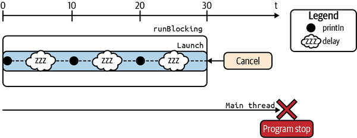
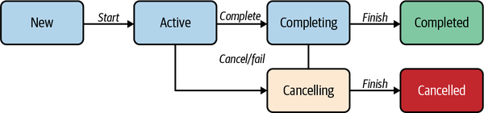
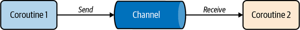
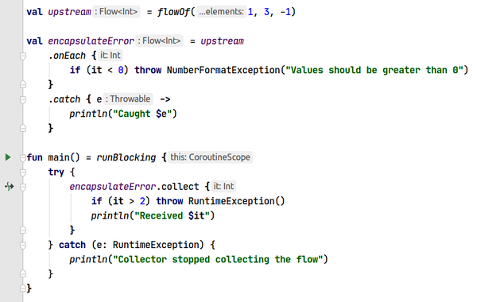
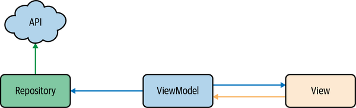
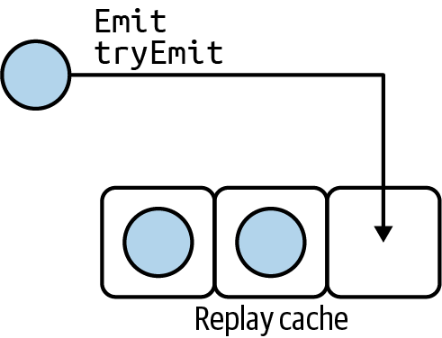

## Coroutine Concepts

The official Kotlin documentation qualifies coroutines as “lightweight threads”. Coroutines are indeed *lightweight*, but it is important to note that *coroutines aren’t threads*themselves. You may conceptualize coroutines as *blocks of code that can be dispatched to threads that are nonblocking*.

The following example uses semantics declared in the `kotlinx.coroutines` package:

```kotlin
fun main() = runBlocking {
    val job: Job = launch {
        var i = 0
        while (true) {
            println("$i I'm working")
            i++
            delay(10)
        }
    }

    delay(30)
    job.cancel()
}
```

The result is as follows:

> ```
> 0 I'm working 
> 1 I'm working 
> 2 I'm working
> ```

- The method `runBlocking` runs a new coroutine and blocks the current thread until the coroutine work has completed.

- We create a coroutine with the `launch` function. `launch` is a *coroutine builder* which is “fire-and-forget” work—in other words, there is no result to return.

  Once called, it immediately returns a `Job` instance, and starts a new coroutine. A `Job` represents the coroutine itself, like a handle on its lifecycle. The coroutine can be cancelled by calling the `cancel` method on its `Job` instance.

- The `delay` function looks suspiciously like `Thread.sleep` in its usage. The major difference is that `delay` is *nonblocking* while`Thread.sleep(...)` is *blocking*. 

The code continues to execute in the main thread, giving us a total of three printed lines within a 30 ms window given to us by the `delay` call:



If you need to get a result from an asynchronous computation, then you should use the `async`coroutine builder.

The `async` coroutine builder can be compared to Java’s `Future`/`Promise` model to support asynchronous programming.  The `async` coroutine builder *returns a wrapper around a result*; and the type of this wrapper is `Deferred<T>` as shown in the following code:

```kotlin
fun main() = runBlocking {
    val slow: Deferred<Int> = async {
        var result = 0
        delay(1000)   // simulate some slow background work
        for (i in 1..10) {
            result += i
        }
        println("Call complete for slow: $result")
        result
    }

    val quick: Deferred<Int> = async {
        delay(100)   // simulate some quick background work
        println("Call complete for quick: 5")
        5
    }

    val result: Int = quick.await() + slow.await()
    println(result)
}
```

The result is:

> ```
> Call complete for quick: 5 
> Call complete for slow: 55 
> 60
> ```

- The `async` coroutine builder is intended for *parallel decomposition of work*—that is, you *explicitly* specify that some tasks will run concurrently.

  Once called, an `async` immediately returns a `Deferred`instance. `Deferred` is a specialized `Job`, with a few extra methods like `await`. It’s a `Job` with a return value.

- By calling the method `await` on each `Deferred<Int>` instance, the program waits for the result of each coroutine.

## CoroutineScope and CoroutineContext

A `CoroutineScope` controls the lifecycle of a coroutine within a well-defined scope or lifecycle. It’s an object that plays the role of the parent in structured concurrency—its purpose is to manage and monitor the coroutines you create inside it. 

In the previous example,  `CoroutineScope` was provided by the `runBlocking`block to launch a new coroutine. 

```kotlin
fun main() = runBlocking {
    val slow: Deferred<Int> = async {
        // ...
    }
}
```

Coroutine builders(`launch`, `async`) are extension functions of`CoroutineScope`:

```kotlin
fun <T> runBlocking(
    // function arguments removed for brevity
    block: suspend CoroutineScope.() -> T): T { // impl
}
```

The last argument is a function with a receiver of type `CoroutineScope`. Consequently, when you supply a function for the block argument, there is a `CoroutineScope` at your disposal which can invoke extension functions of `CoroutineScope`.

So, the following code will not compile:

```kotlin
fun main() {
   launch {
       println("I'm working")       // will not compile
   }
}
```

Since regular code doesn’t provide a `CoroutineScope` instance, you cannot directly invoke coroutine builders from there.

Scopes and coroutines form a tree-like architecture with a scope at its root(*coroutines are represented as rectangles*):


a `CoroutineScope` is an interface:

```kotlin
interface CoroutineScope {
    val coroutineContext: CoroutineContext
}
```

 a `CoroutineScope` is a container for a`CoroutineContext`.

```kotlin
fun CoroutineScope.launch(
    context: CoroutineContext = EmptyCoroutineContext,
    // other params removed for brevity,
    block: suspend CoroutineScope.() -> Unit
): Job { /* implementation */ }
```

You’ll most often use a special context element to control which thread, or which thread pool, will execute your coroutine(s):

```kotlin
fun main() = runBlocking<Unit> {
    launch(Dispatchers.Default) {
        println("I'm executing in ${Thread.currentThread().name}")
    }
}
```

The output is now:

```
I'm executing in DefaultDispatcher-worker-2 @coroutine#2
```

`Dispatchers.Main` is a context element.

As its name suggests, the purpose of a `Dispatcher` is to dispatch coroutines on a specific thread or thread pool. By default, there are four `Dispatcher`s available out of the box—`Main`, `Default`, `IO`, and`Unconfined`:

| Dispatcher         | Description |
| ------------------------ | ------------------------------------------------------------ |
| `Dispatchers.Main`       | This uses the main thread, or the UI thread, of the platform you’re using. |
| `Dispatchers.Default`    | This is meant for CPU-bound tasks, and is backed by a thread pool of four threads by default. |
| `Dispatchers.IO`         | This is meant for IO-bound tasks, and is backed by a thread pool of 64 threads by default. |
| `Dispatchers.Unconfined` | This isn’t something you should use or even need as you’re learning coroutines. It’s primarily used in the internals of the coroutines library. |

A `Job` instance is a handle on the lifecycle of the coroutine—it’s part of the coroutine context too. 

In coroutine framework parlance, a coroutine always runs inside a context. *This* context is provided by a coroutine scope and is different from the context you supply. To avoid confusion, we’ll call the context of the coroutine the *coroutine context*, and we’ll call the context you supply to the coroutine builder the *supplied context*.

```kotlin
fun main() = runBlocking<Unit>(Dispatchers.Main) {
    launch(Dispatchers.Default) {
        val threadName = Thread.currentThread().name
        println("I'm executing in $threadName")
    }
}
```

This block of code creates two coroutines with their own respective`Job` instance: `runBlocking` starts the first coroutine, and the other one is started by `launch`.

The coroutine created by `runBlocking` has its own context. Since this is the root coroutine started inside the scope, we call this context the *scope context*. The scope context encompasses the coroutine context.


In the previous example, there are two context in `launch` coroutine, one from the receiver type (the scope context), and the other one from the context parameter (the supplied context). It merges the two contexts so that the elements from the context parameter take precedence over the other elements from the scope.


## Structured Concurrency

Coroutine has parent-child relationship:


Cancellation always propagates downward, not upward.

If the parent fails or is cancelled, then all its children are also cancelled. In the case of cancellation of one of the children, the parent will not be cancelled. The parent always waits for all its children to complete.

Both  `CoroutineScope`s  and  `CoroutineContext`s  play  the  role  of  the parent, while Coroutines, on play the role of the children.

## Suspending Functions

A task, or more precisely, a coroutine, can suspend if it makes use of at least one *suspending function*. 

A suspending function is a function which may not return immediately. If it doesn’t return right away, it suspends the coroutine that called this suspending function while computation occurs. This inner computation *should not block* the calling thread. Later, the coroutine is resumed when the inner computation completes.

A suspending function can only be called from inside a coroutine or from another suspending function.

When the Kotlin compiler encounters a suspending function, it compiles to a regular function with an additional parameter of type `Continuation<T>`, which is just an interface:

```kotlin
ublic interface Continuation<in T> {
    /**
     * The context of the coroutine that corresponds to this continuation.
     */
    public val context: CoroutineContext

    /**
     * Resumes the execution of the corresponding coroutine passing a successful
     * or failed [result] as the return value of the last suspension point.
     */
    public fun resumeWith(result: Result<T>)
}
```

Let's look at a practical example:

```kotlin
suspend fun fetchProfile(id: String) = withContext(Dispatchers.Default) {
   //  returns a Profile instance
}

fun fetchAndLoadProfile(id: String) {
    scope.launch {
        val profile = fetchProfile(id)   // suspends
        loadProfile(profile)
    }
}
```

The coroutine started by `launch` is suspended when invoking `fetchProfile`. It will remain suspended until the profile is retrieved, at which point the coroutine started by `launch` resumes. The next line (`loadProfile`) is then executed.

There are several ways to create a suspending function. Using`withContext` is only one of them, although probably the most common.

Notice how this reads like procedural code.

The thread that will execute the body of `withContext` is determined by the provided `Dispatcher`. For example, using `Dispatchers.Default`, it would be one of the threads of the thread pool dedicated for CPU-bound tasks. In the case of `Dispatchers.Main`, it would be the main thread.

Using suspending functions in the view-model:

```kotlin
class HikesViewModel : ViewModel() {
    private val hikeDataList = mutableListOf<HikeData>()
    private val hikeLiveData = MutableLiveData<List<HikeData>>()

    fun update() {
        viewModelScope.launch {                                 1
            /* Step 1: get the list of hikes */
            val hikes = hikesForUser("userId")                  2

            /* Step 2: for each hike, get the weather, wrap into a
             * container, update hikeDataList, then notify view
             * listeners by updating the corresponding LiveData */
            hikes.forEach { hike ->                             
                launch {
                    val weather = weatherForHike(hike)          
                    val hikeData = HikeData(hike, weather)
                    hikeDataList.add(hikeData)
                    hikeLiveData.value = hikeDataList
                }
            }
        }
    }
}

suspend fun hikesForUser(userId: String): List<Hike> {
    return withContext(Dispatchers.IO) {
        fetchHikesForUser(userId)
    }
}

suspend fun weatherForHike(hike: Hike): Weather {
    return withContext(Dispatchers.IO) {
        fetchWeather(hike)
    }
}
```

1. `viewModelScope` is from *lifecycle-viewmodel-ktx* as the parent scope defaults to the main thread. you should add the following to your dependencies listed in your `build.gradle`(use a newer version if available): .

   ```groovy
   implementation "androidx.lifecycle:lifecycle-viewmodel-ktx:2.2.0"
   ```

   `viewModelScope` is declared as an extension property on the `ViewModel` class.

2. We can use a loop and start a new coroutine for each hike using `launch`. 

Imagine that a suspending function has to run multiple tasks in parallel before returning its result. Assuming you have suspending functions `fetchWind` and `fetchTemperatures`, you could implement `weatherForHike` as follows:

```kotlin
private suspend fun weatherForHike(hike: Hike): Weather =
        withContext(Dispatchers.IO) {
   val deferredWind = async { fetchWind(hike) }
   val deferredTemp = async { fetchTemperatures(hike) }
   val wind = deferredWind.await()
   val temperatures = deferredTemp.await()
   Weather(wind, temperatures) // assuming Weather can be built that way
}
```

`async` can also be used in this example because `withContext` provides a `CoroutineScope`.

`withContext` is particularly useful when you need to change the dispatcher inside your suspending function. What if you don’t need to change your dispatcher? You could use `` instead of or in conjunction with `withContext`. It’s a `CoroutineScope` builder, which you use as in the following:

```kotlin
private suspend fun weatherForHike(hike: Hike): Weather = coroutineScope {
    // Wind and temperature fetch are performed concurrently
    val deferredWind = async(Dispatchers.IO) {
        fetchWind(hike)
    }
    val deferredTemp = async(Dispatchers.IO) {
        fetchTemperatures(hike)
    }
   val wind = deferredWind.await()
   val temperatures = deferredTemp.await()
   Weather(wind, temperatures) // assuming Weather can be built that way
}
```

`coroutineScope` creates a `CoroutineScope` and calls the specified `suspend` block with this scope. The provided scope **inherits** its `coroutineContext` from the outer scope, but overrides the context’s `Job`.

This function is designed for *parallel decomposition* of work. When any child coroutine in this scope fails, this scope fails and all the rest of the children are cancelled.

Applied to our example, if `fetchWind` fails, the scope provided by `coroutineScope` fails and `fetchTemperatures` is subsequently cancelled. If `fetchTemperatures` involves allocating heavy objects, you can see the benefit of the cancellation.

`coroutineScope` really shines when you need to *perform several tasks concurrently*.

## Cancellation

Your coroutines should be cooperative with cancellation. All suspending functions from the *kotlinx.coroutines* package are cancellable. This notably includes `withContext`. If you’re implementing your own suspending function, make sure it is cancellable by checking `isActive` or calling `ensureActive()` or `yield()` at appropriate steps.

### Coroutine Lifecycle

To understand how cancellation works, you need to be aware that a coroutine has a lifecycle:



When a coroutine is created, for example, with the `launch {..}`function with no additional context or arguments, it’s created in the `Active` state. That means it starts immediately when `launch` is called. This is also called *eagerly* started. 

When a coroutine is done with its work, it remains in the `Completing`state until all of its children reach the `Completed` state.

In some situations, you might want to start a coroutine *lazily*, which means it won’t do anything until you manually start it. To do this, `launch` and `async` can both take a named argument “start,” of type `CoroutineStart`. The default value is `CoroutineStart.DEFAULT` (eager start), but you can use`CoroutineStart.LAZY`, as in the following code:

```kotlin
val job = scope.launch(start = CoroutineStart.LAZY) { ... } 
// some work 
job.start()
```

### Coroutine cancellation

While in `Active` or `Completing` state, if an exception is thrown or the logic calls `cancel()`, the coroutine transitions to `Cancelling` state. If required, this is when you perform necessary cleanup. The coroutine remains in this `Cancelling` state until the cleanup job is done with its work. Only then will the coroutine transition to the `Cancelled` state.

### Turn to a cancellable suspend function

The following is a snippet taken from the *okHttp* official documentation, to perform an synchronous GET:

```kotlin
fun run() {
    val request = Request.Builder()
        .url("https://publicobject.com/helloworld.txt")
        .build()

    client.newCall(request).execute().use { response ->
      if (!response.isSuccessful)
          throw IOException("Unexpected code $response")

      for ((name, value) in response.headers) {
        println("$name: $value")
      }

      println(response.body?.string())
    }
}
```

`client.newCall(request)`returns an instance of `Call` that can be manually cancelled using `call.cancel()`.

The following code shows how to create a suspending function as an extension function of `Call`, which is cancellable and suspends until you get the response of your HTTP request, or an exception occurs:

```kotlin
suspend fun Call.await() = suspendCancellableCoroutine<ResponseBody?> {
    continuation ->

    continuation.invokeOnCancellation {
        cancel()
    }

    enqueue(object : Callback {
        override fun onResponse(call: Call, response: Response) {
            continuation.resume(response.body)
        }

        override fun onFailure(call: Call, e: IOException) {
            continuation.resumeWithException(e)
        }
    })
}
```

`suspendCancellableCoroutine` function gives you the opportunity to use this instance of `Continuation`. It accepts a lambda with `CancellableContinuation` as receiver, as shown in the following code:

```kotlin
public suspend inline fun <T> suspendCancellableCoroutine(
    crossinline block: (CancellableContinuation<T>) -> Unit
): T
```

A `CancellableContinuation` is a `Continuation` that is cancellable. We can register a callback that will be invoked upon cancellation, using `invokeOnCancellation { .. }`. In this case, all we want is to cancel the `Call`. Since we’re inside an extension function of `Call`, we add the following code:

```kotlin
continuation.invokeOnCancellation {
    cancel()   // Call.cancel()
}
```

After we’ve specified what should happen upon cancellation of the suspending function,  we  perform  the  actual  HTTP  request  by  invoking  `Call.enqueue()`,  giving a `Callback` instance. A suspending function “resumes” or “stops suspending” when the corresponding `Continuation` is resumed, with either `resume` or`resumeWithException`.

Now, for the best part: a showcase of how to use it inside a coroutine, as shown in the following:

```kotlin
fun main() = runBlocking {
    val job = launch {                                        
        val response = performHttpRequest()                   
        println("Got response ${response?.string()}")
    }
    delay(200)                                                
    job.cancelAndJoin()                                       
    println("Done")
}

val okHttpClient = OkHttpClient()
val request = Request.Builder().url(
    "http://publicobject.com/helloworld.txt"
).build()

suspend fun performHttpRequest(): ResponseBody? {
     return withContext(Dispatchers.IO) {
         val call = okHttpClient.newCall(request)
         call.await()
     }
}
```

After 200 ms have passed, we invoke `job.cancelAndJoin()`, which is a convenience method for `job.cancel()`, then `job.join()`. 

Consequently, if the HTTP request takes longer than 200 ms, the coroutine started by `launch` is still in the `Active` state. The suspending `performHttpRequest` hasn’t returned yet. Calling `job.cancel()` cancels the coroutine. 

Thanks to structured concurrency, the coroutine knows about all of its children. The cancellation is propagated all the way down the hierarchy. The `Continuation` of `performHttpRequest` gets cancelled, and so does the HTTP request. 

If the HTTP request takes less than 200 ms,`job.cancelAndJoin()` has no effect.

When you cancel a job, you’ll find that a `CancellationException` is caught. Even though we never explicitly threw a`CancellationException` from inside `wasteCpu()`, `withContext` did it for us:

```kotlin
fun main() = runBlocking {
    val job = launch {
        try {
            wasteCpu()
        } catch (e: CancellationException) {
            // handle cancellation
        }
    }
    delay(200)
    job.cancelAndJoin()
    println("Done")
}

suspend fun wasteCpu() = withContext(Dispatchers.Default) {
    var nextPrintTime = System.currentTimeMillis()
    while (isActive) {
        if (System.currentTimeMillis() >= nextPrintTime) {
            println("job: I'm working..")
            nextPrintTime += 500
        }
    }

    // cleanup
    if (!isActive) { .. }
}
```

A suspending function made with `suspendCancellableCoroutine` also throws a `CancellationException` when cancelled.

### delay Is Cancellable

If we replace checking `ative` with delay in the previous example, we can also cancel the job successfully:

```kotlin
private suspend fun wasteCpu() = withContext(Dispatchers.Default) {
    var nextPrintTime = System.currentTimeMillis()
    while (true) {       1
        delay(10)        2
        if (System.currentTimeMillis() >= nextPrintTime) {
            println("job: I'm working..")
            nextPrintTime += 500
        }
    }
}
```

 A suspending function can be made of several suspending functions. All of them should be cancellable. 

If you need to perform a CPU-heavy computation, then you should use `yield()` or`ensureActive()` at strategic places. For example:

```kotlin
suspend fun compute() = withContext(Dispatchers.Default) {
     blockingCall()  // a regular blocking call, hopefully not blocking too long
     yield()  // give the opportunity to cancel
     anotherBlockingCall()   // because why not
}
```

### Handling Cancellation

it will fail if you call another suspend functions in catch block:

```
launch {
    try {
        suspendCall()
    } catch (e: CancellationException) {
       // handle cancellation
       anotherSuspendCall()
   }
}
```

Because *a cancelled coroutine isn’t allowed to suspend*. This is another rule from the coroutine framework. The solution is to use `withContext(NonCancellable)`, as shown in the following code:

```kotlin
launch {
    try {
        suspendCall()
    } catch (e: CancellationException) {
       // handle cancellation
       withContext(NonCancellable) {
            anotherSuspendCall()
       }
   }
}
```

`NonCancellable` is specifically designed for `withContext` to make sure the supplied block of code won’t be cancelled.

In the case of a failure (if an exception different from `CancellationException` was thrown), the default behavior is that the parent gets cancelled with that exception. If the parent also has other child coroutines, they are also cancelled:

```kotlin
fun main() = runBlocking {
    val scope = CoroutineScope(coroutineContext + Job())    

    val job = scope.launch {                                
        launch {
            try {
                delay(Long.MAX_VALUE)                       
            } finally {
                println("Child 1 was cancelled")
            }
        }

        launch {
            delay(1000)                                     
            throw IOException()
        }
    }
    job.join()                                              
}
```

Running this program, you indeed see “Child 1 was cancelled,” though the program crashes right after with an uncaught `IOException`. 

 The `IOException` was thrown from inside a `launch`, which propagates exceptions upward through the coroutine hierarchy until it reaches the parent scope. This behavior cannot be overridden. Once that `scope` sees the exception, it cancels itself and all its children, then propagates the exception to its parent, which is the scope of `runBlocking`.

It’s important to realize that trying to catch the exception isn’t going to change the fact that the root coroutine of `runBlocking` is going to be cancelled with that exception.

If you prefer to prevent the failure of `scope` to propagate to the main coroutine, you need to register a `CoroutineExceptionHandler` (CEH):

```kotlin
fun main() = runBlocking {
    val ceh = CoroutineExceptionHandler { _, exception ->
        println("Caught original $exception")
    }
    val scope = CoroutineScope(coroutineContext + ceh + Job())

    val job = scope.launch {
         // same as in the previous code sample
    }
}
```

A `CoroutineExceptionHandler` is conceptually very similar to `Thread.UncaughtExceptionHandler`—except it’s intended for coroutines. 

It’s a `Context` element, which should be added to the context of a scope or a coroutine:

```kotlin
fun main() = runBlocking {
    val ceh = CoroutineExceptionHandler { _, exception ->
        println("Caught original $exception")
    }

    // The CEH can also be part of the scope
    val scope = CoroutineScope(coroutineContext + Job())

    val job = scope.launch(ceh) {
        // same as in the previous code sample
    }
}
```

Running this sample with the exception handler, the output of the program now is:

```kotlin
Child 1 was cancelled
Caught original java.io.IOException
```

## Supervision

There are two categories of coroutine scope: the scopes using `Job` and the ones using `SupervisorJob` (also called supervisor scopes). They differ in how cancellation is performed and in exception handling. If the failure of a child should also cancel other children, use a regular scope. Otherwise, use a supervisor scope.

Assuming you’re using a scope which defaults to the main thread, and child coroutines for the background tasks, the failure of one of those tasks shouldn’t cause the failure of the parent scope.

To implement this cancellation strategy, you can use `SupervisorJob`, which is a `Job` for which the failure or cancellation of a child doesn’t affect other children; *nor* does it affect the scope itself. 

A `SupervisorJob` is typically used as a drop-in replacement for `Job`when building a `CoroutineScope`. The resulting scope is then called a “supervisor scope.” Such a scope propagates cancellation downward only, as shown in the following code:

```kotlin
fun main() = runBlocking {
    val ceh = CoroutineExceptionHandler { _, e -> println("Handled $e") }
    val supervisor = SupervisorJob()
    val scope = CoroutineScope(coroutineContext + ceh + supervisor)
    with(scope) {
        val firstChild = launch {
            println("First child is failing")
            throw AssertionError("First child is cancelled")
        }

        val secondChild = launch {
            firstChild.join()

            delay(10) // playing nice with hypothetical cancellation
            println("First child is cancelled: ${firstChild.isCancelled}, but second one is still active")
        }

        // wait until the second child completes
        secondChild.join()
    }
}
```

The output of this sample is:

```
First child is failing
Handled java.lang.AssertionError: First child is cancelled
First child is cancelled: true, but second one is still active
Notice that we’ve installed a CEH in the context of the scop
```

We’ve installed a CEH in the context of the scope. The first child throws an exception that is never caught. Even if a supervisor scope isn’t affected by the failure of a child, it still propagates unhandled exceptions—which, as you know, might cause the program to crash. 

Just like `coroutineScope`, it waits for all children to complete. One crucial difference with `coroutineScope` is that it only propagates cancellation downward, and **cancels all children only if it has failed itself**. 

## Exception Handling

### Before coroutine

If you catch an exception *before* it is handled by a coroutine builder, everything works as usual—you catch it, so the coroutine machinery isn’t aware of it. The following shows an example with `launch` and `try`/`catch`:

```kotlin
fun main() = runBlocking {
    val itemCntDeferred = async {
        try {
            getItemCount()
        } catch (e: Exception) {
            // Something went wrong. Suppose you don't care and consider it should return 0.
            0
        }
    }

    val count = itemCntDeferred.await()
    println("Item count: $count")
}

fun getItemCount(): Int {
    throw Exception()
    1
}
```

The output is:

```
Item count: 0
```

The same idea applies to the `lauch` builder.

Alternatively, instead of `try`/`catch`, you could use `runCatching`. It allows for a nicer syntax if you consider that the happy path is when no exception is thrown:

```kotlin
scope.launch {
     val result = runCatching {
           regularFunctionWhichCanThrowException()
     }

     if (result.isSuccess) {
         // no exception was thrown
     } else {
         // exception was thrown
     }
}
```

`runCatching` is nothing but a `try`/`catch`, returning a `Result` object, which offers some sugar methods like `getOrNull()`and `exceptionOrNull()`.

Some extension functions are defined on the `Result` and available out of the box, like `getOrDefault` which returns the encapsulated value of the `Result` instance if `Result.isSuccess` is `true` or a provided default value otherwise.

### Unhandled Versus Exposed Exceptions

When it comes to exception propagation, uncaught exceptions can be treated by the coroutine machinery as on of the following:

- Unhandled to the client code. *Unhandled* exceptions can only be handled by a `CoroutineExceptionHandler`.

- Exposed to the client code. *Exposed* exceptions are the ones the client code can handle using `try`/`catch`.

In this matter, we can distinguish two categories of coroutine builders based on how they treat uncaught exceptions:

- Unhandled (`launch` is one of them)
- Exposed (`async` is one of them)

`launch` and `async` differ in how they treat uncaught exceptions. `async` *exposes* exceptions, which can be caught by wrapping the `await` call in a `try`/`catch`. On the other hand, `launch` treats uncaught exceptions as unhandled, which can be handled using a CEH.

If a coroutine fails because of an uncaught exception, it gets cancelled along with all of its children and the exceptions propagate up.

### Exposed Exceptions

As we stated before, you can catch *exposed* exceptions using built-in language support: `try`/`catch`. 

```kotlin
fun main() = runBlocking {

    val scope = CoroutineScope(Job())

    val job = scope.launch {
        supervisorScope {
            val task1 = launch {
                // simulate a background task
                delay(1000)
                println("Done background task")
            }

            val task2 = async {
                // try to fetch some count, but it fails
                throw Exception()
                1
            }

            try {
                task2.await()
            } catch (e: Exception) {
                println("Caught exception $e")
            }
            task1.join()
        }
    }

    job.join()
    println("Program ends")
}
```

The output of this program is:

```
Caught exception java.lang.Exception
Done background task
Program ends
```

This example demonstrates that **inside a `supervisorScope`, `async`*exposes* uncaught exceptions in the `await` call.** 

If you don’t surround the `await` call with a `try`/`catch` block, then the scope of `supervisorScope` fails and cancels `task1`, then *exposes* to its parent the exception that caused its failure. 

So this means that even when using a `supervisorScope`, unhandled exceptions in a scope lead to the cancellation of the entire coroutine hierarchy beneath that scope—and the exception is propagated up. By handling the exception the way we did in this example, task 2 fails while task 1 isn’t affected.

Interestingly enough, if you don’t invoke `task2.await()`, the program executes as if no exception was ever—thrown`task2` silently fails.

Now we’ll use the exact same example, but with a `coroutineScope`instead of `supervisorScope`:

```kotlin
fun main() = runBlocking {

	// ...

    val job = scope.launch {
        coroutineScope {
            // ...
        }
    }

    // ...
}
```

The output of this program is:

```
Caught exception java.lang.Exception
```

Then the program crashes on Android due to `java.lang.Exception`.

From this you can learn that **inside a `coroutineScope`, `async` *exposes* uncaught exceptions but also notifies its parent.** 

If you don’t call `task2.await()`, the program still crashes because `coroutineScope` fails and *exposes* to its parent the exception that caused its failure. Then, `scope.launch` treats this exception as *unhandled*.

### Unhandled Exceptions

The coroutine framework treats unhandled exceptions in a specific way: it tries to use a CEH if the coroutine context has one. If not, it delegates to the *global handler*. This handler calls a customizable set of CEH *and* calls the standard mechanism of unhandled exceptions: `Thread.uncaughtExceptionHandler`. 

There are at least two reasons to use ECH: first, to stop the exception’s propagation and avoid a program crash; and second, to notify your crash analytics and rethrow the exception—potentially making the application crash.

A CEH only works when registered to:

- `launch` (not `async`) when `launch` is a root coroutine builder. A root coroutine builder is a scope’s direct child. In the previous example, at the line `val job = scope.launch {..}`, `launch` is a root coroutine builder.

  ```kotlin
  fun main() = runBlocking {
  
      val ceh = CoroutineExceptionHandler { _, t ->
          println("CEH handle $t")
      }
  
      val scope = CoroutineScope(Job())
  
      val job = scope.launch(ceh) {
          coroutineScope {
              val task1 = launch {
                  delay(1000)
                  println("Done background task")
              }
  
              val task2 = async {
                  throw Exception()
                  1
              }
  
              task1.join()
          }
      }
  
      job.join()
      println("Program ends")
  }
  ```

  The output of this program is:

  ```
  Caught exception java.lang.Exception
  CEH handle java.lang.Exception
  Program ends
  ```

- A scope.

  ```kotlin
  fun main() = runBlocking {
  
      val ceh = CoroutineExceptionHandler { _, t ->
          println("CEH handle $t")
   	}
  
      val scope = CoroutineScope(Job() + ceh)
  
      val job = scope.launch {
         // same as previous example
      }
  }
  ```

- `supervisorScope`*s* direct child.

  ```kotlin
  fun main() = runBlocking {
  
      val ceh = CoroutineExceptionHandler { _, t ->
          println("CEH handle $t")
      }
  
      val scope = CoroutineScope(Job())
  
      val job = scope.launch {
          supervisorScope {
              val task2 = launch(ceh) {
                  // try to fetch some count, but it fails
                  throw Exception()
              }
  
              task2.join()
          }
      }
  
      job.join()
      println("Program ends")
  }
  ```


# Channel

Channels are communication primitives that provide a way to transfer streams of values between coroutines.

While channels are conceptually close to Java’s `BlockingQueue`, the fundamental difference is that `send` and `receive` methods of a channel are suspending functions, not blocking calls.

Using channels and coroutines, you can *share by communicating* instead of the traditional *communicate by sharing*. The goal is to avoid shared mutable-state and thread-safety issues.

Channels should be considered low-level primitives. Flows are higher-level primitives that exchange streams of data between coroutines. 

A `Channel` also has nonsuspending counterparts: `trySend` and `tryReceive`. These two methods are also nonblocking.`trySend` tries to immediately add an element to the channel, and returns a wrapper class around the result.



`Channel`s are thread-safe. Several threads can concurrently invoke `send` and `receive` methods in a thread-safe way.

Channels are communication primitives between coroutines. They are specifically designed to distribute values so that every value is received by only one receiver. It’s not possible to use channels to broadcast values to multiple receivers. We don’t have handy operators such as `map` or `filter` to transform them. The designers of coroutines have created `Flow`s specifically for asynchronous data streams on which we can use transformation operators. 

Channel is hot. A new coroutine is started and immediately starts producing elements and sending them to the returned channel even if no coroutine is consuming those elements. If you know RxJava, this is the same concept as hot observables: they emit values independently of individual subscriptions. 

## Channel Flavors

Like queues, `Channel`s come in several flavors. 

You can see that this `Channel` function has a `capacity` parameter that defaults to `RENDEZVOUS`(0). 

```kotlin
public fun <E> Channel(capacity: Int = RENDEZVOUS): Channel<E> =
    when (capacity) {
        RENDEZVOUS -> RendezvousChannel()
        UNLIMITED -> LinkedListChannel()
        CONFLATED -> ConflatedChannel()
        BUFFERED -> ArrayChannel(CHANNEL_DEFAULT_CAPACITY)
        else -> ArrayChannel(capacity)
    }
```

### Rendezvous Channel

A rendezvous channel does not have any buffer at all. An element is transferred from sender to receiver only when `send` and `receive` invocations meet in time (rendezvous), so `send` suspends until another coroutine invokes `receive`, and `receive` suspends until another coroutine invokes `send`.

By default, when you create a channel using `Channel<T>()`, you get a rendezvous channel.

```kotlin
fun main() = runBlocking {
    val channel = Channel<Item>()
    launch {                        1
        channel.send(Item(1))       3
        channel.send(Item(2))       4
        println("Done sending")
    }

    println(channel.receive())      2
    println(channel.receive())      5

    println("Done!")
}

data class Item(val number: Int)
```

The output of this program is:

```
Item(number=1)
Item(number=2)
Done!
Done sending
```

The main coroutine starts a child coroutine with `launch`, at , then reaches [](#callout_2) and suspends until some coroutine sends an `Item` instance in the channel. Shortly after, the child coroutine sends the first item at [](#callout_3), then reaches and suspends at the second `send` call at  until some coroutine is ready to receive an item. Subsequently, the main coroutine (which is suspended at ](http://localhost:8000/d1694a61-9c1d-4153-b0e3-a8ca612dadc4/OEBPS/assets/2.png)) is resumed and receives the first item from the channel and prints it. Then the main coroutine reaches  and immediately receives the second item since the child coroutine was already suspended in a `send` call. Immediately after, the child coroutine continues its execution (prints “Done sending”).

A `Channel` can be iterated over, using a regular `for` loop. Note that since channels aren’t regular collections, you can’t use `forEach` or other similar functions from the Kotlin Standard Library. Here, channel iteration is a specific language-level feature that can only be done using the `for`-loop syntax:

```kotlin
for (x in channel) {
   // do something with x every time some coroutine sends an element in
   // the channel
}
```

Implicitly, `x` is equal to `channel.receive()` at each iteration. Consequently, a coroutine iterating over a channel could do so indefinitely, unless it contains conditional logic to break the loop. Fortunately, there’s a standard mechanism to break the loop: closing the channel. 

```kotlin
fun main() = runBlocking {
    val channel = Channel<Item>()
    launch {
        channel.send(Item(1))
        channel.send(Item(2))
        println("Done sending")
        channel.close()
    }

    for (x in channel) {
        println(x)
    }
    println("Done!")
}
```

This program has similar output, with a small difference:

```kotlin
Item(number=1)
Item(number=2)
Done sending
Done!
```

This time, “Done sending” appears before “Done!” This is because the main coroutine only leaves the `channel` iteration when `channel` is closed. And that happens when the child coroutine is done sending all elements.

Beware—trying to call `receive` from an already-closed channel will throw a`ClosedReceiveChannelException`. However, trying to iterate on such a channel doesn’t throw any exception:

```kotlin
fun main() = runBlocking {
    val channel = Channel<Int>()
    channel.close()

    for (x in channel) {
        println(x)
    }
    println("Done!")
}
```

The output is: Done!

### Unlimited Channel

An *unlimited* channel has a buffer that is only limited by the amount of available memory. 

### Conflated Channel

This channel has a buffer of size 1, and only keeps the last sent element. To create a *conflated* channel, you invoke `Channel<T>(Channel.CONFLATED)`. For example:

```kotlin
fun main() = runBlocking {
    val channel = Channel<String>(Channel.CONFLATED)

    val job = launch {
        channel.send("one")
        channel.send("two")
    }

    job.join()
    val elem = channel.receive()
    println("Last value was: $elem")
}
```

The output of this program is:

```kotlin
Last value was: two
```

The first sent element is “one.” When “two” is sent, it replaces “one” in the channel. We wait until the coroutine-sending elements complete, using `job.join()`. Then we read the value `two` from the channel.

### Buffered Channel

A *buffered* channel is a `Channel` with a fixed capacity—an integer greater than 0. Senders to this channel don’t suspend unless the buffer is full, and receivers from this channel don’t suspend unless the buffer is empty. 

To create a buffered channel of `Int` with a buffer of size 2, you would invoke `Channel<Int>(2)`. Here is an example of usage:

```kotlin
fun main() = runBlocking<Unit> {
    val channel = Channel<Int>(2)

    launch {
        for (i in 0..4) {
            println("Send $i")
            channel.send(i)
        }
    }

    launch {
        for (i in channel) {
            println("Received $i")
        }
    }
}
```

The output of this program is:

```
Send 0
Send 1
Send 2
Received 0
Received 1
Received 2
Send 3
Send 4
Received 3
Received 4
```

In this example, we’ve defined a `Channel` with a fixed capacity of 2. A coroutine attempts to send five integers, while another coroutine consumes elements from the channel. The sender coroutine manages to send 0 and 1 in one go, then attempts to send 3. The `println("Send $i")` is executed for the value 3 but the sender coroutine gets suspended in the `send` call. The same reasoning applies for the consumer coroutine: two elements are received consecutively with an additional print before suspending.

## Channel Producers

Sometimes you might want to be more explicit about how a channel should be used for either sending or receiving. When you’re implementing a `Channel` that is meant to be read only by other coroutines, you can use the `produce` builder:

```kotlin
fun CoroutineScope.produceValues(): ReceiveChannel<String> = produce {
    send("one")
    send("two")
}
```

There’s a convention in Kotlin: every function that starts coroutines should be defined as an extension function of `CoroutineScope`. If you follow this convention, you can easily distinguish in your code which functions are starting new coroutines from suspending functions.

The main code that makes use of produceValues could be:

```kotlin
fun main() = runBlocking {
    val receiveChannel = produceValues()

    for (e in receiveChannel) {
        println(e)
    }
}
```

Conversely, a `SendChannel` only has methods relevant to sending operations. Actually, looking at the source code, a `Channel` is an interface deriving from both `ReceiveChannel` and `SendChannel`:

```kotlin
fun CoroutineScope.collectImages(imagesOutput: SendChannel<Image>) {
    launch(Dispatchers.IO) {
        val image = readImage()
        imagesOutput.send(image)
    }
}
```

## Communicating Sequential Processes

Let's write an example: 


The `ShapeCollector` follows a simple process:

```
               fetchData
Location ---------------------> ShapeData
```

As the coroutine `collectShapes` will be receiving `Location`s from the view-model, we declare the `Channel` as a `ReceiveChannel`:

```kotlin
private fun CoroutineScope.collectShapes(
     locations: ReceiveChannel<Location>
) = launch {
     val locationsBeingProcessed = mutableListOf<Location>()

     for (loc in locations) {
         if (!locationsBeingProcessed.contains(loc) {
              launch(Dispatchers.IO) {
                   // fetch the corresponding `ShapeData`
              }
         }
    }
}
```

You see, for each received location, we start a new coroutine. Potentially, this code might start a lot of coroutines if the `locations` channel debits a lot of items. For this reason, this situation is also called *unlimited* *concurrency*. 

So we’ll have to find a way to limit concurrency. Instead of a thread pool, we’ll create a *coroutine pool*, which we’ll name *worker pool*. Each coroutine from this worker pool will perform the actual fetch of `ShapeData` for a given location. 


```kotlin
private fun CoroutineScope.collectShapes(
     locations: ReceiveChannel<Location>,
     locationsToProcess: SendChannel<Location>,
) = launch {
     val locationsBeingProcessed = mutableListOf<Location>()

     for (loc in locations) {
         if (!locationsBeingProcessed.contains(loc) {
              launch(Dispatchers.IO) {
                   locationsToProcess.send(loc)
              }
         }
    }
}
```

Now, `collectShapes` sends a location to the `locationsToProcess` channel, only if the location isn’t in the list of locations currently being processed.  To communicate with this worker pool, `collectShapes` should use this channel `locationsToProcess` to send locations to the worker pool:

```kotlin
private fun CoroutineScope.worker(
    locationsToProcess: ReceiveChannel<Location>,
    locationsProcessed: SendChannel<Location>,
    shapesOutput: SendChannel<Shape>
) = launch(Dispatchers.IO) {
    for (loc in locationsToProcess) {
        try {
            val data = getShapeData(loc)
            val shape = Shape(loc, data)
            shapesOutput.send(shape)
        } finally {
            locationsProcessed.send(loc)
        }
    }
}

private suspend fun getShapeData(
    location: Location
): ShapeData = withContext(Dispatchers.IO) {
        /* Simulate some remote API delay */
        delay(10)
        ShapeData()
}
```

Thanks to the iteration on the `locationsToProcess` channel, each individual `worker`coroutine will receive its own location without interfering with the others. No matter how many workers we’ll start, a location sent from `collectShapes` to the `locationsToProcess` channel will only be received by one worker. 

In message-oriented software, this pattern, which implies delivery of a message to multiple destinations, is called *fan-out*.

Once the location is processed, the result is send to `shapesOutput` channel and the processed location is sent to `localtionProcessed`. It’ll be a `ReceiveChannel` from the `collectShapes`perspective:

```kotlin
private fun CoroutineScope.collectShapes(
     locations: ReceiveChannel<Location>,
     locationsToProcess: SendChannel<Location>,
     locationsProcessed: ReceiveChannel<Location>
): Job = launch {
     ...
     for (loc in locations) {
          // same implementation, hidden for brevity
     }
     // but.. how do we iterate over locationsProcessed?
}
```

Now we have a problem. How can you receive elements from multiple `ReceiveChannel`s at the same time? If we add another `for`loop right below the `locations` channel iteration, it wouldn’t work as intended as the first iteration only ends when the `locations`channel is closed.

For that purpose, you can use the `select` expression. The `select` expression waits for the result of multiple suspending functions simultaneously, which are specified using *clauses* in the body of this select invocation. The caller is suspended until one of the clauses is either *selected* or *fails*.

```kotlin
private fun CoroutineScope.collectShapes(
    locations: ReceiveChannel<Location>,
    locationsToProcess: SendChannel<Location>,
    locationsProcessed: ReceiveChannel<Location>
) = launch(Dispatchers.Default) {

    val locationsBeingProcessed = mutableListOf<Location>()

    while (true) {
        select<Unit> {
            locationsProcessed.onReceive {                     
                locationsBeingProcessed.remove(it)
            }
            locations.onReceive {                              
                if (!locationsBeingProcessed.any { loc ->
                    loc == it }) {
                    /* Add it to the list of locations being processed */
                    locationsBeingProcessed.add(it)

                    /* Now download the shape at location */
                    locationsToProcess.send(it)
                }
            }
        }
    }
}
```

If the `select` expression could talk, it would say: “Whenever the `locations` channel receives an element, I’ll do action 1. Or, if the `locationsProcessed` channel receives something, I’ll do action 2. I can’t do both actions at the same time. By the way, I’m returning `Unit`.”

Since `select` is an expression, it returns a result. The result type is inferred by the return type of the lambdas we provide for each case of the `select`—pretty much like the `when` expression. In this particular example, we don’t want any result, so the return type is `Unit`.

As`select` returns after either the `locations` or `locationsProcessed`channel receives an element, it doesn’t iterate over channels like our previous `for` loop. Consequently, we have to wrap it inside a `while(true)`. 

```kotlin
private fun CoroutineScope.collectShapes(
    locations: ReceiveChannel<Location>,
    locationsToProcess: SendChannel<Location>,
    locationsProcessed: ReceiveChannel<Location>
) = launch(Dispatchers.Default) {

    val locationsBeingProcessed = mutableListOf<Location>()

    while (true) {
        select<Unit> {
            locationsProcessed.onReceive {                     1
                locationsBeingProcessed.remove(it)
            }
            locations.onReceive {                              2
                if (!locationsBeingProcessed.any { loc ->
                    loc == it }) {
                    /* Add it to the list of locations being processed */
                    locationsBeingProcessed.add(it)

                    /* Now download the shape at location */
                    locationsToProcess.send(it)
                }
            }
        }
    }
}
```

The final architecture of the `ShapeCollector` takes shape:


Let's put it all together:

```
class ShapeCollector(private val workerCount: Int) {
    fun CoroutineScope.start(
        locations: ReceiveChannel<Location>,
      shapesOutput: SendChannel<Shape>
    ) {
        val locationsToProcess = Channel<Location>()
        val locationsProcessed = Channel<Location>(capacity = 1)

        repeat(workerCount) {
             worker(locationsToProcess, locationsProcessed, shapesOutput)
        }
        collectShapes(locations, locationsToProcess, locationsProcessed)
    }

    private fun CoroutineScope.collectShapes // already implemented

    private fun CoroutineScope.worker        // already implemented

    private suspend fun getShapeData         // already implemented
}
```

This `start` method is responsible for starting the whole shape collection machinery. 

The two channels that are exclusively used inside the `ShapeCollector` are created: `locationsToProcess` and `locationsProcessed`. We are not explicitly creating `ReceiveChannel` or `SendChannel` instances here. We’re creating them as `Channel`instances because they’ll further be used either as `ReceiveChannel`or `SendChannel`. 

Then the worker pool is created and started, by calling the `worker` method as many times as `workerCount` was set. It’s achieved using the `repeat` function from the standard library.

Finally, we call `collectShapes` once. Overall, we started `workerCount + 1` coroutines in this `start` method.

# Flows

`Flow`s are similar to `Sequence`s, except that each step of a `Flow` can be asynchronous. It is also easy to integrate flows in structured concurrency, to avoid leaking resources.

You’ll see how *cold* flows can be a better choice when you want to make sure never to leak any resources. On the other hand, *hot* flows serve a different purpose such as when you need a “publish-subscribe” relationship between entities in your app. For example, you can implement an event bus using hot flows.

## An Introduction to Flows

You define in the `flow` block the emission of values. When invoked, the `numbers` function quickly returns a `Flow` instance without running anything in the background.

```kotlin
fun numbers(): Flow<Int> = flow {
    emit(1)
    emit(2)
    // emit other values
}

fun main() = runBlocking {
    val flow = numbers()      
    flow.collect {            
        println(it)
    }
}
```

Once we get a flow, instead of looping over it (like we would with a channel), we use the `collect`function which, in flows parlance, is called a *terminal operator*. It consumes the flow; for example, iterate over the flow and execute the given lambda on each element of the flow.

Take a more realistic example.

You need to produce a stream of `TokenData` objects. This stream requires first establishing a database connection, then performing asynchronous queries for retrieving tokens and getting associated data. You choose how many tokens you need. After you’ve processed all the tokens, you disconnect and release underlying database connection resources. 


 [source code in GitHub](https://oreil.ly/dU4uZ)

- Creating a connection to the database and closing it on completion is completely transparent to the client code that consumes the flow. Client code only sees a flow of `TokenData`.
- All operations inside the flow are sequential. For example, once we get the first token (say, “token1”), the flow invokes `getData("token1")` and suspends until it gets the result (say, “data1”). Then the flow emits the first `TokenData("token1," "data1")`. Only after that does the execution proceed with “token2,” etc.
- Invoking the `getDataFlow` function does nothing on its own. It simply returns a flow. The code inside the flow executes only when a coroutine collects the flow,

```kotlin
fun main() = runBlocking<Unit> {
    val flow = getDataFlow(3) // Nothing runs at initialization

    // A coroutine collects the flow
    launch {
        flow.collect { data ->
            println(data)
        }
    }
}
```

If the coroutine that collects the flow gets cancelled or reaches the end of the flow, the code inside the `onCompletion` block executes. This guarantees that we properly release the connection to the database.

## Operators

The coroutines library provides functions such as `map`, `filter`, `debounce`, `buffer`, `onCompletion`, etc. Those functions are called *flow operators* or *intermediate operators*, because they operate on a flow and return another flow.

```kotlin
fun main() = runBlocking<Unit> {
    val numbers: Flow<Int> = // implementation hidden for brevity

    val newFlow: Flow<String> = numbers().map {
        transform(it)
    }
}

suspend fun transform(i :Int): String = withContext(Dispatchers.Default) {
    delay(10) // simulate real work
    "${i + 1}"
}
```

The interesting bit here is that `map` turns a `Flow<Int>` into a `Flow<String>`. The `map` flow operator is conceptually really close to the `map` extension function on collections. There’s a noticeable difference, though: the lambda passed to the `map` flow operator can be a suspending function.

### Terminal Operators

A terminal operator can be easily distinguished from other regular operators since it’s a suspending function that starts the collection of the flow. 

Other terminal operators are available, like `toList`, `collectLatest`, `first`, etc. Here is a brief description of those terminal operators:

- `toList` collects the given flow and returns a `List` containing all collected elements.`collectLatest` collects the given flow with a provided action. The difference from `collect` is that when the original flow emits a new value, the action block for the previous value is cancelled.
- `first` returns the first element emitted by the flow and then cancels the flow’s collection. It throws a `NoSuchElementException` if the flow was empty. There’s also a variant, `firstOrNull`, which returns `null` if the flow was empty.

### Context Preservation

Suppose that you want to translate all messages from a given user in a different language  on a background thread.

```kotlin
fun getMessagesFromUser(user: String, language: String): Flow<Message> {
    return getMessageFlow()
        .filter { it.user == user }           1
        .map { it.translate(language) }       2
        .flowOn(Dispatchers.Default)          3
}
```

the `flowOn` operator changes the context of the flow it is operating on. It changes the coroutine context of the upstream flow, while not affecting the downstream flow. Consequently, steps `1` and `2` are done using the dispatcher `Dispatchers.Default`.

This is a very important property of flows, called *context preservation*. 

Under the hood, `flowOn` starts a new coroutine when it detects that the context is about to change. This new coroutine interacts with the rest of the flow through a channel that is internally managed.

If you wanted to only perform message translation using `Dispatchers.Default` (and not message filtering), you could remove the `flowOn` operator and declare the `translate` function like so:

```kotlin
private suspend fun Message.translate(
    language: String
): Message  = withContext(Dispatchers.Default) {
    // this is a dummy implementation
    copy(content = "translated content")
}
```

### Convert Callback to Flow

The message factory has a *publish/subscribe* mechanism—we can register or unregister observers for new incoming messages, as shown in the following:

```kotlin
abstract class MessageFactory : Thread() {
    /* The internal list of observers must be thread-safe */
    private val observers = Collections.synchronizedList(
        mutableListOf<MessageObserver>())
    private var isActive = true

    override fun run() = runBlocking {
        while(isActive) {
            val message = fetchMessage()
            for (observer in observers) {
                observer.onMessage(message)
            }
            delay(1000)
        }
    }

    abstract fun fetchMessage(): Message

    fun registerObserver(observer: MessageObserver) {
        observers.add(observer)
    }

    fun unregisterObserver(observer: MessageObserver) {
        observers.removeAll { it == observer }
    }

    fun cancel() {
        isActive = false
        observers.forEach {
            it.onCancelled()
        }
        observers.clear()
    }

    interface MessageObserver {
        fun onMessage(msg: Message)
        fun onCancelled()
        fun onError(cause: Throwable)
    }
}
```

 `MessageFactory` is also said to be *callback-based*, because it holds references to`MessageObserver` instances and calls methods on those instances when new messages are retrieved. To bridge the flow world with the “callback” world, you can use the `callbackFlow` flow builder:

```kotlin
fun getMessageFlow(factory: MessageFactory) = callbackFlow<Message> {
    val observer = object : MessageFactory.MessageObserver {
        override fun onMessage(msg: Message) {
            trySend(msg)
        }

        override fun onCancelled() {
            channel.close()
        }

        override fun onError(cause: Throwable) {
            cancel(CancellationException("Message factory error", cause))
        }
    }

    factory.registerObserver(observer)
    awaitClose {
        factory.unregisterObserver(observer)
    }
}
```

`callbackFlow` is a parameterized function which returns a `Flow` of the given type. It’s always done in three steps:

```kotlin
callbackFlow {
    /*
    1. Instantiate the "callback." In this case, it's an observer.
    2. Register that callback using the available api.
    3. Listen for close event using `awaitClose`, and provide a
       relevant action to take in this case. Most probably,
       you'll have to unregister the callback.
    */
}
public inline fun <T> callbackFlow(
    @BuilderInference noinline block: suspend ProducerScope<T>.() -> Unit
): Flow<T>
```

`callbackFlow` takes a suspending function with `ProducerScope`receiver as the argument. 

```
public interface ProducerScope<in E> : CoroutineScope, SendChannel<E>
```

So a `ProducerScope` is a `SendChannel`. And that’s what you should remember: `callbackFlow` provides you with an instance of `SendChannel`, which you can use inside your implementation. You send the object instances you get from your callback to this channel.

### Concurrently Transform a Stream

Sometimes, you want transformations to be done asynchronously:


In the preceding schema, we’ve limited the concurrency to four; in other words, at most, four locations can be transformed simultaneously at a given point in time.


You can find the corresponding [source code in GitHub](https://oreil.ly/LhW77).

You should realize that `locations.map{..}` returns a flow of a flow (e.g., the type is `Flow<Flow<Content>>`).

`flattenMerge`, merges all those created flows inside a new resulting `Flow<Content>`(which we assign to `contentFlow`). Also, `flattenMerge` has a “concurrency” parameter. Indeed, it would probably be inappropriate to concurrently create and collect a flow every time we receive a location.

With a concurrency level of 4, we ensure that no more than four flows will be collected at a given point in time. This is handy in the case of CPU-bound tasks, when you know that your CPU won’t be able to transform more than four locations *in parallel* (assuming the CPU has four cores). In other words,`flattenMerge`’s concurrency level refers to how many operations/transformations will be done in parallel *at most* at a given point in time.

### Create a Custom Operator

Imagine that you have an upstream flow of elements, but you want to process those elements by batches and at a fixed maximum rate. The flow returned by `bufferTimeout` should buffer elements and emit a list (batch) of elements when either:

- The buffer is full.
- A predefined maximum amount of time has elapsed (timeout).

When the buffer is full, or a timeout has elapsed, the flow should emit the content of the buffer (a list). You can imagine that internally we’ll start a coroutine that receives two types of events:

- “An element has just been received from the upstream flow. Should we just add it to the buffer or also send the whole buffer?”
- “Timeout! Send the content of the buffer right now.”


###### 

You can find the corresponding [source code in GitHub](https://oreil.ly/JxkZj).

- First of all, the signature of the operator tells us a lot. It’s declared as an extension function of `Flow<T>`, so you can use it like this: `upstreamFlow.bufferTimeout(10, 100)`. As for the return type, it’s `Flow<List<T>>`. Remember that you want to process elements by batches, so the flow returned by `bufferTimeout` should return elements as `List<T>`.
- Line 17: we’re using a `flow{}` builder. As a reminder, the builder provides you an instance of `FlowCollector`, and the block of code is an extension function with `FlowCollector` as the receiver type. In other words, you can invoke `emit` from inside the block of code.
- Line 21: we’re using `coroutineScope{}` because we’ll start new coroutines, which is only possible within a `CoroutineScope`.
- Line 22: from our coroutine standpoint,[4](ch10.html#idm46669739885136) received elements should come from a `ReceiveChannel`. So another inner coroutine should be started to consume the upstream flow and send them over a channel. This is exactly the purpose of the `produceIn` flow operator.
- Line 23: we need to generate “timeout” events. A library function already exists exactly for that purpose: `ticker`. It creates a channel that produces the first item after the given initial delay, and subsequent items with the given delay between them. As specified in the documentation, `ticker`starts a new coroutine *eagerly*, and we’re fully responsible for cancelling it.
- Line 34: we’re using `whileSelect`, which really is just syntax sugar for looping in a `select`expression while clauses return `true`. Inside the `whileSelect{}` block you can see the logic of adding an element to the buffer only if it’s not full, and emitting the whole buffer otherwise.
- Line  46:  when  the  upstream  flow  collection  completes,  the  coroutine  started  with `produceIn` will still attempt to read from that flow, and a `ClosedReceiveChannelException`  will  be  raised.  So  we  catch  that  exception, and we know that we should emit the content of the buffer.
- Lines 48 and 49: channels are hot entities—they should be cancelled when they’re not supposed to be used anymore. As for the `ticker`, it should be cancelled too.

 The  following code shows an example of how `bufferTimeout` can be used:


You can find the corresponding [source code in GitHub](https://oreil.ly/Y2xVe).

The output is:

```
139 ms: [1, 2, 3, 4]
172 ms: [5, 6, 7, 8]
223 ms: [9, 10, 11, 12, 13]
272 ms: [14, 15, 16, 17]
322 ms: [18, 19, 20, 21, 22]
...
1022 ms: [86, 87, 88, 89, 90]
1072 ms: [91, 92, 93, 94, 95]
1117 ms: [96, 97, 98, 99, 100]
```

As you can see, the upstream flow is emitting numbers from 1 to 100, with a delay of 10 ms between each emission. We set a timeout of 50 ms, and each emitted list can contain at most five numbers.

## Error Handling

Using flows, you can handle errors using a combination of techniques, involving:

- The classic `try`/`catch` block.
- The `catch` operator—we’ll cover this new operator right after we discuss the `try`/`catch` block.

### The try/catch Block

If we define a dummy upstream flow made of only three `Int`s, and purposely throw an exception inside the `collect{}` block, we can catch the exception by wrapping the whole chain in a `try`/`catch` block:


You can find the corresponding [source code in GitHub](https://oreil.ly/qcOKV).

The output is:

```
Received 1
Received 2
Caught java.lang.RuntimeException
```

It is important to note that `try`/`catch` also works when the exception is raised from inside the upstream flow. For example, we get the exact same result if we change the definition of the upstream flow to:


###### 

You can find the corresponding [source code in GitHub](https://oreil.ly/lrrGt).

**However**, if you try to intercept an exception in the flow itself, you’re likely to get unexpected results. Here is an example:

```kotlin
// Warning: DON'T DO THIS, this flow swallows downstream exceptions
val upstream: Flow<Int> = flow {
    for (i in 1..3) {
        try {
            emit(i)
        } catch (e: Throwable) {
            println("Intercept downstream exception $e")
        }
    }
}

fun main() = runBlocking {
    try {
        upstream.collect { value ->
            println("Received $value")
            check(value <= 2) {
                "Collected $value while we expect values below 2"
            }
        }
    } catch (e: Throwable) {
        println("Caught $e")
    }
}
```

In this example, we’re using the `flow` builder to define `upstream`, and we wrapped the `emit` invocation inside a `try`/`catch` statement. 

We expect the following output:

```
Received 1
Received 2
Caught java.lang.IllegalStateException: Collected 3 while we expect values below 2
```

However, this is what we actually get:

```
Received 1
Received 2
Received 3
Intercept downstream exception java.lang.IllegalStateException: Collected 3 while we expect values below 2
```

Despite the exception raised by `check(value <= 2) {..}`, that exception gets caught not by the `try`/`catch`statement of the `main` function, but by the `try`/`catch` statement of the flow.

A `try`/`catch` statement inside a flow builder might catch *downstream* exceptions—which includes exceptions raised during the collection of the flow.

A flow should always be *transparent to exceptions*: it should propagate exceptions coming from a collector. In other words, a flow should never swallow downstream exceptions. **Trying to emit values from inside a `try`/`catch` block is violation.** 

**The  `try`/`catch`  block  should  *only*  be  used  to  surround  the  collector**,  to  handle  exceptions raised from the collector itself, or (possibly, although it’s not ideal) to handle exceptions raised from the flow. To handle exceptions inside the flow, you should use the `catch` operator.

### The catch Operator

By all exceptions, we mean that it even catches `Throwable`s. Since it only catches upstream exceptions, the `catch`operator doesn’t have the exception issue of the `try`/`catch` block.


You can find the corresponding [source code in GitHub](https://oreil.ly/QcUeq).

The output is:

```
Received 1
Received 2
Caught java.lang.RuntimeException
```

The flow raises a `RuntimeException` if it’s passed a value greater than 2. Right after, in the `catch` operator, we print in the console. However, the collector never get the value 3. So the `catch` operator automatically cancels the flow.

Take one more example:



You can find the corresponding [source code in GitHub](https://oreil.ly/0U5h1).

The output is:

```
Received 0
Collector stopped collecting the flow
```

Note that the flow didn’t intercept the exception raised inside the collector, because it was caught in the catch clause of the `try`/`catch`. The flow never got to raise a `NumberformatException`, because the collector prematurely cancelled the collection.

You can selectively handle a kind of exception using the `catch` operator:

```kotlin
fun main() = runBlocking {
    // Defining the Flow of Content - nothing is executing yet
    val contentFlow = locationsFlow.map { loc ->
        flow {
            emit(transform(loc))
        }.catch { cause: Throwable ->
            if (cause is NumberFormatException) {   
                // You can also emit a valiad value to recover error.
                println("Handling $cause")
            } else {
                throw cause                         
            }
        }
    }.flattenMerge(4)

    // We now collect the entire flow using the toList terminal operator
    val contents = contentFlow.toList()
}
```

### Materialize Your Exceptions

*Materializing exceptions* is the process of catching exceptions and emitting special values or objects that represent those exceptions.

For example:

```kotlin
suspend fun fetchResult(url: String): Result {
    println("Fetching $url..")
    return try {
        val image = fetchImage(url)
        Success(image)
    } catch (e: IOException) {
        Error(url)
    }
}

sealed class Result
data class Success(val image: Image) : Result()
data class Error(val url: String) : Result()

data class Image(val url: String)
val urlFlow = flowOf("url-1", "url-2", "url-retry")
```

Finally, you can implement a `resultFlow` and collect it safely:

```kotlin
fun main() = runBlocking {
    val urlFlow = flowOf("url-1", "url-2", "url-retry")

    val resultFlow = urlFlow
        .map { url -> fetchResult(url) }

    val results = resultFlow.toList()
    println("Results: $results")
}
```

The output is:

```
Fetching url-1..
Fetching url-2..
Fetching url-retry..
Results: [Success(image=Image(url=url-1)), Success(image=Image(url=url-2)), Error(url=url-retry)]
```

## Hot Flows with SharedFlow

What if you need to *share* emitted values among several collectors? For example, say an event like a file download completes in your app. You might want to directly notify various components, such as some view-models, repositories, or even some views. Your file downloader might not have to be aware of the existence of other parts of your app. A good separation of concerns starts with a loose coupling of classes, and the ***event bus*** is one architecture pattern that helps in this situation.

 A`SharedFlow` can act just like that:


A `SharedFlow` broadcasts events to all its subscribers. Actually,`SharedFlow` really is a toolbox that can be used in many situations—not just to implement an event bus.

### Create a SharedFlow

A common pattern when creating a `SharedFlow`is to create a private mutable version and a public nonmutable one using `asSharedFlow()`, as shown in the following:

```kotlin
private val _sharedFlow = MutableSharedFlow<Data>()
val sharedFlow: SharedFlow<Data> = _sharedFlow.asSharedFlow()
```

This pattern is useful when you ensure that subscribers will only be able to *read* the flow (e.g., not send values).

### Register a Subscriber

A subscriber registers when it starts collecting the `SharedFlow`—preferably the public nonmutable version:

```kotlin
scope.launch {
   sharedFlow.collect { data ->
      println(data)
   }
}
```

A subscriber can only live in a scope, because the `collect` terminal operator is a suspending function. This is good for structured concurrency: if the scope is cancelled, so is the subscriber.

### Send Values to the SharedFlow

A `MutableSharedFlow` exposes two methods to emit values—`emit` and`tryEmit`:

- `emit`. This suspends under some conditions (discussed shortly).

- `tryEmit`. This never suspends. It tries to emit the value immediately.

When a `MutableSharedFlow` emits a value using `emit`, it suspends until *all* subscribers start processing the value.   `tryEmit` tries to emit a value immediately and returns `true` if it succeeded, and `false` otherwise. 

Let's take a realistic example:

In our architecture, a view-model relies on a repository to get the newsfeed. When the view-model receives news, it notifies the view. 



```kotlin
data class News(val content: String)

interface NewsDao {
    suspend fun fetchNewsFromApi(): List<News>
}

class NewsRepository(private val dao: NewsDao) {
    private val _newsFeed = MutableSharedFlow<News>()    1
    val newsFeed = _newsFeed.asSharedFlow()              2

    private val scope = CoroutineScope(Job() + Dispatchers.IO)

    init {
        scope.launch {                                   3
            while (true) {
				val news = dao.fetchNewsFromApi()
                news.forEach { _newsFeed.emit(it) }      4

                delay(3000)
            }
        }
    }

    fun stop() = scope.cancel()
}
```

- `3`: As soon as the repository instance is created, we start fetching news from the API.
- `4`: Every time we get a list of `News` instances, we emit those values using our `MutableSharedFlow`.

All that’s left is to implement a view-model that will subscribe to the repository’s shared flow:

```kotlin
class NewsViewsModel(private val repository: NewsRepository) : ViewModel() {
    private val newsList = mutableListOf<News>()

    private val _newsLiveData = MutableLiveData<List<News>>(newsList)
    val newsLiveData: LiveData<List<News>> = _newsLiveData

    init {
        viewModelScope.launch {
            repository.newsFeed.collect {
                println("NewsViewsModel receives $it")
                newsList.add(it)
                _newsLiveData.value = newsList
            }
        }
    }
}
```

By invoking `repository.newsFeed.collect { .. }`, the view-model subscribes to the shared flow. Every time the repository emits a `News`instance to the shared flow, the view-model receives the news and adds it to its `LiveData` to update the view.

Every time the repository emits a `News`instance to the shared flow, the view-model receives the news and adds it to its `LiveData` to update the view.

Notice how the flow collection happens inside a coroutine started with `viewModelScope.launch`. This implies that if the view-model reaches its end-of-life, the flow collection will automatically be cancelled, and that’s a good thing.

We can create the other view-model 250 ms *after* the launch of the program. This is the output we get:

```
NewsViewsModel receives News(content=news content 1)
NewsViewsModel receives News(content=news content 2)
NewsViewsModel receives News(content=news content 3)
AnotherViewModel receives News(content=news content 3)
NewsViewsModel receives News(content=news content 4)
AnotherViewModel receives News(content=news content 4)
NewsViewsModel receives News(content=news content 5)
AnotherViewModel receives News(content=news content 5)
NewsViewsModel receives News(content=news content 6)
AnotherViewModel receives News(content=news content 6)
...
```

You can see that the other view-model *missed* the first two news entries. This is because, at the time the shared flow emits the first two news entries, the first view-model is the only subscriber. The second view-model comes after and only receives subsequent news.

### Replay values

A shared flow can *optionally* cache values so that new subscribers receive the last *n* cached values. In our case, if we want the shared flow to replay the last two news entries, all we have to do is to update the line in the repository:

```kotlin
private val _newsFeed = MutableSharedFlow<News>(replay = 2)
```

A shared flow with `replay` > `0` internally uses a cache that works similarly to a `Channel`. For example, if you create a shared flow with `replay` = `3`, the first three `emit` calls won’t suspend. In this case, `emit` and `tryEmit` do exactly the same thing: they add a new value to the cache:



By default, when the replay cache is full, `emit` suspends until all subscribers start processing the oldest value in the cache. As for`tryEmit`, it returns `false` since it can’t add the value to the cache. If you don’t keep track of that fourth value yourself, this value is lost.

### Buffer values

In addition to being able to replay values, a shared flow can *buffer*values without replaying them, allowing slow subscribers to lag behind other, faster subscribers. The size of the buffer is customizable, as shown in the following:

```
MutableSharedFlow(extraBufferCapacity = 2)
```

By default, `extraBufferCapacity` equals zero. When you set a strictly positive value, `emit` doesn’t suspend while there is buffer space remaining—unless you explicitly change the buffer overflow strategy.


You might be wondering in what situations `extraBufferCapacity` can be useful. One immediate consequence of creating a shared flow with, for example, `extraBufferCapacity` `=` `1` and `onBufferOverflow` `=``BufferOverflow.DROP_OLDEST`, is that you’re guaranteed that `tryEmit`will *always* successfully insert a value into the shared flow. It’s sometimes really convenient to insert values in a shared flow from nonsuspending code. A good example of such a use case is when using a shared flow as an event bus.

### Using SharedFlow as an Event Bus

You need an event bus when all the following conditions are met:

- You need to broadcast an event across one or several subscribers. 

- The event should be processed *only once*.
- If a component isn’t registered as a subscriber at the time you emit the event, the event is lost for that component.

Notice the difference with `LiveData`, which keeps in memory the last emitted value and replays it every time the fragment is re-created. With an event bus, the fragment would only receive the event *once*. For example, if the fragment is re-created (the user rotates the device), the event won’t be processed again.

An event bus is particularly useful when you want, for example, to display a message as a `Toast` or `Snackbar`. It makes sense to display the message only once.

You can implement an event bus like this:

```kotlin
class MessageRepository {
    private val _messageFlow = MutableSharedFlow<String>(
        extraBufferCapacity = 1,
        onBufferOverflow = BufferOverflow.DROP_OLDEST
    )
    val messageEventBus = _messageFlow.asSharedFlow()

    private fun someTask() {
        // Notify subscribers to display a message
        _messageFlow.tryEmit("This is important")
    }
}
```

We’ve set `extraBufferCapacity` to 1 and `onBufferOverflow` to`DROP_OLDEST` so that `_messageFlow.tryEmit` always emits successfully.  If you use `_messageFlow` from inside a coroutine, you can use `emit`. The behavior would be exactly the same, since `emit` wouldn’t suspend because of the presence of the buffer and the buffer overflow policy.

### StateFlow: A Specialized SharedFlow

When sharing a state, a state flow:

- Shares only one value: the current *state*.
- Replays the state. Indeed, subscribers should get the last state even if they subscribe afterward.
- Emits an initial value—much like `LiveData` has an initial value.
- Emits new values only when the state changes.

- When a component shares its state, a special kind of shared flow is appropriate for use: state flow. It replays the last state for new subscribers and only notifies subscribers when the state changes.

You may implement a state flow like this:

```kotlin
val shared = MutableSharedFlow(
    replay = 1,
    onBufferOverflow = BufferOverflow.DROP_OLDEST
)
shared.tryEmit(initialValue) // emit the initial value
val state = shared.distinctUntilChanged() // get StateFlow-like behavior
```

`StateFlow`is a shorthand for the preceding code. In practice, all you have to write is:

```
val state = MutableStateFlow(initialValue)
```

Imagine that you have a download service that can emit three possible download states: download started, downloading, and download finished:


```kotlin
class DownloadService : Service() {
    companion object {
        private val _downloadState =
            MutableStateFlow<ServiceStatus>(Stopped)
        val downloadState = _downloadState.asStateFlow()
    }
    // Rest of the code hidden for brevity
}

sealed class ServiceStatus
object Started : ServiceStatus()
data class Downloading(val progress: Int) : ServiceStatus()
object Stopped : ServiceStatus()
```

 When declared inside a companion object, the state flow can be easily accessed from a view-model, and exposed as a `LiveData` using `asLiveData()`:

```kotlin
class DownloadViewModel : ViewModel() {
    val downloadServiceStatus = DownloadService.downloadState.asLiveData()
}
```

Subsequently, a view can subscribe to the `LiveData`:

```kotlin
class DownloadFragment : Fragment() {
    private val viewModel: DownloadViewModel by viewModels()

    override fun onCreate(savedInstanceState: Bundle?) {
        super.onCreate(savedInstanceState)

        viewModel.downloadServiceStatus.observe(this) {   1
            it?.also {
                onDownloadServiceStatus(it)
            }
        }
    }

    private fun onDownloadServiceStatus(
        status: ServiceStatus
    ): Nothing = when (status) {                          2
        Started -> TODO("Show download is about to start")
        Stopped -> TODO("Show download stopped")
        is Downloading -> TODO("Show progress")
    }
}
```

